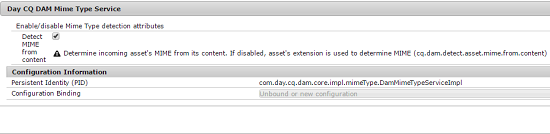

# Detect MIME type of assets using [!DNL Apache Tika] {#detecting-mime-type-of-assets-using-apache-tika}

Normally, [!DNL Adobe Experience Manager Assets] detects the MIME type of assets that you upload from their file extension.

If you use [!DNL Apache Tika] to upload assets, [!DNL Assets] detects their MIME type from the content stream during the upload operation instead of the file extension.

This feature is disabled by default. To enable the feature, configure the **[!UICONTROL Day CQ DAM Mime Type]** service from [!UICONTROL Configuration Manager].

>[!NOTE]
>
>MIME type detection using the [!DNL Apache Tika] library is a resource-intensive operation.

1. To open the Configuration Manager web console, access `https://[aem_server]:[port]/system/console/configMgr`.

1. From the list of services, locate **[!UICONTROL Day CQ DAM Mime Type Service]** and click **[!UICONTROL Edit]**.

1. Select the **[!UICONTROL Detect MIME from content]** option to enable the parsing of uploaded assets to determine their MIME type while ignoring file extensions. By default, this option is unselected.

   

1. Click **[!UICONTROL Save]** to save the changes.
