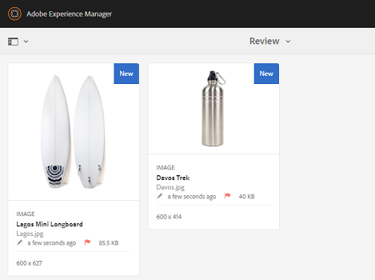
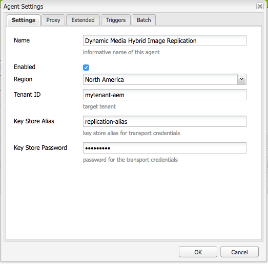
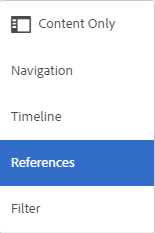
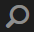
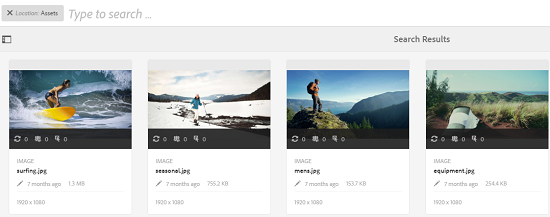
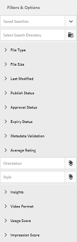
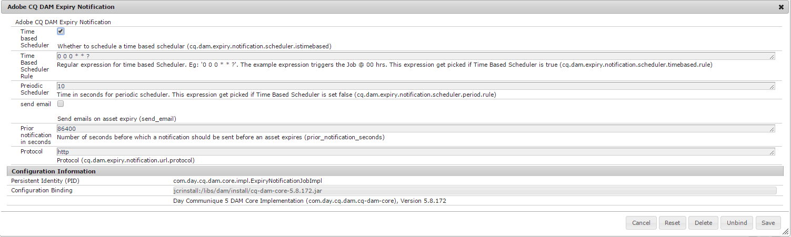
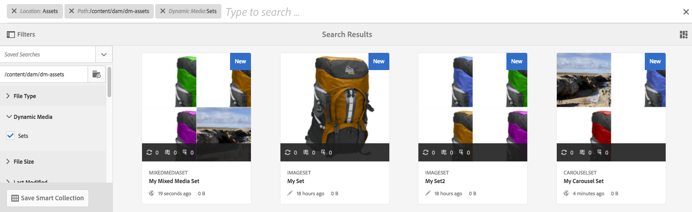
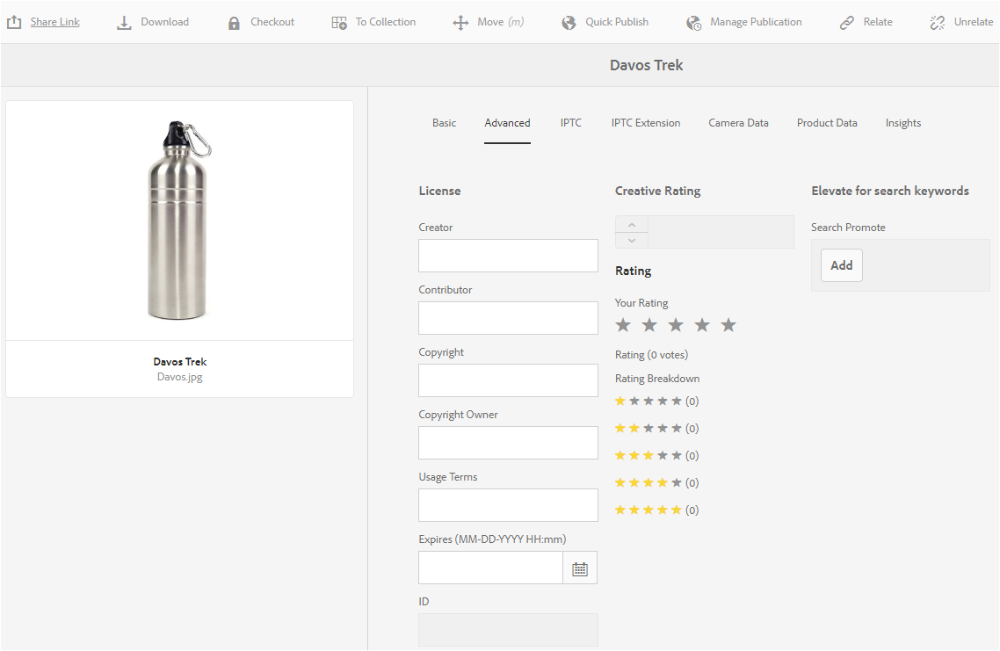
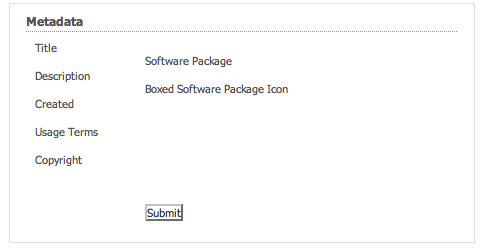

# Digital Rights Management in Assets {#digital-rights-management-in-assets}

Digital assets are often associated with a license, which specifies their terms and duration of use. Because Adobe Experience Manager (AEM) Assets is fully integrated with the AEM platform, you can efficiently manage asset expiration information and asset states. You can also associate licensing information with assets.

## Asset expiration {#asset-expiration}

Asset expiration is an effective way of enforcing license requirements for assets. It ensures that the published asset is unpublished when it expires, which averts the possibility of any license violation. A user without administrator rights cannot edit, copy, move, publish, and download an expired asset.

You can view the expiration status for an asset in the Assets console in both the Card and List views.

**Card view**

For an expired asset, a flag on the card indicates that it has expired.

**List view**

For expired assets, the **[!UICONTROL Status]** column displays the **[!UICONTROL Expired]** banner.

You can view the expiration status of an asset in the timeline. Select the asset and choose Timeline from the GlobalNav menu.

You can also view the expiration status of assets in the **[!UICONTROL References]** rail. It manages asset expiration statuses and relationships between compound assets and referenced subassets, collections, and projects.

1. Navigate to the asset for which you want to view referencing web pages and compound assets.
1. Select the asset, and click/tap the global navigation icon.

   

1. Choose **[!UICONTROL References]** from the menu.

   

   For expired assets, the References rail displays the expiry status **[!UICONTROL Asset is Expired]** at the top. 

   

   If the asset has expired subassets, the References rail displays the status **[!UICONTROL Asset has Expired Sub-Assets]**.

   

### Search expired assets {#search-expired-assets}

You can search for expired assets, including expired subassets in the Search panel.

1. In the Assets console, click the **Search** icon in the toolbar to display the Omni Search box.

   

1. With the cursor in the Omni Search box, hit the Return key to display the Search Results page. 

   

1. Click the GlobalNav icon to display the Search panel.

   

1. Click/tap the **[!UICONTROL Expiry Status]** option to expand it.

   

1. Select **[!UICONTROL Expired]**. The expired assets are displayed in search results.

   

When you choose the **Expired** option, the Assets console only displays the expired assets and subassets that are referenced by compound assets. The compound assets that reference expired subassets are not displayed immediately after the subassets expire. Instead, they are displayed after AEM Assets detects that they reference expired subassets the next time the scheduler runs.

If you modify the expiration date of a published asset to a date earlier than the current scheduler cycle, the schedule still detects this asset as an expired asset in the next time it runs and reflects is status accordingly.

In addition, if a glitch or error prevents the scheduler from detecting expired assets in the current cycle, the scheduler re-examines these assets in the next cycle and detects their expired status.

To enable the Assets console to display the referencing compound assets along with the expired subassets, configure an **Adobe CQ DAM Expiry Notification** workflow in AEM Configuration Manager.

1. Open AEM Configuration Manager.
1. Choose **[!UICONTROL Adobe CQ DAM Expiry Notification]**. By default, **[!UICONTROL Time based Scheduler]** is selected, which schedules a job to check at a specific time whether an asset has expired subassets. After the job completes, assets that have expired subassets and referenced assets are displayed as expired in search results.

   

1. To run the job periodically, clear the **[!UICONTROL Time Based Scheduler Rule]** field and modify the time in seconds in the **[!UICONTROL Periodic Scheduler]** field. For example, the example expression '0 0 0 &ast; &ast; ?' triggers the job at 00 hrs.
1. Select **[!UICONTROL send email]** to receive emails when an asset expires.

   >[!NOTE]
   >
   >Only the asset creator (the person who uploads a particular asset to AEM Assets) receives an email when the asset expires. See [Configuring Email Notification](/help/sites-administering/notification.md) for additional details around configuring email notifications at the overall AEM level.

1. In the **[!UICONTROL Prior notification in seconds]** field, specify the time in seconds prior to the time an asset expires when you want to receive a notification regarding the expiration. If you are an administrator or the asset creator, you receive a message before the expiration of the asset notifying you that the asset is about to expire after the specified time.

   After the asset expires, you receive another notification that confirms the expiration. In addition, the expired assets are deactivated.

1. Click **[!UICONTROL Save]**.

## Asset states {#asset-states}

The Assets console of Adobe Experience Manager (AEM) Assets can display various states for assets. Depending on the current state of a particular asset, its card view displays a label that describes its state, for example, Expired, Published, Approved, Rejected, and so on.

1. In the Assets user interface, select an asset.

   

1. Tap/click the **[!UICONTROL Publish]** icon from the toolbar. If you can't see the **Publish** icon on the toolbar, tap/click **[!UICONTROL More]** on the toolbar and locate the **[!UICONTROL Publish]** icon.

   

1. Choose **[!UICONTROL Publish]** from the menu, and then close the confirmation dialog.
1. Exit the selection mode. The publication status for the asset appears at the bottom of the asset thumbnail in the card view. In the list view, the Published column displays the time when the asset was published.

   

1. In the Assets UI, select an asset and tap/click the **[!UICONTROL Properties]** icon to display its asset details page.

   

1. In the Advanced tab, and set an expiration date for the asset from the **[!UICONTROL Expires]** field under.

   

1. Click **[!UICONTROL Save]** and then click **[!UICONTROL Close]** to display the Asset console. 
1. The publication status for the asset indicates an expired status at the bottom of the asset thumbnail in the card view. In the list view, the status of the asset is displayed as **[!UICONTROL Expired]**.

   

1. In the Assets console, select a folder and create a review task on the folder.
1. Review and approve/reject the assets in the review task and click **[!UICONTROL Complete]**.
1. Navigate to the folder for which you created the review task. The status for the assets that you approved/reject is displayed at the bottom in the card view. In the list view, the approval and expiry statuses are diaplayed in appropriate columns.

   

1. To search for assets based on their status, click/tap the **[!UICONTROL Search]** icon to display the Omni Search bar.

   

1. Hit the Return key and then click/tap the **[!UICONTROL GlobalNav]** icon to display the Search panel. 
1. In the Search panel, tap/click **[!UICONTROL Publish Status]** and select **[!UICONTROL Published]** to search for published assets in AEM Assets.

   

1. Tap/click **[!UICONTROL Approval Status]** and click the appropriate option to search for approved or rejected assets.

   

1. To search for assets based on their expiration status, select **[!UICONTROL Expiry Status]** in the Search panel and choose the appropriate option.

   

1. You can also search for assets based on a combination of statuses under various search facets. For example, you can search for published assets that have been approved in a review task and have not yet expired by selecting the appropriate options in the search facets.

   

## Digital Rights Management in Assets {#digital-rights-management-in-assets-1}

This feature enforces the acceptance of the license agreement before you can download a licensed asset from Adobe Experience Manager (AEM) Assets.

If you select a protected asset and click the **[!UICONTROL Download]** icon, you are redirected to a license page where you accept the license agreement. If you do not accept the license agreement, the **[!UICONTROL Download]** button is disabled.

If the selection contains multiple protected assets, select one asset at a time, accept the license agreement, and proceed to download the asset.

An asset is considered protected if either of these conditions are fulfilled:

* The asset metadata property `xmpRights:WebStatement` points to the path of the CQ page that contains the license agreement for the asset.
* The value of the asset metadata property `adobe_dam:restrictions` is a raw HTML that specifies the license agreement.

>[!NOTE]
>
>The location */etc/dam/drm/licences* used for storing licenses in earlier releases of AEM is deprecated.
>
>If you create or modify licence pages, or port them from previous AEM releases, Adobe recommends that you store them under */apps/settings/dam/drm/licenses* or */conf/&ast;/settings/dam/drm/licenses*.

### Downloading DRM assets {#downloading-drm-assets}

1. In the Card view, select the assets you want to download and click the **[!UICONTROL Download]** icon.
1. In the **[!UICONTROL Copyright Management]** page, select the asset you want to download from the list.
1. In the License pane, choose **[!UICONTROL Agree]**. A tick mark appears beside the asset for which you accept the license agreement. Tap/click the **[!UICONTROL Download]** button.

   >[!NOTE]
   >
   >The **[!UICONTROL Download]** button is enabled only when you choose to agree to the license agreement for a protected asset. However, if your selection comprises both protected and unprotected assets, only the protected assets are listed in the left pane and the **[!UICONTROL Download]** button is enabled to download the unprotected assets. To simultaneously accept license agreements for multiple protected assets, select the assets from the list and then choose **[!UICONTROL Agree]**.

   

1. In the dialog, tap/click **[!UICONTROL Download]** to download the asset or its renditions.

