# Digital Rights Management for assets {#digital-rights-management-in-assets}

| Version | Article link |
| -------- | ---------------------------- |
| AEM as a Cloud Service  |    [Click here](https://experienceleague.adobe.com/docs/experience-manager-cloud-service/content/assets/manage/drm.html?lang=en)                  |
| AEM 6.5     | This article         |

Digital assets are often associated with a license that specifies the terms and duration of use. Because [!DNL Adobe Experience Manager Assets] is fully integrated with the [!DNL Experience Manager] platform, you can efficiently manage asset expiration information and asset states. You can also associate licensing information with assets.

## Asset expiration {#asset-expiration}

Asset expiration is an effective way to enforce license requirements for assets. It ensures that the published asset is unpublished when it expires, which averts the possibility of any license violation. A user without administrator permissions cannot edit, copy, move, publish, and download an expired asset.

You can view the expiration status of an asset in the [!DNL Assets] console in both the card and list views.

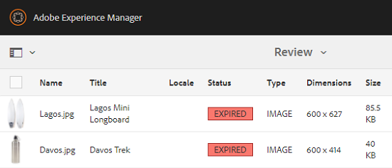

*Figure: In list view, the [!UICONTROL Status] column displays the [!UICONTROL Expired] banner.*

You can view the expiration status of an asset in the [!UICONTROL Timeline] in left rail.

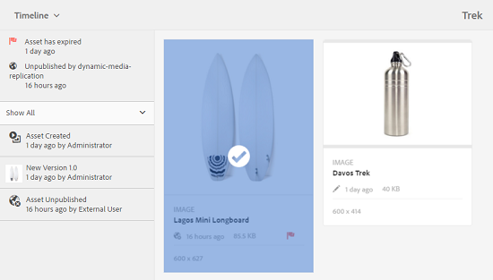

>[!NOTE]
>
>The expiration date of an asset is displayed differently for users in different timezones.

You can also view the expiration status of assets in the **[!UICONTROL References]** rail. It manages asset expiration statuses and relationships between compound assets and referenced subassets, collections, and projects.

1. Navigate to the asset for which you want to view referencing web pages and compound assets.
1. Select the asset and open **[!UICONTROL References]** in left rail. For expired assets, the [!UICONTROL References] rail displays the expiry status **[!UICONTROL Asset is Expired]** at the top.

   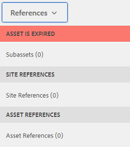

   If the asset has expired subassets, the [!UICONTROL References] rail displays the status **[!UICONTROL Asset has Expired Sub-Assets]**.

   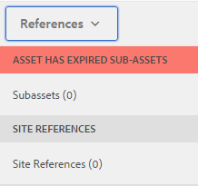

### Search expired assets {#search-expired-assets}

You can search for expired assets, including expired subassets in the Search panel.

1. In the [!DNL Assets] console, click the **[!UICONTROL Search]** in the toolbar to display the Omnisearch box.

1. With the cursor in the Omnisearch box, select the `Enter` key to display the search results page.
1. Open the search panel in the left rail. Click the **[!UICONTROL Expiry Status]** option to expand it.

   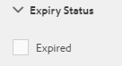

1. Choose **[!UICONTROL Expired]**. Only the expired assets are displayed after filtering the search results.

When you choose the **[!UICONTROL Expired]** option, the [!DNL Assets] console only displays the expired assets and subassets that are referenced by compound assets. The compound assets that reference expired subassets are not displayed immediately after the subassets expire. Instead, they are displayed after [!DNL Experience Manager] detects that they reference expired subassets the next time the scheduler runs.

If you modify the expiration date of a published asset to a date earlier than the current scheduler cycle, the schedule still detects this asset as an expired asset in the next time it runs and reflects is status accordingly.

In addition, if a glitch or error prevents the scheduler from detecting expired assets in the current cycle, the scheduler re-examines these assets in the next cycle and detects their expired status.

To enable the [!DNL Assets] console to display the referencing compound assets along with the expired subassets, configure an **[!UICONTROL Adobe CQ DAM Expiry Notification]** workflow in [!DNL Experience Manager] Configuration Manager.

1. Open [!DNL Experience Manager] Configuration Manager.
1. Choose **[!UICONTROL Adobe CQ DAM Expiry Notification]**. By default, **[!UICONTROL Time based Scheduler]** is selected, which schedules a job to check at a specific time whether an asset has expired subassets. After the job completes, assets that have expired subassets and referenced assets are displayed as expired in search results.

1. To run the job periodically, clear the **[!UICONTROL Time Based Scheduler Rule]** field and modify the time in seconds in the **[!UICONTROL Periodic Scheduler]** field. For example, the example expression `0 0 0 * * ?` triggers the job at 00 hrs.
1. Select **[!UICONTROL send email]** to receive emails when an asset expires.

   >[!NOTE]
   >
   >Only the asset creator (the person who uploads a particular asset to [!DNL Assets]) receives an email when the asset expires. See [how to configure email notification](/help/sites-administering/notification.md) for additional details around configuring email notifications at the overall [!DNL Experience Manager] level.

1. In the **[!UICONTROL Prior notification in seconds]** field, specify the time in seconds prior to the time an asset expires when you want to receive a notification regarding the expiration. Asset creators receive a message before the expiration of the asset notifying you that the asset is about to expire after the specified time. After the asset expires, you receive another notification that confirms the expiration. In addition, the expired assets are deactivated.

1. Click **[!UICONTROL Save]**.

## Asset states {#asset-states}

The [!DNL Assets] console can display various states for assets. Depending on the current state of a particular asset, its card view displays a label that describes its state, for example, Expired, Published, Approved, Rejected, and so on.

1. In the [!DNL Assets] user interface, select an asset.
1. Click **[!UICONTROL Publish]** from the toolbar. If you don't see **Publish** on the toolbar, click **[!UICONTROL More]** on the toolbar and locate **[!UICONTROL Publish]**  option.
1. Choose **[!UICONTROL Publish]** from the menu, and then close the confirmation dialog.
1. Exit the selection mode. The publication status for the asset appears at the bottom of the asset thumbnail in the card view. In the list view, the Published column displays the time when the asset was published.

   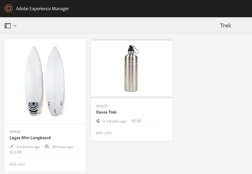

1. To display its asset details page, in the [!DNL Assets] interface, select an asset and click **[!UICONTROL Properties]** .

1. In the [!UICONTROL Advanced] tab, set an expiration date for the asset from the **[!UICONTROL Expires]** field.

   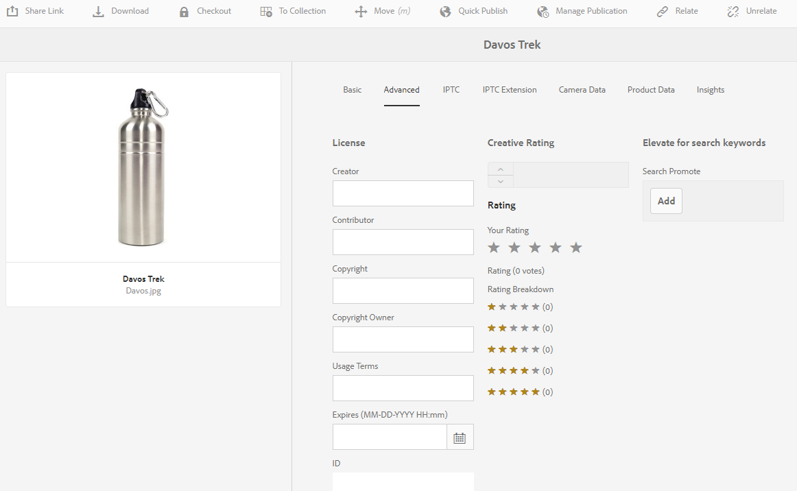

   *Figure: [!UICONTROL Advanced] tab in asset [!UICONTROL Properties] page to set asset expiration.*

1. Click **[!UICONTROL Save]** and then click **[!UICONTROL Close]** to display the Asset console.
1. The publication status for the asset indicates an expired status at the bottom of the asset thumbnail in the card view. In the list view, the status of the asset is displayed as **[!UICONTROL Expired]**.

   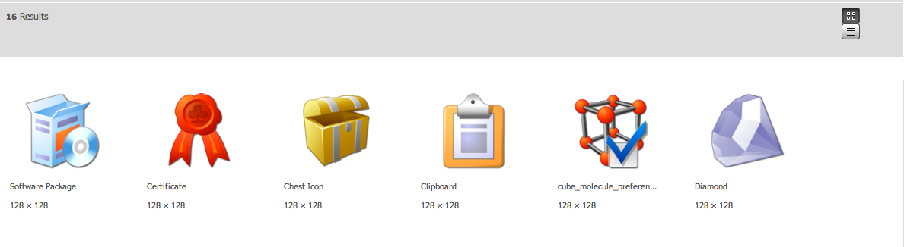

1. In the [!DNL Assets] console, select a folder and create a review task on the folder.
1. Review and approve/reject the assets in the review task and click **[!UICONTROL Complete]**.
1. Navigate to the folder for which you created the review task. The status for the assets that you approved/reject is displayed at the bottom in the card view. In the list view, the approval and expiry statuses are displayed in appropriate columns.

   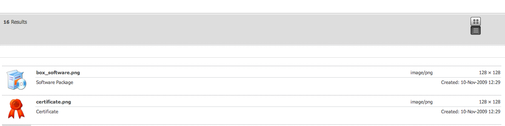

1. To search for assets based on their status, click **[!UICONTROL Search]**  to display the Omnisearch bar.
1. Select `Return` and click [!DNL Experience Manager] to display the search panel.
1. In the search panel, click **[!UICONTROL Publish Status]** and select **[!UICONTROL Published]** to search for published assets in [!DNL Assets].

   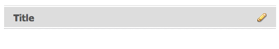

1. Click **[!UICONTROL Approval Status]** and click the appropriate option to search for approved or rejected assets.

   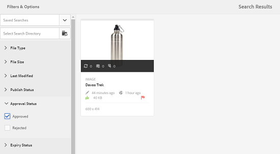

1. To search for assets based on their expiration status, select **[!UICONTROL Expiry Status]** in the Search panel and choose the appropriate option.

   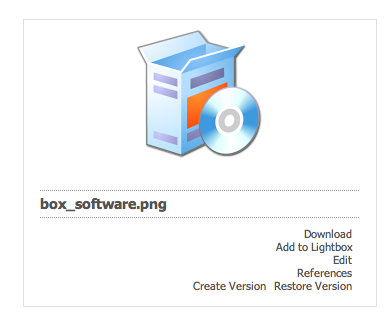

1. You can also search for assets based on a combination of statuses under various search facets. For example, you can search for published assets that have been approved in a review task and have not yet expired by selecting the appropriate options in the search facets.

   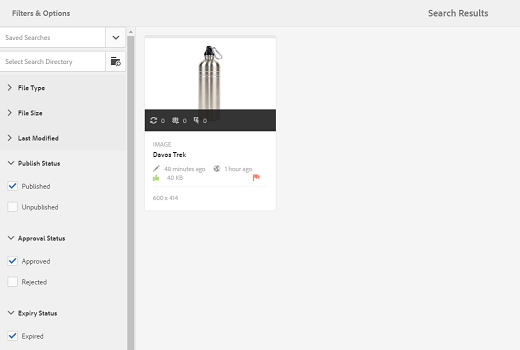

## Digital Rights Management in [!DNL Assets] {#digital-rights-management-in-assets-1}

This feature enforces the acceptance of the license agreement before you can download a licensed asset from [!DNL Adobe Experience Manager Assets].

If you select a protected asset and click **[!UICONTROL Download]**, you are redirected to a license page to accept the license agreement. If you do not accept the license agreement, the **[!UICONTROL Download]** option is not available.

If the selection contains multiple protected assets, select one asset at a time, accept the license agreement, and proceed to download the asset.

An asset is considered protected if either of these conditions are fulfilled:

* The asset metadata property `xmpRights:WebStatement` points to the path of the page that contains the license agreement for the asset.
* The value of the asset metadata property `adobe_dam:restrictions` is a raw HTML that specifies the license agreement.

>[!NOTE]
>
>The location `/etc/dam/drm/licenses` used for storing licenses in earlier releases of [!DNL Experience Manager] is deprecated.
>
>If you create or modify licence pages, or port them from previous [!DNL Experience Manager] releases, Adobe recommends that you store them under `/apps/settings/dam/drm/licenses` or `/conf/&ast;/settings/dam/drm/licenses`.

### Download DRM-protected assets {#downloading-drm-assets}

1. In the card view, select the assets you want to download and click **[!UICONTROL Download]**.
1. In the **[!UICONTROL Copyright Management]** page, select the asset you want to download from the list.
1. In the [!UICONTROL License] pane, choose **[!UICONTROL Agree]**. A check mark appears next to the asset. Click the **[!UICONTROL Download]** option.

   >[!NOTE]
   >
   >The **[!UICONTROL Download]** option is enabled only when you choose to agree to the license agreement for a protected asset. However, if your selection comprises both protected and unprotected assets, only the protected assets are listed in the pane and the **[!UICONTROL Download]** option is enabled to download the unprotected assets. To simultaneously accept license agreements for multiple protected assets, select the assets from the list and then choose **[!UICONTROL Agree]**.

   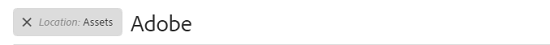

1. In the dialog, click **[!UICONTROL Download]** to download the asset or its renditions.
