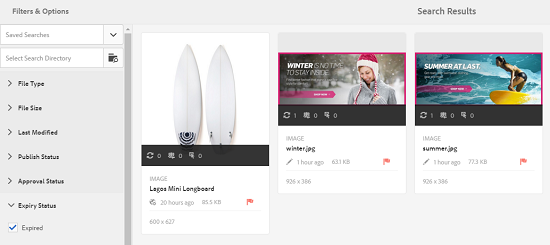

# Enable detection of duplicate assets {#enable-detection-of-duplicate-assets}

If you attempt to upload an asset that exists in Adobe Experience Manager (AEM) Assets, the duplicate detection feature identifies it as duplicate. Duplicate detection is disabled by default. To enable the feature, do the following steps:

1. Open the AEM Web Console Configuration page by accessing `https://[aem_server]:[port]/system/console/configMgr`.
1. Edit the configuration for the servlet **[!UICONTROL Day CQ DAM Create Asset]**.
1. Select the **[!UICONTROL detect duplicate]** option, and click/tap **[!UICONTROL Save]**.

   

   Select detect duplicate option in the servlet

The detect duplicate feature is now enabled in AEM Assets. When a user attempts to upload an asset that exists in AEM, the system checks for conflict and indicates it. The assets are identified using SHA-1 hash stored at `jcr:content/metadata/dam:sha1`, which means duplicate assets are detected irrespective of the filenames.

>[!MORELIKETHIS]
>
>[Duplicate assets in existing repository (a tutorial from community member)](https://experience-aem.blogspot.com/2019/06/aem-65-find-duplicate-assets-binaries-in-existing-repository.html)
