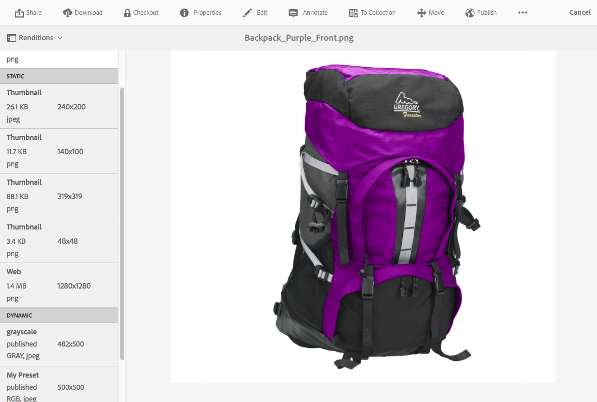
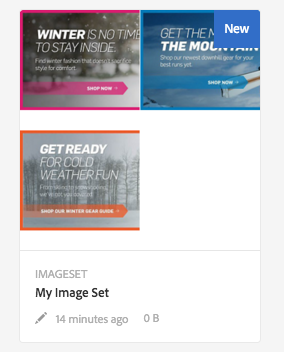
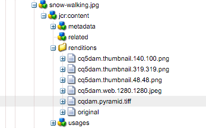
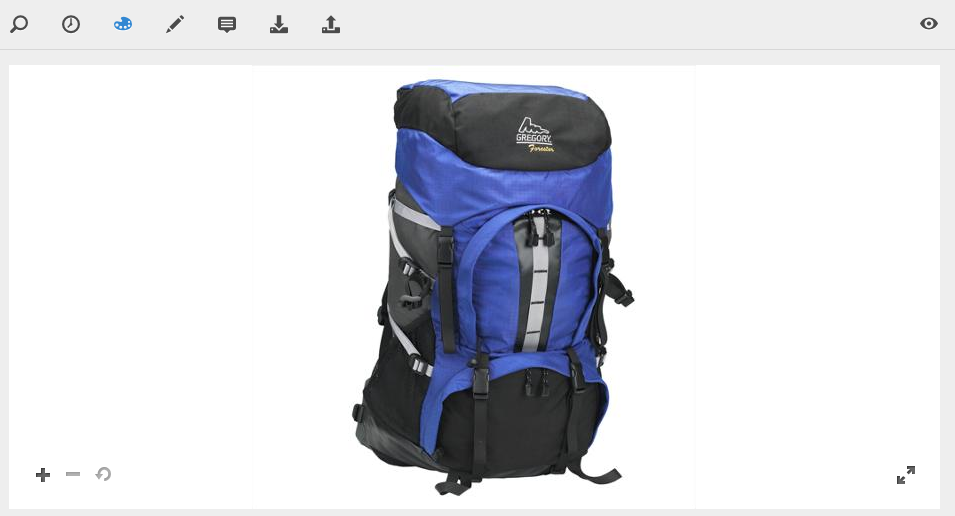
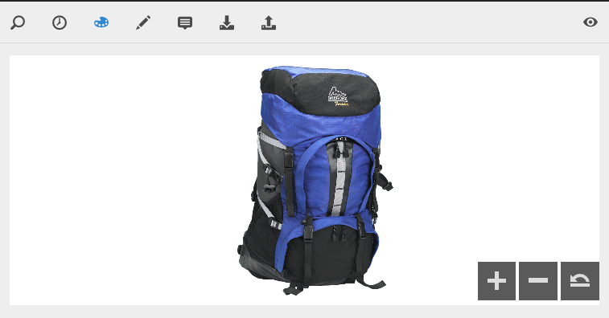

# Work with Dynamic Media {#working-with-dynamic-media}

[Dynamic Media](https://business.adobe.com/products/experience-manager/assets/dynamic-media.html) helps deliver rich visual merchandising and marketing assets on demand, automatically scaled for consumption on web, mobile, and social sites. Using a set of primary source assets, the software generates and delivers multiple variations of rich content in real time through its global, scalable, performance-optimized network.

The software serves interactive viewing experiences, including zoom, 360-degree spin, and video. It uniquely incorporates the workflows of the Adobe Experience Manager digital asset management (Assets) solution to simplify and streamline the digital campaign management process.

<!-- >ARTICLE IS MISSING. GIVES 404 [!NOTE]
>
>A Community article is available on [Working with Adobe Experience Manager and Dynamic Media](https://helpx.adobe.com/experience-manager/using/aem_dynamic_media.html). -->

## What you can do with the software {#what-you-can-do-with-dynamic-media}

The software lets you manage your assets before publishing them. How to work with assets in general is covered in detail in [Work with digital assets](manage-assets.md). General topics include uploading, downloading, editing, and publishing assets; viewing and editing properties, and searching for assets.

Dynamic Media-only features include the following:

* [Carousel Banners](carousel-banners.md)
* [Image Sets](image-sets.md)
* [Interactive Images](interactive-images.md)
* [Interactive Videos](interactive-videos.md)
* [Mixed Media Sets](mixed-media-sets.md)
* [Panoramic Images](panoramic-images.md)

* [Spin Sets](spin-sets.md)
* [Video](video.md)
* [Deliver Dynamic Media assets](delivering-dynamic-media-assets.md)
* [Manage assets](managing-assets.md)
* [Create custom pop-ups using Quickview](custom-pop-ups.md)

See also [Set up Dynamic Media](administering-dynamic-media.md).

>[!NOTE]
>
>To understand the differences between using Dynamic Media and integrating Dynamic Media Classic with Adobe Experience Manager, see [Dynamic Media Classic integration versus Dynamic Media](/help/sites-administering/scene7.md#aem-scene-integration-versus-dynamic-media).

## Dynamic Media enabled versus Dynamic Media disabled {#dynamic-media-on-versus-dynamic-media-off}

You can tell whether the software is enabled (turned on) by the following characteristics:

* Dynamic renditions are available when downloading or previewing assets.
* Image sets, spin sets, mixed media sets are available.
* PTIFF renditions are created.

When you select an image asset, the view of the asset is different with the software [enabled](config-dynamic.md#enabling-dynamic-media). It uses the on-demand HTML5 viewers.

### Dynamic renditions {#dynamic-renditions}

Dynamic renditions such as image and viewer presets (under **[!UICONTROL Dynamic]**) are available when the software is enabled.

### Image sets, spins sets, mixed media sets {#image-sets-spins-sets-mixed-media-sets}

Image sets, spin sets, and mixed media sets are available if the software is enabled.

### PTIFF renditions {#ptiff-renditions}

Dynamic Media-enabled assets include `pyramid.tiffs`.

### Asset views change {#asset-views-change}

With the software enabled, you can zoom in and out by clicking the `+` and `-` buttons. You can also click to zoom into certain area. Revert brings you to the original version and you can make the image full screen by clicking the diagonal arrows. With the software enabled, it looks like this:

With the software disabled, you can zoom in and out and revert to the original size:

