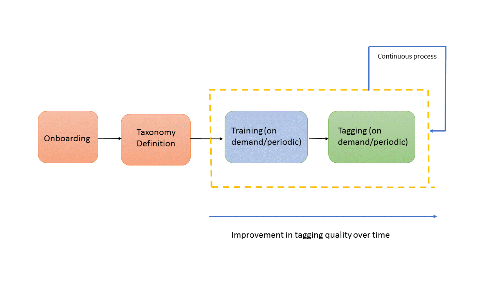
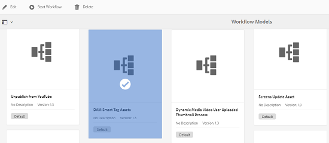
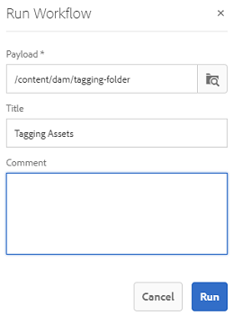
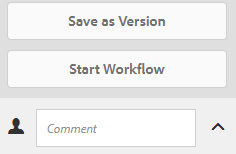

# Understand, apply, and curate Smart Tags {#enhanced-smart-tags}

| Version | Article link |
| -------- | ---------------------------- |
| AEM as a Cloud Service  |    [Click here](https://experienceleague.adobe.com/docs/experience-manager-cloud-service/content/assets/manage/smart-tags.html?lang=en)                  |
| AEM 6.5     | This article         |

Organizations that deal with digital assets increasingly use taxonomy-controlled vocabulary in asset metadata. Essentially, it includes a list of keywords that employees, partners, and customers commonly use to refer to and search for digital assets of a particular class. Tagging assets with taxonomy-controlled vocabulary ensures that assets are easily identified and retrieved.

Compared to natural language vocabularies, tagging digital assets based on business taxonomy helps align them with a company's business and ensures that the most relevant assets appear in searches.

For example, a car manufacturer can tag car images with model names so only relevant images appear when images of various models are searched to design a promotion campaign.

For the Smart Content Service to apply the right tags, train it to recognize your taxonomy. To train the service, first curate a set of assets and tags that best describe these assets. To help the service learn, apply these tags on the assets and run a training workflow.

Once a tag is trained and ready, the service can now apply these tags on assets through a tagging workflow.

In the background, the Smart Content Service uses Adobe Sensei AI framework to train its image recognition algorithm on your tag structure and business taxonomy. This content intelligence is then used to apply relevant tags on a different set of assets.

Smart Content Service is a cloud service that is hosted on [!DNL Adobe Developer Console]. To use it in [!DNL Adobe Experience Manager], the system administrator must integrate your [!DNL Experience Manager] deployment with [!DNL Adobe Developer Console].

In summary, here are the main steps to use the Smart Content Service:

* Onboarding
* Reviewing assets and tags (taxonomy definition)
* Training the Smart Content Service
* Automatic tagging

## Prerequisites and supported formats {#prerequisites}

Before you can use the Smart Content Service, ensure the following to create an integration on [!DNL Adobe Developer Console]:

* An Adobe ID account with administrator privileges for the organization.
* Enable the Smart Content Service service for your organization.
* To add Smart Content Services Base Package to a deployment, license [!DNL Adobe Experience Manager Sites] Base Package and [!DNL Assets] add-on.

The service applies Smart Tags to assets of the following MIME types:

* `image/jpeg`
* `image/tiff`
* `image/png`
* `image/bmp`
* `image/gif`
* `image/pjpeg`
* `image/x-portable-anymap`
* `image/x-portable-bitmap`
* `image/x-portable-graymap`
* `image/x-portable-pixmap`
* `image/x-rgb`
* `image/x-xbitmap`
* `image/x-xpixmap`
* `image/x-icon`
* `image/photoshop`
* `image/x-photoshop`
* `image/psd`
* `image/vnd.adobe.photoshop`

The service applies Smart Tags to asset renditions of the following MIME types:

* `image/jpeg`
* `image/pjpeg`
* `image/png`

## Onboarding {#onboarding}

The Smart Content Service is available for purchase as an add-on to [!DNL Experience Manager]. After you purchase, an email is sent to the administrator of your organization with a link to [!DNL Adobe I/O].

The administrator can follow the link to integrate the Smart Content Service with [!DNL Experience Manager]. To integrate the service with [!DNL Experience Manager Assets], see [Configure Smart Tags](config-smart-tagging.md).

The onboarding process is complete when the administrator configures the service and adds users in [!DNL Experience Manager].

## Review assets and tags {#reviewing-assets-and-tags}

After you are onboard, the first thing you want to do is identify a set of tags that best describe these images in the context of your business.

Next, review images to identify a set of images that best represent your product for a particular business requirement. Ensure that the assets in your curated set conform to [Smart Content Service training guidelines](/help/assets/config-smart-tagging.md#training-the-smart-content-service).

Add the assets to a folder and apply the tags to each asset from the properties page. Then, run the training workflow on this folder. The curated set of assets enables the Smart Content Service to effectively train more assets using your taxonomy definitions.

>[!NOTE]
>
>1. Training is an irrevocable process. Adobe recommends that you review the tags in the curated set of assets well before training the Smart Content Service on the tags.
>1. Before training for a tag, see [Smart Content Service training guidelines](/help/assets/config-smart-tagging.md#training-the-smart-content-service).
>1. When you train the Smart Content Service for the first time, Adobe recommends that you train it on at least two distinct tags.

## Understand [!DNL Experience Manager] search results with smart tags {#understandsearch}

By default, [!DNL Experience Manager] search combines the search terms with an `AND` clause. Using smart tags does not change this default behavior. Using smart tags adds an extra `OR` clause to find any of the search terms that are related to the smart tags. For example, consider searching for `woman running`. Assets with just `woman` or just `running` keyword in the metadata do not appear in the search results by default. However, an asset tagged with either `woman` or `running` using smart tags appears in such a search query. So the search results are a combination of,

* Assets with `woman` and `running` keywords in the metadata.

* Assets smart tagged with either of the keywords.

The search results that match all search terms in metadata fields are displayed first, followed by the search results that match any of the search terms in the smart tags. In the above example, the approximate order of display of search results is:

1. Matches of `woman running` in the various metadata fields.
1. Matches of `woman running` in smart tags.
1. Matches of `woman` or of `running` in smart tags.

>[!CAUTION]
>
>If the Lucene indexing is done out of [!DNL Adobe Experience Manager], then the search based on smart tags does not work as expected.

## Automatically tag assets {#tagging-assets-automatically}

After you have trained the Smart Content Service, you can trigger the tagging workflow to automatically apply appropriate tags on a different set of similar assets.

You can run the tagging workflow periodically or whenever required.

>[!NOTE]
>
>The tagging workflow runs on both assets and folders.

### Periodic tagging {#periodic-tagging}

You can enable the Smart Content Service to periodically tag assets within a folder. Open the properties page of your asset folder, select **[!UICONTROL Enable Smart Tags]** under the **[!UICONTROL Details]** tab, and save the changes.

Once this option is selected for a folder, the Smart Content Service automatically tags the assets within the folder. By default, the tagging workflow runs every day at 12:00 AM.

### On-demand tagging {#on-demand-tagging}

You can trigger the tagging workflow from the workflow console or from the timeline to instantly tag your assets.

>[!NOTE]
>
>If you run the tagging workflow from the timeline, you can apply tags on a maximum of 15 assets at a time.

#### Tag assets from the workflow console {#tagging-assets-from-the-workflow-console}

1. In [!DNL Experience Manager] interface, go to **[!UICONTROL Tools]** > **[!UICONTROL Workflow]** > **[!UICONTROL Models]**.
1. From the **[!UICONTROL Workflow Models]** page, select the **[!UICONTROL DAM Smart Tags Assets]** workflow and then click **[!UICONTROL Start Workflow]** from the toolbar.

   

1. In the **[!UICONTROL Run Workflow]** dialog, browse to the payload folder containing assets on which you want to apply your tags automatically.
1. Specify a title for the workflow and an optional comment. Click **[!UICONTROL Run]**.

   

   To verify whether the Smart Content Service tagged your assets properly, navigate to the asset folder and review the tags.

#### Tag assets from the timeline {#tagging-assets-from-the-timeline}

1. From the [!DNL Assets] user interface, select the folder containing assets or specific assets to which you want to apply smart tags.
1. From upper-left corner, open the **[!UICONTROL Timeline]**.
1. Open actions from the bottom of the left sidebar and click **[!UICONTROL Start Workflow]**.

   

1. Select the **[!UICONTROL DAM Smart Tag Assets]** workflow, and specify a title for the workflow.
1. Click **[!UICONTROL Start]**. The workflow applies tags on the assets. to verify whether the Smart Content Service tagged your assets properly, navigate to the asset folder and review the tags.

>[!NOTE]
>
>In the subsequent tagging cycles, only the modified assets are tagged again with newly trained tags. However, even unaltered assets are tagged if the gap between the last and current tagging cycles for the tagging workflow exceeds 24 hours. For periodic tagging workflows, unaltered assets are tagged when the time gap exceeds six months.

## Curate or moderate the applied smart tags {#manage-smart-tags}

You can curate Smart tags to remove any inaccurate tags that are assigned to your brand images so that only the most relevant tags are displayed.

Moderating Smart tags also helps refine tag-based searches for images by ensuring that your image appears in search results for the most relevant tags. Essentially, it helps eliminate the chances of unrelated images from showing up in search results.

You can also assign a higher rank to a tag to increase its relevance for an image. Promoting a tag for an image increases the chances of the image appearing in search results when the particular tag is searched.

1. In the search box, search for assets based using a tag as a keyword.
1. To identify an image that you do not find relevant to your search, review the search results.
1. Select the image, and click **[!UICONTROL Manage Tags]** from the toolbar.
1. From the **[!UICONTROL Manage Tags]** page, review the tags. If you don't want the image to be searched based on a specific tag, select the tag and then click **[!UICONTROL Delete]** from the toolbar. Alternatively, click `x` symbol that appears next to a tag.
1. Optionally, to assign a higher rank to a tag, select the tag and click **[!UICONTROL Promote]** from the toolbar. The tag you promote, is moved to the **[!UICONTROL Tags]** section.
1. Click **[!UICONTROL Save]** and then click **[!UICONTROL OK]**
1. Navigate to the **[!UICONTROL Properties]** page for the image. Observe that the tag you promoted is assigned more relevance and appears earlier in the search results.

## Tips and limitations {#tips-best-practices-limitations}

* To train the model, use the most appropriate images. The training cannot be reverted or training model cannot be removed. Your tagging accuracy depends on the current training, so do it carefully.
* Use of Smart Content Services is limited to up to 2 million tagged images per year. Any duplicate images that are processed and tagged are each counted as a tagged image.
* If you run the tagging workflow from the timeline, you can apply tags on a maximum of 15 assets at a time.
* Smart Tags work for only PNG and JPG image formats. So supported assets that have renditions created in these two formats get tagged with Smart Tags.
