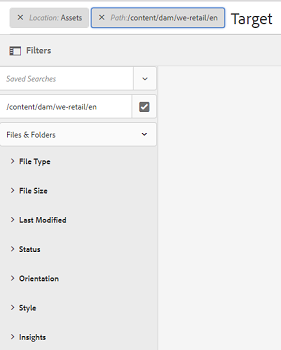
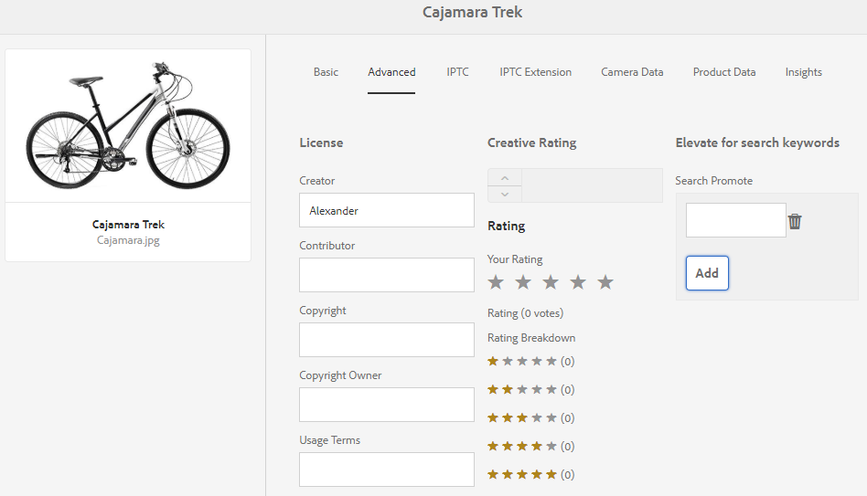
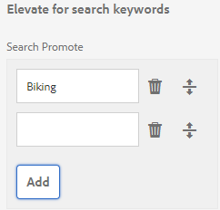

# GQL Full-text Search {#gql-full-text-search}

Explore the GQL full-text search feature in AEM Assets. Use it to search for assets based on specific metadata, such as title, description, and author name.

The GQL full-text search feature lets you search for assets based on specific metadata, such as title, description, author, and so on.

To search for an asset based on its metadata, for example title, specify the metadata keyword followed by its value in the search panel. The GQL full-text search feature will fetch only those assets whose metadata exactly match with the corresponding value you enter.

For example, to search for assets that have the title "Target," perform these steps:

## Searching Assets {#searching-assets}

1. From the toolbar of the Assets user interface, click or tap the **[!UICONTROL Search]** icon to display the Omnisearch box.

   

1. With the cursor in the Omnisearch box, press Enter.
1. Click or tap the GlobalNav icon to display the **[!UICONTROL Filters]** panel.
1. In the Omni Search box, specify the value "Target." To limit your search to a specific folder, click or tap the Browse icon in the Filters panel and select the folder. In this case, the match is searched for only within the folder and the subfolders under it.

   >[!NOTE]
   >
   >You can also perform full-text search on folder. In this case, you must specify a non-empty full-text search term.

   

1. Press **[!UICONTROL Enter]**. The AEM Assets user interface displays only those assets whose title exactly matches "Target."

The GQL full-text search feature lets you search assets based on the following:

* Complex query built by combining through an And operation, the values you specify for multiple metadata fields (properties)
* Multiple values for a single metadata field
* Substring matches

The GQL full-text search feature lets you search for assets based on the following metadata properties. Names of the properties (for example author, title, and so on) as well as values are case sensitive.

>[!NOTE]
>
>GQL full-text search works for full-text predicates only.

<table> 
 <tbody>
  <tr>
   <td>PROPERTY </td> 
   <td>SEARCH FORMAT (FACET VALUE)</td> 
  </tr>
  <tr>
   <td>Title </td> 
   <td>title:John</td> 
  </tr>
  <tr>
   <td>Creator </td> 
   <td>creator:John</td> 
  </tr>
  <tr>
   <td>Contributor </td> 
   <td>contributor:John</td> 
  </tr>
  <tr>
   <td>Location </td> 
   <td>location:India</td> 
  </tr>
  <tr>
   <td>Description </td> 
   <td>description:"Sample Image"</td> 
  </tr>
  <tr>
   <td>Creator tool </td> 
   <td>creatortool:"Adobe Photoshop 7.0"</td> 
  </tr>
  <tr>
   <td>Copyright Owner </td> 
   <td>copyrightowner:"Adobe Systems"</td> 
  </tr>
  <tr>
   <td>Contributor </td> 
   <td>contributor:John</td> 
  </tr>
  <tr>
   <td>Usage Terms </td> 
   <td>usageterms:"CopyRights Reserved"</td> 
  </tr>
  <tr>
   <td>Created</td> 
   <td>
created:YYYY-MM-DDTHH:
 
MM:SS.000+05:30..YYYY-MM-DDTHH:
 
MM:SS.000+05:30
 </td> 
  </tr>
  <tr>
   <td>Expires Date</td> 
   <td>
expires:YYYY-MM-DDTHH:
 
MM:SS.000+05:30..YYYY-MM-DDTHH:
 
MM:SS.000+05:30
 </td> 
  </tr>
  <tr>
   <td>On time</td> 
   <td>
ontime:YYYY-MM-DDTHH:
 
MM:SS.000+05:30..YYYY-MM-DDTHH:
 
MM:SS.000+05:30
 </td> 
  </tr>
  <tr>
   <td>Off time</td> 
   <td>
offtime:YYYY-MM-DDTHH:
 
MM:SS.000+05:30..YYYY-MM-DDTHH:
 
MM:SS.000+05:30
 </td> 
  </tr>
  <tr>
   <td>Range of time(expires dateontime,offtime)</td> 
   <td>facet field : lowerbound..upperbound</td> 
  </tr>
  <tr>
   <td>Path</td> 
   <td>/content/dam/&lt;folder name&gt;</td> 
  </tr>
  <tr>
   <td>PDF Title</td> 
   <td>pdftitle:"Adobe Document"</td> 
  </tr>
  <tr>
   <td>Subject </td> 
   <td>subject:"Training"</td> 
  </tr>
  <tr>
   <td>Tags</td> 
   <td>tags:"Location And Travel"</td> 
  </tr>
  <tr>
   <td>Type</td> 
   <td>type:"image\png"</td> 
  </tr>
  <tr>
   <td>Width of image</td> 
   <td>width:lowerbound..upperbound</td> 
  </tr>
  <tr>
   <td>Height of image</td> 
   <td>height:lowerbound..upperbound</td> 
  </tr>
  <tr>
   <td>Person</td> 
   <td>person:John</td> 
  </tr>
 </tbody>
</table>

Here are some examples of search formats for complex queries:

* To display all assets with multiple facets fields (for example: title=John Doe and creator tool = Adobe Photoshop):

tiltle:"John Doe" creatortool : Adobe&ast;

* To display all assets when the facets value is not a single word but a sentence (for example: title=Scott Reynolds)

title:"Scott Reynolds"

* To display assets with multiple values of a single property (for example: title=Scott Reynolds or John Doe)

title:"Scott Reynolds" OR "John Doe"

* To display assets with property values starting with a specific string (for example: title is Scott Reynolds)

title:"Scott"

* To display assets with property values ending with a specific string (for example: title is Scott Reynolds)

title:"Reynolds"

* To display assets with a property value that contains a specific string (for example: title = Basel Meeting Room)

title:"Meeting";

* To display assets that contain a particular string and have a specific property value (for example: search for string Adobe in assets having title=John Doe)

&ast;Adobe&ast; title:"John Doe "OR title:"John Doe" &ast;Adobe&ast;

>[!NOTE]
>
>The properties path, limit, size, and orderby can't be ORed with any other property.
>
>The keyword for a user-generated property is its field label in the property editor in lowercase, with spaces removed.
>

>[!NOTE]
>
>If you write a JCR query to search for subassets only, the matched referenced assets are also displayed along with the matched subassets.

Full text search also supports operators such as -, ^, and so on. To search these letters as string literals, enclose the search expression in double quotes. For example, use "Notebook - Beauty" instead of Notebook - Beauty.

## Boosting Search {#boosting-search}

You can improve the relevance of keywords for particular assets to help boost searches based on the keywords. In other words, the images for which you promote specific keywords appear at the top of the search results when you search based on these keywords.

1. From the Assets UI, open the properties page for the asset for which you want to promote a keyword.
1. Switch to the **[!UICONTROL Advanced]** tab and click/tap **[!UICONTROL Add]** under **[!UICONTROL Elevate for search keywords]**.

   

1. In the **[!UICONTROL Search Promote]** box, specify a keyword for which you want to boost the search for the image and then click/tap **[!UICONTROL Add]**. In necessary, specify multiple keywords in the same way. 

   

1. Click/tap **[!UICONTROL Save & Close]**.
1. Search for the keyword using the Omnisearch box. The asset for which you promoted this keyword appears among the top search results.

