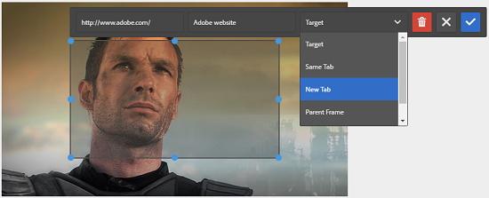
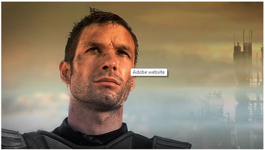

# Add image maps {#adding-image-maps}

Image Maps let you add one or more hyperlinked areas that function like other hyperlinks.

1. Do any one of the following to open **[!UICONTROL In-place Image Editor]**:

   * Using Quick Actions, click **[!UICONTROL Edit]** that appears on an asset in the **[!UICONTROL Card]** view. In the List view, select the asset and click **[!UICONTROL Edit]** option in the toolbar.

        >[!NOTE]
        >
        >Quick Actions is not available in the **[!UICONTROL List]** view.

   * In the **[!UICONTROL Card]** or **[!UICONTROL List]** view, select the asset and click **[!UICONTROL Edit]** on the toolbar.
   * Click **[!UICONTROL Edit]** from the asset page.

1. To insert an image map, click **[!UICONTROL Launch Map]**  from the toolbar.
1. Select the shape of the image map. The hot-spot of the selected shape is placed on the image.

   

1. Click the hot-spot, and enter the URL and Alt text. From the **[!UICONTROL Target]** list, specify where you want the image map displayed, for example, the same tab, a new tab, or an iFrame. For example, enter `https://www.adobe.com` as the URL, `Adobe website` as the Alt text, and specify **[!UICONTROL New Tab]** from the **[!UICONTROL Target]** list for the image map to open in a new tab.

   

1. Click **[!UICONTROL Confirm]** and then click **[!UICONTROL Finish]**  from the toolbar to save the changes.

   To delete the image map, click the hot-spot and click **[!UICONTROL Delete]** .

1. To view the image map, navigate to the asset details page, and hover the cursor over the image.

   

   If the Dynamic Media option is enabled, navigate to the Asset editor and click **[!UICONTROL Map]** to view all the applied image maps.
