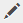

# Adding Image Maps {#adding-image-maps}

Learn how to add hyperlinked image maps to image assets.

Image Maps let you add one or more hyperlinked areas that function like other hyperlinks.

1. Do any one of the following to open **[!UICONTROL In-place Image Editor]**:

    * Using Quick Actions, tap the **[!UICONTROL Edit]** icon that appears on an asset in the **[!UICONTROL Card]** view. In the List view, select the asset and tap the **Edit** icon in the toolbar.

        >[!NOTE]
        >
        >Quick Actions is not available in the **[!UICONTROL List]** view.

    * In the **[!UICONTROL Card]** or **[!UICONTROL List]** view, select the asset and tap the **[!UICONTROL Edit]** icon on the toolbar.
    * Tap the **[!UICONTROL Edit]** icon from the asset page.

       

1. To insert an image map, tap the **[!UICONTROL Launch Map]** icon from the toolbar.

   

1. Select the shape of the image map. The hot-spot of the selected shape is placed on the image.

   

1. Tap the hot-spot, and enter the URL and Alt text. From the **[!UICONTROL Target]** list, specify where you want the image map displayed, for example the same tab, a new tab, or an iFrame. For example, enter `https://www.adobe.com` as the URL, `Adobe website` as the Alt text, and specify **[!UICONTROL New Tab]** from the **[!UICONTROL Target]** list for the image map to open in a new tab.

   

1. Tap the **[!UICONTROL Confirm]** icon, and then tap the **[!UICONTROL Finish]** icon from the toolbar to save the changes.

   

   To delete the image map, tap the hot-spot and tap the **[!UICONTROL Delete]** icon.

   

1. To view the image map, navigate to the asset details page, and hover the cursor over the image.

   

   If the Dynamic Media option is enabled, navigate to the Asset editor and tap the **[!UICONTROL Map]** icon to view all the applied image maps.

