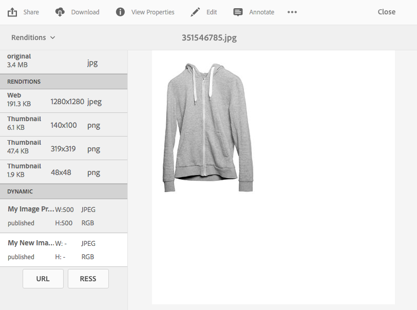

# Apply Dynamic Media image presets {#applying-image-presets}

Image presets enable assets to dynamically deliver images at different sizes, in different formats, or with other image properties that are generated dynamically. You can choose a preset when you export images. The preset reformats images to the specifications that your administrator has specified.

In addition, you can choose an image preset that is responsive (designated by the **[!UICONTROL RESS]** button after you select it).

This section describes how to use image presets. [Administrators can create and configure image presets](managing-image-presets.md).

>[!NOTE]
>
>Smart imaging works with your existing image presets and uses intelligence at the last millisecond of delivery to further reduce image file size based on browser or network connection speed. See [Smart Imaging](imaging-faq.md) for more information.

You can apply an image preset to an image anytime you preview it.

>[!NOTE]
>
>In Dynamic Media - Scene7 mode, image presets are supported for image assets only.

**To apply Dynamic Media image presets:**

1. Open the asset and in the left rail, select the drop-down menu, then select **[!UICONTROL Renditions]**.

   >[!NOTE]
   >
   >* Static renditions appear in the top half ofthepane. Dynamic renditions appear in the lower half. With dynamic renditions only, you can use the URL to display the image. The **[!UICONTROL URL]** button only appears if you select a dynamic rendition. The **[!UICONTROL RESS]** button only appears if you select a responsive image preset.
   >
   >* The system shows numerous renditions when you select **[!UICONTROL Renditions]** in an asset's Detail view. You can increase the number of presets seen. See [Increase the number of image presets that are displayed](managing-image-presets.md#increasing-or-decreasing-the-number-of-image-presets-that-display).

   

1. Do any of the following:

    * Select a dynamic rendition so you can preview the image preset.
    * To display the pop-up, select **[!UICONTROL URL]**, **[!UICONTROL Embed]**, or **[!UICONTROL RESS]**.

   >[!NOTE]
   >
   >If the asset *and* the image preset are not yet published, the **[!UICONTROL URL]** button (or **[!UICONTROL URL]** and **[!UICONTROL RESS]** buttons, if applicable) is not available.
   >
   >Note also that image presets are automatically published on a Dynamic Media server.
