# Dynamic Media Image Profiles {#image-profiles}

When uploading images, you can automatically crop the image upon upload by applying an Image Profile to the folder.

>[!IMPORTANT]
>
>&bull; Smart Crop is available only in Dynamic Media - Scene7 mode.
>&bull; Image Profiles are not applicable to PDF, animated GIF, or INDD (Adobe InDesign) files.

## Crop options {#crop-options}

When you implement Smart Crop on images, Adobe recommends the following best practice and enforces the following limit:

| Limit type | Best practice | Limit imposed |
| --- | --- | --- |
| Number of Smart Crops per image | 5 | 100 |

See also [Dynamic Media limitations](/help/assets/limitations.md).

<!-- CQDOC-16069 for paragraph directly below -->

Smart Crop coordinates are aspect ratio dependent. For the various smart crop settings in an Image Profile, if the aspect ratio is the same for the added dimensions in the Image Profile, then the same aspect ratio is sent to Dynamic Media. Adobe recommends that you use the same crop area. Doing so ensures that there is no impact to different dimensions used in the Image Profile.

Each Smart Crop generation that you create requires extra processing. For example, adding more than five Smart Crop aspect ratios can result in a slow asset ingestion rate. It also causes an increased load on systems. Because you can apply Smart Crop at the folder level, Adobe recommends that you use it on folders *only* where it is needed.

**Guidelines for defining Smart Crop in an Image Profile**
To keep Smart Crop usage under control, and to optimize for processing time and storage of crops, Adobe recommends the following guidelines and tips:

* Image assets that are going to have a smart crop applied to them must be a minimum of 50 x 50 pixels or larger.
* Ideally, have 10-15 smart crops per image to optimize for screen ratios and processing time.
* Name smart crops based on crop dimensions, not on end usage. Doing so helps to optimize for duplicates where a single dimension is used on multiple pages.
* Create page-wise/asset type-wise Image profiles for specific folders and subfolders instead of a common smart crop profile that is applied to all folders or all assets.
* An Image profile that you apply to subfolders overrides an Image profile that is applied to the folder.
* An Image Profile that contains duplicate smart crop dimensions is not permitted.
* Duplicate named Image Profiles that have smart crop options set are not permitted.

You have two image crop options from which to choose: Pixel Crop or Smart Crop. You can also choose to automate the creation of color and image swatches.

>[!IMPORTANT]
>
>&bull; Adobe recommends that you review any generated crops and swatches to ensure that they are appropriate and relevant to your brand and values.
>&bull; CMYK image format is not supported with smart crop.

| Option | When to use | Description |
| --- | --- | --- |
| Pixel Crop | Bulk crop images based on dimensions only. | To use this option, select **[!UICONTROL Pixel Crop]** from the Cropping Options drop-down list.  To crop from the sides of an image, you enter the number of pixels to crop from any side or each side of the image. How much of the image is cropped depends on the ppi (pixels per inch) setting in the image file.  An Image Profile pixel crop renders in the following manner: &bull; Values are Top, Bottom, Left, and Right. &bull; Top left is considered `0,0` and the pixel crop is calculated from there. &bull; Crop starting point: Left is X and Top is Y &bull; Horizontal calculation: horizontal pixel dimension of original image minus Left and then minus Right. &bull; Vertical calculation: vertical pixel height minus Top, and then minus Bottom.  For example, suppose you have a 4000 x 3000 pixel image. You use values: Top=250, Bottom=500, Left=300, Right=700.  From Top Left (300,250) crop using the fill space of (4000-300-700, 3000-250-500, or 3000,2250).  |
| Smart Crop | Bulk crop images based on their visual focal point. | Smart Crop uses the power of artificial intelligence in Adobe Sensei to quickly automate the cropping of images in bulk. Smart Crop automatically detects and crops to the focal point in any image to capture the intended point of interest, regardless of screen size.
 
To use Smart Crop, select **[!UICONTROL Smart Crop]** from the Cropping Options drop-down list, then to the right of Responsive Image Crop, enable (turn on) the feature.
 
The default breakpoint sizes of Large, Medium, and Small generally cover the full range of sizes that most images are used on mobile and tablet devices, desktops, and banners. If desired, you can edit the default names of Large, Medium, and Small.
 
To add more breakpoints, select **[!UICONTROL Add Crop]** to delete a crop, select the Garbage Can icon. |
| Color and Image Swatch | Bulk generates an image swatch for each image. | **Note**: Smart Swatch is not supported in Dynamic Media Classic.  Automatically locate and generate high-quality swatches from product images that show color or texture.  To use Color and Image Swatch, select **[!UICONTROL Smart Crop]** from the Cropping Options drop-down list, then to the right of Color and Image Swatch, enable (turn on) the feature. Enter a pixel value in the Width and Height text boxes.  While all image crops are available from the Renditions rail, swatches are only used by way of the Copy URL feature. Use your own viewing component to render the swatch on your site. (The exception to this rule is carousel banners. Dynamic Media provides the viewing component for the swatch used in carousel banners.)  **Using image swatches** The URL for image swatches is straightforward. It is:  `/is/image/company/&lt;asset_name&gt;:Swatch` where `:Swatch` is appended to the asset request.  **Using color swatches** To use color swatches, you make a `req=userdata` request with the following: `/is/image/&lt;company_name&gt;/&lt;swatch_asset_name&gt;:Swatch?req=userdata`  For example, the following is a swatch asset in Dynamic Media Classic: `https://my.company.com:8080/is/image/DemoCo/Sleek:Swatch` and here is the swatch asset's corresponding `req=userdata` URL: `https://my.company.com:8080/is/image/DemoCo/Sleek:Swatch?req=userdata`  The `req=userdata` response is as follows: `SmartCropDef=Swatch SmartCropHeight=200.0` `SmartCropRect=0.421671,0.389815,0.0848564,0.0592593,200,200` `SmartCropType=Swatch` `SmartCropWidth=200.0` `SmartSwatchColor=0xA56DB2`  You can also request a `req=userdata` response in either XML or JSON format, as in the following respective URL examples: `https://my.company.com:8080/is/image/DemoCo/Sleek:Swatch?req=userdata,json` `https://my.company.com:8080/is/image/DemoCo/Sleek:Swatch?req=userdata,xml`  **Note:** Create your own WCM component to request a color swatch and parse the `SmartSwatchColor` attribute, represented by a 24-bit RGB hexadecimal value.  See also [`userdata` in the Viewers Reference Guide](https://experienceleague.adobe.com/docs/dynamic-media-developer-resources/image-serving-api/image-serving-api/http-protocol-reference/command-reference/req/r-userdata.html). |

## Unsharp Mask {#unsharp-mask}

You use **[!UICONTROL Unsharp mask]** to fine-tune a sharpening filter effect on the final downsampled image. You can control intensity of effect, radius of the effect (measured in pixels), and a threshold of contrast that is ignored. This effect uses the same options as Adobe Photoshop's *Unsharp Mask* filter.

>[!NOTE]
>
>Unsharp mask is only applied to downscaled renditions within the PTIFF (pyramid tiff) that are downsampled more than 50%. That means the largest-sized renditions within the ptiff are not affected by unsharp mask whereas smaller-sized renditions such as thumbnails are altered (and show the unsharp mask).

In **[!UICONTROL Unsharp Mask]**, you have the following filtering options:

| Option | Description |
| --- | --- |
|Amount | Controls the amount of contrast applied to edge pixels. The default is 1.75. For high-resolution images, you can increase it to as high as 5. Think of Amount as a measure of filter intensity. Range is 0-5. |
|Radius | Determines the number of pixels surrounding the edge pixels that affect the sharpening. For high-resolution images, enter from 1 through 2. A low value sharpens only the edge pixels; a high value sharpens a wider band of pixels. The correct value depends on the size of the image. The default value is 0.2. Range is 0-250. |
Threshold | Determines the range of contrast to ignore when the unsharp mask filter is applied. In other words, this option determines how different the sharpened pixels must be from the surrounding area before they are considered edge pixels and are sharpened. To avoid introducing noise, experiment with values between 0-255. |

Sharpening is described in [Sharpening Images](/help/assets/assets/sharpening_images.pdf).

## Create Dynamic Media Image Profiles {#creating-image-profiles}

To define advanced processing parameters for other asset types, see [Configuring Asset Processing](config-dms7.md#configuring-asset-processing).

See [Profiles for Processing Metadata, Images, and Videos](processing-profiles.md).

See also [Best Practices for Organizing your Digital Assets for using Processing Profiles](/help/assets/organize-assets.md).

**To create Dynamic Media Image Profiles:**

1. Select the Adobe Experience Manager logo and navigate to **[!UICONTROL Tools]** > **[!UICONTROL Assets]** > **[!UICONTROL Image Profiles]**.
1. Select **[!UICONTROL Create]** so you can add an Image Profile.
1. Enter a profile name, and values for unsharp mask, crop, or swatch, or both.

   Use a profile name that is specific to its intended purpose. For example, if you want to create a profile that generates swatches only &ndash; that is, Smart Crop is disabled (turned off) and Color and Image Swatch is enabled (turned on) &ndash; use the profile name "Smart Swatches".

   See also [Smart Crop and Smart Swatch Options](#crop-options) and [Unsharp Mask](#unsharp-mask).

   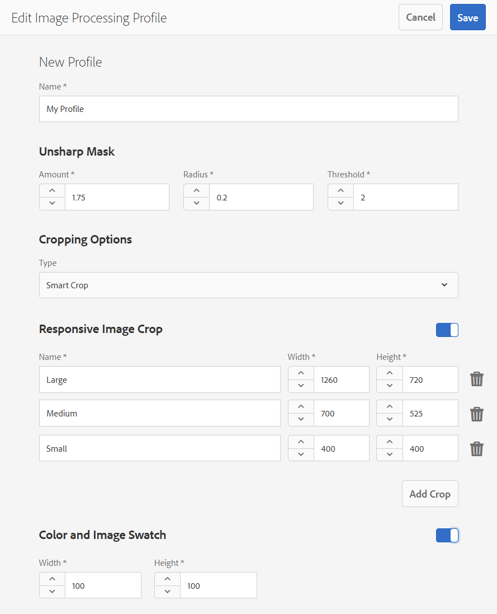

1. Select **[!UICONTROL Save]**. The newly created profile appears in the list of available profiles.

## Edit or delete Dynamic Media Image Profiles {#editing-or-deleting-image-profiles}

1. Select the Experience Manager logo and navigate to **[!UICONTROL Tools]** > **[!UICONTROL Assets]** > **[!UICONTROL Image Profiles]**.
1. Select the Image Profile that you want to edit or remove. To edit it, select **[!UICONTROL Edit Image Profile]**. To remove it, select **[!UICONTROL Delete Image Profile]**.

   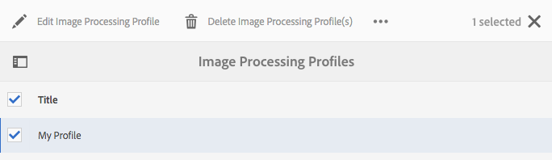

1. If editing, save the changes. If deleting, confirm that you want to remove the profile.

## Apply a Dynamic Media Image Profile to folders {#applying-an-image-profile-to-folders}

When you assign an Image Profile to a folder, any subfolders automatically inherit the profile from its parent folder. This workflow means that you can assign only one Image Profile to a folder. As such, consider carefully the folder structure of where you upload, store, use, and archive assets.

If you assigned a different Image Profile to a folder, the new profile overrides the previous profile. The previously existing folder assets remain unchanged. The new profile is applied on the assets that are added to the folder later.

Folders that have a profile assigned to it are indicated in the user interface using the profile name that appears in the card.

<!-- When you add smart crop to an existing Image Profile, you need to re-trigger the [DAM Update Asset workflow](assets-workflow.md) if you want to generate crops for existing assets in your asset repository. -->

You can apply Image Profiles to specific folders or globally to all assets.

You can reprocess assets in a folder that already has an existing Image Profile that you later changed. See [Reprocess assets in a folder after you have edited its processing profile](processing-profiles.md#reprocessing-assets).

### Apply Dynamic Media Image Profiles to specific folders {#applying-image-profiles-to-specific-folders}

You can apply an Image Profile to a folder from within the **[!UICONTROL Tools]** menu or if you are in the folder, from **[!UICONTROL Properties]**. This section describes how to apply Image Profiles to folders both ways.

Folders that have a profile already assigned to it are indicated by the display of the profile's name directly below the folder name.

You can reprocess assets in a folder that already has an existing video profile that you later changed. See [Reprocess assets in a folder after you have edited its processing profile](processing-profiles.md#reprocessing-assets).

#### Apply Dynamic Media Image Profiles to folders from Profiles user interface {#applying-image-profiles-to-folders-from-profiles-user-interface}

1. Select the Experience Manager logo and navigate to **[!UICONTROL Tools]** > **[!UICONTROL Assets]** > **[!UICONTROL Image Profiles]**.
1. Select the Image Profile that you want to apply to a folder or multiple folders.

   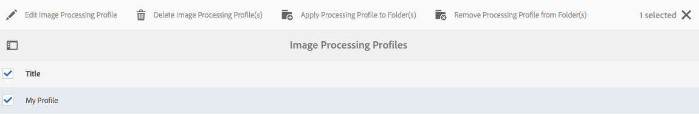

1. Select **[!UICONTROL Apply Processing Profile to Folders]** and select the folder or multiple folders you want use to receive the newly uploaded assets and select **[!UICONTROL Apply]**. Folders that have a profile already assigned to it are indicated by the display of the profile's name directly below the folder name.

#### Apply Dynamic Media Image Profiles to folders from Properties {#applying-image-profiles-to-folders-from-properties}

1. Select the Experience League logo and navigate to **[!UICONTROL Assets]**. Then navigate to the parent folder of the folder to which you want to apply an Image Profile.
1. On the folder, select the check mark to select it and then select **[!UICONTROL Properties]**.
1. Select the **[!UICONTROL Image Profiles]** tab. From the **[!UICONTROL Profile Name]** drop-down list, select the profile, then select **[!UICONTROL Save & Close]**. Folders that have a profile already assigned to it are indicated by the display of the profile's name directly below the folder name.

   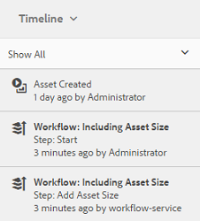

### Apply a Dynamic Media Image Profile globally {#applying-an-image-profile-globally}

In addition to applying a profile to a folder, you can also apply one globally so that any content uploaded into Experience Manager assets in any folder has the selected profile applied.

You can reprocess assets in a folder that already has an existing video profile that you later changed. See [Reprocessing assets in a folder after you have edited its processing profile](processing-profiles.md#reprocessing-assets).

**To apply a Dynamic Media Image Profile globally:**

1. Do one of the following:

    * Navigate to `https://&lt;AEM server&gt;/mnt/overlay/dam/gui/content/assets/foldersharewizard.html/content/dam` and apply the appropriate profile and select **[!UICONTROL Save]**.

      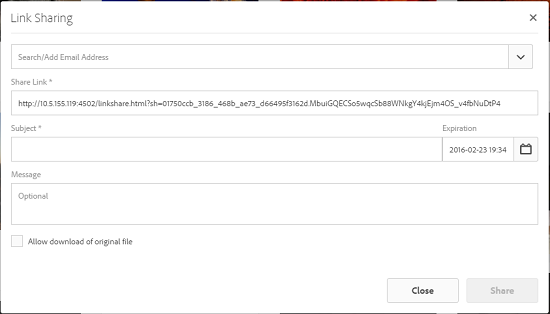

    * Navigate to CRXDE Lite to the following node: `/content/dam/jcr:content`.

      Add the property `imageProfile:/conf/global/settings/dam/adminui-extension/imageprofile/<name of image profile>` and select **[!UICONTROL Save All]**.

      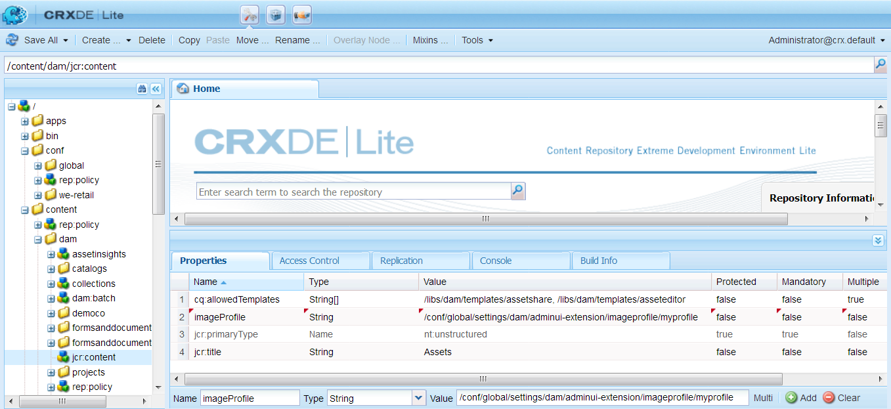

## Edit the smart crop or smart swatch of a single image {#editing-the-smart-crop-or-smart-swatch-of-a-single-image}

>[!IMPORTANT]
>
>&bull; Smart crop is available only in Dynamic Media - Scene7 mode.

You can manually realign or resize the smart crop window of an image to further refine its focal point.

After you edit a smart crop and save, the change is propagated everywhere you use the crop for the specific images.

You can rerun smart crop to generate the additional crops again, if necessary.

See also [Edit the smart crop or smart swatch of multiple images](#editing-the-smart-crop-or-smart-swatch-of-multiple-images).

**To edit the smart crop or smart swatch of a single image:**

1. Select the Experience Manager logo and navigate to **[!UICONTROL Assets]**, then to the folder that has a smart crop or smart swatch Image Profile applied to it.

1. Select the folder so you can open its contents.
1. Select the image whose smart crop or smart swatch that you want to adjust.
1. In the toolbar, select **[!UICONTROL Smart Crop]**.

1. Do any of the following:

    * Near the upper-right corner of the page, drag the slider bar left or right to increase or decrease the image display, respectively.
    * On the image, drag a corner handle to adjust the size of the viewable area of the crop or swatch.
    * On the image, drag the box/swatch to a new location. You can only edit image swatches; color swatches are static.
    * Above the image, select  **[!UICONTROL Revert]** to undo all your edits and restore the original crop or swatch.

1. Near the upper-right corner of the page, select **[!UICONTROL Save]**, then select **[!UICONTROL Close]** to return to the folder of assets.

## Edit the smart crop or smart swatch of multiple images {#editing-the-smart-crop-or-smart-swatch-of-multiple-images}

>[!IMPORTANT]
>
>&bull; Smart crop is available only in Dynamic Media - Scene7 mode.

After you apply an Image Profile &ndash; containing Smart Crop &ndash; to a folder, all images in that folder have a crop applied to them. If desired, you can *manually* realign or resize the smart crop window in multiple images to further refine their focal point.

After you edit a smart crop and save, the change is propagated everywhere you use the crop for the specific images.

You can rerun smart crop to generate the additional crops again, if necessary.

**To edit the smart crop or smart swatch of multiple images:**

1. Select the Experience Manager logo and navigate to **[!UICONTROL Assets]**, then to a folder that has a smart crop or smart swatch Image Profile applied to it.
1. On the folder, select the **[!UICONTROL More Actions]** (...) icon, then select **[!UICONTROL Smart Crop]**.

1. On the **[!UICONTROL Edit Smart Crops]** page, do any of the following:

    * Adjust the viewing size of images on the page.

      To the right of the breakpoint name drop-down list, drag the slider bar left or right to change the size of the viewable image display.

       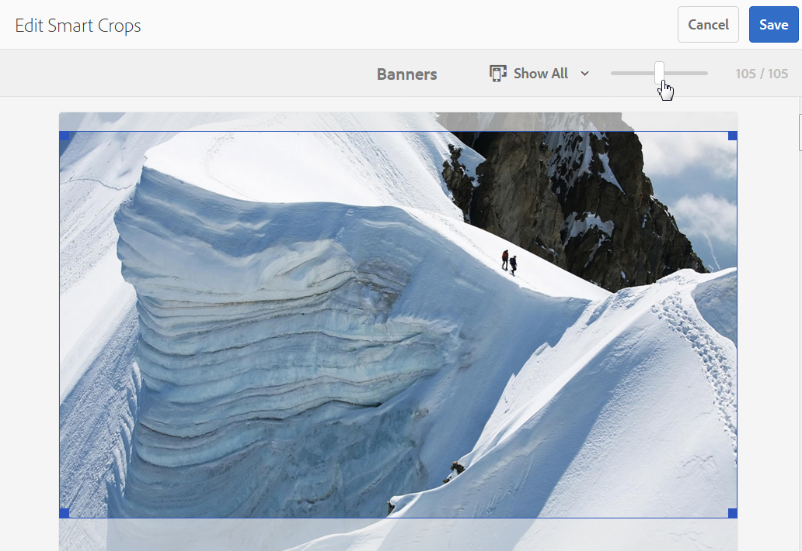

    * Filter the list of viewable images based on breakpoint names. In the example below, the images are filtered on the breakpoint name "Medium".

      Near the upper-right corner of the page, from the drop-down list, select a breakpoint name to filter on what images you see. (See the image above.)

       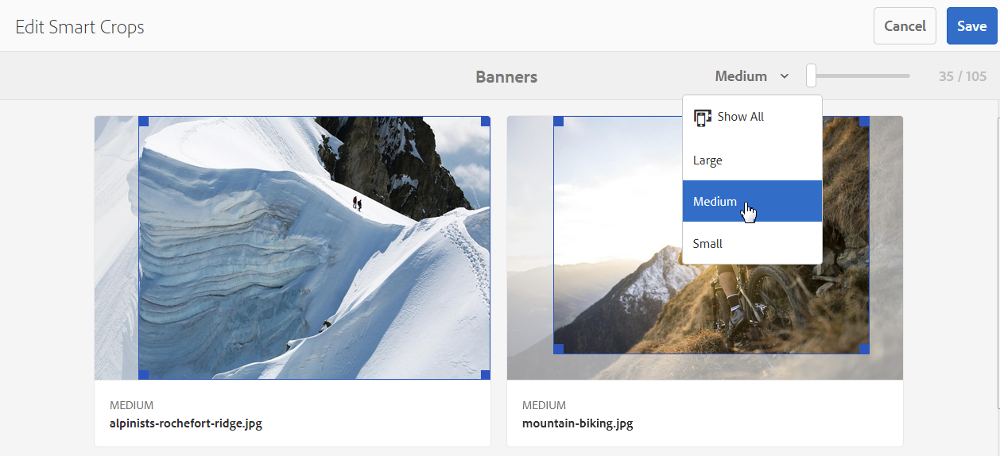

    * Resize the smart crop box. Do any one of the following:

        * If the image has a smart crop or a smart swatch only, on the image, drag the corner handle of the crop box to adjust the size of the viewable area of the crop.
        * If the image has both a smart crop and a smart swatch, on the image, drag the corner handle of the crop box to adjust the size of the viewable area of the crop. Or, select the smart swatch below the image (color swatches are static), then drag the corner handle of the crop box to adjust the size of the viewable area of the swatch.

       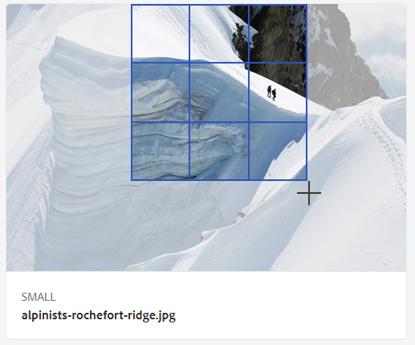

    * Move the smart crop box. Do any one of the following:

        * If the image has a smart crop or a smart swatch only, on the image, drag the crop box to a new location.
        * If the image has both a smart crop and a smart swatch, on the image, drag the smart crop box to a new location. Or, select the smart swatch below the image (color swatches are static), then drag the smart swatch crop box to a new location.

       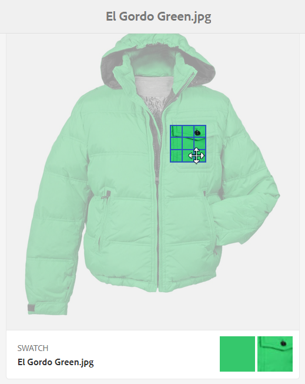

    * Undo all your edits and restore the original smart crop or smart swatch (applies to the current editing session only).

      Select **[!UICONTROL Revert]** above the image.

       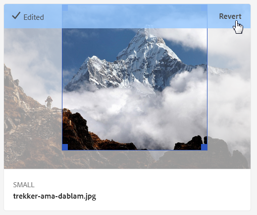

1. Near the upper-right corner of the page, select **[!UICONTROL Save]**, then select **[!UICONTROL Close]** to return to the folder of assets.

## Remove a Dynamic Media Image Profile from folders {#removing-an-image-profile-from-folders}

When you remove an Image Profile from a folder, any subfolders automatically inherit the removal of the profile from its parent folder. However, any processing of files that has occurred within the folders remains intact.

You can remove an Image Profile from a folder from within the **[!UICONTROL Tools]** menu or if you are in the folder, from **[!UICONTROL Properties]**. This section describes how to remove Image Profiles from folders both ways.

### Remove Dynamic Media Image Profiles from folders by way of Profiles user interface {#removing-image-profiles-from-folders-via-profiles-user-interface}

1. Select the Experience Manager logo and navigate to **[!UICONTROL Tools]** > **[!UICONTROL Assets]** > **[!UICONTROL Image Profiles]**.
1. Select the Image Profile that you want to remove from a folder or multiple folders.
1. Select **[!UICONTROL Remove Processing Profile from Folders]** and select the folder or multiple folders you want use to remove the profile from and select **[!UICONTROL Remove]**.

    You can confirm that the Image Profile is no longer applied to a folder because the name no longer appears below the folder name.

### Remove Dynamic Media Image Profiles from folders by way of Properties {#removing-image-profiles-from-folders-via-properties}

1. Select the Experience Manager logo and navigate **[!UICONTROL Assets]** and then to the folder that you want to remove an Image Profile from.
1. On the folder, select the check mark to select it, then select **[!UICONTROL Properties]**.
1. Select the **[!UICONTROL Image Profiles]** tab.
1. From the **[!UICONTROL Profile Name]** drop-down list, select **[!UICONTROL None]**, then select **[!UICONTROL Save & Close]**.

    Folders that have a profile already assigned to it are indicated by the display of the profile's name directly below the folder name.
