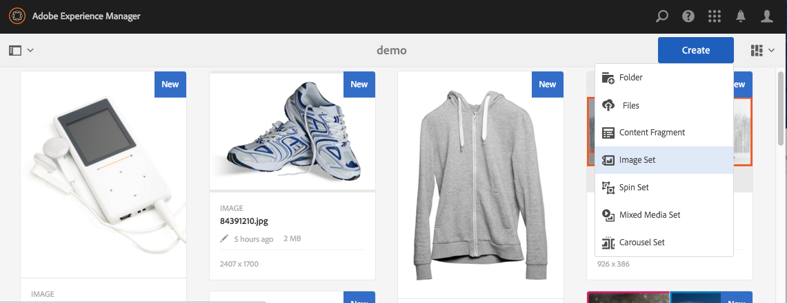
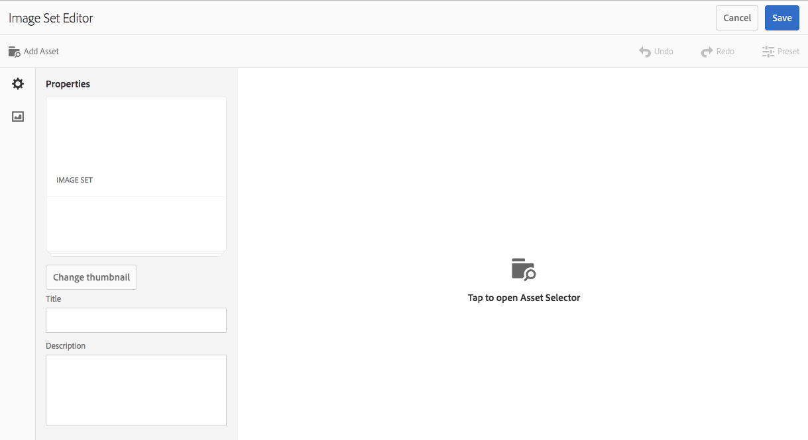
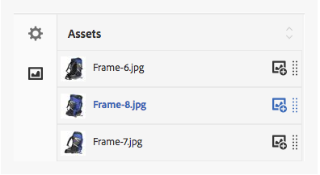
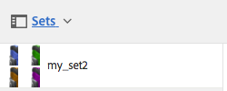

# Image Sets {#image-sets}

Image Sets give users an integrated viewing experience, where users can see different views of an item by clicking a thumbnail image. Image Sets let you present alternative views of an item and the viewer offers zooming tools for examining images closely.

Image Sets are designated by a banner with the word **[!UICONTROL IMAGESET]**. In addition, if the Image Set is published, then the publish date, indicated by the **[!UICONTROL World]** icon is on the banner along with the last modification date, indicated by the **[!UICONTROL Pencil]** icon displays. 

Within the image set, you can also create swatches by creating an Image Set and adding thumbnails.

This application is particularly useful for when you want to show an item in a different color, pattern, or finish. To create a Image Set with color swatches, you need one image for each different color, pattern, or finish you want to present to users. You also need one color, pattern, or finish swatch for each color, pattern, or finish.

For example, suppose you want to present images of caps with different color bills; the bills are red, green, and blue. In this case, you need three shots of the same cap. You need one shot with a red, one with a green, and one with a blue bill. You also need a red, green, and blue color swatch. The color swatches serve as the thumbnails that users click in the Swatch Set Viewer to see the red-billed, green-billed, or blue-billed cap.

>[!NOTE]
>
>For information on the Assets user interface, see [Managing assets with the Touch UI](managing-assets-touch-ui.md).

## Quick Start: Image Sets {#quick-start-image-sets}

To get you up and running quickly:

1. [Upload your master images for multiple views.](#uploading-assets-in-image-sets)

   Start by uploading the images for your Image Sets. Because users can zoom on images in the Image Set Viewer, take zooming into account when you choose images. Make sure that the images are least 2000 pixels in the largest dimension. AEM Assets supports many image file formats, but lossless TIFF, PNG, and EPS images are recommended.

1. [Create Image Sets.](#creating-image-sets)

   In Image Sets, users click thumbnail images in the Image Set Viewer.

   To create an Image Set in Assets, tap **[!UICONTROL Create > Image Sets]**. Then, add images and tap **[!UICONTROL Save]**.

   You can also create image sets automatically through [batch set presets](/help/assets/config-dms7.md#creating-batch-set-presets-to-auto-generate-image-sets-and-spin-sets). 
   
   **Important** &mdash; Batch sets are created by the IPS (Image Production System) as part of asset ingestion and are available only in Dynamic Media - Scene7 mode.

   See [Preparing Image Set assets for upload and Uploading your files](#uploading-assets-in-image-sets).

   See [Working with Selectors.](working-with-selectors.md)

1. Add [Image Set Viewer presets](managing-viewer-presets.md), as needed.

   Administrators can create or modify Image **[!UICONTROL Set Viewer Presets]**. To see your image set with a viewer preset, select the image set, and in the left-rail drop-down menu, select **[!UICONTROL Viewers]**.

   See **[!UICONTROL Tools > Assets > Viewer Presets]** to create or edit viewer presets.

1. (Optional) [Viewing Image Sets](image-sets.md#viewing-image-sets) that were created using batch set presets. 
1. [Preview Image Sets.](previewing-assets.md)

   Select the Image Set and you can preview it. Tap the thumbnail icons to examine your Image Set in the selected Viewer. You can choose different viewers from the **[!UICONTROL Viewers]** menu, available from the left rail drop-down menu.

1. [Publish Image Sets.](publishing-dynamicmedia-assets.md)

   Publishing an Image Set activates the URL and Embed string. In addition, you must [publish any custom viewer preset](managing-viewer-presets.md) that you have created. Out-of-the box viewer presets are already published.

1. [Link URLs to your Web Application](linking-urls-to-yourwebapplication.md) or [Embed the Video or Image Viewer](embed-code.md).

   AEM Assets creates URL calls for Image Sets and activates them after you publish the image sets. You can copy these URLs when you preview assets. Alternatively, you can embed them on your web site.

   Select the Image Set, then in the left rail drop-down menu, select **[!UICONTROL Viewers]**.

   See [Linking an Image Set to a web page](linking-urls-to-yourwebapplication.md) and [Embedding the Video or Image Viewer](embed-code.md).

To edit Image Sets, see [editing Image Sets.](#editing-image-sets) In addition, you can view and edit [Image Set properties](managing-assets-touch-ui.md#editing-properties).

If you have issues creating sets, see Images and Sets in [Troubleshooting Dynamic Media - Scene7 mode](troubleshoot-dms7.md#images-and-sets).

## Uploading assets in Image Sets {#uploading-assets-in-image-sets}

Start by uploading the images for your Image Sets. Because users can zoom on images in the Image Set Viewer, take zooming into account when you choose images. Make sure that the images are least 2000 pixels in the largest dimension. Image Sets supports many image file formats, but lossless TIFF, PNG, and EPS images are recommended.

You can upload images for Image Sets as you would [upload any other asset in Assets](managing-assets-touch-ui.md#uploading-assets).

### Preparing Image Set assets for upload {#preparing-image-set-assets-for-upload}

Before creating Image Sets, make sure that the images are the right size and format.

To create a multiple-view Image Set, you need images that show an item from different points of view or show different aspects of the same item. The goal is to highlight the important features of an item so viewers have a complete picture of what it looks like or does.

Because users can zoom images in Image Sets, make sure that the images are at least 2000 pixels in the largest dimension. Assets supports many image file formats, but lossless TIFF, PNG, and EPS images are recommended.

>[!NOTE]
>
>In addition if you are using thumbnails to indicate product swatches, you need to do the following:
>
>You need vignettes or different shots of the same image showing it in different colors, patterns, or finishes. You also need thumbnail files that correspond to the different colors, patterns, or finishes. For example, to present thumbnails with an Image Set showing the same jacket in black, brown, and green, you need:
>
>* A black, brown, and green shot of the same jacket.
>* A black, brown, and green color thumbnail.
>

## Creating Image Sets {#creating-image-sets}

You can create Image Sets through the user interface or by way of the API. This section describes how to create Image Sets in the user interface.

>[!NOTE]
>
>You can also create image sets automatically through [batch set presets](/help/assets/config-dms7.md#creating-batch-set-presets-to-auto-generate-image-sets-and-spin-sets).

**Important:** Batch sets are created by the IPS (Image Production System) as part of asset ingestion and are available only in Dynamic Media - Scene7 mode.

When you add assets to your set, they are automatically added in alphanumeric order. You can manually re-order or sort assets after they have been added.

>[!NOTE]
>
>Image sets are not supported for assets with `,` (comma) in the file name.

**To create an Image Set**:

1. In **Assets**, navigate to where you want to create an image set, tap **[!UICONTROL Create]**, and select **[!UICONTROL Image Set]**. You can also create the set from inside a folder that contains your assets.

   

1. On the Image Set Editor page, in the **[!UICONTROL Title]** field, enter a name for the Image Set. The name appears in the banner across the Image Set. Optionally, enter a description.

   

   >[!NOTE]
   >
   >When creating the image set, you can change the image set thumbnail or allow AEM to select the thumbnail automatically based on the assets in the image set. To select a thumbnail, tap **[!UICONTROL Change thumbnail]** and select any image (you can navigate to other folders to find images as well). If you have selected a thumbnail and then decide that you want AEM to generate one from the image set, select **[!UICONTROL Switch to Automatic thumbnail]**.

1. Do either one of the following:

    * Near the upper-left corner of the **[!UICONTROL Image Set Editor]** page, tap **[!UICONTROL Add Asset]**.
    * Near the middle of the **[!UICONTROL Image Set Editor]** page, tap **[!UICONTROL Tap to open Asset Selector]**.

   Tap to select assets that you want to include in your image set. Selected assets have a checkmark icon over them. When you are finished, near the upper-right corner of the page, tap **[!UICONTROL Select]**.

   With the Asset Selector, you can search for assets by typing in a keyword and tapping **[!UICONTROL Return]**. You can also apply filters to refine your search results. You can filter by path, collection, file type, and tag. Select the filter and then tap the **[!UICONTROL Filter]** icon on the toolbar. Change the view by tapping the **[!UICONTROL View]** icon and selecting **[!UICONTROL Column View]**, **[!UICONTROL Card View]**, or **[!UICONTROL List View]**.

   See [Working with Selectors.](working-with-selectors.md)

   

1. When you add assets to your set, they are automatically added in alphanumeric order. You can manually re-order or sort assets after you add them.

   If necessary, drag an asset's **[!UICONTROL Reorder]** icon to the right of the asset's file name to re-order images up or down the set list.

   

   If you want to change a thumbnail or swatch, tap the **[!UICONTROL Thumbnail]** icon next to the image and navigate to the thumbnail or swatch you want. When done selecting all the images tap **[!UICONTROL Save]**.

1. (Optional) Do any of the following:

    * To delete an image, select the image, then tap **[!UICONTROL Delete Asset]**.
    * To apply a preset, near the upper-right corner of the page, tap **[!UICONTROL Preset]**, then select a preset to apply to all the assets at once.

1. Tap **[!UICONTROL Save]**. Your newly created Image Set appears in the folder you created it in.

## Viewing Image Sets {#viewing-image-sets}

You can create image sets either in the user interface or automatically using [batch set presets](/help/assets/config-dms7.md#creating-batch-set-presets-to-auto-generate-image-sets-and-spin-sets).

**Important** &mdash; Batch sets are created by the IPS [Image Production System] as part of asset ingestion and are available only in Dynamic Media - Scene7 mode.)

However, sets created using batch set presets, do *not* appear in the user interface. You can view these sets in three different ways. (These methods are available even if you created the image sets in the user interface).

* When opening the properties of an individual asset. Properties indicate what sets the selected asset is a member of (under **[!UICONTROL Member of Sets]**). Tap the name of the set to see the entire set.

  

* From a member image of any set. Select the **[!UICONTROL Sets]** menu to display the sets that the asset is a member of. 

  

* From search, you can select **[!UICONTROL Filters]**, then expand **[!UICONTROL Dynamic Media]** and select **[!UICONTROL Sets]**.

  The search returns matching sets that were manually created in the UI or automatically created through batch set presets. For automated sets, the search query is conducted using "Starts with" search criteria which is different from AEM search which is based on using "Contains" search criteria. Setting the filter to **[!UICONTROL Sets]** is the the only way to search automated sets.

  

>[!NOTE]
>
>You can view sets by way of the user interface as described in [Editing Image Sets](#editing-image-sets).

## Editing Image Sets {#editing-image-sets}

You can perform a variety of editing tasks on Image Sets such as the following:

* Add images to the Image Set.
* Re-order images in the Image Set.
* Delete assets in the Image Set.
* Apply viewer presets.
* Delete the Image Set.

**To edit Image Sets**:

1. Do any one of the following:

    * Hover over an Image Set asset, then tap **[!UICONTROL Edit]** (pencil icon).
    * Hover over an Image Set asset, tap **[!UICONTROL Select]** (checkmark icon), then tap **[!UICONTROL Edit]** on the toolbar.
    * Tap on an Image Set asset, then tap **[!UICONTROL Edit]** (pencil icon) on the toolbar.

1. To edit the images in the Image Set, do any of the following:

    * To reorder assets, drag an image to a new location (select the reorder icon to move items).
    * To sort items in ascending or descending order, tap the column heading.
    * To add an asset or update an existing asset, tap the **[!UICONTROL Add Asset]**. Navigate to an asset, select it, then tap **[!UICONTROL Select]** near the upper-right corner of the page.

    >[!NOTE]
    >If you delete the image that AEM uses for the thumbnail by replacing it with another image, the original asset still displays.

    * To delete an asset, select it, then tap **[!UICONTROL Delete Asset]**.
    * To apply a preset, near the upper-right corner of the page, tap **[!UICONTROL Preset]**, then select a viewer preset.
    * To add or change a thumbnail, select the thumbnail icon next to the right of the asset. Navigate to the new thumbnail or swatch asset, select it, then tap **[!UICONTROL Select]**.
    * To delete an entire Image Set, navigate to the Image Set, select it, and tap **[!UICONTROL Delete]**.

   >[!NOTE]
   >
   >You can edit the images in an Image Set by navigating to the set, tap **[!UICONTROL Set Members]** in the left rail, and then tap the **[!UICONTROL Pencil]** icon on an individual asset to open the editing window.

1. Tap **[!UICONTROL Save]** when you are done editing.

## Previewing Image Sets {#previewing-image-sets}

See [Previewing assets](previewing-assets.md).

## Publishing Image Sets {#publishing-image-sets}

See [Publishing Assets](publishing-dynamicmedia-assets.md).
