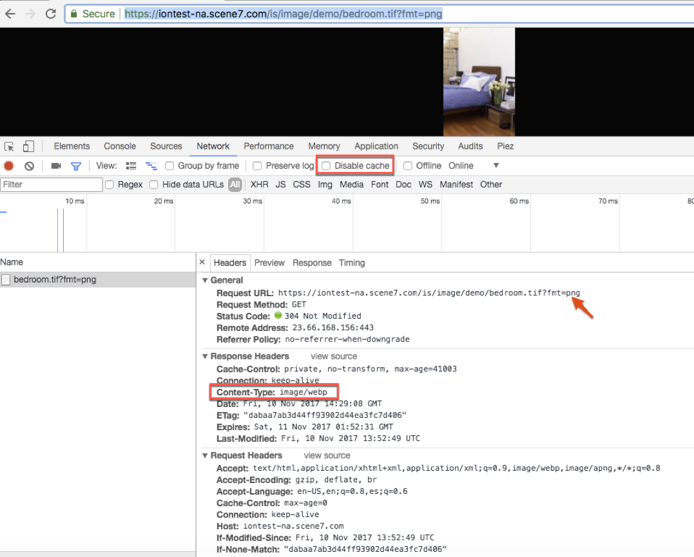

# Smart Imaging {#smart-imaging}

## What is smart imaging? {#what-is-smart-imaging}

Smart imaging leverages each user's unique viewing characteristics to automatically serve the right images optimized for their experience, resulting in better performance and engagement. Smart imaging works with your existing image presets and uses intelligence at the last millisecond of delivery to further reduce image file size based on browser or network connection speed.

Smart imaging benefits from the added performance boost of being fully integrated with the best-in-class premium CDN service. This service finds the optimal internet route between servers, networks, and peering points that has lowest latency, and/or packet loss rate than the default route on the Internet.

## What are the key benefits of smart imaging? {#what-are-the-key-benefits-of-smart-imaging}

Smart imaging provides better image delivery performance by automatically optimizing image file size based on user characteristics. Because images constitute a majority of a page's load time, the performance improvement can have a profound impact on business KPIs such as higher conversion, time spent on site, lower site bounce rate, and so on. Adobe compared performance of default image delivery versus smart imaging across different file formats, browsers, and quality (QLT) settings. Overall, you can expect 22-47% performance improvement depending on your existing image preset settings and specific end user characteristics.

## Are there any licensing costs associated with smart imaging? {#are-there-any-licensing-costs-associated-with-smart-imaging}

No. Smart imaging is included with your existing license of either Dynamic Media Classic (Scene7) or Dynamic Media. There are no additional costs to take advantage of this new feature.

## How does smart imaging work? {#how-does-smart-imaging-work}

When an image is requested for the first time by a consumer, we check the user characteristics and convert to the appropriate image format based on browser. In addition, we simultaneously create all format conversions which are then cached at the CDN. When consumers on different browsers subsequently request that image, the proper image format is automatically delivered straight from the CDN cache. These format conversions are done in a lossless manner which does not degrade visual fidelity. Smart imaging automatically converts images to different formats based on browser capability as follows:

* Automatically convert to lossless WebP for browsers that support WebP format, such as Chrome, Android, and Opera.
* Automatically convert to lossless JPEGXR for browsers that support JPEGXR format, such as Internet Explorer 9+.
* Automatically convert to lossless JPEG2000 for browsers that support JPEG2000 format, such as Safari.
* For browsers that do not support those formats, the originally requested image format is served.

## What image formats are supported? {#what-image-formats-are-supported}

The following image formats are supported for smart imaging:

* RGB JPEG
* RGB PNG
* RGB TIFF
* CMYK JPEG
* CMYK TIFF

## How does smart imaging work with our existing image presets that are already in use? {#how-does-smart-imaging-work-with-our-existing-image-presets-that-are-already-in-use}

Smart imaging works with your existing image presets and observes virtually all your image settings such as size, quality, sharpening, and so on. What will change is the image format or, in cases of slow network connection speed, the quality setting. For format conversion, we maintain full visual fidelity as defined by your image preset settings, but at a smaller file size.

For example, suppose an image preset is defined with JPEG format, size 500x500, quality=85, and unsharp mask=0.1,1,5. When we detect that a user is on Chrome browser, the image is converted to lossless WebP format, with size 500x500, quality=85, and unsharp mask=0.1,1,5.

## Will I have to change any URLs, image presets, or deploy any new code on my site for smart imaging? {#will-i-have-to-change-any-urls-image-presets-or-deploy-any-new-code-on-my-site-for-smart-imaging}

No. Smart imaging works seamlessly with your existing image URLs and image presets. In addition, smart imaging does not require you to add any code on your website to detect different user characteristics (browser, bandwidth, device, and so on). All of this is handled automatically by Adobe.

The only change that may be required is to update the **[!UICONTROL Time To Live]** (TTL) setting. This setting defines how long assets are cached by the CDN. To maximize the performance improvements of smart imaging, Adobe recommends setting the TTL to 24 hours or longer. To change this setting:

* If you are using Dynamic Media Classic, tap **[!UICONTROL Setup > Application Setup > Publish Setup > Image Server]**. Set the **[!UICONTROL Default Client Cache Time To Live]** value to 24 or longer.

* If you are using Dynamic Media, follow the instructions to [Configure Dynamic Media image settings](config-dynamic.md) Set the **[!UICONTROL Expiration]** value to 24 hours or longer.

>[!NOTE]
>
>If you set TTL &lt;= 1 hour, smart imaging does not work.

## Does smart imaging working with HTTPS? How about HTTP/2? {#does-smart-imaging-working-with-https-how-about-http}

Smart imaging works with images delivered over HTTP or HTTPS. In addiiton, it also works over HTTP/2.

## Am I eligible to use smart imaging? {#am-i-eligible-to-use-smart-imaging}

To use smart imaging, your company's Dynamic Media Classic or Dynamic Media on AEM account must meet the following requirements:

* Use the Adobe-bundled CDN (Content Delivery Network) as part of your license.
* Use a dedicated domain (that is, `images.company.com` or `mycompany.scene7.com`), not a generic domain (that is, `s7d1.scene7.com`, `s7d2.scene7.com`, or `s7d13.scene7.com`).

  To find your domains, log in to your company account or accounts.

  Tap **[!UICONTROL Setup > Application Setup > General Settings]**. Look for the field labeled **[!UICONTROL Published Server Name]**. If you are currently using a generic domain, you can request moving over to your own custom domain as part of this transition.

* Do not request CMYK JPEG images. As part of its processing, smart imaging converts CMYK JPEG images to RGB. If you need to obtain CMYK JPEG images, you cannot use smart imaging.

## What is the process for enabling smart imaging for my account? {#what-is-the-process-for-enabling-smart-imaging-for-my-account}

You must initiate the request to use smart imaging; it is not automatically enabled.

1. Initiate a Technical Support request (email: s7support@adobe.com).
1. Provide the following information in your support request:

    1. Primary contact name, email, phone.
    1. All domains to be enabled for smart imaging (that is, images.company.com or mycompany.scene7.com).

       To find your domains, log into your company account or accounts.

       Click **[!UICONTROL Setup > Application Setup > General Settings]**.

       Look for the field labeled **[!UICONTROL Published Server Name]**.
    1. Verify that you are using the CDN through Adobe and not managed with a direct relationship.
    1. Verify you are using a dedicated domain such as `images.company.com` or `mycompany.scene7.com`, and not a generic domain, such as `s7d1.scene7.com`, `s7d2.scene7.com`, `s7d13.scene7.com`.

       To find your domains, log into your company account or accounts.

       Click **[!UICONTROL Setup > Application Setup > General Settings]**.

       Look for the field labeled **[!UICONTROL Published Server Name]**. If you are currently using a generic Dynamic Media Classic domain, you can request moving over to your own custom domain as part of this transition.
    1. Indicate if you also need this to work over HTTP/2

1. Technical Support will add you to the smart imaging customer Wait List based on the order in which requests were submitted.
1. When Adobe is ready to handle your request, support will contact you to coordinate and set a target date.
1. Optional: You have the option to test smart imaging in Staging before Adobe pushes the new feature to production.
1. You are notified after completion by support.
1. To maximize the performance improvements of smart imaging, Adobe recommends setting the Time To Live (TTL) to 24 hours or longer. The TTL defines how long assets are cached by the CDN. To change this setting:

    1. If you use Dynamic Media Classic, click **[!UICONTROL Setup > Application Setup > Publish Setup > Image Server]**. Set the **[!UICONTROL Default Client Cache Time To Live]** value to 24 or longer.
    1. If you use Dynamic Media, follow [these instructions](config-dynamic.md). Set the **[!UICONTROL Expiration]** value 24 hours or longer.

## When can I expect my account to be enabled with smart imaging? {#when-can-i-expect-my-account-to-be-enabled-with-smart-imaging}

Requests are processed in the order in which they are received by Technical Support, according to the Wait List.

>[!NOTE]
>
>There may be a long lead time because enabling smart imaging involves clearing the cache. Therefore, only a few customer transitions can be handled at any given time.

## What are the risks with switching over to use smart imaging? {#what-are-the-risks-with-switching-over-to-use-smart-imaging}

The transition to smart imaging clears out your cache at the CDN because it involves moving to a new configuration of Dynamic Media Classic or Dynamic Media on AEM.

During the initial transition, the non-cached images directly hits Adobe's origin servers until the cache is rebuilt again. Because of this, Adobe plans to handle a few customer transitions at a time so that acceptable performance is maintained when pulling requests from our origin. For most customers, the cache is fully built up again at the CDN within ~1 to 2 days.

## How can I verify whether smart imaging is working as expected?  {#how-can-i-verify-whether-smart-imaging-is-working-as-expected}

1. After your account is configured with smart imaging, load a Dynamic Media Classic(S7)/Dynamic Media image URL on the browser.
1. Open the Chrome developer pane by clicking **[!UICONTROL View > Developer > Developer Tools]** in the browser. Or choose any browser developer tool of your choice.

1. Ensure that cache is disabled when developer tools is open.

    1. On Windows, navigate to settings in the developer tool pane, then select **[!UICONTROL Disable cache (while devtools is open)]** checkbox.
    1. On Mac, in the developer pane, under the **[!UICONTROL Network]** tab, select **[!UICONTROL disable cache]** .

1. On the initial request the image will not be optimized. Typically, it takes about 15 minutes to return the optimized image if it is not in the CDN cache.
1. Observe the Content Type is transformed to the appropriate format. The following screenshot shows PNG image being converted dynamically to WebP on Chrome.
1. Repeat this test on different browsers and user conditions.

>[!NOTE]
>
>Not all images are converted. Smart imaging decides if the conversion is needed to improve performance. In some cases, where there is no expected performance gain, the image is not converted.

