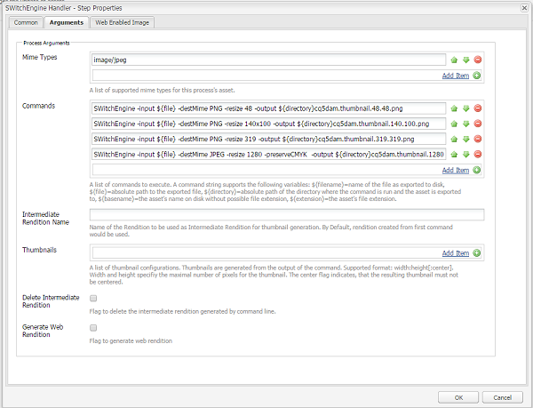
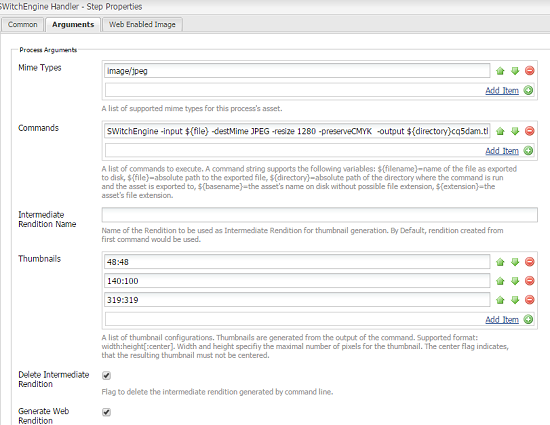

# Imaging Transcoding Library {#imaging-transcoding-library}

Adobe's Imaging Transcoding Library is a proprietary image processing solution that can perform core image-handling functions, including:

* Encoding
* Transcoding (converting supported formats)
* Image resampling, using PS and Intel IPP algorithms
* Bit depth and color profile preservation
* JPEG quality compression
* Image resizing

Imaging Transcoding Library provides the following capabilities:

* CMYK support
* Full alpha support (except CMYK -Alpha)

In addition to supporting a wide range of file formats and profiles, Imaging Transcoding Library has significant advantages over other third-party solutions around performance, scalability, and quality. Here are some of the key benefits that Imaging Transcoding Library provides:

* **Scales with increasing file size or resolution**: Scaling is primarily achieved by the patented ability of Imaging Transcoding Library to re-size while decoding files. This ability ensures that runtime memory usage is always optimum and is not a quadratic function of increasing file size or resolution megapixels. Imaging Transcoding Library can process larger and high-resolution (containing higher megapixels) files. Third-party tools, such as ImageMagick is unable to handle large files and crashes while processing such files.
* **Photoshop quality compression and resizing algorithms**: Consistency with industry standard in terms of quality of down sampling (smooth, sharp and automatic bicubic) and compression quality. Imaging Transcoding Library further assesses the quality factor of input image, and intelligently uses optimum tables and quality settings for output image. This ability produces files of optimal size without compromising on visual quality.
* **High throughput:** The response time is lower and throughput is consistently higher than ImageMagick. Therefore, Imaging Transcoding Library should decrease the wait time for users and the cost of hosting.
* **Scale better with concurrent load:** Imaging Transcoding Library performs optimally under concurrent load conditions. It provides high throughput with optimum CPU performance, memory usage, and low response time, which helps reduce the cost of hosting.

## Supported MIME types {#supported-mime-types}

See [supported MIME types article](assets-formats.md#supported-image-transcoding-library), for a list of formats that ITL supports.

## Supported Platforms {#supported-platforms}

Imaging Transcoding Library is currently available for the following operating systems:

* RHEL 7
* CentOS 7

>[!NOTE]
>
>Currently, only RHEL 7 and CentOS 7 are supported for Linux distros. Mac OS and other &ast;nix distributions (for example, Debian and Ubuntu) are not supported.

## Usage {#usage}

The command line arguments for Imaging Transcoding Library can include the following:

```
-destMime PNG/JPEG: Mime type of output rendition
 -BitDepth 8/16: Preserves Bit Depth. Bitdepth ‘4’ is automatically converted to ‘8’
 -preserveBitDepth: Downscales Bit Depth (No upscaling)
 -preserveCMYK: Preserves CMYK color space
 -jpegQuality: Provides jpeg quality parameter (0-12 , corresponding to Photoshop qualities)
 -ResamplingMethod BiCubic/Lanczos/PSBicubic: Provides resampling methods. PSBicubic is a Photoshop quality resampling method.
 -resize
```

You can configure the following options for the` `-resize` `parameter:`

* `X`: `Works similar to AEM. For example -resize 319.`

* `WxH`: `Aspect Ratio will not be maintained, For example -resize 319X319.`

* `Wx`: `Fixes the width and calculates the height maintaining the aspect ratio. For example -resize 319x.`

* `xH`: `Fixes the height and calculates the width maintaining the aspect ratio. For example -resize x319.`

```
-AllowUpsampling (Resizes smaller images)
 -input <fileName>
 -output <fileName>
```

## Configuring Imaging Transcoding Library {#configuring-imaging-transcoding-library}

1. When executing the SWitchEngine command, create a conf file to point to the libraries using the following commands: 
    * cd /etc/ld.so.conf.d
    * touch SWitchEngineLibs.conf
    * vi SWitchEngineLibs.conf
    * cat SWitchEngineLibs.conf
       /opt/aem/author/crx-quickstart/launchpad/felix/bundle545/data/binaries
    * ldconfig     
     
    Only for the bash file, configure `LD_LIBRARY_PATH` using the following steps:

    * `vi ~/.bash_profile`
    * Add " `export LD_LIBRARY_PATH`=**.**"
    * Save and exit.

1. Fetch the value of `LD_LIBRARY_PATH` using the following command:

   `echo $LD_LIBRARY_PATH`

   Verify whether the value of `LD_LIBRARY_PATH` is set to "**.**"

   If the value is not set to "." restart the session.

1. Download the <a href="https://www.adobeaemcloud.com/content/marketplace/marketplaceProxy.html?packagePath=/content/companies/public/adobe/packages/aem630/product/assets/aem-assets-imaging-transcoding-library-pkg">Imaging transcoding library package</a> (version 1.4) and install it using Crx Package Manager. Supported Platforms are RHEL7 and CentOS7.  

1. Tap/click the AEM logo, and go to **[!UICONTROL Tools > Workflow > Models]**.
1. From the **[!UICONTROL Workflow Models]** page, open the **[!UICONTROL DAM Update Asset]** workflow model in edit mode.
1. Open the **[!UICONTROL Process Thumbnails]** workflow process step. In the **[!UICONTROL Thumbnails]** tab, add the MIME types for which you want to skip the default thumbnail generation process in the **[!UICONTROL Skip Mime Types]** list. For example, if you want to create thumbnails for a JPEG image using Imaging Transcoding Library, specify `image/jpeg` in the [!UICONTROL Skip Mime Types] field.

   

1. In the **[!UICONTROL Web Enabled Image]** tab, add the MIME types for which you want to skip the default web rendition generation process in **[!UICONTROL Skip List]**. For example, if you skipped MIME type `image/jpeg` in step 6, add `image/jpeg` to the skip list.

   

1. Open the **[!UICONTROL EPS thumbnails (powered by ImageMagick)]** step navigate to the **[!UICONTROL Arguments]** tab. In the **[!UICONTROL Mime Types]** list, add the MIME types you want Imaging Transcoding Library to process. For example, if you skipped the MIME type `image/jpeg` in step 6, add image/jpeg to the **[!UICONTROL Mime Types]** list.

   

1. [!UICONTROL Toggle side panel] and from the list of steps add **[!UICONTROL SWitchEngine Handler]**. Add commands to [!UICONTROL SWitchEngine Handler] using one of the following ways:

    * Based on custom requirements, tune the parameters of commands that you specify. For example, if you want to preserve the color profile of your JPEG image, add the following commands to the **[!UICONTROL Commands]** list:

    1. `SWitchEngine -input ${file} -destMime PNG -resize 48 -output ${directory}cq5dam.thumbnail.48.48.png`
    1. `SWitchEngine -input ${file} -destMime PNG -resize 140x100 -output ${directory}cq5dam.thumbnail.140.100.png`
    1. `SWitchEngine -input ${file} -destMime PNG -resize 319 -output ${directory}cq5dam.thumbnail.319.319.png`
    1. `SWitchEngine -input ${file} -destMime JPEG -resize 1280 -preserveCMYK -output ${directory}cq5dam.web.1280.1280.jpeg`

   

    * Generate thumbnails from an intermediate rendition using a single command. The intermediate rendition acts as source to generate static and web renditions. This method is faster than the earlier method. However, you cannot apply custom parameters to thumbnails using this method.

   

   To generate web renditions, configure parameters in the **[!UICONTROL Web-Enabled Image]** tab as depicted in the following image.

   

1. Save the workflow.
