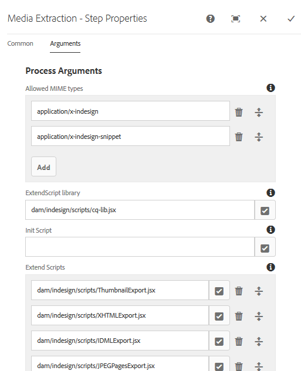
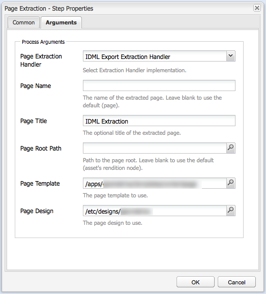
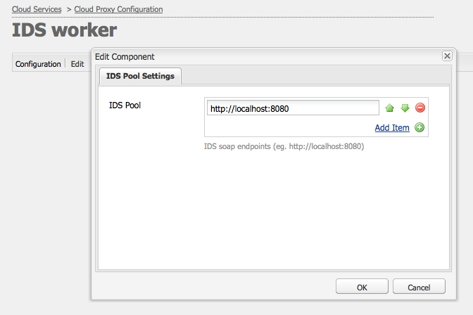

# Integrate [!DNL Adobe Experience Manager Assets] with [!DNL Adobe InDesign Server] {#integrating-aem-assets-with-indesign-server}

[!DNL Adobe Experience Manager Assets] uses:

* A proxy to distribute the load of certain processing tasks. A proxy is an [!DNL Experience Manager] instance that communicates with a proxy worker to fulfill a specific task, and other [!DNL Experience Manager] instances to deliver the results.
* A proxy worker to define and manage a specific task.
  These can cover a wide variety of tasks; for example, using an [!DNL InDesign Server] to process files.

To fully upload files to [!DNL Experience Manager Assets] that you have created with [!DNL Adobe InDesign] a proxy is used. This uses a proxy worker to communicate with the [!DNL Adobe InDesign Server], where scripts are run to extract metadata and generate various renditions for [!DNL Experience Manager Assets]. The proxy worker enables the two-way communication between the [!DNL InDesign Server] and the [!DNL Experience Manager] instances in a cloud configuration.

>[!NOTE]
>
>[!DNL Adobe InDesign] is offered as two separate offerings. [Adobe InDesign](https://www.adobe.com/products/indesign.html) desktop app that is used to design page layouts for print and digital distribution. [Adobe InDesign Server](https://www.adobe.com/products/indesignserver.html) enables you to programmatically create automated documents based on what you have created with [!DNL InDesign]. It operates as a service offering an interface to its ExtendScript engine. The scripts are written in [!DNL ExtendScript], which is similar to [!DNL JavaScript].

## How the extraction works {#how-the-extraction-works}

The [!DNL Adobe InDesign Server] can be integrated with [!DNL Experience Manager Assets] so that INDD files created with [!DNL InDesign] can be uploaded, renditions generated, all media extracted (for example, video) and stored as assets:

>[!NOTE]
>
>Previous versions of [!DNL Experience Manager] were able to extract XMP and the thumbnail, now all media can be extracted.

1. Upload your INDD file to [!DNL Experience Manager Assets].
1. A framework sends command scripts to the [!DNL InDesign Server] through SOAP (Simple Object Access Protocol).
   This command script will:

    * Retrieve the INDD file.
    * Execute [!DNL InDesign Server] commands:

        * The structure, text and any media files are extracted.
        * PDF and JPG renditions are generated.
        * HTML and IDML renditions are generated.

    * Post the resulting files back to [!DNL Experience Manager Assets].

   >[!NOTE]
   >
   >IDML is an XML-based format that renders all contents of the [!DNL InDesign] file. It is stored as a compressed package using [ZIP](https://techterms.com/definition/zip) compression. For more information, see [InDesign Interchange Formats INX and IDML](https://www.peachpit.com/promotions/adobe-creative-cloud-2024-release-books-ebooks-and-142536).

   >[!CAUTION]
   >
   >If the [!DNL InDesign Server] is not installed or not configured, then you can still upload an INDD file into [!DNL Experience Manager]. However, the renditions generated are limited to PNG and JPEG. You will not be able to generate HTML, `.idml`, or the page renditions.

1. After the extraction and rendition generation:

    * The structure is replicated to a `cq:Page` (type of rendition).
    * The extracted text and files are stored in [!DNL Experience Manager Assets].
    * All renditions are stored in [!DNL Experience Manager Assets], in the asset itself.

## Integrate the [!DNL InDesign Server] with Experience Manager {#integrating-the-indesign-server-with-aem}

To integrate the [!DNL InDesign Server] for use with [!DNL Experience Manager Assets] and after configuring your proxy, you need to:

1. [Install the InDesign Server](#installing-the-indesign-server).
1. If necessary, [configure the Experience Manager Assets Workflow](#configuring-the-aem-assets-workflow).
   This is only necessary if the default values are not appropriate for your instance.
1. Configure a [proxy worker for the InDesign Server](#configuring-the-proxy-worker-for-indesign-server).

### Install the [!DNL InDesign Server] {#installing-the-indesign-server}

To install and start the [!DNL InDesign Server] for use with [!DNL Experience Manager]:

1. Download and install the [!DNL InDesign Server].

1. If necessary, you can customize the configuration of your [!DNL InDesign Server] instance.

1. From the command line, start the server:

   `<*ids-installation-dir*>/InDesignServer.com -port 8080`

   This starts the server with the SOAP plugin listening on port 8080. All log messages and output are written directly to the command window.

   >[!NOTE]
   >
   >If you want to save the output messages to a file then use redirection; for example, under Windows:
   >`<ids-installation-dir>/InDesignServer.com -port 8080 > ~/temp/INDD-logfile.txt 2>&1`

### Configure the [!DNL Experience Manager Assets] workflow {#configuring-the-aem-assets-workflow}

[!DNL Experience Manager Assets] has a pre-configured workflow **[!UICONTROL DAM Update Asset]**, that has several process steps specifically for [!DNL InDesign]:

* [Media Extraction](#media-extraction)
* [Page Extraction](#page-extraction)

This workflow is set up with default values that can be adapted for your setup on the various author instances (this is a standard workflow, so further information is available under [Editing a Workflow](/help/sites-developing/workflows-models.md#configuring-a-workflow-step)). If you are using the default values (including the SOAP port), then no configuration is needed.

After the setup, uploading [!DNL InDesign] files into [!DNL Experience Manager Assets] (by any of the usual methods) triggers the workflow to process the asset and prepare the various renditions. Test your configuration by uploading an INDD file into [!DNL Experience Manager Assets] to confirm that you see the different renditions created by IDS under `<*your_asset*>.indd/Renditions`

#### Media extraction {#media-extraction}

This step controls the extraction of media from the INDD file.

To customize, you can edit the **[!UICONTROL Arguments]** tab of the **[!UICONTROL Media Extraction]** step.

Media extraction arguments and script paths

* **ExtendScript library**: This is a simple http get/post method library, required by the other scripts.

* **Extend Scripts**: You can specify different script combinations here. If you want your own scripts to be executed on the [!DNL InDesign Server], save the scripts at `/apps/settings/dam/indesign/scripts`.

<!-- TBD: Hiding this link since ADC is not available anymore. 
For information about [!DNL Adobe InDesign] scripts, see [InDesign developer documentation](https://www.adobe.com/devnet/indesign/documentation.html#idscripting).
-->

>[!CAUTION]
>
>Do not change the ExtendScript library. This library provides the HTTP functionality required to communicate with Sling. This setting specifies the library to be sent to the [!DNL InDesign Server] for use there.

The `ThumbnailExport.jsx` script run by the Media Extraction workflow step generates a thumbnail rendition in JPG format. This rendition is used by the Process Thumbnails workflow step to generate the static renditions required by [!DNL Experience Manager].

You can configure the Process Thumbnails workflow step to generate static renditions at different sizes. Ensure that you do not remove the defaults, because they are required by the [!DNL Experience Manager Assets] interface. Finally, the Delete Image Preview Rendition workflow step removes the JPG thumbnail rendition, as it is no longer needed.

#### Page extraction {#page-extraction}

This creates an [!DNL Experience Manager] page from the extracted elements. An extraction handler is used to extract data from a rendition (currently HTML or IDML). This data is then used to create a page using the Page Builder.

To customize, you can edit the **[!UICONTROL Arguments]** tab of the **[!UICONTROL Page Extraction]** step.

* **Page Extraction Handler**: From the popup list, select the handler that you want to use. An extraction handler operates on a specific rendition, chosen by a related `RenditionPicker` (see the `ExtractionHandler` API). In a standard [!DNL Experience Manager] installation the following is available:
  * IDML Export Extraction Handle: Operates on the `IDML` rendition generated in the MediaExtract step.

* **Page Name**: Specify the name that you want to have assigned to the resulting page. If left blank then the name is "page" (or a derivative if "page" already exists).

* **Page Title**: Specify the title that you want to have assigned to the resulting page.

* **Page Root Path**: The path to the root location of the resulting page. If left blank, the node holding the asset's renditions is used.

* **Page Template**: The template to use when generating the resulting page.

* **Page Design**: The page design to be used when generating the resulting page.

### Configure the proxy worker for [!DNL InDesign Server] {#configuring-the-proxy-worker-for-indesign-server}

>[!NOTE]
>
>The worker resides on the proxy instance.

1. In the Tools console, expand **[!UICONTROL Cloud Services Configurations]** in the left pane. Then expand **[!UICONTROL Cloud Proxy Configuration]**.

1. Double-click the **[!UICONTROL IDS worker]** to open for configuration.

1. Click **[!UICONTROL Edit]** to open the configuration dialog and define the required settings:

   

    * **IDS Pool**
      The SOAP endpoints used for communicating with the [!DNL InDesign Server]. You can add, remove and order items are required.

1. Click OK to save.

### Configure Day CQ Link Externalizer {#configuring-day-cq-link-externalizer}

If the [!DNL InDesign Server] and [!DNL Experience Manager] are on different hosts or one or both of these applications are not working on default ports, then configure [!UICONTROL Day CQ Link Externalizer] to set the host name, port, and content path for the [!DNL InDesign Server].

1. Access the Web Console at `https://[aem_server]:[port]/system/console/configMgr`.
1. Locate the configuration **[!UICONTROL Day CQ Link Externalizer]**. Click **[!UICONTROL Edit]** to open.
1. Link Externalizer settings help create absolute URLs for the [!DNL Experience Manager] deployment and for the [!DNL InDesign Server]. Use the **[!UICONTROL Domains]** field to specify the host name for the [!DNL Adobe InDesign Server]. Click **Save**.

   In absolute URLs, use `localhost` as the host name for your local (author) instance, and host name or IP address for the publish instance as shown in the following illustration. 

   

### Enable parallel job processing for [!DNL InDesign Server] {#enabling-parallel-job-processing-for-indesign-server}

You can now enable parallel job processing for IDS. Determine the maximum number of parallel jobs (`x`) an [!DNL InDesign Server] can process:

* On a single multiprocessor machine, the maximum number of parallel jobs (`x`) that an [!DNL InDesign Server] can process is one less than the number of processors running IDS.
* When you are running IDS on multiple machines, you need to count the total number of processors available (that is, on all machines) then subtract the total number of machines.

To configure the number of parallel IDS jobs:

1. Open the **[!UICONTROL Configurations]** tab of the Felix Console; for example: `https://[aem_server]:[port]/system/console/configMgr`.

1. Select the IDS processing queue under `Apache Sling Job Queue Configuration`.

1. Set:

    * **Type** - `Parallel`
    * **Maximum Parallel Jobs** - `<*x*>` (as calculated above)

1. Save these changes.
1. To enable multi-session support for Adobe CS6 and later, check `enable.multisession.name` checkbox, under `com.day.cq.dam.ids.impl.IDSJobProcessor.name` configuration.
1. Create a [pool of `x` IDS workers by adding SOAP endpoints to the IDS Worker configuration](#configuring-the-proxy-worker-for-indesign-server).

   If there are multiple machines running [!DNL InDesign Server], add SOAP endpoints (number of processors per machine -1) for each machine.

<!-- 
TBD: Make updates to configurations for allow and block list after product updates are done.
-->

   >[!NOTE]
   >
   >When working with a pool of workers, you can enable a blocked list of IDS workers.
   >
   >To do so, enable the **[!UICONTROL enable.retry.name]** checkbox, under the `com.day.cq.dam.ids.impl.IDSJobProcessor.name` configuration, which enables IDS job retrials.
   >
   >Also, under the `com.day.cq.dam.ids.impl.IDSPoolImpl.name` configuration, set a positive value for `max.errors.to.blacklist` parameter which determines number of job retrials before barring an IDS from the job handlers list.
   >
   >By default, after the configurable (`retry.interval.to.whitelist.name`) time in minutes the IDS worker is revalidated. If the worker is found online, it is removed from the blocked list.

## Enable support for [!DNL InDesign Server] 10.0 or later {#enabling-support-for-indesign-server-or-later}

For [!DNL InDesign Server] 10.0 or higher, perform the following steps to enable multi-session support.

1. Open Configuration Manager from your [!DNL Experience Manager Assets] instance `https://[aem_server]:[port]/system/console/configMgr`.
1. Edit the configuration `com.day.cq.dam.ids.impl.IDSJobProcessor.name`.
1. Select the **[!UICONTROL ids.cc.enable]** option, and click **[!UICONTROL Save]**.

>[!NOTE]
>
>For [!DNL InDesign Server] integration with [!DNL Experience Manager Assets], use a multi-core processor because the session support feature necessary for the integration is not supported on single core systems.

## Configure [!DNL Experience Manager] credentials {#configure-aem-credentials}

You can change the default administrator credentials (user name and password) for accessing the [!DNL InDesign Server] from your [!DNL Experience Manager] deployment without breaking the integration with the [!DNL InDesign Server].

1. Go to `/etc/cloudservices/proxy.html`.
1. In the dialog, specify the new user name and password.
1. Save the credentials.

>[!MORELIKETHIS]
>
>* [About Adobe InDesign Server](https://www.adobe.com/products/indesignserver/faq.html)
