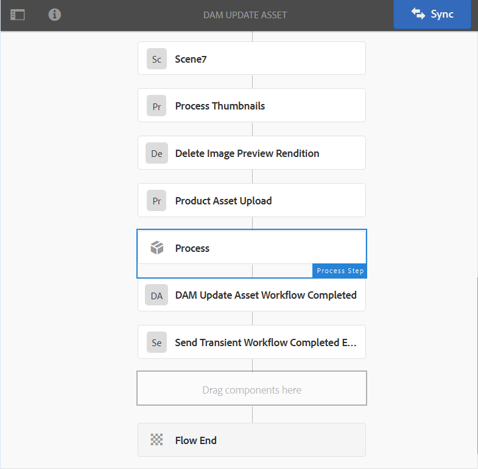
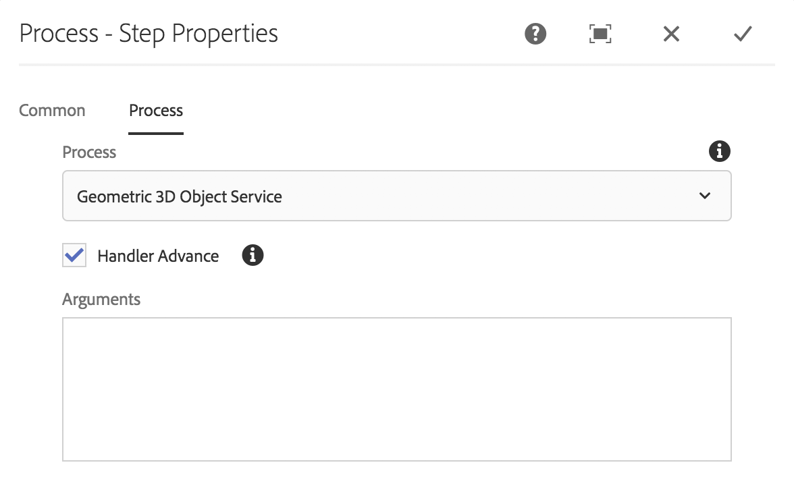
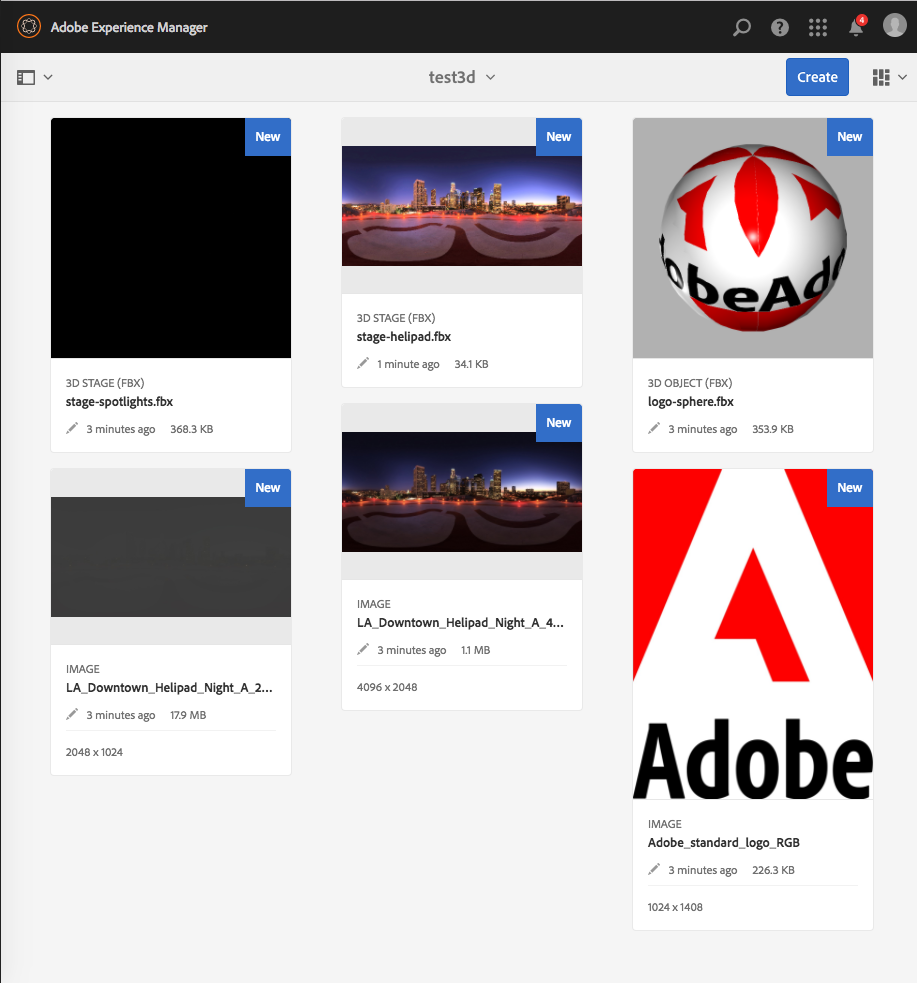
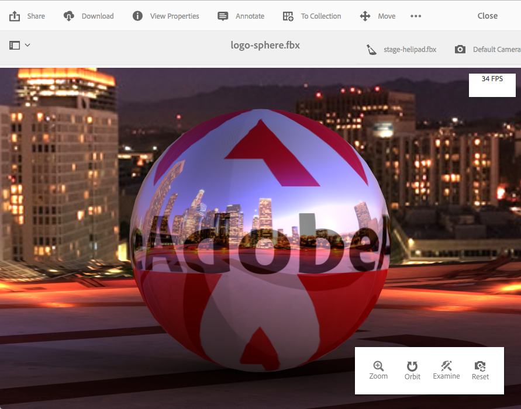

# Installing and configuring AEM 3D {#installing-and-configuring-aem-d}

The installation and configuration of AEM 3D (version 3.0) involves the following:

1. Installing the Autodesk® FBX® SDK library.
1. Downloading and installing the native 3D code package.
1. Configuring the 3D asset ingestion workflow and restarting AEM.
1. Validating the setup of AEM 3D.

See also [Working with 3D assets](assets-3d.md).

See also [AEM 3D Assets release notes](/help/release-notes/aem3d-release-notes.md) for prerequisites, supported browsers, and other important release imformation.

See also [Working with the 3D Sites component](using-the-3d-sites-component.md).

>[!NOTE]
>
>Before downloading and installing the 3D package, make sure that you have installed all prerequisite AEM packages successfully. See the [AEM 3D Release Notes.](install-config-3d.md)

## Installing the Autodesk FBX SDK library {#installing-the-autodesk-fbx-sdk-library}

The native AEM 3D code requires the Autodesk FBX library to support the FBX file format. (Adobe is currently unable to redistribute this library.)

See also [Advanced configuration settings](advanced-config-3d.md).

1. Log onto the host where AEM is installed.

    * If this is a Windows Server deployment, log onto the server as Administrator.
    * If this is a MAC or Windows desktop, make sure you have administrator privileges.

1. Use the link appropriate for your operating system to download **FBX SDK version 2016.1.2**

    * **Windows**

      [https://download.autodesk.com/us/fbx_release_older/2016.1.2/fbx20161_2_fbxsdk_vs2010_win.exe](https://download.autodesk.com/us/fbx_release_older/2016.1.2/fbx20161_2_fbxsdk_vs2010_win.exe)

    * **OS X** 

      [https://download.autodesk.com/us/fbx_release_older/2016.1.2/fbx20161_2_fbxsdk_clang_mac.pkg.tgz](https://download.autodesk.com/us/fbx_release_older/2016.1.2/fbx20161_2_fbxsdk_clang_mac.pkg.tgz)

    * **Linux** 

      [https://download.autodesk.com/us/fbx_release_older/2016.1.2/fbx20161_2_fbxsdk_linux.tar.gz](https://download.autodesk.com/us/fbx_release_older/2016.1.2/fbx20161_2_fbxsdk_linux.tar.gz)

1. Install the FBX SDK:

    * Windows. Install to the same drive where AEM is located.
    * Mac. Install to the same partition where AEM is located.
    * Linux. Extract the downloaded package and follow the instructions in `<yourFBXSDKpath>/Install_FbxFileSdk.txt`. Install the SDK to `/usr`.

## Downloading and installing the native 3D code package {#downloading-and-installing-the-native-d-code-package}

>[!NOTE]
>
>Before you proceed with the installation and configuration of AEM 3D, Adobe recommends that you deploy any applicable service packs and other related feature packs. See [AEM 3D Release Notes](/help/release-notes/aem3d-release-notes.md).

See also [Advanced Configuration Settings](advanced-config-3d.md).

**To install the native 3D code package**:

1. Do one of the following:

    * If this is a Windows Server deployment, log on to the server as Administrator.
    * If this is a Mac or Windows desktop, make sure you have Adminstrator privileges.

1. Ensure that you have a supported browser available to access AEM.

   See [System requirements](/help/release-notes/aem3d-release-notes.md#system-requirements).

1. Using a supported browser, log on to AEM with Administrator privileges.
1. In AEM, click the AEM logo to access the global navigation console, then click the **[!UICONTROL Tools]** icon and navigate to **[!UICONTROL Administration > Deployment > Package Share]**.
1. On the Adobe page, use your Adobe ID credentials to log on to your Adobe Creative Cloud account.
1. On the Adobe packages page, locate version 3.0.1 of `AEM-6.4-DynamicMedia-3D` feature pack, then download it.  

1. In AEM, click **[!UICONTROL Tools > Administration > Deployment > Package Manager]**.
1. Locate the downloaded feature pack, then click **[!UICONTROL Install]**.  

1. In the **[!UICONTROL Install Package]** dialog box, expand **Advanced Settings**, then set **[!UICONTROL Access Control Handling]** to **Merge**.
1. Click **[!UICONTROL Install]** to begin installation of the package.

   The file `sample-3D-content.zip` is placed in the **[!UICONTROL Assets]** root folder. See [Validating the setup of AEM 3D](#validating-the-setup-of-aem-d) for additional information.

## Configuring the 3D asset ingestion workflow and restarting AEM {#configuring-the-d-asset-ingestion-workflow-and-restarting-aem}

**To configure the 3D asset ingestion workflow**:

1. In AEM, click the AEM logo to access the global navigation console, then click the **[!UICONTROL Tools]** icon and navigate to **[!UICONTROL Workflow > Models]**.
1. On the **[!UICONTROL Workflow Models]** page, hover over the **[!UICONTROL DAM Update Asset]** workflow, and when the check mark appears, select it.  

1. On the toolbar, click **[!UICONTROL Edit]**.
1. On the **[!UICONTROL DAM Update Asset]** screen, in the AEM floating panel, click the **[!UICONTROL Plus]** icon to the right of Workflow to expand the list. Select **[!UICONTROL Process Step]** in the list.
1. Drag **[!UICONTROL Process Step]** and drop it into the workflow just before **[!UICONTROL DAM Update Asset Workflow Completed]** component near the end of the workflow.

   

1. Double-click the newly added process step.
1. In the **[!UICONTROL Step Properties]** dialog box, under the **[!UICONTROL Common]** tab, in the **[!UICONTROL Title]** field, enter a suitable description for the process such as `Process 3D content`.
1. Click the **[!UICONTROL Process]** tab.  

1. From the **[!UICONTROL Process]** drop-down menu, select **[!UICONTROL Geometric 3D Object Service]**, then select the **[!UICONTROL Handler Advance]** check box.

   

1. Near the upper-right corner of the dialog box, click the check mark icon to return to the DAM Update Asset page.
1. Near the upper-right corner of the **[!UICONTROL DAM Update Asset]** page, click **[!UICONTROL Sync]** to save the edited workflow model.
1. Restart AEM.

   After restart, you are ready to upload 3D content and have AEM process it.

   Continue with [Validating the setup of AEM 3D](#validating-the-setup-of-aem-d).

## Validating the setup of AEM 3D {#validating-the-setup-of-aem-d}

1. In AEM, click **[!UICONTROL Tools > Assets]**, then download `sample-3D-content.zip`, and expand the downloaded file. (You can now delete `sample-3D-content.zip` in AEM.)

   Make sure you are in **[!UICONTROL Card View]** to view upload and processing feedback in the remaining steps.

1. Create a folder named `test3d` to receive test content.
1. Upload all files from `sample-3D-content/images` to the `test3d` folder.
1. Wait for the upload and processing to complete. You may need to refresh your browser.

   Upload the three `.fbx` files from `sample-3D-content/` to the `test3d` folder.

   Do not upload the .ma model files yet.

1. In the Card View, observe the message banners that are shown on the 3d asset cards.

   Each asset proceeds through several processing steps. When the **[!UICONTROL Creating Preview...]** processing step completes, the card is updated with a thumbnail image. When final processing is completed, the banner is replaced with the **[!UICONTROL NEW]** indicator.

   >[!NOTE]
   >
   >Expect very high CPU utilization while 3D processing is in progress. Depending on available CPU capacity it may take a substantial amount of time to complete all processing.

   

1. You will now learn how to resolve file dependencies.

   On the **[!UICONTROL Unresolved Dependencies]** banner for the `stage-helipad.fbx` card, click the **[!UICONTROL Exclamation Point]** icon to navigate to the asset's properties and open the **Dependencies** tab.

   

1. Click the **[!UICONTROL Folder/Magnifying Glass]** icon to the right of the file name to open the asset browser and resolve the dependencies as follows:

   

1. Click **[!UICONTROL Save]** and **[!UICONTROL Close]** to finish processing the asset and return to the **[!UICONTROL Card View]**, respectively.
1. When processing is complete, you see the following in **[!UICONTROL Card View]**:

   

1. On the test3d page, click the `logo-sphere.fbx` card to open the model in **[!UICONTROL Detail View]**.

   Near the upper-right corner of the logo-sphere.fbx page, click the Stage Spotlight icon to expand the drop-down menu, then select `stage-spotlights.fbx`.

   

1. From the **[!UICONTROL Stage Spotlight]** drop-down list, select `stage-helipad.fbx`.

   Using the left mouse button to adjust the view. The background and model lighting changes to reflect the new stage selection.

   

## Configuring support for Adobe Dimension assets {#configuring-support-for-adobe-dimension-assets}

>[!NOTE]
>
>This configuration task is optional.

You can optionally configure support in AEM 3D for Adobe Dimension assets.

You must configure an external conversion service to allow ingestion, preview, and publishing of Adobe Dimension 3D assets in AEM. The service converts from the proprietary Adobe Dimension (`.dn`) format to a variant of glTF (formatted as a `.glb` file) which is saved with the Dn asset as a rendition. The `.glb` rendition is used for web-based viewing of the 3D asset in AEM Assets, Sites, and Screens, and is also available for downloading for use with third-party applications.

>[!NOTE]
>
>The conversion service is hosted by Adobe in Amazon AWS. After properly configuring the service, `.dn` files uploaded to AEM are then copied securely to the conversion service by way of temporary storage in Amazon S3. The conversion result is transferred back to AEM by way of temporary S3 storage. All transfers and storage are secured. Also, the content persists in S3 and the conversion service only briefly (typically no more than a few minutes).

**To configure suoport for Adobe Dimension assets**:

1. Contact your Adobe AEM account manager, provisioning expert, or support representative to request credentials for **AEM3D Services**.

   >[!NOTE]
   >
   >Only one set of credentials is required for each organization, regardless of the number of AEM instances on which the credentials are installed.

1. Verify that you have received the following information:

    * accountId
    * customerId
    * password
    * identityPoolId
    * userPoolId
    * clientId

1. As Administrator, log into your AEM author instance where you want the credentials installed, then open **[!UICONTROL CRXDE Lite]**.
1. Configure the new credentials information by doing the following in CRXDE Lite:

    1. Navigate to `/libs/settings/dam/v3D/services/dncr` and set the `clientId` property to the new value.
    1. Navigate to `/libs/settings/dam/v3D/services/aws` and set the `accountId`, `customerId`, `identityPoolId`, and `userPoolId` properties to the new values.
    1. Load the new password value into the `encryptedPassword` property. This value is automatically encrypted when you tap **[!UICONTROL Save All]**.
    1. Tap **[!UICONTROL Save All]**, reload the page, then verify that the `encryptedPassword` property shows a different string enclosed by curly braces. This appearance indicates that the password is properly encrypted and secure.

1. Specify the format of the `.glb` conversion rendition by doing the following in **[!UICONTROL CRXDE Lite]**:

    1. Navigate to `/libs/settings/dam/v3D/services/dncr` in **[!UICONTROL CRXDE Lite]**.
    1. Set the `outputFormat` property to either `Dn` or `generic`.

       When set to `Dn`, the `.glb` conversion includes Adobe-specific extensions, such as IBL lighting, for best quality when viewing Dn assets in AEM. However, the converted .glb rendition may not render well in third-party applications.  

       When set to `generic`, the `.glb` rendition is generic without Adobe-specific extensions. This setting allows it to be used in third-party applications, while viewing with the AEM 3D viewer will be visually sub-optimal.

1. Enable the Dn file format by doing the following in **[!UICONTROL CRXDE Lite]**:

    1. Navigate to `/libs/settings/dam/v3D/assetTypes/Dn`.
    1. Set the `Enabled` property to true.

1. Validate the configuration by doing the following:

    1. Open AEM Assets.
    1. Upload `logo_sphere.dn` to the `test3d` folder. The file is located in `sample-3D-content/models`.

       Note that `sample-3D-content.zip` was previously downloaded for validating the basic 3D functionality. 
    1. Return to the **[!UICONTROL Card View]** and observe the message banner shown on the uploaded asset. The **[!UICONTROL Converting Format...]** banner is displayed while the conversion process is in progress.
    1. After all processing is complete, open the asset in **[!UICONTROL Detail View]** to verify that the converted asset is displayed correctly and that the viewer's navigation controls are usable.

   

   If a "Processing Error" is displayed on the Dn asset in the **[!UICONTROL Card View]** after 10-15 minutes, the conversion failed.

   If such case, you can troubleshoot the conversion by doing the following:

    * Delete the asset, then upload it again.
    * Ensure that you have correctly set all configuration parameters in **[!UICONTROL CRXDE Lite]**.
    * Verify that no firewall is blocking access to the conversion service and AWS endpoints.
