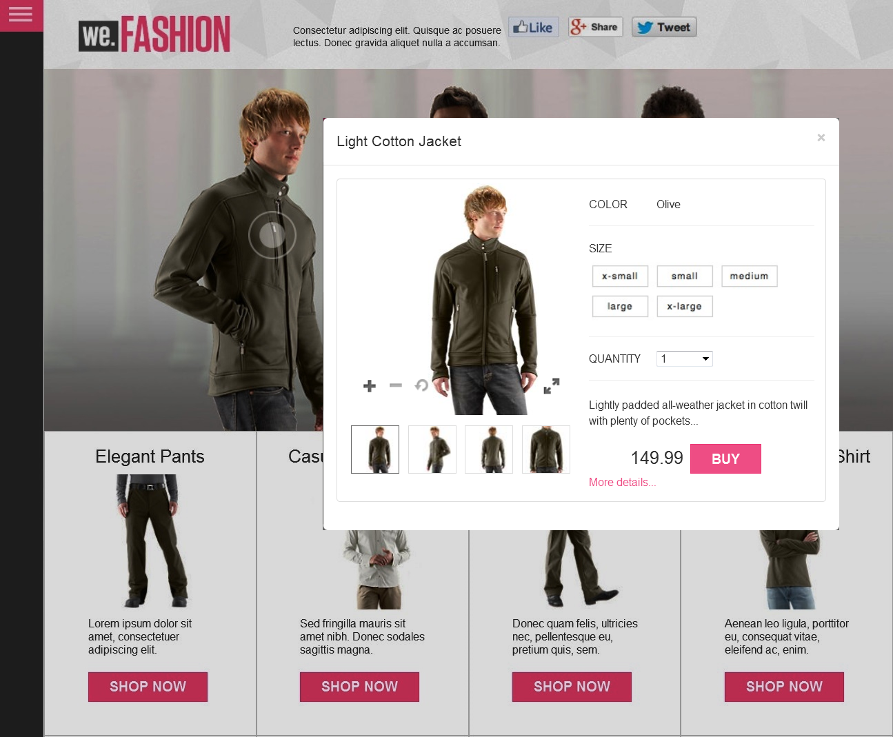

# Interactive Images {#interactive-images}

You can easily make static images rich, engaging experiences for customers by dragging and dropping "shoppable" hotspots onto an image. Shoppable hotspots combine additional information about a product or service with a direct, point-of-sale "Add to cart" or "Buy" capability. Customers can tap these hotspots and be linked directly to the product or service, add it to a shopping cart, or be linked to a web page. Direct experiences such as these increase customer engagment and conversion on your web site.

The following is a shoppable banner with a Quickview pop-up. A user activates the Quickview by tapping the circle or "hotspot" on the model.



See interactive images in action on the web page above by going to the following:

[https://marketing.adobe.com/resources/help/en_US/dm/shoppable-banner/we-fashion-QVzoom/index2-shoppable.html](https://marketing.adobe.com/resources/help/en_US/dm/shoppable-banner/we-fashion-QVzoom/index2-shoppable.html)

## Watch how interactive image banners are created {#watch-how-interactive-image-banners-are-created}

Watch a 10 minute and 33 second walkthrough on [how interactive image banners are created](https://s7d5.scene7.com/s7viewers/html5/VideoViewer.html?videoserverurl=https://s7d5.scene7.com/is/content/&emailurl=https://s7d5.scene7.com/s7/emailFriend&serverUrl=https://s7d5.scene7.com/is/image/&config=Scene7SharedAssets/Universal_HTML5_Video_social&contenturl=https://s7d5.scene7.com/skins/&asset=S7tutorials/InteractiveCarouselBanner). You will also learn how to preview, edit, and deliver interactive image banners.

## Quick Start: Interactive Images {#quick-start-interactive-images}

The following step-by-step workflow description is designed to help you get up and running quickly with interactive images in AEM Assets.

Look for the **Example** heading within some of the Quick Start tasks. It contains a brief tutorial that is based on the following web page example that does not yet have Interactive Images added to it:

[https://marketing.adobe.com/resources/help/en_US/dm/shoppable-banner/we-fashion/landing-0.html](https://marketing.adobe.com/resources/help/en_US/dm/shoppable-banner/we-fashion/landing-0.html)

The tutorial helps to illustrate the steps of integrating interactive images on your own website.

**Interactive Images workflow**:

1. **(Optional) Identifying hotspot variables** - If you use AEM Assets and Dynamic Media standalone, start by identifying dynamic variables used in your existing Quickview implementation so that you can enter hotspot data when creating the interactive image. See [(Optional) Identifying hotspot variables](#optional-identifying-hotspot-variables).

   However, if you use AEM Sites, or AEM eCommerce, or both, then this step is not necessary.  

   See [eCommerce concepts in AEM Assets](/help/sites-administering/concepts.md).  

1. **(Optional) Creating an Interactive Image viewer preset** - Customize the graphic image that is used to represent hotspots. Creating your own Interactive Image viewer preset is not required if you intend to use the out-of-the-box Interactive Image viewer preset named `Shoppable_Banner` instead. 

   See [(Optional) Creating an Interactive Image viewer preset](managing-viewer-presets.md#creating-a-new-viewer-preset).  

1. **Uploading an image banner** - Upload image banners that you want to make interactive.  

   See [Uploading an image banner](#uploading-an-image-banner).  

1. **Adding hotspots to an image banner** - Add one or more hotspots to an image banner and associate each one with an action such as a hyperlink, a Quickview, or an Experience Fragment. After you add hotspots, you will finish this task by publishing the interactive image.  

   * See [Adding hotspots to an image banner](#adding-hotspots-to-an-image-banner).
   * See [Previewing interactive images](#optional-previewing-interactive-images) - Optional. If desired, you can view a representation of your shoppable banner and test its interactivity.
   * See [Publishing Assets](publishing-dynamicmedia-assets.md) for details on how to publish interactive image assets.  

1. **Adding an interactive image to your website or to your website in AEM**

   * If you use AEM Sites, or AEM eCommerce, or both, you can add the interactive image directly to a web page in AEM by dragging the Interactive Media component onto the page. See [Adding Dynamic Media Assets to Pages.](adding-dynamic-media-assets-to-pages.md)
   * If you use AEM Assets and Dynamic Media standalone, you must copy the embed code on your website and then integrate it with your existing Quickview. See [Integrating an interactive image with your website](#integrating-an-interactive-image-with-your-website).
   * If you are using a third party WCM (Web Content Manager), you must integrate the new interactive video with the existing Quickview implementation that is used on your website. See [Integrating an interactive image with an existing Quickview](#integrating-an-interactive-image-with-an-existing-quickview).

## (Optional) Identifying hotspot variables {#optional-identifying-hotspot-variables}

>[!NOTE]
>
>This task is only required if the following are true:
>
>* You want to add interactivity to your image by triggering to Quickviews.
>* Your implementation of AEM does *not* use an eCommerce integration framework for pulling product data into AEM from any eCommerce solution such as IBM Websphere Commerce, Elastic Path, hybris, or Intershop. See [eCommerce concepts in AEM Assets](/help/sites-administering/concepts.md).
>
>If your implementation of AEM uses eCommerce, you can skip this task and proceed to the next task.

Start by identifying dynamic variables used by your existing Quickview implementation so that you can enter hotspot data to create the interactive image.

When you add hotspots to a banner image in AEM Assets you need to assign a SKU (Stock Keeping Unit; a unique identifier for each distinct product or service that you offer) and optional additional variables to each hotspot. Such hotspot variables are used later to match hotspots with Quickview content.

It is important to properly identify the number and type of variables to associate with hotspot data. Each hotspot added to a banner image must carry enough information to unambiguously identify the product in the existing backend system.

There are different ways to identify a set of variables to use for hotspot data.

Sometimes it may be enough to consult with IT specialists responsible for the existing Quickview implementation, as they are likely to know what is the minimum set of data needed to identify Quickview in the system. However, in most cases it is also possible to simply analyze the existing behavior of the front-end code.

The majority of Quickview implementations use the following paradigm:

* User activates a user interface element on the website. For example, clicking a **[!UICONTROL Quickview]** button.
* The website sends an Ajax request to the backend to load the Quickview data or content, if needed.
* The Quickview data is translated into the content in preparation for rendering on the web page.
* Finally, the front-end code visually renders such content on the screen.

The approach then is to visit different areas of the existing website where the Quickview feature is implemented, trigger the Quickview and capture the Ajax URL sent by web page for loading the Quickview data or content.

Normally there is no need for you to use any specialized debugging tools. Modern web browsers feature web inspectors that do an adequate job. The following are a few examples of web browsers that include web inspectors:

* To see all outgoing HTTP requests in Google Chrome, press F12 to open the **[!UICONTROL Developer Tools]** panel, and then click the **[!UICONTROL Network]** tab.

  On a Mac, press **[!UICONTROL Command+Option+I]** to open the **[!UICONTROL Developer Tools]** panel, then click the Network tab.  

* In Firefox, you can either activate the Firebug plug-in by pressing F12 and use its Net tab, or you can use the built-in **[!UICONTROL Inspector]** tool and its **[!UICONTROL Network]** tab.

  On a Mac, press **[!UICONTROL Command+Option+I]** to open the **[!UICONTROL Developer Tools]** panel, then click the **[!UICONTROL Inspector]** tab.

When network monitoring is turned on in the browser, trigger the Quickview on the page.

Now find the Quickview Ajax URL in the network log and copy the recorded URL for future analysis. In most cases when you trigger the Quickview there are numerous requests that are sent out to the server. Typically, the Quickview Ajax URL is one of the first in the list. It has either a complex query string portion or path, and its response MIME type is either `text/html`, `text/xml`, or `text/javascript`.

During this process it is important to visit different areas of your website, with different product categories and types. The reason is that Quickview URLs may have parts that are common for a given website category, but change only if you visit a different area of the website.

In the simplest case, the only variable part in the Quickview URL is the product SKU. In this case, the SKU value is the only data piece that you need for adding hotspots to the banner image.

However, in complex cases, the Quickview URL has different varying elements in addition to the SKU, such as category ID, color code, size code, and so forth. In such cases, every element is a separate variable in your hotspot data definition in the shoppable interactive image feature in AEM Assets.

Consider the following examples of Quickview URLs and their resulting hotspot variables:

<table> 
     <tbody> 
      <tr> 
       <td><p>Single SKU, found in the query string.</p> </td> 
       <td><p>The recorded Quickview URLs include the following:</p> 
        <ul> 
         <li><p><code>https://server/json?productId=866558&amp;source=100</code></p> </li> 
         <li><p><code>https://server/json?productId=1196184&amp;source=100</code></p> </li> 
         <li><p><code>https://server/json?productId=1081492&amp;source=100</code></p> </li> 
         <li><p><code>https://server/json?productId=1898294&amp;source=100</code></p> </li> 
        </ul> <p>The only variable part in the URL is the value of the productId= query string parameter, and it is clearly a SKU value. Therefore, our hotspots only need SKU fields populated with values like <strong><code>866558</code></strong>, <strong><code>1196184</code></strong>, <strong><code>1081492</code></strong>, <strong><code>1898294</code></strong>.</p> </td> 
      </tr> 
      <tr> 
       <td><p>Single SKU, found in the URL path.</p> </td> 
       <td><p>The recorded Quickview URLs include the following:</p> 
        <ul> 
         <li><p><code>https://server/product/6422350843</code></p> </li> 
         <li><p><code>https://server/product/1607745002</code></p> </li> 
         <li><p><code>https://server/product/0086724882</code></p> </li> 
        </ul> <p>The variable part is in the last portion of the path, and it becomes the SKU value of the hotspots: <strong><code>6422350843</code></strong>, <strong><code>1607745002</code></strong>, <strong><code>0086724882</code></strong>.</p> </td> 
      </tr> 
      <tr> 
       <td><p>SKU and category ID in the query string.</p> </td> 
       <td><p>The recorded Quickview URLs include the following:</p> 
        <ul> 
         <li><p><code>https://server/quickView/product/?category=1100004&amp;prodId=305466</code></p> </li> 
         <li><p><code>https://server/quickView/product/?category=1100004&amp;prodId=310181</code></p> </li> 
         <li><p><code>https://server/quickView/product/?category=1740148&amp;prodId=308706</code></p> </li> 
        </ul> <p>In this case, there are two varying parts in the URL. The SKU is stored in the <code>prodId</code> parameter and the category ID<code></span> is stored in the <span class="code">category=</code> parameter.</p> <p>As such, the hotspot definitions are pairs. That is, a SKU value and an additional variable called <code>categoryId</code>. The resulting pairs are the following:</p> 
        <ul> 
         <li><p>SKU is <strong><code>305466</code></strong> and <code>categoryId</code> is <code>1100004</code>.</p> </li> 
         <li><p>SKU is <strong><code>310181</code></strong> and <code>categoryId</code> is <strong><code>1100004</code></strong>.</p> </li> 
         <li><p>SKU is <strong><code>308706</code></strong> and <code>categoryId</code> is <strong><code>1740148</code></strong>.</p> </li> 
        </ul> <p> </p> </td> 
      </tr> 
     </tbody> 
    </table> </td> 
  </tr> 
  <tr></tr> 
</table>

**Example**

You can apply the same approach used in the three examples above to the demo web page:

[https://marketing.adobe.com/resources/help/en_US/dm/shoppable-banner/we-fashion/landing-0.html](https://marketing.adobe.com/resources/help/en_US/dm/shoppable-banner/we-fashion/landing-0.html)

The demo web page has several product thumbnails, each having a Quickview button labeled **[!UICONTROL See More]**. With your web browser's debugging tool still activated, click each button and note the recorded Quickview URLs. After you activate all four product Quickviews available on the page, you have the following list of Quickview requests made to the backend:

* `/datafeed/Men-Windbreaker.json`
* `/datafeed/Men-SimpleHenley.json`
* `/datafeed/Men-CamoPullover.json`
* `/datafeed/Women-QuiltedDownJacket.json`

Looking at these server calls, you see that product-specific information is only present in the request path. You also notice that the query string is not used at all and there are two distinct types of data pieces involved:

* The first type is Men or Women. You can call this "product category".
* The second type is product name, such as CamoPullover. You can assume this is the product SKU.

Given this information, the entire Quickview URL has the following pattern:

`/datafeed/$categoryId$-$SKU$.json`

Based on such analysis, you would use `categoryId` and `SKU` for hotspots.

You are now ready to upload an image banner and add hotspots to it using the shoppable interactive image feature in AEM Assets.

## (Optional) Creating an Interactive Image viewer preset {#optional-creating-an-interactive-image-viewer-preset}

You can choose to use the default, out-of-the-box Interactive Image viewer preset called **[!UICONTROL Shoppable_Banner]** that comes with AEM Assets. Or you can create your own custom viewer preset for use with interactive images.

When you create a custom Interactive Image viewer preset, you can determine the look of hotspots on the image banner. As part of the creation of the viewer preset, you can choose to use a hotspot graphic from a gallery of pre-defined images.

After you save the viewer preset, it is automatically activated (turned on) on the **[!UICONTROL Viewer Preset]** list page in AEM Assets. This functionality means that it is visible in the Interactive Media component and whenever you view an asset. However, to *deliver* an interactive banner with this viewer preset, you must *publish* your viewer preset as well (this is true for custom or out-of-box viewer presets).

**To create an Interactive Image viewer preset**:

1. In the left rail, tap **[!UICONTROL Tools > Assets > Viewer Presets]**.
1. Near the upper-right corner of the page, tap **[!UICONTROL Create]**.
1. In the **[!UICONTROL New Viewer Preset]** dialog box, type a name to describe the interactive banner viewer preset.  

   This is the title that will appear in the **[!UICONTROL Viewer Preset]** list page after you save.
1. In the **[!UICONTROL Rich Media Type]** pull-down menu, select **[!UICONTROL Interactive Image]**.
1. Tap **Create**.
1. On the **[!UICONTROL Edit Viewer Preset]** page, tap the **[!UICONTROL Appearance]** tab.
1. Do one of the following:

    * To upload your own hotspot image that you want to use on images, tap the **[!UICONTROL Asset Picker]** icon. In the **[!UICONTROL Select Content]** page, navigate to the hotspot image you want to use, select it, and then tap the **[!UICONTROL Check Mark]** icon in the upper-right corner.
    * To select a predefined hotspot image, tap the **[!UICONTROL Hotspot Gallery]** icon. On the hotspot gallery pallette, tap the hotspot image you want to use.

1. Near the upper-right corner of the page, tap **[!UICONTROL Save]**.

   Be sure you publish the new viewer preset.

   See [Publishing Viewer Presets That You Have Added](managing-viewer-presets.md#publishing-viewer-presets).

   You are now ready to upload an image banner.

## Uploading an image banner {#uploading-an-image-banner}

If you have already uploaded the images that you want to use, advance to the next step, [Adding hotspots to an image banner](#adding-hotspots-to-an-image-banner).

**To upload an image banner**:

1. Upload image banners that you want to make interactive.

   See [Uploading assets](managing-assets-touch-ui.md#uploading-assets).

   You are now ready to add hotspots to the image banner; see the next task below.

## Adding hotspots to an image banner {#adding-hotspots-to-an-image-banner}

You can add hotspots to an image banner using the editor on the **[!UICONTROL Hotspot Management]** page.

When you add hotspots, you can define them as a Quickview pop-up display, as a hyperlink, or an Experience Fragment.

See [Experience Fragments](/help/sites-authoring/experience-fragments.md).

>[!NOTE]
>
>Be aware that the social media sharing tools in Interactive Image are not supported when you embed the viewer in an Experience Fragment. To work around this, you can use or create viewer presets that do not have social media sharing tools. Such viewer presets let you successfully embed it in Experience Fragments.

**[!UICONTROL Undo]** and **[!UICONTROL Redo]** options, near the upper-right corner of the page, are supported during your current creation/editing session.

When you finish creating your interactive image, you can use **[!UICONTROL Preview]** to see a representation of how your interactive image will appear to customers.

See [(Optional) Previewing interactive images](#optional-previewing-interactive-images).

>[!NOTE]
>
>When you add hotspots to an image in an Interactive Image or a Carousel Banner, the hotspot information is stored in the same metadata location--relative to the image's location--regardless of whether it is an Interactive Image or a Carousel Banner. This functionality means that you can easily re-use the same image--along with its defined hotspot data--in either viewer.  
  
>Be aware, however, that Carousel Banners support image maps on images that can also contain hotspots; an Interactive Image does not. Keep this in mind if you intend to create an Interactive Image or Carousel Banner that uses the same image. You may want to create Interactive Images and Carousel Banners using separate copies of the same image instead.
>
>See also [Carousel Banners](carousel-banners.md).

>[!NOTE]
>
>If you are editing interactive images with hotspots and crop the image, your hotspots are removed.

**To add hotspots to an image banner**:

1. In the Assets view, navigate to the image banner that you want to make interactive.
1. Do one of the following:

    * Hover on the image, then tap **[!UICONTROL Select** (checkmark icon). On the toolbar, tap **[!UICONTROL Edit**. 
    * Hover on the image, then tap **[!UICONTROL More actions]** (three dots icon) &gt; **[!UICONTROL Edit]**.
    * Tap the image to open it in the **[!UICONTROL Detail View]** page. On the toolbar, tap **[!UICONTROL Edit**.

1. Near the upper-left corner of the page, tap **[!UICONTROL Add Hotspot]** (finger tap icon) to open the **[!UICONTROL Hotspot Management]** page.
1. Near the upper-left corner of the page, tap **[!UICONTROL Hotspot]**.
1.  a. Near the upper-left corner of the **Hotspot Management** page, tap **[!UICONTROL Hotspot]**.
    b. On the image, tap a location where you want the hotspot to appear. If necessary, drag the hotspot to adjust its location.
    c. Add additional hotspots as necessary by repeating steps a and b.
    d. (Optional) To delete a hotspot, select it on the image, then tap **[!UICONTROL Delete]** (garbage can icon) under the **[!UICONTROL Hotspots]** heading.

1. In the **[!UICONTROL Name]** text field, type the name of the hotspot. This name also appears in the **[!UICONTROL Selected Hotspot]** drop-down list.
1. Do one of the following:

    * Tap **[!UICONTROL Quickview]**.

        * If you are an AEM Sites or eCommerce customer, tap the **[!UICONTROL Product Picker]** icon (magnifying glass) to open the **[!UICONTROL Select Product]** page. Tap the product you want to use, then tap **[!UICONTROL Select]** in the upper-right corner of the page to return to the **[!UICONTROL Hotspot Management]** page.
        * If you are *not* an AEM Sites or eCommerce customer

            * See [Identifying hotspot variables](#optional-identifying-hotspot-variables); you will need to define these variables. 
            * Then, manually enter the SKU value. In the **[!UICONTROL SKU Value]** text field, type the product's SKU (Stock Keeping Unit), which is a unique identifier for each distinct product or service that you offer. The entered SKU value automatically populates the variable portion of the Quickview template so that the system knows to associate the tapped hotspot with a particular SKU's Quickview.
            * (Optional) If there are other variables within the Quickview that you need to use to further identify a product, tap **[!UICONTROL Add Generic Variable]**. In the text field, specify an additional variable. For example, `category=Mens` is an added variable.

    * Tap **Hyperlink**.

        * If you are an AEM Sites customer, tap the **[!UICONTROL Site Selector]** icon (folder) to navigate to a URL. Note that the URL-based method of linking is not possible if your interactive content has links with relative URLs, particularly links to AEM Sites pages.
        * If you are a standalone customer, in the **[!UICONTROL HREF]** text field, specify the full URL path to a linked web page.

        Be sure you specify whether to open the link in a new browser tab (recommended default) or the same tab.

        See [Working with Selectors](working-with-selectors.md) for more information.

    * Tap **Experience Fragment**.

        * If you are an AEM Sites customer, tap the **[!UICONTROL Search]** icon (magnifying glass) to open the **[!UICONTROL Experience Fragment]** page. Tap the Experience Fragment you want to use, then tap **[!UICONTROL Select]** in the upper-right corner of the page to return to the Hotspot management page.  

          See [Experience Fragments](/help/sites-authoring/experience-fragments.md).
          >[!NOTE]
          >Be aware that the social media sharing tools in Interactive Image are not supported when you embed the viewer in an Experience Fragment. To work around this, you can use or create viewer presets that do not have social media sharing tools. Such viewer presets let you successfully embed it in Experience Fragments.

        * Specify the width and height of the Experience Fragment as it will appear on the banner.

1. Tap **[!UICONTROL Save]** to save your work and return to the **[!UICONTROL Browse]** page.
1. Publish the interactive image. Publishing allows for the banner to be delivered through the cloud and also generates embed code if you need to integrate with a third party website.

   See [Publishing assets](managing-assets-touch-ui.md#publishing-assets).

   After you have added hotspots and published the interactive image, you are now ready to add it to your existing website.

   See [Integrating an interactive image with your website](#integrating-an-interactive-image-with-your-website).

   >[!NOTE]
   >
   >If you are editing interactive images with hotspots and crop the image, your hotspots are deleted.

### (Optional) Previewing interactive images {#optional-previewing-interactive-images}

You can use Preview to see a representation of what your interactive image will look like to customers and to test the image's hotspots to ensure they are behaving as expected.

When you are satisfied with the interactive image, you can publish it.  
See [Embedding the Video or Image Viewer on a Web Page](embed-code.md).  
See [Linking URLs to your web application](linking-urls-to-yourwebapplication.md). Note that the URL-based method of linking is not possible if your interactive content has links with relative URLs, particularly links to AEM Sites pages.  
See [Adding Dynamic Media Assets to Pages.](adding-dynamic-media-assets-to-pages.md)

**To preview interactive images**:

1. In the Assets view, navigate to an existing interactive image that you have created and tap to open it in Preview.
1. Near the upper-left corner of the Preview page, in the **[!UICONTROL Content]** drop-down list, tap **[!UICONTROL Viewers]**.
1. In the **[!UICONTROL Viewers]** list, tap **[!UICONTROL Shoppable_Banner]** or the name of the interactive image viewer preset you have created.
1. Tap hotspots on the image to test their associated actions.

## Publishing interactive image assets {#publishing-interactive-image-assets}

See [Publishing Assets](publishing-dynamicmedia-assets.md) for details on how to publish interactive image assets.

## Integrating an interactive image with your website {#integrating-an-interactive-image-with-your-website}

After you have uploaded a banner image, added hotspots to the image, and published the interactive image, you are now ready to add it to your website page.

If you are an AEM Sites customer, you can add the interactive image by dragging the Interactive Media component onto your page. See [Adding Dynamic Media Assets to Pages.](adding-dynamic-media-assets-to-pages.md)

If you are a standalone AEM Assets customer, you can manually add the interactive image to your website as described in this section.

1. Copy the published interactive image's embed code.  

   See [Embedding the Video or Image Viewer on a Web Page](embed-code.md).

1. Add the copied embed code on the desired location within the webpage.

   The copied embed code is set for a responsive environment so it should automatically fit the assigned area.

**Example**

Using the demo website as an example:

[https://marketing.adobe.com/resources/help/en_US/dm/shoppable-banner/we-fashion/landing-0.html](https://marketing.adobe.com/resources/help/en_US/dm/shoppable-banner/we-fashion/landing-0.html)

Notice that the picture of the three men is a static `IMG` tag:

```xml

```

Integration is as simple as removing the `IMG` tag and replacing it with the copied embed code from AEM Assets. You can see the result in the following URL which shows the shoppable interactive image on the page with three circle hotspots:

[https://marketing.adobe.com/resources/help/en_US/dm/shoppable-banner/we-fashion/landing-1.html](https://marketing.adobe.com/resources/help/en_US/dm/shoppable-banner/we-fashion/landing-1.html)

>[!NOTE]
>
>As this point, the hotspots on the shoppable interactive image of the demo website are for display purposes only; they are not yet integrated with the existing Quickviews.

To apply a crop to a shoppable interactive image for a responsive environment, you can include the Interactive Image configuration attribute `ZoomView.iscommand` to the path&mdash;where `ZoomView` is the component to call and `iscommand` is the crop image serving command that you apply.

See [ZoomView.iscommand](https://marketing.adobe.com/resources/help/en_US/s7/viewers_ref/r_html5_aem_interactive_image_config_attrib_zoomview_iscommand.html) configuration attribute.

See [crop](https://marketing.adobe.com/resources/help/en_US/s7/is_ir_api/is_api/http_ref/r_crop.html) image serving command.

You are now ready to integrate the interactive image with an existing Quickview on your website.

## Integrating an interactive image with an existing Quickview {#integrating-an-interactive-image-with-an-existing-quickview}

>[!NOTE]
>
>This task only applies if you are a standalone AEM Assets customer.

The last step in this process is integrating the interactive image with an existing Quickview implementation on your website. There is no solution to the integration that works for all cases. Every Quickview implementation is unique and a specific approach is needed that most likely involves the assistance of a front-end IT person.

The existing Quickview implementation normally represents a chain of inter-related actions that happen on the web page in the following order:

1. A user triggers an element in the user interface of your website.
1. The front-end code obtains a Quickview URL based on the user interface element that was triggered in step 1.
1. The front-end code sends an Ajax request using the URL obtained in step 2.
1. The backend logic returns the corresponding Quickview data or content back to the front-end code.
1. The front-end code loads the Quickview data or content.
1. Optionally, the front-end code converts the loaded Quickview data into an HTML representation.
1. The front-end code displays a modal dialog box or panel and renders the HTML content on the screen for the end user.

These calls may not represent independent public API calls which can be called by the web page logic from an arbitrary step. Instead, it is a chained call where every next step is hidden in the last phase (callback) of the previous step.

At the same time that the shoppable interactive image is replacing step 1, and partially step 2, when a user clicks a hotspot inside the shoppable image, such user interaction is handled by the viewer. The viewer returns an event to the web page that contains all the hotspot data previously added to AEM Assets.

In such an event handler, the front-end code does the following:

* Listens to an event emitted by the shoppable interactive image.
* Constructs a Quickview URL based on the hotspot data.
* Triggers the process of loading the Quickview from the backend and rendering it on the screen for display.

The embed code returned by AEM Assets already has a ready-to-use event handler in place that is commented out, as seen in the following highlighted code snippet:

```xml
        var s7interactiveimageviewer = new s7viewers.InteractiveImage({
            "containerId" : "s7interactiveimage_div",
            "params" : { 
                "serverurl" : "https://aodmarketingna.assetsadobe.com/is/image",
                "contenturl" : "https://aodmarketingna.assetsadobe.com/", 
                "config" : "/etc/dam/presets/viewer/Shoppable_Media",
                "asset" : "/content/dam/mac/aodmarketingna/shoppable-banner/shoppable-banner.jpg" }
        })
        /* // Example of interactive image event for Quickview.
             s7interactiveimageviewer.setHandlers({ 
                "quickViewActivate": function(inData) {
                    var sku=inData.sku; //SKU for product ID
                    //To pass other parameter from the hotspot, you will need to add custom parameter during the hotspot setup as parameterName=value
                    loadQuickView(sku); //Replace this call with your Quickview plugin
                    //Please refer to your Quickviewer plugin for the Quickview call
                 }, 
             });
        */
        s7interactiveimageviewer.init();
```

So, it is only necessary to uncomment the code and replace the dummy handler body with the code that is specific to the particular web page.

The process of constructing the Quickview URL is basically opposite of the process used for identifying hotspot variables covered earlier.

See [Identifying hotspot variables](#optional-identifying-hotspot-variables).

Using our previous Quickview URL examples, you can see, in the following examples, how the Quickview URL is constructed in each case:

<table> 
 <tbody> 
  <tr> 
   <td><p>Single SKU, found in the query string</p> </td> 
   <td><code class="code">s7interactiveimageviewer.setHandlers({
      "quickViewActivate": function(inData) {
      var quickViewUrl = "https://server/json?productId=" + inData.sku + "&amp;amp;source=100";
      },
      });</code></td> 
  </tr> 
  <tr> 
   <td><p>Single SKU, found in the URL path</p> </td> 
   <td><code class="code">s7interactiveimageviewer.setHandlers({
      "quickViewActivate": function(inData) {
      var quickViewUrl = "https://server/product/" + inData.sku;
      },
      });</code></td> 
  </tr> 
  <tr> 
   <td><p>SKU and category ID in the query string</p> </td> 
   <td><code class="code">s7interactiveimageviewer.setHandlers({
      "quickViewActivate": function(inData) {
      var quickViewUrl = "https://server/quickView/product/?category=" + inData.categoryId + "&amp;amp;prodId=" + inData.sku;
      },
      });</code></td> 
  </tr> 
 </tbody> 
</table>

The last step to trigger the Quickview URL and activate the Quickview panel most likely requires the assistance of a front-end IT person from your IT department. They have the knowledge to know best how to accurately trigger the Quickview implementation from the proper step, having a ready-to-use Quickview URL.

You can see how these steps are applied to the demo website to fully integrate a shoppable interactive image with the Quickview code. Earlier, the structure of the Quickview URL was identified as the following:

```xml
/datafeed/$categoryId$-$SKU$.json
```

To reconstruct this URL inside the `quickViewActivate` handler, you can use the `categoryId` and `SKU` fields available in the `inData` object that is passed to the handler by the viewer's code:

```xml
var sku=inData.sku;
var categoryId=inData.categoryId;
var quickViewUrl = "datafeed/" + categoryId + "-" + sku + ".json";
```

The demo website is triggering the Quickview dialog box using a simple `loadQuickView()` function call. This function takes only one argument, which is the Quickview data URL. As such, the last step needed to integrate the shoppable interactive image is to add the following line of code to the `quickViewActivate` handler:

```xml
loadQuickView(quickViewUrl);
```

The following is the complete source code:

```xml
 var s7interactiveimageviewer = new s7viewers.InteractiveImage({
  "containerId" : "s7interactiveimage_div",
  "params" : { 
   "serverurl" : "https://aodmarketingna.assetsadobe.com/is/image",
   "contenturl" : "https://aodmarketingna.assetsadobe.com/", 
   "config" : "/etc/dam/presets/viewer/Shoppable_Media",
   "asset" : "/content/dam/mac/aodmarketingna/shoppable-banner/shoppable-banner.jpg" }
 })
   s7interactiveimageviewer.setHandlers({ 
   "quickViewActivate": function(inData) {
     var sku=inData.sku;
     var categoryId=inData.categoryId;
    var quickViewUrl = "datafeed/" + categoryId + "-" + sku + ".json";
    loadQuickView(quickViewUrl);
    }, 
   });
 s7interactiveimageviewer.init();
```

The final demo website with the fully integrated interactive image looks like the following:

[https://marketing.adobe.com/resources/help/en_US/dm/shoppable-banner/we-fashion/landing-3.html](https://marketing.adobe.com/resources/help/en_US/dm/shoppable-banner/we-fashion/landing-3.html)

## Using Quickviews to create custom pop-ups {#using-quickviews-to-create-custom-pop-ups}

See [Using Quickviews to create custom pop-ups](custom-pop-ups.md).
