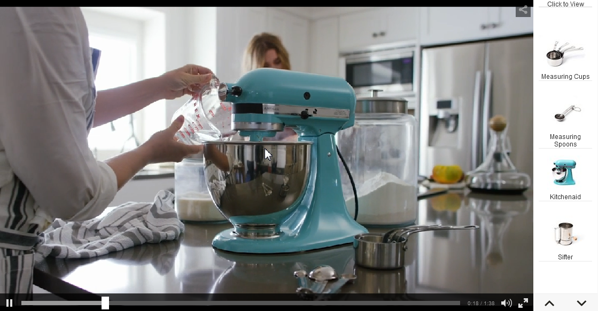
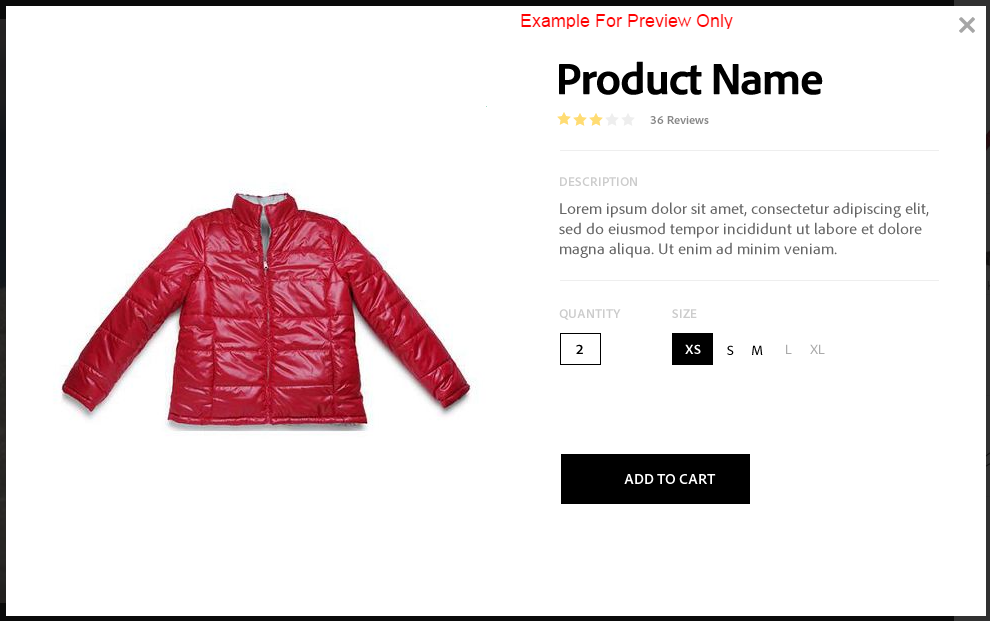
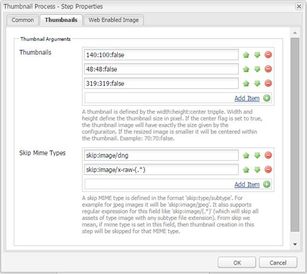
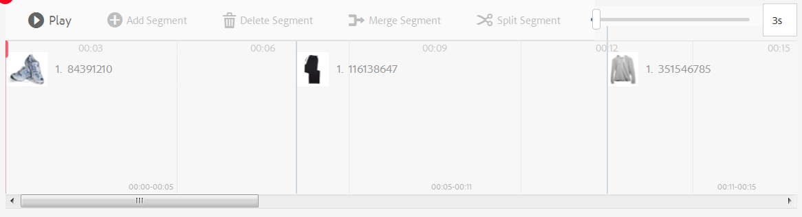
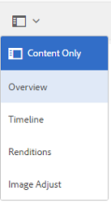
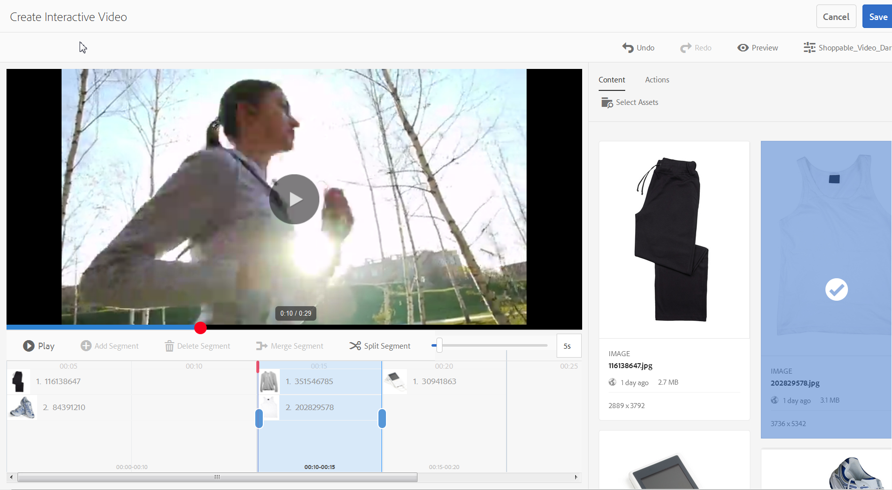
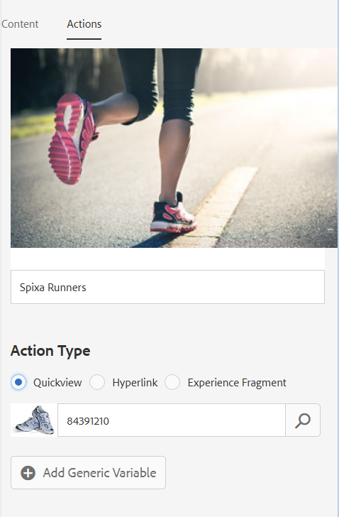
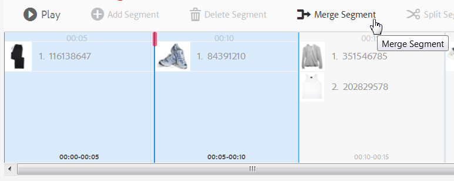

# Interactive videos{#interactive-videos}

You can easily create interactive videos &ndash; also know as shoppable videos &ndash; that drive conversion directly from the video. Customer engagement with the video takes place in a panel alongside the video player where related service, information, or product thumbnails are scrolled into view based on what is featured in the video. Customers can select the thumbnail and be linked directly to the service, or add the item to a shopping cart for immediate purchase, or be linked to a web page for more information.

When the video ends, a visual summary of all offerings is displayed to drive a call to action. Customers have another opportunity to select the item they want. Actionable and specific experiences such as these increase customer engagements and conversions.

See also [Interactive Images](/help/assets/interactive-images.md).

## Interactive video in action {#interactive-video-in-action}

To see an interactive, shoppable video in action, select [Live Demos](https://landing.adobe.com/en/na/dynamic-media/ctir-2755/live-demos.html), scroll to the **[!UICONTROL Shoppable Media]** heading on the page, then select the shoppable video.

* During playback, as products are used in the video, the identical product appears on the right as a thumbnail image.

* Select the thumbnail if you want to pause the video and open the product's Quickview. For example, select the KitchenAid thumbnail image in the video to experience a 360-degree spin view of the mixer, or zoom in to see mixer details.

<!-- There was a link here that showed the video frame of an interactive video and when the reader selected the frame the video would play https://experienceleague.adobe.com/tools/dynamic-media-demo/shoppable-video/AXIS/index.html. This now needs to call a new interactive video-->

 *A video frame capture from an interactive, shoppable video.*

>[!NOTE]
>
>If you create an interactive video to launch a web page when a user selects a thumbnail image, some devices block the pop-up web page from opening. In such cases, you must change the pop-up blocker setting on the device. For example, on an Apple iPhone 6, navigate to **[!UICONTROL Settings]** > **Safari** > **Block Pop-ups**, then slide the control to **[!UICONTROL Off]**. Now, when you play an interactive video and select a thumbnail, you are prompted if you want to open the pop-up. If you accept, the web page opens.

### Watch how interactive videos are created {#watch-how-interactive-videos-are-created}

Play a walkthrough on [how interactive videos are created](https://s7d5.scene7.com/s7viewers/html5/VideoViewer.html?videoserverurl=https://s7d5.scene7.com/is/content/&emailurl=https://s7d5.scene7.com/s7/emailFriend&serverUrl=https://s7d5.scene7.com/is/image/&config=Scene7SharedAssets/Universal_HTML5_Video_social&contenturl=https://s7d5.scene7.com/skins/&asset=S7tutorials/InteractiveVideo) (7 minutes and 30 seconds).
Although the video walkthrough is branded with Assets on Demand, the principles and steps still apply to Interactive Video in Adobe Experience Manager Assets.

### Adobe Customer Solutions Webinar {#adobe-customer-success-webinar}

The "Using Interactive Video, Link Sharing, and YouTube sharing in Experience Manager Assets" webinar teaches you how to use interactive video and other features to tie conversion driven events into your video marketing content.

>[!NOTE]
>
>[Using Interactive Video, Link Sharing, and YouTube sharing in Experience Manager Assets](https://adobecustomersuccess.adobeconnect.com/p1yxzdo4aec/).

## Quick Start: Interactive Videos {#quick-start-interactive-videos}

The following step-by-step workflow description is designed to help you get up and running quickly with interactive videos in Dynamic Media.

Look for the **Example** heading within some of the Quick Start tasks. It contains a brief tutorial that is based on this starting demo web page that *does not* have interactivity added to it yet:

[https://experienceleague.adobe.com/tools/dynamic-media-demo/shoppable-video/john-lewis/landing-0.html](https://experienceleague.adobe.com/tools/dynamic-media-demo/shoppable-video/john-lewis/landing-0.html)

The **Examples** help to illustrate the steps of integrating interactive videos on your own website.

When you finish the tutorial in the last Example section, the final demo web page with the fully integrated interactive video looks like the following:

[https://experienceleague.adobe.com/tools/dynamic-media-demo/shoppable-video/john-lewis/landing-3.html](https://experienceleague.adobe.com/tools/dynamic-media-demo/shoppable-video/john-lewis/landing-3.html)

Interactive video steps:

1. **(Optional) Identify Quickview variables** - Start by identifying dynamic variables used by your existing Quickview implementation. You use the variables to map product thumbnails to their corresponding product Quickview when you create your interactive video. See [(Optional) Identify Quickview variables](#optional-identifying-quickview-variables).
   *This step is only required if all the following are true*:
   * You want to add interactivity to your video by triggering to Quickview.
   * Your implementation of Experience Manager does *not* use an eCommerce integration framework for pulling product data into Experience Manager from any eCommerce solution such as IBM&reg; WebSphere&reg; Commerce, Elastic Path, Hybris, or Intershop. See [eCommerce concepts in Experience Manager Assets](/help/commerce/cif-classic/administering/concepts.md).

1. **(Optional) Create an Interactive Video viewer preset** - Customize the appearance and behavior of various components that make up the player such as the video scrubber and the interactive thumbnails.
   Creating your own Interactive Video viewer preset is not required if you intend to use the out-of-the-box Interactive Video viewer presets `Shoppable_Video_Light` or `Shoppable_Video_Dark` instead.
   See [Create a Viewer Preset](/help/assets/managing-viewer-presets.md#creating-a-new-viewer-preset) (optional) and [Special considerations for creating an Interactive Viewer preset](/help/assets/managing-viewer-presets.md#special-considerations-for-creating-an-interactive-viewer-preset).

1. **Upload a video and its associated image assets** - Upload a video and associated images that you want to make interactive.
   See [Upload a video and its associated thumbnail assets](#uploading-a-video-and-its-associated-thumbnail-assets).

   >[!NOTE]
   >
   >MXF video format is not yet supported for use with interactive videos in Dynamic Media.

1. **Add interactivity to your video** - Add one or more time segments to the video. Then, associate image thumbnails within those time segments. Assign each image thumbnail to an action such as a hyperlink, a Quickview, or an Experience Fragment.
   (The URL-based method of linking is not possible if your interactive content has links with relative URLs, particularly links to Experience Manager Sites pages.)
   Finish by publishing the interactive video assets. Publishing creates the embed code or URL that you eventually copy and apply to your website landing page. See [Add interactivity to your video](#adding-interactivity-to-your-video).
   See [Publish Assets](/help/assets/publishing-dynamicmedia-assets.md).

1. **Add an interactive video to your website or to your website in Experience Manager** - If you use Experience Manager Sites or eCommerce, or both, you can add the interactive video to a web page. Drag the Interactive Media component onto the page in Experience Manager. See [Add Dynamic Media Assets to Pages](/help/assets/adding-dynamic-media-assets-to-pages.md).
   Use the embed code or URL to integrate your interactive video with your website experiences. See [Integrate an interactive video with your website](#integrating-an-interactive-video-with-your-website).
   If you are using a third-party WCM (Web Content Manager), you must integrate the new interactive video with the existing Quickview implementation that is used on your website. See [Integrate an interactive video with an existing Quickview](#integrating-an-interactive-video-with-an-existing-quickview).
   [Add Dynamic Media Assets to Pages](/help/assets/adding-dynamic-media-assets-to-pages.md)

## (Optional) Identify Quickview variables {#optional-identifying-quickview-variables}

>[!NOTE]
>
>This task is only required if the following are true:
>
>* You want to add interactivity to your video by triggering to Quickview.
>* Your implementation of Experience Manager does *not* use an eCommerce integration framework for pulling product data into Experience Manager from any eCommerce solution such as IBM&reg; WebSphere&reg; Commerce, Elastic Path, Hybris, or Intershop. See [eCommerce concepts in Experience Manager Assets](/help/commerce/cif-classic/administering/concepts.md).
>
>If your implementation of Experience Manager uses eCommerce, you can skip this task and proceed to the next task.

Start by identifying dynamic variables used by your existing Quickview implementation so that you can map product thumbnails to their corresponding product Quickview during the interactive video creation process.

When you add time segments to a video, you assign a SKU (Stock Keeping Unit) and any additional variables to each thumbnail you add to a segment. Such variables are used later to display the right Quickview product.

It is important to properly identify what variables are required to uniquely trigger a product Quickview.

Sometimes it is enough to consult with IT specialists responsible for your existing Quickview implementation. They are likely to know the minimum set of data to identify Quickview in the system. However, it is also possible to simply analyze the existing behavior of the front-end code.

Most Quickview implementations use the following paradigm:

* User activates a user interface element on the website. For example, selecting a "Quickview" button.
* The website sends an Ajax request to the backend to load the Quickview data or content, if needed.
* The Quickview data is translated into the content in preparation for rendering on the web page.
* Finally, the front-end code visually renders such content on the screen.

The approach, therefore, is to visit different areas of your existing website where Quickview is implemented, trigger the Quickview, and capture the Ajax URL sent by the web page for loading the Quickview data or content.

Normally there is no need for you to use any specialized debugging tools. Modern web browsers feature web inspectors that do an adequate job. The following are a few examples of web browsers that include web inspectors:

* To see all outgoing HTTP requests in Google Chrome, press **F12** (Windows) or **Command+Options+I** (Mac) to open the Developer Tools panel, and then select the **Network** tab.

* In Firefox, you can either activate the Firebug plug-in by pressing **F12** (Windows) or **Command+Option+I** (Mac) and use its **`[Net]`** tab, or you can use the built-in Inspector tool and its Network tab.

* In Internet Explorer, activate the debugger tool by pressing **F12**.

When network monitoring is turned on in the browser, trigger the Quickview on the page.

Now find the Quickview Ajax URL in the network log and copy the recorded URL for future analysis. Usually, when you trigger the Quickview, there are numerous requests that are sent out to the server. Typically, the Quickview Ajax URL is one of the first in the list. It has either a complex query string portion or path, and its response MIME type is either `text/html`, `text/xml`, or `text/javascript`.

During this process, it is important to visit different areas of your website, with different product categories and types. The reason is that Quickview URLs can have parts that are common for a given website category, but change only if you visit a different area of the website.

In the simplest case, the only variable part in the Quickview URL is the product SKU. In this case, the product SKU value is the only data piece needed for adding thumbnails to a time segment in the interactive video in Experience Manager.

However, in complex cases, the Quickview URL has different varying elements in addition to the product SKU, such as category ID, color code, and size code. In such cases, every such element becomes a separate variable in the thumbnail data definition in Experience Manager.

Consider the following examples of Quickview URLs and their resulting thumbnail variables:

<table>
  <tbody>
  <tr>
    <td><p>Single SKU, found in the query string.</p> </td>
    <td><p>The recorded Quickview URLs include the following:</p>
    <ul>
      <li><p><code>https://server/json?productId=866558&amp;source=100</code></p> </li>
      <li><p><code>https://server/json?productId=1196184&amp;source=100</code></p> </li>
      <li><p><code>https://server/json?productId=1081492&amp;source=100</code></p> </li>
      <li><p><code>https://server/json?productId=1898294&amp;source=100</code></p> </li>
    </ul> <p>The only variable part in the URL is the value of the <code>productId=</code> query string parameter, and it is clearly a SKU value. Therefore, your thumbnails only need SKU fields populated with values like <strong><code>866558</code></strong>, <strong><code>1196184</code></strong>, <strong><code>1081492</code></strong>, <strong><code>1898294</code></strong>.</p> </td>
  </tr>
  <tr>
    <td><p>Single SKU, found in the URL path.</p> </td>
    <td><p>The recorded Quickview URLs include the following:</p>
    <ul>
      <li><p><code>https://server/product/6422350843</code></p> </li>
      <li><p><code>https://server/product/1607745002</code></p> </li>
      <li><p><code>https://server/product/0086724882</code></p> </li>
    </ul> <p>The variable part is in the last portion of the path, and it becomes the SKU value of Experience Manager thumbnails: <strong><code>6422350843</code></strong>, <strong><code>1607745002</code></strong>, <strong><code>0086724882</code></strong>.</p> </td>
  </tr>
  <tr>
    <td><p>SKU and category ID in the query string.</p> </td>
    <td><p>The recorded Quickview URLs include the following:</p>
    <ul>
      <li><p><code>https://server/quickView/product/?category=1100004&amp;prodId=305466</code></p> </li>
      <li><p><code>https://server/quickView/product/?category=1100004&amp;prodId=310181</code></p> </li>
      <li><p><code>https://server/quickView/product/?category=1740148&amp;prodId=308706</code></p> </li>
    </ul> <p>In this case, there are two varying parts in the URL. The SKU is stored in the <code>prodId</code> parameter and the category ID is stored in the <code>category=</code> parameter.</p> <p>As such, the thumbnail definitions are pairs. That is, a SKU value and an extra variable called <code>categoryId</code>. The resulting pairs are the following:</p>
    <ul>
      <li>SKU is <code>305466</code> and <code>categoryId</code> is <code>1100004</code></li>
      <li>SKU is <code>310181</code> and <code>categoryId</code> is <code>1100004</code></li>
      <li>SKU is <code>308706</code> and <code>categoryId</code> is <code>1740148</code></li>
    </ul> <p> </p> </td>
  </tr>
  </tbody>
</table>

**Example**

When the above approach is applied to the Example website, you have a web page with several product thumbnails, each having a "SEE MORE" button:

[https://experienceleague.adobe.com/tools/dynamic-media-demo/shoppable-video/john-lewis/landing-0.html](https://experienceleague.adobe.com/tools/dynamic-media-demo/shoppable-video/john-lewis/landing-0.html)

After you activate all product Quickview's that are available on the page, you get the following list of Quickview requests made to the backend:

* datafeed/candles-233396346.json
* datafeed/candles-233978050.json
* datafeed/candles-234024346.json
* datafeed/candles-234024356.json
* datafeed/candles-234024359.json
* datafeed/cushions-233939848.json
* datafeed/cushions-234019477.json
* datafeed/cushions-234019483.json
* datafeed/furniture-231747479.json
* datafeed/furniture-232625621.json
* datafeed/furniture-232625626.json
* datafeed/furniture-233939810.json
* datafeed/furniture-233939825.json
* datafeed/furniture-233939828.json
* datafeed/furniture-233939853.json
* datafeed/furniture-233940334.json
* datafeed/glassware-000064007.json
* datafeed/glassware-230722193.json
* datafeed/glassware-233916550.json
* datafeed/glassware-233916597.json

Looking at the server calls, you see that product-specific information is only present in the request path. You also notice that the query string is not used at all, and there are two distinct types of data pieces involved:

* The first type is candles, cushions, furniture, and glassware. You can call this "product category".
* The second type is product code, such as 233916597. You can assume it is "product SKU".

Given this information, the entire Quickview URL has the following pattern:

`/datafeed/$categoryId$-$SKU$.json`

Based on such analysis, you conclude that you can use the following two variables for the thumbnails: `categoryId` and `SKU`.

You are now ready to upload a video and its associated thumbnail assets.

## (Optional) Create an Interactive Video viewer preset {#optional-creating-an-interactive-video-viewer-preset}

You can skip this task and continue to the next if you intend to use either of the default, out-of-the-box, Interactive Video viewer preset types `Shoppable_Video_dark` or `Shoppable_Video_light`.

When a thumbnail is selected in the authoring environment a preview of the Quickview dialog box appears.



You can optionally create your own custom Interactive Video viewer preset. You can determine, among other things, the styling of the video player, the interactive thumbnails, and the thumbnail grid view that appears at the end of the video.

An Interactive Video viewer preset properly renders the video and all timeline segments you have added. It also uses an example default Quickview when you select a product thumbnail in Preview mode so you can test its interactivity before publishing.

After you save the viewer preset, its state is automatically set to **On** in the Viewer Presets page. This state means that it is visible in the Dynamic Media component and whenever you preview a video with it. Be sure you also manually publish your new viewer preset.

See [Create a New Viewer Preset](/help/assets/managing-viewer-presets.md#creating-a-new-viewer-preset) to create your own Interactive Video viewer preset.

## Upload a video and its associated thumbnail assets {#uploading-a-video-and-its-associated-thumbnail-assets}

If you have already uploaded your video and thumbnail assets, proceed to [Add interactivity to your video](#adding-interactivity-to-your-video).

>[!NOTE]
>
>MXF video format is not yet supported for use with Interactive Videos in Dynamic Media.

If you uploaded the wrong videos or images, or you want to delete uploaded videos or images that you no longer need, see [Delete assets](/help/assets/manage-assets.md#deleting-assets).

To upload a video and its associated thumbnail assets:

1. Upload the video and associated thumbnail assets to the folder or folders you want.

   See [Upload assets](/help/assets/manage-assets.md).
   See [Upload assets using FTP job scheduling](/help/assets/manage-assets.md).

   Now add interactivity to your video.

## Add interactivity to your video {#adding-interactivity-to-your-video}

You add timeline segments to a video using the in-place visual editor on the Create Interactive Video page.

After you add timeline segments, you add thumbnail images within each segment. For each thumbnail that you add, you apply an action to it. For example, you can apply a Quickview to the thumbnail, or you can assign a hyperlink to it, or an Experience Fragment.

See [Experience Fragments](/help/sites-authoring/experience-fragments.md).

>[!NOTE]
>
>The social media sharing tools in Interactive Video are not supported when you embed the viewer in an Experience Fragment. To work around this issue, you can use or create viewer presets that do not have social media sharing tools. Such viewer presets let you successfully embed it in Experience Fragments.

>[!NOTE]
>
>The URL-based method of linking is not possible if your interactive content has links with relative URLs, particularly links to Experience Manager Sites pages.

Undo and Redo options, near the upper-right corner of the page, are supported during your current creation/editing session.

After you save your interactive video, the video is immediately opened into Preview. From there, you can select an Interactive Video viewer preset and play the video to see an approximate representation of how it appears to customers.

**To add interactivity to your video:**

1. In the Assets view, navigate to the video that you uploaded and want to make interactive.
1. Do one of the following:

    * Hover on the image, then select **[!UICONTROL Select]** (checkmark icon). On the toolbar, select **[!UICONTROL Edit]**.

    * Hover on the image, then select **[!UICONTROL More actions]** (three dots icon) **[!UICONTROL > Edit]**.

    * Select the image so you can open it in the Detail View page. On the toolbar, select **[!UICONTROL Edit]**.

1. On the Create Interactive Video page, do any one of the following:

    * To begin playing the video, select the **[!UICONTROL Play]** button. When a particular product, service, or detail that you want to highlight comes into view, select **[!UICONTROL Add Segment]** on the toolbar. Repeat until you have reached the end of the video.

      For each time segment that you add, assign one or more thumbnail images to it, and then link those thumbnails to Quickview product pages for customers to purchase or to web pages for more information.

    * To begin playing the video, select the **[!UICONTROL Play]** button. When a particular product, service, or detail that you want to highlight comes into view, select **[!UICONTROL Pause]**. Select **[!UICONTROL Add Segment]**.

      Continue playing and pausing the video at points along the timeline where you want to add a segment until you reach the end of the video.

1. (Optional) Drag the bar on the **[!UICONTROL Timeline Scale Slider]** left to zoom in or right to zoom out, so that you control how much detail that is seen of the segments you have added.

   

   Depending on the length of your video, the Segment Duration defaults to the following values:

    <table>
      <tbody>
        <tr>
        <td><strong>If the video length is...</strong></td>
        <td><strong>The Segment Duration setting defaults to...</strong></td>
        </tr>
        <tr>
        <td>3 minutes or more</td>
        <td>60 seconds</td>
        </tr>
        <tr>
        <td>2-3 minutes</td>
        <td>30 seconds</td>
        </tr>
        <tr>
        <td>1-2 minutes</td>
        <td>20 seconds<br /> </td>
        </tr>
        <tr>
        <td>30-60 seconds</td>
        <td>10 seconds</td>
        </tr>
        <tr>
        <td>30 seconds or less</td>
        <td>5 seconds</td>
        </tr>
      </tbody>
    </table>

      The video timeline uses as much screen real estate as what is made available to it. As such, when you resize the browser, the segments you added maintain their correct width.

      To illustrate, the following three screenshots are using the same video. Notice that the width of each segment changes depending on the Timeline Scale setting.

   

   Screenshot A

   Screenshot A above shows you the default view of a 29-second product video. The Timeline Scale is set at the default of 5 seconds.

   

   Screenshot B

   In Screenshot B above, the Timeline Scale slider was dragged from the default of 5 seconds to 3 seconds. Notice that the individual Timeline Scale time stamps are now all set at 3-second intervals.

   

   Screenshot C

   In Screenshot C above, the Timeline Scale setting was moved to 8 seconds. Notice how the segments that contain product thumbnails have shrunk. Zooming out in this manner is useful if you have a long video and you want to be able to see an overview of more segments that would normally fit in the width of the page.

1. (Optional) Do any of the following:

    * To adjust a segment's start time and end time.

      Select a segment, then drag the leading or trailing blue oval to adjust the start or end time, respectively. The video frame displayed moves to the appropriate time in the video, based on your adjustments. The movement of the timeline segment is restricted based on any adjacent segments in the timeline. The minimum allowed segment time is one second.

      Use the following navigation shortcuts to quickly check and fine-tune your video segments:

        * To seek the video directly to the beginning of that segment, select the leading blue oval.
        * To seek the video directly to the end of that segment, select the trailing blue oval.
        * To return video playback to the start of that segment, select the entire segment.

   

   Repositioning the ending of a timeline segment

    * To delete a segment

      Select the last segment that is on the timeline, then on the toolbar, select **[!UICONTROL Delete Segment]**. If two or more segments are selected, the Delete Segment feature is disabled.

      You can only delete the last segment. For example, if you wanted to delete all the segments on the timeline, you must always select the last one, then select **[!UICONTROL Delete Segment]**.

1. Select a time segment to which you want to associate one or more thumbnail images.
1. To the right of the video, select the **[!UICONTROL Content]** tab.
1. Under the Content tab, select **[!UICONTROL Select Assets]**, then browse and select all the image assets that you want to use with your video. The selected assets are added to the Asset Selector panel in the Content tab.

1. In the asset selector below the Content tab, do any of the following:

    <table>
      <tbody>
        <tr>
        <td>To associate a thumbnail to the selected timeline segment</td>
        <td><p>Select the image in the asset selector panel on the right.</p> <p>You can add as many thumbnails as you want to a timeline segment. For each image you select, a check mark appears over the image in the asset selector.</p> </td>
        </tr>
        <tr>
        <td>To remove a thumbnail from the selected timeline segment</td>
        <td><p>Do any of the following:</p>
          <ul>
          <li>In the asset selector panel, select an image with a check mark to deselect it. The image asset is removed from the timeline segment.<br /> </li>
          <li>In the selected timeline segment, select an image, then on the toolbar, select <strong>Delete Product</strong>.</li>
          </ul> </td>
        </tr>
      </tbody>
    </table>

   

   Selecting an image in the asset selector panel adds it to the selected timeline segment.

1. Select a single thumbnail image within one of the timeline segments, then select the **[!UICONTROL Actions]** tab.
1. Do any of the following:
   <table> 
    <tbody> 
      <tr> 
      <td>To associate the selected thumbnail image with a Quickview</td> 
      <td><p>Under Action Type, select <strong>Quickview</strong>.</p> <p>If you are an Experience Manager Sites and Ecommerce customer:</p> 
       <ul> 
       <li>Notice that the SKU Value text field is pre-populated with the selected product's SKU (Stock Keeping Unit), which is a unique identifier for each distinct product or service that you are offering. This value is populated automatically when the image is associated with a product in Experience Manager Commerce.</li> 
       <li>If the pre-populated SKU is incorrect, select the Product Picker icon (magnifying glass) to open the Select Product page. Select the product you want to use, then select the check mark in the upper-right corner of the page so you can return to the Interactive Video Editor.</li> 
       </ul> <p> If you are <em>not</em> an Experience Manager Sites or Ecommerce customer</p> 
       <ul> 
       <li>See <a href="/help/assets/carousel-banners.md#identifying-hotspot-and-image-map-variables">Identifying hotspot variables</a>. The variables must be defined.  </li> 
       <li>By default, this SKU field uses the image asset's filename without the extension. If you follow a standard naming convention for your files based on SKU, then this filename typically does not require any additional edits. </li> 
       <li>Otherwise, edit the default value and enter the correct SKU value. In the SKU Value text field, type the product's SKU (Stock Keeping Unit), which is a unique identifier for each distinct product or service that you offer. The entered SKU value automatically populates the variable portion of the Quickview template so that the system knows to associate the selected image with a particular SKU's Quickview.</li> 
       </ul> <p>(Optional) If there are other variables within the Quickview that you must use to further identify a product, select <strong>Add Generic Variable</strong>. In the text field, specify an extra variable. For example, <code>category=Womens</code> is an added variable.</p> <p> </p> </td> 
      </tr> 
      <tr> 
      <td>To associate the selected thumbnail image with a hyperlink</td> 
      <td><p>Under Action Type, select <strong>Hyperlink</strong>, then do one of the following:</p> 
       <ul> 
       <li>If you are an Experience Manager Sites customer, select the Site Selector icon (folder) to navigate to a webpage. The URL-based method of linking is not possible if your interactive content has links with relative URLs, particularly links to Experience Manager Sites pages.</li> 
       <li>If you are a standalone Dynamic Media customer, in the HREF text field, specify the full URL path to a linked web page.</li> 
       </ul> <p>Be sure you specify whether to open the link in a new browser tab or in the current tab.</p> </td> 
      </tr> 
      <tr> 
      <td>To associate the selected thumbnail image with an Experience Fragment</td> 
      <td><p>Under Action Type, select <strong>Experience Fragment</strong>, then do the following:<p> 
       <ul> 
       <li>If you are an Experience Manager Sites customer, select the Search icon (magnifying glass) to open the Experience Fragment page. Select the Experience Fragment you want to use, then select <strong>Select </strong>in the upper-right corner of the page so you can return to the Actions panel on the previous page.<br /> See <a href="/help/sites-authoring/experience-fragments.md">Experience Fragments</a>.</li> 
      </ul> 
       <ul> 
       <li>Specify the width and height of the Experience Fragment as you want it to appear on the video.</li>
       </ul><strong>Note</strong>: The social media sharing tools in Interactive Video are not supported when you embed the viewer in an Experience Fragment. To work around this issue, you can use or create viewer presets that do not have social media sharing tools. Such viewer presets let you successfully embed it in Experience Fragments.</p></tr>< 
      <tr> 
      <td>To edit an action already assigned to a thumbnail image</td> 
      <td>Within a timeline segment, select a thumbnail image that has a chain link to the right of its text label. The chain link indicates that an action is assigned to it. Select the <strong>Actions</strong> tab so you can make your changes.</td> 
      </tr> 
      <tr> 
      <td>To change the text label of a thumbnail image</td> 
      <td><p>By default, the text label uses the thumbnail image's <code>Title</code> metadata field. If <code>Title</code> is not present, the thumbnail image's filename is used instead, but without the extension.</p> <p>To change the text label of a thumbnail image, under the <strong>Actions </strong>tab, directly below the image asset that is displayed, enter the desired text. See the screenshot below.</p> <p>The new text label is used only by the video player itself and the thumbnail text that is displayed in the timeline segment. The label change does not affect the thumbnail image's Title metadata field nor its filename.</p> </td> 
      </tr> 
      <tr> 
      <td>To revert a change:</td> 
      <td>Near the upper-right corner of the page, select <strong>Undo</strong> or <strong>Redo</strong>.</td> 
      </tr> 
    </tbody> 
   </table>

   

   A new text label is added to the thumbnail image.

1. Do one of the following:

    * Repeat steps 6-11 to add more thumbnail images to timeline segments in your video.
    * Continue to the optional step 13.

1. (Optional) Do either of the following:

    * **[!UICONTROL Merge Segment]** - You can combine two adjacent segments (with or without product thumbnails assigned to them) into one segment.  
  
      On the timeline, select two or more contiguous segments that you want to merge into one. There are no blue oval drag handles on the two selected segments in the screenshot below.

      Select **[!UICONTROL Merge Segment]** on the toolbar. 

   

   Merging two selected five-second segments into one ten-second segment.

    * **[!UICONTROL Split Segment]** - You can divide a single segment into two equally timed segments. If there are product thumbnails already assigned to the segment, the thumbnails are combined into the left segment.

      On the timeline, select a segment you want to divide in half, then select **[!UICONTROL Split Segment]** on the toolbar.

      Selecting two or more segments disables the **[!UICONTROL Split Segment]** feature.

   

      Splitting a selected ten-second segment into two segments of five seconds each.

1. Near the upper-right corner of the **[!UICONTROL Create Interactive Video]** page, the name of the currently selected viewer preset used with the video is displayed. Select the name if you want to select a different viewer preset.

   For example, the `Shoppable_Video_light` viewer preset lets you play the video with a white display area next to the video. The display area is where the selectable thumbnail images are shown during playback. The `Shoppable_Video_dark` viewer preset lets you play the video with a black display area next to the video.

   If you created your own Interactive Video viewer preset, you see it in the list of presets from which you can choose.

   When you are finished, select **[!UICONTROL Save]**.

   >[!NOTE]
   >
   >When you save your interactive video, an associated `.vtt` file is automatically saved with it. The `.vtt` file is saved to the `_VTT` folder at the root of **[!UICONTROL Assets]**. The file and folder is necessary for your interactive video to play correctly on your website. As such, do not move, edit, or delete the `_VTT` folder or its contents.

1. Publish the interactive video. Publishing creates the embed code or URL that you eventually copy and paste to your website experiences.

   If you added interactivity with Quickview, only use the embed code; if you added interactivity with hyperlinked webpages, you can also use the published URL. Note, however, that the URL-based method of linking is not possible if your interactive content has links with relative URLs, particularly links to Experience Manager Sites pages.

   See [Publish assets](publishing-dynamicmedia-assets.md).

   >[!NOTE]
   >
   >To publish a shoppable video with Quickview, be sure you also publish each of the video's related image assets from your commerce area, separately.

   After you have added timeline segments and published the interactive video, you are ready to add it to your existing website landing page. See [Integrate an interactive video with your website](#integrating-an-interactive-video-with-your-website).

## Publish interactive video assets {#publishing-interactive-video-assets}

See [Publish assets](/help/assets/publishing-dynamicmedia-assets.md) for details on how to publish interactive video assets.

## Integrate an interactive video with your website {#integrating-an-interactive-video-with-your-website}

After you have uploaded a video, added timeline segments to it, and published the interactive video, you are now ready to add it to your existing website.

If you are an Experience Manager Sites customer, you can add the interactive video by dragging the Interactive Media component to your page. See [Add Dynamic Media assets to pages](/help/assets/adding-dynamic-media-assets-to-pages.md).

If you are a standalone Experience Manager Assets customer, you can manually add the interactive video to your website as described in this section.

1. Copy the published interactive video's embed code or URL.
   See [Embed the Video or Image Viewer on a Web Page](/help/assets/embed-code.md).
   If you added interactivity with Quickview, only use the embed code; if you added interactivity with hyperlinked webpages, you can also use the published URL. Note, however, that the URL-based method of linking is not possible if your interactive content has links with relative URLs, particularly links to Experience Manager Sites pages.

1. In the target's web page code, identify where the static video is located.
1. Remove the static video and replace the code with the embed code or URL that you copied from Experience Manager Assets, as is.
   The copied embed code is set for a responsive environment so it automatically fits the area previously occupied by the static video.

>[!NOTE]
>
>As this point, if you added interactivity with only hyperlinked web pages, you are done.
>
>However, if you added any interactivity to trigger a Quickview, the thumbnails next to the interactive video are for display purposes only; they are not yet integrated with your existing Quickview. In such case, you now must integrate the interactive video with the existing Quickview on your website.

**Example**

Using the demo website as an example:

[https://experienceleague.adobe.com/tools/dynamic-media-demo/shoppable-video/john-lewis/landing-0.html](https://experienceleague.adobe.com/tools/dynamic-media-demo/shoppable-video/john-lewis/landing-0.html)

Notice that the embed code is standard:

```xml
<style type="text/css">
 #s7video_div.s7videoviewer{
   width:100%;
   height:auto;
 }
</style>

<script type="text/javascript" src="https://demos-pub.assetsadobe.com/etc/dam/viewers/s7viewers/html5/js/VideoViewer.js"></script>
<div id="s7video_div"></div>
<script type="text/javascript">
 var s7videoviewer = new s7viewers.VideoViewer({
  "containerId" : "s7video_div",
  "params" : {
   "serverurl" : "https://adobedemo62-h.assetsadobe.com/is/image",
   "contenturl" : "https://demos-pub.assetsadobe.com/",
   "config" : "/etc/dam/presets/viewer/Video",
   "config2": "/etc/dam/presets/analytics",
   "videoserverurl": "https://gateway-na.assetsadobe.com/DMGateway/public/demoCo",
   "posterimage": "/content/dam/marketing/shoppable-video/john-lewis/shoppable-video-john-lewis-2014.mp4",
   "asset" : "/content/dam/marketing/shoppable-video/john-lewis/shoppable-video-john-lewis-2014.mp4" }
 }).init();
</script>

```

Integration is as simple as removing the video embed code and replacing it with the interactive video embed code from Experience Manager. You can see the result at the following URL. While it shows an Interactive Video present on the page, it is not yet integrated with the existing Quickview:

[https://experienceleague.adobe.com/tools/dynamic-media-demo/shoppable-video/john-lewis/landing-1.html](https://experienceleague.adobe.com/tools/dynamic-media-demo/shoppable-video/john-lewis/landing-1.html)

## Integrate an interactive video with an existing Quickview {#integrating-an-interactive-video-with-an-existing-quickview}

>[!NOTE]
>
>This task only applies if you are a standalone Experience Manager Assets customer.

The last step in this process is to integrate your interactive video with an existing Quickview implementation that is used on your web site. There is no solution to the integration that works for all cases. Every Quickview implementation is unique. As such, a specific approach is needed that involves the assistance of a front-end IT person.

The existing Quickview implementation normally represents a chain of inter-related actions that happen on the web page in the following order:

1. A user triggers an element in the user interface of your website.
1. The front-end code obtains a Quickview URL based on the user interface element that was triggered in step 1.
1. The front-end code sends an AJAX request using the URL obtained in step 2.
1. The backend logic returns the corresponding Quickview data or content back to the front-end code.
1. The front-end code loads the Quickview data or content.
1. Optionally, the front-end code converts the loaded Quickview data into an HTML representation.
1. The front-end code displays a modal dialog box or panel and renders the HTML content on the screen for the end user.

These calls do not represent independent public API calls which can be called by the web page logic from an arbitrary step. Instead, it is a chained call where every next step is hidden in the last phase (callback) of the previous step.

At the same time that the interactive video is replacing step 1, and partially step 2, when a user selects on a thumbnail inside the interactive video, such user interaction is handled by the viewer. The viewer returns an event to the web page that contains all the thumbnail data previously added to Experience Manager.

In such an event handler the front-end code does the following:

* Listens to an event emitted by the interactive video.
* Constructs a Quickview URL based on the thumbnail data.
* Triggers the process of loading the Quickview from the backend and rendering it on the screen for display.

In addition, the Interactive Video viewer supports full screen operation mode. The end user triggers Quickview by selecting a thumbnail without leaving the full screen. To achieve this functionality, you alter the front-end code so that the Quickview modal dialog box is attached to the viewer's container. Do not add document BODY or some other web page element that is not available when the viewer is in full-screen mode. The code that performs this job must listen to one or more viewer callbacks that is sent after the viewer that loads on the page.

The embed code returned by Experience Manager already has a ready-to-use event handler in place. It is commented out as seen in the following highlighted code snippet:

```xml
<style type="text/css">
 #s7interactivevideo_div.s7interactivevideoviewer{
   width:100%;
   height:auto;
 }
</style>
<script type="text/javascript" src="https://demos-pub.assetsadobe.com/etc/dam/viewers/s7viewers/html5/js/InteractiveVideoViewer.js"></script>

<div id="s7interactivevideo_div"></div>
<script type="text/javascript">
 var s7interactivevideoviewer = new s7viewers.InteractiveVideoViewer({
  "containerId" : "s7interactivevideo_div",
  "params" : {
   "serverurl" : "https://adobedemo62-h.assetsadobe.com/is/image",
   "contenturl" : "https://demos-pub.assetsadobe.com/",
   "config" : "/etc/dam/presets/viewer/Shoppable_Video_light",
   "config2": "/etc/dam/presets/analytics",
   "videoserverurl": "https://gateway-na.assetsadobe.com/DMGateway/public/demoCo",
   "interactivedata": "content/dam/_VTT/marketing/shoppable-video/john-lewis/shoppable-video-john-lewis-2014.mp4.svideo.vtt",
   "VideoPlayer.contenturl": "https://adobedemo62-h.assetsadobe.com/is/content",
   "asset" : "/content/dam/marketing/shoppable-video/john-lewis/shoppable-video-john-lewis-2014.mp4" }
 })
 /* // Example of interactive video event for quickview.
   s7interactivevideoviewer.setHandlers({
   "quickViewActivate": function(inData) {
     var sku=inData.sku; //SKU for product ID
    //To pass other parameter from the hotspot, you need to add custom parameter during the hotspot setup as parameterName=value
    loadQuickView(sku); //Replace this call with your quickview plugin
    //Please refer to your quickviewer plugin for the quickview call
    },
"initComplete":function() {
    //--- Attach quickview popup to viewer container so popup will work in fullscreen mode ---
    var popup = document.getElementById('quickview_div'); // get custom quickview container
    popup.parentNode.removeChild(popup); // remove it from current DOM
    var sdkContainerId = s7interactivevideoviewer.getComponent("container").getInnerContainerId(); // get viewer container component
    var inner_container = document.getElementById(sdkContainerId);
    inner_container.appendChild(popup); //Attach custom quickview container to viewer
    }
   });
 */
 s7interactivevideoviewer.init();
</script>
```

So, it is only necessary to uncomment the highlighted code snippet above and replace the dummy handlers body with code that is specific to the particular web page.

There are two default callback handlers present in the standard embed code: `quickViewActivate` and `initComplete`. The `quickViewActivate` handler triggers when a thumbnail is selected in the viewer. Use it to integrate the viewer with Quickview activation logic. The `initComplete` handler triggers only one time when the viewer loads into the page. This handler is used to adjust the Quickview dialog box location in the web page DOM.

The process of constructing the Quickview URL is opposite to the process of identifying thumbnail variables covered earlier in this topic. Using the previously identified Quickview URL examples, you can see how the Quickview URL is constructed in each case:

<table>
  <tbody>
  <tr>
    <td><p>Single SKU, found in the query string</p> </td>
    <td><code class="code">s7interactivevideoviewer.setHandlers({
      "quickViewActivate": function(inData) {
      var quickViewUrl = "https://server/json?productId=" + inData.sku + "&amp;source=100";
      },
      });</code></td>
  </tr>
  <tr>
    <td>Single SKU, found in the URL path</td>
    <td><code class="code">s7interactivevideoviewer.setHandlers({
      "quickViewActivate": function(inData) {
      var quickViewUrl = "https://server/product/" + inData.sku;
      },
      });</code></td>
  </tr>
  <tr>
    <td><p>SKU and category ID in the query string</p> </td>
    <td><code class="code">s7interactivevideoviewer.setHandlers({
      "quickViewActivate": function(inData) {
      var quickViewUrl = "https://server/quickView/product/?category=" + inData.categoryId + "&amp;prodId=" + inData.sku;
      },
      });</code></td>
  </tr>
  </tbody>
</table>

The last step to trigger the Quickview URL and activate the Quickview panel most likely requires the assistance of a front-end IT person from your IT department. They have the knowledge to know best how to accurately trigger the Quickview implementation from the proper step, having a ready-to-use Quickview URL.

You can see how these steps are applied to the demo website to fully integrate an interactive video with the Quickview code. Earlier in this topic, the structure of the Quickview URL was identified as the following:

```xml
/datafeed/$CategoryId$-$SKU$.json
```

It is easy to reconstruct this URL inside the `quickViewActivate` handler using `categoryId` and `sku` fields available in the `inData` object passed to the handler by way of the viewer's code as in the following:

```xml
var sku=inData.sku;
var categoryId=inData.categoryId;
var quickViewUrl = "datafeed/" + categoryId + "-" + sku + ".json";
```

The demo website is triggering the Quickview dialog box using a simple `loadQuickView()` function call. This function takes only one argument, which is the Quickview data URL. So the last step to integrate the interactive video is to add the following line of code to the `quickViewActivate` handler:

```xml
loadQuickView(quickViewUrl);
```

Finally, make sure that your Quickview dialog box is attached to the viewer's container element. The defaults embed code provides sample steps to achieve this functionality. To obtain a reference to the viewer's container element, you can use the following lines of code:

```xml
var sdkContainerId = s7interactivevideoviewer.getComponent("container").getInnerContainerId(); // get viewer container component
var inner_container = document.getElementById(sdkContainerId);
```

Where `inner_container` is a reference to a `DIV` element managed by the viewer. You want the dialog box to be a child of that `DIV`.

The steps to actually locate the modal dialog box element and attach it to the above container are case-specific. Again, you can seek the help from your front-end developer who is familiar with your Quickview implementation that is needed.

If you use the sample website, the Quickview modal dialog box is implemented as a `DIV` with the quickview-modal ID attached directly to the document `BODY`. Therefore, the code to move that dialog box to the viewer's container is as straightforward as the following:

```xml
var sdkContainerId = s7interactivevideoviewer.getComponent("container").getInnerContainerId(); // get viewer container component
var inner_container = document.getElementById(sdkContainerId);
inner_container.appendChild(document.getElementById("quickview-modal"));

```

The complete source code is as follows:

```xml
<style type="text/css">
 #s7interactivevideo_div.s7interactivevideoviewer{
   width:100%;
   height:auto;
 }
</style>
<script type="text/javascript" src="https://demos-pub.assetsadobe.com/etc/dam/viewers/s7viewers/html5/js/InteractiveVideoViewer.js"></script>

<div id="s7interactivevideo_div"></div>
<script type="text/javascript">
 var s7interactivevideoviewer = new s7viewers.InteractiveVideoViewer({
  "containerId" : "s7interactivevideo_div",
  "params" : {
   "serverurl" : "https://adobedemo62-h.assetsadobe.com/is/image",
   "contenturl" : "https://demos-pub.assetsadobe.com/",
   "config" : "/etc/dam/presets/viewer/Shoppable_Video_light",
   "videoserverurl": "https://gateway-na.assetsadobe.com/DMGateway/public/demoCo",
   "interactivedata": "content/dam/_VTT/marketing/shoppable-video/john-lewis/shoppable-video-john-lewis-2014.mp4.svideo.vtt",
   "VideoPlayer.contenturl": "https://adobedemo62-h.assetsadobe.com/is/content",
   "asset" : "/content/dam/marketing/shoppable-video/john-lewis/shoppable-video-john-lewis-2014.mp4" }
 })
 // Example of interactive video event for quickview.
   s7interactivevideoviewer.setHandlers({
   "quickViewActivate": function(inData) {
     var sku=inData.sku; //SKU for product ID
     var categoryId=inData.categoryId; //categoryId
    var quickViewUrl = "datafeed/" + categoryId + "-" + sku + ".json";
    loadQuickView(quickViewUrl);
    },
   "initComplete":function() {
    //--- Attach quickview popup to viewer container so popup will work in fullscreen mode ---
    var sdkContainerId = s7interactivevideoviewer.getComponent("container").getInnerContainerId(); // get viewer container component
    var inner_container = document.getElementById(sdkContainerId);
    inner_container.appendChild(document.getElementById("quickview-modal"));
    }
   });
 s7interactivevideoviewer.init();
</script>

```

The final demo website with the fully integrated interactive video looks like the following:

[https://experienceleague.adobe.com/tools/dynamic-media-demo/shoppable-video/john-lewis/landing-3.html](https://experienceleague.adobe.com/tools/dynamic-media-demo/shoppable-video/john-lewis/landing-3.html)

## Create custom pop-ups using Quickview {#using-quickviews-to-create-custom-pop-ups}

See [Create custom pop-ups using Quickview](/help/assets/custom-pop-ups.md).
