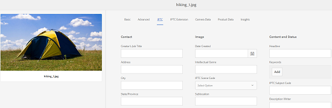

# Support for IPTC Metadata {#support-for-iptc-metadata}

Learn how Adobe Experience Manager (AEM) Assets supports the IPTC metadata, Creative ratings, and keywords added to assets through Adobe Bridge and other Creative Apps.

Adobe Experience Manager (AEM) Assets supports the IPTC metadata standard that is widely used to describe assets. This way, AEM Assets enhances the acceptance of its images among various parties, including photographers, creative agencies, libraries, museums, and so on.

The default metadata schema for assets now incorporates the IPTC Core and IPTC Extension metadata schemas to define comprehensive metadata properties that allow users to add precise and reliable data about people, locations, and products shown in an image. It also supports dates, names, and identifiers regarding the creation of the image, and a flexible way to express rights information.

The Properties page for assets now includes separate tabs to display the IPTC Core and IPTC Extension metadata in editable fields.

1. From the Assets user interface, select an image.
1. Click or tap the **[!UICONTROL Properties]** icon from the toolbar.
1. In the Properties page, click/tap the **[!UICONTROL IPTC]** tab to view IPTC metadata for the asset.
1. Edit the IPTC metadata properties, as necessary.

   

1. Click/tap the **[!UICONTROL IPTC Extension]** tab to view IPTC Extension metadata for the asset.
1. Edit the ITPC Extension metadata properties, as necessary.
1. Tap/click **[!UICONTROL Save & Close]** to save the changes.

## Creative Rating Support {#creative-rating-support}

In addition to displaying individual user ratings and aggregate ratings, the Properties page now displays the ratings assigned to assets through Adobe Bridge and other Creative Apps

These ratings are available under **[!UICONTROL Creative Rating]** section within the **[!UICONTROL Advanced]** tab.

This rating is a read-only property and ranges between 1-5. You can search for assets based on their Creative Rating from the Search Panel.

However, this property is currently not indexed to avoid any conflict with custom changes made by users.

## Keyword Support {#keyword-support}

The **[!UICONTROL IPTC]** tab of the Properties page also displays keywords added to assets through Adobe Bridge and other Creative Apps. You can also edit these keywords and add more keywords from the **[!UICONTROL IPTC]** tab.

