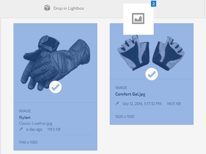

# Lightbox {#lightbox}

Lightbox is a special type of collection that provides easy access to assets. You can quickly access Lightbox to add or delete assets. It serves as your personal image gallery.

If you are an [!DNL Adobe Experience Manager Assets] user, Lightbox is automatically created when you first log in to the application. It is exclusive to your login. Other users cannot access your Lightbox.

## Add assets to lightbox {#adding-assets-to-lightbox}

1. From the [!DNL Assets] user interface, select the assets that you want to add to Lightbox.
1. Drag the assets to the **[!UICONTROL Drop in Lightbox]** zone. Release when the drop-zone becomes active, and its label changes to **[!UICONTROL Drop to Add]**.

   

1. In the dialog, click **[!UICONTROL Add]**, and then close it to complete the process. The selected assets are added to Lightbox.
1. To view Lightbox, go to the Collections console.
1. Click **[!UICONTROL Lightbox]** to view the assets in it.

   >[!NOTE]
   >
   >Although Lightbox resembles a collection, you cannot perform all the actions that you normally perform on collections. For example, you cannot delete, share, or view settings for a Lightbox. In addition, you cannot add it to other collections. However, you can edit the assets inside a lightbox.

## Remove assets from Lightbox {#removing-assets-from-lightbox}

1. Navigate to the Collections console, click Lightbox to view its assets.
1. Select the assets you want to remove.
1. From the toolbar, click **[!UICONTROL Remove]**.
1. In the dialog, click **[!UICONTROL Remove]** to confirm the delete action. The assets are deleted from Lightbox.
