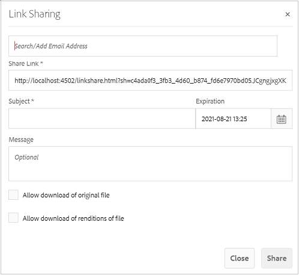
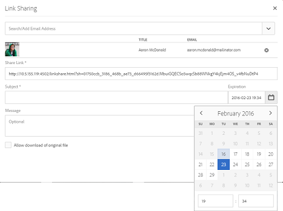

# Share asset as a link {#asset-link-sharing}

| Version | Article link |
| -------- | ---------------------------- |
| AEM as a Cloud Service  |    [Click here](https://experienceleague.adobe.com/docs/experience-manager-cloud-service/content/assets/manage/share-assets.html?lang=en)                  |
| AEM 6.5     | This article         |

[!DNL Adobe Experience Manager Assets] lets you share assets, folders, and collections as a URL with members of your organization and external entities, including partners and vendors. Sharing assets through a link is a convenient way of making resources available to external parties without them having to first login to [!DNL Assets].

>[!PREREQUISITES]
>
>* You require `Edit ACL` permission on the folder or the asset that you want to share as a link.
>* To send emails to the users, configure the SMTP server details in [Day CQ Mail Service](#configmailservice).

## Share assets {#share-assets}

To generate the URL for assets that you want to share with users, use the [!UICONTROL Link Sharing] dialog. 

* The users with administrator privileges or with read permissions at `/var/dam/share` location can view the links shared with them. 
* The users having read permissions at `/var/dam/jobs/download` location can download assets from the shared link.

1. In the [!DNL Assets] user interface, select the asset to share as a link.

1. From the toolbar, click the **[!UICONTROL Share Link]** . The link that will be created after clicking **[!UICONTROL Share]** is displayed in advance in the [!UICONTROL Share Link] field. The link is not created till you select **[!UICONTROL Submit]**.

   

   *Figure: The dialog to share assets as a link.*

1. In the email address box of the **[!UICONTROL Link Sharing]** dialog, type the email ID of the user you want to share the link with. You can add one or more users.

   >[!NOTE]
   >
   >If you enter an email ID of a user that is not a member of your organization, the words [!UICONTROL External User] are prefixed with the email ID of the user.

1. In the **[!UICONTROL Subject]** box, enter a subject for the asset you want to share.

1. In the **[!UICONTROL Message]** box, enter an optional message.

1. In the **[!UICONTROL Expiration]** field, specify an expiration date and time for the link to stop working. The default expiration time for the link is one day.

   

1. To let users download the original asset, select **[!UICONTROL Allow download of original file]**. To let users download only the renditions of the shared assets, select **[!UICONTROL Allow download of renditions of file]**.

1. Click **[!UICONTROL Share]**. A message confirms that the link is shared with the users via an email.

1. To view the shared asset, click the link in the email that is sent to the user. To generate a preview of the asset, click the shared asset. To close the preview, click **[!UICONTROL Back]**. If you have shared a folder, click **[!UICONTROL Parent Folder]** to return to the parent folder.

   

   >[!NOTE]
   >
   >[!DNL Experience Manager] supports generating the preview of assets of only [the supported file types](/help/assets/assets-formats.md). If other MIME types are shared, you can only download the assets and cannot preview.

1. To download the shared asset, click **[!UICONTROL Select]** from the toolbar, click the asset, and then click **[!UICONTROL Download]** from the toolbar.

   

1. To view the assets that you have shared as links, go to the [!DNL Assets] user interface and click the [!DNL Experience Manager] logo. Choose **[!UICONTROL Navigation]**. In the Navigation pane, choose **[!UICONTROL Shared Links]** to display a list of shared assets.

1. To un-share an asset, select it and click **[!UICONTROL Unshare]** from the toolbar. A confirmation message follows. The entry for the asset is removed from the list.

## Configure Day CQ mail service {#configure-day-cq-mail-service}

1. On the [!DNL Experience Manager] home page, navigate to **[!UICONTROL Tools]** > **[!UICONTROL Operations]** > **[!UICONTROL Web Console]**.
1. From the list of services, locate **[!UICONTROL Day CQ Mail Service]**.
1. Click **[!UICONTROL Edit]** beside the service, and configure the following parameters for **[!UICONTROL Day CQ Mail Service]** with the details mentioned against their names:

    * SMTP server host name: email server host name
    * SMTP server port: email server port
    * SMTP user: email server user name
    * SMTP password: email server password

   

1. Click **[!UICONTROL Save]**.

## Configure maximum data size {#configure-maximum-data-size}

When you download assets from the link shared using the Link Sharing feature, [!DNL Experience Manager] compresses the asset hierarchy from the repository and then returns the asset in a ZIP file. However, in the absence of limits to the amount of data that can be compressed in a ZIP file, huge amounts of data is subjected to compression, which causes out of memory errors in JVM. To secure the system from a potential denial of service attack due to this situation, configure the maximum size using the **[!UICONTROL Max Content Size (uncompressed)]** parameter for **[!UICONTROL Day CQ DAM Adhoc Asset Share Proxy Servlet]** in Configuration Manager. If uncompressed size of the asset exceeds the configured value, asset download requests are rejected. The default value is 100 MB.

1. Click the [!DNL Experience Manager] logo and then go to **[!UICONTROL Tools]** > **[!UICONTROL Operations]** > **[!UICONTROL Web Console]**.
1. From the Web Console, locate the **[!UICONTROL Day CQ DAM Adhoc Asset Share Proxy Servlet]** configuration.
1. Open the **[!UICONTROL Day CQ DAM Adhoc Asset Share Proxy Servlet]** configuration in edit mode, and modify the value of the **[!UICONTROL Max Content Size (uncompressed)]** parameter.

   

1. Save the changes.

## Best practices and troubleshooting {#best-practices-and-troubleshooting}

* Asset folders or Collections that contain a whitespace in their name may not get shared.
* If users cannot download the shared assets, check with your [!DNL Experience Manager] administrator what the [download limits](#configure-maximum-data-size) are.
* If you cannot send email with links to shared assets or if the other users cannot receive your email, check with your [!DNL Experience Manager] administrator if the [email service](#configure-day-cq-mail-service) is configured or not.
* If you cannot share assets using link sharing functionality, ensure that you have the appropriate permissions. See [share assets](#share-assets).
* If a shared asset is moved to a different location, its link stops working. Re-create the link and re-share with the users.

* If you want to share links from your [!DNL Experience Manager] Author deployment to external entities, ensure that you only expose the following URLs that are used for link sharing, for `GET` requests only. Block other URLs for security reasons.

  * `http://[aem_server]:[port]/linkshare.html`
  * `http://[aem_server]:[port]/linksharepreview.html`
  * `http://[aem_server]:[port]/linkexpired.html`

  In [!DNL Experience Manager] interface, access **[!UICONTROL Tools]** > **[!UICONTROL Operations]** > **[!UICONTROL Web Console]**. Open the **[!UICONTROL Day CQ Link Externalizer]** configuration and modify the following properties in the **[!UICONTROL Domains]** field with the values mentioned against `local`, `author`, and `publish`. For the `local` and `author` properties, provide the URL for the local and the Author instances, respectively. If you run a single [!DNL Experience Manager] Author instance, use the same value for `local` and `author` properties. For Publish instances, provide the URL of the [!DNL Experience Manager] Publish instance.
