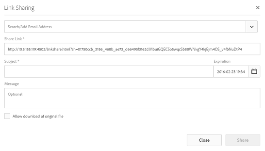
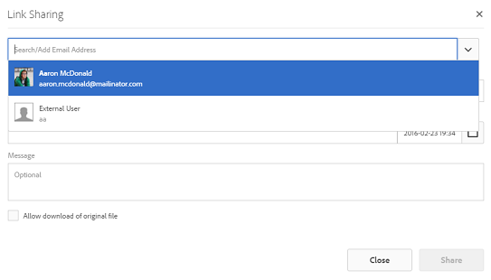

# Share asset via a link {#asset-link-sharing}

Adobe Experience Manager (AEM) Assets lets you share assets, folders, and collections as a URL with members of your organization and external entities, including partners and vendors. Sharing assets through a link is a convenient way of making resources available to external parties without them having to first log in to AEM Assets.

>[!NOTE]
>
>You require Edit ACL permission on the folder or the asset that you want to share as a link.

## Share assets {#sharelink}

To generate the URL for assets you want to share with users, use the Link Sharing dialog. Users with administrator privileges or with read permissions at `/var/dam/share` location are able to view the links shared with them.

>[!NOTE]
>
>Before you share a link with users, ensure that Day CQ Mail Service is configured. An error occurs if you attempt to share a link without first [configuring Day CQ Mail Service](/help/assets/link-sharing.md#configmailservice).

1. In the Assets user interface, select the asset to share as a link.
1. From the toolbar, click/tap the **[!UICONTROL Share Link]** .

   An asset link is auto-created in the **[!UICONTROL Share Link]** field. Copy this link and share it with the users. The default expiration time for the link is one day.

   

   *Figure:Dialog with the Link Share*

   Alternatively, proceed to perform steps 3-7 of this procedure to add email recipients, configure the expiration time for the link, and send it from the dialog.

   >[!NOTE]
   >
   >If you want to share links from your AEM Author instance to external entities, ensure that you only expose the following URLs (which are used for link sharing) for `GET` requests only. Block other URLs to ensure security of AEM Author.
   >
   >* http://&lt;aem_server&gt;:&lt;port&gt;/linkshare.html
   >* http://&lt;aem_server&gt;:&lt;port&gt;/linksharepreview.html
   >* http://&lt;aem_server&gt;:&lt;port&gt;/linkexpired.html

   >[!NOTE]
   >
   >If a shared asset is moved to a different location, its link stops working. Re-create the link and re-share with the users.

1. From the web console, open the **[!UICONTROL Day CQ Link Externalizer]** configuration and modify the following properties in the **[!UICONTROL Domains]** field with the values mentioned against each:

    * local
    * author
    * publish

   For the local and author properties, provide the URL for the local and author instance respectively. Both local and author properties have the same value if you run a single AEM author instance. For publish, provide the URL for the publish instance.

1. In the email address box of the **[!UICONTROL Link Sharing]** dialog, type the email ID of the user you want to share the link with. You can also share the link with multiple users.

   If the user is a member of your organization, select the user's email ID from the suggested email IDs that appear in the list below the typing area. For an external user, type the complete email ID and then select it from the list.

   To enable emails to be sent out to users, configure the SMTP server details in [Day CQ Mail Service](#configmailservice).

   

   Share links to assets directly from the Link Sharing dialog

   >[!NOTE]
   >
   >If you enter an email ID of a user that is not a member of your organization, the words "External User" are prefixed with the email ID of the user.

1. In the **[!UICONTROL Subject]** box, enter a subject for the asset you want to share.
1. In the **[!UICONTROL Message]** box, enter an optional message.
1. In the **[!UICONTROL Expiration]** field, specify an expiration date and time for the link using the date picker. By default, the expiration date is set for a week from the date you share the link.

   

1. To let users download the original image along with the renditions, select **[!UICONTROL Allow download of original file]**.

   >[!NOTE]
   >
   >By default, users can only download the renditions of the asset that you share as a link.

1. Click **[!UICONTROL Share]**. A message confirms that the link is shared with the users through an email.
1. To view the shared asset, click/tap the link in the email that is sent to the user. The shared asset is displayed in the **[!UICONTROL Adobe Marketing Cloud]** page.

   

   To toggle to the list view, click/tap the layout option in the toolbar.

1. To generate a preview of the asset, click/tap the shared asset. To close the preview and return to the **[!UICONTROL Marketing Cloud]** page, click/tap **[!UICONTROL Back]** in the toolbar. If you have shared a folder, click/tap **[!UICONTROL Parent Folder]** to return to the parent folder.

   

   >[!NOTE]
   >
   >AEM supports generating the preview of assets of these MIME types: JPG, PNG, GIF, BMP, INDD, PDF, and PPT. You can only download the assets of the other MIME types.

1. To download the shared asset, tap **[!UICONTROL Select]** from the toolbar, click/tap the asset, and then click/tap **[!UICONTROL Download]** from the toolbar.

   

1. To view the assets you shared as links, go to the Assets UI and tap the Experience Manager logo. Choose **[!UICONTROL Navigation]** from the list to display the Navigation pane.
1. From the Navigation pane, choose **[!UICONTROL Shared Links]** to display a list of shared assets.
1. To un-share an asset, select it and tap/click **[!UICONTROL Unshare]** from the toolbar. A confirmation message follows. The entry for the asset is removed from the list.

## Configure Day CQ Mail Service {#configmailservice}

1. On the Experience Manager home page, navigate to **[!UICONTROL Tools]** &gt; **[!UICONTROL Operations]** &gt; **[!UICONTROL Web Console]**.
1. From the list of services, locate **[!UICONTROL Day CQ Mail Service]**.
1. Tap **[!UICONTROL Edit]** beside the service, and configure the following parameters for **[!UICONTROL Day CQ Mail Service]** with the details mentioned against their names:

    * SMTP server host name: email server host name
    * SMTP server port: email server port
    * SMTP user: email server user name
    * SMTP password: email server password

   

1. Click/tap **[!UICONTROL Save]**.

## Configure maximum data size {#maxdatasize}

When you download assets from the link shared using the Link Sharing feature, AEM compresses the asset hierarchy from the repository and then returns the asset in a ZIP file. However, in the absence of limits to the amount of data that can be compressed in a ZIP file, huge amounts of data is subjected to compression, which causes out of memory errors in JVM. To secure the system from a potential denial of service attack due to this situation, configure the maximum size using the **[!UICONTROL Max Content Size (uncompressed)]** parameter for [!UICONTROL Day CQ DAM Adhoc Asset Share Proxy Servlet] in Configuration Manager. If uncompressed size of the asset exceeds the configured value, asset download requests are rejected. The default value is 100 MB.

1. Click/Tap the AEM logo and then go to **[!UICONTROL Tools]** &gt; **[!UICONTROL Operations]** &gt; **[!UICONTROL Web Console]**.
1. From the Web Console, locate the **[!UICONTROL Day CQ DAM Adhoc Asset Share Proxy Servlet]** configuration.
1. Open the **[!UICONTROL Day CQ DAM Adhoc Asset Share Proxy Servlet]** configuration in edit mode, and modify the value of the **[!UICONTROL Max Content Size (uncompressed)]** parameter.

   

1. Save the changes.

## Best practices and troubleshooting {#bestpractices}

* Asset folders or Collections that contain a whitespace in their name may not get shared.
* If users cannot download the shared assets, check with your AEM administrator what the [download limits](#maxdatasize) are.
* If you cannot send email with links to shared assets or if the other users cannot receive your email, check with your AEM administrator if the [email service](#configmailservice) is configured or not.
* If you cannot share assets using link sharing functionality, ensure that you have the appropriate permissions. See [share assets](#sharelink).
