# Manage your digital assets {#manage-digital-assets}

| Version | Article link |
| -------- | ---------------------------- |
| AEM as a Cloud Service  |    [Click here](https://experienceleague.adobe.com/docs/experience-manager-cloud-service/content/assets/manage/manage-digital-assets.html?lang=en)                  |
| AEM 6.5     | This article         |

In [!DNL Adobe Experience Manager Assets], you can do more than store and govern your assets. [!DNL Experience Manager] offers enterprise-grade asset management capabilities. You can edit and share assets, run advanced searches, and create multiple renditions of dozens of supported file formats. You can also manage versions and digital rights, automate processing of assets, manage and govern metadata, collaborate using annotations, and much more.

This article describes the basic asset management tasks such as create or upload; metadata updates; copy, move, and delete; publish, unpublish, and search assets. To understand the user interface, see [get started with assets user interface](/help/sites-authoring/basic-handling.md). To manage Content Fragments, see [manage Content Fragments](/help/assets/content-fragments/content-fragments-managing.md) assets.

## Create folders {#creating-folders}

When organizing a collection of assets, for example, all `Nature` images, you can create folders to keep them together. You can use folders to categorize and organize your assets. [!DNL Experience Manager Assets] does not require you to organize assets in folders to work better.

>[!NOTE]
>
>* Sharing an [!DNL Assets] folder of the type `sling:OrderedFolder` is not supported when sharing to Experience Cloud. If you want to share a folder, do not select [!UICONTROL Ordered] when creating a folder.
>* [!DNL Experience Manager] does not allow using `subassets` word as the name of a folder. It is a keyword reserved for a node that contains subassets for compound assets.

1. Navigate to the place in your digital assets folder where you want to create a folder. In the menu, click **[!UICONTROL Create]**. Select **[!UICONTROL New Folder]**.
1. In the **[!UICONTROL Title]** field, provide a folder name. By default, DAM uses the title that you provided as the folder name. Once the folder is created, you can override the default and specify another folder name.
1. Click **[!UICONTROL Create]**. Your folder is displayed in the digital assets folder.

The following (space-separated list of) characters are not supported:

* An asset file name cannot contain any of these characters: `* / : [ \\ ] | # % { } ? &`
* An asset folder name cannot contain any of these characters: `* / : [ \\ ] | # % { } ? \" . ^ ; + & \t`

Do not include special characters in the extensions of asset filenames.

## Upload assets {#uploading-assets}

<!-- TBD the following:
Move this section into a new article. CQDOC-14874 ticket is created for this.
In this complete article, replace emphasis with UICONTROL where appropriate.
-->

You can upload various types of assets (including images, PDF files, RAW files, and so on) from your local folder or a network drive to [!DNL Experience Manager Assets].

>[!NOTE]
>
>In Dynamic Media - Scene7 mode, the default asset upload file size is 2 GB or less. To configure upload of assets larger than 2 GB up to 15 GB, see [(Optional) Configure Dynamic Media - Scene7 mode for upload of assets larger than 2 GB](/help/assets/config-dms7.md#optional-config-dms7-assets-larger-than-2gb).

>[!IMPORTANT]
>
>Assets that you upload into Experience Manager that have a file name greater than 100 characters, have a shortened name when they are used in Dynamic Media.
>
>The first 100 characters in the file name are used as is; any remaining characters are replaced by an alphanumeric string. This renaming method ensures a unique name when the asset is used in Dynamic Media. It is also meant to accommodate the maximum asset file name length allowed in Dynamic Media.

You can choose to upload assets to folders with or without a processing profile assigned to them.

For folders that have a processing profile assigned, the profile name appears on the thumbnail in the card view. In the list view, the profile name appears in the **Processing Profile** column. See [Processing Profiles](/help/assets/processing-profiles.md).

Before uploading an asset, ensure that it is in a [format](/help/assets/assets-formats.md) that [!DNL Experience Manager Assets] supports.

1. In the [!DNL Assets] user interface, navigate to the location where you want to add digital assets.
1. To upload the assets, do one of the following:

    * On the toolbar, click **[!UICONTROL Create]**. Then on the menu, click **[!UICONTROL Files]**. You can rename the file in the presented dialog if needed.
    * In a browser that supports HTML5, drag the assets directly on the [!DNL Assets] user interface. The dialog to rename file is not displayed.

   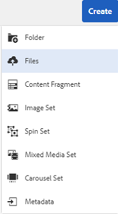

   To select multiple files, select the `Ctrl` or `Command` key and select the assets in the file picker dialog. When using an iPad, you can select only one file at a time.

   You can pause the uploading of large assets (greater than 500 MB) and resume it later from the same page. Click **[!UICONTROL Pause]** beside progress bar that appears when an upload starts.

   

The size above which an asset is considered a large asset is configurable. For example, you can configure the system to consider assets above 1000 MB (instead of 500 MB) as large assets. In this case, **[!UICONTROL Pause]** appears on the progress bar when assets of size greater than 1000 MB are uploaded.

The [!UICONTROL Pause] option does not show if a file greater than 1000 MB is uploaded with a file less than 1000 MB. However, if you cancel the less than 1000-MB file upload, the **[!UICONTROL Pause]** option appears.

To modify the size limit, configure the `chunkUploadMinFileSize` property of the `fileupload` node in the CRX repository available at `/apps/dam/gui/content/assets/jcr:content/actions/secondary/create/items/fileupload`.

When you click **[!UICONTROL Pause]**, it toggles to the **[!UICONTROL Play]** option. To resume uploading, click **[!UICONTROL Play]**.

To cancel an ongoing upload, click close (`X`) next to the progress bar. When you cancel the upload operation, [!DNL Assets] deletes the partially uploaded portion of the asset.

The ability to resume uploading is especially helpful in low-bandwidth scenarios and network glitches, where it takes a long time to upload a large asset. You can pause the upload operation and continue later when the situation improves. When you resume, uploading starts from the point where you paused it.

During the upload operation, [!DNL Experience Manager] saves the portions of the asset being uploaded as chunks of data in the CRX repository. When the upload completes, [!DNL Experience Manager] consolidates these chunks into a single block of data in the repository.

To configure the cleanup task for the unfinished chunk upload jobs, go to `https://[aem_server]:[port]/system/console/configMgr/org.apache.sling.servlets.post.impl.helper.ChunkCleanUpTask`.

>[!CAUTION]
>
>Chunk upload is triggered when the default value is 500 MB and the chunk size is 50 MB. If you edit [Apache Jackrabbit Oak TokenConfiguration](https://experienceleague.adobe.com/docs/experience-cloud-kcs/kbarticles/KA-16464.html) and set the `timeout configuration` to less than the time it takes for an asset to upload, you encounter a session timeout situation while the asset upload is in progress. Therefore, change the `chunkUploadMinFileSize` and `chunksize` so that each chunk request refreshes the session.
>
>Given the credential-expiry-timeout, latency, bandwidth, and expected concurrent uploads, the highest value that lets you ensure that the following is picked:
>
>* To ensure that chunk upload is enabled for files with sizes likely to cause credential expiry while upload is in progress.
>
>* To ensure that each chunk finishes before the credential expires.

If you upload an asset with the same name as an asset that is already available at the location where you are uploading the asset, a warning dialog is displayed.

You can choose to replace an existing asset, create another version, or keep both by renaming the new asset that is uploaded. If you replace an existing asset, the metadata for the asset and any prior modifications (for example annotate or crop) you made to the existing asset are deleted. If you choose to keep both assets, the new asset is renamed with number `1` appended to its name.


>[!NOTE]
>
>When you select **[!UICONTROL Replace]** in the [!UICONTROL Name Conflict] dialog, the asset ID is regenerated for the new asset. This ID is different from the ID of the previous asset.
>
>If Assets Insights is enabled to track impressions or clicks with [!DNL Adobe Analytics], the regenerated asset ID invalidates the data-captured for the asset on [!DNL Analytics].

If the asset you upload exists in [!DNL Assets], the **[!UICONTROL Duplicates Detected]** dialog warns that you are attempting to upload a duplicate asset. The dialog appears only if the `SHA 1` checksum value of the binary of the existing asset matches the checksum value of the asset you upload. In this case, the names of assets do not matter.

>[!NOTE]
>
>The [!UICONTROL Duplicates Detected] dialog appears only when the duplicate detection feature is enabled. To enable the duplicate detection feature, see [Enable Duplicate Detection](/help/assets/duplicate-detection.md).


To retain the duplicate asset in [!DNL Assets], click **[!UICONTROL Keep]**. To delete the duplicate asset you uploaded, click **[!UICONTROL Delete]**.

[!DNL Experience Manager Assets] prevents you from uploading assets with the forbidden characters in their filenames. If you try to upload an asset with file name containing a disallowed character or more, [!DNL Assets] displays a warning message and stops the upload until you remove these characters or upload with an allowed name.

To suit specific file naming conventions for your organization, the [!UICONTROL Upload Assets] dialog lets you specify long names for the files that you upload.

However, the following (space-separated list of) characters are not supported:

* asset file name must not contain `* / : [ \\ ] | # % { } ? &`
* asset folder name must not contain `* / : [ \\ ] | # % { } ? \" . ^ ; + & \t`

Do not include special characters in the extensions of asset filenames.


In addition, the [!DNL Assets] user interface displays the most recent asset that you upload or the folder that you created first.

If you cancel the upload operation before the files are uploaded, [!DNL Assets] stops uploading the current file and refreshes the content. However, files that are already uploaded are not deleted.

The upload progress dialog in [!DNL Assets] displays the count of successfully uploaded files and the files that failed to upload.

### Serial uploads {#serialuploads}

Uploading numerous assets in bulk consumes significant I/O resources, which may adversely impact the performance of your [!DNL Assets] deployment. In particular, if you have a slow internet connection, the time to upload drastically increases due to a spike in disk I/O. Moreover, your web browser may introduce additional restrictions to the number of POST requests [!DNL Assets] can handle for concurrent asset uploads. As a result, the upload operation fails or terminates prematurely. In other words, [!DNL Experience Manager Assets] may miss some files while ingesting a bunch of files or altogether fail to ingest any file.

To overcome this situation, [!DNL Assets] ingests one asset at a time (serial upload) during a bulk upload operation, instead of the concurrently ingesting all the assets.

Serial uploading of assets is enabled by default. To disable the feature and allow concurrent uploading, overlay the `fileupload` node in Crx-de and set the value of the `parallelUploads` property to `true`.

### Upload assets using FTP {#uploading-assets-using-ftp}

Dynamic Media enables batch uploading of assets via FTP server. If you intend to upload large assets (>1 GB) or upload entire folders and subfolders, you should use FTP. You can even set up FTP upload to occur on a recurring scheduled basis.

>[!NOTE]
>
>In Dynamic Media - Scene7 mode, the default asset upload file size is 2 GB or less. To configure upload of assets larger than 2 GB up to 15 GB, see [(Optional) Configure Dynamic Media - Scene7 mode for upload of assets larger than 2 GB](/help/assets/config-dms7.md#optional-config-dms7-assets-larger-than-2gb).

>[!NOTE]
>
>To upload assets via FTP in Dynamic Media - Scene7 mode, install Feature Pack 18912 on the [!DNL Experience Manager] author instances. Contact [Adobe Customer Support](https://experienceleague.adobe.com/?support-solution=General#support) to get access to FP-18912 and complete the setup of your FTP account. For more information, see [Install feature pack 18912 for bulk asset migration](/help/assets/bulk-ingest-migrate.md).
>
>If you use FTP for uploading assets, the upload settings specified in [!DNL Experience Manager] are ignored. Instead, file processing rules, as defined in Dynamic Media Classic, are used.

**To upload assets using FTP**

1. Using your choice of FTP client, log in to the FTP server using the FTP user name and password that you received from the provisioning email. In the FTP client, upload files or folders to the FTP server.

1. Open the [Dynamic Media Classic desktop application](https://experienceleague.adobe.com/docs/dynamic-media-classic/using/intro/dynamic-media-classic-desktop-app.html#system-requirements-dmc-app), then sign in to your account.

   Your credentials and sign-in were provided by Adobe at the time of provisioning. If you do not have this information, contact Adobe Customer Support.

1. On the Global Navigation Bar, click **[!UICONTROL Upload]**.
1. On the Upload page, near the upper-left corner, click the **[!UICONTROL Via FTP]** tab.
1. On the left side of the page, choose an FTP folder to upload files from; on the right side of the page, choose a destination folder.
1. Near the lower-right corner of the page, click **[!UICONTROL Job Options]** and then set the options you want based on the assets in the folder you selected.

   See [Upload Job Options](#upload-job-options).

   >[!NOTE]
   >
   >When you upload assets via FTP, the upload job options you set in Dynamic Media Classic (S7) take precedent over asset processing parameters set in [!DNL Experience Manager].

1. In the lower-right corner of the Upload Job Options dialog box, click **[!UICONTROL Save]**.
1. In the lower-right corner of the Upload page, click **[!UICONTROL Submit Upload]**.

   To view the progress of the upload, on the Global Navigation Bar, click **[!UICONTROL Jobs]**. The Jobs page displays the progress of the upload. You can continue working in [!DNL Experience Manager] and return to the Jobs page in Dynamic Media Classic at any time to review an in-progress job.
   To cancel an upload job in progress, click **[!UICONTROL Cancel]** next to the Duration time.

#### Upload Job Options {#upload-job-options}

| Upload option | Suboption | Description |
|---|---|---|
| Job Name | | The default name that is pre-filled in the text field includes the user-entered portion of the name and the date-and-time stamp. You can use the default name or enter a name of your own creation for this upload job. <br>The job and other upload and publishing jobs are recorded on the Jobs page, where you can check the status of jobs. |
| Publish After Uploading | | Automatically publishes the assets that you upload. |
| Overwrite in any folder, same base asset name regardless of extension | | Select this option if you want the files you upload to replace existing files with the same names. The name of this option could be different, depending on the settings in **[!UICONTROL Application Setup]** > **[!UICONTROL General Settings]** > **[!UICONTROL Upload to Application]** > **[!UICONTROL Overwrite Images]**. |
| Uncompress Zip or Tar Files on Upload | | |
| Job Options | | Click **[!UICONTROL Job Options]** so you can open the [!UICONTROL Upload Job Options] dialog box and choose options that affect the entire upload job. These options are the same for all file types.<br>You can choose default options for uploading files starting on the Application General Settings page. To open this page, choose **[!UICONTROL Setup]** > **[!UICONTROL Application Setup]**. Select the **[!UICONTROL Default Upload Options]** option to open the [!UICONTROL Upload Job Options] dialog box. |
| | When | Select One-Time or Recurring. To set a recurring job, choose a Repeat option—Daily, Weekly, Monthly, or Custom—to specify when you want the FTP upload job to recur. Then specify the scheduling options as necessary. |
| | Include subfolders | Upload all subfolders within the folder that you intend to upload. The names of the folder and its subfolders you upload are entered automatically in [!DNL Experience Manager Assets]. |
| | Crop Options | To manually crop from the sides of an image, select the Crop menu and choose Manual. Then enter the number of pixels to crop from any side or each side of the image. How much of the image is cropped depends on the ppi (pixels per inch) setting in the image file. For example, if the image displays 150 ppi and you enter 75 in the Top, Right, Bottom, and Left text boxes, a half-inch is cropped from each side.<br> To automatically crop white-space pixels from an image, open the Crop menu, choose Manual, and enter pixel measurements in the Top, Right, Bottom, and Left fields to crop from the sides. You can also choose Trim on the Crop menu and choose these options:<br> **Trim Away Based On** <ul><li>**Color** - Choose the Color option. Then select the Corner menu and choose the corner of the image with the color that best represents the white-space color you want to crop.</li><li>**Transparency** - Choose the Transparency option.<br> **Tolerance** - Drag the slider to specify a tolerance from 0 through 1.For trimming based on color, specify 0 to crop pixels only if they exactly match the color you selected in the corner of the image. Numbers closer to 1 allow for more color difference.<br>For trimming based on transparency, specify 0 to crop pixels only if they are transparent. Numbers closer to 1 allow for more transparency.</li></ul><br>These crop options are non-destructive. |
| | Color Profile Options | Choose a color conversion when you create optimized files that are used for delivery:<ul><li>Default Color Preservation: Maintains the source image colors whenever the images contain color space information; there is no color conversion. Nearly all images today have the appropriate color profile already embedded. However, if a CMYK source image does not contain an embedded color profile, the colors are converted to sRGB (standard Red Green Blue) color space. sRGB is the recommended color space for displaying images on web pages.</li><li>Keep Original Color Space: Retains the original colors without any color conversion at the point. For images without an embedded color profile, any color conversion is done using the default color profiles configured in the Publish settings. The color profiles may not align with the color in the files created with this option. Therefore, you are encouraged to use the option Default Color Preservation.</li><li>Custom From > To<br> Opens menus so you can choose a Convert From and Convert To color space. This advanced option overrides any color information that is embedded in the source file. Select this option when all the images that you are submitting contain incorrect or missing color profile data.</li></ul> |
| | Image-Editing Options | You can preserve the clipping masks in images, and choose a color profile.<br> See [Setting options for image edits at upload](#setting-image-editing-options-at-upload). |
| | Postscript Options | You can rasterize PostScript&reg; files, crop files, maintain transparent backgrounds, choose a resolution, and choose a color space.<br> See [Setting PostScript and Illustrator upload options](#setting-postscript-and-illustrator-upload-options). |
| | Photoshop Options | You can create templates from Adobe&reg; Photoshop&reg; files, maintain layers, specify how layers are named, extract text, and specify how images are anchored into templates.<br> Templates are not supported in [!DNL Experience Manager].<br> See [Setting Photoshop upload options](#setting-photoshop-upload-options). |
| | PDF Options | You can rasterize the files, extract search words and links, auto-generate an eCatalog, set the resolution, and choose a color space.<br>eCatalogs are not supported in [!DNL Experience Manager]. <br> See [Setting PDF upload options](#setting-pdf-upload-options).<br>**Note**: The maximum number of pages for a PDF to be considered for extraction is 5000 for new uploads. This limit will change to 100 page (for all PDFs) on December 31, 2022. See also [Dynamic Media limitations](/help/assets/limitations.md). |
| | Illustrator Options | You can rasterize Adobe Illustrator&reg; files, maintain transparent backgrounds, choose a resolution, and choose a color space.<br> See [Setting PostScript and Illustrator upload options](#setting-postscript-and-illustrator-upload-options). |
| | EVideo Options | You can transcode a video file by choosing a Video Preset.<br> See [Setting eVideo upload options](#setting-evideo-upload-options). |
| | Batch Set Presets | To create an Image Set, or Spin Set from the uploaded files, click the Active column for the preset you want to use. You can select more than one preset. You create the presets in the Application Setup/Batch Set Presets page of Dynamic Media Classic.<br> See [Configuring Batch Set Presets to Auto-Generate Image Sets and Spin Sets](config-dms7.md#creating-batch-set-presets-to-auto-generate-image-sets-and-spin-sets) to learn more about creating batch set presets.<br> See [Setting Batch Set Presets at upload](#setting-batch-set-presets-at-upload). |

#### Set options for image edits at upload {#setting-image-editing-options-at-upload}

When uploading image files, including AI, EPS, and PSD files, you can take the following editing actions in the [!UICONTROL Upload Job Options] dialog box:

* Crop whitespace from the edge of images (see description in table above).
* Crop manually from the sides of images (see description in table above).
* Choose a color profile (see option description in table above).
* Create a mask from a clipping path.
* Sharpen images with unsharp masking options
* Knockout Background

<!--
| Option | Sub-option | Description |
|---|---|---|
| Create Mask From Clipping Path | | Create a mask for the image based on its clipping path information. This option applies to images created with image-editing applications in which a clipping path was created. |
| Unsharp Masking | | Lets you fine-tune a sharpening filter effect on the final downsampled image, controlling the intensity of the effect, the radius of the effect (as measured in pixels), and a threshold of contrast that is ignored.<br> This effect uses the same options as Photoshop's Unsharp Mask filter. Contrary to what the name suggests, Unsharp Mask is a sharpening filter. Under Unsharp Masking, set the options you want. Setting options are described in the following: |
| | Amount | Controls the amount of contrast that is applied to edge pixels.<br> Think of it as the intensity of the effect. The main difference between the amount values of Unsharp Mask in Dynamic Media and the amount values in Adobe Photoshop, is that Photoshop has an amount range of 1% to 500%. Whereas, in Dynamic Media, the value range is 0.0 to 5.0. A value of 5.0 is the rough equivalent of 500% in Photoshop; a value of 0.9 is the equivalent of 90%, and so on. |
| | Radius | Controls the radius of the effect. The value range is 0-250.<br> The effect is run on all pixels in an image and radiates out from all pixels in all directions. The radius is measured in pixels. For example, to get a similar sharpening effect for a 2000 x 2000 pixel image and 500 x 500 pixel image, you would set a radius of two pixels on the 2000 x 2000 pixel image and a radius value of one pixel on the 500 x 500 pixel image. A larger value is used for an image that has more pixels. |
| | Threshold | Threshold is a range of contrast that is ignored when the Unsharp Mask filter is applied. It is important so that no "noise" is introduced to an image when this filter is used. The value range is 0-255, which is the number of brightness steps in a grayscale image. 0=black, 128=50% gray and 255=white.<br> For example, a threshold value of 12 ignores slight variations is skin tone brightness to avoid adding noise, but still add edge contrast to areas such as where eyelashes meet skin.<br> For example, if you have a photo of someone's face, the Unsharp Mask affects the parts of the image, such as where eyelashes and skin meet to create an obvious area of contrast, and the smooth skin itself. Even the smoothest skin exhibits subtle changes in brightness values. If you do not use a threshold value, the filter accentuates these subtle changes in skin pixels. In turn, a noisy and undesirable effect is created while contrast on the eyelashes is increased, enhancing sharpness.<br> To avoid this issue, a threshold value is introduced that tells the filter to ignore pixels that do not change contrast dramatically, like smooth skin.<br> In the zipper graphic shown earlier, notice the texture next to the zippers. Image noise is exhibited because the threshold values were too low to suppress the noise. |
| | Monochrome | Select to unsharp-mask image brightness (intensity).<br> Deselect to unsharp-mask each color component separately. |
| Knockout Background | | Automatically removes the background of an image when you upload it. This technique is useful to draw attention to a particular object and make it stand out from a busy background. Select to enable or "turn on" the Knockout Background feature and the following sub-options: |
| | Corner | Required.<br> The corner of the image that is used to define the background color to knockout.<br> You can choose from **Upper Left**, **Bottom Left**, **Upper Right**, or **Bottom Right**. |
| | Fill Method | Required.<br> Controls pixel transparency from the Corner location that you set.<br> You can choose from the following fill methods: <ul><li>**Flood Fill** - turns all pixels transparent that match the Corner that you have specified and are connected to it.</li><li>**Match Pixel** - turns all matching pixels transparent, regardless of their location on the image.</li></ul> |
| | Tolerance | Optional.<br> Controls the allowable amount of variation in pixel color matching based on the Corner location that you set.<br> Use a value of 0.0 to match pixel colors exactly or, use a value of 1.0 to allow for the greatest variation. |
-->

#### Set PostScript and Illustrator upload options {#setting-postscript-and-illustrator-upload-options}

When you upload PostScript (EPS) or Illustrator (AI) image files, you can format them in various ways. You can rasterize the files, maintain the transparent background, choose a resolution, and choose a color space. Options for formatting PostScript and Illustrator files are available in the [!UICONTROL Upload Job Options] dialog box under [!UICONTROL PostScript Options] and [!UICONTROL Illustrator Options].

| Option | Suboption | Description |
|---|---|---|
| Processing | | Choose **[!UICONTROL Rasterize]** to convert vector graphics in the file to the bitmap format. |
| Maintain transparent background in rendered image | | Maintain the background transparency of the file. |
| Resolution | | Determines the resolution setting. This setting determines how many pixels are displayed per inch in the file. |
| Colorspace | | Select the Color Space menu and choose from the following color space options: |
| | Detect Automatically | Retains the color space of the file. |
| | Force As RGB | Converts to the RGB color space. |
| | Force As CMYK | Converts to the CMYK color space. |
| | Force As Grayscale | Converts to the grayscale color space.|

#### Set Photoshop upload options {#setting-photoshop-upload-options}

Photoshop Document (PSD) files are most often used to create image templates. When you upload a PSD file, you can create an image template automatically from the file (select the [!UICONTROL Create Template] option on the Upload screen).

Dynamic Media creates multiple images from a PSD file with layers if you use the file to create a template; it creates one image for each layer.

Use the [!UICONTROL Crop Options] and [!UICONTROL Color Profile Options], described above, with Photoshop upload options.

>[!NOTE]
>
>Templates are not supported in [!DNL Experience Manager].

| Option | Suboption | Description |
|---|---|---|
| Maintain Layers | | Rips the layers in the PSD, if any, into individual assets. The asset layers remain associated with the PSD. You can view them by opening the PSD file in Detail view and selecting the layer panel. |
| Create Template | | Creates a template from the layers in the PSD file. |
| Extract Text | | Extracts the text so that users can search for text in a Viewer. |
| Extend layers to background size | | Extends the size of ripped image layers to the size of the background layer. |
| Layer Naming | | Layers in the PSD file are uploaded as separate images. |
| | Layer Name | Names the images after their layer names in the PSD file. For example, a layer named Price Tag in the original PSD file becomes an image named Price Tag. However, if the layer names in the PSD file are default Photoshop layer names (Background, Layer 1, Layer 2, and so on), the images are named after their layer numbers in the PSD file. They are not named after their default layer names. |
| | Photoshop and Layer Number | Names the images after their layer numbers in the PSD file, ignoring original layer names. Images are named with the Photoshop filename and an appended layer number. For example, the second layer of a file called Spring Ad.psd is named Spring Ad_2 even if it had a non-default name in Photoshop. |
| | Photoshop and Layer Name | Names the images after the PSD file followed by the layer name or layer number. The layer number is used if the layer names in the PSD file are default Photoshop layer names. For example, a layer named Price Tag in a PSD file named SpringAd is named Spring Ad_Price Tag. A layer with the default name Layer 2 is called Spring Ad_2. |
| Anchor | | Specify how images are anchored in templates that are generated from the layered composition produced from the PSD file. By default, the anchor is the center. A center anchor allows replacement images to best fill the same space, no matter the aspect ratio of the replacement image. Images with a different aspect that replace this image, when referencing the template and using parameter substitution, effectively occupy the same space. Change to a different setting if your application requires the replacement images to fill the allocated space in the template. |

#### Set PDF upload options {#setting-pdf-upload-options}

When you upload a PDF file, you can format it in various ways. You crop its pages, extract search words, enter a pixels-per-inch resolution, and choose a color space. PDF files often contain a trim margin, crop marks, registration marks, and other printer's marks. You can crop these marks from the sides of pages as you upload a PDF file.

The maximum number of pages for a PDF to be considered for extraction is 5000 for new uploads. This limit will change to 100 pages (for all PDFs) on December 31, 2022. See also [Dynamic Media limitations](/help/assets/limitations.md).

>[!NOTE]
>
>eCatalogs are not supported in [!DNL Experience Manager].

Choose from the following options:

| Option | Suboption | Description |
|---|---|---|
| Processing | Rasterize | (Default) Rips the pages in the PDF file and converts vector graphics to bitmap images. Choose this option if you want to create an eCatalog. |
| Extract | Search words | Extracts words from the PDF file so that the file can be searched by keyword in an eCatalog Viewer. |
| | Links | Extracts links from the PDF files and coverts them to Image Maps that are used in an eCatalog Viewer. |
| Auto-Generate eCatalog from multiple page PDF | | Automatically creates an eCatalog from the PDF file. The eCatalog is named after the PDF file you uploaded. (This option is only available if you rasterize the PDF file as you upload it.) |
| Resolution | | Determines the resolution setting. This setting determines how many pixels are displayed per inch in the PDF file. The default is 150.|
| Colorspace | | Select the Color Space menu and choose a color space for the PDF file. Most PDF files have both RGB and CMYK color images. The RGB color space is preferable for online viewing. |
| | Detect automatically | Retains the color space of the PDF file. |
| | Force as RGB | Converts to the RGB color space. |
| | Force as CMYK | Converts to the CMYK color space. |
| | Force as Grayscale | Converts to the grayscale color space. |

#### Set eVideo upload options {#setting-evideo-upload-options}

To transcode a video file by choosing from various video presets.

| Option | Suboption | Description |
|---|---|---|
| Adaptive Video | | A single encoding preset that works with any aspect ratio to create videos for delivery to mobile, tablet, and desktop. Uploaded source videos that are encoded with this preset are set with a fixed height. However, the width automatically scales to preserve the video's aspect ratio. <br>Best practice is to use Adaptive Video encoding. |
| Single Encoding Presets | Sort Encoding Presets | Select **[!UICONTROL Name]** or **[!UICONTROL Size]** if you want to sort the encoding presets listed under Desktop, Mobile, and Tablet by name or by resolution size. |
| | Desktop | Create an MP4 file for delivering a streaming or progressive video experience to desktop computers. Select one or more aspect ratios with the resolution size and target data rate that you desire. |
| | Mobile | Create an MP4 file for delivery on iPhone or Android&trade; mobile devices. Select one or more aspect ratios with the resolution size and target data rate that you desire. |
| | Tablet | Create an MP4 file for delivery on iPad or Android&trade; tablet devices. Select one or more aspect ratios with the resolution size and target data rate that you desire. |

#### Set Batch Set Presets at upload {#setting-batch-set-presets-at-upload}

If you want to automatically create an Image Set or Spin Set from uploaded images, click the Active column for the preset you want to use. You can select more than one preset.

See [Configuring Batch Set Presets to Auto-Generate Image Sets and Spin Sets](/help/assets/config-dms7.md#creating-batch-set-presets-to-auto-generate-image-sets-and-spin-sets) to learn more about creating batch set presets.

### Streamed uploads {#streamed-uploads}

If you upload many assets to Adobe Experience Manager, the I/O requests to server increase drastically, which reduces the upload efficiency and can even cause some upload task to time out. [!DNL Experience Manager Assets] supports streamed uploading of assets. Streamed uploading reduces the disk I/O during the upload operation by avoiding asset storage in a temporary folder on the server before copying it to the repository. Instead, the data is transferred directly to the repository. This way, the time to upload large assets and the possibility of timeouts is reduced. Streamed upload is enabled by default in [!DNL Assets].

>[!NOTE]
>
>Streaming upload is disabled for Adobe Experience Manager running on JEE server with servlet-api version lower than 3.1.

### Extract ZIP archive containing assets {#extractzip}

You can upload ZIP archives just like any other supported asset. The same file name rules apply to ZIP files. [!DNL Experience Manager] allows you to extract a ZIP archive to a DAM location. If the archive files do not contain ZIP as extension, enable file type detection using content.

Select one ZIP archive at a time, click **[!UICONTROL Extract Archive]**, and select a destination folder. Select an option that you want to handle conflicts, if any. If the assets in the ZIP file exist in the destination folder, you can select one of these options: skip extraction, replace existing files, keep both assets by renaming, or create a version.

After the extraction is complete, [!DNL Experience Manager] notifies you in the notification area. While [!DNL Experience Manager] extracts the ZIP, you can go back to your work without interrupting the extraction.

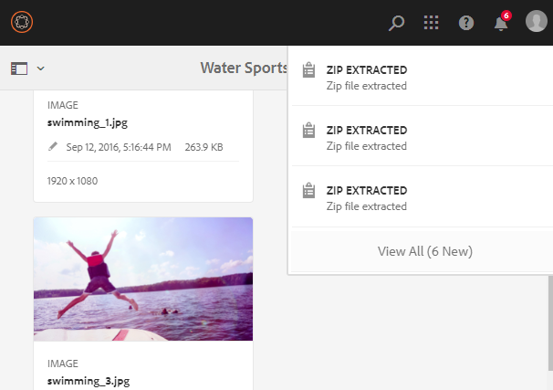

Some limitations of the feature are:

* If a folder by the same name exists at the destination, the assets from the ZIP file are extracted in the existing folder.
* If you cancel the extraction, the already extracted assets are not deleted.
* You cannot select two ZIP files at the same time and extract them. You can only extract one ZIP archive at a time.
* When uploading a ZIP archive, if the upload dialog displays a 500 server error, retry after installing [the latest Service Pack](/help/release-notes/release-notes.md).

## Preview assets {#previewing-assets}

To preview an asset, follow these steps.

1. From the [!DNL Assets] user interface, navigate to the location of the asset you want to preview.
1. Click the desired asset so you can open it.

1. In the preview mode, zoom options are available for [supported Image types](/help/assets/assets-formats.md#supported-raster-image-formats) (with interactive editing).

   To zoom into an asset, click `+` (or click the magnifying glass on the asset). To zoom out, click `-`. When you zoom in, you can look closely at any area of the image by panning. The reset zoom arrow brings you back to the original view. To reset the view to the original size, click **[!UICONTROL Reset]** .

**Preview assets using keyboard keys only**

To preview an asset using keyboard, follow these steps:

1. From the [!DNL Assets] user interface, navigate to the desired asset using `Tab` and arrow keys.

1. Press `Enter` key on the desired asset so you can open it. You can zoom into assets in preview mode.

1. To zoom into the asset:
   1. Use `Tab` key to move focus to zoom-in option.
   1. Use `Enter` key to zoom into the image.

   To zoom out, use the `Tab` key to place focus on the zoom-out option and press `Enter`.

1. Use `Shift` + `Tab` keys to move the focus back on the image.

1. Use arrow keys to move around the zoomed image.

>[!MORELIKETHIS]
>
>* [Preview Dynamic Media Assets](/help/assets/previewing-assets.md).
>* [View subassets](managing-linked-subassets.md#viewing-subassets).

## Edit properties and metadata {#editing-properties}

1. Navigate to the location of the asset whose metadata that you want to edit.

1. Select the asset, then from the toolbar, select **[!UICONTROL Properties]** so you can view the asset's properties. Alternatively, choose the **[!UICONTROL Properties]** quick action on the asset card.

   

1. In the [!UICONTROL Properties] page, edit the metadata properties under various tabs. For example, under the **[!UICONTROL Basic]** tab, edit the title and description.

   >[!NOTE]
   >
   >The layout of the [!UICONTROL Properties] page and the metadata properties available depend on the underlying metadata schema. To learn how to modify the layout of the [!UICONTROL Properties] page, see [Metadata Schemas](/help/assets/metadata-schemas.md).

1. To schedule a particular date/time for the activation of the asset, use the date picker beside the **[!UICONTROL On Time]** field.

   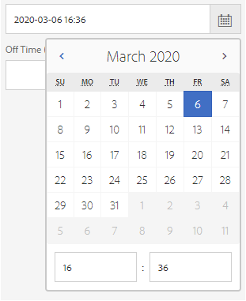

   *Figure: Use the date picker to schedule asset activation.*

1. Check **[!UICONTROL On/Off Time Reached]** option if you want to update the replication agent triggers in Metadata properties.
   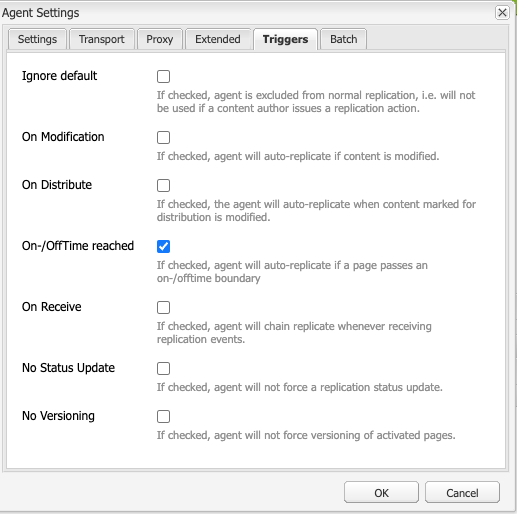

1. To deactivate the asset after a particular duration, choose the deactivation date/time from the date picker beside the **[!UICONTROL Off Time]** field. The deactivation date should be later than the activation date for an asset. After the [!UICONTROL Off Time], an asset and its renditions are not available either via the [!DNL Assets] web interface or through the HTTP API.

1. In the **[!UICONTROL Tags]** field, select one or more tags. To add a custom tag, type the name of the tag in the box and select `Enter`. The new tag is saved in [!DNL Experience Manager]. [!DNL YouTube] requires tags to publish. See [publish videos to YouTube](video.md#publishing-videos-to-youtube).

   >[!NOTE]
   >
   >To create tags, you need write permission at `/content/cq:tags/default` in the CRX repository.

1. To provide a rating to the asset, click the **[!UICONTROL Advanced]** tab and then click the star at the appropriate position to assign the desired rating.

   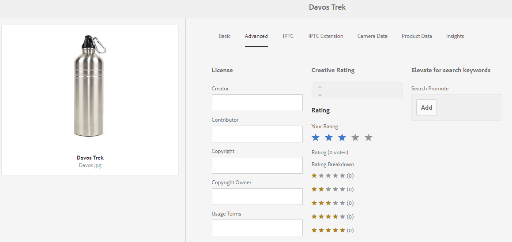

   The rating score that you assign to the asset is displayed under **[!UICONTROL Your Ratings]**. The average rating score that the asset received from users who rated the asset is displayed under **[!UICONTROL Rating]**. In addition, the breakup of the rating scores that contribute to the average rating score is displayed under **[!UICONTROL Rating Breakdown]**. You can search assets based on average rating scores.

1. To view usage statistics for the asset, click the **[!UICONTROL Insights]** tab.

   Usage statistics include the following:

    * Number of times the asset was viewed or downloaded
    * Channels/devices through which the asset was used
    * Creative solutions where the asset was recently used

   For more details, see [Assets Insights](/help/assets/asset-insights.md).

1. Click **[!UICONTROL Save & Close]**.
1. Navigate to the [!DNL Assets] user interface. The edited metadata properties, including title, description, ratings, and so on, are displayed on the asset card in Card view and under relevant columns in the List view.

## Copy assets {#copying-assets}

When you copy an asset or a folder, the entire asset or the folder is copied, along with its content structure. A copied asset or a folder is duplicated at the target location. The asset at the source location is not altered.

A few attributes that are unique to a particular copy of an asset are not carried forward. Some examples are:

* Asset ID, creation date and time, and versions and version history. Some of these properties are indicated by the properties `jcr:uuid`, `jcr:created`, and `cq:name`.

* Creation time and referenced paths are unique for each asset and each of its rendition.

The other properties and metadata information is retained. A partial copy is not created when copying an asset.

1. In [!DNL Assets] interface, select one or more assets and click **[!UICONTROL Copy]** from the toolbar. Alternatively, select the **[!UICONTROL Copy]**  quick action from the asset card.

   >[!NOTE]
   >
   >If you use the [!UICONTROL Copy] quick action, you can only copy one asset at a time.

1. Navigate to the location where you want to copy the assets.

   >[!NOTE]
   >
   >If you copy an asset at the same location, [!DNL Experience Manager] automatically generates a variation of the name. For example, if you copy an asset titled `Square`, [!DNL Experience Manager] automatically generates the title for its copy as `Square1`.

1. Click the **[!UICONTROL Paste]**  asset option from the toolbar. Assets are then copied to this location.

   >[!NOTE]
   >
   >The **[!UICONTROL Paste]** option is available in the toolbar until the paste operation is completed.

## Move and rename assets {#moving-or-renaming-assets}

When you move assets (or folders) to another location, then the assets (or folders) are not duplicated unlike while copying the asset. The assets (or the folders) get placed at the target location and are removed from the source location. You can also rename the asset when moving it to the new location.
If you are moving a published asset to a different location, then you can optionally republish the asset. By default move operation on a published asset automatically unpublishes it. A moved asset is republished if author selects the [!UICONTROL Republish] option when moving the asset.

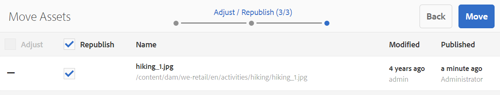

To move assets or folders:

1. Navigate to the location of the asset that you want to move.

1. Select the asset, and click **[!UICONTROL Move]** option from the toolbar.


1. In the [!UICONTROL Move Assets] wizard, do one of the following:

    * Specify the name for the asset after it is moved. Then click **[!UICONTROL Next]** to proceed.

    * Click **[!UICONTROL Cancel]** to stop the process.

   >[!NOTE]
   >
   >* You can specify the same name for the asset if there is no asset with that name at the new location. However, you should use a different name if you move the asset to a location where an asset with the same name exists. If you use the same name, the system automatically generates a variation of the name. For example if your asset has the name Square, the system generates the name Square1 for its copy.
   >* When renaming, whitespace is not allowed in the file name.

1. On the **[!UICONTROL Select Destination]** dialog, do one of the following:

    * Navigate to the new location for the assets, and then click **[!UICONTROL Next]** to proceed.

    * Click **[!UICONTROL Back]** to return to the **[!UICONTROL Rename]** screen.

1. If the assets being moved have any referencing pages, assets, or collections, the **[!UICONTROL Adjust References]** tab appears beside the **[!UICONTROL Select Destination]** tab.

   Do one of the following in the **[!UICONTROL Adjust References]** screen:

    * Specify the references to be adjusted based on the new details, and then click **[!UICONTROL Move]** to proceed.

    * From the **[!UICONTROL Adjust]** column, select/unselect references to the assets.
    * Click **[!UICONTROL Back]** to return to the **[!UICONTROL Select Destination]** screen.

    * Click **[!UICONTROL Cancel]** to stop the move operation.

   If you do not update references, they continue to point to the previous path of the asset. If you adjust the references, they are updated to the new asset path.

### Move assets using drag operation {#move-using-drag}

You can move assets (or folders) to a sibling folder by dragging them to the target location, instead of using [!UICONTROL Move] option in the user interface. However, this operation is possible only in the list view.

Moving assets by dragging them does not open [!UICONTROL Move Asset] wizard, therefore you do not get the option to rename the assets while moving. Moreover, the already published assets are republished on moving them by dragging, without seeking user's approval to republish.


## Manage renditions {#managing-renditions}

1. You can add or remove renditions for an asset, except the original. Navigate to the location of the asset for which you want to add or remove renditions.

1. Click the asset so its page is opened.
1. In the Experience Manager interface, select **[!UICONTROL Renditions]** from the list.
1. In the **[!UICONTROL Renditions]** panel, view the list of renditions generated for the asset.

   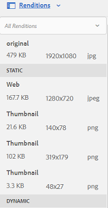

   >[!NOTE]
   >
   >By default, [!DNL Assets] does not display the original rendition of the asset in the preview mode. If you are an administrator, you can use overlays to configure [!DNL Assets] to display original renditions in the preview mode.

1. Select a rendition to either view or delete the rendition.

   **Delete a rendition**

   Select a rendition from the **[!UICONTROL Renditions]** panel, and then click the **[!UICONTROL Delete Rendition]**  option from the toolbar. Renditions cannot be deleted in bulk after asset processing is complete. For individual assets, you can remove renditions manually from the user interface. For multiple assets, you can customize Experience Manager to delete either specific renditions or delete the assets and reupload the deleted assets.

   **Upload a new rendition**

   Navigate to the asset details page for the asset, and click the **[!UICONTROL Add Rendition]**  option in the toolbar to upload a new rendition for the asset.

   >[!NOTE]
   >
   >If you select a rendition from the **[!UICONTROL Renditions]** panel, the toolbar changes context and displays only those actions that are relevant to the rendition. Options, such as the [!UICONTROL Upload Rendition] option is not displayed. To view these options in the toolbar, navigate to the details page for the asset.

   You can configure the dimensions for the rendition you want displayed in the details page of an image or video asset. Based on the dimensions you specify, [!DNL Assets] displays the rendition with the exact or closest dimensions.

   To configure rendition dimensions of an image at the asset detail level, overlay the `renditionpicker` node (`libs/dam/gui/content/assets/assetpage/jcr:content/body/content/content/items/assetdetail/items/col1/items/assetview/renditionpicker`) and configure the value of the width property. Configure the property **[!UICONTROL size (Long) in KB]** in place of width so you can customize rendition on asset detail page based on image size. For size-based customization, the property `preferOriginal` assigns preference to the original if the size of the matched rendition is greater than the original.

   Similarly, you can customize the Annotation page image by overlaying `libs/dam/gui/content/assets/annotate/jcr:content/body/content/content/items/content/renditionpicker`.

   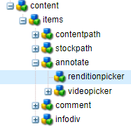

   To configure rendition dimensions for a video asset, navigate to the `videopicker` node in the CRX repository at the location `/libs/dam/gui/content/assets/assetpage/jcr:content/body/content/content/items/assetdetail/items/col1/items/assetview/videopicker`, overlay the node, and then edit the appropriate property.

   >[!NOTE]
   >
   >Video annotations are supported only on browsers with HTML5 compatible video formats. In addition, depending on the browser, different video formats are supported. However, MXF video format is not yet supported with video annotations.

For more information about generating and viewing subassets, see [Manage subassets](managing-linked-subassets.md#generate-subassets).

## Delete assets {#deleting-assets}

To delete assets, a user requires delete permissions on `dam/asset`. If you only have modify permissions, you can only edit the asset metadata and add annotations to the asset. However, you cannot delete the asset or its metadata.

To resolve or remove the incoming references from other pages, update the relevant references before deleting an asset. To disallow users from deleting referenced assets and leaving broken links, disable the force delete option using an overlay.

To delete an asset or a folder containing asset:

1. Navigate to the location of the asset or the folder that you want to delete.

1. Select the asset or folder, and click **[!UICONTROL Delete]**  from the toolbar.

   Once you confirm the deletion:

   * If the asset has no references, the asset is deleted.

   * If the asset has references, an error-message informs you that **One or more assets are referenced**. You can select **[!UICONTROL Force Delete]** or **[!UICONTROL Cancel]**.

   >[!NOTE]
   >
   >* To resolve or remove the incoming references from other pages, update the relevant references before deleting an asset. Also, disable the force delete option using an overlay, to disallow users from deleting referenced assets and leaving broken links.
   >* It is possible to delete a *folder* that contains checked-out asset files. Before deleting a folder, ensure that no digital assets are checked-out by users.

>[!NOTE]
>
>If you delete a folder using the above method from the user interface, then the associated user groups are also deleted.
>
>However, existing redundant, unused, and autogenerated user groups can be cleaned up from the repository using `clean` method in JMX in your author instance (`https://[server]:[port]/system/console/jmx/com.day.cq.dam.core.impl.team%3Atype%3DClean+redundant+groups+for+Assets`).

## Download assets {#downloading-assets}

See [Download assets from Experience Manager](/help/assets/download-assets-from-aem.md).

## Publish or unpublish assets {#publish-assets}

After uploading, processing, or editing your assets on [!DNL Experience Manager] author, you publish the asset to the publish server. Publishing makes the asset available publicly. Unpublishing action removed the asset from the publish server but not from the authoring server.

For information specific to [!DNL Dynamic Media], see [publishing [!DNL Dynamic Media] assets](/help/assets/publishing-dynamicmedia-assets.md).

1. Navigate to the location of the asset or the asset folder that you want to publish or that you want to remove from the publish environment (unpublish).

1. Select the asset or the folder that you want to unpublish, and click **[!UICONTROL Manage Publication]**  option from the toolbar. Alternatively, to publish quickly, select the **[!UICONTROL Quick Publish]** option from the toolbar. If the folder you want to publish includes an empty folder, the empty folder is not published.

1. Select the **[!UICONTROL Publish]** or **[!UICONTROL Unpublish]** option as required.

   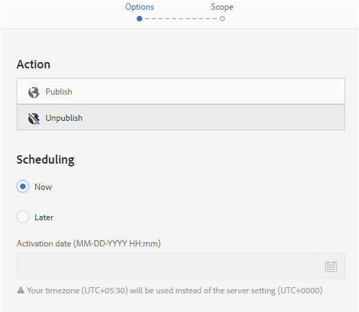
   *Figure: Publish and unpublish options and the scheduling option.*

1. Select **[!UICONTROL Now]** to act on the asset right away or select **[!UICONTROL Later]** to schedule the action. Select a date and time if you choose the **[!UICONTROL Later]** option. Click **[!UICONTROL Next]**.

1. When publishing, if an asset references other assets, its references are listed in the wizard. Only those references are displayed, that are either unpublished or modified since last publish. Choose the references that you want to publish.

1. When unpublishing, if an asset references other assets, choose the references that you want to unpublish. Click **[!UICONTROL Unpublish]**. In the confirmation dialog, click **[!UICONTROL Cancel]** to stop the action or click **[!UICONTROL Unpublish]** to confirm that the assets are to be unpublished at the specified date.

Understand the following limitations and tips related to publishing or unpublishing assets or folders:

* The option to [!UICONTROL Manage Publication] is available only to the user accounts that have replication permissions.
* While unpublishing a complex asset, unpublish the asset only. Avoid unpublishing the references because they may be referenced by other published assets.
* Empty folders are not published.
* If you publish an asset that is being processed, only the original content is published. The renditions are missing. Either wait for processing to complete and then publish or republish the asset once the processing completes.

## Closed User Group {#closed-user-group}

A closed user group (CUG) is used to limit access to specific asset folders published from [!DNL Experience Manager]. If you create a CUG for a folder, access to the folder (including folder assets and subfolders) is restricted to assigned members or groups only. To access the folder, they must log in using their security credentials.

CUGs are an extra way to restrict access to your assets. You can also configure a login page for the folder.

1. Select a folder from the [!DNL Assets] interface, and click the [!UICONTROL Properties] option from the toolbar so you can display the properties page.
1. From the **[!UICONTROL Permissions]** tab, add members or groups under **[!UICONTROL Closed User Group]**.

   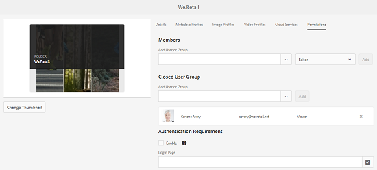

1. To display a login screen when users access the folder, select the **[!UICONTROL Enable]** option. Then, select the path to a login page in [!DNL Experience Manager], and save the changes.

   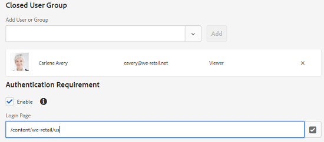

   >[!NOTE]
   >
   >If you do not specify the path to a login page, [!DNL Experience Manager] displays the default login page in the publish instance.

1. Publish the folder, and then try accessing it from the publish instance. A login screen is displayed.
1. If you are a CUG member, enter your security credentials. The folder is displayed after [!DNL Experience Manager] authenticates you.

## Search assets {#assetsearch}

Searching assets is central to the usage of a digital asset management system. This functionality is important for creatives, for robust management of assets by the business users and marketers, or for administration by DAM administrators.

For simple, advanced, and custom searches to discover and use the most appropriate assets, see [search assets in Experience Manager](search-assets.md).

## Quick actions {#quick-actions}

Quick action icons are available for a single asset at a time. Depending upon your device, perform the following actions to display the quick action icons:

* Touch devices: Touch and hold. For example, on an iPad, you can tap-and-hold an asset so that the quick actions display.
* Non-touch devices: Hover pointer. For example, On a desktop device, the quick action bar is displayed if you hover the pointer over the asset thumbnail.

### Navigate and select assets {#navigating-and-selecting-assets}

You can view, navigate through, and select assets with any of the available views (Card, Column, and List) using the **[!UICONTROL Select]** option.

In list view and column view, the **[!UICONTROL Select]** option displays when you hover the pointer over the asset thumbnail.

In card view, the **[!UICONTROL Select]** option displays as a quick action.

When browsing a folder or a collection in the [!DNL Assets] user interface in a browser, you can select all the displayed or loaded assets by using the [!UICONTROL Select All] option from the upper-right corner. Initially, only 100 assets are loaded in card view and 200 are loaded in list view. More assets are loaded in view as you scroll the search results page. The [!UICONTROL Select All] option selects only the loaded assets.

For more information, see [view and selecting your resources](/help/sites-authoring/basic-handling.md#viewing-and-selecting-resources).

## Edit images {#editing-images}

The editing tools in the [!DNL Assets] interface let you perform small editing jobs on image assets. You can crop, rotate, flip, and perform other editing jobs on images. You can also add image maps to assets.

>[!NOTE]
>
>For some components, the Full Screen mode has additional options available.

1. Do one of the following to open an asset in edit mode:

    * Select the asset and then click **[!UICONTROL Edit]** in the toolbar.
    * Click **[!UICONTROL Edit]** option that displays on an asset in the card view.
    * Click **[!UICONTROL Edit]** from the toolbar .

1. To crop the image, click **[!UICONTROL Crop]** .

1. Select the desired option from the list. The crop area appears on the image based on the option that you choose. The **Free Hand** option lets you crop the image without any aspect ratio restrictions.

1. Select the area to be cropped, and resize or reposition it on the image.

1. Use the **[!UICONTROL Undo]**  and **[!UICONTROL Redo]**  options to revert to the uncropped image or retain the cropped image, respectively.
1. Click the appropriate **[!UICONTROL Rotate]** option to rotate the image clockwise or anti-clockwise.

   

1. Click the appropriate **[!UICONTROL Flip]** options if you want to flip the image horizontally  or vertically .

1. To complete the image editing, click **[!UICONTROL Finish]** . Clicking **Finish** also starts the regeneration of renditions.

>[!NOTE]
>
>Image editing is supported for BMP, GIF, PNG, and JPEG files formats.

You can also add image maps using the image editor. For details, see [Adding Image Maps](/help/assets/image-maps.md).

>[!NOTE]
>
>To edit a TXT file, set **Day CQ Link Externalizer** from Configuration Manager.

## Timeline {#timeline}

The timeline lets you view various events for a selected item, such as active workflows for an asset, comments/annotations, activity logs, and versions.


*Figure: Sort timeline entries for an asset.*

>[!NOTE]
>
>In the [Collections console](/help/assets/manage-collections.md#navigating-the-collections-console), the **[!UICONTROL Show All]** list provides options to view comments and workflows only. Moreover, the timeline is displayed only for top-level collections that are listed in the console. It is not displayed if you navigate inside any of the collections.

>[!NOTE]
>
>Timeline contains several [options specific to content fragments](/help/assets/content-fragments/content-fragments-managing.md#timeline-for-content-fragments).

## Annotate assets {#annotating}

Annotations are comments or explanatory notes added to images or videos. Annotations provide marketers the ability to collaborate and leave feedback about assets.

Video annotations are only supported on browsers with HTML5-compatible video formats. Video formats that [!DNL Assets] supports depend on the browser. However, MXF video format is not yet supported with video annotations.

>[!NOTE]
>
>For Content Fragments, [annotations are created in the fragment editor](/help/assets/content-fragments/content-fragments-variations.md#annotating-a-content-fragment).

1. Navigate to the location of the asset to which you want to add annotations.
1. Click the **[!UICONTROL Annotate]** option from one of the following:

    * [Quick actions](/help/assets/manage-assets.md#quick-actions)
    * From the toolbar after selecting the asset or navigating to the asset page.

1. Add a comment in the **[!UICONTROL Comment]** box at the bottom of the timeline. Alternatively, mark up an area on the image and add an annotation in the **[!UICONTROL Add Annotation]** dialog.

1. To notify a user about an annotation, specify the email address of the user and add the comment. For example, to notify Aaron MacDonald about an annotation, enter @aa. Hints for all matching users are displayed in a list. Select Aaron's email address from the list so you can tag the person with the comment. Similarly, you can tag more users anywhere within the annotation or before or after it.

   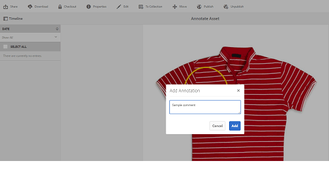

   >[!NOTE]
   >
   >For a non-administrator user, the suggestions appear only if the user has read permissions at `/home` path in CRXDE.

1. After adding the annotation, click **[!UICONTROL Add]** to save it. A notification for the annotation is sent to Aaron.

   >[!NOTE]
   >
   >You can add multiple annotations, before you save them.

1. Click **[!UICONTROL Close]** to exit from the Annotation mode.
1. To view the notification, log in to [!DNL Assets] with Aaron MacDonald's credentials and click the **[!UICONTROL Notifications]** option to view the notification.

   >[!NOTE]
   >
   >Annotations can also be added to video assets. While annotating videos, the player pauses to let you annotate on a frame. For details, see [managing video assets](/help/assets/managing-video-assets.md). MXF video format is not yet supported with video annotations.

1. To choose a different color so you can differentiate between users, click the Profile option and click **[!UICONTROL My Preferences]**.

   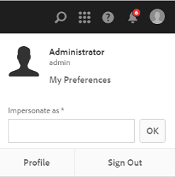

   Specify the desired color in the **[!UICONTROL Annotation Color]** box and then click **[!UICONTROL Accept]**.

   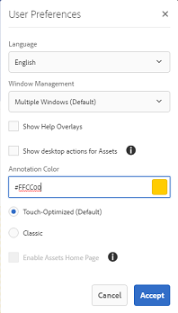

>[!NOTE]
>
>You can also add annotations to a collection. However, if a collection contains child collections, you can add annotations/comments to the parent collection only. The Annotate option is not available for child collections.

### View saved annotations {#viewing-saved-annotations}

You can view only one annotation at a time. 

>[!NOTE]
>
>If you are selecting multiple annotations, the latest annotation is visible on the user interface. 
>
>Multi-select is supported only for printing the annotated asset as PDF.

**To view saved annotations for an asset:**

1. Go to the location of the asset and open the asset page.

1. In the Experience Manager interface, choose **[!UICONTROL Timeline]**.
1. From the **[!UICONTROL Show All]** list in the timeline, select **[!UICONTROL Comments]** to filter the results based on annotations.

   Click a comment in the **[!UICONTROL Timeline]** panel if you want to view the corresponding annotation on the image.

   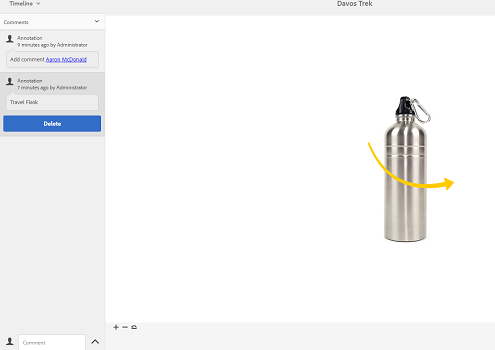

   Click **[!UICONTROL Delete]**, to delete a particular comment.

### Print annotations {#printing-annotations}

If an asset has annotations or it has been subjected to a review workflow, you can print the asset along with annotations and review status as a PDF file for offline review.

You can also choose to print only the annotations or review status.

>[!NOTE]
>
>You can select multiple annotations while printing the annotated asset as PDF.

To print the annotations and review status, click **[!UICONTROL Print]** and follow the instructions in the wizard. The **[!UICONTROL Print]** option appears in the toolbar only when the asset has at least one annotation or review status assigned to it.

1. From the [!DNL Assets] interface, open the preview page for an asset.
1. Do one of the following:

    * To print all the annotations and the review status, skip step 3 and directly go to step 4.
    * To print specific annotations and review status, open the [timeline](/help/assets/manage-assets.md#timeline) and then go to step 3.

1. To print specific annotations, select the annotations from the timeline.

   

   To print the review status only, select it from the timeline.

1. Click **[!UICONTROL Print]** from the toolbar.

1. From the Print dialog, choose the position you want the annotations/review status to be displayed on the PDF. For example, if you want the annotations/status to be printed at the top-right of the page that contains the printed image, use the **Top-Left** setting. It is selected by default.

   You can choose other settings depending on the position where you want the annotations/status to appear in the printed PDF. If you want the annotations/status to appear in a page that is separate from the printed asset, choose **[!UICONTROL Next Page]**.

1. Click **[!UICONTROL Print]**. Depending upon the option you choose in step 2, the generated PDF displays the annotations/status at the specified position. For example, if you choose to print both annotations and the review status using the **Top-Left** setting, the generated output resembles the PDF file depicted here.

   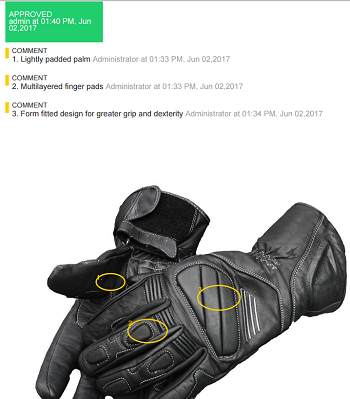

1. Download  or print  the PDF using the options at the top-right.

   >[!NOTE]
   >
   >If the asset has subassets, you can print all the subassets along with their specific page-wise annotations.

   To edit the appearance of the rendered PDF file, for example the font color, size, and style, open the **[!UICONTROL Annotation PDF configuration]** from Configuration Manager, and modify the desired options. For example, to change the display color of the approved status, modify the color code in the corresponding field. For information around changing the font color of annotations, see [Annotating](/help/assets/manage-assets.md#annotating).

   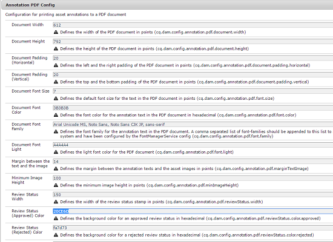

   Return to the rendered PDF file and refresh it. The refreshed PDF reflects the changes that you made.

If an asset includes annotations in foreign languages (especially non-latin languages), you must first configure CQ-DAM-Handler-Gibson Font Manager Service on the [!DNL Experience Manager] server to be able to print these annotations. When configuring CQ-DAM-Handler-Gibson Font Manager Service, provide the path where fonts for the desired languages are located.

1. Open the CQ-DAM-Handler-Gibson Font Manager Service configuration page from the URL `https://[aem_server]:[port]/system/console/configMgr/com.day.cq.dam.handler.gibson.fontmanager.impl.FontManagerServiceImpl`.
1. To configure CQ-DAM-Handler-Gibson Font Manager Service, do one of the following:

    * In the System Fonts directory option, specify the complete path to the fonts directory on your system. For example, if you're a Mac user, you can specify the path as */Library/Fonts* in the System Fonts directory option. [!DNL Experience Manager] fetches the fonts from this directory.
    * Create a directory named `fonts` inside the `crx-quickstart` folder. CQ-DAM-Handler-Gibson Font Manager Service automatically fetches the fonts at the location `crx-quickstart/fonts`. You can override this default path from within the Adobe Server Fonts directory option.

    * Create a folder for fonts in your system, and store the desired fonts in the folder. Then, specify the complete path to that folder in the Customer Fonts directory option.

1. Access the Annotation PDF configuration from the URL `https://[aem_server]:[4502]/system/console/configMgr/com.day.cq.dam.core.impl.annotation.pdf.AnnotationPdfConfig`.
1. Configure the Annotation PDF with the correct set of font-family as follows:

    * Include the string `<font_family_name_of_custom_font, sans-serif>` within the font-family option. For example, if you want to print annotations in CJK (Chinese, Japanese and Korean), include the string `Arial Unicode MS, Noto Sans, Noto Sans CJK JP, sans-serif` in the font-family option. If you want to print annotations in Hindi, download the appropriate font and configure the font-family as Arial&reg; Unicode MS&reg;, Noto Sans, Noto Sans CJK JP, Noto Sans Devanagari, sans-serif.

1. Restart the [!DNL Experience Manager] deployment.

Here is an example of how you can configure [!DNL Experience Manager] to print annotations in CJK (Chinese, Japanese, and Korean):

1. Download Google Noto CJK fonts from the following links, and store them in the font directory configured in Font Manager Service.

    * All In One Super CJK font: [https://fonts.google.com/noto/use](https://fonts.google.com/noto/use)
    * Noto Sans (for European languages): [https://fonts.google.com/noto](https://fonts.google.com/noto)
    * Noto fonts for a language of your choice: [https://fonts.google.com/noto](https://fonts.google.com/noto)

1. Configure the annotation PDF file by setting the font-family parameter to `Arial Unicode MS, Noto Sans, Noto Sans CJK JP, sans-serif`. This configuration is available by default and works for all European and CJK languages.
1. If the language of your choice is different from the languages mentioned in step 2, append an appropriate (comma-separated) entry to the default font-family.

## Create, manage, preview, and revert asset versions {#asset-versioning}

Versioning creates a snapshot of digital assets at a specific point in time. Versioning helps restore assets to a previous state later. For example, if you want to undo a change that you made to an asset, restore the unedited version of the asset. In [!DNL Experience Manager], you can create a version, view the current revision, view side-by-side differences between two versions of images, and restore an asset to its previous version.

You can create versions in [!DNL Experience Manager] in the following scenarios:

* Upload an asset with the same filename that exists at the same location. It can be a new asset or a modified version of the same asset.
* Edit an image in [!DNL Experience Manager] and save the changes.
* Edit the metadata of an asset.
* Use [!DNL Experience Manager] desktop app to check out an existing asset, edit it, and [upload your changes](https://experienceleague.adobe.com/docs/experience-manager-desktop-app/using/using.html#edit-assets-upload-updated-assets).

You can also enable automatic versioning through a workflow. When you create a version for an asset, the metadata and renditions are saved along with the version. Renditions are rendered alternatives of the same images, for example, a PNG rendition of an uploaded JPEG file.

1. Navigate to the location of the asset for which you want to create a version and click it to open its preview. From the upper-left corner of the page, open the menu, and select **[!UICONTROL Timeline]**.

   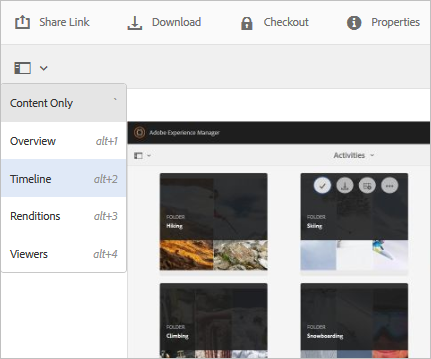

   *Figure: Open menu from upper-left area of page and select [!UICONTROL Timeline] option.*

1. To create a version of the asset:
  
   * Click the **[!UICONTROL Actions]** at the bottom.
   * Click **[!UICONTROL Save as Version]** so you can create a version for the asset. Optionally, add a label and comment.
   * Click **[!UICONTROL Create]** to create a version.

     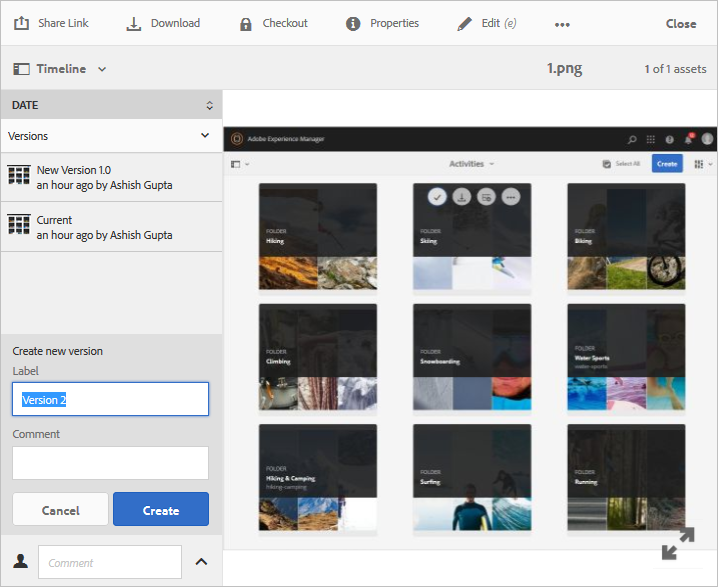

     *Figure: Create a version of an asset from the [!UICONTROL Timeline] left sidebar.*

1. To view a version of an asset:

   * Click **[!UICONTROL Show All]** in [!UICONTROL Timeline].
   * Click **[!UICONTROL Versions]**. All versions created for an asset are listed the left sidebar.

   * Select a specific version of the asset and click **[!UICONTROL Preview Version]**.

1. To revert to an older version of the asset, do the following. After reverting, this version is displayed in the [!DNL Assets] interface and is available for usage.

   * Click a version of the asset. Optionally, add a label and a comment.
   * Click **[!UICONTROL Revert to this Version]**.

     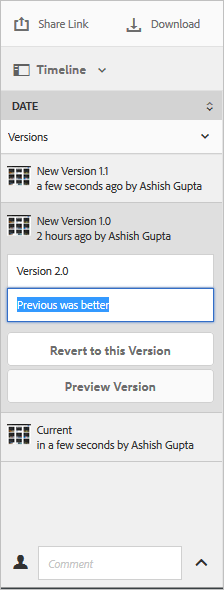

     *Figure: Select a version and revert to it. It becomes the current version which is then available to the DAM users.*

1. To compare between two versions of an image, follow these steps:
   * Click the version to be compared with the current version.
   * Drag the slider to the left to superimpose this version over the current version and compare.

   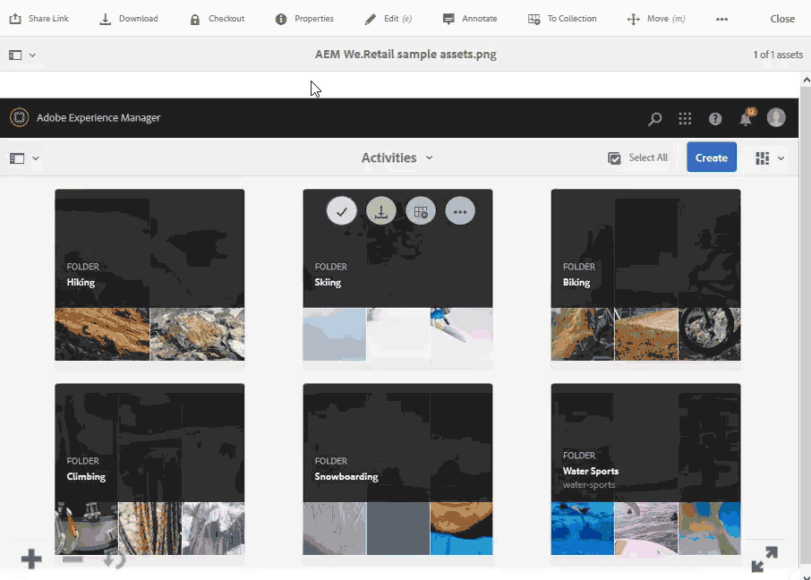

   *Figure: Use slider to effortlessly compare the selected versions of an asset with the current version.*

### Start a workflow on an asset {#starting-a-workflow-on-an-asset}

To apply a workflow to process an asset, see [start workflow on an asset](/help/assets/assets-workflow.md#apply-a-workflow-to-an-asset).

## Collections {#collections}

A collection is an ordered set of assets. Use collections to share related assets between users or to cluster together similar assets for easy discovery.

* A collection can include assets from different locations because they only contain references to these assets. Each collection maintains the referential integrity of assets.
* You can share collections with multiple users with different privilege levels, including editing, viewing, and so on.

To know details of Collection management, see [Manage digital assets collections](/help/assets/manage-collections.md).

## Hide expired assets when viewing assets in desktop app or Adobe Asset Link {#hide-expired-assets-via-acp-api}

[!DNL Experience Manager] desktop app allows access to the DAM repository from Windows or Mac desktop. Adobe Asset Link allows access to assets from within the supported [!DNL Creative Cloud] desktop applications. 

When browsing assets from within [!DNL Experience Manager] user interface, the expired assets are not displayed. To prevent viewing, searching, and fetching of expired assets when browsing assets from desktop app and Asset Link, administrators can do the following configuration. The configuration works for all users, irrespective of administrator privilege.

Execute the following CURL command. Ensure read access on `/conf/global/settings/dam/acpapi/` for the users who access assets. Users who are part of `dam-user` group have the permission by default.

```curl
curl -v -u admin:admin --location --request POST 'http://localhost:4502/conf/global/settings/dam/acpapi/configuration/_jcr_content' \
--header 'Content-Type: application/x-www-form-urlencoded' \
--data-urlencode 'jcr:title=acpapiconfig' \
--data-urlencode 'hideExpiredAssets=true' \
--data-urlencode 'hideExpiredAssets@TypeHint=Boolean' \
--data-urlencode 'jcr:primaryType=nt:unstructured' \
--data-urlencode '../../jcr:primaryType=sling:Folder'
```

To know more, see how to [browse DAM assets using desktop app](https://experienceleague.adobe.com/docs/experience-manager-desktop-app/using/using.html#browse-search-preview-assets) and [how to use Adobe Asset Link](https://helpx.adobe.com/enterprise/using/manage-assets-using-adobe-asset-link.html).
