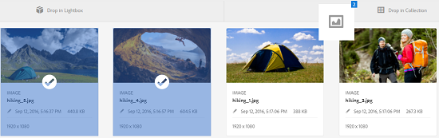

# Manage collections {#managing-collections}

| Version | Article link |
| -------- | ---------------------------- |
| AEM as a Cloud Service  |    [Click here](https://experienceleague.adobe.com/docs/experience-manager-cloud-service/content/assets/manage/manage-collections.html?lang=en)                  |
| AEM 6.5     | This article         |

A collection is a set of assets within [!DNL Adobe Experience Manager Assets]. Use collections to share assets between users. The set can be static collection or a dynamic collection that is based on search results.

Unlike folders, a collection can include assets from different locations. You can share collections with various users that are assigned different levels of privileges, including viewing, editing, and so on.

You can share multiple collections with a user. Each collection contains references to assets. The referential integrity of assets is maintained across collections.

Collections are of the following types, based on the way they collate assets:

* A collection that contains a static reference list of assets, folders, and other collections.

* A smart collection that dynamically includes assets based on a search criteria.

## Access the collections console {#navigating-the-collections-console}

To open the **[!UICONTROL Collections]**, in the [!DNL Experience Manager] interface, go to **[!UICONTROL Assets]** > **[!UICONTROL Collections]**.

## Create a collection {#creating-a-collection}

You can create a collection either with [static references](#creating-a-collection-with-static-references) or based on a [search criteria-based filter](#creating-a-smart-collection). You can also create a collection from a lightbox.

### Create a collection with static references {#creating-a-collection-with-static-references}

You can create a collection with static references, for example a collection with references to assets, folders, collections, spin sets, and image sets.

1. Navigate to the **[!UICONTROL Collections]** console.
1. From the toolbar, click **[!UICONTROL Create]**.
1. In the **[!UICONTROL Create Collection]** page, enter a title and an optional description for the collection.
1. Add members to the collection and assign appropriate permissions. Alternatively, select **[!UICONTROL Public Collection]** to allow all users to access the collection.

   >[!NOTE]
   >
   >To enable the members to share collections with other users, provide the `dam-users` group read permissions at the path `home/users`. Give permission to the users at `/content/dam/collections` location to allow the users to view the Collections in pop up lists. Alternatively, make the user a part of `dam-users` group.

1. (Optional) Add a thumbnail image for the collection.
1. Click **[!UICONTROL Create]**, and then click **[!UICONTROL OK]** to close the dialog. A collection with the specified title and properties is opened in the Collections console.

   >[!NOTE]
   >
   >[!DNL Experience Manager Assets] lets you create review tasks for a collection similar to the way you create review tasks for an assets folder.

   To add assets to the collection, navigate to the [!DNL Assets] user interface. For details, see [Add assets to a collection](#adding-assets-to-a-collection).

### Create collections using dropzone {#create-collections-using-dropzone}

You can drag assets from the [!DNL Assets] user interface to a collection. You can also create a copy of a collection and drag the assets there.

1. From the [!DNL Assets] user interface, select the assets you want to add to a collection.
1. Drag the assets to the **[!UICONTROL Drop in Collection]** zone. Alternatively, click **[!UICONTROL To Collection]** from the toolbar.

   

1. In the **[!UICONTROL Add To Collection]** page, click **[!UICONTROL Create Collection]** from the toolbar.

   If you want to add the assets to an existing collection, select it from the page, and click **[!UICONTROL Add]**. By default, the most recently updated collection is selected.

1. In the **[!UICONTROL Create New Collection]** dialog, specify a name for the collection. If you want the collection to be accessible to all users, select **[!UICONTROL Public Collection]**.
1. Click **[!UICONTROL Continue]** to create the collection.

### Create a smart collection {#creating-a-smart-collection}

A Smart Collection uses a search criteria to dynamically populate assets. You can create a Smart Collection using only files and not folders or files and folders.

To create a smart collection, follow the steps:

1. Navigate to the [!DNL Assets] user interface and click search.

1. Type the search keyword in the Omnisearch box and select `Enter`. Open the Filters panel and apply a search filter.

1. From the **[!UICONTROL Files & Folders]** list, select **[!UICONTROL Files]**.

   

1. Click **[!UICONTROL Save Smart Collection]**.

1. Specify a name for the collection. Select **[!UICONTROL Public]** to add the DAM Users group with the Viewer role to the smart collection.

   

   >[!NOTE]
   >
   >If you select **[!UICONTROL Public]**, the smart collection becomes available to everyone with the owner role after you create it. If you cancel the **[!UICONTROL Public]** option, the DAM user group is no longer associated with the smart collection.

1. Click **[!UICONTROL Save]** to create the smart collection, and then close the message box to complete the process.

   The new smart collection is also added to the **[!UICONTROL Saved Searches]** list.

   

   The label of the **[!UICONTROL Create Smart Selection]** option changes to **[!UICONTROL Edit Smart Selection]**. To edit the settings of the smart collection, select **[!UICONTROL Files]** from the **[!UICONTROL Files & Folders]** list. Click the **[!UICONTROL Edit Smart Selection]**  option.

## Add assets to a collection {#adding-assets-to-a-collection}

You can add assets to a collection that contains a list of referenced assets or folders. Smart collections use a search query to populate assets. Therefore, static references to assets and folders are not applicable to them.

1. In the [!DNL A]ssets user interface, select the asset and click **[!UICONTROL To Collection]**  from the toolbar.
   Alternatively, you can drag the asset to the **[!UICONTROL Drop in Collection]** area on the interface. Add the assets when the label of the region changes to **[!UICONTROL Drop to Add]**.

1. In the **[!UICONTROL Add To Collection]** page, select the collection to which you want to add the asset.

1. Click **[!UICONTROL Add]**, and then close the confirmation message. The asset is added to the collection.

## Edit a smart collection {#editing-a-smart-collection}

Smart collections are built by saving a search so you can alter their content by modifying the search parameters of the [saved search](#saved-searches).

1. In the [!DNL Assets] user interface, click the search option  from the toolbar.
1. With the cursor in the Omnisearch box, select the `Return` key.
1. In the [!DNL Experience Manager] interface, open the Filters panel.
1. From the **[!UICONTROL Saved Searches]** list, select the smart collection you want to modify. The Search panel displays the filters configured for the saved search.

   

1. From the **[!UICONTROL Files & Folders]** list, select **[!UICONTROL Files]**.
1. Modify one or more filters, as necessary. Click **[!UICONTROL Edit Smart Collection]**.

   You can also edit the name of the smart collection.

   

1. Click **[!UICONTROL Save]**. The **[!UICONTROL Edit Smart Collection]** dialog appears.
1. Click **[!UICONTROL Overwrite]** to replace the original smart collection with the edited collection. Alternatively, select **[!UICONTROL Save As]** to save the edited collection separately.
1. In the confirmation dialog, Click **[!UICONTROL Save]** to complete the process.

## View and edit collection metadata {#view-edit-collection-metadata}

Collection metadata comprises data about the collection, including any tags that are added.

1. From the [!UICONTROL Collections] console, select a collection and click **[!UICONTROL Properties]** from the toolbar.
1. In the **[!UICONTROL Collection Metadata]** page, view the collection metadata from the **[!UICONTROL Basic]** and **[!UICONTROL Advanced]** tabs.
1. Modify the metadata, as necessary. To save the changes, click **[!UICONTROL Save & Close]** from the toolbar.

## Edit metadata of multiple collections in bulk {#editing-collection-metadata-in-bulk}

You can edit the metadata of multiple collections simultaneously. This functionality helps you quickly replicate common metadata in multiple collections.

1. In the Collections console, select two or more collections.
1. From the toolbar, click **[!UICONTROL Properties]**.
1. In the **[!UICONTROL Collection Metadata]** page, edit the metadata under the **[!UICONTROL Basic]** and **[!UICONTROL Advanced]** tabs, as necessary.
1. To view the metadata properties for a specific collection, cancel the selection of the remaining collections in the collections list. The metadata editor fields are populated with the metadata for the particular collection.

   >[!NOTE]
   >
   >* In the [!UICONTROL Properties] page, you can remove collections from the list of collections by canceling the selection. The collections list has all the collections selected by default. [!DNL Experience Manager] does not update the metadata of the collections that you remove.
   >* At the top of the list, select the check box near **[!UICONTROL Title]** to toggle between selecting the collections and clearing the list.

1. Click **[!UICONTROL Save & Close]** from the toolbar, and then close the confirmation dialog.
1. To append the new metadata with the existing metadata, select **[!UICONTROL Append mode]**. If you do not select this option, the new metadata replaces the existing metadata in the fields. Click **[!UICONTROL Submit]**.

   >[!NOTE]
   >
   >The metadata you add for the selected collections overwrites the previous metadata for these collections. Use the [!UICONTROL Append mode] to add new values to the existing metadata in the fields that can contain multiple values. Single-value fields get always overwritten. Any tags you add in the [!UICONTROL Tags] field, are appended to the existing list of tags in the metadata.

To customize the metadata [!UICONTROL Properties] page, including adding, modifying, deleting metadata properties, use the Schema editor.

>[!TIP]
>
>The bulk editing method works for assets available in a collection. For the assets that are available across folders or match a common criteria, it is possible to [bulk update the metadata after searching](/help/assets/search-assets.md#metadataupdates).

## Search collections {#searching-collections}

You can search collections from the Collections console. When you search with keywords in the Omnisearch box, [!DNL Assets] searches for collection names, metadata, and the tags added to the collections.

If you search for collections from the top level, only individual collections are returned in search results. [!DNL Assets] or folders within the collections are excluded. In all other cases (for example, within an individual collection or in a folder hierarchy), all relevant assets, folders, and collections are returned.

## Search within collections {#searching-within-collections}

In the Collections console, click a collection to open it.

Within a collection, [!DNL Experience Manager] search is restricted to assets (and their tags and metadata) within the collection that you are viewing. When you search within a folder, all matching assets and child folders within the current folder are returned. When you search within a collection, only matching assets, folders, and other collections that are direct members of the collection are returned.

## Edit collection settings {#editing-collection-settings}

You can edit collection settings, such as title and description, or to add members to a collection.

1. Select a collection, and click **[!UICONTROL Settings]** in the toolbar. Alternatively, use the **[!UICONTROL Settings]** quick action from the collection thumbnail.
1. Modify the collection settings in the **[!UICONTROL Collection Settings]** page. For example, modify the collection title, descriptions, members, and permissions as discussed in [Adding Collections](#creating-a-collection).

1. To save the changes, click **[!UICONTROL Save]**.

## Delete a collection {#deleting-a-collection}

1. From the Collections console, select one or more collections and click delete from the toolbar.

1. In the dialog, click **[!UICONTROL Delete]** to confirm the delete action.

   >[!NOTE]
   >
   >You can also delete smart collections by [deleting saved searches](#saved-searches).

## Download a collection {#downloading-a-collection}

When you download a collection, the entire hierarchy of assets within the collection is downloaded, including folders and child collections.

1. From the Collections console, select one or more collections to download.
1. From the toolbar, click **[!UICONTROL Download]**.
1. In the **[!UICONTROL Download]** dialog, click **[!UICONTROL Download]**. If you want to download the renditions of the assets within the collection, select **[!UICONTROL Renditions]**. Select the **[!UICONTROL Email]** option to send an email notification to the owner of the collection.

   When you select a collection to download, the complete folder hierarchy under the collection is downloaded. To include each collection you download (including assets in child collections nested under the parent collection) in an individual folder, select **[!UICONTROL Create separate folder for each asset]**.

## Create nested collections {#creating-nested-collections}

You can add a collection to another collection, thereby creating a nested collection.

1. From the Collections console, select the desired collection or group of collections, and click **[!UICONTROL To Collection]** in the toolbar.

1. From the **[!UICONTROL Add To Collection]** page, select the collection in which to add the collection.

   >[!NOTE]
   >
   >The most recently updated collection is selected by default in the **[!UICONTROL Add To Collection]** page.

1. Click **[!UICONTROL Add]**. A message confirms that the collection is added to the target collection in the **[!UICONTROL Select Destination]** page. Close the message to complete the process.

>[!NOTE]
>
>Smart collections cannot be nested. In other words, Smart collections cannot contain any other collection.

## Saved searches {#saved-searches}

In the [!DNL Assets] user interface, you can search or filter assets based on certain rules, search criteria, or custom search facets. If you save these as **[!UICONTROL Saved Searches]**, you can access them later from the **[!UICONTROL Saved Searches]** list in the Filter panel. Creating a saved search also creates a smart collection.

Saved searches are created when you create a smart collection. Smart collections are automatically added to the **[!UICONTROL Saved Searches]** list. The [!UICONTROL Saved Searches] query for the collection is saved in the `dam:query` property in CRXDE at the relative location `/content/dam/collections/`. There are no limits to the searches that you can save and on the saved searches displayed in the list.

>[!NOTE]
>
>You can share smart collections in the same way as you share static collections.

Editing saved searches is the same as editing smart collections. For details, see [edit a smart collection](#editing-a-smart-collection).

To delete saved searches, follow these steps:

1. In the [!DNL Assets] user interface, click search .
1. With the cursor in the Omnisearch field, select the `Return` key.
1. In the [!DNL Experience Manager] interface, open the Filters panel.
1. From the **[!UICONTROL Saved Searches]** list, click **[!UICONTROL Delete]** next to the smart collection that you want to delete.

   

1. In the dialog, click **[!UICONTROL Delete]** to delete the saved search.

## Execute a workflow on a collection {#running-a-workflow-on-a-collection}

You can run a workflow for the assets within a collection. If the collection contains nested collections, the workflow also runs on the assets within the nested collections. However, if the collection and the nested collection contain duplicate assets, the workflow only runs once for such assets.

1. Open **[!UICONTROL Assets]** > **[!UICONTROL Collections]**. To execute a workflow on a specific collection, select it.
1. Open **[!UICONTROL Timeline]** rail. Click  and click **[!UICONTROL Start Workflow]**.
1. In the **[!UICONTROL Start Workflow]** section, select a workflow model from the list. For example, select the **[!UICONTROL DAM Update Asset]** model.
1. Enter a title for the workflow and click **[!UICONTROL Start]**.
1. In the dialog, click **[!UICONTROL Proceed]**. The workflow processes all the assets in the selected collection.

>[!MORELIKETHIS]
>
>* [Configure Experience Manager Assets email notifications](/help/sites-administering/notification.md#assetsconfig)
>* [Create a review task for Collections](bulk-approval.md)
