# Managing Assets with the Touch-Optimized UI {#managing-assets-with-the-touch-optimized-ui}

Learn about various asset management and editing tasks that you can perform using the Touch-optimized user interface of AEM Assets.

This article describes how to manage and edit assets using the Adobe Experience Manager (AEM) Assets Touch-optimized user interface. For an elementary knowledge about the user interface, see [Basic handling of Touch UI](/help/sites-authoring/basic-handling.md).

>[!CAUTION]
>
>See also [Managing Content Fragments](content-fragments-managing.md) assets.

## Creating folders {#create-folders}

When organizing a collection of assets, for example, all `Nature` images, you can create folders to keep them together. You can use folders to categorize and organize your assets. AEM Assets does not require you to organize assets in folders to work better.

>[!NOTE]
>
>Sharing an Assets folder of the type `sling:OrderedFolder`, is not supported when sharing to Marketing Cloud.. If you want to share a folder, do not select Ordered when creating a folder.

1. Navigate to the place in your digital assets folder where you want to create a new folder.
1. In the menu, click **[!UICONTROL Create]**. Select **[!UICONTROL New Folder]**.
1. In the **[!UICONTROL Title]** field, provide a folder name. By default, DAM uses the title that you provided as the folder name. Once the folder is created, you can override the default and specify another folder name.
1. Click **[!UICONTROL Create]**. Your folder is displayed in the digital assets folder.

The following (space-separated list of) characters are not supported:
* asset file name must not contain  `* / : [ \ \ ] | # % { } ? &`
* asset folder name must not contain  `* / : [ \ \ ] | # % { } ? \" . ^ ; + & \t`

## Uploading assets {#uploading-assets}

You can upload various types of assets (including images, PDF files, RAW files, and so on) from your local folder or a network drive to AEM Assets.

   >[!NOTE]
   >
   >In Dynamic Media - Scene7 mode, you can only upload assets whose file sizes are 2 GB or less.

You can choose to upload assets to folders with or without a processing profile assigned to them.

For folders that have a processing profile assigned, the profile name appears on the thumbnail in the card view. In the list view, the profile name appears in the **Processing Profile** column. See [Processing Profiles](processing-profiles.md).

Before uploading an asset, ensure that it is in a [supported format](assets-formats.md).

**To upload assets**:

1. In the Assets web interface, navigate to the location where you want to add digital assets.
1. To upload the assets, do one of the following:

    * On the toolbar, tap the **[!UICONTROL Create]** icon. Then, on the menu, then tap **[!UICONTROL Files]**. You can rename the file in the presented dialog if needed.
    * In a browser that supports HTML5, drag the assets directly on the interface. The dialog to rename file is not displayed.

   

   To select multiple files, press the Ctrl/Command key and select the assets in the file picker dialog. From an iPad, you can only select one file at a time.

   You can pause the uploading of large assets (greater than 500 MB) and resume it later from the same page. Tap the **[!UICONTROL Pause]** icon beside progress bar that appears when the uploading starts.

   

   The size above which an asset is considered a large asset is configurable. For example, you can configure the system to consider assets above 1000 MB (instead of 500 MB) as large assets. In this case, the **[!UICONTROL Pause]** button in the progress bar appears when assets of size greater than 1000 MB are uploaded.

   The **[!UICONTROL Pause]]** button does not show if a file greater than 1000 MB is uploaded with a file less than 1000 MB. However, if you cancel the less than 1000 MB file upload, the **[!UICONTROL Pause]** button appears.

   To modify the size limit, configure the `chunkUploadMinFileSize` property of the `fileupload`node in the CRX repository.

   When you click the **[!UICONTROL Pause]** icon, it toggles to a **[!UICONTROL Play]** icon. To resume uploading, click the **[!UICONTROL Play]** icon.

   

   To cancel an ongoing upload, click the `X` button beside the progress bar. When you cancel the upload operation, AEM Assets deletes the partially uploaded portion of the asset.

   The ability to resume uploading is especially helpful in low-bandwidth scenarios and network glitches, where it takes a long time to upload a large asset. You can pause the upload operation and continue later when the situation improves. When you resume, uploading starts from the point where you paused it.

   During the upload operation, AEM saves the portions of the asset being uploaded as chunks of data in the CRX repository. When the upload completes, AEM consolidates these chunks into a single block of data in the repository.

   To configure the cleanup task for the unfinished chunk upload jobs, go to `https://[aem_server]:[port]/system/console/configMgr/org.apache.sling.servlets.post.impl.helper.ChunkCleanUpTask`.

   If you upload an asset with the same name as that of an asset already available at the location where you are uploading the asset, a warning dialog is displayed.

   You can choose to replace an existing asset, create another version, or keep both by renaming the new asset that is uploaded. If you replace an existing asset, the metadata for the asset and any prior modifications and history (for example annotations, croppings, and so on) are deleted. If you choose to keep both assets, the new asset is renamed.

   

   >[!NOTE]
   >
   >When you select **[!UICONTROL Replace]** in the **[!UICONTROL Name Conflict]** dialog box, the asset ID is regenerated for the new asset. This ID is different from the ID of the previous asset.
   >
   >If **[!UICONTROL Asset Insights]** is enabled to track impressions/clicks with Adobe Analytics, this regenerated asset ID invalidates the data-captured for the asset on Adobe Analytics.

   If the asset you upload exists in AEM Assets, the **[!UICONTROL Duplicates Detected]** dialog box warns that you are attempting to upload a duplicate asset. The dialog appears only if the SHA 1 checksum value of the binary of the existing asset matches the checksum value of the asset you upload. In this case, the names of assets are immaterial. In other words, the dialog can even appear for assets that have different names if the SHA 1 values for their binaries are the same.

   >[!NOTE]
   >
   >The **[!UICONTROL Duplicates Detected]** dialog appears only when the **[!UICONTROL Duplicate Detection]** feature is enabled. To enable the **[!UICONTROL Duplicate Detection]** feature, see [Enabling Duplicate Detection](duplicate-detection.md).

   

   Tap **[!UICONTROL Keep]** to retain the duplicate asset in AEM Assets. Tap  **[!UICONTROL Delete]** to delete the duplicate asset you uploaded.

   AEM Assets prevents you from uploading assets with forbidden characters in their filenames. If you try to upload an asset that includes unallowed characters, AEM Assets displays a warning message regarding the presence of forbidden characters in the filename and stops the upload until you remove these characters or upload with an allowed name.

   To suit specific file naming conventions for your organization, the **[!UICONTROL Upload Assets]** dialog box lets you specify long names for the files that you upload.

   

   However, the following (space-separated list of) characters are not supported:
   * asset file name must not contain  `* / : [ \ \ ] | # % { } ? &`
   * asset folder name must not contain  `* / : [ \ \ ] | # % { } ? \" . ^ ; + & \t`

   In addition, the Assets interface displays the most recent asset that you upload or the folder you create first in all the views (**[!UICONTROL Card view]**, **[!UICONTROL List view]**, and **[!UICONTROL Column view]**).

   Often, while uploading large assets or multiple assets simultaneously, visual indicators enable you to assess the progress. The **[!UICONTROL Upload Progress]** dialog box displays the count of successfully uploaded files and the files that failed to upload.

   

   If you cancel the upload operation before the files are uploaded, AEM Assets stops uploading the current file and refreshes the content. However, files that are already uploaded are not deleted.

### Serial uploads {#serial-uploads}

Uploading numerous assets in bulk consumes significant system resources, which can adversely impact the performance of your AEM deployment. Potential bottlenecks can be your Internet connection, read-write operations on disk, web browser limitations on the number of POST requests on concurrent asset upload. Bulk upload operation can fails or terminate prematurely. In other words, AEM assets may miss some files while ingesting a bunch of files or altogether fail to ingest any file.

To overcome this situation, AEM Assets ingests one asset at a time (serial upload) during a bulk upload operation, instead of the concurrently ingesting all the assets.

Serial uploading of assets is enabled by default. To disable the feature and allow concurrent uploading, overlay the `fileupload` node in CRXDe and set the value of the `parallelUploads` property to `true`.

### Uploading assets using FTP {#uploading-assets-using-ftp}

Dynamic Media enables batch uploading of assets by way of FTP server. If you intend to upload large assets (&gt;1 GB) or upload entire folders and subfolders, you should use FTP. You can even set up FTP upload to occur on a recurring scheduled basis.

>[!NOTE]
>
>In Dynamic Media - Scene7 mode, you can only upload assets whose file sizes are 2 GB or less.

>[!NOTE]
>
>To upload assets by way of FTP in Dynamic Media - Scene7 mode install feature pack (FP) 18912 on AEM author. Contact Adobe Support to get access to FP-18912 and complete the setup of your FTP account. See [Installing feature pack 18912 for bulk asset migration](/help/assets/bulk-ingest-migrate.md).
If you use FTP for uploading assets, the upload settings specified in AEM are ignored. Instead, file processing rules, as defined in Dynamic Media Classic, are used.

**To upload assets using FTP**

1. Using your choice of FTP client, log in to the FTP server using the FTP user name and password that you received from the provisioning email. In the FTP client, upload files or folders to the FTP server.
1. [Log in to Dynamic Media Classic](https://www.adobe.com/marketing-cloud/experience-manager/scene7-login.html) using credentials received from the provisioning email. On the Global Navigation Bar, tap **[!UICONTROL Upload]**.  

1. On the **[!UICONTROL Upload]** page, near the upper-left corner, tap the **[!UICONTROL Via FTP]** tab.
1. On the left side of the page, choose an FTP folder to upload files from; on the right side of the page, choose a destination folder.
1. Near the lower-right corner of the page, tap **[!UICONTROL Job Options]** and then set the options you want based on the assets in the folder you selected.

   See [Upload Job Options](#upload-job-options).

   >[!NOTE]
   >
   >When you upload assets by way of FTP, the upload job options you set in Dynamic Media Classic (Scene7) take precedent over asset processing parameters set in AEM.

1. In the lower-right corner of the **[!UICONTROL Upload Job Options]** dialog box, tap **[!UICONTROL Save]**.
1. In the lower-right corner of the **[!UICONTROL Upload]** page, tap **[!UICONTROL Submit Upload]**.

   To view the progress of the upload, on the Global Navigation Bar, tap **[!UICONTROL Jobs]**. The **[!UICONTROL Jobs]** page displays the progress of the upload. You can continue working in AEM and return to the Jobs page in Dynamic Media Classic at any time to review an in-progress job.  

   To cancel an upload job in progress, tap **[!UICONTROL Cancel]** next to the **[!UICONTROL Duration]** time.

#### Upload Job Options {#upload-job-options}

<!-- TBD: After converting this HTML table to MD table, add UICONTROL.
-->

<table> 
 <tbody> 
  <tr> 
   <td><strong>Upload option</strong></td> 
   <td><strong>Sub-option</strong></td> 
   <td><strong>Description</strong></td> 
  </tr> 
  <tr> 
   <td>Job Name</td> 
   <td> </td> 
   <td>
The default name that is pre-filled in the text field includes the user-entered portion of the name and the date-and-time stamp. You can use the default name or enter a name of your own creation for this upload job.
 
The job and other upload and publishing jobs are recorded on the Jobs page, where you can check the status of jobs. 
 </td> 
  </tr> 
  <tr> 
   <td>Publish After Uploading</td> 
   <td> </td> 
   <td>Automatically publishes the assets that you upload.</td> 
  </tr> 
  <tr> 
   <td>Overwrite in any folder, same base asset name regardless of extension</td> 
   <td> </td> 
   <td>Select this option if you want the files you upload to replace existing files with the same names. The name of this option could be different, depending on the settings in <strong>Application Setup</strong> &gt; <strong>General Settings</strong> &gt; <strong>Upload to Application</strong> &gt; <strong>Overwrite Images</strong>.</td> 
  </tr> 
  <tr> 
   <td>Uncompress Zip or Tar Files on Upload</td> 
   <td> </td> 
   <td> </td> 
  </tr> 
  <tr> 
   <td>Job Options  </td> 
   <td> </td> 
   <td>
Tap Job Options to open the Upload Job Options dialog box and choose options that affect the entire upload job. These options are the same for all file types.
 
You can choose default options for uploading files starting on the Application General Settings page. To open this page, choose Setup &gt; Application Setup. Tap the Default Upload Options button to open the Upload Job Options dialog box. 
 </td>
  </tr> 
  <tr> 
   <td> </td> 
   <td>When</td> 
   <td>Select One-Time or Recurring. To set a recurring job, choose a Repeat option—Daily, Weekly, Monthly, or Custom—to specify when you want the FTP upload job to recur. Then specify the scheduling options as necessary.</td> 
  </tr> 
  <tr> 
   <td> </td> 
   <td>Include subfolders</td> 
   <td>Upload all subfolders within the folder you intend to upload. The names of the folder and its subfolders you upload are entered automatically in AEM Assets.</td> 
  </tr> 
  <tr> 
   <td> </td> 
   <td>Crop Options</td> 
   <td> 
    
 
     
To manually crop from the sides of an image, select the Crop menu and choose Manual. Then enter the number of pixels to crop from any side or each side of the image. How much of the image is cropped depends on the ppi (pixels per inch) setting in the image file. For example, if the image displays 150 ppi and you enter 75 in the Top, Right, Bottom, and Left text boxes, a half-inch is cropped from each side.
 
    
 
To automatically crop white-space pixels from an image, open the Crop menu, choose Manual, and enter pixel measurements in the Top, Right, Bottom, and Left fields to crop from the sides. You can also choose Trim on the Crop menu and choose these options:
 
    <ul> 
     <li>Trim Away Based On 
      <ul> 
       <li>Color - Choose the Color option. Then select the Corner menu and choose the corner of the image with the color that best represents the white-space color you want to crop.</li> 
       <li>Transparency - Choose the Transparency option. 
        <ul> 
         <li>Tolerance - Drag the slider to specify a tolerance from 0 through 1.  For trimming based on color, specify 0 to crop pixels only if they exactly match the color you selected in the corner of the image. Numbers closer to 1 allow for more color difference.  For trimming based on transparency, specify 0 to crop pixels only if they are transparent. Numbers closer to 1 allow for more transparency.</li> 
        </ul> </li> 
      </ul> </li> 
    </ul> 
Note that these crop options are non-destructive.
 </td> 
  </tr> 
  <tr> 
   <td> </td> 
   <td>Color Profile Options</td> 
   <td>
Choose a color conversion when you create optimized files that are used for delivery:
 
    <ul> 
     <li>Default Color Preservation: Maintains the source image colors whenever the images contain color space information; there is no color conversion. Nearly all images today have the appropriate color profile already embedded. However, if a CMYK source image does not contain an embedded color profile, the colors are converted to sRGB (standard Red Green Blue) color space. sRGB is the recommended color space for displaying images on web pages.</li> 
     <li>Keep Original Color Space: Retains the original colors without any color conversion at the point. For images without an embedded color profile, any color conversion is done using the default color profiles configured in the Publish settings. The color profiles may not align with the color in the files created with this option. Therefore, you are encouraged to use the option Default Color Preservation.</li> 
     <li>Custom From &gt; To  Opens menus so you can choose a Convert From and Convert To color space. This advanced option overrides any color information that is embedded in the source file. Select this option when all the images that you are submitting contain incorrect or missing color profile data.  </li> 
    </ul> </td> 
  </tr> 
  <tr> 
   <td> </td> 
   <td>Image Editing Options</td> 
   <td>
You can preserve the clipping masks in images, and choose a color profile.
 
See <a href="#setting-image-editing-options-at-upload">Setting image editing options at upload</a>.
 </td> 
  </tr> 
  <tr> 
   <td> </td> 
   <td>Postscript Options</td> 
   <td>
You can rasterize PostScript® files, crop files, maintain transparent backgrounds, choose a resolution, and choose a color space.
 
See <a href="#setting-postscript-and-illustrator-upload-options">Setting PostScript and Illustrator upload options</a>.
 </td> 
  </tr> 
  <tr> 
   <td> </td> 
   <td>Photoshop Options</td> 
   <td>
You can create templates from Adobe® Photoshop® files, maintain layers, specify how layers are named, extract text, and specify how images are anchored into templates.
 
Note that templates are not supported in AEM.
 
See <a href="#setting-photoshop-upload-options">Setting Photoshop upload options</a>.
 </td> 
  </tr> 
  <tr> 
   <td> </td> 
   <td>PDF Options</td> 
   <td>
You can rasterize the files, extract search words and links, auto-generate an eCatalog, set the resolution, and choose a color space.
 
Note that eCatalogs are not supported in AEM
 
See <a href="#setting-pdf-upload-options">Setting PDF upload options</a>.
 </td> 
  </tr> 
  <tr> 
   <td> </td> 
   <td>Illustrator Options</td> 
   <td>
You can rasterize Adobe Illustrator® files, maintain transparent backgrounds, choose a resolution, and choose a color space.
 
See <a href="#setting-postscript-and-illustrator-upload-options">Setting PostScript and Illustrator upload options</a>.
 </td> 
  </tr> 
  <tr> 
   <td> </td> 
   <td>EVideo Options</td> 
   <td>
You can transcode a video file by choosing a Video Preset.
 
See <a href="#setting-evideo-upload-options">Setting eVideo upload options</a>.
 </td> 
  </tr> 
  <tr> 
   <td> </td> 
   <td>Batch Set Presets  </td> 
   <td>
To create an Image Set, or Spin Set from the uploaded files, click the Active column for the preset you want to use. You can select more than one preset. You create the presets in the Application Setup/Batch Set Presets page of Dynamic Media Classic.
 
See <a href="config-dms7.md#creating-batch-set-presets-to-auto-generate-image-sets-and-spin-sets" target="_blank">Configuring Batch Set Presets to Auto-Generate Image Sets and Spin Sets</a> to learn more about creating batch set presets.
 
See <a href="managing-assets-touch-ui.md#setting-batch-set-presets-at-upload">Setting Batch Set Presets at upload</a>.
 
 
 </td> 
  </tr> 
 </tbody> 
</table>

#### Setting image editing options at upload {#setting-image-editing-options-at-upload}

When uploading image files, including AI, EPS, and PSD files, you can take the following editing actions in the **[!UICONTROL Upload Job Options]** dialog box:

* Crop white space from the edge of images (see description in table above).  
* Crop manually from the sides of images (see description in table above).
* Choose a color profile (see option description in table above).
* Create a mask from a clipping path. 
* Sharpen images with unsharp masking options
* Knockout Background

<table> 
 <tbody> 
  <tr> 
   <td><strong>Option</strong></td> 
   <td><strong>Sub-option</strong></td> 
   <td><strong>Description</strong></td> 
  </tr> 
  <tr> 
   <td>Create Mask From Clipping Path  </td> 
   <td> </td> 
   <td>C<strong></strong>reate a mask for the image based on its clipping path information. This option applies to images created with image-editing applications in which a clipping path was created.</td> 
  </tr> 
  <tr> 
   <td>Unsharp Masking</td> 
   <td> </td> 
   <td>
Lets you fine-tune a sharpening filter effect on the final downsampled image, controlling the intensity of the effect, the radius of the effect (as measured in pixels), and a threshold of contrast that is ignored.
 
This effect uses the same options as Photoshop’s Unsharp Mask filter. Contrary to what the name suggests, Unsharp Mask is a sharpening filter. Under Unsharp Masking, set the options you want. Setting options are described in the following:
 </td> 
  </tr> 
  <tr> 
   <td> </td> 
   <td>Amount</td> 
   <td>
Controls the amount of contrast that is applied to edge pixels.
 
Think of it as the intensity of the effect. The main difference between the amount values of Unsharp Mask in Dynamic Media and the amount values in Adobe Photoshop, is that Photoshop has an amount range of 1% to 500%. Whereas, in Dynamic Media, the value range is 0.0 to 5.0. A value of 5.0 is the rough equivalent of 500% in Photoshop; a value of 0.9 is the equivalent of 90%, and so on.
 </td> 
  </tr> 
  <tr> 
   <td> </td> 
   <td>Radius</td> 
   <td>
Controls the radius of the effect. The value range is 0-250.
 
The effect is run on all pixels in an image and radiates out from all pixels in all directions. The radius is measured in pixels. For example, to get a similar sharpening effect for a 2000 x 2000 pixel image and 500 x 500 pixel image, you would set a radius of two pixels on the 2000 x 2000 pixel image and a radius value of one pixel on the 500 x 500 pixel image. A larger value is used for an image that has more pixels.  
 </td> 
  </tr> 
  <tr> 
   <td> </td> 
   <td>Threshold</td> 
   <td>
Threshold is a range of contrast that is ignored when the Unsharp Mask filter is applied. It is important so that no "noise" is introduced to an image when this filter is used. The value range is 0-255, which is the number of brightness steps in a grayscale image. 0=black, 128=50% gray and 255=white.
 
For example, a threshold value of 12 ignores slight variations is skin tone brightness to avoid adding noise, but still add edge contrast to contrasty areas such as where eyelashes meet skin.
 
For example, if you have a photo of someone’s face, the Unsharp Mask affects the contrasty parts of the image, such as where eyelashes and skin meet to create an obvious area of contrast, and the smooth skin itself. Even the smoothest skin exhibits subtle changes in brightness values. If you do not use a threshold value, the filter accentuates these subtle changes in skin pixels. In turn, a noisy and undesirable effect is created while contrast on the eyelashes is increased, enhancing sharpness.
 
To avoid this issue, a threshold value is introduced that tells the filter to ignore pixels that do not change contrast dramatically, like smooth skin.
 
In the zipper graphic shown earlier, notice the texture next to the zippers. Image noise is exhibited because the threshold values were too low to suppress the noise.
 </td> 
  </tr> 
  <tr> 
   <td> </td> 
   <td>Monochrome</td> 
   <td>
Select to unsharp-mask image brightness (intensity).
 
Deselect to unsharp-mask each color component separately.
 </td> 
  </tr> 
  <tr> 
   <td>Knockout Background</td> 
   <td> </td> 
   <td>Automatically removes the background of an image when you upload it. This technique is useful to draw attention to a particular object and make it stand out from a busy background. Select to enable or “turn on” the Knockout Background feature and the following sub-options:</td> 
  </tr> 
  <tr> 
   <td> </td> 
   <td>Corner</td> 
   <td>
Required.
 
The corner of the image that is used to define the background color to knockout.
 
You can choose from <strong><strong>Upper Left</strong></strong>, <strong><strong>Bottom Left</strong></strong>, <strong><strong>Upper Right</strong></strong>, or <strong><strong>Bottom Right</strong></strong>.
 </td> 
  </tr> 
  <tr> 
   <td> </td> 
   <td>Fill Method</td> 
   <td>
Required.
 
Controls pixel transparency from the Corner location that you set.
 
You can choose from the following fill methods:<strong></strong>
 
    <ul> 
     <li><strong>Flood Fill</strong> - turns all pixels transparent that match the Corner that you have specified and are connected to it.<strong></strong></li> 
     <li><strong>Match Pixel</strong> - turns all matching pixels transparent, regardless of their location on the image.</li> 
    </ul> </td> 
  </tr> 
  <tr> 
   <td> </td> 
   <td>Tolerance</td> 
   <td>
Optional.
 
Controls the allowable amount of variation in pixel color matching based on the Corner location that you set.
 
Use a value of 0.0 to match pixel colors exactly or, use a value of 1.0 to allow for the greatest variation.
 </td> 
  </tr> 
 </tbody> 
</table>

#### Setting PostScript and Illustrator upload options {#setting-postscript-and-illustrator-upload-options}

When you upload PostScript (EPS) or Illustrator (AI) image files, you can format them in various ways. You can rasterize the files, maintain the transparent background, choose a resolution, and choose a color space. Options for formatting PostScript and Illustrator files are available in the Upload Job Options dialog box under PostScript Options and Illustrator Options.

<table> 
 <tbody> 
  <tr> 
   <td><strong>Option</strong></td> 
   <td><strong>Sub-option</strong></td> 
   <td><strong>Description</strong></td> 
  </tr> 
  <tr> 
   <td>Processing</td> 
   <td> </td> 
   <td>Choose <strong>Rasterize</strong> to convert vector graphics in the file to the bitmap format.</td> 
  </tr> 
  <tr> 
   <td>Maintain transparent background in rendered image</td> 
   <td> </td> 
   <td>Maintain the background transparency of the file.</td> 
  </tr> 
  <tr> 
   <td>Resolution</td> 
   <td> </td> 
   <td>Determines the resolution setting. This setting determines how many pixels are displayed per inch in the file.</td> 
  </tr> 
  <tr> 
   <td>Colorspace</td> 
   <td> </td> 
   <td>Select the Color Space menu and choose from the following color space options:</td> 
  </tr> 
  <tr> 
   <td> </td> 
   <td>Detect Automatically</td> 
   <td>Retains the color space of the file.</td> 
  </tr> 
  <tr> 
   <td> </td> 
   <td>Force As RGB</td> 
   <td>Converts to the RGB color space.  </td> 
  </tr> 
  <tr> 
   <td> </td> 
   <td>Forece As CMYK</td> 
   <td>Converts to the CMYK color space.  </td> 
  </tr> 
  <tr> 
   <td> </td> 
   <td>Force As Grayscale</td> 
   <td>Converts to the grayscale color space.  </td> 
  </tr> 
 </tbody> 
</table>

#### Setting Photoshop upload options {#setting-photoshop-upload-options}

PSD (Photoshop Document) files are most often used to create image templates. When you upload a PSD file, you can create an image template automatically from the file (select the Create Template option on the Upload screen).

Dynamic Media creates multiple images from a PSD file with layers if you use the file to create a template; it creates one image for each layer.

Use the **[!UICONTROL Crop Options]** and **[!UICONTROL Color Profile Options]**, described above, with Photoshop upload options.

>[!NOTE]
>
>Templates are not supported in AEM.

<table> 
 <tbody> 
  <tr> 
   <td><strong>Option</strong></td> 
   <td><strong>Sub-option</strong></td> 
   <td><strong>Description</strong></td> 
  </tr> 
  <tr> 
   <td>Maintain Layers</td> 
   <td> </td> 
   <td>Rips the layers in the PSD, if any, into individual assets. The asset layers remain associated with the PSD. You can view them by opening the PSD file in Detail view and selecting the layer panel.</td> 
  </tr> 
  <tr> 
   <td>Create Template</td> 
   <td> </td> 
   <td>Creates a template from the layers in the PSD file.</td> 
  </tr> 
  <tr> 
   <td>Extract Text</td> 
   <td> </td> 
   <td>Extracts the text so that users can search for text in a Viewer.</td> 
  </tr> 
  <tr> 
   <td>Extend layers to background size</td> 
   <td> </td> 
   <td>Extends the size of ripped image layers to the size of the background layer.</td> 
  </tr> 
  <tr> 
   <td>Layer Naming</td> 
   <td> </td> 
   <td>Layers in the PSD file are uploaded as separate images. </td> 
  </tr> 
  <tr> 
   <td> </td> 
   <td>Layer Name</td> 
   <td>Names the images after their layer names in the PSD file. For example, a layer named Price Tag in the original PSD file becomes an image named Price Tag. However, if the layer names in the PSD file are default Photoshop layer names (Background, Layer 1, Layer 2, and so on), the images are named after their layer numbers in the PSD file, not their default layer names.</td> 
  </tr> 
  <tr> 
   <td> </td> 
   <td>Photoshop and Layer Number</td> 
   <td>Names the images after their layer numbers in the PSD file, ignoring original layer names. Images are named with the Photoshop filename and an appended layer number. For example, the second layer of a file called Spring Ad.psd is named Spring Ad_2 even if it had a non-default name in Photoshop.</td> 
  </tr> 
  <tr> 
   <td> </td> 
   <td>Photoshop and Layer Name</td> 
   <td>Names the images after the PSD file followed by the layer name or layer number. The layer number is used if the layer names in the PSD file are default Photoshop layer names. For example, a layer named Price Tag in a PSD file named SpringAd is named Spring Ad_Price Tag. A layer with the default name Layer 2 is called Spring Ad_2.</td> 
  </tr> 
  <tr> 
   <td>Anchor</td> 
   <td> </td> 
   <td>
Specify how images are anchored in templates that are generated from the layered composition produced from the PSD file. By default, the anchor is the center. A center anchor allows replacement images to best fill the same space, no matter the aspect ratio of the replacement image. Images with a different aspect that replace this image, when referencing the template and using parameter substitution, effectively occupy the same space. Change to a different setting if your application requires the replacement images to fill the allocated space in the template.
 </td> 
  </tr> 
 </tbody> 
</table>

#### Setting PDF upload options {#setting-pdf-upload-options}

When you upload a PDF file, you can format it in various ways. You crop its pages, extract search words, enter a pixels-per-inch resolution, and choose a color space. PDF files often contain a trim margin, crop marks, registration marks, and other printer’s marks. You can crop these marks from the sides of pages as you upload a PDF file.

>[!NOTE]
>
>eCatalogs are not supported in AEM.

Choose from the following options:

<table> 
 <tbody> 
  <tr> 
   <td><strong>Option</strong></td> 
   <td><strong>Sub-option</strong></td> 
   <td><strong>Description</strong></td> 
  </tr> 
  <tr> 
   <td>Processing</td> 
   <td>Rasterize  </td> 
   <td>(Default) Rips the pages in the PDF file and converts vector graphics to bitmap images. Choose this option to create an eCatalog.</td> 
  </tr> 
  <tr> 
   <td>Extract</td> 
   <td>Search words</td> 
   <td>Extracts words from the PDF file so that the file can be searched by keyword in an eCatalog Viewer.</td> 
  </tr> 
  <tr> 
   <td> </td> 
   <td>Links</td> 
   <td>Extracts links from the PDF files and coverts them to Image Maps that are used in an eCatalog Viewer.</td> 
  </tr> 
  <tr> 
   <td>Auto-Generate eCatalog from multiple page PDF</td> 
   <td> </td> 
   <td>Automatically creates an eCatalog from the PDF file. The eCatalog is named after the PDF file you uploaded. (This option is only available if you rasterize the PDF file as you upload it.)</td> 
  </tr> 
  <tr> 
   <td>Resolution</td> 
   <td> </td> 
   <td>Determines the resolution setting. This setting determines how many pixels are displayed per inch in the PDF file. The default is 150.</td> 
  </tr> 
  <tr> 
   <td>Colorspace</td> 
   <td> </td> 
   <td>Select the Color Space menu and choose a color space for the PDF file. Most PDF files have both RGB and CMYK color images. The RGB color space is preferable for online viewing.</td> 
  </tr> 
  <tr> 
   <td> </td> 
   <td>Detect automatically</td> 
   <td>Retains the color space of the PDF file.</td> 
  </tr> 
  <tr> 
   <td> </td> 
   <td>Force as RGB</td> 
   <td>Converts to the RGB color space.</td> 
  </tr> 
  <tr> 
   <td> </td> 
   <td>Force as CMYK</td> 
   <td>Converts to the CMYK color space.</td> 
  </tr> 
  <tr> 
   <td> </td> 
   <td>Force as Grayscale</td> 
   <td>Converts to the grayscale color space.</td> 
  </tr> 
 </tbody> 
</table>

#### Setting eVideo upload options {#setting-evideo-upload-options}

You can transcode a video file by choosing from a variety of video presets.

<table> 
 <tbody> 
  <tr> 
   <td><strong>Option</strong></td> 
   <td><strong>Sub-option</strong></td> 
   <td><strong>Description</strong></td> 
  </tr> 
  <tr> 
   <td>Adaptive Video</td> 
   <td> </td> 
   <td>
A single encoding preset that works with any aspect ratio to create videos for delivery to mobile, tablet, and desktop. Uploaded source videos that are encoded with this preset are set with a fixed height. However, the width automatically scales to preserve the video’s aspect ratio.
 
Best practice is to use Adaptive Video encoding.
 </td> 
  </tr> 
  <tr> 
   <td>Single Encoding Presets</td> 
   <td>Sort Encoding Presets</td> 
   <td>Select <strong>Name</strong> or <strong>Size</strong> to sort the encoding presets listed under Desktop, Mobile, and Tablet by name or by resolution size.  </td> 
  </tr> 
  <tr> 
   <td> </td> 
   <td>Desktop</td> 
   <td>
Create an MP4 file for delivering a streaming or progressive video experience to desktop computers.
 
Select one or more aspect ratios with the resolution size and target data rate you desire.
 </td> 
  </tr> 
  <tr> 
   <td> </td> 
   <td>Mobile</td> 
   <td>
Create an MP4 file for delivery on iPhone or Android mobile devices.
 
Select one or more aspect ratios with the resolution size and target data rate you desire.  
 </td> 
  </tr> 
  <tr> 
   <td> </td> 
   <td>Tablet</td> 
   <td>
Create an MP4 file for delivery on iPad or Android tablet devices.
 
Select one or more aspect ratios with the resolution size and target data rate you desire.
 </td> 
  </tr> 
 </tbody> 
</table>

#### Setting Batch Set Presets at upload {#setting-batch-set-presets-at-upload}

If you want to automatically create an Image Set or Spin Set from uploaded images, click the **[!UICONTROL Active** column for the preset you want to use. You can select more than one preset.

See [Configuring Batch Set Presets to Auto-Generate Image Sets and Spin Sets](config-dms7.md#creating-batch-set-presets-to-auto-generate-image-sets-and-spin-sets) to learn more about creating batch set presets.

### Streamed uploads {#streamed-uploads}

If you upload numerous assets, I/O calls to the AEM server increases drastically, which reduces upload efficiency and can even cause it to time out. AEM Assets supports streamed uploading of assets. Streamed uploading reduces disk I/O during the upload operation by avoiding asset storage in a temporary folder on the server before copying it to the repository. Instead, the data is transferred directly to the repository. This way, the time to upload large assets and the possibility of timeouts is reduced. Streamed upload is enabled by default in AEM Assets.

Streaming upload is disabled for AEM running on JEE server with servlet-api version less than 3.1.

### Extract ZIP archive containing assets {#extract-zip-archive-containing-assets}

You can upload ZIP archives just like any other supported asset. The same file name rules apply to ZIP files. AEM allows you to extract a ZIP archive to a DAM location.

Select one ZIP archive at a time, click **[!UICONTROL Extract Archive]**, and select a destination folder. Select an option to handle conflicts, if any. If the assets in the ZIP file already exist in the destination folder, you can select one of these options: skip extraction, replace existing files, keep both assets by renaming, or create new version.

After the extraction is complete, AEM notifies you in the notification area. While AEM extracts the ZIP, you can go back to your work without interuppting the extraction.

Some limitations of the feature are:

* If a folder by the same name exists at the destination, the assets from the ZIP file are extracted in the existing folder.

* If you cancel the extraction, the already extracted assets are not deleted.

* You cannot select two ZIP files at the same time and extract them. You can only extract one ZIP archive at a time.

## Previewing assets {#previewing-assets}

See also [Previewing Dynamic Media Assets.](previewing-assets.md)

**To preview assets**:

1. From the Assets UI, navigate to the location of the asset you want to preview.
1. Tap the desired asset to open it.  

1. In the preview mode, zoom options are available for [supported Image types](assets-formats.md#supported-raster-image-formats) (with interactive editing).

   To zoom into an asset, tap **[!UICONTROL +]** (or tap the magnifying glass on the asset). To zoom out, tap **[!UICONTROL -]**. When you zoom in, you can look closely at any area of the image by panning. The **[!UICONTROL Reset Zoom]** arrow brings you back to the original view.

   

   Tap the **[!UICONTROL Reset]** button to reset the view to the original size.

   

## Editing properties {#editing-properties}

1. Navigate to the location of the asset whose metadata you want to edit.  

1. Select the asset, and tap **[!UICONTROL Properties]** from the toolbar to view asset properties.

   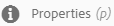

   Alternatively, choose the **[!UICONTROL Properties]** quick action on the asset card.

   

1. In the **[!UICONTROL Properties]** page, edit the metadata properties under various tabs. For example, under the **[!UICONTROL Basic]** tab, edit the title, description, and so on.

    The layout of the **[!UICONTROL Properties]** page and the metadata properties available depend on the underlying metadata schema. To learn how to modify the layout of the **[!UICONTROL Properties]** page, see [Metadata Schemas](metadata-schemas.md).

1. To schedule a particular date/time for the activation of the asset, use the date picker beside the **[!UICONTROL On Time]** field.

   

1. To deactivate the asset after a particular duration, choose the deactivation date and time from the date picker beside the **[!UICONTROL Off Time]** field.

   The deactivation date should be later than the activation date for an asset.

   

   After the Off time is reached, the asset and its renditions are no longer available in the Assets UI.

   

1. In the **[!UICONTROL Tags]** field, select one or more tags. To add a custom tag, type the name of the tag in the box and press **[!UICONTROL Enter]**. The new tag is saved in AEM.

   YouTube requires tags to publish and have a link to YouTube (if a suitable link can be found).

   
   To be able to create tags, you require write permission for `/content/cq:tags/default` in the CRX repository.

1. To provide a rating to the asset, tap the **[!UICONTROL Advanced]** tab and then tap the star at the appropriate position to assign the desired rating. 

   

   The rating score that you assign to the asset is displayed under **[!UICONTROL Your Ratings]**. The average rating score that the asset received from users who rated the asset is displayed under **[!UICONTROL Rating]**. In addition, the breakup of the rating scores that contribute to the average rating score is displayed under **[!UICONTROL Rating Breakdown]**. You can search assets based on average rating scores.

1. To view usage usage statistics for the asset, tap the **[!UICONTROL Insights]** tab.

   Usage statistics include the following:

    * Number of times the asset was viewed or downloaded.
    * Channels/devices through which the asset was used.
    * Creative solutions where the asset was recently used.

   For more details, see [Asset Insights](touch-ui-asset-insights.md).

1. Tap **[!UICONTROL Save & Close]**.
1. Navigate to the Assets UI. The edited metadata properties, including title, description, ratings, and so on are displayed on the asset card in **[!UICONTROL Card]** view and under relevant columns in the **[!UICONTROL List]** view.

## Copying assets {#copying-assets}

When you copy an asset or a folder, the entire asset or the folder is copied, along with its content structure. A copied asset or a folder is duplicated at the target location. The asset at the source location is not alterted.

A few attributes that are unique to a particular copy of an asset are not carried forward. Some examples are:

* Relative path, asset ID, creation date and time, and versions and version history. Some of these properties are indicated by the properties `dam:relativePath`, `jcr:uuid`, `jcr:created`, and `cq:name`.

* Creation time and referenced paths are unique for each asset and each of its rendition.

The other properties and metadata information is retained. A partial copy is not created when copying an asset.

1. From the Assets UI, select one or more assets, and then tap the **[!UICONTROL Copy]** icon from the toolbar. Alternatively, choose the **[!UICONTROL Copy]** quick action from the asset card.

   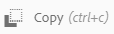

   >[!NOTE]
   >
   >If you use the **[!UICONTROL Copy]** quick action, you can only copy one asset at a time.

1. Navigate to the location where you want to copy the assets.

   >[!NOTE]
   >
   >If you copy an asset at the same location, AEM automatically generates a variation of the name. For example, if you copy an asset titled Square, AEM automatically generates the title for its copy as Square1.

1. Tap the **[!UICONTROL Paste]** asset icon from the toolbar:

   

   The assets are copied to this location.

   >[!NOTE]
   >
   >The **[!UICONTROL Paste]** icon is available in the toolbar until the paste operation is completed.

### Moving or renaming assets {#moving-or-renaming-assets}

1. Navigate to the location of the asset you want to move.  

1. Select the asset, and tap the **[!UICONTROL Move[** icon from the toolbar.

   

1. In the **[!UICONTROL Move Assets]** wizard, do one of the following:

    * Specify the name for the asset after it is moved. Then tap **[!UICONTROL Next]** to proceed.
    * Tap **[!UICONTROL Cancel]** to stop the process.

   >[!NOTE]
   >
   >You can specify the same name for the asset if there is no asset with that name at the new location. However, you should use a different name if you move the asset to a location where an asset with the same name exists. If you use the same name, the system automatically generates a variation of the name. For example if your asset has the name Square, the system generates the name Square1 for its copy.

   >[!NOTE]
   >
   >The following (space-separated list of) characters are not supported:
   >* asset file name must not contain  `* / : [ \ \ ] | # % { } ? &`
   >* asset folder name must not contain  `* / : [ \ \ ] | # % { } ? \" . ^ ; + & \t`

1. On the **[!UICONTROL Select Destination]** page, do one of the following:

    * Navigate to the new location for the assets, and then tap **[!UICONTROL Next]** to proceed. 
    * Tap **[!UICONTROL Back]** to return to the **[!UICONTROL Rename]** page.

1. If the assets being moved have any referencing pages, assets, or collections, the **[!UICONTROL Adjust References]** tab appears beside the **[!UICONTROL Select Destination]** tab.

   Do one of the following on the **[!UICONTROL Adjust References]** page:

    * Specify the references to be adjusted based on the new details, and then tap **[!UICONTROL Move]** to proceed. 
    * From the **[!UICONTROL Adjust]** column, select or deselect references to the assets. 
    * Tap **[!UICONTROL Back]** to return to the **[!UICONTROL Select Destination]** page.
    * Tap **[!UICONTROL Cancel]** to stop the move operation.

   If you do not update references, they continue to point to the previous path of the asset. If you adjust the references, they are updated to the new asset path.

### Managing renditions {#managing-renditions}

1. You can add or remove renditions for an asset, except the original. Navigate to the location of the asset for which you want to add or remove renditions.  

1. Tap the asset to open its asset page.

   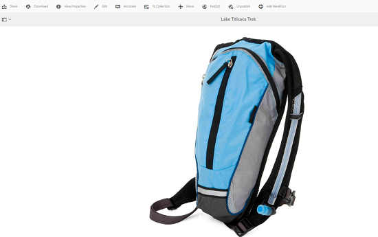

1. Tap the **[!UICONTROL Global Navigation]** icon, and select **[!UICONTROL Renditions]** from the list.

   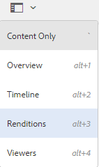

1. In the **[!UICONTROL Renditions]** panel, view the list of renditions generated for the asset.

   

   >[!NOTE]
   >
   >By default, AEM Assets does not display the original rendition of the asset in the preview mode. If you are an administrator, you can use overlays to configure AEM Assets to display original renditions in the preview mode.

1. Select a rendition to either view or delete the rendition.

   **Deleting a rendition**

   Select a rendition from the **[!UICONTROL Renditions]** panel, and then tap the **[!UICONTROL Delete Rendition]** icon from the [toolbar](/help/sites-authoring/basic-handling.md).

   

   **Uploading a new rendition**

   Navigate to the asset details page for the asset, and tap the **[!UICONTROL Add Rendition]** icon in the toolbar to upload a new rendition for the asset. 

   

   >[!NOTE]
   >
   >If you select a rendition from the **[!UICONTROL Renditions]** panel, the toolbar changes context and displays only those actions that are relevant to the rendition. Options, such as the **[!UICONTROL Upload Rendition]** icon is not displayed. To view these options in the toolbar, navigate to the details page for the asset.

   You can configure the dimensions for the rendition you want displayed in the details page of an image or video asset. Based on the dimensions you specify, AEM Assets displays the rendition with the exact or closest dimensions.

   To configure rendition dimensions of an image at the asset detail level, overlay the **[!UICONTROL renditionpicker]** node `libs/dam/gui/content/assets/assetpage/jcr:content/body/content/content/items/assetdetail/items/col1/items/assetview/renditionpicker` and configure the value of the width property. Configure the property **[!UICONTROL size (Long) in KB]** in place of width to customize rendition on asset detail page based on image size. For size-based customization, the property **[!UICONTROL preferOriginal]** assigns preference to the original if the size of the matched rendition is greater than the original.

   Similarly, you can customize the **[!UICONTROL Annotation]** page image by overlaying `libs/dam/gui/content/assets/annotate/jcr:content/body/content/content/items/content/renditionpicker`.

   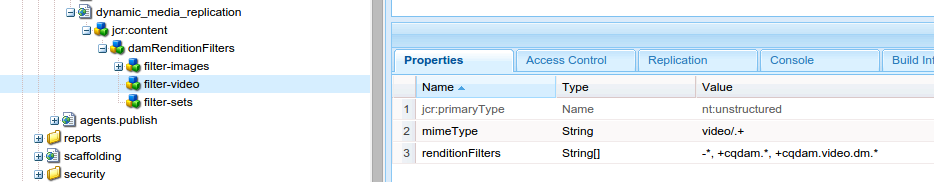

   To configure rendition dimensions for a video asset, navigate to the **[!UICONTROL videopicker]** node in the CRX repository at the location `/libs/dam/gui/content/assets/assetpage/jcr:content/body/content/content/items/assetdetail/items/col1/items/assetview/videopicker`, overlay the node, and then edit the appropriate property.

   >[!NOTE]
   >
   >Video annotations are supported only on browsers with HTML5 compatible video formats. In addition, depending on the browser, different video formats are supported.

### Viewing subassets {#viewing-subassets}

In AEM, subassets can be generated for assets with supported multi-page formats such as PDF, AI, Powerpoint/Apple Keynote, and InDesign. These subassets are like normal assets, but are linked to their parent asset and facilitate multi-page view in the Touch UI.

Subasset generation is disabled by default. To enable subasset generation, add the **[!UICONTROL Create Sub Asset]** step to the **[!UICONTROL DAM Update Asset]** workflow.

For Word documents, the DAM Parse Word Documents workflow generates a `cq:Page` component from the contents of the Word document. The images extracted from the document are referenced from the `cq:Page` component. These images are extracted even if subasset generation is disabled.

**To view subassets**:

1. Navigate to the location of the asset and open its asset page.  

1. Tap the **[!UICONTROL Global Navigation]** icon, and choose **[!UICONTROL Subassets]** from the list 

   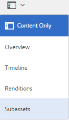

   >[!NOTE]
   >
   >The **[!UICONTROL Subassets]** option is displayed only if subassets are available or have been generated for the asset.

   When you select **[!UICONTROL Subassets]** from the list, the **[!UICONTROL subassets]** page displays the subassets linked to the parent asset.

   

## Deleting assets {#deleting-assets}

To resolve or remove the incoming references from other pages, update the relevant references before deleting an asset.

Also, disable the force delete button using an overlay, to disallow users from deleting referenced assets and leaving broken links.

You require delete permissions on dam/asset to be able to delete an asset. If you only have modify permissions, you can only edit the asset metadata and add annotations to the asset. However, you cannot delete the asset or its metadata.

**To delete assets**:

1. Navigate to the location of the assets you want to delete.  

1. Select the asset, and tap the **[!UICONTROL Delete]** icon from the toolbar.

   

1. In the confirmation dialog box, tap:

    * **[!UICONTROL Cancel]** to stop the action
    * **[!UICONTROL Delete]** to confirm the action based on the following:

        * If the asset has no references, the asset is deleted.
        * If the asset has references, an error-message informs you that **[!UICONTROL One or more assets are referenced]**. You can select **[!UICONTROL Force Delete]** or **[!UICONTROL Cancel]**.

   >[!NOTE]
   >
   >To resolve or remove the incoming references from other pages, update the relevant references before deleting an asset.
   >
   >Also, disable the **[!UICONTROL Force Delete]** button using an overlay, to disallow users from deleting referenced assets and leaving broken links.

## Downloading assets {#downloading-assets}

See [Download assets from AEM](download-assets-from-aem.md)

## Publishing assets {#publishing-assets}

If you publish an assets that is being processed, only the original content is published. The renditions are missing. Either wait for processing to complete and then publish or re-publish the asset after the processing is completed.

If the folder you want to publish includes an empty folder, the empty folder is not published.

For more information specific to Dynamic Media, see [Publishing Dynamic Media Assets](publishing-dynamicmedia-assets.md).

**To publish assets**:

1. Navigate to the location of the assets/folder you want to publish  

1. Either select the **[!UICONTROL Publish]** quick action from the asset card, or select the asset and tap the **[!UICONTROL Quick Publish]** icon from the toolbar.
1. If the asset references other assets, its references are listed in the wizard. Only references that are either unpublished or modified since they were last published or unpublished are displayed. Choose the references you want to publish.

   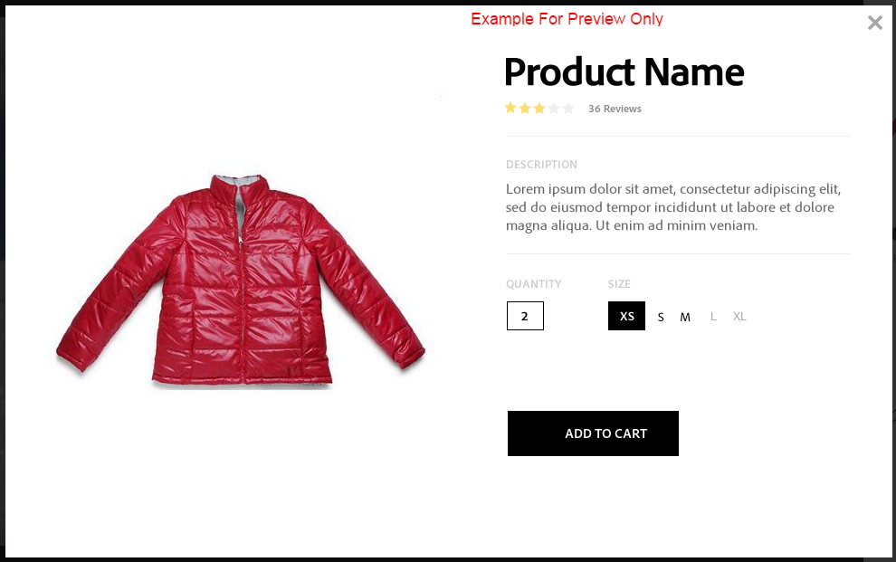

1. Tap **[!UICONTROL Publish]** to confirm the activation for the assets.

## Unpublishing assets {#unpublishing-assets}

While unpublishing a complex asset, unpublish the asset only. Avoid unpublishing the references because they may be referenced by other published assets.

**To unpublish assets**:

1. Navigate to the location of the asset or asset folder you want to remove from the publish environment (unpublish).  

1. Select the asset or folder to unpublish, and tap the **[!UICONTROL Manage Publication]** icon from the toolbar.

   

1. Select the **[!UICONTROL Unpublish]** action from the list.

   

1. To unpublish the asset later, select **[!UICONTROL Unpublish Later]**, and then select a date for unpublishing the asset.
1. Schedule a date for the asset to be unavailable from the publish environment.
1. If the asset references other assets, choose the references you want to unpublish. Tap **[!UICONTROL Unpublish]**.
1. In the confirmation dialog box, do one of the following:

    * Tap **[!UICONTROL Cancel]** to stop the action
    * Tap **[!UICONTROL Unpublish]** to confirm that the assets are unpublished (no longer available on the publish environment) at the specified date.

## Creating a Closed User Group {#closed-user-group}

A CUG (Closed User Group) is used to limit access to specific asset folders published from AEM. If you create a CUG for a folder, access to the folder (including folder assets and subfolders) is restricted to assigned members or groups only. To access the folder, they must log in using their security credentials.

CUGs are an extra way to restrict access to your assets. You can also configure a login page for the folder.

**To create a closed user group**:

1. Select a folder from the Assets UI, and tap the **[!UICONTROL Properties]** icon from the toolbar to display the properties page.
1. From the **[!UICONTROL Permissions]** tab, add members or groups under **[!UICONTROL Closed User Group]**.

   

1. To display a login screen when users access the folder, select the **[!UICONTROL Enable]** option. Then, select the path to a login page in AEM, and save the changes.

   

   If you do not specify the path to a login page, AEM displays the default login page in the publish instance.

1. Publish the folder, and then try accessing it from the publish instance. A login screen is displayed.
1. If you are a CUG member, enter your security credentials. The folder is displayed after AEM authenticates you.

## Searching assets {#searching-assets}

Basic search is detailed in the [Search and filter](/help/sites-authoring/search.md#search-and-filter) section. Use the **[!UICONTROL Search]** panel to search for assets, tags, and metadata. You can search parts of a string using the wildcard asterisk. In addition, you can customize the **[!UICONTROL Search]** panel using [Search facets](search-facets.md). 

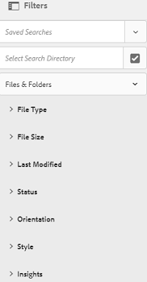

For recently uploaded assets, their metadata (including titles, tags, and so on) is not immediately available in the list of suggestions that appear when you type in the Omni Search box.

This is because AEM Assets waits until the expiry of a timeout period (1 hour by default) before running a background job to index the metadata for all newly uploaded/updated assets and adding them to the list of suggestions.

## Using Quick Actions {#quick-actions}

Quick action icons are available for a single asset at a time. Depending upon your device, perform the following actions to display the quick action icons:

* Touch devices: Touch and hold. For example, on an iPad, you can tap-and-hold an asset so that the quick actions display.
* Non-touch devices: Hover pointer. For example, On a desktop device, the quick action bar is displayed if you hover the pointer over the asset thumbnail.

### Navigating and selecting assets {#navigating-and-selecting-assets}

You can view, navigate through, and select assets with any of the available views (**[!UICONTROL Card]**, **[!UICONTROL Column]**, and **[!UICONTROL List]**) using the **[!UICONTROL Select]** icon. The **[!UICONTROL Select]** icon appears as a quick action in the **[!UICONTROL Card]** view.

In **[!UICONTROL List]** view, the **[!UICONTROL Select]** icon appears when you hover the mouse icon over the thumbnail before the names of the assets/folder in the list.

Similar to **[!UICONTROL List]** view, the **[!UICONTROL Select]** icon appears when you hover the mouse icon over the thumbnail before the names of the assets or folder in **[!UICONTROL Column]** view.

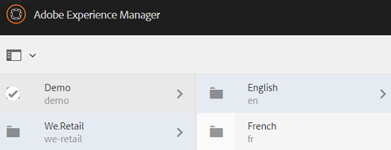

For more information, see [Viewing and Selecting your Resources](/help/sites-authoring/basic-handling.md#viewing-and-selecting-resources).

## Editing images {#editing-images}

The editing tools in the AEM Assets interface let you perform small editing jobs on image assets. You can crop, rotate, flip, and perform other editing jobs on images. You can also add image maps to assets.

Image editing is supported for files that have the following formats:

* BMP
* GIF
* PNG
* JPEG

For some components, **[!UICONTROL Full Screen]** mode has additional options available.

To edit a TXT file, set **[!UICONTROL Day CQ Link Externalizer]** from within Configuration Manager.

You can also add image maps using the image editor. For details, see [Adding Image Maps](image-maps.md).

**To edit images**:

1. Do one of the following to open an asset in edit mode:

    * Select the asset and then click the **[!UICONTROL Edit]** icon in the toolbar.
    * Tap the **[!UICONTROL Edit]** icon that appears on an asset in the **[!UICONTROL Card]** view.
    * In the asset page, tap the **[!UICONTROL Edit]** icon in the toolbar.

   

1. To crop the image, tap the **[!UICONTROL Crop]** icon.

   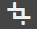

1. Select the desired option from the list. The crop area appears on the image based on the option you choose. The **[!UICONTROL Free Hand]** option lets you crop the image without any aspect ratio restrictions.

   

1. Select the area to crop, and resize or reposition it on the image.
1. Use the **[!UICONTROL Finish]** icon (top right corner) to crop the image. Tapping the **[!UICONTROL Finish]** icon also triggers the regeneration of renditions.

   

1. Use the **[!UICONTROL Undo]** and **[!UICONTROL Redo]** icons on the top right to revert to the uncropped image or retain the cropped image, respectively.

   

1. Tap the appropriate **[!UICONTROL Rotate]** icon to rotate the image clockwise or anti-clockwise.

   

1. Tap the appropriate **[!UICONTROL Flip]** icon to flip the image horizontally or vertically.

   

1. Tap the **[!UICONTROL Finish]** icon to save the changes.

   

## Using the Timeline {#timeline}

The **[!UICONTROL Timeline]** lets you view various events for a selected item, such as active workflows for an asset, comments, annotations, activity logs, and versions.

In the [Collections console](managing-collections-touch-ui.md#navigating-the-collections-console), the **[!UICONTROL Show All]** list provides options to view comments and workflows only. Moreover, the timeline is displayed only for top-level collections that are listed in the console. It is not displayed if you navigate inside any of the collections.

**[!UICONTROL Timeline]** contains several [options specific to Content Fragments](content-fragments-managing.md#timeline-for-content-fragments); this functionality requires [AEM 6.4 Service Pack 2 (6.4.2.0)](/help/release-notes/sp-release-notes.md) or later.

**To use Timeline**:

1. Open the asset page for an asset, or select it in the Assets UI.
1. Tap the **[!UICONTROL Global Navigation]** icon, and choose **Timeline]** from the list.

   

1. In the list that appears, use the **[!UICONTROL Show All]** list to filter the results based on comments, versions, workflows, and activities.

   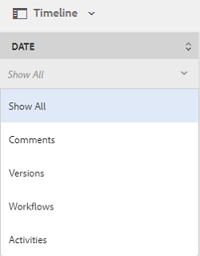

## Adding annotations {#annotating}

Annotations are comments or explanatory notes added to images or videos. Annotations provide marketers the ability to collaborate and leave feedback about assets.

Video annotations are only supported on browsers with HTML5-compatible video formats. Video formats that AEM Assets supports depend on the browser.

For Content Fragments, [annotations are created in the editor](content-fragments-variations.md#annotating-a-content-fragment); this functionality requires [AEM 6.4 Service Pack 2 (6.4.2.0)](/help/release-notes/sp-release-notes.md) or later.

You can add multiple annotations, before you save them.

You can add annotations to video assets. While annotating videos, the player pauses to let you annotate on a frame. For details, see [managing video assets](managing-video-assets.md).

You can also add annotations to a collection. However, if a collection contains child collections, you can add annotations or comments to the parent collection only. The **[!UICONTROL Annotate]** option is not available for child collections.

**To add annotations**:

1. Navigate to the location of the asset to which you want to add annotations.
1. Tap the **[!UICONTROL Annotate]** icon from one of the following:

    * [Quick actions](managing-assets-touch-ui.md#quick-actions)
    * From the toolbar after selecting the asset or navigating to the asset page

   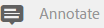

1. Add a comment in the **[!UICONTROL Comment]** box at the bottom of the timeline. Alternatively, mark up an area on the image and add an annotation in the **[!UICONTROL Add Annotation]** dialog box.

   

1. To notify a user about an annotation, specify the email address of the user and add the comment. For example, to notify Aaron McDonald about an annotation, enter @aa. Hints for all matching users is displayed in a list. Select Aaron's email address from the list to tag him with the comment. Similarly, you can tag more users anywhere within the annotation or before or after it.

   >[!NOTE]
   >
   >For a non-administrator user, suggestions appear only if the user has Read permissions at `/home` in CRXDE.

   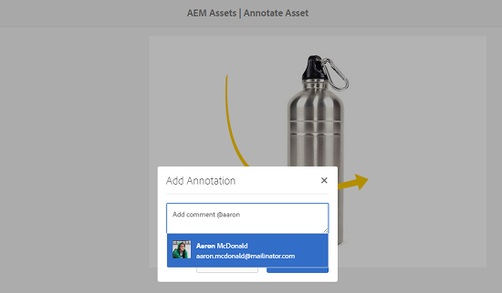

1. After adding the annotation, tap **[!UICONTROL Add]** to save it. A notification for the annotation is sent to Aaron.

   

1. Tap **[!UICONTROL Close]** to exit **[!UICONTROL Annotation]** mode.
1. To view the notification, log in to AEM Assets with Aaron MacDonald's credentials and tap the **[!UICONTROL Notifications]** icon to view the notification.

1. To choose a different color so you can differentiate between users, tap the **[!UICONTROL Profile]** icon and tap **[!UICONTROL My Preferences]**.

   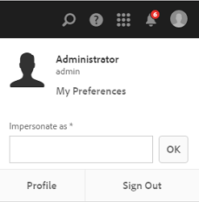

1. Specify the desired color in the **[!UICONTROL Annotation Color]** box, then tap **[!UICONTROL Accept]**.

   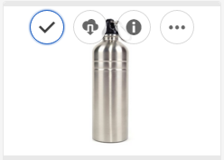

### Viewing saved annotations {#viewing-saved-annotations}

1. To view saved annotations for an asset, navigate to the location of the asset and open the asset page for the asset.  

1. Tap the **[!UICONTROL Global Navigation]** icon, and tap **[!UICONTROL Timeline]** from the list.

   

1. From the **[!UICONTROL Show All]** list in the timeline, select **[!UICONTROL Comments]** to filter the results based on annotations.

   

1. Tap a comment in the **[!UICONTROL Timeline]** panel to view the corresponding annotation on the image.

   

1. Tap **[!UICONTROL Delete]** to remove a particular comment.

### Printing annotations {#printing-annotations}

If an asset has annotations or it has been subjected to a review workflow, you can print the asset along with annotations and review status as a PDF file for offline review.

You can also choose to print only the annotations or review status.

Lengthy annotations may not render properly in the PDF file. For optimal rendering, Adobe recommends that you limit annotations to 50 words.

To print the annotations and review status, tap the **[!UICONTROL Print]** icon and follow the instructions in the wizard. The **[!UICONTROL Print]** icon appears in the toolbar only when the asset has at least one annotation or review status assigned to it.

1. From the Assets UI, open the preview page for an asset.
1. Do one of the following:

    * To print all the annotations and the review status, go to step 4.
    * To print specific annotations and review status, open the [Timeline](managing-assets-touch-ui.md#timeline) and then proceed to step 3.

1. To print specific annotations, select the annotations from the **[!UICONTROL Timeline]**.

   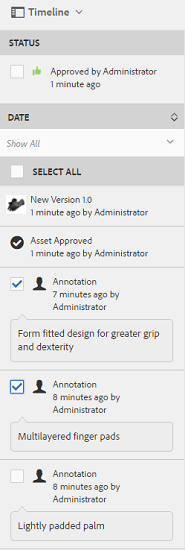

   To print the review status only, select it from the **[!UICONTROL Timeline]**.

   

1. On the toolbar, tap the **[!UICONTROL Print]** icon.

   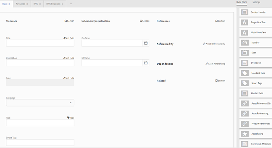

1. From the **Print** dialog box, choose the position you want the annotations or review status to display on the PDF. For example, if you want the annotations or status to print at the top-right of the page that contains the printed image, use the **[!UICONTROL Top-Left]** (default) setting.

   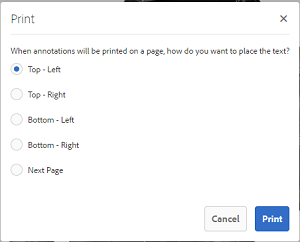

   You can choose other settings depending on the position where you want the annotations or status to appear in the printed PDF. If you want the annotations or status to appear in a page that is separate from the printed asset, choose **[!UICONTROL Next Page]**.

1. Tap **[!UICONTROL Print]**. Depending on the option you choose in step 2, the generated PDF displays the annotations or status at the specified position. For example, if you choose to print both annotations and the review status using the **[!UICONTROL Top-Left]** setting, the generated output resembles the PDF file depicted here.

   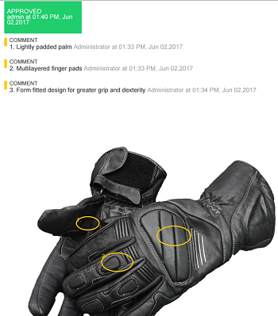

1. Download or print the PDF using the options at the top-right.

   

   >[!NOTE]
   >
   >If the asset has subassets, you can print all the subassets along with their specific page-wise annotations.

   To modify the appearance of the rendered PDF file, for example the font color, size, and style, background color of the comments and statuses, open the **[!UICONTROL Annotation PDF configuration]** from **[!UICONTROL Configuration Manager]**, and modify the desired options. For example, to change the display color of the approved status, modify the color code in the corresponding field. For information around changing the font color of annotations, see [Annotating](managing-assets-touch-ui.md#annotating).

   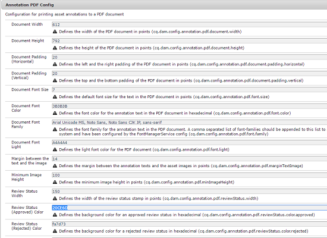

   Return to the rendered PDF file and refresh it. The refreshed PDF reflects the changes you made.

**To print annotations in foreign languages**:
If an asset includes annotations in foreign languages (especially non-latin languages), you must first configure CQ-DAM-Handler-Gibson Font Manager Service on the AEM server to be able to print these annotations. When configuring CQ-DAM-Handler-Gibson Font Manager Service, provide the path where fonts for the desired languages are located.

1. Open the **[!UICONTROL CQ-DAM-Handler-Gibson Font Manager Service]** configuration page from the URL [https://&lt;server&gt;:&lt;port&gt;/system/console/configMgr/com.day.cq.dam.handler.gibson.fontmanager.impl.FontManagerServiceImpl](http://localhost:4502/system/console/configMgr/com.day.cq.dam.handler.gibson.fontmanager.impl.FontManagerServiceImpl).
1. To configure **[!UICONTROL CQ-DAM-Handler-Gibson Font Manager Service]**, do one of the following:

    * In the **[!UICONTROL System Fonts]** directory option, specify the complete path to the fonts directory on your system. For example, if you're a Mac user, you can specify the path as `/Library/Fonts` in the **[!UICONTROL System Fonts]** directory option. AEM fetches the fonts from this directory.
    * Create a directory named **fonts** inside the **[!UICONTROL crx-quickstart]** folder. **[!UICONTROL CQ-DAM-Handler-Gibson Font Manager Service]** automatically fetches the fonts at the location `crx-quickstart/fonts`. You can override this default path from within the **[!UICONTROL Adobe Server Fonts]** directory option.
    * Create a new folder for fonts in your system, and store the desired fonts in the folder. Then, specify the complete path to that folder in the **[!UICONTROL Customer Fonts]** directory option.

1. Access the **[!UICONTROL Annotation PDF]** configuration from the URL [https://&lt;server&gt;:&lt;port&gt;/system/console/configMgr/com.day.cq.dam.core.impl.annotation.pdf.AnnotationPdfConfig](http://localhost:4502/system/console/configMgr/com.day.cq.dam.core.impl.annotation.pdf.AnnotationPdfConfig).
1. Configure the **[!UICONTROL Annotation PDF]** with the correct set of font-family as follows:

    * Include the string `<font_family_name_of_custom_font, sans-serif>` within the font-family option. For example, if you want to print annotations in CJK (Chinese, Japanese and Korean), include the string `Arial Unicode MS, Noto Sans, Noto Sans CJK JP, sans-serif` in the font-family option. If you want to print annotations in Hindi, download the appropriate font and configure the font-family as Arial Unicode MS, Noto Sans, Noto Sans CJK JP, Noto Sans Devanagari, sans-serif.

1. Restart the AEM instance.

The following is an example of how you configure AEM to print annotations in CJK (Chinese, Japanese and Korean):

1. Download Google Noto CJK fonts from the following links, and store them in the font directory configured in Font Manager Service.

    * All In One Super CJK font: [https://www.google.com/get/noto/help/cjk/](https://www.google.com/get/noto/help/cjk/)
    * Noto Sans (for European languages): [https://www.google.com/get/noto/](https://www.google.com/get/noto/)
    * Noto fonts for a language of your choice: [https://www.google.com/get/noto/](https://www.google.com/get/noto/)

1. Configure the annotation PDF file by setting the font-family parameter to `Arial Unicode MS, Noto Sans, Noto Sans CJK JP, sans-serif`. This configuration is available by default and works for all European and CJK languages.
1. If the language of your choice is different from the languages mentioned in step 2, append an appropriate (comma separated) entry to the default font-family.

## Creating asset versioning {#asset-versioning}

Versioning creates a snapshot of digital assets at a specific point in time. Versioning helps restore assets to a previous state at a later time. For example, if you want to undo a change that you made to an asset, restore the unedited version of the asset.

The following are scenarios where you create versions:

* You modify an image in a different application and upload to AEM Assets. A version of the image is created so your original image is not overwritten.
* You edit the metadata of an asset.
* You use AEM desktop app to checkout an existing asset and save your changes. A new version is created everytime the asset is saved.

You can also enable automatic versioning through a workflow. When you create a version for an asset, the metadata and renditions are saved along with the version. Renditions are rendered alternatives of the same images, for example, a PNG rendition of an uploaded JPEG file.

The versioning functionality lets you do the following:

* Create a version of an asset.
* View the current revision for an asset.
* Restore the asset to a previous version.

**To create asset versioning**:

1. Navigate to the location of the asset for which you want to create a version, and tap it to open its asset page.  

1. Tap the **[!UICONTROL Global Navigation]** icon, and the choose **[!UICONTROL Timeline]** from the menu.

   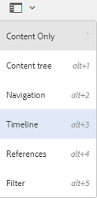

1. Tap the **[!UICONTROL Actions]** (arrow) icon at the bottom to view the available actions you can perform on the asset.

   

1. Tap **[!UICONTROL Save as Version]** to create a version for the asset.

   

1. Add a label and comment, and then tap **[!UICONTROL Create]** to create a version. Alternatively, tap **[!UICONTROL Cancel]** to exit the operation.

   

1. To view the new version, open the **[!UICONTROL Show All]** list in the timeline from the asset details page or the Assets UI, and choose **[!UICONTROL Versions]**.

   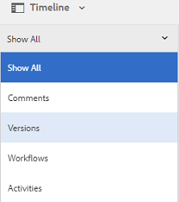

1. Select a specific version for the asset to preview it or enable it to appear in the Assets UI.

   

   >[!NOTE]
   >
   >You can also select the asset from the [List view](/help/sites-authoring/basic-handling.md#viewing-and-selecting-resources) or the [Column view](/help/sites-authoring/basic-handling.md#viewing-and-selecting-resources).

1. Add a label and comment for the version to revert to the particular version in the Assets UI.

   

1. To generate a preview for the version, tap **[!UICONTROL Preview Version]**.
1. To display this version in the Assets UI, select **[!UICONTROL Revert to this Version]**.
1. To compare between two versions, go to the asset page of the asset and tap the version you want to compare with the current version.

   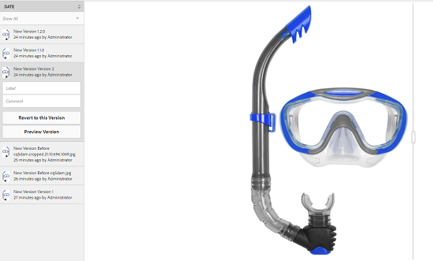

1. From the timeline, select the version you want to compare and drag the slider to the left to superimpose this version over the current version and compare.

   

### Starting a workflow on an asset {#starting-a-workflow-on-an-asset}

1. Navigate to the location of the asset for which you want to start a workflow, and tap the asset to open the asset page.
1. Tap the **[!UICONTROL Global Navigation]** icon, and the choose **[!UICONTROL Timeline]** from the menu to display the timeline.

   

1. Tap the **[!UICONTROL Actions]** (arrow) icon at the bottom to open the list of actions available for the asset.

   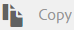

1. Tap **[!UICONTROL Start Workflow]** from the list.

   

1. In the **[!UICONTROL Start Workflow]** dialog box, select a workflow model from the list.

   

1. (Optional) Specify a title for the workflow, which can be used to reference the workflow instance.

   

1. Tap **[!UICONTROL Start]**, then tap **[!UICONTROL Proceed]** in the dialog box to confirm. Each step of workflow is displayed in the timeline as an event.

   

## About collections {#collections}

A collection is an ordered set of assets. Use collections to share assets between users.

* A collection can include assets from different locations because they only contain references to these assets. Each collection maintains the referential integrity of assets.
* You can share collections with multiple users with different privilege levels, including editing, viewing, and so on.

A user can have access to multiple collections. Collections are of the following types, based on the way they collate assets:

* A collection with a **static reference list** of assets, folders, and other collections.  

* A collection that uses a **search criteria** and dynamically populates assets based on the criteria. This is called a **Smart Collection**.

See [Managing Collections](managing-collections-touch-ui.md) for details on collection management.

>[!NOTE]
>
>You require appropriate access rights for your account to create or edit assets.

