# Managing Dynamic Media image presets{#managing-image-presets}

Image Presets enable Adobe Experience Manager Assets to dynamically deliver images at different sizes, in different formats, or with other image properties that are generated dynamically. Each Image Preset represents a predefined collection of sizing and formatting commands for displaying images. When you create an Image Preset, you choose a size for image delivery. You also choose formatting commands so that the appearance of the image is optimized when the image is delivered for viewing.

Administrators can create presets for exporting assets. Users can choose a preset when they export images, which also reformat images to the specifications that the administrator specifies.

You can also create image presets that are responsive. If you apply a responsive image preset to your assets, they change depending on the device or screen size they are viewed on. You can configure image presets to use CMYK in the color space in addition to RGB or Gray.

This section describes how to create, modify, and generally manage image presets. You can apply an image preset to an image anytime you preview it. See [Applying Image Presets](/help/assets/image-presets.md).

>[!NOTE]
>
>Smart imaging works with your existing image presets and uses intelligence at the last millisecond of delivery to further reduce image file size based on browser or network connection speed. See [Smart Imaging](/help/assets/imaging-faq.md) for more information.

## Understanding Dynamic Media image presets {#understanding-image-presets}

Like a macro, an Image Preset is a predefined collection of sizing and formatting commands saved under a name. To understand how Image Presets work, suppose that your web site requires each product image to appear in different sizes, different formats, and compression rates for desktop and mobile delivery.

>[!NOTE]
>
>In Dynamic Media - Scene7 mode, image presets are supported for image assets only.

You could create two image presets: one with 500 x 500 pixels for desktop version and 150 x 150 pixels for the mobile version. You create two Image Presets, one called `Enlarge` to display images at 500x500 pixels and one called `Thumbnail` to display images at 150 x 150 pixels. To deliver images at the `Enlarge` and `Thumbnail` size, Experience Manager looks up the definition of the Enlarge Image Preset and Thumbnail Image Preset. Then Experience Manager dynamically generates an image at the size and formatting specifications of each Image Preset.

Images that are reduced in size when they are delivered dynamically can lose sharpness and detail. For this reason, each Image Preset contains formatting controls for optimizing an image when it is delivered at a particular size. These controls make sure that your images are sharp and clear when they are delivered to your web site or application.

Administrators can create Image Presets. To create an image preset, you can start from scratch or you can start from an existing one and save it under a new name.

## Managing Dynamic Media image presets {#managing-image-presets-1}

You manage your image presets in Experience Manager by tapping or clicking the Experience Manager logo to access the global navigation console and then tapping or clicking the Tools icon and navigating to **[!UICONTROL Assets > Image Presets]**.

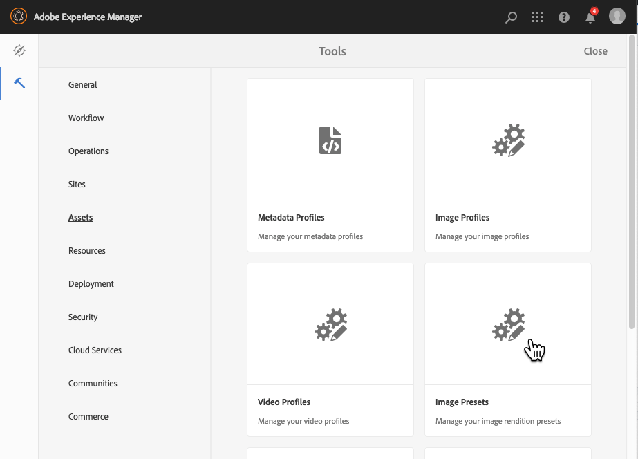

>[!NOTE]
>
>Any image presets you create are also available as dynamic renditions when you preview or deliver assets.
>
>In *Dynamic Media - Scene7 mode*, you do *not* need to publish image presets as image presets are automatically published.
>
>In *Dynamic Media - Hybrid mode*, you must manually publish image presets.
>
>See [Publishing Image Presets](#publishing-image-presets).

>[!NOTE]
>
>The system shows various renditions when you select **[!UICONTROL Renditions]** in an asset's Detail View. You can increase or decrease the number of image presets that display. See [Increasing the number of image presets that display](#increasing-or-decreasing-the-number-of-image-presets-that-display).

### Smart crops, Adobe Illustrator (AI), Postscript (EPS), and PDF file formats {#adobe-illustrator-ai-postscript-eps-and-pdf-file-formats}

>[!NOTE]
>
>This topic is applicable to Dynamic Media - Hybrid mode only.  

If you intend to support the ingestion of AI, EPS, and PDF files so that you can generate dynamic renditions of these file formats, review the following information before you create image presets.

Adobe Illustrator's file format is a variant of PDF. The main differences, in the context of Experience Manager Assets, is the following:

* Adobe Illustrator documents consist of a single page with multiple layers. Each layer is extracted as a PNG subasset under the main Illustrator asset.
* PDF documents consist of one or more pages. Each page is extracted as a single page PDF subasset under the main multi-page PDF document.

The subassets are created by the `Create Sub Asset process` component within the overall `DAM Update Asset` workflow. To see this process component within the workflow, select **[!UICONTROL Tools]** > **[!UICONTROL Workflow]** > **[!UICONTROL Models]** > **[!UICONTROL DAM Update Asset]** > **[!UICONTROL Edit]**.

See also [Viewing pages of a multi-page file](/help/assets/managing-linked-subassets.md#view-pages-of-a-multi-page-file).

You can view the subassets or the pages when you open the asset, select the Content menu, and select **[!UICONTROL Subassets]** or **[!UICONTROL Pages]**. The subassets are real assets. That is, PDF pages are extracted by the `Create Sub Asset` workflow component. They are then stored as `page1.pdf`, `page2.pdf`, and so on, below the main asset. After they are stored, the `DAM Update Asset` workflow processes them.

To use Dynamic Media to preview and generate dynamic renditions for AI, EPS or PDF files, the following processing steps are required:

1. In the `DAM Update Asset` workflow, the `Rasterize PDF/AI Image Preview Rendition` process component rasterizes the first page of the original asset--using the configured resolution--into a `cqdam.preview.png` rendition.

1. The `cqdam.preview.png` rendition is then optimized into a PTIFF by the `Dynamic Media Process Image Assets` process component within the workflow.

>[!NOTE]
>
>In the [!UICONTROL DAM Update Asset] workflow, the **[!UICONTROL EPS thumbnails]** step generates thumbnails for EPS files.

#### PDF/AI/EPS asset metadata properties {#pdf-ai-eps-asset-metadata-properties}

| **Metadata property** |**Description** |
|---|---|
| `dam:Physicalwidthininches` | Document width in inches. |
| `dam:Physicalheightininches` | Document height in inches. |

You access `Rasterize PDF/AI Image Preview Rendition` process component options by way of the `DAM Update Asset` workflow.

In the upper-left corner, select Adobe Experience Manager, navigate to **[!UICONTROL Tools]** > **[!UICONTROL Workflow]** > **[!UICONTROL Models]**. On the Workflow Models page, select **[!UICONTROL DAM Update Asset]**, then on the toolbar select **[!UICONTROL Edit]**. On the [!UICONTROL DAM Update Asset] workflow page, double-select the `Rasterize PDF/AI Image Preview Rendition` process component to open its Step Properties dialog box.

#### Rasterize PDF/AI Image Preview Rendition options {#rasterize-pdf-ai-image-preview-rendition-options}


Arguments to rasterize PDF or AI workflow

<table>
 <tbody>
  <tr>
   <td><strong>Process Argument</strong></td>
   <td><strong>Default setting</strong></td>
   <td><strong>Description</strong></td>
  </tr>
  <tr>
   <td>Mime Types</td>
   <td><p>application/pdf</p> <p>application/postscript</p> <p>application/illustrator<br /> </p> </td>
   <td>List of document mime-types that are considered to be PDF or Illustrator documents.<br /> </td>
  </tr>
  <tr>
   <td>Max Width</td>
   <td>2048</td>
   <td>Maximum width of the generated preview rendition, in pixels.<br /> </td>
  </tr>
  <tr>
   <td>Max Height</td>
   <td>2048</td>
   <td>Maximum height of the generated preview rendition, in pixels.<br /> </td>
  </tr>
  <tr>
   <td>Resolution</td>
   <td>72</td>
   <td>Resolution to rasterize the first page, in ppi (pixels per inch).</td>
  </tr>
 </tbody>
</table>

Using the default process arguments, the first page of a PDF/AI document is rasterized at 72 ppi and the generated preview image is sized at 2048 x 2048 pixels. For a typical deployment, you may want to increase the resolution to a minimum of 150 ppi or more. For example, a US letter size document at 300 ppi requires a maximum width and height of 2550 x 3300 pixels, respectively.

Max Width and Max Height limit the resolution at which to rasterize. For example, if the maximums are unchanged, and Resolution is set to 300 ppi, a US Letter document is rasterized at 186 ppi. That is, the document is 1581 x 2046 pixels.

The `Rasterize PDF/AI Image Preview Rendition` process component has a maximum defined to ensure that it does not create overly large images in memory. Such large images can overflow the memory provided to the JVM (Java&trade; Virtual Machine). Care must be taken to provide the JVM with enough memory to manage the configured number of parallel workflows, with each having the potential to create an image at the maximum configured size.

### InDesign (INDD) file format {#indesign-indd-file-format}

If you intend to support the ingestion of INDD files so that you can generate dynamic rendition of this file format, you may want to review the following information before you create image presets.

For InDesign files, sub assets are extracted only if the Adobe InDesign Server is integrated with Experience Manager. Referenced assets are linked based on their metadata. InDesign Server is not required for linking. However, the referenced assets must be present within Experience Manager before the InDesign files are processed for the links to be created between the InDesign files and the referenced assets.

See [Integrating Experience Manager Assets with InDesign Server](/help/assets/indesign.md).

The Media Extraction process component in the `DAM Update Asset` workflow runs several preconfigured Extend Scripts to process InDesign files.

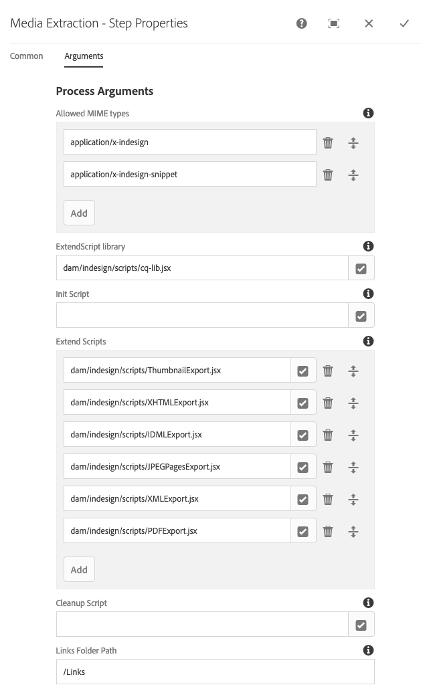

The ExtendScript paths in the arguments of Media Extraction process component in the [!UICONTROL DAM Update Asset] workflow.

The following scripts, are used by Dynamic Media integration:

<table>
 <tbody>
  <tr>
   <td><strong>ExtendScript name</strong></td>
   <td><strong>Default</strong></td>
   <td><strong>Description</strong></td>
  </tr>
  <tr>
   <td>ThumbnailExport.jsx</td>
   <td>Yes</td>
   <td>Generates a 300-ppi <code>thumbnail.jpg</code> rendition that is optimized and turned into a PTIFF rendition by <code>Dynamic Media Process Image Assets</code> process component.<br /> </td>
  </tr>
  <tr>
   <td>JPEGPagesExport.jsx</td>
   <td>Yes</td>
   <td>Generates a 300 PPI JPEG subasset for each page. The JPEG subasset is a real asset stored under the InDesign asset. It is also optimized and turned into a PTIFF by the <code>DAM Update Asset</code> workflow.<br /> </td>
  </tr>
  <tr>
   <td>PDFPagesExport.jsx</td>
   <td>No</td>
   <td>Generates a PDF subasset for each page. The PDF subasset gets processed as described earlier. Because the PDF contains a single page only, no subassets are generated.<br /> </td>
  </tr>
 </tbody>
</table>

## Configuring image thumbnail size {#configuring-image-thumbnail-size}

You can configure the size of thumbnails by configuring those settings in the **[!UICONTROL DAM Update Asset]** workflow. There are two steps in the workflow where you can configure the thumbnail size of image assets. Although (**[!UICONTROL Dynamic Media Process Image Assets]**) is used for dynamic image assets, and (**[!UICONTROL Process Thumbnails]**) is for static thumbnail generation, or when all other processes fail to generate thumbnails, *both* must have the same settings.

With the **[!UICONTROL Dynamic Media Process Image Assets]** step, thumbnails are generated by the image server, and this configuration is independent of the configuration applied to the **[!UICONTROL Process Thumbnails]** step. Generating thumbnails through the **[!UICONTROL Process Thumbnails]** step is the slowest and most memory intensive way to create thumbnails.

Thumbnail sizing is defined in the following format: **`width:height:center`**, for example, `80:80:false`. The width and height determine the size in pixels of the thumbnail. The center value is either false or true and if set to true, it indicates that the thumbnail image has exactly the size given in the configuration. If the resized image is smaller, it is centered within the thumbnail.

>[!NOTE]
>
>* Thumbnail sizes for EPS files are configured in the **[!UICONTROL EPS thumbnails]** step, in the **[!UICONTROL Arguments]** tab under Thumbnails.
>
>* Thumbnail sizes for videos are configured in the **[!UICONTROL FFmpeg thumbnails]** step, in the **[!UICONTROL Process]** tab under **[!UICONTROL Arguments]**.
>

**To configure image thumbnail size:**

1. Select **[!UICONTROL Tools]** > **[!UICONTROL Workflow]** > **[!UICONTROL Models]** > **[!UICONTROL DAM Update Asset]** > **[!UICONTROL Edit]**.
1. Select the **[!UICONTROL Dynamic Media Process Image Assets]** step and click the **[!UICONTROL Thumbnails]** tab. Change the thumbnail size, as needed, then select **[!UICONTROL OK]**.

   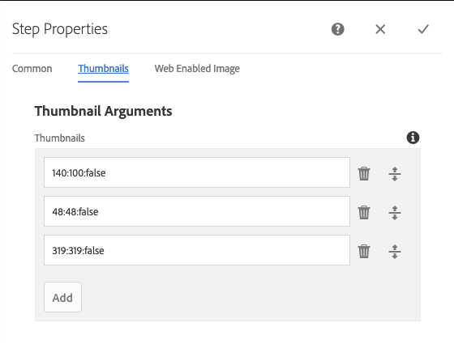

1. Select the **[!UICONTROL Process Thumbnails]** step, then select the **[!UICONTROL Thumbnails]** tab. Change the thumbnail size, as needed, then select **[!UICONTROL OK]**.

   >[!NOTE]
   >
   >The values in the thumbnails argument in the **[!UICONTROL Process Thumbnails]** step must match the thumbnails argument in the **[!UICONTROL Dynamic Media Process Image Assets]** step.

1. Select **[!UICONTROL Save]** to save the changes to the workflow.

### Increasing or decreasing the number of Dynamic Media image presets that display {#increasing-or-decreasing-the-number-of-image-presets-that-display}

Image presets you create are available as dynamic renditions when you preview assets. Experience Manager shows various dynamic renditions when viewing an asset from **[!UICONTROL Detail View > Renditions]**. You can increase or decrease the limit of renditions that are displayed.

**Increase or decrease the number of Dynamic Media image presets displayed:**

1. Navigate to CRXDE Lite ([https://localhost:4502/crx/de](https://localhost:4502/crx/de)).
1. Navigate to the image preset listing node at `/libs/dam/gui/coral/content/commons/sidepanels/imagepresetsdetail/imgagepresetslist`

   

1. In the **[!UICONTROL limit]** property, change the **[!UICONTROL Value]**, which is set to 15 by default, to the desired number.
1. Navigate to the image preset datasource at `/libs/dam/gui/coral/content/commons/sidepanels/imagepresetsdetail/imgagepresetslist/datasource`

   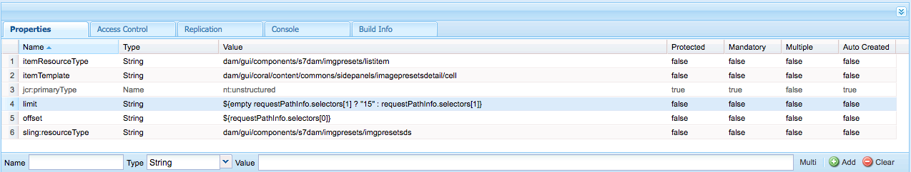

1. In the limit property, change the number to the desired number, for example, `{empty requestPathInfo.selectors[1] ? "20" : requestPathInfo.selectors[1]}`
1. Select **[!UICONTROL Save All]**.

## Creating a Dynamic Media image preset {#creating-image-presets}

Creating a Dynamic Media image preset lets you apply those settings to any images when previewing or publishing.

>[!NOTE]
>
>If using Internet Explorer 9, creating a preset does not appear in the preset list immediately after saving. To work around this issue, disable the cache for IE9.

If you intend to support the ingestion of AI, PDF, and EPS files so that you can generate dynamic rendition of these file formats, review the following information before you create image presets.
See [Adobe Illustrator (AI), Postscript (EPS), and PDF file formats](#adobe-illustrator-ai-postscript-eps-and-pdf-file-formats).

If you intend to support the ingestion of INDD files so that you can generate dynamic rendition of this file format, you may want to review the following information before you create image presets.
See [InDesign (INDD) file format](#indesign-indd-file-format).

>[!NOTE]
>
>To create Dynamic Media image presets, you must have administrator privileges as an Experience Manager administrator or Admin Console administrator.

**To create a Dynamic Media image preset:**

1. In Experience Manager, select the Experience Manager logo to access the global navigation console, then select **[!UICONTROL Tools]** > **[!UICONTROL Assets]** > **[!UICONTROL Image Presets]**.
1. Click **[!UICONTROL Create]**. The **[!UICONTROL Edit Image Preset]** window opens.

   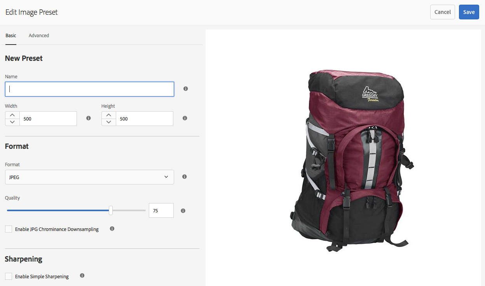

   >[!NOTE]
   >
   >To make this image preset responsive, erase the values in the **[!UICONTROL width]** and **[!UICONTROL height]** fields and leave them blank.

1. Enter values into the **[!UICONTROL Basic]** and **[!UICONTROL Advanced]** tabs as appropriate, including a name. The options are outlined in [Image Preset Options](#image-preset-options). Presets appear in the left pane and can be used on-the-fly with other assets.

   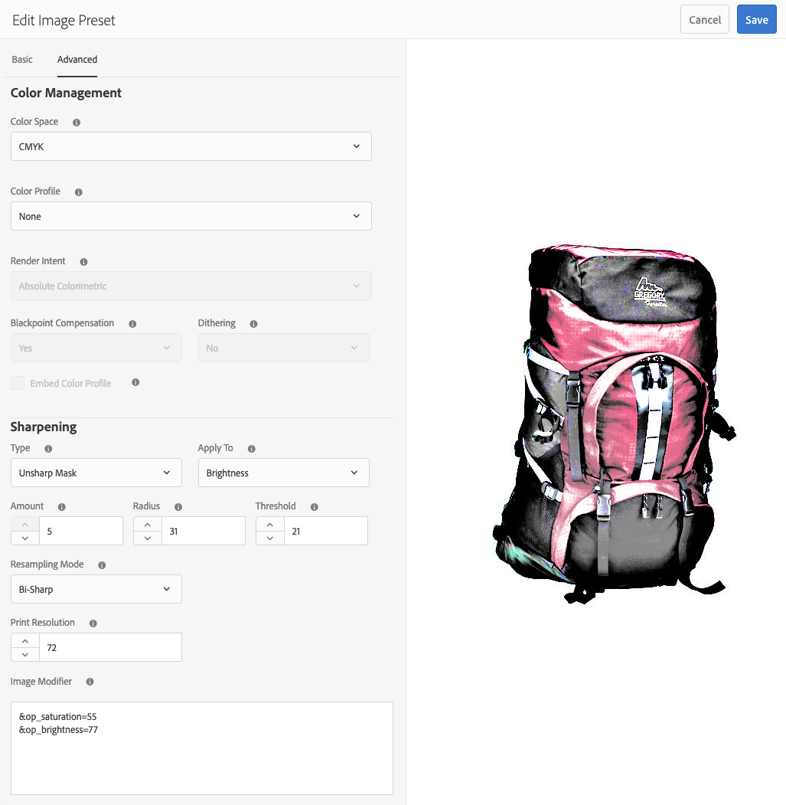

1. Click **[!UICONTROL Save]**.

## Creating a responsive image preset {#creating-a-responsive-image-preset}

To create a responsive image preset, perform the steps in [Creating Image Presets](#creating-image-presets). When entering the height and width in the **[!UICONTROL Edit Image Preset]** window, erase the values and leave them blank.

Leaving them blank tells Experience Manager that this image preset is responsive. You can adjust the other values as appropriate.


>[!NOTE]
>
>To see the **[!UICONTROL URL]** and **[!UICONTROL RESS]** buttons when applying an image preset to an asset, the asset must be published.
>
>
>
>In Dynamic Media - Scene7 mode, image presets and image assets are automatically published.
>
>In Dynamic Media - Hybrid mode, you must manually publish image presets and image assets.

### Image Preset options {#image-preset-options}

When you create or edit image presets, you have the options described in this section. In addition, Adobe recommends these "best practice" option choices to start:

* **[!UICONTROL Format]** (**[!UICONTROL Basic]** tab) - Select **[!UICONTROL JPEG]** or another format that meets your requirements. All web browsers support the JPEG image format; it offers a good balance between small files sizes and image quality. However, JPEG format images use a lossy compression scheme that can introduce unwanted image artifacts if the compression setting is too low. For that reason, Adobe recommends setting the compression quality to 75. This setting offers a good balance between image quality and small file size.

* **[!UICONTROL Enable Simple Sharpening]** - Do not select **[!UICONTROL Enable Simple Sharpening]** (this sharpening filter offers less control than Unsharp Masking settings).

* **[!UICONTROL Sharpening: Resampling Mode]** - Select **[!UICONTROL Sharp2]**.

#### Basic tab options {#basic-tab-options}

<table>
 <tbody>
  <tr>
   <td><strong>Field</strong></td>
   <td><strong>Description</strong></td>
  </tr>
  <tr>
   <td><strong>Name</strong></td>
   <td>Enter a descriptive name without any blank spaces. Include the image-size specification in the name so it helps users identify this Image Preset.</td>
  </tr>
  <tr>
   <td><strong>Width and Height</strong></td>
   <td>Enter in pixels the size at which the image is delivered. Width and height must be larger than 0 pixels. If either value is 0, then no preset is created. If both values are blank, a responsive image preset is created.</td>
  </tr>
  <tr>
   <td><strong>Format</strong></td>
   <td><p>Choose a format from the menu.</p> <p>Choosing <strong>JPEG</strong> offers the following additional options:</p>
    <ul>
     <li><strong>Quality</strong> - Controls the JPEG compression level. This setting affects both file size and image quality. The JPEG quality scale is 1-100. Scale is visible when you drag the slider.</li>
     <li><strong>Enable JPG Chrominance Downsampling</strong> - Because the eye is less sensitive to high-frequency color information than high-frequency luminance, JPEG images divide image information into luminance and color components. When a JPEG image is compressed, the luminance component is left at full resolution, while the color components are downsampled by averaging together groups of pixels. Downsampling reduces the data volume by one half or one third with almost no impact on perceived quality. Downsampling is not applicable to grayscale images. This technique reduces the amount of compression useful for images with high contrast (for example, images with overlaid text).</li>
    </ul>
    <div>
      Choosing
     <strong>GIF</strong> or
     <strong>GIF with alpha</strong> provides these additional
     <strong>GIF Color Quantization</strong> options:
    </div>
    <ul>
     <li><strong>Type </strong>- Select <strong>Adaptive</strong> (the default), <strong>Web</strong>, or <strong>Macintosh</strong>. If you select <strong>GIF with Alpha</strong>, the Macintosh option is not available.</li>
     <li><strong>Dither</strong> - Select <strong>Diffuse</strong> or <strong>Off</strong>.</li>
     <li><strong>Number of Colors </strong>- Enter a number from 2 through 256.</li>
     <li><strong>Color List</strong> - Enter a comma-separated list. For example, for white, gray, and black, enter <code>000000,888888,ffffff</code>.</li>
    </ul>
    <div>
      Choosing
     <strong>PDF</strong>,
     <strong>TIFF</strong>, or
     <strong>TIFF with alpha</strong> provides this additional option:
    </div>
    <ul>
     <li><strong>Compression</strong> - Select a compression algorithm. Algorithm options for PDF are <strong>None</strong>, <strong>Zip</strong>, and <strong>Jpeg</strong>; for TIFF the options are <strong>None</strong>, <strong>LZW</strong>, <strong>Jpeg</strong>, and <strong>Zip</strong>; and for TIFF with Alpha are <strong>None</strong>, <strong>LZW</strong>, and <strong>Zip</strong>.</li>
    </ul> <p>Choosing <strong>PNG</strong>, <strong>PNG with Alpha,</strong> or <strong>EPS</strong> provides no additional options.</p> </td>
  </tr>
  <tr>
   <td><strong>Sharpening</strong></td>
   <td>Select the <strong>Enable Simple Sharpening</strong> option to apply a basic sharpening filter to the image after all scaling takes place. Sharpening can help compensate for blurriness that can result when you display an image at a different size. </td>
  </tr>
 </tbody>
</table>

#### Advanced tab options {#advanced-tab-options}

<table>
 <tbody>
  <tr>
   <td><strong>Field</strong></td>
   <td><strong>Description</strong></td>
  </tr>
  <tr>
   <td><strong>Color Space</strong></td>
   <td>Select <strong>RGB, CMYK,</strong> or <strong>Grayscale</strong> for the color space.</td>
  </tr>
  <tr>
   <td><strong>Color Profile</strong></td>
   <td>Select the output color space profile that the asset should be converted to if it is different from the working profile.</td>
  </tr>
  <tr>
   <td><strong>Render Intent</strong></td>
   <td>You can override the default rendering intent. Rendering intents determine what happens to colors that cannot be reproduced in the target color profile (out of gamut). The Render Intent is ignored if it is not compatible with the ICC profile.
    <ul>
     <li>Select <strong>Perceptual</strong> to compress the total gamut from one color space into another color space when one or more colors in the original image is out of the gamut of the destination color space.</li>
     <li>Select <strong>Relative Colorimetric</strong> when a color in the current color space is out of gamut in the target color space. And, you want to map it to the closest possible color within the gamut of the target color space without affecting any other colors. </li>
     <li>Select <strong>Saturation</strong> if you want to reproduce the original image color saturation when converting into the target color space. </li>
     <li>Select <strong>Absolute Colorimetric</strong> to match colors exactly with no adjustment for white point or black point that would alter the image's brightness.</li>
    </ul> </td>
  </tr>
  <tr>
   <td><strong>Blackpoint Compensation</strong></td>
   <td>Select this option if the output profile supports this feature. Blackpoint compensation is ignored if it is not compatible with the specified ICC profile.</td>
  </tr>
  <tr>
   <td><strong>Dithering</strong></td>
   <td>Select this option to possibly avoid or reduce color banding artifacts. </td>
  </tr>
  <tr>
   <td><strong>Sharpening Type</strong></td>
   <td><p>Select <strong>None</strong>, <strong>Sharpen</strong>, or <strong>Unsharp Mask</strong>. </p>
    <ul>
     <li>Select <strong>None</strong> if you want to disable sharpening.</li>
     <li>Select <strong>Sharpen</strong> if you want to apply a basic sharpening filter to the image after all scaling takes place. Sharpening can help compensate for blurriness that can result when you display an image at a different size. </li>
     <li>Select<strong> Unsharp mask</strong> if you want to fine-tune a sharpening filter effect on the final downsampled image. You can control intensity of effect, radius of the effect (measured in pixels), and a threshold of contrast that is ignored. This effect uses the same options as Photoshop's "Unsharp Mask" filter.</li>
    </ul> <p>In <strong>Unsharp Mask</strong>, you have the following options:</p>
    <ul>
     <li><strong>Amount</strong> - Controls the amount of contrast applied to edge pixels. The default real number value is 1.0. For high-resolution images, you can increase it to as high as 5.0. Think of Amount as a measure of filter intensity.</li>
     <li><strong>Radius</strong> - Determines the number of pixels surrounding the edge pixels that affect the sharpening. For high-resolution images, enter a real number from 1 through 2. A low value sharpens only the edge pixels; a high value sharpens a wider band of pixels. The correct value depends on the size of the image.</li>
     <li><strong>Threshold</strong> - Determines the range of contrast to ignore when the unsharp mask filter is applied. In other words, this option determines how different the sharpened pixels must be from the surrounding area before they are considered edge pixels and are sharpened. To avoid introducing noise, experiment with integer values from 2 through 20. </li>
     <li><strong>Apply to</strong> - Determines whether the unsharpening applies to each color or brightness.</li>
    </ul>
    <div>
      Sharpening is described in
     <a href="https://experienceleague.adobe.com/docs/experience-manager-65/assets/sharpening_images.pdf">Sharpening Images</a>.
    </div> </td>
  </tr>
  <tr>
   <td><strong>Resampling Mode</strong></td>
   <td>Select a <strong>Resampling mode</strong> option. These options sharpen the image when it is downsampled:
    <ul>
     <li><strong>Bi-Linear</strong> - The fastest resampling method. Some aliasing artifacts are noticeable.</li>
     <li><strong>Bi-Cubic</strong> - Increases CPU usage but yields sharper images with less noticeable aliasing artifacts.</li>
     <li><strong>Sharp2</strong> - Can produce slightly sharper results than Bi-Cubic, but at an even higher CPU cost.</li>
     <li><strong>Bi-Sharp</strong> - Selects Photoshop default resampler for reducing image size, which is called <strong>bicubic sharper</strong> in Adobe Photoshop.</li>
     <li><strong>Each Color</strong> and <strong>Brightness</strong> - each method can be based on color or brightness. By default <strong>Each Color</strong> is selected.</li>
    </ul> </td>
  </tr>
  <tr>
   <td><strong>Print resolution</strong></td>
   <td>Select a resolution for printing this image; 72 pixels is the default.</td>
  </tr>
  <tr>
   <td><strong>Image Modifier</strong></td>
   <td><p>Beyond the common image settings available in the UI, Dynamic Media supports numerous advanced image modifications that you can specify in the <strong>Image Modifiers</strong> field. These parameters are defined in the <a href="https://experienceleague.adobe.com/docs/dynamic-media-developer-resources/image-serving-api/image-serving-api/http-protocol-reference/command-reference/c-command-reference.html#image-serving-api">Image Server Protocol command reference</a>.</p> <p>Important: The following functionality listed in the API is not supported:</p>
    <ul>
     <li>Basic templating and text rendering commands: <code>text= textAngle= textAttr= textFlowPath= textFlowXPath= textPath=</code> and <code>textPs=</code></li>
     <li>Localization commands: <code>locale=</code> and <code>req=xlate</code></li>
     <li><code>req=set</code> is not available for general usage.</li>
     <li><code>req=mbrset</code></li>
     <li><code>req=saveToFile</code></li>
     <li><code>req=targets</code></li>
     <li><code>template=</code></li>
     <li>Non-core Dynamic Media services: SVG, Image Rendering, and Web-to-Print</li>
    </ul> </td>
  </tr>
 </tbody>
</table>

## Defining image preset options with Image Modifiers {#defining-image-preset-options-with-image-modifiers}

In addition to the options available in the Basic and Advanced tabs, you can define image modifiers to give you more options when defining image presets. Image Rendering relies on the image rendering API that is defined in detail in the [HTTP Protocol Reference](https://experienceleague.adobe.com/docs/dynamic-media-developer-resources/image-serving-api/image-serving-api/http-protocol-reference/command-reference/c-command-reference.html#image-serving-api).

The following are some basic examples of what you can do with image modifiers.

>[!NOTE]
>
>Some image modifiers [cannot be used in Experience Manager](#advanced-tab-options).

* [op_invert](https://experienceleague.adobe.com/docs/dynamic-media-developer-resources/image-serving-api/image-serving-api/http-protocol-reference/command-reference/r-op-invert.html#image-serving-api) - Inverts each color component for a negative image effect.

  ```xml
  &op_invert=1
  ```

  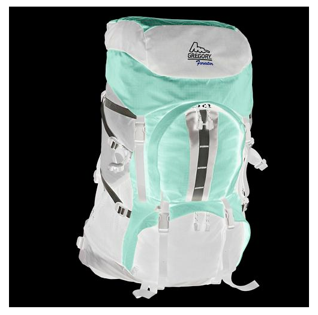

* [op_blur](https://experienceleague.adobe.com/docs/dynamic-media-developer-resources/image-serving-api/image-serving-api/http-protocol-reference/command-reference/r-op-blur.html#image-serving-api) - Applies a blur filter to the image.

  ```xml
  &op_blur=7
  ```

  

* Combined commands - op_blur and op-invert

  ```xml
  &op_invert=1&op_blur=7
  ```

  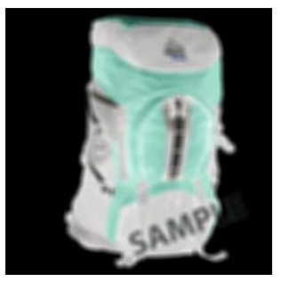

* [op_brightness](https://experienceleague.adobe.com/docs/dynamic-media-developer-resources/image-serving-api/image-serving-api/http-protocol-reference/command-reference/r-op-brightness.html#image-serving-api) - Decreases or increases the brightness.

  ```xml
  &op_brightness=58
  ```

  

* [opac](https://experienceleague.adobe.com/docs/dynamic-media-developer-resources/image-serving-api/image-serving-api/http-protocol-reference/command-reference/r-opac.html#image-serving-api) - Adjusts image opacity. Lets you decrease the foreground opacity.

  ```xml
  opac=29
  ```

  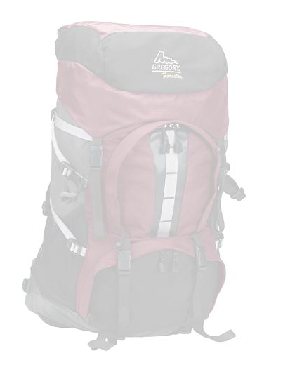

## Editing Image Presets {#modifying-image-presets}

1. In Experience Manager, select the Experience Manager logo to access the global navigation console, then select **[!UICONTROL Tools]** > **[!UICONTROL Assets]** > **[!UICONTROL Image Presets]**.

   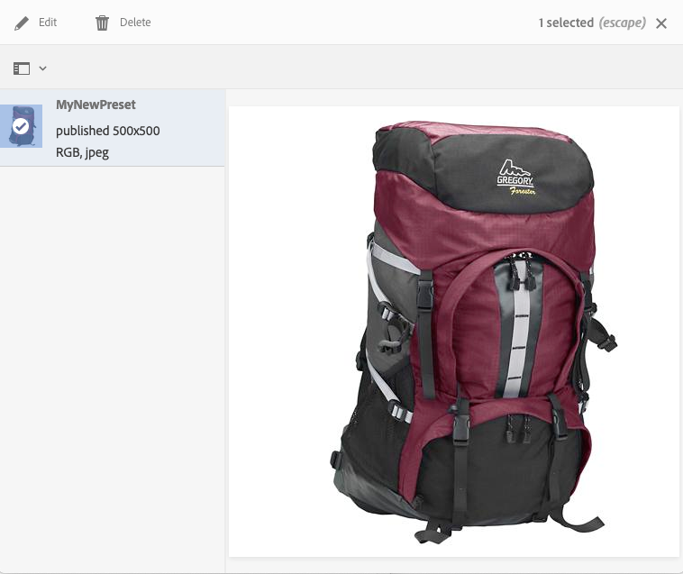

1. Select a preset and then click **[!UICONTROL Edit]**. The **[!UICONTROL Edit Image Preset]** window opens.
1. Make changes and click **[!UICONTROL Save]** to save your changes or **[!UICONTROL Cancel]** to cancel your changes.

## Publishing Dynamic Media image presets {#publishing-image-presets}

If you are running Dynamic Media - Hybrid mode, you must manually publish image presets.

(If you are running Dynamic Media - Scene7 mode, image presets are automatically published for you; you do not need to complete these steps.)

**To publish image presets in Dynamic Media - Hybrid mode:**

1. In Experience Manager, click the Experience Manager logo to access the global navigation console and click the Tools icon and navigate to **[!UICONTROL Assets]** > **[!UICONTROL Image Presets]**.
1. Select the image preset or multiple image presets from the list of image presets and click **[!UICONTROL Publish]**.
1. After the image preset is published, the status changes from unpublished to published.

   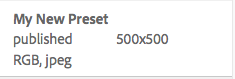

## Deleting Dynamic Media image presets {#deleting-image-presets}

1. In Experience Manager, click the Experience Manager logo to access the global navigation console.
1. Select the **[!UICONTROL Tools]** icon, then navigate to **[!UICONTROL Assets]** > **[!UICONTROL Image Presets]**.
1. Select a preset, and then click **[!UICONTROL Delete]**. Dynamic Media confirms that you want to delete it. Select **[!UICONTROL Delete]** to delete or select **[!UICONTROL Cancel]** to abort.
