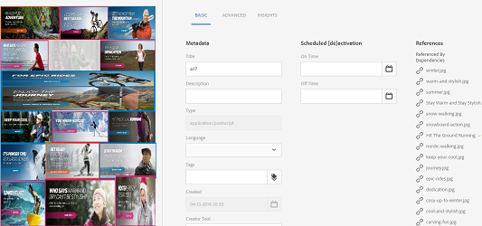
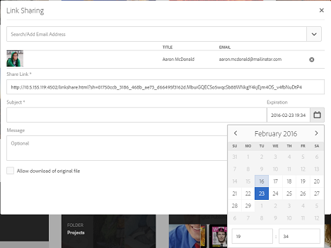
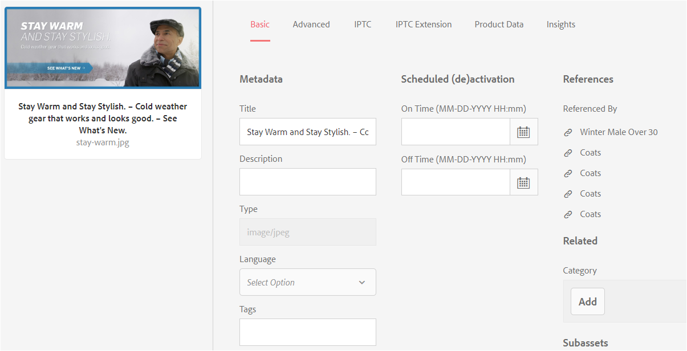
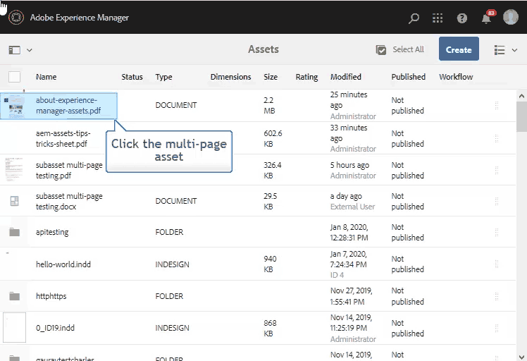
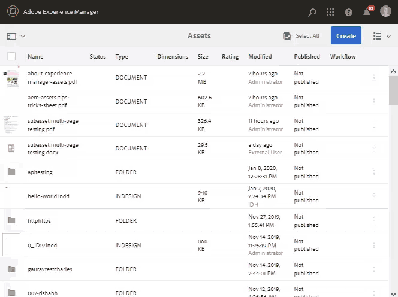

# Manage compound and multi-page assets {#managing-compound-assets}

[!DNL Adobe Experience Manager Assets] can identify if an uploaded file contains references to assets that already exist in the repository. This feature is available for supported file formats only. If the uploaded asset contains any references to [!DNL Experience Manager] assets, a bidirectional link is created between the uploaded and referenced assets.

Besides eliminating redundancy, referencing the assets in [!DNL Adobe Creative Cloud] applications enhances collaboration and increases the efficiency and productivity of users.

[!DNL Experience Manager Assets] supports bidirectional referencing. You can find referenced assets in the asset detail page of the uploaded file. In addition, you can view the referencing files in the asset details page of the referenced asset.

References are resolved on the basis of path, document ID, and instance ID of the referenced assets.

## [!DNL Adobe Illustrator]: Add digital assets as references {#refai}

You can reference existing digital assets from within an [!DNL Adobe Illustrator] file.

1. Using [[!DNL Experience Manager] desktop app](https://experienceleague.adobe.com/docs/experience-manager-desktop-app/using/using.html), fetch the digital assets on the local filesystem. Navigate to the filesystem location of the asset that you want to reference.
1. Drag the asset from the local folder to the [!DNL Illustrator] file.

1. Save the [!DNL Illustrator] file to the mounted drive, or [upload](/help/assets/manage-assets.md#uploading-assets) to the [!DNL Experience Manager] repository.

1. After the workflow completes, go to the asset details page for the asset. The references to existing digital assets are listed under **[!UICONTROL Dependencies]** in the **[!UICONTROL References]** column.

   

1. The referenced assets that appear under **[!UICONTROL Dependencies]** can also be referenced by files other than the current one. To view a list of referencing files for an asset, click the asset in the under **[!UICONTROL Dependencies]**.

   

1. Click **[!UICONTROL View Properties]** from the toolbar. In the [!UICONTROL Properties] page, the list of files that reference the current asset appear under the **[!UICONTROL References]** column in the **[!UICONTROL Basic]** tab.

   

   *Figure: Asset references in asset details.*

## [!DNL Adobe InDesign]: Add digital assets as references {#add-aem-assets-as-references-in-adobe-indesign}

To reference digital assets from within an [!DNL InDesign] file, either drag assets to the [!DNL InDesign] file or export the [!DNL InDesign] file as a ZIP archive.

Referenced assets already exist in [!DNL Experience Manager Assets]. You can extract subassets by [configuring InDesign Server](indesign.md). Embedded assets in an [!DNL InDesign] file are extracted as subassets.

>[!NOTE]
>
>If the [!DNL InDesign Server] is proxied, [!DNL InDesign] files have their preview embedded within their XMP metadata. In this case, thumbnail extraction is not explicitly required. However, if the [!DNL InDesign Server] is not proxied, thumbnails must be explicitly extracted for [!DNL InDesign] files.

When an INDD file is uploaded, the references are fetched by querying assets having `xmpMM:InstanceID` and `xmpMM:DocumentID` property in the repository.

### Create references by dragging assets {#create-references-by-dragging-aem-assets}

This procedure is similar to [add digital assets as references in Adobe Illustrator](#refai).

### Create references to assets by exporting a ZIP file {#create-references-to-aem-assets-by-exporting-a-zip-file}

1. Perform the steps in [Create workflow models](/help/sites-developing/workflows-models.md) to create a workflow.
1. Use the [Package feature](https://helpx.adobe.com/indesign/how-to/indesign-package-files-for-handoff.html) of [!DNL Adobe InDesign] to export the document. [!DNL Adobe InDesign] can export a document and the linked assets as a package. In this case, the exported folder contains a `Links` folder that contains subassets in the [!DNL InDesign] file. The `Links` folder is present in same folder as the INDD file. 
1. Create a ZIP file and upload it to the [!DNL Experience Manager] repository.
1. Start the `Unarchiver` workflow.
1. When the workflow completes, the references in the Links folder are automatically referenced as subassets. To view a list of referred assets, navigate to the asset details page of the [!DNL InDesign] asset and close the [Rail](/help/sites-authoring/basic-handling.md#rail-selector).

## [!DNL Adobe Photoshop]: Add digital assets as references {#refps}

1. Use [!DNL Experience Manager] desktop app to access [!DNL Experience Manager Assets]. Download and reveal the assets on local file system. Use the [!UICONTROL Place Linked] functionality in [!DNL Adobe Photoshop]. See [place assets in desktop app](https://experienceleague.adobe.com/docs/experience-manager-desktop-app/using/using.html#place-assets-in-native-documents).

1. Save in [!DNL Photoshop] file to the mounted drive or [upload](/help/assets/manage-assets.md#uploading-assets) to the [!DNL Experience Manager] repository.
1. After the workflow completes, the references to existing [!DNL Experience Manager] assets are listed in the asset details page.

   To view the referenced assets, close the [Rail](/help/sites-authoring/basic-handling.md#rail-selector) in the asset details page.

1. The referenced assets also contain the list of assets they are referenced from. To view a list of referenced assets, navigate to the asset details page and close the [Rail](/help/sites-authoring/basic-handling.md#rail-selector).

>[!NOTE]
>
>The assets within compound assets can also be referenced based on their Document ID and Instance ID. This functionality is available with [!DNL Adobe Illustrator] and [!DNL Adobe Photoshop] versions only. For others, referencing is done on the basis of relative path of linked assets in the main compound asset as done in earlier versions of [!DNL Experience Manager].

## Create subassets {#generate-subassets}

For the supported assets with multi-page formats &mdash; PDF files, AI files, [!DNL Microsoft PowerPoint] and [!DNL Apple Keynote] files, and [!DNL Adobe InDesign] files &mdash; [!DNL Experience Manager] can generate subassets that correspond to each individual page of the original asset. These subassets are linked to the *parent* asset and facilitate multi-page view. For all other purposes, the subassets are treated like normal assets in [!DNL Experience Manager].

Subasset generation is disabled by default. To enable subasset generation, follow these steps:

1. Log into [!DNL Experience Manager] as an administrator. Access **[!UICONTROL Tools]** > **[!UICONTROL Workflow]** > **[!UICONTROL Models]**.
1. Select **[!UICONTROL DAM Update Asset]** workflow and click **[!UICONTROL Edit]**.
1. Click **[!UICONTROL Toggle Side Panel]** and locate the **[!UICONTROL Create Sub Asset]** step. Add the step to the workflow. Click **[!UICONTROL Sync]**.

To generate the subassets do one of the following:

* New assets: The [!UICONTROL DAM Update Assets] workflow executes on any new asset that is uploaded to [!DNL Experience Manager]. Subassets are auto-generated for new multi-page assets.
* Existing multi-page assets: Manually execute the [!UICONTROL DAM Update Assets] workflow following either of the steps:

  * Select an asset and click [!UICONTROL Timeline] to open the left panel. Alternately, use the keyboard shortcut `alt + 3`. Click [!UICONTROL Start Workflow], select [!UICONTROL DAM Update Asset], click [!UICONTROL Start], and click [!UICONTROL Proceed].
  * Select an asset and click [!UICONTROL Create] > [!UICONTROL Workflow] from the toolbar. From the popup dialog, select [!UICONTROL DAM Update Asset] workflow, click [!UICONTROL Start], and click [!UICONTROL Proceed].

Specifically for Microsoft Word documents, execute the **[!UICONTROL DAM Parse Word Documents]** workflow. It generates a `cq:Page` component from the contents of the Microsoft Word document. The images extracted from the document are referenced from the `cq:Page` component. These images are extracted even if sub asset generation is disabled.

>[!NOTE]
>
>In the [!UICONTROL Create Sub Asset Process - Step Properties] in [!UICONTROL Process Arguments], you can specify the number of sub-assets that [!DNL Experience Manager] generates. The default value is 5. To generate all the sub assets, leave the field empty. If the field has negative, then no sub assets are generated.

## View subassets {#viewing-subassets}

The subassets are displayed only if the subassets are generated and are available for the selected multi-page asset. To view the generated subassets, open the multi-page asset. In the upper-left area of the page, click  and click **[!UICONTROL Subassets]** from the list. When you select **[!UICONTROL Subassets]** from the list. Alternately, use the keyboard shortcut `alt + 5`.

## View pages of a multi-page file {#view-pages-of-a-multi-page-file}

You can view a multi-page file, such as PDF, INDD, PPT, PPTX, and AI file, using the Page Viewer feature of [!DNL Experience Manager Assets]. Open a multi-page asset and click **[!UICONTROL View Pages]** from the upper-left corner of the page. The Page Viewer that opens displays the pages of the asset and the controls to browse through and zoom each page.

For [!DNL InDesign], you can extract pages using [!DNL InDesign Server]. If the previews of pages are saved during [!DNL InDesign] file creation, then [!DNL InDesign Server] is not required for page extraction.

The following options are available in the toolbar, in the left rail, and in the Page Viewer controls:

* **[!UICONTROL Desktop Actions]** to open or reveal a specific subasset using [!DNL Experience Manager] desktop app. See how to [configure Desktop Actions](https://experienceleague.adobe.com/docs/experience-manager-desktop-app/using/using.html#desktopactions-v2) if you are using [!DNL Experience Manager] desktop app.

* **[!UICONTROL Properties]** option opens the [!UICONTROL Properties] page of the specific subasset.

* **[!UICONTROL Annotate]** option lets you annotate the specific subasset. The annotations you use on separate subassets are collected and displayed together when the parent asset is opened for viewing.

* **[!UICONTROL Page Overview]** option displays all the subassets simultaneously.

* **[!UICONTROL Timeline]** option from the left rail after clicking  displays the activity stream for the file.

## Best practices and limitation {#best-practice-limitation-tips}

* Subasset generation can be very resource intensive on any [!DNL Experience Manager] deployment. If you are generating subassets when complex assets are uploaded, then add the step in the DAM Update Asset workflow. If you are generating subassets on-demand then create a separate workflow to generate subassets. A dedicated workflow lets you skip the other steps in DAM Update Asset workflow and save computational resources.

>[!MORELIKETHIS]
>
>* [Use Adobe Experience Manager desktop app](https://experienceleague.adobe.com/docs/experience-manager-desktop-app/using/using.html)
>* [Configure Desktop Actions in Adobe Experience Manager](https://experienceleague.adobe.com/docs/experience-manager-desktop-app/using/using.html#desktopactions-v2)
>* [Create Linked Smart Objects in Adobe Photoshop](https://helpx.adobe.com/photoshop/using/create-smart-objects.html#create-linked-smart-objects)
>* [Place graphics in Adobe InDesign](https://helpx.adobe.com/indesign/using/placing-graphics.html)
