# Manage video assets {#manage-video-assets}

| Version | Article link |
| -------- | ---------------------------- |
| AEM as a Cloud Service  |    [Click here](https://experienceleague.adobe.com/docs/experience-manager-cloud-service/content/assets/manage/manage-video-assets.html?lang=en)                  |
| AEM 6.5     | This article         |

Video format is a critical part of digital assets of an organization. [!DNL Adobe Experience Manager] offers mature offerings and features to manage the entire lifecycle of your video assets after their creation.

Learn how to manage and edit the video assets in [!DNL Adobe Experience Manager Assets]. Video encoding and transcoding, for example, FFmpeg transcoding, is possible using [!DNL Dynamic Media] integration.

## Upload and preview video assets {#upload-and-preview-video-assets}

[!DNL Adobe Experience Manager Assets] generates previews for video assets with the extension MP4. If the format of the asset is not MP4, install the FFmpeg pack to generate a preview. FFmpeg creates video renditions of type OGG and MP4. You can preview the renditions in the [!DNL Assets] user interface.

1. In the digital assets folder or subfolders, navigate to the location where you want to add digital assets.
1. To upload the asset, click **[!UICONTROL Create]** from the toolbar and choose **[!UICONTROL Files]**. Alternatively, drag a file on the user interface. See [upload assets](manage-assets.md#uploading-assets) for details.
1. To preview a video in the Card view, click the **[!UICONTROL Play]**  option on the video asset. You can pause or play video in the card view only. The [!UICONTROL Play] and [!UICONTROL Pause] options are not available in the list view.

1. To preview the video in the asset details page, click **[!UICONTROL Edit]** on the card. The video plays in the native video player of the browser. You can play, pause, control the volume, and zoom the video to full screen.

   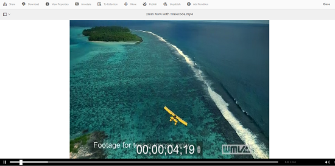

## Configuration to upload assets that are larger than 2 GB {#configuration-to-upload-assets-that-are-larger-than-gb}

By default, [!DNL Assets] does not let you upload any assets that are larger than 2 GB because of a file size limit. However, you can overwrite this limit by going into CRXDE Lite and creating a node under the `/apps` directory. The node must have the same node name, directory structure, and comparable node properties of order.

 In addition to [!DNL Assets] configuration, change the following configurations to upload large assets:

* Increase the token expiration time. See [!UICONTROL Adobe Granite CSRF Servlet] in Web Console at `https://[aem_server]:[port]/system/console/configMgr`. For more information, see [CSRF protection](/help/sites-developing/csrf-protection.md).
* Increase the `receiveTimeout` in Dispatcher configuration. For more information, see [Experience Manager Dispatcher configuration](https://experienceleague.adobe.com/docs/experience-manager-dispatcher/using/configuring/dispatcher-configuration.html#renders-options).

>[!NOTE]
>
>The [!DNL Experience Manager] Classic user interface does not have a 2-GB file size limit restriction. Also, end-to-end workflow for large video is not fully supported.

To configure a higher file size limit, perform the following steps in the `/apps` directory.

1. In [!DNL Experience Manager], click **[!UICONTROL Tools]** > **[!UICONTROL General]** > **[!UICONTROL CRXDE Lite]**.
1. In CRXDE Lite, navigate to `/libs/dam/gui/content/assets/jcr:content/actions/secondary/create/items/fileupload`. To see the directory window, click the `>>`.
1. From the toolbar, click the **[!UICONTROL Overlay Node]**. Alternatively, select **[!UICONTROL Overlay Node]** from the context menu.
1. In the **[!UICONTROL Overlay Node]** dialog, click **[!UICONTROL OK]**.

   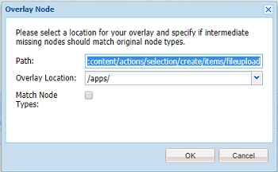

1. Refresh the browser. The overlay node `/apps/dam/gui/content/assets/jcr:content/actions/secondary/create/items/fileupload` is selected.
1. In the **[!UICONTROL Properties]** tab, enter the appropriate value in bytes to increase the size limit to the desired size. For example, to increase the size limit to 30 GB, enter `32212254720` value.

1. From the toolbar, click **[!UICONTROL Save All]**.
1. In [!DNL Experience Manager], click **[!UICONTROL Tools]** > **[!UICONTROL Operations]** > **[!UICONTROL Web Console]**.
1. On the [!DNL Adobe Experience Manager] [!UICONTROL Web Console Bundles] page, under the Name column of the table, locate, and click **[!UICONTROL Adobe Granite Workflow External Process Job Handler]**.
1. On the [!UICONTROL Adobe Granite Workflow External Process Job Handler] page, set the seconds for both **[!UICONTROL Default Timeout]** and **[!UICONTROL Max Timeout]** fields to `18000` (five hours). Click **[!UICONTROL Save]**.
1. In [!DNL Experience Manager], click **[!UICONTROL Tools]** > **[!UICONTROL Workflow]** > **[!UICONTROL Models]**.
1. On the Workflow Models page, select **[!UICONTROL Dynamic Media Encode Video]**, then click **[!UICONTROL Edit]**.
1. On the workflow page, double-click the **[!UICONTROL Dynamic Media Video Service Process]** component.
1. In the [!UICONTROL Step Properties] dialog box, under the **[!UICONTROL Common]** tab, expand **Advanced Settings**.
1. In the **[!UICONTROL Timeout]** field, specify a value of `18000`, then click **[!UICONTROL OK]** to return to the **[!UICONTROL Dynamic Media Encode Video]** workflow page.
1. Near the top of the page, below the [!UICONTROL Dynamic Media Encode Video] page title, click **[!UICONTROL Save]**.

## Publish video assets {#publish-video-assets}

After publishing, you can include the video assets in a web page as a URL or directly embed the assets. For details, see [publish Dynamic Media assets](/help/assets/publishing-dynamicmedia-assets.md).

## Publish videos to YouTube {#publishing-videos-to-youtube}

You can publish on-premise Experience Manager video assets directly to a YouTube channel that you have previously created.

To publish video assets to YouTube, you set up Experience Manager Assets with tags. You associate these tags with a YouTube channel. If a video asset's tag matches the tag of a YouTube channel, then the video is published to YouTube. Publish to YouTube occurs along with a normal publish of the video as long as an associated tag is used.

YouTube does its own encoding. As such, the original video file that was uploaded into Experience Manager is published to YouTube instead of any video rendition that Dynamic Media's encoding has created. While it is not required to process videos using Dynamic Media, it is expected that they do so in case a viewer preset is needed for playback.

When you bypass the video processing profile and publish directly to YouTube, it simply means that your video asset in Experience Manager Asset does not get a viewable thumbnail. It also means that if you run in `dynamicmedia` or `dynamicmedia_scene7` run modes, videos that are not encoded do not work with any of the Dynamic Media asset types.

Publishing video assets to YouTube servers involves completing the following tasks to ensure safe and secure server-to-server authentication with YouTube:

1. [Configure Google Cloud settings](#configuring-google-cloud-settings)
1. [Create a YouTube channel](#creating-a-youtube-channel)
1. [Add tags for publishing](#adding-tags-for-publishing)
1. [Enable the YouTube Publish Replication agent](#enabling-the-youtube-publish-replication-agent)
1. [Set up YouTube in Experience Manager](#setting-up-youtube-in-aem)
1. [(Optional) Automate the setting of default YouTube properties for your uploaded videos](#optional-automating-the-setting-of-default-youtube-properties-for-your-uploaded-videos)
1. [Publish videos to your YouTube channel](#publishing-videos-to-your-youtube-channel)
1. [(Optional) Verify the published video on YouTube](/help/assets/video.md#optional-verifying-the-published-video-on-youtube)
1. [Link YouTube URLs to your Web Application](#linking-youtube-urls-to-your-web-application)

You can also [unpublish videos to remove them from YouTube](#unpublishing-videos-to-remove-them-from-youtube).

### Configure Google Cloud settings {#configuring-google-cloud-settings}

To publish to YouTube, you need a Google account. If you have a GMAIL account, then you already have a Google account; if you do not have a Google account, you can easily create one. You need the account because you need credentials to publish video assets to YouTube. If you have an account already created, then skip this task and proceed directly to [Create a YouTube channel](#creating-a-youtube-channel).

The account used with Google Cloud and the Google account used for YouTube do not need to be the same.

Google periodically changes their user interface. As such, the steps to publish videos to YouTube can vary slightly from what is documented below. This caveat also applies to YouTube when you try to check if videos are uploaded to it.

>[!NOTE]
>
>The following steps were accurate at the time of this writing. However, Google periodically updates their websites without notice. As such, these steps can be slightly different.

To configure Google Cloud settings:

1. Create a Google account.
   [https://accounts.google.com/SignUp?service=mail](https://accounts.google.com/SignUp?service=mail)

   If you already have a Google account, skip to the next step.

1. Go to [https://cloud.google.com/](https://cloud.google.com/).
1. On the Google Cloud page, near the upper-right corner, click **[!UICONTROL Console]**.

   If necessary, **[!UICONTROL Sign in]** using your Google account credentials to see the **[!UICONTROL Console]** option.

1. On the Dashboard page, to the right of **[!UICONTROL Google Cloud Platform]**, click the Project drop-down list to open the Select a Project dialog box.
1. In the Select a project dialog box, tap **[!UICONTROL New Project]**.

   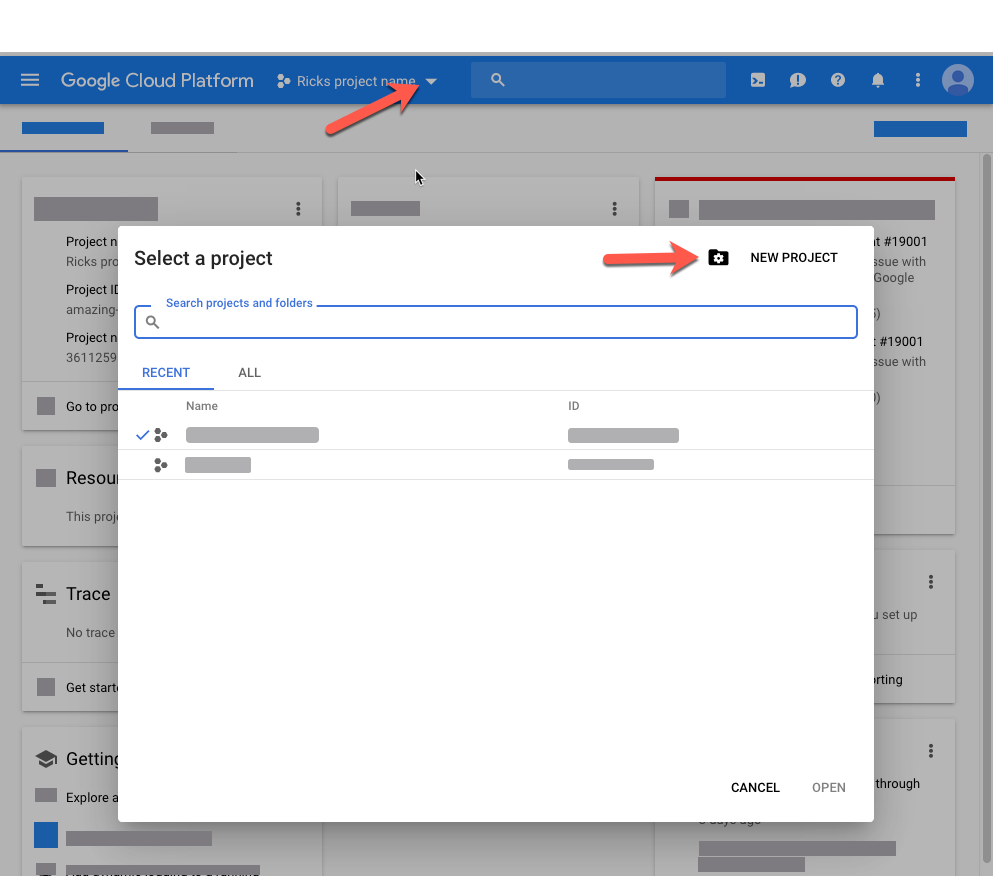

1. In the New Project dialog box, in the Project Name field, type the name of your new project.

   Your Project ID is based on your project name. As such, choose the project name carefully; it cannot be changed after it is created. Also, you must enter the same Project ID again when you set up YouTube in Experience Manager later on; consider writing it down.

1. Click **[!UICONTROL Create]**.

1. Do either one of the following:

    * On your project's Dashboard, in the Getting Started card, tap **[!UICONTROL Explore and enable APIs]**.
    * On your project's Dashboard, in the APIs card, tap **[!UICONTROL Go to APIs overview]**.

   

1. Near the top of the APIs & Services page, tap **[!UICONTROL Enable APIs and Services]**.
1. On the API Library page, on the left side, under **[!UICONTROL Category]**, tap **[!UICONTROL YouTube]**. On the right side of the page, tap **[!UICONTROL YouTube Data API]**.
1. On the YouTube Data API v3 page, tap **[!UICONTROL Enable]**.

   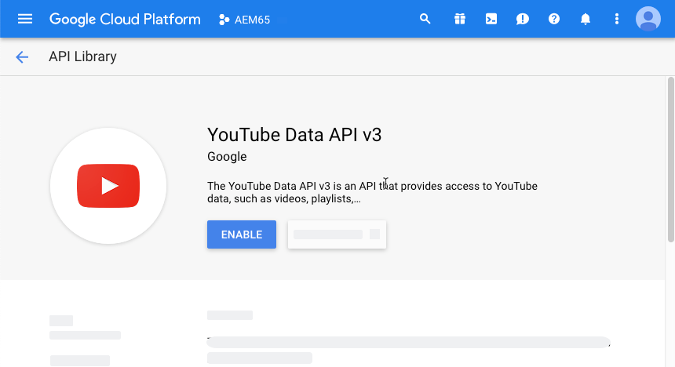

1. To use the API, you need credentials. If necessary, click **[!UICONTROL Create Credentials]**.

   

1. On the **[!UICONTROL Add credentials to your project]** page, step 1, do the following:

    * From the **[!UICONTROL Which API are you using?]** drop-down list, select **[!UICONTROL YouTube Data API v3]**.

    * From the **[!UICONTROL Where are you calling the API from?]** drop-down list, select **[!UICONTROL Web Server (for example, node.js, Tomcat)]**

    * From the **[!UICONTROL What data are you accessing?]** drop-down list, tap **[!UICONTROL User data]**.

   

1. Tap **[!UICONTROL What credentials do I need?]**
1. On the **[!UICONTROL Add credentials to your project]** page, step 2, under the **[!UICONTROL Create an OAuth 2.0 client ID]** heading, in the Name field, enter a unique name if desired. Or, you can use the default name specified by Google.
1. Under the **[!UICONTROL Authorized JavaScript origins]** heading, in the text field, enter the following path, substituting your own domain and port number in the path, then press **[!UICONTROL Enter]** to add the path to the list:

   `https://<servername.domain>:<port_number>`

   For example, `https://1a2b3c.mycompany.com:4321`

   **Note**: The path example above is intended for demonstration purposes only.

   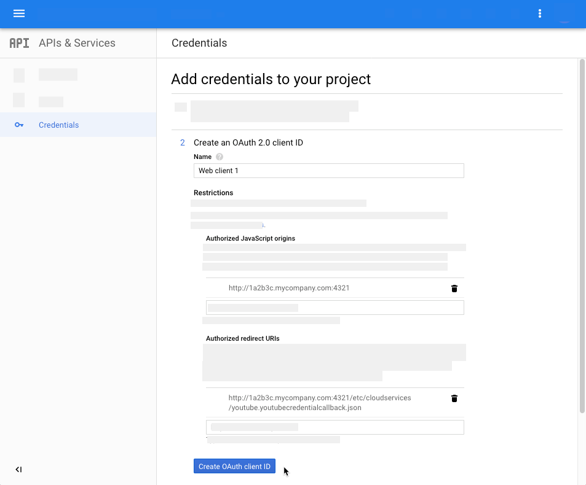

1. Under the **[!UICONTROL Authorized redirect URIs]** heading, in the text field, enter the following path, substituting your own domain and port number in the path, then press **[!UICONTROL Enter]** to add the path to the list:

   `https://<servername.domain>:<port_number>/etc/cloudservices/youtube.youtubecredentialcallback.json`

   For example, `https://1a2b3c.mycompany.com:4321/etc/cloudservices/youtube.youtubecredentialcallback.json`

   **Note**: The path example above is intended for demonstration purposes only.

1. Click **[!UICONTROL Create OAuth client ID]**.
1. On the **[!UICONTROL Add credentials to your project]** page, step 3, under the **[!UICONTROL Set up the OAuth 2.0 consent screen]** heading, select the Gmail email address that you are currently using.

   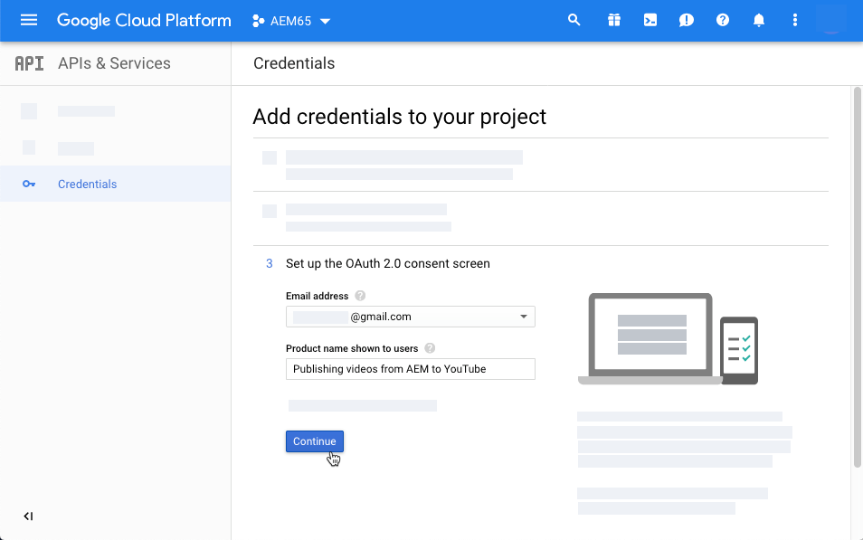

1. Under the **[!UICONTROL Product name shown to users]** heading, in the text field, enter what you want to show on the consent screen.

   The consent screen is displayed to the Experience Manager administrator when they authenticate to YouTube; Experience Manager contacts YouTube for permission.

1. Click **[!UICONTROL Continue]**.
1. On the Add credentials to your project page, step 4, under the **[!UICONTROL Download credentials]** heading, tap **[!UICONTROL Download]**.

   

1. Save the `client_id.json` file.

   You need this downloaded json file when you set up YouTube in Adobe Experience Manager later on.

1. Click **[!UICONTROL Done]**.

   Log out of your Google account. Now create a YouTube channel.

### Create a YouTube channel {#creating-a-youtube-channel}

Publishing videos to YouTube requires that you have one or more channels. If you have already created a YouTube channel, you can skip this task and go to [Add tags for publishing](/help/assets/video.md#adding-tags-for-publishing).

>[!WARNING]
>
>Be sure you have already set up one or more channels in YouTube *before* you add channels under YouTube Settings in Experience Manager (see [Set up YouTube in Experience Manager](#setting-up-youtube-in-aem) below). If you fail to set up one or more channels, you are not warned of non-existent channels. However, Google authentication still occurs when you add a channel, but there is not an option to choose which channel the video is sent.

**To create a YouTube channel:**

1. Go to [https://www.youtube.com](https://www.youtube.com/) and sign in using your Google account credentials.
1. In the upper-right corner of the YouTube page, click your profile picture (can also appear as a letter within a solid colored circle), then click **[!UICONTROL YouTube settings]** (round gear icon).
1. On the Overview page, under the Additional Features heading, click **[!UICONTROL See all my channels or create a channel]**.
1. On the Channels page, click **[!UICONTROL Create a new channel]**.
1. On the Brand Account page, in the Brand Account Name field, enter a business name or any other channel name you choose where you want to publish your video assets, then click **[!UICONTROL Create]**.

   Remember the name that you enter here because you must enter it again when you set up YouTube in Experience Manager.

1. (Optional) If necessary, add more channels.

   Now add tags for publishing.

### Add tags for publishing {#adding-tags-for-publishing}

To publish to your videos to YouTube, Experience Manager associates tags to one or more YouTube channels. To add tags for publishing, see [Administer tags](/help/sites-administering/tags.md).

Or, if you intend to use the default tags in Experience Manager, you can skip this task and go to [Enable the YouTube Publish replication agent](#enabling-the-youtube-publish-replication-agent).

### Enable the YouTube Publish replication agent {#enabling-the-youtube-publish-replication-agent}

After you enable the YouTube Publish replication agent, if you want to test the connection to the Google Cloud account, tap **[!UICONTROL Test Connection]**. A browser tab displays the connection results. If you have added YouTube Channels, a listing of them is displayed as part of the test.

1. In the upper-left corner of Experience Manager, click the Experience Manager logo, then in the left rail, click **[!UICONTROL Tools]** > **[!UICONTROL Deployment]** > **[!UICONTROL Replication]** > **[!UICONTROL Agents on Author]**.
1. On the Agents of Author page, click **[!UICONTROL YouTube Publish]**.
1. On the toolbar, to the right of Settings, click **[!UICONTROL Edit]**.
1. Select the **[!UICONTROL Enabled]** checkbox so you can turn on the replication agent.
1. Click **[!UICONTROL OK]**.

   Now set up YouTube in Experience Manager.

### Set up YouTube in Experience Manager {#setting-up-youtube-in-aem}

Starting with Experience Manager 6.4, a new touch user interface method was introduced to set up YouTube publishing in Experience Manager. Based on the installed instance of Experience Manager that you are using, do one of the following:

* To configure YouTube in Experience Manager before 6.4, see [Set up YouTube in Experience Manager before 6.4](/help/assets/video.md#setting-up-youtube-in-aem-before).
* To configure YouTube in Experience Manager 6.4 or later, see [Set up YouTube in Experience Manager 6.4 and later](#setting-up-youtube-in-aem-and-later).

#### Set up YouTube in Experience Manager 6.4 and later {#setting-up-youtube-in-aem-and-later}

1. Be sure you log in to your instance of Dynamic Media as an Administrator.
1. In the upper-left corner, tap the Experience Manager logo, then in the left rail, tap **[!UICONTROL Tools]**(hammer icon) > **[!UICONTROL Cloud Services]** > **[!UICONTROL YouTube Publishing Configuration]**.
1. Tap **[!UICONTROL global]** (do not select it).

1. Near the upper-right corner of the global page, tap **[!UICONTROL Create]**.
1. On the Create YouTube Configuration page, under Google Cloud Platform Settings, in the **[!UICONTROL Application Name]** field, enter the Google Project ID.

   You specified the project ID when you initially configured Google Cloud settings earlier.
   Leave the Create YouTube Configuration page open; in a moment, you are going to return to it.

   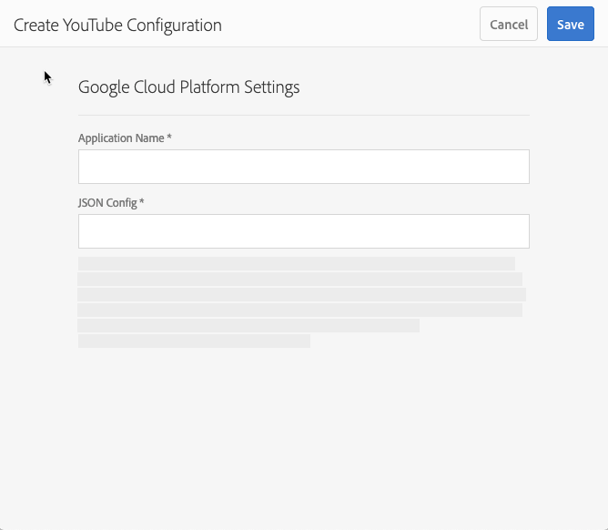

1. Using a plain text editor, open the JSON file that you downloaded and saved earlier in the task [Configure Google Cloud settings](/help/assets/video.md#configuring-google-cloud-settings).
1. Select and copy the entire JSON text.
1. Return to the YouTube Account Settings dialog box. In the **[!UICONTROL JSON Config]** field, paste the JSON text.
1. Near the upper-right corner of the page, tap **[!UICONTROL Save]**.

   Now set up YouTube channels in Experience Manager.

1. Tap **[!UICONTROL Add Channel]**.
1. In the Channel Name field, enter the name of the channel that you created in the task **[!UICONTROL Adding one or more channels to YouTube]** earlier.

   You can optionally add a description, if desired.

1. Tap **[!UICONTROL Add]**.
1. YouTube/Google authentication is displayed. If you are not already logged into the Google Cloud account, then skip this step.

    * Enter the Google username and password associated with the Google Project ID and the JSON text above.
    * Depending on how many channels your account has you see two or more items. Select a channel. Do not select the e-mail address; it is not a channel.
    * On the next page, tap **[!UICONTROL Accept]** to allow access to this channel.

1. Tap **[!UICONTROL Allow]**.

   Now set up tags for publishing.

1. **[!UICONTROL Setting up tags for publishing]** - On the Cloud Services &gt; YouTube page, tap the pencil icon to edit the list of tags that you want to use.
1. Tap the drop-down list icon (upside-down caret) so you can display the list of available tags in Experience Manager.
1. Tap one or more tags so you can add them.

   To delete a tag that you have added, select the tag, and tap **[!UICONTROL X]**.

1. When you are finished adding the tags that you want, tap **[!UICONTROL Save]**.

   Now you publish videos to your YouTube channel.

#### Set up YouTube in Experience Manager before 6.4 {#setting-up-youtube-in-aem-before}

1. Be sure you log in to your instance of Dynamic Media as an Administrator.

1. In the upper-left corner, tap the Experience Manager logo, then in the left rail, tap **[!UICONTROL Tools]** (hammer icon) > **[!UICONTROL Deployment]** > **[!UICONTROL Cloud Services]**.
1. Under the Third-Party Services heading, under YouTube, tap **[!UICONTROL Configure now]**.
1. In the Create Configuration dialog box, enter a title (mandatory) and name (optional) in the respective fields.
1. Tap **[!UICONTROL Create]**.
1. In the YouTube Account Settings dialog box, in the **[!UICONTROL Application Name]** field, enter the Google Project ID.

   You specified the project ID when you initially [configured Google Cloud settings](/help/assets/video.md#configuring-google-cloud-settings) earlier.
   Leave the YouTube Account Setting dialog box open; you are going to return to it in a moment.

1. Using a plain text editor, open the JSON file that you downloaded and saved earlier in the task Configuring Google Cloud settings.
1. Select and copy the entire JSON text.
1. Return to the YouTube Account Settings dialog box. In the **[!UICONTROL JSON Config]** field, paste the JSON text.
1. Tap **[!UICONTROL OK]**.

   Now set up YouTube channels in Experience Manager.

1. To the right of **[!UICONTROL Available Channels]**, tap **+** (plus sign icon).
1. In the YouTube Channel Settings dialog box, in the Title field, enter the name of the channel that you created in the task **[!UICONTROL Adding one or more channels to YouTube]** earlier.

   You can optionally add a description, if desired.

1. Tap **[!UICONTROL OK]**.
1. YouTube/Google authentication is displayed. If you are not already logged into the Google Cloud account, then skip this step.

    * Enter the Google username and password associated with the Google Project ID and the JSON text above.
    * Depending on how many channels your account has you see two or more items. Select a channel. Do not select the e-mail address; it is not a channel.
    * On the next page, tap **[!UICONTROL Accept]** to allow access to this channel.

1. Tap **[!UICONTROL Allow]**.

   Now set up tags for publishing.

1. **[!UICONTROL Setting up tags for publishing]** - On the Cloud Services &gt; YouTube page, tap the pencil icon to edit the list of tags that you want to use.
1. Tap the drop-down list icon (upside-down caret) so you can display the list of available tags in Experience Manager.
1. Tap one or more tags so you can add them.

   To delete a tag that you have added, select the tag, and tap **X**.

1. When you are finished adding the tags that you want, tap **[!UICONTROL OK]**.

   Now you publish videos to your YouTube channel.

### (Optional) Automate the setting of default YouTube properties for your uploaded videos {#optional-automating-the-setting-of-default-youtube-properties-for-your-uploaded-videos}

You can optionally automate the setting of YouTube properties on upload of your videos by creating a metadata processing profile in Experience Manager.

To create the metadata processing profile, you are first going to copy values from the **[!UICONTROL Field Label]**, **[!UICONTROL Map to property]**, and **[!UICONTROL Choices]** fields, all found in Metadata Schemas for video. Then, you build your YouTube video metadata processing profile by adding those values to it.

To automate the setting of default YouTube properties for your uploaded videos:

1. In the upper-left corner, tap the Experience Manager logo, then in the left rail, click **[!UICONTROL Tools]** (hammer icon) > **[!UICONTROL Assets]** > **[!UICONTROL Metadata Schemas]**.
1. Click **[!UICONTROL default]**. (Do not add a checkmark to the selection box to the left of "default".)
1. On the **[!UICONTROL default]** page, check the box to the left of **[!UICONTROL video]**, then tap **[!UICONTROL Edit]**.
1. On the Metadata Schema Editor page, tap the **[!UICONTROL Advanced]** tab.
1. Under the YouTube Publishing heading, click **[!UICONTROL YouTube Category]**.
1. On the right side of the page, under the **[!UICONTROL Settings]** tab, do the following:

    * In the **[!UICONTROL Map to property]** text field, select and copy the value.
      Paste the copied value into the open text editor. You are going to need this value later when you create your metadata processing profile. Leave the text editor open.

    * Under **[!UICONTROL Choices]**, select and copy the default value that you want to use (such as People & Blogs or Science & Technology).
      Paste the copied value into the open text editor. You are going to need this value later when you create your metadata processing profile. Leave the text editor open.

1. Under the YouTube Publishing heading, tap **[!UICONTROL YouTube Privacy]**.
1. On the right side of the page, under the **[!UICONTROL Settings]** tab, do the following:

    * In the **[!UICONTROL Map to property]** text field, select and copy the value.
      Paste the copied value into the open text editor. You are going to need this value later when you create your metadata processing profile. Leave the text editor open.

    * Under **[!UICONTROL Choices]**, select and copy the default value that you want to use. Notice that the Choices are grouped in pairs of two. The bottom field in the pair is the default value that you want to copy, such as public, unlisted, or private.
      Paste the copied value into the open text editor. You are going to need this value later when you create your metadata processing profile. Leave the text editor open.

1. Near the upper-right corner of the Metadata Schema Editor page, click **[!UICONTROL Cancel]**.
1. In the upper-left corner of Experience Manager, tap the Experience Manager logo, then in the left rail, click **[!UICONTROL Tools]** (hammer icon) > **[!UICONTROL Assets]** > **[!UICONTROL Metadata Profiles]**.

1. On the Metadata Profiles page, near the upper-right corner of the page, click **[!UICONTROL Create]**.
1. In the Add Metadata Profile dialog box, in the **[!UICONTROL Profile title]** text field, enter the name `YouTube Video` then click **[!UICONTROL Create]**.
1. On the Metadata Profile Editor page, click the **[!UICONTROL Advance]** tab.
1. Add the copied YouTube Publishing values to the profile by doing the following:

    * On the right side of the page, click the **[!UICONTROL Build Form]** tab.
    * (Optional) Drag the component labeled **[!UICONTROL Section Header]** to the left and drop it in the form area.
    * (Optional) Click **[!UICONTROL Field Label]** to select the component.
    * (Optional) On the right side of the page, under the Settings tab, in the Field Label text field, enter `YouTube Publishing`.
    * Click the **[!UICONTROL Build Form]** tab, then drag the component labeled **[!UICONTROL Multi Value Text]** and drop it below the **[!UICONTROL YouTube Publishing]** heading that you created.

    * Click **[!UICONTROL Field Label]** so the component is selected.
    * On the right side of the page, under the Settings tab, paste the YouTube Publishing values (Field Label value and Map to property value) that you copied earlier, into their respective fields on the form. Paste the Choices value into the Default Value field.

1. Add the copied YouTube Privacy values to the profile by doing the following:

    * On the right side of the page, click the **[!UICONTROL Build Form]** tab.
    * (Optional) Drag the component labeled **[!UICONTROL Section Header]** to the left and drop it in the form area.
    * (Optional) Click **[!UICONTROL Field Label]** to select the component.
    * (Optional) On the right side of the page, under the Settings tab, in the Field Label text field, enter `YouTube Privacy`.
    * Click the **[!UICONTROL Build Form]** tab, then drag the component labeled **[!UICONTROL Multi Value Text]** and drop it below the **[!UICONTROL YouTube Privacy]** heading you created.

    * Click **[!UICONTROL Field Label]** so the component is selected.
    * On the right side of the page, under the Settings tab, paste the YouTube Publishing values (Field Label value and Map to property value) that you copied earlier, into their respective fields on the form. Paste the Choices value into the Default Value field.

1. Near the upper-right corner of the page, click **[!UICONTROL Save]**.
1. Apply the YouTube Publishing metadata profile to the folders where you are going to upload videos. You must have both the Metadata Profile and the Video Profile set.

   See [Metadata Profiles](/help/assets/metadata-config.md#metadata-profiles) and [Video Profiles](/help/assets/video-profiles.md).

### Publish videos to your YouTube channel {#publishing-videos-to-your-youtube-channel}

Now you associate the tags that you added earlier to video assets. This process lets Experience Manager know which assets to publish to your YouTube channel.

>[!NOTE]
>
>When running in Dynamic Media - Scene7 mode, publish immediately does not automatically publish to YouTube. When Dynamic Media - Scene7 mode is set up, there are two publish options to choose from: **[!UICONTROL Immediately]** or **[!UICONTROL Upon Activation]**.
>
>**[!UICONTROL Publish Immediately]** means that the uploaded asset--after it is synched with IPS--is published automatically to the delivery system. While that is true for Dynamic Media, it is not true for YouTube. To publish to YouTube, you must publish by way of Experience Manager Author.

>[!NOTE]
>
>To publish content from YouTube, Experience Manager uses the **[!UICONTROL Publish to YouTube]** workflow, which lets you monitor progress and view any failure information.
>
>See [Monitor video encoding and YouTube publishing progress](#monitoring-video-encoding-and-youtube-publishing-progress).
>
>For more detailed progress information, you can monitor the YouTube log under replication. Be aware, however, that such monitoring requires administrator access.

**To publish videos to your YouTube channel:**

1. In Experience Manager, navigate to a video asset that you want to publish to your YouTube channel.
1. Select the video asset (the adaptive video set).
1. On the toolbar, click **[!UICONTROL Properties]**.
1. In the Basic tab, under the Metadata heading, click **[!UICONTROL Open Selection Dialog]** to the right of the Tags field.
1. On the Select Tags page, navigate to the tags you want to use, and then select one or more tags.

   Remember that the tags must be associated with the YouTube channel.

1. In the upper-right corner of the page, click **[!UICONTROL Select]**.
1. In the upper-right corner of the video's properties page, click **[!UICONTROL Save and Close]**.
1. On the toolbar, click **[!UICONTROL Quick Publish]**.

   See also [Using Publication Management with Experience Manager Sites](https://experienceleague.adobe.com/docs/experience-manager-learn/sites/page-authoring/publication-management-feature-video-use.html).

   You can optionally verify the published video on your YouTube channel.

### (Optional) Verify the published video on YouTube {#optional-verifying-the-published-video-on-youtube}

You can optionally monitor progress of your YouTube publishing (or unpublishing).

See [Monitor video encoding and YouTube publishing progress](#monitoring-video-encoding-and-youtube-publishing-progress).

Publishing times can vary greatly depending on numerous factors that include the format of your primary source video, file size, and upload traffic. The publishing process can take anywhere from a few minutes to several hours. Also, higher resolution formats are rendered much more slowly. For example, 720p and 1080p take longer to appear than 480p.

After eight hours if you still see a status message that says **[!UICONTROL Uploaded (processing, please wait)]**, try removing the video from Adobe's site and uploading it again.

### Link YouTube URLs to your web application {#linking-youtube-urls-to-your-web-application}

You can obtain a YouTube URL string that is generated by Dynamic Media after you publish the video. When you copy the YouTube URL, it lands on the Clipboard so you can paste it as necessary to pages in your website or application.

>[!NOTE]
>
>The YouTube URL is not available to copy until you have published the video asset to YouTube.

**To link YouTube URLs to your web application:**

1. Navigate to the *YouTube published* video asset whose URL that you want to copy, then select it.

   Remember that YouTube URLs are only available to copy *after* you have first *published* the video assets to YouTube.

1. On the toolbar, click **[!UICONTROL Properties]**.
1. Click the **[!UICONTROL Advanced]** tab.
1. Under the YouTube Publishing heading, in the YouTube URL List, select, and copy the URL text to your web browser to preview the asset or to add to your web content page.

### Unpublish videos so you can remove them from YouTube {#unpublishing-videos-to-remove-them-from-youtube}

When you unpublish a video asset in Experience Manager, the video is removed from YouTube.

>[!CAUTION]
>
>If you remove a video directly from within YouTube, Experience Manager is unaware and continues to behave as if the video is still published to YouTube. Always unpublish a video asset from YouTube by way of Experience Manager.

>[!NOTE]
>
>To remove content from YouTube, Experience Manager uses the **[!UICONTROL Unpublish from YouTube]** workflow, which lets you monitor progress and view any failure information.
>
>See [Monitor video encoding and YouTube publishing progress](#monitoring-video-encoding-and-youtube-publishing-progress).

**To unpublish videos to remove them from YouTube:**

1. Navigate to the video assets that you want to unpublish from your YouTube channel.
1. In an asset selection mode, select one or more published video assets.
1. On the toolbar, click **[!UICONTROL Manage Publication]**. Tap the three dots icon (. . .) on the toolbar so **[!UICONTROL Manage Publication]** opens.
1. On the Manage Publication page, tap **[!UICONTROL Unpublish]**.
1. In the upper-right corner of the page, tap **[!UICONTROL Next]**.
1. In the upper-right corner of the page, tap **[!UICONTROL Unpublish]**.

## Monitor video encoding and YouTube publishing progress {#monitoring-video-encoding-and-youtube-publishing-progress}

When you upload a new video to a folder that has video encoding applied, or you publish your video to YouTube, you can monitor how your video encoding/Youtube publishing is progressing. Actual YouTube publishing progress is only available by way of the logs. However, its failure or success is listed in additional ways described in the following procedure. In addition, you receive email notifications when a YouTube publish workflow or video encoding completes or is interrupted.

### Monitor progress {#monitoring-progress}

1. View video encoding progress in your assets folder:

    * In card view, video encoding progress displays on the asset by percent. If there is an error, this information also displays on the asset.

   

    * In list view, video encoding progress displays in the **[!UICONTROL Processing Status]** column. If there is an error, this message displays in that same column.

   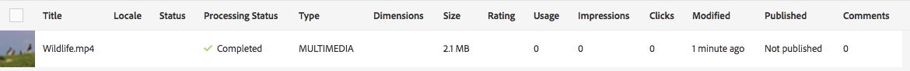

   This column does not display by default. To enable the column, select **[!UICONTROL View Settings]** from the views drop-down menu, and add the **[!UICONTROL Processing Status]** column and tap or click **[!UICONTROL Update]**.

   

1. View progress in the asset details. When you tap or click an asset, open the drop-down menu and select **[!UICONTROL Timeline]**. To narrow it down to workflow activities like encoding or YouTube publishing, select **[!UICONTROL Workflows]**.

   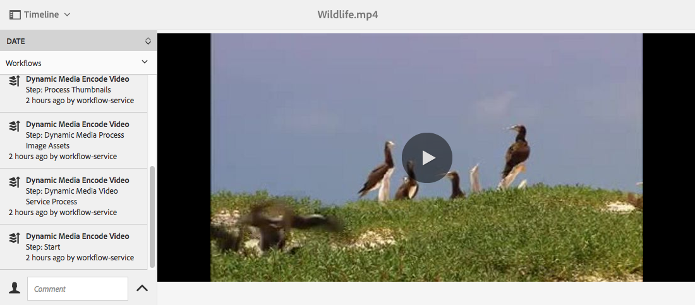

   Any workflow information &ndash; such as encoding &ndash; displays in the timeline. For YouTube publish, the Workflow timeline also includes the name of the YouTube channel and the YouTube video URL. In addition, you see any failure notifications in the Workflow timeline after the publish is complete.

   >[!NOTE]
   >
   >It can take a long time for failure/error messages to finally be recorded due to multiple workflow configurations on **[!UICONTROL retries]**, **[!UICONTROL retry delay]**, and **[!UICONTROL timeout]** from [https://localhost:4502/system/console/configMgr](https://localhost:4502/system/console/configMgr), for example:
   >
   >* Apache Sling Job Queue Configuration
   >* Adobe Granite Workflow External Process Job Handler
   >* Granite Workflow Timeout Queue
   >
   >You can adjust the **[!UICONTROL retries]**, **[!UICONTROL retry delay]**, and **[!UICONTROL timeout]** properties in these configurations.

1. For workflows in progress, see Workflow Instances available from **[!UICONTROL Tools]** > **[!UICONTROL Workflow]** > **[!UICONTROL Instances]**.

   >[!NOTE]
   >
   >You need administrative rights to access the **[!UICONTROL Tools]** menu.

   

   Select the instance and tap **[!UICONTROL Open History]**.

   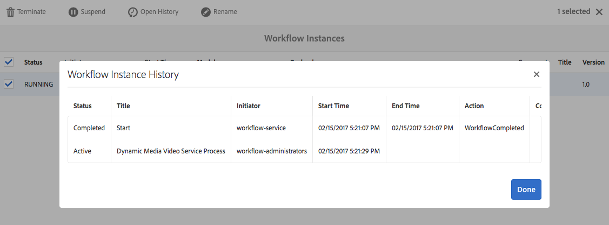

   From the Workflow Instances area, you can also suspend, terminate, or rename workflows. See [Administering workflows](/help/sites-administering/workflows-administering.md) for more information.

1. For failed jobs, see Workflow Failures available from **[!UICONTROL Tools]** > **[!UICONTROL Workflow]** > **[!UICONTROL Failures]**. The **[!UICONTROL Workflow Failure]** lists all failed workflow activities.

   >[!NOTE]
   >
   >You need administrative rights to access the **[!UICONTROL Tools]** menu.

   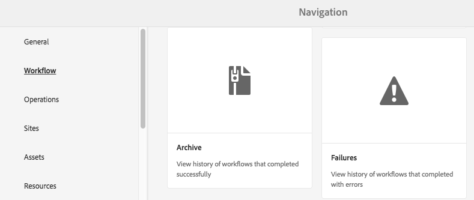

   >[!NOTE]
   >
   >It can take a long time for the error message to finally be recorded due to multiple workflow configurations on **[!UICONTROL retries]**, **[!UICONTROL retry delay]**, and **[!UICONTROL timeout]** from [https://localhost:4502/system/console/configMgr](https://localhost:4502/system/console/configMgr), for example:
   >
   >* Apache Sling Job Queue Configuration
   >* Adobe Granite Workflow External Process Job Handler
   >* Granite Workflow Timeout Queue
   >
   >You can adjust the **[!UICONTROL retries]**, **[!UICONTROL retry delay]**, and **[!UICONTROL timeout]** properties in these configurations.

1. For completed workflows, see Workflow Archive available from **[!UICONTROL Tools]** > **[!UICONTROL Workflow]** > **[!UICONTROL Archive]**. The **[!UICONTROL Workflow Archive]** lists all completed workflow activities.

   >[!NOTE]
   >
   >You need administrative rights to access the **[!UICONTROL Tools]** menu.

   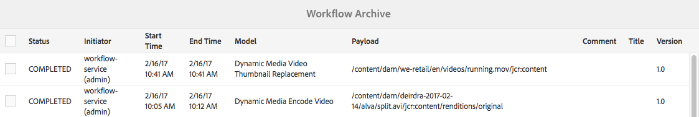

1. You receive email notifications about aborted or failed workflow jobs. These email notifications are configurable by an administrator. See [Configure email notifications](#configuring-e-mail-notifications).

#### Configure e-mail notifications {#configuring-e-mail-notifications}

>[!NOTE]
>
>You need administrative rights to access the **[!UICONTROL Tools]** menu.

How you configure notification depends on whether you want notifications for encoding jobs or YouTube publishing jobs:

* For encoding jobs, you can access the configuration page for all Experience Manager workflow email notifications at **[!UICONTROL Tools]** > **[!UICONTROL Operations]** > **[!UICONTROL Web Console]** and by searching for **[!UICONTROL Day CQ Workflow Email Notification Service]**. See [Configure email notification in Experience Manager](/help/sites-administering/notification.md). You can select or clear the check boxes for **[!UICONTROL Notify on Abort]** or **[!UICONTROL Notify on Complete]** accordingly.

* For YouTube publishing jobs, do the following:

1. In Experience Manager, tap **[!UICONTROL Tools]** > **[!UICONTROL Workflow]** > **[!UICONTROL Models]**.
1. On the Workflow Models page, select **[!UICONTROL Publish to YouTube]**, then tap **[!UICONTROL Edit]** on the toolbar.
1. Near the upper-right corner of the Publish to YouTube workflow page, tap **[!UICONTROL Edit]**.
1. Hover the mouse pointer on the YouTube Upload component, then tap once to display the inline toolbar.

   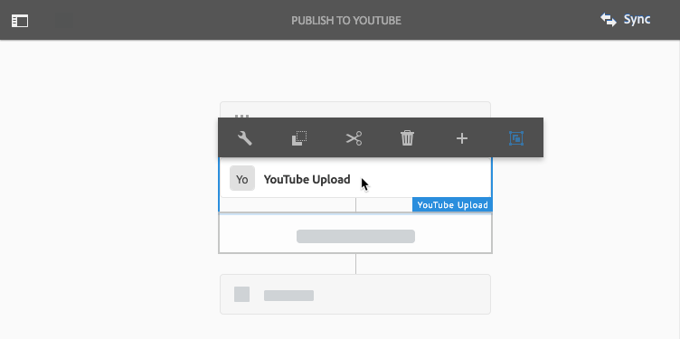

1. On the inline toolbar, tap the Configuration icon (wrench). Click the **[!UICONTROL Arguments]** tab.

   

1. In the YouTube Upload Process - Step Properties dialog box, tap the **[!UICONTROL Arguments]** tab.

   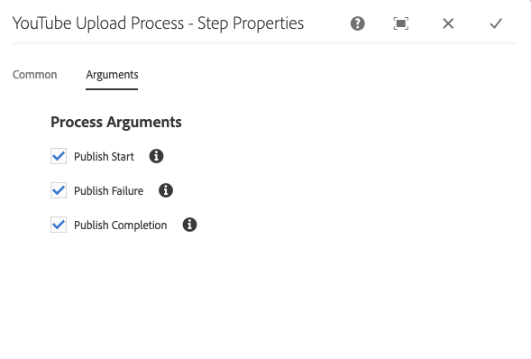

1. You can select or clear the following check boxes:

    * Publish Start
    * Publish Failure
    * Publish Completion - includes information on channels and URLs

   Clearing a check box means that you do not receive the specified email notification from the YouTube Publish workflow.

   >[!NOTE]
   >
   >These emails are specific to YouTube and are in addition to the generic workflow email notifications. As a result, you can receive two sets of email notification - the generic notification available in the **[!UICONTROL Day CQ Workflow Email Notification Service]** and one specific to YouTube depending on your configuration settings.

1. When you are finished, near the upper-right corner of the dialog box, tap the **[!UICONTROL Done]** icon (check mark).
1. On the Publish to YouTube workflow page, near the upper-right corner, tap **[!UICONTROL Sync]**.

## Annotate video assets {#annotate-video-assets}

1. From the [!DNL Assets] console, select **[!UICONTROL Edit]** on the asset card to display the asset details page.
1. To play the video, click **[!UICONTROL Preview]**.
1. To annotate the video, click **[!UICONTROL Annotate]**. An annotation is added at the particular time (frame) in the video. When annotating, you can draw on the canvas and include a comment with the drawing. Comments are auto-saved. To exit the annotation wizard, click **[!UICONTROL Close]**.

   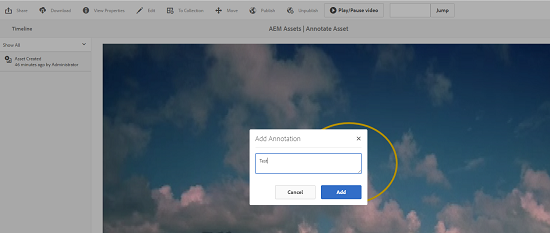

1. Seek to a specific point in the video, specify the time in seconds in the **text** field and click **Jump**. For example, to skip the first 20 seconds of video, enter 20 in the text field.

   

1. To view it in the timeline, click an annotation. To delete the annotation from the timeline, click **[!UICONTROL Delete]**.

   

>[!MORELIKETHIS]
>
>* [Manage digital assets in Experience Manager Assets](/help/assets/manage-assets.md)
>* [Manage collections in Experience Manager Assets](/help/assets/manage-collections.md)
>* [Dynamic Media video documentation](/help/assets/video.md).
