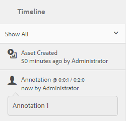

# Manage video assets {#managing-video-assets}

Learn how to manage and edit the video assets in Adobe Experience Manager (AEM) Assets. Also, if you are licensed to use Dynamic Media, see the [Dynamic Media Video documentation](video.md).

## Upload and preview video assets {#uploading-and-previewing-video-assets}

AEM Assets generates previews for video assets with the extension MP4. If the format of the asset is not MP4, install the FFmpeg pack to generate a preview. FFmpeg creates video renditions of type OGG and MP4. You can preview these renditions in the AEM Assets user interface.

1. In the Digital Assets folder (or sub-folders), navigate to the location where you want to add digital assets.
1. To upload the asset, tap **[!UICONTROL Create]** from the toolbar, then choose **[!UICONTROL Files]**. Alternatively, drop it directly in the assets area. See [Uploading assets](managing-assets-touch-ui.md#uploading-assets) for details around the upload operation.
1. To preview a video in the **[!UICONTROL Card]** view, tap the **[!UICONTROL Play]** button on the video asset.

   

   You can pause or play video in the **[!UICONTROL Card]** view only. The Play/Pause button is not available in the **[!UICONTROL List]** view.

1. Tap the **[!UICONTROL Edit]** icon on the card to preview the video in the **[!UICONTROL Details]** view.

   The video plays in the native video player of the browser. You can play, pause, control the volume, and zoom the video to full screen.

   

## Configuration to upload video assets that are larger than 2 GB {#configuration-to-upload-video-assets-that-are-larger-than-gb}

By default, the AEM Assets Touch UI does not let you upload any assets that are larger than 2 GB because of a file size limit. However, you can overwrite this limit by going into CRXDE Lite and creating a node under the `/apps` directory. The node must have the same node name, directory structure, and comparable node properties of order.

>[!NOTE]
>
>The AEM Classic user interface does not have a two gigabyte file size limit restriction. Also, end-to-end workflow for large video is not fully supported.

To configure a higher file size limit, perform the following steps in the `/apps` directory.

1. In AEM, tap **[!UICONTROL Tools > General > CRXDE Lite]**.
1. In the **[!UICONTROL CRXDE Lite]** page, in the directory window on the left, navigate to `/libs/dam/gui/content/assets/jcr:content/actions/secondary/create/items/fileupload`. To see the directory window, touch `>>` icon.
1. From the toolbar, tap **[!UICONTROL Overlay Node]**. Alternatively, select **[!UICONTROL Overlay Node]** from the context menu.
1. In the **[!UICONTROL Overlay Node]** dialog, tap **[!UICONTROL OK]**.

   

1. Refresh the browser. The overlay node `/jcr_root/apps/dam/gui/content/assets/jcr:content/actions/secondary/create/items/fileupload` is selected.
1. In the **[!UICONTROL Properties]** tab, enter the appropriate value in bytes to increase the size limit to the desired size. For example, enter the following value to increase the size limit to 30 GB:

   `{sizeLimit : "32212254720"}`

1. From the toolbar, tap **[!UICONTROL Save All]**.
1. In AEM, tap **[!UICONTROL Tools > Operations > Web Console]**.
1. On the **[!UICONTROL Adobe Experience Manager Web Console Bundles]** page, under the **[!UICONTROL Name]** column of the table, locate and tap **[!UICONTROL Adobe Granite Workflow External Process Job Handler]**.
1. In the **[!UICONTROL Adobe Granite Workflow External Process Job Handler]** page, set the seconds for both **[!UICONTROL Default Timeout]** and **[!UICONTROL Max Timeout]** fields to `18000` (five hours).
1. Tap **[!UICONTROL Save]**.
1. In AEM, tap **[!UICONTROL Tools > Workflow > Models]**.
1. On the **[!UICONTROL Workflow Models]** page, select **[!UICONTROL Dynamic Media Encode Video]**, then tap **[!UICONTROL Edit]**.
1. On the **[!UICONTROL Workflow]** page, double-tap the **[!UICONTROL Dynamic Media Video Service Process]** component.
1. In the **[!UICONTROL Step Properties]** dialog box, under the **[!UICONTROL Common]** tab, expand **[!UICONTROL Advanced Settings]**.
1. In the **[!UICONTROL Timeout]** field, specify a value of `18000`, then tap **[!UICONTROL OK]** to return to the **[!UICONTROL Dynamic Media Encode Video]** workflow page.
1. Near the top of the page, below the **[!UICONTROL Dynamic Media Encode Video]** page title, tap **[!UICONTROL Save]**.

## Publish video assets {#publishing-video-assets}

After your video assets are published, they are available to you for including in a web page by way of a URL or embedding on a web page. See [Publish assets](publishing-dynamicmedia-assets.md).

## Annotate video assets {#annotating-video-assets}

1. From the Assets console, tap the **[!UICONTROL Edit]** icon on the asset card to display the asset details page.
1. Tap the **[!UICONTROL Preview]** icon to play the video. 
1. To annotate the video, tap the **[!UICONTROL Annotate]** button. An annotation is added at the particular timepoint (frame) in the video.

   While annotating, you can draw on the canvas and include a comment with the drawing. Comments are automatically saved in Adobe Experience Manager Assets.

   

   To exit the annotation wizard, tap **[!UICONTROL Close]**.

1. To jump to a specific point in the video, specify the time in seconds in the text field and click **[!UICONTROL Jump]**. For example, to skip the first 10 seconds of video, enter `20` in the text field.

   

1. Click an annotation to view it in the timeline. Tap **[!UICONTROL Delete]** to remove the annotation from the timeline.

   
