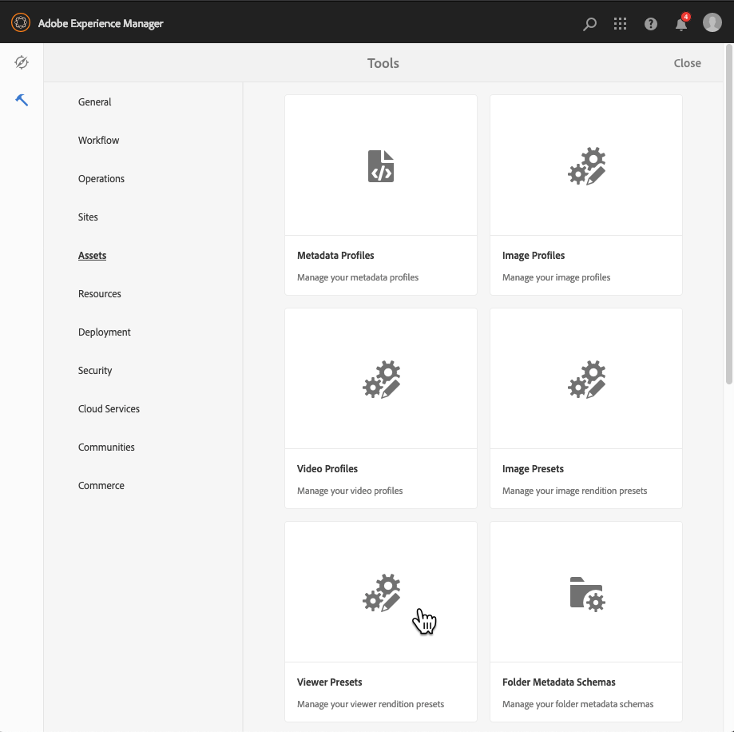
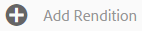
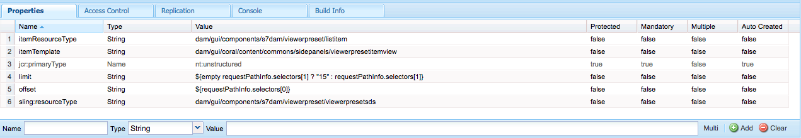

# Manage Viewer Presets{#managing-viewer-presets}

A Viewer Preset is a collection of settings that determine how users view rich-media assets on their computer screens and mobile devices. If you are an administrator, you can create Viewer Presets. Settings are available for an array of viewer configuration options. For example, you can change the viewer display size or zoom behavior.

For instructions on creating and customizing your own HTML5 viewer presets, see the Adobe Dynamic Media *HTML5 Viewer SDK API Documentation*. The SDK is available on the IS publish server embedded in the SDK itself. Each library version has its own SDK documentation included.

Path: `<scene7_domain>/s7sdk/<library_version>/docs/jsdocs/index.html`.  
For example, 3.10 SDK: [https://s7d1.scene7.com/s7sdk/3.10/docs/jsdoc/index.html](https://s7d1.scene7.com/s7sdk/3.10/docs/jsdoc/index.html)

See also the [Adobe Dynamic Media Viewers Reference Guide](https://experienceleague.adobe.com/docs/dynamic-media-developer-resources.html).

This section describes how to create, edit, and manage viewer presets. You can apply a viewer preset to an asset anytime you preview it. See [Applying Viewer Presets](#applying-a-viewer-preset-to-an-asset).

>[!NOTE]
>
>Editing any *predefined, out-of-the-box viewer presets* is not a supported scenario. If you attempt to edit an out-of-the-box viewer preset, you are prompted to save the viewer preset using a new name.

## Keyboard accessibility for viewers {#keyboard-accessibility-for-viewers}

All out-of-the-box viewers support keyboard accessibility.

See also [Keyboard accessibility and navigation](https://experienceleague.adobe.com/docs/dynamic-media-developer-resources/library/c-keyboard-accessibility.html).

## Manage Viewer Presets {#managing-viewer-presets-1}

You can add, edit, delete, publish, unpublish, and preview viewer presets in Adobe Experience Manager by tapping **[!UICONTROL Tools]** (hammer icon) > **[!UICONTROL Assets]** > **[!UICONTROL Viewer Presets]**.

>[!NOTE]
>
>By default, the system shows 15 viewer presets when you select Viewers in an asset's detail view. You can increase this limit. See [Increasing the number of viewer presets that display](#increasing-the-number-of-viewer-presets-that-display).

### Viewer support for responsive designed web pages {#viewer-support-for-responsive-designed-web-pages}

Different web pages have different needs. For example, sometimes you want a web page that provides a link that opens the HTML5 Viewer in a separate browser window. In other cases, it may be necessary to embed the HTML5 Viewer directly on the hosting page. In the latter case, the web page may have a static layout. Or, it may be "responsive" and display differently on different devices or for different browser window sizes. To accommodate these needs, all the pre-defined, out-of-the-box HTML5 Viewers that come with Dynamic Media support both static web pages and responsive designed web pages.

See [Responsive Image library](https://experienceleague.adobe.com/docs/dynamic-media-developer-resources/image-serving-api/image-serving-api/responsive-static-image-library/c-about-responsive-static-image-library.html) for more information on how to embed responsive viewers onto your web pages.

>[!NOTE]
>
>Publish all out-of-the-box viewers before you first use them.
>See [Publishing Viewer Presets].(#publishing-viewer-presets)

### Viewer Preset system compatibility {#viewer-preset-system-compatibility}

All out-of-the-box Viewer Presets that come with Dynamic Media are fully compatible with the following systems:

* Desktops
* Apple iPhone
* Apple iPad
* Android&trade; Smartphone
* Android&trade; Tablet
* For video, additional support for MP4 playback is provided for [BlackBerry&reg;](https://developer.blackberry.com/devzone/develop/supported_media/bb_media_support_at_a_glance.html#kba1328730952678) and [Windows Phone](https://learn.microsoft.com/en-us/windows/uwp/audio-video-camera/supported-codecs).

### Rich media types for Viewer Presets {#rich-media-types-for-viewer-presets}

Administrators can add and customize the following rich media types when creating viewer presets.

<table>
 <tbody>
  <tr>
   <td><strong>Carousel Set</strong>  </td>
   <td>
Hotspots, or image maps, or both are added to a series of two or more images. A customer can pan the images left or right and then select a hotspot on an image for additional details or for purchasing directly from a website's category, home, or landing pages.
 </td>
  </tr>
  <tr>
   <td><strong>Dimensional</strong>  </td>
   <td>
Displays 3D scenes that let you turn, pan, zoom, or recenter your camera.
 </td>
  </tr>
  <tr>
   <td><strong>Flyout Zoom</strong></td>
   <td>
Displays a second image of the zoomed area next to the original image. There are no controls to use - users move the selection over the area they want to view.
 
When determining the complete bandwidth usage for this viewer, consider that both the main image and the flyout image are served in the viewer. The main image size (Stage Width and Height) and the Zoom Factor determine the flyout image size. To keep the flyout file size from becoming too large, balance these two values: if you have a large main image size, lower the Zoom Factor value. (The Flyout Width and Flyout Height determine the size of the flyout window, but not the size of the flyout image that is served into the viewer.)
 
For example, if your main image size is 350 by 350 pixels, with a Zoom Factor of 3, the resulting flyout image is 1050 by 1050 pixels. If your main image size is 300 by 300 pixels, with a Zoom Factor of 4, the flyout image is 1200 by 1200 pixels. Depending on the JPEG quality setting (recommended settings are between 80-90), you can decrease the file size significantly. Recommended zoom factors are 2.5 to 4, depending on the size of your main image.
 </td>
  </tr>
  <tr>
   <td><strong>Inline Zoom</strong></td>
   <td>Displays an image of the zoomed area within the original viewer. There are no controls to use. That is, users move the selection over the area they want to view.</td>
  </tr>
  <tr>
   <td><strong>Image Set</strong></td>
   <td>In the Image Set viewer, users can see different views or color variations of an item by selecting a thumbnail image. This viewer also offers zooming tools for examining images closely.</td>
  </tr>
  <tr>
   <td><strong>Interactive Image</strong></td>
   <td>Hotspots are added to portions of an image that a customer can then select for additional details or for purchasing directly from a website's category, home, or landing pages.</td>
  </tr>
  <tr>
   <td><strong>Interactive Video</strong></td>
   <td>Thumbnails are added to timeline segments in a video that a customer can then select for additional details or for purchasing directly from a website's category, home, or landing pages.</td>
  </tr>
  <tr>
   <td><strong>Mixed Media</strong></td>
   <td>Displays different types of media in one viewer. You can include spin sets, image set, images, and videos.</td>
  </tr>
  <tr>
   <td><strong>Panoramic Image</strong></td>
   <td>
The Panoramic Image and PanoramicVR viewers render spherical panoramic images to immerse users in a 360° viewing experience of a room, property, location, or landscape.
 
For an uploaded image to qualify as a spherical panorama, it must have either one or both of the following:

    <ul>
     <li>An aspect ratio of 2:1.</li>
     <li>Tagged with the keywords <code>equirectangular</code>, or <code>spherical</code> and <code>panorama</code>, or <code>spherical </code>and <code>panoramic</code>. See <a href="/help/sites-authoring/tags.md">Using Tags</a>.</li>
    </ul> 
Both the aspect ratio and keyword criteria apply to panoramic assets for the asset details page and the "Panoramic Media" WCM component.
 
<strong>Important</strong>: This viewer is only available in Dynamic Media - Scene7 mode.
 </td>
  </tr>
  <tr>
   <td><strong>Smart Crop Video</strong>  </td>
   <td>
Use this viewer to automatically detect and crop to the focal point in any video.
 </td>
  </tr>
  <tr>
   <td><strong>Spin Set</strong></td>
   <td>Provides multiple views of an image so users can turn the object to examine the different sides and angles.</td>
  </tr>
  <tr>
   <td><strong>360 Video</strong></td>
   <td>
Use the 360/VR Video viewer to render equirectangular video for an immersive viewing experience of a room, property, location, landscape, or medical procedure.
 
During playback on a flat display, the user has control of the viewing angle; playback on mobile devices usually applies their built-in gyroscopic controls.
 
The viewer includes native support for the delivery of 360 video assets. By default, no additional configuration is necessary for viewing or playback. You deliver 360 Video using standard video extensions such as .mp4, .mkv, and .mov. The most common codec is H.264.
 
<strong>Important</strong>: This viewer is only available in Dynamic Media - Scene7 mode.
 </td>
  </tr>
  <tr>
   <td><strong>Video</strong></td>
   <td>
Plays video using progressive or adaptive bitrate streaming. Adaptive bitrate streaming automatically performs device and bandwidth detection to serve the right quality video in the right format.
 </td>
  </tr>
  <tr>
   <td><strong>Vertical Zoom</strong></td>
   <td>
The Vertical Zoom viewer lets you maximize a product imagery viewing experience to give your users the best representation of a product. The vertical location of swatches does the following:

    <ul>
     <li>Ensures that swatches are "above the fold".  With horizontal swatches, depending on the user's desktop screen size, they are not visible until the user scrolled down the page. By placing the swatches vertically in the viewer, it ensures that they are visible no matter the user's screen size.</li>
     <li>Maximizes main image size.  With horizontal swatches, it is necessary to reserve space on the page to ensure that they are visible. This positioning decreased the size of the main image. With a vertical swatch layout, however, you do not need to allocate this space. As such, you can maximize the main image size.</li>
    </ul> </td>
  </tr>
  <tr>
   <td><strong>Zoom</strong></td>
   <td>Lets users zoom into the area by selecting it. Users can select controls to zoom in, zoom out, and reset the image to its default size.</td>
  </tr>
 </tbody>
</table>

### List of out-of-the-box Viewer Presets {#list-of-out-of-the-box-viewer-presets}

The following table identifies all pre-defined, out-of-box Viewer Presets that come with Dynamic Media.

See also [Live Demos](https://landing.adobe.com/en/na/dynamic-media/ctir-2755/live-demos.html).

For information about supported web browser and operating system versions for Viewers, you can review the Viewers Release Notes.

See "Viewers release notes" in the table of contents of the [Viewers Reference Guide](https://experienceleague.adobe.com/docs/dynamic-media-developer-resources.html).

>[!NOTE]
>
>All out-of-the-box viewer presets in Dynamic Media come activated (on) already, but you must publish them.
>See [Publishing Viewer Presets](#publishing-viewer-presets).
>
>Any new viewer presets that you create and add must be both activated *and *published.
>See [Activating or Deactivating Viewer Presets](#activating-or-deactivating-viewer-presets) and [Publishing Viewer Presets](#publishing-viewer-presets).

<table>
 <tbody>
  <tr>
   <td><strong>Viewer preset title</strong></td>
   <td><strong>Type</strong></td>
   <td><strong>CSS file name</strong>  </td>
  </tr>
  <tr>
   <td>Carousel_Dotted_dark</td>
   <td>Carousel_Set</td>
   <td><code>html5_carouselviewer_dotted_dark.css</code></td>
  </tr>
  <tr>
   <td>Carousel_Dotted_light</td>
   <td>Carousel_Set</td>
   <td><code>html5_carouselviewer_dotted_light.css</code></td>
  </tr>
  <tr>
   <td>Carousel_Numeric_dark</td>
   <td>Carousel_Set</td>
   <td><code>html5_carouselviewer_numeric_dark.css</code></td>
  </tr>
  <tr>
   <td>Carousel_Numeric_light</td>
   <td>Carousel_Set</td>
   <td><code>html5_carouselviewer_numeric_light.css</code></td>
  </tr>
  <tr>
   <td>Dimensional</td>
   <td>Dimensional</td>
   <td><code>html5_dimensionalviewer.css</code></td>
  </tr>
  <tr>
   <td>Flyout</td>
   <td>Flyout_Zoom</td>
   <td><code>html5_flyoutviewer.css</code></td>
  </tr>
  <tr>
   <td>ImageSet_dark</td>
   <td>Image Set</td>
   <td><code>html5_zoomviewer_dark.css</code></td>
  </tr>
  <tr>
   <td>ImageSet_light</td>
   <td>Image Set</td>
   <td><code>html5_zoomviewer_light.css</code></td>
  </tr>
  <tr>
   <td>InlineMixedMedia_dark</td>
   <td>Mixed_Media</td>
   <td><code>html5_inlinemixedmediaviewer_dark.css</code></td>
  </tr>
  <tr>
   <td>InlineMixedMedia_light</td>
   <td>Mixed_Media</td>
   <td><code>html5_inlinemixedmediaviewer_light.css</code></td>
  </tr>
  <tr>
   <td>InlineZoom</td>
   <td>Flyout_Zoom</td>
   <td><code>html5_inlinezoomviewer.css</code></td>
  </tr>
  <tr>
   <td>MixedMedia_dark</td>
   <td>Mixed_Media</td>
   <td><code>html5_mixedmediaviewer_dark.css</code></td>
  </tr>
  <tr>
   <td>MixedMedia_light</td>
   <td>Mixed_Media</td>
   <td><code>html5_mixedmediaviewer_light.css</code></td>
  </tr>
  <tr>
   <td>PanoramicImage</td>
   <td>Panoramic_Image</td>
   <td><code>html5_panoramicimage.css</code></td>
  </tr>
  <tr>
   <td>PanoramicImageVR</td>
   <td>Panoramic_Image</td>
   <td><code>html5_panoramicimage.css</code></td>
  </tr>
  <tr>
   <td>Shoppable_Banner</td>
   <td>Interactive_Image</td>
   <td><code>html5_interactiveimage.css</code></td>
  </tr>
  <tr>
   <td>Shoppable_Video_dark</td>
   <td>Interactive_Video</td>
   <td><code>html5_interactivevideoviewer_dark.css</code></td>
  </tr>
  <tr>
   <td>Shoppable_Video_light</td>
   <td>Interactive_Video</td>
   <td><code>html5_interactivevideovewer_light.css</code></td>
  </tr>
  <tr>
   <td>SmartCropVideo</td>
   <td>Smart_Crop_Video</td>
   <td><code>html5_smartcropvideoviewer.css</code></td>
  </tr>
  <tr>
   <td>SmartCropVideo_social</td>
   <td>Smart_Crop_Video</td>
   <td><code>html5_smartcropvideoviewersocial.css</code></td>
  </tr>
  <tr>
   <td>SpinSet_dark</td>
   <td>Spin_Set</td>
   <td><code>html5_spinviewer_dark.css</code></td>
  </tr>
  <tr>
   <td>SpinSet_light</td>
   <td>Spin_Set</td>
   <td><code>html5_spinviewer_light.css</code></td>
  </tr>
  <tr>
   <td>
Video
 
(Includes support for closed captioning)
 </td>
   <td>Video</td>
   <td><code>html5_videoviewer.css</code></td>
  </tr>
  <tr>
   <td>
Video360_social
 
(Includes basic video playback controls, video rendering is done in stereo mode, manual point-of-view control is off but gyroscopic control is on, and no social media features)
 </td>
   <td>Video_360</td>
   <td><code>html5_video360viewersocial.css</code></td>
  </tr>
  <tr>
   <td>
Video360VR
 
(Designed for end users who use virtual reality glasses. Includes basic video playback controls and social media features)
 </td>
   <td>Video_360</td>
   <td><code>html5_video360viewer.css</code></td>
  </tr>
  <tr>
   <td>
Video_social
 
(Includes support for closed captioning and social media)
 </td>
   <td>Video</td>
   <td><code>html5_videoviewersocial.css</code></td>
  </tr>
  <tr>
   <td>Zoom_dark  </td>
   <td>Zoom  </td>
   <td><code>html5_basiczoomviewer_dark.css</code></td>
  </tr>
  <tr>
   <td>Zoom_light  </td>
   <td>Zoom</td>
   <td><code>html5_basiczoomviewer_light.css</code></td>
  </tr>
  <tr>
   <td>ZoomVertical_dark  </td>
   <td>Vertical_Zoom</td>
   <td><code>html5_zoomverticalviewer_dark.css</code></td>
  </tr>
  <tr>
   <td>ZoomVertical_light</td>
   <td>Vertical_Zoom</td>
   <td><code>html5_zoomverticalviewer_light.css</code></td>
  </tr>
 </tbody>
</table>

### Supported mobile viewers gestures matrix {#supported-mobile-viewers-gestures-matrix}

The following table identifies the mobile viewer gestures that are supported on iOS, Android&trade; 2.x, and Android&trade; 3.x devices.

<table>
 <tbody>
  <tr>
   <td><strong>Gesture</strong></td>
   <td><strong>Flyout Zoom</strong></td>
   <td><strong>Zoom</strong></td>
   <td><strong>Spin</strong></td>
  </tr>
  <tr>
   <td>
<strong>Drag</strong>
 </td>
   <td>
Pans
 </td>
   <td>
Pans
 </td>
   <td>
Pans
 </td>
  </tr>
  <tr>
   <td>
<strong>Select</strong>
 </td>
   <td>
Shows flyout window
 </td>
   <td>
Shows or hides the user interface
 </td>
   <td>
Shows or hides the user interface
 </td>
  </tr>
  <tr>
   <td>
<strong>Double-tap</strong>
 </td>
   <td>
Does not apply
 </td>
   <td>
Zooms in or resets
 </td>
   <td>
Zooms in or resets
 </td>
  </tr>
  <tr>
   <td>
<strong>Pinch open</strong>
 </td>
   <td>
Does not apply
 </td>
   <td>
Zooms in (iOS and Android&trade; 3x only)
 </td>
   <td>
Zooms in (iOS and Android&trade; 3x only)
 </td>
  </tr>
  <tr>
   <td>
<strong>Pinch close</strong>
 </td>
   <td>
Does not apply
 </td>
   <td>
Zooms out (iOS and Android&trade; 3x only)
 </td>
   <td>
Zooms out (iOS and Android&trade; 3x only)
 </td>
  </tr>
  <tr>
   <td>
<strong>Swipe</strong>
 </td>
   <td>
Scrolls swatch bar
 </td>
   <td>
Scrolls images
 </td>
   <td>
Spins
 </td>
  </tr>
  <tr>
   <td>
<strong>Flick</strong>
 </td>
   <td>
Scrolls swatch bar
 </td>
   <td>
Scrolls images
 </td>
   <td>
Spins
 </td>
  </tr>
 </tbody>
</table>

## Increase the number of Viewer Presets that are displayed {#increasing-the-number-of-viewer-presets-that-display}

Experience Manager shows a wide variety viewer presets when viewing an asset from **[!UICONTROL Detail View]** > **[!UICONTROL Viewers]**. You can increase or decrease the number of viewers that display.

**Increase the number of Viewer Presets that are displayed:**

1. Navigate to CRXDE Lite ([https://localhost:4502/crx/de](https://localhost:4502/crx/de)).
1. Navigate to the viewer preset listing node at the following location:

   `/libs/dam/gui/coral/content/commons/sidepanels/viewerpresets/viewerpresetslist`

   

1. In the **[!UICONTROL limit]** property, change the **[!UICONTROL Value]**, which is set to 15 by default, to the desired number.
1. Navigate to the viewer preset datasource at `/libs/dam/gui/coral/content/commons/sidepanels/viewerpresets/viewerpresetslist/datasource`

   

1. In the limit property, change the number to the desired number, for example `{empty requestPathInfo.selectors[1] ? "20" : requestPathInfo.selectors[1]}`
1. Select **[!UICONTROL Save All]**.

## Create a Viewer Preset {#creating-a-new-viewer-preset}

Creating viewer presets lets you apply various settings to view and interact with assets. However, you do not need to create viewer presets. If you prefer, you can use the default, out-of-the-box viewer presets that already come with AEM Assets.

If you choose to create a viewer preset, after you save it, the viewer's state is automatically activated (set to **[!UICONTROL On]**) in the Viewer Presets page. This state means that it is visible in the Dynamic Media component and the Interactive Media component and whenever you preview an image or video.

Some viewer presets have exclusive settings that can affect the use and overall behavior of the viewer. Depending on the viewer preset you create, you may want to be aware of these special considerations.

See [Special considerations for creating an Interactive Viewer preset](#special-considerations-for-creating-an-interactive-viewer-preset).

See [Special considerations for creating a Carousel Banner Viewer preset](#special-considerations-for-creating-a-carousel-banner-viewer-preset).

**To create a Viewer Preset:**

1. In the upper-left corner of Experience Manager, select the Experience Manager logo, then in the left rail, select **[!UICONTROL Tools]** (hammer icon) > **[!UICONTROL Assets] > [!UICONTROL Viewer Presets]**.

   

1. On the Viewer Presets page, on the toolbar, select **[!UICONTROL Create]**.
1. In the **[!UICONTROL New Viewer Preset]** dialog box, in the **[!UICONTROL Preset Name]** field, enter the name of the new preset. Choose a name carefully&mdash;they are not editable after you select **[!UICONTROL Create]**.

   When you save the preset later in these steps, the name appears on the Viewer Presets page under the Preset Title column header.

1. On the Rich Media Type drop-down menu, select the type of viewer preset you want to create, then in the upper-right corner of the page, select **[!UICONTROL Create]**.

   See [Rich Media Types for Viewer Presets](#rich-media-types-for-viewer-presets).

1. On the Viewer Preset Editor page, select the **[!UICONTROL Appearance]** tab.
1. Do one of the following:

    * In the **[!UICONTROL Selected Type]** pull-down menu, select a component whose visual design you want to customize. Alternatively, you can select any visual element in the viewer to select it for configuration.

      The visual editor lets you see what effect a certain property has on a style. Set or adjust any property to instantly see what effect it has on the viewer using the sample to the left of the editor.

      The CSS styling properties for each type of viewer preset are described in the "Customizing *`<viewer name>`* Viewer" Help topic in the [Viewers Reference Guide](https://experienceleague.adobe.com/docs/dynamic-media-developer-resources.html). For example, if you are creating a viewer preset of the type `Mixed_Media`, see [Customizing Mixed Media Viewer](https://experienceleague.adobe.com/docs/dynamic-media-developer-resources/library/viewers-aem-assets-dmc/mixed-media/customing-mixed-media/c-html5-mixedmedia-viewer-customizingviewer.html) for a list and description of each property.

    * If you have defined style settings in a separate CSS file, you can upload the CSS file to AEM Assets. Select **[!UICONTROL Import CSS]** below the **[!UICONTROL Selected Type]** pull-down menu (if necessary, scroll the visual editor up to see it) so you can find the uploaded CSS file and associate it with the viewer preset.

      When you import a CSS file, the visual editor checks to see if the CSS uses the correct viewer markers. For example, if you are creating a Zoom viewer, all the CSS rules you import must be defined using its viewer class name `.s7mixedmediaviewer` defined on a parent viewer element.

      You can import arbitrary, handmade CSS as long as it properly defines the CSS markers for a given viewer. (CSS markers are described in any "Customzing *&lt;viewer name&gt;* Viewer" Help topic in the [Viewers Reference Guide](https://experienceleague.adobe.com/docs/dynamic-media-developer-resources.html). For example, if you want to read about CSS markers for the Zoom Viewer, see [Customizing Zoom Viewer](https://experienceleague.adobe.com/docs/dynamic-media-developer-resources/library/viewers-aem-assets-dmc/zoom/customizing-zoom/c-html5-20-zoom-viewer-customizingviewer.html).) It is possible, however, that the visual editor may not understand some CSS values. In such cases, the visual editor attempts to override the errors so that the CSS can still work.

   >[!NOTE]
   >
   >If you prefer to edit the CSS directly in its raw form, select **[!UICONTROL Show/Hide CSS]** below the Selected Type pull-down menu (if necessary, scroll the visual editor up to see it).
   >Like the visual editor, when you change a property directly in the CSS, you instantly see what effect it has on the viewer sample. And, that same property is automatically updated at the same time in the visual editor. As such, you can use the raw CSS editor, or the visual editor, or use both interchangeably.

   >[!NOTE]
   >
   >For button artwork, choose the 2x image and upload high-resolution art work. When working with interactive images and shoppable banners, you can also select from various out-of-the-box hotspot buttons.

1. (Optional) Near the top of the Edit Viewer Preset page, select **[!UICONTROL Desktop]**, **[!UICONTROL Tablet]**, or **[!UICONTROL Phone]** to uniquely define visual styles for different device and screen types.
1. On the Viewer Preset Editor page, select the **[!UICONTROL Behavior]** tab. Alternatively, you can select any visual element in the viewer to select it for configuration.
For example, for the *VideoPlayer* type, under **[!UICONTROL Modifiers]** > **[!UICONTROL Playback]**, you can select from one of three adaptive bitrate streaming options:

   * **[!UICONTROL dash]** - Videos stream as dash only. However, on Safari/iOS devices, you must select **[!UICONTROL hls]** as the type, instead.
   * **[!UICONTROL hls]** - Videos stream as hls only.
   * **[!UICONTROL auto]** - Best practice. The creation of DASH and HLS streams is storage optimized. Therefore, Adobe recommends that you always select **[!UICONTROL auto]** as the playback type. Videos stream as dash, hls, or progressive, as in the following playback order: 
     * If the browser supports DASH, then DASH streaming is used, first. 
     * If the browser does not support DASH, then HLS streaming is used, second.
     * If the browser does not support either DASH or HLS, then progressive playback is used, lastly.

   >[!NOTE]
   >
   >To see and use the **[!UICONTROL dash]** option, it must first be enabled by Adobe Technical Support on your account. See [Enable DASH on your account](/help/assets/video.md#enable-dash).

1. From the **[!UICONTROL Selected Type]** pull-down menu, select a component whose behaviors you want to change.

   Many components in the visual editor have a detailed description associated with it. These descriptions appear within blue boxes when you expand a component to reveal its associated parameters.

   Some Viewer types have components that let you specify Image Serving commands in an **[!UICONTROL IS Command]** text field. For a list of commands you can use, see the [Image Serving API Reference](https://experienceleague.adobe.com/docs/dynamic-media-developer-resources/image-serving-api/image-serving-api/c-is-home.html).

   >[!NOTE]
   >
   >**If you are using a touch device, such as a phone or tablet...**
   >
   >
   >After you type a value in the text field, select elsewhere in the user interface to submit the change and close the virtual keyboard. If you select Enter, no action occurs.

1. Near the upper-right corner of the page, select **[!UICONTROL Save]**.
1. Publish your new viewer preset so you can use it on your website.

   See [Publishing Viewer Presets](#publishing-viewer-presets).

   >[!IMPORTANT]
   >
   >For old videos that use an adaptive bitrate streaming profile, the URL continues to play as usual -- with HLS streaming -- until you [reprocess the video assets](/help/assets/processing-profiles.md#reprocessing-assets). After reprocessing, the same URL continues to work, but now with *both* DASH and HLS streaming enabled.

### Special considerations for creating an Interactive Viewer preset {#special-considerations-for-creating-an-interactive-viewer-preset}

**About Display Modes for image thumbnails in the panel**

When you create or edit an Interactive Video viewer preset, you have the choice of which Display Mode setting to use when you select `InteractiveSwatches` from the **[!UICONTROL Selected Component]** menu under the **[!UICONTROL Behavior]** tab. The display mode that you choose affects how and when thumbnails appear while the video is playing. You can choose either a `segment`display mode (default) or a `continuous` display mode.

<table>
 <tbody>
  <tr>
   <td><strong>Display Mode</strong></td>
   <td><strong>Description</strong></td>
  </tr>
  <tr>
   <td>Segment</td>
   <td>
<code>Segment </code>is the default display mode for the out-of-box Interactive Video Viewer presets <code>Shoppable_Video_light</code> and <code>Shoppable_Video_dark</code> and any Interactive Video Viewer presets that you create yourself.
 
In this mode, when there are fewer thumbnails assigned to a video segment than the number of visible spots in the display panel. Also, thumbnails from the next or previous subsegments are <i>not </i>pulled in to fill any empty spots in the panel. That is, it preserves the display of swatches that were assigned to the particular video segment.
 </td>
  </tr>
  <tr>
   <td>Continuous</td>
   <td>
In <code>continuous </code>display mode, if the number of thumbnails in a segment is less than the number that are visible in the panel, the viewer automatically includes the display of thumbnails from the next segment. Or, the viewer automatically includes the display of the thumbnails from the previous segment, in cases where the last thumbnail is displayed.
 
The <a href="/help/assets/interactive-videos.md">video in this topic</a> is an example of the <code>continuous </code>display mode.
 </td>
  </tr>
 </tbody>
</table>

**About auto scrolling behavior in the Interactive Video viewer**

The auto scroll behavior of thumbnails in the Interactive Video viewer functions independently of the display mode that you chose.

When you create or edit an interactive video viewer preset, you access Auto Scroll from the Behavior tab. In the Behavior tab, from the **[!UICONTROL Selected Components]** drop-down menu, select **[!UICONTROL InteractiveSwatches]**. The Auto Scroll check box is listed below the IS Command text field.

If you disable **[!UICONTROL Auto Scroll]** (clear the check box) in the viewer preset, during video playback by the user, the panel only displays the first thumbnail image for the entire length of the video. However, a user can manually scroll through the thumbnails using the up and down arrow icons, if desired.

When you enable (select) **[!UICONTROL Auto Scroll]** in the viewer preset, during video playback, thumbnail images assigned to a video segment scroll into view at the start of a segment. There are instances, however, where certain thumbnails within a segment display twice as long as other thumbnails before or after it. This behavior occurs because the number of thumbnails in a segment is greater than the number that are visible in the panel, and are not evenly divisible.

To illustrate, suppose you have one 30-second video segment. And, there are a total of nine thumbnails to display over the 30 seconds. Your browser is sized in such a way that there are four visible thumbnail positions in the display panel. The 30-second video time segment is divided into three subsegments. The following table shows the breakdown of which thumbnails are displayed for a given time subsegment:

| **Video subsegment** |**Subsegment time in seconds** |**Thumbnails that are visible in the panel** |
|---|---|---|
| 1 |0-10 |1, 2, 3, 4 |
| 2 |10-20 |4, 5, 6, 7 |
| 3 |20-30 |6, 7, 8, 9 |

Video subsegment 3 does not extend beyond the thumbnails that are assigned to it. Notice also that thumbnails 4, 6, and 7 are visible in the panel twice as long as the other thumbnails.

The logic that the viewer uses for how many thumbnails are displayed in the panel based on the number of available positions is as follows:

* Number of subsegments = round up to next subsegment (number of thumbnails / number of visible slots in the thumbnail panel, based on browser window size).
  Using the example in the table above, 9 thumbnails / 4 slots = 2.25; the viewer logic rounds it up to three subsegments.

* Number of thumbnails = round up to next thumbnail (number of thumbnails / number of video subsegments).
  Using the example in the table above, 9 thumbnails / 3 video subsegments = 3 thumbnails.

* Duration of subsegment = total video duration / number of video subsegments.
  Using the example in the table above, 30 seconds / 3 video subsegments = 10-second display of each video subsegment.

#### Special considerations for creating a Carousel Banner Viewer Presets {#special-considerations-for-creating-a-carousel-banner-viewer-preset}

When creating Carousel Banner viewer presets, changing the style of hotspots can be accessed as follows:

| |**Description** |**Actions** |
|---|---|---|
| **[!UICONTROL Hotspot Icon]** |Change the icon used for hotspot |To change the hotspot icon image, in the **[!UICONTROL Appearance]** tab, in **[!UICONTROL Selected Component]**, select **[!UICONTROL ImageMapEffect]**. Under **[!UICONTROL Icon]**, select **[!UICONTROL Background]** and in the **[!UICONTROL Image]** field navigate to the background image you want. |

## Activate or deactivate Viewer Presets {#activating-or-deactivating-viewer-presets}

The Viewer Presets that are available in the user interface depends on which ones are active in Author mode. By default, a viewer preset is "On" after you create it. If you toggle off the preset, you do not see it in Author mode. If the preset is published, it is always published regardless of whether it is toggled on or off. You may want to deactivate viewer presets if the list becomes too unwieldy or you do not want a viewer preset made available to use.

**To activate or deactivate Viewer Presets:**

1. In the upper-left corner of Experience Manager, select the Experience Manager logo, then in the left rail, select **[!UICONTROL Tools]** (hammer icon) > **[!UICONTROL Assets]** > **[!UICONTROL Viewer Presets]**.
1. On the Viewer Preset page, under the **[!UICONTROL State]** column header, select the toggle to activate or deactivate a viewer preset.

   Viewer presets that are activated have the toggle appear on the right, inside a blue box; deactivated viewer presets have the toggle appear on the left, inside a light gray box.

## Publish Viewer Presets {#publishing-viewer-presets}

Activating (or turning "On") the state of a viewer preset means that it is visible in the Dynamic Media component, the Interactive Media component, and whenever you view an asset.

However, to *deliver* an asset with a viewer preset, the viewer preset must be published as well. All viewer presets must be activated *and* published to obtain URL or embed code for an asset. Be sure you activate and publish all out-of-the-box viewer presets that come with Dynamic Media. Custom viewer presets that you create and add are auto-activated, but must also be published.

See [Activating or Deactivating Viewer Presets](#activating-or-deactivating-viewer-presets).

See also [Previewing Assets](/help/assets/previewing-assets.md).

**To publish Viewer Presets:**

1. In the upper-left corner of Experience Manager, select the Experience Manager logo, then in the left rail, select **[!UICONTROL Tools]** (hammer icon) > **[!UICONTROL Assets]** > **[!UICONTROL Viewer Presets]**.
1. Select one or more viewer presets that you want to publish.
1. On the toolbar, select the **[!UICONTROL Publish]** icon.

## Sort Viewer Presets {#sorting-viewer-presets}

1. In the upper-left corner of Experience Manager, select the Experience Manager logo, then in the left rail, select **[!UICONTROL Tools]** (hammer icon) > **[!UICONTROL Assets]** > **[!UICONTROL Viewer Presets]**.
1. Select **[!UICONTROL Preset Title]**, **[!UICONTROL Type]**, **[!UICONTROL Published]**, or **[!UICONTROL State]** to sort by that column heading. For example, select **[!UICONTROL Type]**  to sort the viewer preset types in alphabetical or reverse-alphabetical order.

## Edit Viewer Presets {#editing-viewer-presets}

Editing any *predefined, out-of-the-box viewer presets* is not a supported scenario. If you edit an out-of-the-box viewer preset, you are prompted to save it with a new name.

**To edit Viewer Presets:**

1. In the upper-left corner of Experience Manager, select the Experience Manager logo, then in the left rail, select **[!UICONTROL Tools]** (hammer icon) > **[!UICONTROL Asset]** > **[!UICONTROL Viewer Presets]**.
1. Select a preset by checking the box to the left of the viewer preset title.
1. On the toolbar, select **[!UICONTROL Edit]**.
1. On the **[!UICONTROL Viewer Preset Editor]** page, make the changes you want to the viewer preset, using the options found on the **[!UICONTROL Appearance]** and **[!UICONTROL Behavior]** tabs.

   From the **[!UICONTROL Appearance]** tab, near the upper-left corner of the Viewer Preset Editor page, select **[!UICONTROL Desktop]**, **[!UICONTROL Tablet]**, or **[!UICONTROL Phone]** to change the asset's presentation mode.

1. Near the upper-right corner of the page, do one of the following:

    * Select **[!UICONTROL Save]** to save your changes and return to the Viewer Preset page.
    * Select **[!UICONTROL Cancel]** to void any changes you made and return to the Viewer Preset page.

## Delete custom Viewer Presets {#deleting-custom-viewer-presets}

You can delete Viewer Presets that you have created and added to Dynamic Media.

**To delete custom Viewer Presets:**

1. In the upper-left corner of Experience Manager, select the Experience Manager logo, then in the left rail, select **[!UICONTROL Tools]** (hammer icon) **[!UICONTROL Assets]** > **[!UICONTROL Viewer Presets]**.
1. On the Viewer Presets page, check a Preset Title, and then select the **[!UICONTROL Trash]** icon.
1. Select **[!UICONTROL Delete]**.

## Apply a Viewer Preset to an asset {#applying-a-viewer-preset-to-an-asset}

If you have already published both the asset and the selected viewer, the **[!UICONTROL URL]** and **[!UICONTROL Embed]** buttons appear after you select a viewer preset.

**To apply a Viewer Preset to an asset:**

1. Open the asset and near the upper-left corner of the page, select the drop-down menu, then select **[!UICONTROL Viewers]**.

   >[!NOTE]
   >
   >If you have already published both the asset and the selected viewer, the **[!UICONTROL URL]** and **[!UICONTROL Embed]** buttons appear after you select a viewer preset.

1. Select a viewer preset from the left pane so you can apply it to the asset.

   You can [copy the URL to share](/help/assets/linking-urls-to-yourwebapplication.md) with other users.

## Deliver assets with Viewer Presets {#delivering-assets-with-viewer-presets}

To get the URLs for Viewer Presets, see [Linking URLs to your Web application](/help/assets/linking-urls-to-yourwebapplication.md). See also [Embedding the Video Viewer on a Web Page](/help/assets/embed-code.md).

If you are using Experience Manager as your WCM, you can add assets using the viewer presets directly on the page. See [Adding Dynamic Media Assets to Pages](/help/assets/adding-dynamic-media-assets-to-pages.md).
