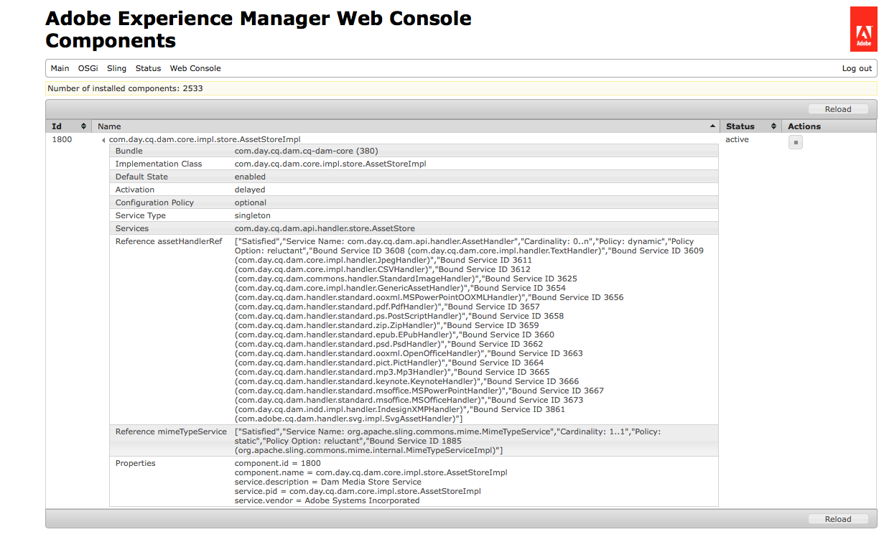

# Process assets using media handlers and workflows {#processing-assets-using-media-handlers-and-workflows}

[!DNL Adobe Experience Manager Assets] comes with a set of default workflows and media handlers to process assets. A workflow defines the tasks to be executed on the assets, then delegates the specific tasks to the media handlers, for example, thumbnail generation or metadata extraction.

A workflow can be configured to automatically execute when an asset of a particular MIME type is uploaded. The processing steps are defined in terms of a series of [!DNL Assets] media handlers. [!DNL Experience Manager] provides some [built-in handlers](#default-media-handlers), and extra ones can be either [custom developed](#creating-a-new-media-handler) or defined by delegating the process to a [command-line tool](#command-line-based-media-handler).

Media handlers are services in [!DNL Assets] that perform specific actions on assets. For example, when an MP3 audio file is uploaded into [!DNL Experience Manager], a workflow triggers an MP3 handler that extracts the metadata and generates a thumbnail. Media handlers are used with workflows. Most common MIME types are supported within [!DNL Experience Manager]. Specific tasks can be performed on assets by either extending or creating workflows, extending or creating media handlers, or disabling and enabling media handlers.

>[!NOTE]
>
>See the [Supported Asset formats](assets-formats.md) page for a description of all the formats supported by [!DNL Assets] and features supported for each format.

## Default media handlers {#default-media-handlers}

The following media handlers are available within [!DNL Assets] and handle the most common MIME types:

<!-- TBD: Java versions should not be set to 1.5. Must be updated.
-->

| Handler name | Service Name (in the system console) | Supported MIME types |
|--------------|--------------------------------------|----------------------|
| [!UICONTROL TextHandler] | com.day.cq.dam.core.impl.handler.TextHandler | text/plain |
| [!UICONTROL PdfHandler] | com.day.cq.dam.handler.standard.pdf.PdfHandler | <ul><li>application/pdf</li><li>application/illustrator</li></ul> |
| [!UICONTROL JpegHandler] | com.day.cq.dam.core.impl.handler.JpegHandler | image/jpeg |
| [!UICONTROL Mp3Handler] | com.day.cq.dam.handler.standard.mp3.Mp3Handler | audio/mpeg<br><b>Important</b> - An uploaded MP3 file is [processed using a third-party library](https://www.zxdr.it/programmi/SistEvolBDD/LibJava/doc/de/vdheide/mp3/MP3File.html). The library calculates a non-accurate approximate length if the MP3 has variable bitrate (VBR). |
| [!UICONTROL ZipHandler] | com.day.cq.dam.handler.standard.zip.ZipHandler | <ul><li>application/java-archive </li><li> application/zip</li></ul> |
| [!UICONTROL PictHandler] | com.day.cq.dam.handler.standard.pict.PictHandler | image/pict |
| [!UICONTROL StandardImageHandler] | com.day.cq.dam.core.impl.handler.StandardImageHandler | <ul><li>image/gif </li><li> image/png </li> <li>application/photoshop </li> <li>image/jpeg </li><li> image/tiff </li> <li>image/x-ms-bmp </li><li> image/bmp</li></ul> |
| [!UICONTROL MSOfficeHandler] | com.day.cq.dam.handler.standard.msoffice.MSOfficeHandler | application/msword |
| [!UICONTROL MSPowerPointHandler] | com.day.cq.dam.handler.standard.msoffice.MSPowerPointHandler | application/vnd.ms-powerpoint |
| [!UICONTROL OpenOfficeHandler] | com.day.cq.dam.handler.standard.ooxml.OpenOfficeHandler | <ul><li>application/vnd.openxmlformats-officedocument.wordprocessingml.document</li><li> application/vnd.openxmlformats-officedocument.spreadsheetml.sheet</li><li> application/vnd.openxmlformats-officedocument.presentationml.presentation</li></ul> |
| [!UICONTROL EPubHandler] | com.day.cq.dam.handler.standard.epub.EPubHandler | application/epub+zip |
| [!UICONTROL GenericAssetHandler] | com.day.cq.dam.core.impl.handler.GenericAssetHandler | fallback in case no other handler was found to extract data from an asset |

{style="table-layout:auto"}

All the handlers perform the following tasks:

* extracting all available metadata from the asset.
* creating a thumbnail image of an asset.

To view the active media handlers:

1. In your browser, navigate to `https://localhost:4502/system/console/components`.
1. Click `com.day.cq.dam.core.impl.store.AssetStoreImpl`.
1. A list with all the active media handlers is displayed. For example:



## Use media handlers in workflows to perform tasks on assets {#using-media-handlers-in-workflows-to-perform-tasks-on-assets}

Media handlers are services that are used with workflows.

[!DNL Experience Manager] has some default workflows to process assets. To view them, open the Workflow console and click the **[!UICONTROL Models]** tab: the workflow titles that start with [!DNL Assets] are the assets-specific ones.

Existing workflows can be extended and new ones can be created to process assets according to specific requirements.

The following example shows how to enhance the **[!UICONTROL AEM Assets Synchronization]** workflow so that sub-assets are generated for all assets except PDF documents.

### Disable or enable a media handler {#disabling-enabling-a-media-handler}

The media handlers can be disabled or enabled through the Apache Felix Web Management Console. When the media handler is disabled, its tasks are not performed on the assets.

To enable/disable a media handler:

1. In your browser, navigate to `https://<host>:<port>/system/console/components`.
1. Click **[!UICONTROL Disable]** next to the name of the media handler. For example: `com.day.cq.dam.handler.standard.mp3.Mp3Handler`.
1. Refresh the page: an icon is displayed beside the media handler indicating it is disabled.
1. To enable the media handler, click **[!UICONTROL Enable]** next to the name of the media handler.

### Create a media handler {#creating-a-new-media-handler}

To support a new media type or to execute specific tasks on an asset, it is necessary to create a media handler. This section describes how to proceed.

#### Important classes and interfaces {#important-classes-and-interfaces}

The best way to start an implementation is to inherit from a provided abstract implementation that takes care of most things and provides reasonable default behavior: the `com.day.cq.dam.core.AbstractAssetHandler` class.

This class already provides an abstract service descriptor. So if you inherited from this class and use the maven-sling-plugin, make sure that you set the inherit flag to `true`.

Implement the following methods:

* `extractMetadata()`: extracts all available metadata.
* `getThumbnailImage()`: creates a thumbnail image out of the passed asset.
* `getMimeTypes()`: returns the asset MIME types.

Here is an example template:

```Java
package my.own.stuff; /** * @scr.component inherit="true" * @scr.service */ public class MyMediaHandler extends com.day.cq.dam.core.AbstractAssetHandler { // implement the relevant parts }
```

The interface and classes include:

* `com.day.cq.dam.api.handler.AssetHandler` interface: This interface describes the service which adds support for specific MIME types. Adding a MIME type requires to implement this interface. The interface contains methods for importing and exporting the specific documents, for creating thumbnails and extracting metadata.
* `com.day.cq.dam.core.AbstractAssetHandler` class: This class serves as basis for all other asset handler implementations and provides common used functionality.
* `com.day.cq.dam.core.AbstractSubAssetHandler` class:
  * This class serves as basis for all other asset handler implementations and provides commonly used functionality plus commonly used functionality for subasset extraction.
  * The best way to start an implementation is to inherit from a provided abstract implementation that takes care of most things and provides reasonable default behavior: the com.day.cq.dam.core.AbstractAssetHandler Class.
  * This class already provides an abstract service descriptor. So if you inherited from this class and use the maven-sling-plugin, make sure that you set the inherit flag to true.

The following methods must be implemented:

* `extractMetadata()`: this method extracts all available metadata.
* `getThumbnailImage()`: this method creates a thumbnail image out of the passed asset.
* `getMimeTypes()`: this method returns the asset MIME types.

Here is an example template:

package my.own.stuff; /&ast;&ast; &ast; @scr.component inherit="true" &ast; @scr.service &ast;/ public class MyMediaHandler extends com.day.cq.dam.core.AbstractAssetHandler { // implement the relevant parts }

The interface and classes include:

* `com.day.cq.dam.api.handler.AssetHandler` interface: This interface describes the service which adds support for specific MIME types. Adding a MIME type requires to implement this interface. The interface contains methods for importing and exporting the specific documents, for creating thumbnails and extracting metadata.
* `com.day.cq.dam.core.AbstractAssetHandler` class: This class serves as basis for all other asset handler implementations and provides common used functionality.
* `com.day.cq.dam.core.AbstractSubAssetHandler` class: This class serves as basis for all other asset handler implementations and provides common used functionality plus common used functionality for subasset extraction.

#### Example: create a specific text handler {#example-create-a-specific-text-handler}

In this section, you create a specific Text Handler that generates thumbnails with a watermark.

Proceed as follows:

Refer to [Development Tools](../sites-developing/dev-tools.md) to install and set up Eclipse with a [!DNL Maven] plugin and for setting up the dependencies that are needed for the [!DNL Maven] project.

After you perform the following procedure, when you upload a TXT file into [!DNL Experience Manager], the file's metadata are extracted and two thumbnails with a watermark are generated.

1. In Eclipse, create `myBundle` [!DNL Maven] project:

    1. In the Menu bar, click **[!UICONTROL File]** > **[!UICONTROL New]** > **[!UICONTROL Other]**.
    1. In the dialog box, expand the [!DNL Maven] folder, select the [!DNL Maven] project, then click **[!UICONTROL Next]**.
    1. Check the Create a simple project box and the Use default Workspace location box, then click **[!UICONTROL Next]**.
    1. Define a [!DNL Maven] project:

        * Group Id: `com.day.cq5.myhandler`.
        * Artifact Id: myBundle.
        * Name: My [!DNL Experience Manager] bundle.
        * Description: This is my [!DNL Experience Manager] bundle.

    1. Click **[!UICONTROL Finish]**.

1. Set the [!DNL Java&trade;] compiler to version 1.5:

    1. Right-click the `myBundle` project, select [!UICONTROL Properties].
    1. Select [!UICONTROL Java&trade; Compiler] and set following properties to 1.5:

        * Compiler compliance level
        * Generated .class files compatibility
        * Source compatibility

    1. Click **[!UICONTROL OK]**. In the dialog window, click **[!UICONTROL Yes]**.

1. Replace the code in the `pom.xml` file with the following code:

   ```xml
   <project xmlns="https://maven.apache.org/POM/4.0.0" xmlns:xsi="https://www.w3.org/2001/XMLSchema-instance"
    xsi:schemaLocation="https://maven.apache.org/POM/4.0.0 https://maven.apache.org/maven-v4_0_0.xsd">
    <modelVersion>4.0.0</modelVersion>
    <!-- ====================================================================== -->
    <!-- P A R E N T P R O J E C T D E S C R I P T I O N -->
    <!-- ====================================================================== -->
    <parent>
     <groupId>com.day.cq.dam</groupId>
     <artifactId>dam</artifactId>
     <version>5.2.14</version>
     <relativePath>../parent</relativePath>
    </parent>
    <!-- ====================================================================== -->
    <!-- P R O J E C T D E S C R I P T I O N -->
    <!-- ====================================================================== -->
    <groupId>com.day.cq5.myhandler</groupId>
    <artifactId>myBundle</artifactId>
    <name>My CQ5 bundle</name>
    <version>0.0.1-SNAPSHOT</version>
    <description>This is my CQ5 bundle</description>
    <packaging>bundle</packaging>
    <!-- ====================================================================== -->
    <!-- B U I L D D E F I N I T I O N -->
    <!-- ====================================================================== -->
    <build>
     <plugins>
      <plugin>
       <groupId>org.apache.felix</groupId>
       <artifactId>maven-scr-plugin</artifactId>
      </plugin>
      <plugin>
       <groupId>org.apache.sling</groupId>
       <artifactId>maven-sling-plugin</artifactId>
       <configuration>
        <slingUrlSuffix>/libs/dam/install/</slingUrlSuffix>
       </configuration>
      </plugin>
      <plugin>
       <groupId>org.apache.felix</groupId>
       <artifactId>maven-bundle-plugin</artifactId>
       <extensions>true</extensions>
       <configuration>
        <instructions>
         <Bundle-Category>cq5</Bundle-Category>
         <Export-Package> com.day.cq5.myhandler </Export-Package>
        </instructions>
       </configuration>
      </plugin>
     </plugins>
    </build>
    <!-- ====================================================================== -->
    <!-- D E P E N D E N C I E S -->
    <!-- ====================================================================== -->
    <dependencies>
     <dependency>
      <groupId>com.day.cq.dam</groupId>
      <artifactId>cq-dam-api</artifactId>
      <version>5.2.10</version>
      <scope>provided</scope>
     </dependency>
     <dependency>
      <groupId>com.day.cq.dam</groupId>
      <artifactId>cq-dam-core</artifactId>
      <version>5.2.10</version>
      <scope>provided</scope>
     </dependency>
     <dependency>
      <groupId>com.day.cq</groupId>
      <artifactId>cq-commons</artifactId>
     </dependency>
     <dependency>
      <groupId>javax.jcr</groupId>
      <artifactId>jcr</artifactId>
     </dependency>
     <dependency>
      <groupId>org.apache.felix</groupId>
      <artifactId>org.osgi.compendium</artifactId>
     </dependency>
     <dependency>
      <groupId>org.slf4j</groupId>
      <artifactId>slf4j-api</artifactId>
     </dependency>
     <dependency>
      <groupId>commons-lang</groupId>
      <artifactId>commons-lang</artifactId>
     </dependency>
     <dependency>
      <groupId>commons-collections</groupId>
      <artifactId>commons-collections</artifactId>
     </dependency>
     <dependency>
      <groupId>commons-io</groupId>
      <artifactId>commons-io</artifactId>
     </dependency>
     <dependency>
      <groupId>com.day.commons</groupId>
      <artifactId>day-commons-gfx</artifactId>
     </dependency>
     <dependency>
      <groupId>com.day.commons</groupId>
      <artifactId>day-commons-text</artifactId>
     </dependency>
     <dependency>
      <groupId>com.day.cq.workflow</groupId>
      <artifactId>cq-workflow-api</artifactId>
     </dependency>
     <dependency>
      <groupId>com.day.cq.wcm</groupId>
      <artifactId>cq-wcm-foundation</artifactId>
      <version>5.2.22</version>
     </dependency>
    </dependencies>
   ```

1. Create the package `com.day.cq5.myhandler` that contains the [!DNL Java&trade;] classes under `myBundle/src/main/java`:

    1. Under myBundle, right-click `src/main/java`, select New, then Package.
    1. Name it `com.day.cq5.myhandler` and click Finish.

1. Create the [!DNL Java&trade;] class `MyHandler`:

    1. In [!DNL Eclipse], under `myBundle/src/main/java`, right-click the `com.day.cq5.myhandler` package. Select [!UICONTROL New], then [!UICONTROL Class].
    1. In the dialog window, name the [!DNL Java&trade;] class `MyHandler` and click [!UICONTROL Finish]. [!DNL Eclipse] creates and opens the file `MyHandler.java`.
    1. In `MyHandler.java`, replace the existing code with the following and then save the changes:

   ```java
   package com.day.cq5.myhandler;
   import java.awt.Color;
   import java.awt.Rectangle;
   import java.awt.image.BufferedImage;
   import java.io.IOException;
   import java.io.InputStream;
   import java.io.InputStreamReader;
   import javax.jcr.Node;
   import javax.jcr.RepositoryException;
   import javax.jcr.Session;
   import org.apache.commons.io.IOUtils;
   import org.slf4j.Logger;
   import org.slf4j.LoggerFactory;
   import com.day.cq.dam.api.metadata.ExtractedMetadata;
   import com.day.cq.dam.core.AbstractAssetHandler;
   import com.day.image.Font;
   import com.day.image.Layer;
   import com.day.cq.wcm.foundation.ImageHelper;

   /**
    * The <code>MyHandler</code> can extract text files
    * @scr.component inherit="true" immediate="true" metatype="false"
    * @scr.service
    *
    **/

   public class MyHandler extends AbstractAssetHandler {
    /** * Logger instance for this class. */
    private static final Logger log = LoggerFactory.getLogger(MyHandler.class);
    /** * Music icon margin */
    private static final int MARGIN = 10;
    /** * @see com.day.cq.dam.api.handler.AssetHandler#getMimeTypes() */
    public String[] getMimeTypes() {
     return new String[] {"text/plain"};
    }

    public ExtractedMetadata extractMetadata(Node asset) {
     ExtractedMetadata extractedMetadata = new ExtractedMetadata();
     InputStream data = getInputStream(asset);
     try {
      // read text data
      InputStreamReader reader = new InputStreamReader(data);
      char[] buffer = new char[4096];
      String text = "";
      while (reader.read(buffer) != -1) {
       text += new String(buffer);
      }
      reader.close();
      long wordCount = this.wordCount(text);
      extractedMetadata.setProperty("text", text);
      extractedMetadata.setMetaDataProperty("Word Count",wordCount);
      setMimetype(extractedMetadata, asset);
     } catch (Throwable t) {
      log.error("handling error: " + t.toString(), t);
     } finally {
      IOUtils.closeQuietly(data);
     }
     return extractedMetadata; }
    // ----------------------< helpers >----------------------------------------
    protected BufferedImage getThumbnailImage(Node node) {
     ExtractedMetadata metadata = extractMetadata(node);
     final String text = (String) metadata.getProperty("text");
     // create text layer
     final Layer layer = new Layer(500, 600, Color.WHITE);
     layer.setPaint(Color.black);
     Font font = new Font("Arial", 12);
     String displayText = this.getDisplayText(text, 600, 12);
     if(displayText!=null && displayText.length() > 0) {
      // commons-gfx Font class would throw IllegalArgumentException on empty or null text
      layer.drawText(10, 10, 500, 600, displayText, font, Font.ALIGN_LEFT, 0, 0);
     }
     // create watermark and merge with text layer
     Layer watermarkLayer;
     try {
      final Session session = node.getSession();
      watermarkLayer = ImageHelper.createLayer(session, "/content/dam/we-retail/en/products/apparel/gloves/Gloves.jpg");
      watermarkLayer.setX(MARGIN);
      watermarkLayer.setY(MARGIN);
      layer.merge(watermarkLayer);
     } catch (RepositoryException e) {
      // TODO Auto-generated catch block
      e.printStackTrace();
     } catch (IOException e) {
      // TODO Auto-generated catch block
      e.printStackTrace(); }
     layer.crop(new Rectangle(510, 600));
     return layer.getImage(); }
    // ---------------< private >-----------------------------------------------
    /**
     * This method cuts lines if the text file is too long..
     * * @param text
     * * text to check
     * * @param height
     * * text box height (px)
     * * @param fontheight
     * * font height (px)
     * * @return the text which will fit into the box
     */
    private String getDisplayText(String text, int height, int fontheight) {
     String trimmedText = text.trim();
     int numOfLines = height / fontheight;
     String lines[] = trimmedText.split("\n");
     if (lines.length <= numOfLines) {
      return trimmedText;
     } else {
      String cuttetText = "";
      for (int i = 0; i < numOfLines; i++) {
       cuttetText += lines[i] + "\n";
      }
      return cuttetText;
     }
    }
    /**
     * * This method counts the number of words in a string
     * * @param text the String whose words would like to be counted
     * * @return the number of words in the string
     * */
    private long wordCount(String text) {
     // We need to keep track of the last character, if we have two whitespaces in a row we do not want to double count.
     // The starting of the document is always a whitespace.
     boolean prevWhiteSpace = true;
     boolean currentWhiteSpace = true;
     char c; long numwords = 0;
     int j = text.length();
     int i = 0;
     while (i < j) {
      c = text.charAt(i++);
      if (c == 0) { break; }
      currentWhiteSpace = Character.isWhitespace(c);
      if (currentWhiteSpace && !prevWhiteSpace) { numwords++; }
      prevWhiteSpace = currentWhiteSpace;
     }
     // If we do not end with a whitespace then we need to add one extra word.
     if (!currentWhiteSpace) { numwords++; }
     return numwords;
    }
   }
   ```

1. Compile the [!DNL Java&trade;] class and create the bundle:

    1. Right-click the `myBundle` project, select **[!UICONTROL Run As]**, then **[!UICONTROL Maven Install]**.
    1. The bundle `myBundle-0.0.1-SNAPSHOT.jar` (containing the compiled class) is created under `myBundle/target`.

1. In CRX explorer, create a node under `/apps/myApp`. Name = `install`, Type = `nt:folder`.
1. Copy the bundle `myBundle-0.0.1-SNAPSHOT.jar` and store it under `/apps/myApp/install` (for example, with WebDAV). The new text handler is now active in [!DNL Experience Manager].
1. In your browser, open the [!UICONTROL Apache Felix Web Management Console]. Select the [!UICONTROL Components] tab and disable the default text handler `com.day.cq.dam.core.impl.handler.TextHandler`.

## Command-Line based media handler {#command-line-based-media-handler}

[!DNL Experience Manager] enables you to run any command-line tool within a workflow to convert assets (such as [!DNL ImageMagick]) and to add the new rendition to the asset. Only install the command-line tool on the disk hosting the [!DNL Experience Manager] server, and to add and configure a process step to the workflow. The invoked process, called `CommandLineProcess`, also filters according to specific MIME types and to create multiple thumbnails based on the new rendition.

The following conversions can be automatically run and stored within [!DNL Assets]:

* EPS and AI transformation using `https://www.imagemagick.org/script/index.php` and [Ghostscript](https://www.ghostscript.com/).
* FLV video transcoding using [FFmpeg](https://ffmpeg.org/).
* MP3 encoding using [LAME](https://lame.sourceforge.io/).
* Audio processing using [SOX](https://sourceforge.net/projects/sox/).

>[!NOTE]
>
>On non-Windows systems, the FFmpeg tool returns an error while generating renditions for a video asset that has a single quote (') in its filename. If the name of your video file includes a single quote, remove it before uploading to [!DNL Experience Manager].

The `CommandLineProcess` process performs the following operations in the listed order:

* Filters the file according to specific MIME types, if specified.
* Creates a temporary directory on the disk hosting the [!DNL Experience Manager] server.
* Streams the original file to the temporary directory.
* Executes the command defined by the arguments of the step. The command is being executed within the temporary directory with the permissions of the user running [!DNL Experience Manager].
* Streams the result back into the rendition folder of the [!DNL Experience Manager] server.
* Deletes the temporary directory.
* Creates thumbnails based on those renditions, if specified. The number and the dimensions of the thumbnails are defined by the arguments of the step.

### An example using [!DNL ImageMagick] {#an-example-using-imagemagick}

The following example shows you how to set up the command-line process step so that every time an asset with the miMIME e-type GIF or TIFF is added to `/content/dam` on the [!DNL Experience Manager] server, a flipped image of the original is created. Three more thumbnails 140x100, 48x48, and 10x250 are also created.

To do this, use [!DNL ImageMagick]. [!DNL ImageMagick] is a free, command-line software used to create, edit, and compose bitmap images.

Install [!DNL ImageMagick] on the disk hosting the [!DNL Experience Manager] server:

1. Install [!DNL ImageMagick]: See `https://www.imagemagick.org/script/download.php` website.
1. Set up the tool so that one the command line, you can run `convert`.
1. To see if the tool is installed properly, run the following command `convert -h` on the command line.

   It displays a help screen with all the possible options of the convert tool.

   >[!NOTE]
   >
   >In some versions of Windows, the convert command may fail to run because it conflicts with the native convert utility that is part of [!DNL Windows] installation. In this case, mention the complete path for the [!DNL ImageMagick] software used to convert image files to thumbnails. For example, `"C:\Program Files\ImageMagick-6.8.9-Q16\convert.exe" -define jpeg:size=319x319 ${filename} -thumbnail 319x319 cq5dam.thumbnail.319.319.png`.

1. To see if the tool runs properly, add a JPG image to the working directory and run the command convert `<image-name>.jpg -flip <image-name>-flipped.jpg` on the command line. A flipped image is added to the directory. Then, add the command-line process step to the **[!UICONTROL DAM Update Asset]** workflow.
1. Go to the **[!UICONTROL Workflow]** console.
1. In the **[!UICONTROL Models]** tab, edit the **[!UICONTROL DAM Update Asset]** model.
1. Change the [!UICONTROL Arguments] of the **[!UICONTROL Web enabled rendition]** step to: `mime:image/gif,mime:image/tiff,tn:140:100,tn:48:48,tn:10:250,cmd:convert ${directory}/${filename} -flip ${directory}/${basename}.flipped.jpg`.
1. Save the workflow.

To test the modified workflow, add an asset to `/content/dam`.

1. In the file system, get a TIFF image of your choice. Rename it to `myImage.tiff` and copy it to `/content/dam`, for example, by using WebDAV.
1. Go to the **[!UICONTROL CQ5 DAM]** console, for example, `https://localhost:4502/libs/wcm/core/content/damadmin.html`.
1. Open the asset **[!UICONTROL myImage.tiff]** and verify that the flipped image and the three thumbnails have been created.

#### Configure the CommandLineProcess process step {#configuring-the-commandlineprocess-process-step}

This section describes how to set the [!UICONTROL Process Arguments] of the [!UICONTROL CommandLineProcess].

Separate the values of the [!UICONTROL Process Arguments] using comma and do not start it with a whitespace.

| Argument-Format | Description |
|---|---|
| mime:&lt;mime-type&gt; | Optional argument. The process is applied if the asset has the same MIME type as the one in the argument. <br>Several MIME types can be defined. |
| tn:&lt;width&gt;:&lt;height&gt; | Optional argument. The process creates a thumbnail with the dimensions defined in the argument. <br>Several thumbnails can be defined. |
| cmd: &lt;command&gt; | Defines the command that is executed. The syntax depends on the command-line tool. Only one command can be defined. <br>The following variables can be used to create the command:<br>`${filename}`: name of the input file, for example, original.jpg <br> `${file}`: full path name of the input file, for example, `/tmp/cqdam0816.tmp/original.jpg` <br> `${directory}`: directory of the input file, for example, `/tmp/cqdam0816.tmp` <br>`${basename}`: name of the input file without its extension, for example, original <br>`${extension}`: extension of the input file, for example, JPG. |

For example, if [!DNL ImageMagick] is installed on the disk hosting the [!DNL Experience Manager] server and if you create a process step using [!UICONTROL CommandLineProcess] as Implementation and the following values as [!UICONTROL Process Arguments]:

`mime:image/gif,mime:image/tiff,tn:140:100,tn:48:48,tn:10:250,cmd:convert ${directory}/${filename} -flip ${directory}/${basename}.flipped.jpg`

Then, when the workflow runs, the step only applies to assets that have `image/gif` or `mime:image/tiff` as `mime-types`. It creates a flipped image of the original, converts it into JPG, and creates three thumbnails with the dimensions 140x100, 48x48, and 10x250.

Use the following [!UICONTROL Process Arguments] to create the three standard thumbnails using [!DNL ImageMagick]:

`mime:image/tiff,mime:image/png,mime:image/bmp,mime:image/gif,mime:image/jpeg,cmd:convert ${filename} -define jpeg:size=319x319 -thumbnail "319x319>" -background transparent -gravity center -extent 319x319 -write png:cq5dam.thumbnail.319.319.png -thumbnail "140x100>" -background transparent -gravity center -extent 140x100 -write cq5dam.thumbnail.140.100.png -thumbnail "48x48>" -background transparent -gravity center -extent 48x48 cq5dam.thumbnail.48.48.png`

Use the following [!UICONTROL Process Arguments] to create the web-enabled rendition using [!DNL ImageMagick]:

`mime:image/tiff,mime:image/png,mime:image/bmp,mime:image/gif,mime:image/jpeg,cmd:convert ${filename} -define jpeg:size=1280x1280 -thumbnail "1280x1280>" cq5dam.web.1280.1280.jpeg`

>[!NOTE]
>
>The [!UICONTROL CommandLineProcess] step only applies to assets (nodes of type `dam:Asset`) or descendants of an asset.

>[!MORELIKETHIS]
>
>* [Process assets](assets-workflow.md)
