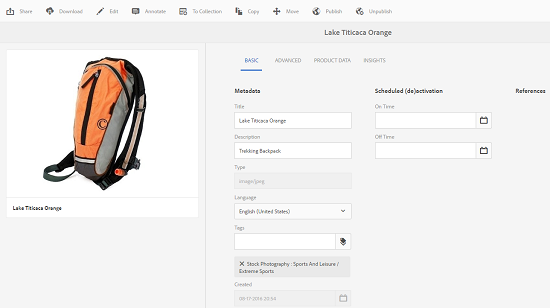

# How to edit or add metadata {#how-to-edit-or-add-metadata}

Metadata is additional information about the asset that can be searched. It is automatically extracted when you upload an image. You can edit the existing metadata or add new metadata properties to existing fields (for example, when a metadata field is blank).

Because companies need controlled and reliable metadata vocabularies, AEM Assets does not allow for adhoc adding of new metadata properties. Although authors cannot add new metadata fields for assets, developers can. See [Creating New Metadata Property for Assets](meta-edit.md#editing-metadata-schema).

## Editing metadata for an asset {#editing-metadata-for-an-asset}

To edit metadata:

1. Do one of the following:

    * From the Assets UI, select the asset and click/tap the **[!UICONTROL View Properties]** icon from the toolbar.
    * From the asset thumbnail, select the **[!UICONTROL View Properties]** quick action.
    * From the asset page, click/tap the **[!UICONTROL View Properties]** icon  from the toolbar.

   The asset page displays all of the asset's metadata. This metadata was automatically extracted when it was uploaded (ingested) into AEM Assets.

   

1. Make edits to the metadata under the various tabs, as required, and when completed, click/tap **[!UICONTROL Save]** from the toolbar to save your changes. Click/tap **[!UICONTROL Close]** to return to the Assets web interface.

   >[!NOTE]
   >
   >If a text field is empty, there is no existing metadata set. You can enter a value into the field and save it to add that metadata property.

Any changes to the metadata of an asset are written back to the original binary as part of its XMP data. This is done via AEM's Metadata write-back workflow. Changes made to the existing properties (such as `dc:title`) are overwritten and newly created properties (including custom properties like `cq:tags`) are added together with the schema.

XMP write-back is supported and enabled for the platforms and file formats described in [Technical Requirements.](/help/sites-deploying/technical-requirements.md)

## Editing Metadata Schema {#editing-metadata-schema}

For details on how to edit metadata schema, see [Editing metadata schema forms](metadata-schemas.md#editing-metadata-schema-forms).

## Registering a custom namespace within AEM {#registering-a-custom-namespace-within-aem}

You can add your own namespaces within AEM. Just as there are predefined namespaces such as cq, jcr and sling, you can have a namespace for your repository metadata and xml processing.

1. Go to the node type administration page *https://&lt;host&gt;:&lt;port&gt;/crx/explorer/nodetypes/index.jsp*.
1. Click or tap **[!UICONTROL Namespaces]** at the top of the page. The namespace administration page is displayed in a window.  

1. To add a namespace, click or tap **[!UICONTROL New]** at the bottom.
1. Specify a custom namespace in the XML namespace convention (Specify the id in the form of a URI and an associated prefix for the id), and click or tap **[!UICONTROL Save]**.
