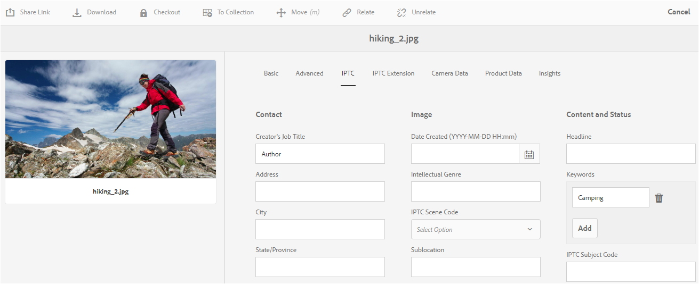

# Understand metadata concepts {#why-we-need-metadata}

Metadata means data about data. In this regard, data refers to your digital asset, say an image. Metadata is critical for efficient asset management.

Metadata is the collection of all the data available for an asset but that is not necessarily contained in that image. Some examples of metadata are:

* Name of the asset.
* Time and date of last modification.
* Size of the asset as it was stored in the repository.
* Name of the folder it is contained in.
* Related assets or applied tags.

The above are the basic metadata properties that [!DNL Experience Manager] can manage for assets, which allows users to see all assets. For example, ordering assets by last modification date is useful when trying to discover recently added assets.

You can add more high-level data to digital assets, for example:

* Type of asset (an image, a video, an audio clip, or a document).
* Owner of the asset.
* Title of the asset.
* Description of the asset.
* Tags assigned to an asset.

More metadata helps you further categorize assets and is helpful as the amount of digital information grows. It is possible to manage a few hundred files based on just the filenames. However, this approach is not scalable. It falls short when the number of people involved and the number of assets managed increase.

With the addition of metadata, the value of a digital asset grows, because the asset becomes,

* More accessible - systems and users can find it easily.
* Easier to manage - you can find assets with the same set of properties easier and apply changes to them.
* Complete - asset carries more information and context with more metadata.

For these reasons, [!DNL Assets] provides you with the right means of creating, managing, and exchanging metadata for your digital assets.

## Types of metadata {#types-of-metadata}

The two basic types of metadata are technical metadata and descriptive metadata.

Technical metadata is useful for software applications that are dealing with digital assets and should not be maintained manually. [!DNL Experience Manager Assets] and other software automatically determine technical metadata and the metadata may change when the asset is modified. The available technical metadata of an asset depends largely on the file type of the asset. Some examples of technical metadata are:

* Size of a file.
* Dimensions (height and width) of an image.
* Bit rate of an audio or video file.
* Resolution (level of detail) of an image.

Descriptive metadata is metadata concerned with the application domain, for example, the business that an asset is coming from. Descriptive metadata cannot be determined automatically. It is created manually or semi-automatically. For example, a GPS-enabled camera can automatically track the latitude and longitude and add geotag the image.

The cost of manually creating descriptive metadata information is high. So, standards are established to ease the exchange of metadata across software systems and organizations. [!DNL Experience Manager Assets] supports all relevant standards for metadata management.

## Encoding standards {#encoding-standards}

There are various ways to embed metadata in files. A selection of encoding standards are supported:

* XMP: used by [!DNL Assets] to store the extracted metadata within the repository.
* ID3: for audio and video files.
* Exif: for image files.
* Other/Legacy: from [!DNL Microsoft Word], [!DNL PowerPoint], [!DNL Excel], and so on.

### XMP {#xmp}

[!DNL Extensible Metadata Platform] (XMP) is an open standard that is used by [!DNL Experience Manager Assets] for all metadata management. The standard offers universal metadata encoding that can be embedded into all file formats. Adobe and other companies support XMP standard as it provides a rich content model. Users of XMP standard and of [!DNL Experience Manager Assets] have a powerful platform to build upon. For more information, see [XMP](https://www.adobe.com/products/xmp.html).

### ID3 {#id}

Data stored in these ID3 tags is displayed when you play back a digital audio file on either your computer or a portable MP3 player.

ID3 tags are designed for the MP3 file format. Additional information on formats:

* ID3 tags work in MP3 and mp3PRO files.
* WAV has no tags.
* WMA has proprietary tags that do not allow open-source implementation.
* Ogg Vorbis uses Xiph Comments embedded in the Ogg container.
* AAC uses a proprietary tagging format.

### Exif {#exif}

Exchangeable image file format (Exif) is the most popular metadata format used in digital photography. It provides a way of embedding a fixed vocabulary of metadata properties in many file formats, such as JPEG, TIFF, RIFF, and WAV. Exif stores metadata as pairs of a metadata name and a metadata value. These metadata name-value-pairs are also called tags, not to be confused with the tagging in [!DNL Experience Manager]. Modern digital cameras create Exif metadata and modern graphics software support it. Exif format is the lowest common denominator for metadata management especially for images.

A major limitation of Exif is that a few popular image file formats such as BMP, GIF, or PNG do not support it.

Metadata fields defined by Exif are typically technical in nature and are of limited use for descriptive metadata management. For this reason, [!DNL Experience Manager Assets] offers mapping of Exif properties into [common metadata schemata](metadata-schemas.md) and into [XMP](xmp-writeback.md).

### Other metadata {#other-metadata}

Other metadata that can be embedded from files include [!DNL Microsoft Word], [!DNL PowerPoint], [!DNL Excel], and so on.

## Understand metadata schemata {#metadata-schemata}

Metadata schemas are predefined sets of metadata property definitions that can be used in various applications. Properties are always associated with an asset, meaning that the properties are 'about' the resource.

You can also design your own metadata schemata if none exists that meet your needs. Do not duplicate existing information. Within an organization, separating schemata makes it easier to share metadata. [!DNL Experience Manager] provides you with a default list of the most popular metadata schemata. The list helps you to jumpstart your metadata strategy and quickly pick the metadata properties that you need.

The supported metadata schemata supported are listed below.

### Standard metadata {#standard-metadata}

* DC - [!DNL Dublin Core] is an important and widely used set of metadata.
* DICOM - Digital Imaging and Communications in Medicine.
* `Iptc4xmpCore` and `iptc4xmpExt` - International Press Communications Standard contains many subject-specific metadata.
* RDF - Resource Description Framework - for generic semantic web metadata.
* XMP - [!DNL Extensible Metadata Platform].
* `xmpBJ` - Basic Job Ticketing.

### Application-specific metadata {#application-specific-metadata}

The application-specific metadata includes technical and descriptive metadata. If you use such metadata, other applications may not be able to use the metadata. For example, a different image-rendering application may not be able to access [!DNL Adobe Photoshop] metadata. You can create a workflow step that changes an application-specific property to a standard property.

* ACDSee - Metadata managed by the [!DNL ACDSee] program. See [www.acdsee.com/](https://www.acdsee.com/).
* Album - [!DNL Adobe Photoshop Album].
* CQ - Used by [!DNL Experience Manager Assets].
* DAM - Used by [!DNL Experience Manager Assets].
* DEX - [!DNL Optima SC Description explorer] is a collection of tools for metadata and file management for Windows operating systems.
* CRS - [Adobe Photoshop Camera Raw](https://helpx.adobe.com/camera-raw/using/introduction-camera-raw.html).
* LR - [!DNL Adobe Lightroom].
* MediaPro - [iView MediaPro](https://en.wikipedia.org/wiki/Phase_One_Media_Pro).
* MicrosoftPhoto and MP - Microsoft Photo.
* PDF and PDF/X.
* Photoshop and psAux - [!DNL Adobe Photoshop].

### Digital Rights Management (DRM) metadata {#digital-rights-management-metadata}

* CC - [!DNL Creative Commons].
* [!DNL XMPRights].
* PLUS - [Picture Licensing Universal System](https://www.useplus.com).
* PRISM - [Publishing Requirements for Industry Standard Metadata](https://www.w3.org/submissions/2020/SUBM-prism-20200910/Image_Guide.pdf).
* PRL - PRISM Rights Language.
* PUR - PRISM Usage Rights.
* `xmpPlus` - Integration of PLUS with XMP.

### Photography-specific metadata {#photography-specific-metadata}

* Exif - Technical information from camera, including GPS position.
* CRS - [!DNL Camera Raw] schema.
* `iptc4xmpCore` and `iptc4xmpExt`.
* TIFF - image metadata (not only for TIFF images).

### Print-specific metadata {#print-specific-metadata}

* PDF and PDF/X - Adobe PDF and third-party applications.
* PRISM - [Publishing Requirements for Industry Standard Metadata](https://www.w3.org/submissions/2020/SUBM-prism-20200910/Image_Guide.pdf).
* XMP - [!DNL Extensible Metadata Platform].
* `xmpPG` - XMP metadata for paged text.

### Multimedia-specific metadata {#multimedia-specific-metadata}

* `xmpDM` - [!DNL Dynamic Media].
* `xmpMM` - Media Management.

## Metadata schemata reference {#metadata-schemata-reference}

The following reference includes information about a particular metadata schemata (in alphabetical order) and a list of properties and their definitions.

### Dublin Core {#dublin-core}

Dublin Core metadata provides a standardized set of conventions for describing assets to make them easier to find. In [!DNL Assets], the Dublin Core describes digital assets including video, sound, images, and documents.

The simple Dublin Core Metadata Element Set (DCMES) contains 15 metadata elements as listed in the following table. Each Dublin Core element is optional and can be repeated. You can add or delete Dublin Core metadata information as you would for media type-specific metadata.

In addition to the DCMES, there are other metadata elements created by the Dublin Core Initiative. See the [Dublin Core initiative](https://dublincore.org/) for more information.

|  Property   |                                                       Description                                                        |
| ----------- | ------------------------------------------------------------------------------------------------------------------------ |
| contributor | The person or company responsible for making contributions to the content.                                               |
| coverage    | The geographic location or time period that the asset covers.                                                            |
| creator     | The person or company responsible for creating the content.                                                              |
| date        | Date or period of time associated with the asset.                                                                        |
| description | More information about the asset.                                                                                        |
| format      | The file format, physical medium, or dimensions of the asset. [!DNL Experience Manager] uses `dc:format` to denote the MIME type of the asset. |
| identifier  | A unique reference to the asset.                                                                                         |
| language    | The language of the asset (for example, `en` for English).                                                                 |
| publisher   | The person or company responsible for making the asset available.                                                        |
| relation    | A related asset.                                                                                                         |
| rights      | Information about who has the rights to this asset.                                                                      |
| source      | A related asset from which the asset is derived.                                                                         |
| subject     | The topic of the asset.                                                                                                  |
| title       | A name for the asset.                                                                                                    |
| type        | The nature or genre of the asset.                                                                                        |

### IPTC {#iptc}

The International Press Telecommunications Council (IPTC) is a consortium of news agencies around the world - one of its goals is to develop and maintain technical standards. The IPTC defined a set of photo metadata standards for images that is almost universally accepted among photographers. These metadata standards were part of the broader standard known as the IPTC Information Interchange Model (IIM) created in the 1990s.

Although the IPTC header information has been mostly superseded by XMP, an IPTC core schema and an extension schema are available for XMP. In image programs, both XMP and IPTC properties are synchronized.

## Metadata-driven workflows {#metadata-driven-workflows}

Creating metadata-driven workflows help you automate some processes, which improves efficiency. In a metadata-driven workflow, the workflow management system reads the workflow and as a result performs some pre-defined action. For example, some of the ways you could use metadata-driven workflows:

* The workflow can check whether an image has a title or not. If it does not, the system notifies to add a title.
* The workflow can check whether a copyright notice on an asset allows for distribution or not. So, the system sends the asset to one server or the other.
* A workflow can check for assets without pre-defined, mandatory metadata or assets with *invalid* metadata.

## XMP metadata {#xmp-metadata}

XMP (Extensible Metadata Platform) is the metadata standard used by [!DNL Adobe Experience Manager Assets] for all metadata management. XMP provides a standard format for the creation, processing, and interchange of metadata for a wide variety of applications.

Aside from offering universal metadata encoding that can be embedded into all file formats, XMP provides a rich [content model](#xmp-core-concepts) and is [supported by Adobe](#advantages-of-xmp) and other companies, so that users of XMP in combination with [!DNL Assets] have a powerful platform to build upon.

The [XMP specification](https://www.adobe.com/devnet/xmp.html) is available from Adobe.

### What is XMP? {#what-is-xmp}

Adobe first introduced the XMP standard as part of the Adobe Acrobat software product. Since then, the XMP standard has been widely adopted. [!DNL Assets] natively supports the XMP - the Extensible Metadata Platform spearheaded by Adobe. XMP is a standard for processing and storing standardized and proprietary metadata in digital assets. XMP is designed to be the common standard that allows multiple applications to work effectively with metadata.

Production professionals, for example, use the built-in XMP support within Adobe's applications to pass information across multiple file formats. [!DNL Assets] repository extracts the XMP metadata and uses it to manage the content lifecycle and offers the ability to create automation workflows.

XMP standardizes how metadata is defined, created, and processed by providing a data model, a storage model, and schemas. All of these concepts are covered in this section.

All legacy metadata from EXIF, ID3, or Microsoft Office is automatically translated to XMP, which can be extended to support customer-specific metadata schema, such as product catalogs.

Metadata in XMP consists of a set of properties. These properties are always associated with a
particular entity referred to as a resource; that is, the properties are "about" the resource. If there is XMP, the resource is always the asset.

### XMP ecosystem {#xmp-ecosystem}

XMP defines a [metadata](https://en.wikipedia.org/wiki/Metadata) model that can be used with any defined set of metadata items. XMP also defines particular [schemas](https://en.wikipedia.org/wiki/XML_schema) for basic properties useful for recording the history of a resource as it passes through multiple processing steps, from being photographed, [scanned](https://en.wikipedia.org/wiki/Image_scanner), or authored as text, through photo editing steps (such as [cropping](https://en.wikipedia.org/wiki/Cropping_%28image%29) or color adjustment), to assembly into a final image. XMP allows each software program or device along the way to add its own information to a digital resource, which can then be retained in the final digital file.

XMP is most commonly serialized and stored using a subset of the [W3C](https://en.wikipedia.org/wiki/World_Wide_Web_Consortium) [Resource Description Framework](https://en.wikipedia.org/wiki/Resource_Description_Framework) (RDF), which is in turn expressed in [XML](https://en.wikipedia.org/wiki/XML).

### Advantages of XMP {#advantages-of-xmp}

XMP has the following advantages over other encoding standards and schemata:

* XMP-based metadata is very powerful and fine-grained.
* XMP lets you have multiple values for one property.
* XMP has standardized encoding, which lets you easily exchange metadata.
* XMP is extensible. You can add additional information into your assets.

The XMP standard is designed to be extensible, allowing you to add custom types of metadata into the XMP data. EXIF, on the other hand, does not - it has a fixed list of properties that cannot be extended.

>[!NOTE]
>
>XMP generally does not allow binary data types to be embedded. To carry binary data in XMP, for example, thumbnail images, they must be encoded in an XML-friendly format such as `Base64`.

### XMP concepts {#xmp-core-concepts}

The following sections describe the core concepts of XMP, including namespaces and schemata, properties and values, and language alternatives.

#### Namespaces and schemata {#namespaces-and-schemata}

An XMP schema is a set of property names in a common XML namespace that includes
the data type and descriptive information. An XMP schema is identified by its XML namespace URI. Using namespaces prevents conflicts between properties in different schemas that have the same name but a different meaning.

For example, the `Creator` property in two independently designed schemas might mean the person who created the asset or it could mean the application that created the asset (for example, Adobe Photoshop).

#### Properties and values {#properties-and-values}

XMP may include properties from one or more of the schemas. For example, a typical subset used by many Adobe applications might include the following:

* Dublin core schema: `dc:title`, `dc:creator`, `dc:subject`, `dc:format`, `dc:rights`.
* XMP basic schema: `xmp:CreateDate`, `xmp:CreatorTool`, `xmp:ModifyDate`, `xmp:metadataDate`.
* XMP rights management schema: `xmpRights:WebStatement`, `xmpRights:Marked`.
* XMP media management schema: `xmpMM:DocumentID`.

#### Language alternatives {#language-alternatives}

XMP lets you add an `xml:lang` property to text properties to specify the language of the text.

## Work with IPTC metadata {#support-for-iptc-metadata}

Learn how [!DNL Adobe Experience Manager Assets] supports the IPTC metadata, Creative ratings, and keywords added to assets through [!DNL Adobe Bridge] and other [!DNL Adobe Creative Cloud] apps.

[!DNL Adobe Experience Manager Assets] supports the IPTC metadata standard that is widely used to describe assets. This way, [!DNL Assets] enhances the acceptance of its images among various parties, including photographers, creative agencies, libraries, museums, and so on.

The default metadata schema for assets now incorporates the IPTC Core and IPTC Extension metadata schemas to define comprehensive metadata properties that allow users to add precise and reliable data about people, locations, and products shown in an image. It also supports dates, names, and identifiers regarding the creation of the image, and a flexible way to express rights information.

The Properties page for assets now includes separate tabs to display the IPTC Core and IPTC Extension metadata in editable fields.

1. From the [!DNL Assets] user interface, select an image.
1. Click **[!UICONTROL Properties]** from the toolbar.
1. Click the **[!UICONTROL IPTC]** tab to view the IPTC metadata for the asset.
1. Edit the IPTC metadata properties, as required.

   

1. Click the **[!UICONTROL IPTC Extension]** tab to view IPTC Extension metadata for the asset.
1. Edit the IPTC Extension metadata properties, as required.
1. Click **[!UICONTROL Save & Close]** to save the changes.

### Creative rating support {#creative-rating-support}

In addition to displaying individual user ratings and aggregate ratings, the Properties page now displays the ratings assigned to assets through Adobe Bridge and other Creative Apps

These ratings are available under **[!UICONTROL Creative Rating]** section within the **[!UICONTROL Advanced]** tab.

This rating is a read-only property and ranges between 1-5. You can search for assets based on their Creative Rating from the Search Panel.

However, this property is currently not indexed to avoid any conflict with custom changes made by users.

### Keyword support {#keyword-support}

The **[!UICONTROL IPTC]** tab of the [!UICONTROL Properties] page also displays keywords added to assets through Adobe Bridge and other Adobe Creative Cloud apps. You can also edit these keywords and add more keywords from the **[!UICONTROL IPTC]** tab.

