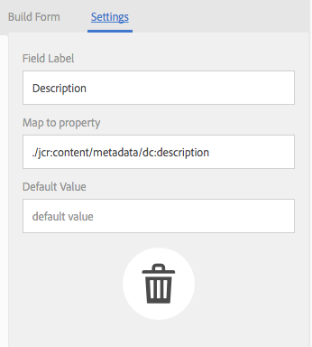
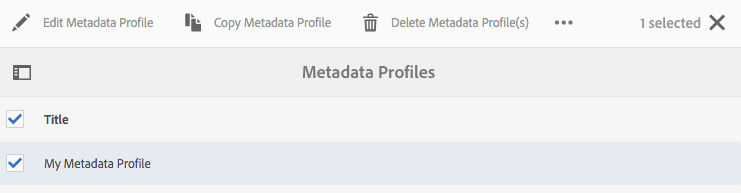
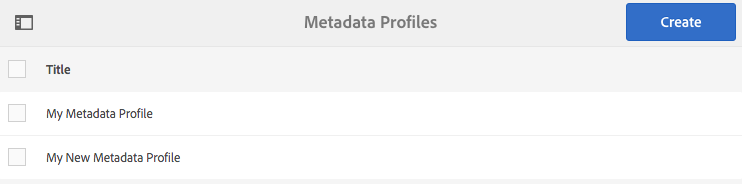
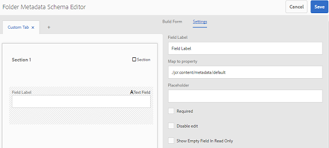
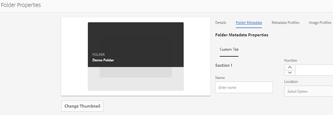

# Configuration and administration of metadata functionality in [!DNL Assets] {#config-metadata}

| Version | Article link |
| -------- | ---------------------------- |
| AEM as a Cloud Service  |    [Click here](https://experienceleague.adobe.com/docs/experience-manager-cloud-service/content/assets/manage/metadata-profiles.html?lang=en)                  |
| AEM 6.5     | This article         |

<!-- Scope of metadata articles:
* metadata.md: The scope of this article is basic metadata updates, changes, etc. operations that end-users can do.
* metadata-concepts.md: All conceptual information. Minor instructions are OK but it is an FYI article about support and standards.
* metadata-config.md: New article. Contains all configuration and administration how-to info related to metadata of assets.
-->

[!DNL Adobe Experience Manager Assets] keeps metadata for every asset. It allows easier categorization and organization of assets and it helps people who are looking for a specific asset. With the ability to keep and manage metadata with your assets, you can automatically organize and process assets based on their metadata. [!DNL Adobe Experience Manager Assets] lets administrators configure and customize metadata functionality to modify the default Adobe offering.

## Edit metadata schema {#metadata-schema}

For details, see [edit metadata schema forms](metadata-schemas.md#edit-metadata-schema-forms).

## Register a custom namespace within [!DNL Experience Manager] {#registering-a-custom-namespace-within-aem}

You can add your own namespaces within [!DNL Experience Manager]. Just as there are predefined namespaces such as `cq`, `jcr`, and `sling`, you can have a namespace for your repository metadata and XML processing.

1. Access the node type administration page `https://[aem_server]:[port]/crx/explorer/nodetypes/index.jsp`.
1. To access the namespace administration page, click **[!UICONTROL Namespaces]** at the top of the page.
1. To add a namespace, click **[!UICONTROL New]** at the bottom of the page.
1. Specify a custom namespace in the XML namespace convention. Specify the ID in the form of a URI and an associated prefix for the ID. Click **[!UICONTROL Save]**.

## Configure limits for bulk metadata update {#bulk-metadata-update-limit}

To prevent a denial of service (DOS) like situation, [!DNL Enterprise Manager] limits the number of parameters supported in a Sling request. When updating metadata of many assets in one go, you may reach the limit and the metadata does not get updated for more assets. Enterprise Manager generates the following warning in the logs:

`org.apache.sling.engine.impl.parameters.Util Too many name/value pairs, stopped processing after 10000 entries`

To change the limit, access **[!UICONTROL Tools]** > **[!UICONTROL Operations]** > **[!UICONTROL Web Console]** and change the value of **[!UICONTROL Maximum POST Parameters]** in **[!UICONTROL Apache Sling Request Parameter Handling]** OSGi configuration.

## Metadata profiles {#metadata-profiles}

A metadata profile lets you apply default metadata to assets within a folder. Create a metadata profile and apply it to a folder. Any asset that you later upload to the folder inherits the default metadata that you configured in the metadata profile.

### Add a metadata profile {#adding-a-metadata-profile}

1. Navigate to **[!UICONTROL Tools]** > **[!UICONTROL Assets]** > **[!UICONTROL Metadata Profiles]** and click **[!UICONTROL Create]**.
1. Enter a title for the profile, for example `Sample Metadata`, and click **[!UICONTROL Create]**. The [!UICONTROL Edit Form] for the metadata profile is displayed.

   

1. Click a component and configure its properties in the **[!UICONTROL Settings]** tab. For example, click the **[!UICONTROL Description]** component and edit its properties.

   

   Edit the following properties for the **[!UICONTROL Description]** component:

    * **[!UICONTROL Field Label]**: The display name of the metadata property. It is only for the user reference.

    * **[!UICONTROL Map to Property]**: The value of this property provides the relative path or name to the asset node where it is saved in the repository. The value should always start with `./` because it indicates that the path is under the asset's node.

   

   The value you specify for **[!UICONTROL Map to property]** is stored as a property under the asset's metadata node. For example, if you specify `./jcr:content/metadata/dc:desc` as the name of **[!UICONTROL Map to property]**, [!DNL Assets] stores the value `dc:desc` at the asset's metadata node. Adobe recommends that you map only one field to a given property in the metadata schema. Otherwise, the latest added field mapped to the property is picked by the system.

    * **[!UICONTROL Default Value]**: Use this property to add a default value for the metadata component. For example, if you specify "My description" then this value is assigned to the property `dc:desc` at the asset's metadata node.

   

   >[!NOTE]
   >
   >Adding a default value to a new metadata property (that does not exist at `/jcr:content/metadata` node) does not display the property and its value on the asset's [!UICONTROL Properties] page by default. To view the new property on the assets' [!UICONTROL Properties] page, modify the corresponding schema form.

1. (Optional) In the **[!UICONTROL Build Form]** tab, add more components to [!UICONTROL Edit Form], and configure their properties in the **[!UICONTROL Settings]** tab. The following properties are available in the **[!UICONTROL Build Form]** tab:

|           Component           |                               Properties                                |
| ----------------------------- | ----------------------------------------------------------------------- |
| [!UICONTROL Section Header]   | Field Label,   Description                                           |
| [!UICONTROL Single-Line Text] | Field Label,   Map to property,   Default Value                   |
| [!UICONTROL Multi Value Text] | Field Label,   Map to property,   Default Value                   |
| [!UICONTROL Number]           | Field Label,   Map to property,   Default Value                   |
| [!UICONTROL Date]             | Field Label,   Map to property,   Default Value                   |
| [!UICONTROL Standard Tags]    | Field Label,   Map to property,   Default Value,   Description |

1. Click **[!UICONTROL Done]**. The Metadata Profile is added to the list of profiles in the **[!UICONTROL Metadata Profiles]** page. 

   

### Copy a metadata profile {#copying-a-metadata-profile}

1. From the **[!UICONTROL Metadata Profiles]** page, select a metadata profile to make a copy of it.

   

1. Click **[!UICONTROL Copy]** from the toolbar.
1. In the **[!UICONTROL Copy Metadata Profile]** dialog, enter a title for the new copy of the Metadata Profile.
1. Click **[!UICONTROL Copy]**. The copy of the Metadata Profile appears in the list of profiles in the **[!UICONTROL Metadata Profiles]** page.

   

### Delete a metadata profile {#deleting-a-metadata-profile}

1. From the **[!UICONTROL Metadata Profiles]** page, select a profile to delete.

1. Click **[!UICONTROL Delete Metadata Profiles]** in the toolbar.
1. In the dialog, click **[!UICONTROL Delete]** to confirm the delete operation. The metadata profile is deleted from the list.

<!-- TBD: Revisit to find out the correct config. and update these steps. When fixed, also o
These steps have been carried forward from old AEM versions. See https://helpx.adobe.com/experience-manager/6-2/assets/using/metadata-profiles.html#ApplyingaMetadataProfiletoFolders

### Configuration to apply a metadata profile globally {#apply-a-metadata-profile-globally}

In addition to applying a profile to a folder, you can also apply one globally so that any content uploaded into [!DNL Experience Manager] assets in any folder has the selected profile applied.

You can reprocess assets in a folder that already has an existing metadata profile that you later changed. See [Reprocessing assets in a folder after you have edited its processing profile](processing-profiles.md#reprocessing-assets).

To apply a metadata profile globally, follow these steps:

* Navigate to `https://[aem_server]:[port]/mnt/overlay/dam/gui/content/assets/foldersharewizard.html/content/dam` and apply the appropriate profile and click **[!UICONTROL Save]**.

  

* In CRXDE Lite, navigate to the following node: `/content/dam/jcr:content`. Add the property `metadataProfile:/etc/dam/metadata/dynamicmedia/<name of metadata profile>` and click **[!UICONTROL Save All]**.

  
-->

## Metadata schema for a folder {#folder-metadata-schema}

[!DNL Adobe Experience Manager Assets] lets you create metadata schemas for asset folders, which define the layout and metadata displayed in folder properties pages.

### Add a folder metadata schema form {#add-a-folder-metadata-schema-form}

Use the Folder Metadata Schema Forms editor to create and edit metadata schemas for folders.

1. In [!DNL Experience Manager] interface, go to **[!UICONTROL Tools]** > **[!UICONTROL Assets]** > **[!UICONTROL Folder Metadata Schemas]**.
1. On the [!UICONTROL Folder Metadata Schema Forms] page, click **[!UICONTROL Create]**.
1. Specify a name for the form, and click **[!UICONTROL Create]**. The new schema form is listed in the [!UICONTROL Schema Forms] page.

### Edit folder metadata schema forms {#edit-folder-metadata-schema-forms}

You can edit a newly added or existing metadata schema form, which includes the following:

* Tabs
* Form items within tabs.

You can map/configure these form items to a field within a metadata node in the CRX repository. You can add new tabs or form items to the metadata schema form.

1. In the Schema Forms page, select the form you created, and then select the **[!UICONTROL Edit]** option from the toolbar.
1. In the Folder Metadata Schema Editor page, click `+` to add a tab to the form. To rename the tab, click the default name and specify the new name under **[!UICONTROL Settings]**.

   

   To add more tabs, click `+`. To delete, click `X` on a tab.

1. In the active tab, add one or more components from the **[!UICONTROL Build Form]** tab.

   

   If you create multiple tabs, click a particular tab to add components.

1. To configure a component, select it and modify its properties in the **[!UICONTROL Settings]** tab.

   If necessary, delete a component from the **[!UICONTROL Settings]** tab.

   

1. To save the changes, select **[!UICONTROL Save]** from the toolbar.

#### Components to build forms {#components-to-build-forms}

The **[!UICONTROL Build Form]** tab lists form items that you use in your folder metadata schema form. The **[!UICONTROL Settings]** tab displays the attributes for each item that you select in the **[!UICONTROL Build Form]** tab. Here is a list the form items available in the **[!UICONTROL Build Form]** tab:

| Component Name | Description |
|---|---|
| [!UICONTROL Section Header] | Add a section heading for a list of common components. |
| [!UICONTROL Single Line Text] | Add a single-line text property. It is stored as a string. |
| [!UICONTROL Multi Value Text] | Add a multi value text property. It is stored as a string array. |
| [!UICONTROL Number] | Add a number component. |
| [!UICONTROL Date] | Add a date component. |
| [!UICONTROL Dropdown] | Add a drop-down list. |
| [!UICONTROL Standard Tags] | Add a tag. |
| [!UICONTROL Hidden Field] | Add a hidden field. It is sent as a POST parameter when the asset is saved. |

#### Editing form items {#editing-form-items}

To edit the properties of form items, click the component and edit all or a subset of the following properties in the **[!UICONTROL Settings]** tab.

**[!UICONTROL Field Label]**: The name of the metadata property that is displayed on the properties page for the folder.

**[!UICONTROL Map to Property]**: This property specifies the relative path of the folder node in the CRX repository where it is saved. It starts with "**./**", which indicates that the path is under the folder's node.

The following are the valid values for this property:

* `./jcr:content/metadata/dc:title`: Stores the value at the folder's metadata node as the property `dc:title`.

* `./jcr:created`: Displays the JCR property at the folder's node. If you configure these properties in CRXDE, Adobe recommends that you mark them as Disable Edit, because they are protected. Otherwise, the error ' `Asset(s) failed to modify`' occurs when you save the asset's properties.

To ensure that the component is displayed properly in the metadata schema form, do not include a space in the property path.

**[!UICONTROL JSON Path]**: Use it to specify the path of the JSON file where you specify key-value pairs for options.

**[!UICONTROL Placeholder]**: Use this property to specify relevant placeholder text regarding the metadata property.

**[!UICONTROL Choices]**: Use this property to specify choices in a list.

**[!UICONTROL Description]**: Use this property to add a short description for the metadata component.

**[!UICONTROL Class]**: Object class the property is associated with.

### Delete folder metadata schema forms {#delete-folder-metadata-schema-forms}

You can delete folder metadata schema forms from the Folder Metadata Schema Forms page. To delete a form, select the form and click the delete option from the toolbar.

### Assign a folder metadata schema {#assign-a-folder-metadata-schema}

You can assign a folder metadata schema to a folder either from the Folder Metadata Schema Forms page or when creating a folder.

If you configure a metadata schema for a folder, the path to the schema form is stored in the `folderMetadataSchema` property of the folder node under `./jcr:content`.

#### Assign to a schema from the Folder Metadata Schema page {#assign-to-a-schema-from-the-folder-metadata-schema-page}

1. In [!DNL Experience Manager] interface, go to **[!UICONTROL Tools]** > **[!UICONTROL Assets]** > **[!UICONTROL Folder Metadata Schemas]**.
1. From the Folder Metadata Schema Forms page, select the schema form you want to apply to a folder.
1. From the toolbar, click **[!UICONTROL Apply to Folder(s)]**.

1. Select the folder on which to apply the schema and then click **[!UICONTROL Apply]**. If a metadata schema is already applied on the folder, a warning message informs that you are about to overwrite the existing metadata schema. Click **[!UICONTROL Overwrite]**.
1. Open the metadata properties for the folder to which you applied the metadata schema.

   

   To view the folder metadata fields, click the **[!UICONTROL Folder Metadata]** tab.

   

#### Assign a schema when creating a folder {#assign-a-schema-when-creating-a-folder}

You can assign a folder metadata schema when creating a folder. If at least one folder metadata schema exists in the system, an extra list is displayed in the **[!UICONTROL Create Folder]** dialog. You can select the desired schema. By default, no schema is selected.

1. From the [!DNL Experience Manager Assets] user interface, click **[!UICONTROL Create]** from the toolbar.
1. Specify a title and name for the folder.
1. From the Folder Metadata Schema list, select the desired schema. Then, click **[!UICONTROL Create]**.

   

1. Open the metadata properties for the folder to which you applied the metadata schema.
1. To view the folder metadata fields, click the **[!UICONTROL Folder Metadata]** tab.

### Use the folder metadata schema {#use-the-folder-metadata-schema}

Open the properties for a folder configured with a folder metadata schema. A **[!UICONTROL Folder Metadata]** tab is displayed in the folder [!UICONTROL Properties] page. To view the folder metadata schema form, select this tab.

Enter metadata values in the various fields and click **[!UICONTROL Save]** to store the values. The values you specify are stored in the folder node in the CRX repository.

## Tips and limitations {#best-practices-limitations}

* To import metadata on custom namespaces, first register the namespaces.
* Property Picker displays properties that are used in schema editors and search forms. Property Picker does not pick metadata properties from an asset.
* You may have pre-existing metadata profiles existing since before upgrading to [!DNL Experience Manager] 6.5. After upgrade, if you apply such a profile in folder [!UICONTROL Properties] in [!UICONTROL Metadata Profiles] tab, the metadata form fields do not display. However, if you apply a newly created metadata profile, the form fields are displayed but unavailable as expected. There is no loss of functionality but if you want to see the (unavailable) form fields then edit and save the existing metadata profiles.

>[!MORELIKETHIS]
>
>* [Metadata concepts and understanding](metadata-concepts.md).
>* [Edit metadata properties of multiple collections](manage-collections.md#editing-collection-metadata-in-bulk).
>* [Metadata import and export in Experience Manager Assets](https://experienceleague.adobe.com/docs/experience-manager-learn/assets/metadata/metadata-import-export.html).
>* [Profiles to process metadata, images, and videos](processing-profiles.md).
>* [Best Practices to organize your digital assets to use processing profiles](/help/assets/organize-assets.md).
>* [XMP writeback](/help/assets/xmp-writeback.md).
