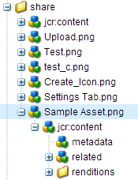
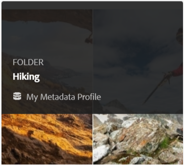
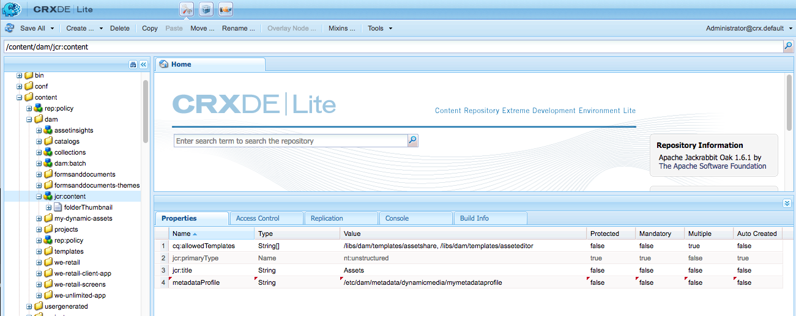

# Configuration and administration of metadata functionality in [!DNL Assets] {#config-metadata}

<!-- Scope of metadata articles:
* metadata.md: The scope of this article is basic metadata updates, changes, etc. operations that end-users can do.
* metadata-concepts.md: All conceptual information. Minor instructions are OK but it is an FYI article about support and standards.
* metadata-config.md: New article. Contains all configuration and administration how-to info related to metadata of assets.
-->

[!DNL Adobe Experience Manager Assets] keeps metadata for every asset. It allows easier categorization and organization of assets and it helps people who are looking for a specific asset. With the ability to keep and manage metadata with your assets, you can automatically organize and process assets based on their metadata. [!DNL Adobe Experience Manager Assets] lets administrators configure and customize metadata functionality to modify the default Adobe offering.

## Edit metadata schema {#metadata-schema}

For details, see [edit metadata schema forms](metadata-schemas.md#edit-metadata-schema-forms).

## Register a custom namespace within [!DNL Experience Manager] {#registering-a-custom-namespace-within-aem}

You can add your own namespaces within [!DNL Experience Manager]. Just as there are predefined namespaces such as `cq`, `jcr`, and `sling`, you can have a namespace for your repository metadata and XML processing.

1. Access the node type administration page `https://[aem_server]:[port]/crx/explorer/nodetypes/index.jsp`.
1. To access the namespace administration page, click **[!UICONTROL Namespaces]** at the top of the page.
1. To add a namespace, click **[!UICONTROL New]** at the bottom of the page.
1. Specify a custom namespace in the XML namespace convention. Specify the ID in the form of a URI and an associated prefix for the ID. Click **[!UICONTROL Save]**.

## Configure limits for bulk metadata update {#bulk-metadata-update-limit}

To prevent a denial of service (DOS) like situation, [!DNL Enterprise Manager] limits the number of parameters supported in a Sling request. When updating metadata of many assets in one go, you may reach the limit and the metadata does not get updated for more assets. Enterprise Manager generates the following warning in the logs:

`org.apache.sling.engine.impl.parameters.Util Too many name/value pairs, stopped processing after 10000 entries`

To change the limit, access **[!UICONTROL Tools]** > **[!UICONTROL Operations]** > **[!UICONTROL Web Console]** and change the value of **[!UICONTROL Maximum POST Parameters]** in **[!UICONTROL Apache Sling Request Parameter Handling]** OSGi configuration.

## Metadata profiles {#metadata-profiles}

A metadata profile lets you apply default metadata to assets within a folder. Create a metadata profile and apply it to a folder. Any asset that you subsequently upload to the folder inherits the default metadata that you configured in the metadata profile.

### Add a metadata profile {#adding-a-metadata-profile}

1. Navigate to **[!UICONTROL Tools]** > **[!UICONTROL Assets]** > **[!UICONTROL Metadata Profiles]** and click **[!UICONTROL Create]**.
1. Enter a title for the Metadata Profile, for example Sample Metadata, and click **[!UICONTROL Create]**. The [!UICONTROL Edit Form] for the metadata profile is displayed.

   

1. Click a component and configure its properties in the **[!UICONTROL Settings]** tab. For example, click the **[!UICONTROL Description]** component and edit its properties.

   

   Edit the following properties for the **[!UICONTROL Description]** component:

    * **[!UICONTROL Field Label]**: The display name of the metadata property. It is only for the user reference.

    * **[!UICONTROL Map to Property]**: The value of this property provides the relative path/name to the asset node where it is saved in the repository. The value should always start with `./` because it indicates that the path is under the asset's node.

   

   The value you specify for **[!UICONTROL Map to property]** is stored as a property under the asset's metadata node. For example, if you specify . `/jcr:content/metadata/dc:desc` as the name of **[!UICONTROL Map to property]**, [!DNL Assets] stores the value `dc:desc` at the asset's metadata node.

    * **[!UICONTROL Default Value]**: Use this property to add a default value for the metadata component. For example, if you specify "My description" then this value is assigned to the property `dc:desc` at the asset's metadata node.

   

   >[!NOTE]
   >
   >Adding a default value to a new metadata property (which doesn't exist already at the . `/jcr:content/metadata` node) does not display the property and its value on the asset's Properties page by default. To view the new property on the assets' [!UICONTROL Properties] page, modify the corresponding schema form.

1. (Optional) Add more components to the Edit Form from the **[!UICONTROL Build Form]** tab, and configure their properties in the **[!UICONTROL Settings]** tab. The following properties are available from the **[!UICONTROL Build Form]** tab:

|           Component           |                               Properties                                |
| ----------------------------- | ----------------------------------------------------------------------- |
| [!UICONTROL Section Header]   | Field Label,   Description                                           |
| [!UICONTROL Single Line Text] | Field Label,   Map to property,   Default Value                   |
| [!UICONTROL Multi Value Text] | Field Label,   Map to property,   Default Value                   |
| [!UICONTROL Number]           | Field Label,   Map to property,   Default Value                   |
| [!UICONTROL Date]             | Field Label,   Map to property,   Default Value                   |
| [!UICONTROL Standard Tags]    | Field Label,   Map to property,   Default Value,   Description |

   

1. Click **[!UICONTROL Done]**. The Metadata Profile is added to the list of profiles in the **[!UICONTROL Metadata Profiles]** page. 

   

### Copy a metadata profile {#copying-a-metadata-profile}

1. From the **[!UICONTROL Metadata Profiles]** page, select a metadata profile to make a copy of it.

   

1. Click **[!UICONTROL Copy]** from the toolbar.
1. In the **[!UICONTROL Copy Metadata Profile]** dialog, enter a title for the new copy of the Metadata Profile.
1. Click **[!UICONTROL Copy]**. The copy of the Metadata Profile appears in the list of profiles in the **[!UICONTROL Metadata Profiles]** page.

   

### Delete a metadata profile {#deleting-a-metadata-profile}

1. From the **[!UICONTROL Metadata Profiles]** page, select a profile to delete.

   

1. Ta[] **[!UICONTROL Delete Metadata Profiles]** in the toolbar.
1. In the dialog, click **[!UICONTROL Delete]** to confirm the delete operation. The metadata profile is deleted from the list.

### Apply a metadata profile to folders {#applying-a-metadata-profile-to-folders}

<!-- TBD: Review this overview.
-->

When you assign a metadata profile to a folder, any subfolders automatically inherit the profile from its parent folder. This means that you can assign only one metadata profile to a folder. As such, consider carefully the folder structure of where you upload, store, use, and archive assets.

If you assigned a different metadata profile to a folder, the new profile overrides the previous profile. The previously existing folder assets remain unchanged. The new profile is applied on the assets that are added to the folder later.

Folders that have a profile assigned to it are indicated in the user interface by the name of the profile appearing in the card name.

You can apply metadata profiles to specific folders or globally to all assets.

You can reprocess assets in a folder that already has an existing metadata profile that you later changed. See [Reprocessing assets in a folder after you have edited its processing profile](processing-profiles.md#reprocessing-assets).

You can apply a metadata profile to a folder from within the **[!UICONTROL Tools]** menu or if you are in the folder, from **[!UICONTROL Properties]**. This section describes how to apply metadata profiles to folders both ways.

Folders that have a profile already assigned to it are indicated by the display of the profile's name directly below the folder name.

You can reprocess assets in a folder that already has an existing video profile that you later changed. See [Reprocessing assets in a folder after you have edited its processing profile](processing-profiles.md#reprocessing-assets).

#### Apply metadata profiles to folders from Profiles user interface {#applying-metadata-profiles-to-folders-from-profiles-user-interface}

Follow the steps to apply metadata profile:

1. Click the [!DNL Experience Manager] logo and navigate to **[!UICONTROL Tools]** > **[!UICONTROL Assets]** > **[!UICONTROL Metadata Profiles]**.
1. Select the metadata profile that you want to apply to a folder or multiple folders.

   

1. Click **[!UICONTROL Apply Metadata Profile to Folder(s)]** and select the folder or multiple folders you want use to receive the newly uploaded assets and click **[!UICONTROL Done]**. Folders that have a profile already assigned to it are indicated by the display of the profile's name directly below the folder name.

#### Apply metadata profiles to folders from Properties {#applying-metadata-profiles-to-folders-from-properties}

1. In the left rail, click **[!UICONTROL Assets]** then navigate to the folder that you want to apply a metadata profile to.
1. On the folder, click the check mark to select it and then click **[!UICONTROL Properties]**.  

1. Select the **[!UICONTROL Metadata Profiles]** tab and select the profile from the drop-down menu and click **[!UICONTROL Save]**.

   

   Folders that have a profile already assigned to it are indicated by the display of the profile's name directly below the folder name.

### Apply a metadata profile globally {#applying-a-metadata-profile-globally}

In addition to applying a profile to a folder, you can also apply one globally so that any content uploaded into [!DNL Experience Manager] assets in any folder has the selected profile applied.

You can reprocess assets in a folder that already has an existing metadata profile that you later changed. See [Reprocessing assets in a folder after you have edited its processing profile](processing-profiles.md#reprocessing-assets).

To apply a metadata profile globally, follow these steps:

* Navigate to `https://[aem_server]:[port]/mnt/overlay/dam/gui/content/assets/foldersharewizard.html/content/dam` and apply the appropriate profile and click **[!UICONTROL Save]**.

  

* In CRXDE Lite, navigate to the following node: `/content/dam/jcr:content`. Add the property `metadataProfile:/etc/dam/metadata/dynamicmedia/<name of metadata profile>` and click **[!UICONTROL Save All]**.

  

### Remove a metadata profile from folders {#removing-a-metadata-profile-from-folders}

When you remove a metadata profile from a folder, any subfolders automatically inherit the removal of the profile from its parent folder. However, any processing of files that has occurred within the folders remains intact.

You can remove a metadata profile from a folder from within the **[!UICONTROL Tools]** menu or if you are in the folder, from the **[!UICONTROL Properties]**. This section describes how to remove metadata profiles from folders both ways.

#### Remove metadata profiles from folders via Profiles user interface {#removing-metadata-profiles-from-folders-via-profiles-user-interface}

1. Click the [!DNL Experience Manager] logo and navigate to **[!UICONTROL Tools]** > **[!UICONTROL Assets]** > **[!UICONTROL Metadata Profiles]**.
1. Select the metadata profile that you want to remove from a folder or multiple folders.
1. Click **[!UICONTROL Remove Metadata Profile from Folder(s)]** and select the folder or multiple folders you want use to remove a profile from and click **[!UICONTROL Done]**.

   You can confirm that the metadata profile is no longer applied to a folder because the name no longer appears below the folder name.

#### Remove metadata profiles from folders via Properties {#removing-metadata-profiles-from-folders-via-properties}

1. Click the [!DNL Experience Manager] logo and navigate **[!UICONTROL Assets]** and then to the folder that you want to remove an metadata profile from.
1. On the folder, click the check mark to select it and then click **[!UICONTROL Properties]**.
1. Select the **[!UICONTROL Metadata Profiles]** tab and select **[!UICONTROL None]** from the drop-down menu and click **[!UICONTROL Save]**. Folders that have a profile already assigned to it are indicated by the display of the profile's name directly below the folder name.

## Tips and limitations {#best-practices-limitations}

* To import metadata on custom namespaces, first register the namespaces.
* Property Picker displays properties that are used in schema editors and search forms. Property Picker does not pick metadata properties from an asset.
* You may have pre-existing metadata profiles existing since before upgrading to [!DNL Experience Manager] 6.5. After upgrade, if you apply such a profile in folder [!UICONTROL Properties] in [!UICONTROL Metadata Profiles] tab, the metadata form fields do not display. However, if you apply a newly created metadata profile, the form fields are displayed but unavailable as expected. There is no loss of functionality but if you want to see the (unavailable) form fields then edit and save the existing metadata profiles.

>[!MORELIKETHIS]
>
>* [Metadata concepts and understanding](metadata-concepts.md).
>* [Edit metadata properties of multiple collections](managing-collections-touch-ui.md#editing-collection-metadata-in-bulk)
>* [Edit metadata properties of multiple collections](managing-collections-touch-ui.md#editing-collection-metadata-in-bulk)
>* [Metadata import and export in Experience Manager Assets](https://docs.adobe.com/content/help/en/experience-manager-learn/assets/metadata/metadata-import-feature-video-use.html)
>* [Profiles to process metadata, images, and videos](processing-profiles.md)
>* [Best Practices to organize your digital assets to use processing profiles](/help/assets/organize-assets.md)
