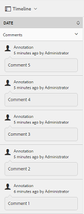
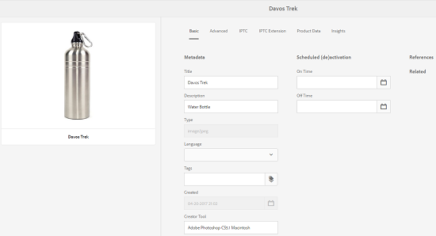
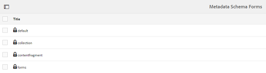
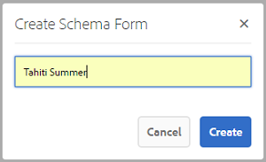
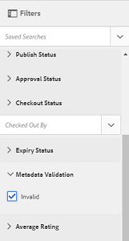
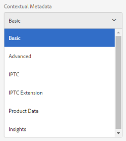
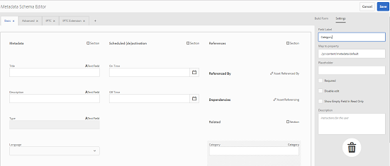
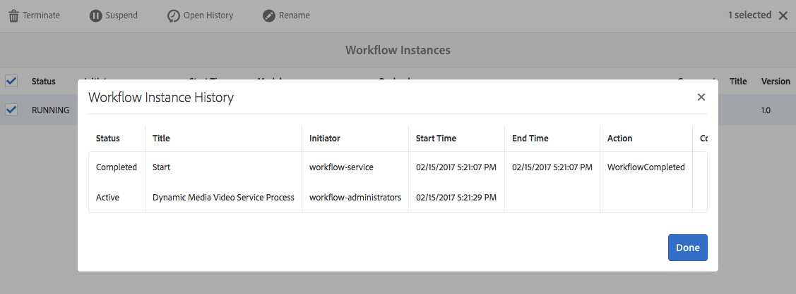
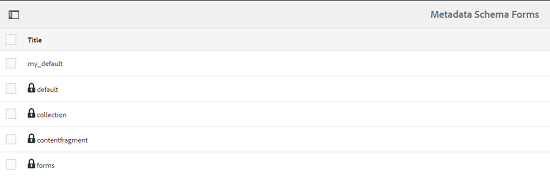
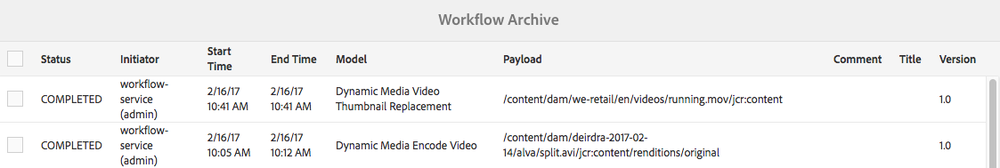

# Metadata Schemas {#metadata-schemas}

In Adobe Experience Manager (AEM) Assets, a metadata schema defines the layout of the properties page and the metadata properties displayed for assets that use the particular schema. Metadata properties include title, description, MIME types, tags, and so on.

You can use the Metadata Schema Forms editor to modify existing schemas or add custom metadata schemas.

1. To view the properties page for an asset, click or tap the **[!UICONTROL View Properties]** from **[!UICONTROL Quick Actions]** on the asset tile in Card view.

   

   Alternatively, select an asset and then click or tap the **[!UICONTROL Properties]** icon from the toolbar.

   

1. Edit the editable metadata properties under the various tabs.

   

   To modify the MIME type for an asset, use a custom metadata schema form or modify an existing form. See [Editing Metadata Schema Forms](metadata-schemas.md#editing-metadata-schema-forms) for more information. If you modify the metadata schema for a certain MIME type, the properties page layout for assets with the current MIME type and all asset subtypes are modified. For example, modifying a `jpeg` schema under `default/image` only modifies the metadata layout (asset properties) for assets with MIME type `IMAGE/JPEG`. However, if you edit the default schema, your changes modify the metadata layout for all types of assets.

1. To view a list of forms/templates, click the AEM logo and then navigate to **[!UICONTROL Tools > Assets > Metadata Schemas]**.

   

   AEM provides the following templates out of the box:

    * **default**: The base metadata schema form for assets.

   The following child forms inherit the properties of the default form:  

   i. **image**: Schema form for assets with the MIME type `image`, for example, `image/jpeg`, `image/png`, and so on.  

   The "image" form has the following child form templates:  
   
   a. **jpeg**: Schema form for assets with sub type jpeg.  

   b. **tiff**: Schema form for the assets with sub type TIFF.  

   ii. **application**: Schema form for assets with MIME type application, for example `application/pdf`, `application/zip`, and so on.  
   
   a. **pdf**: Schema form for assets with sub type PDF.  

   iii. **video**: Schema form for assets with MIME type video, such as `video/avi`, `video/mp4` and so on.

    * **collection**: Schema form for collections
    * **contentfragment:** Schema form for Content Fragments
    * **forms**: This schema form relates to [Adobe Experience Manager Forms](https://helpx.adobe.com/experience-manager/6-4/forms/user-guide.html)

>[!NOTE]
>
>To view the child forms of a schema form, click/tap the schema form name.

## Adding a metadata schema form {#adding-a-metadata-schema-form}

1. To add a custom template to the list, click **[!UICONTROL Create]** from the toolbar.

   >[!NOTE]
   >
   >Unedited templates display a lock icon before them. If you customize any of the templates, the lock icon before the template disappears.

1. In the dialog, enter the title of the schema form and click **[!UICONTROL Create]** to complete the form creation process.

   

## Editing metadata schema forms {#editing-metadata-schema-forms}

You can edit a newly-added or existing metadata schema form. The metadata schema form includes the following:

* Tabs
* Form items within tabs.

You can map/configure these form items to a field within a metadata node in the CRX repository.

You can add new tabs or form items to the metadata schema form. The tabs and form items derived from the parent are in the locked state. You cannot alter them at the child level.

1. In the **[!UICONTROL Schema Forms]** page, select the check box before a form and then click **[!UICONTROL Edit]** on the toolbar.

   

1. In the **[!UICONTROL Metadata Schema Editor]** page, customize the properties page of the asset by dragging one or more components from the list of component types in the **[!UICONTROL Build Form]** tab to the **[!UICONTROL Basic]** tab.

   

1. To configure a component, select it and modify its properties in the **[!UICONTROL Settings]** tab.

### Components within the Build Form tab {#components-within-the-build-form-tab}

The **[!UICONTROL Build Form]** tab lists form items that you use in your schema form. The **[!UICONTROL Settings]** tab provides the attributes of each item that you select in the **[!UICONTROL Build Form]** tab. The following table lists the form items available in the **[!UICONTROL Build Form]** tab:

<table> 
 <tbody> 
  <tr> 
   <td><strong>Component Name</strong></td> 
   <td><strong>Description</strong></td> 
  </tr> 
  <tr> 
   <td>Section Header</td> 
   <td>Add a section heading for a list of common components.</td> 
  </tr> 
  <tr> 
   <td>Single Line Text</td> 
   <td>Add a single line text property. It is stored as a string.</td> 
  </tr> 
  <tr> 
   <td>Multi Value Text</td> 
   <td>Add a multi value text property. It is stored as a string array.</td> 
  </tr> 
  <tr> 
   <td>Number</td> 
   <td>Add a number component.</td> 
  </tr> 
  <tr> 
   <td>Date</td> 
   <td>Add a date component.</td> 
  </tr> 
  <tr> 
   <td>Dropdown</td> 
   <td>Add a dropdown list.</td> 
  </tr> 
  <tr> 
   <td>Standard Tags</td> 
   <td>Add a tag. </td> 
  </tr> 
  <tr> 
   <td>Smart Tags</td> 
   <td>Add to augment search capabilities by automatically adding metadata tags.  </td> 
  </tr> 
  <tr> 
   <td>Hidden Field</td> 
   <td>Add a hidden field. It is sent as a POST parameter when the asset is saved.</td> 
  </tr> 
  <tr> 
   <td>Asset Referenced By</td> 
   <td>Add this component to view list of assets referenced by the asset.</td> 
  </tr> 
  <tr> 
   <td>Asset Referencing</td> 
   <td>Add to display a list of assets that reference the asset.</td> 
  </tr> 
  <tr> 
   <td>Products References</td> 
   <td>Add to show the list of products linked with the asset.</td> 
  </tr> 
  <tr> 
   <td>Asset Rating</td> 
   <td>Add to display options for rating the asset.</td> 
  </tr> 
  <tr> 
   <td>Contextual Metadata</td> 
   <td>Add to control the display of other metadata tabs in the properties page of assets.</td> 
  </tr> 
 </tbody> 
</table>

### Editing the metadata component {#editing-the-metadata-component}

To edit the properties of a metadata component on the form, click the component and edit all or a subset of the following properties in the **[!UICONTROL Settings]** tab.

**Field Label**: The name of the metadata property that is displayed on the properties page for the asset.

**Map to Property**: This property specifies the relative path/name to the asset node where it is saved in the CRX repository. It starts with `./` because indicating that the path is under the asset's node.

The following are the valid values for this property:

* `./jcr:content/metadata/dc:title`: Stores the value at the asset's metadata node as the property `dc:title`.

* `./jcr:created`: Displays the JCR property at the asset's node. If you configure these properties on view properties, we recommend that you mark them as Disable Edit, because they are protected. Otherwise, the error [!UICONTROL Asset(s) failed to modify] results when you save the asset's properties.

To ensure that the component is displayed properly in the metadata schema form, the property path should not include any spaces.

**Placeholder**: Use this property to specify relevant placeholder text regarding the metadata property.

**Required**: Use this property to mark a metadata property as mandatory on the properties page.

**Disable Edit**: Use this property to make a metadata property uneditable on the properties page.

**Show Empty Field In Read Only**: Mark this property to display a metadata property on the properties page even if it has no value. By default, when a metadata property has no value, it is not be listed on the properties page.

**Show list ordered**: Use this property to display an ordered list of choices

**Choices**: Use this property to specify choices in a list

**Description** : Use this property to add a short description for the metadata component.

**Class**: Object class the property is associated with.

**Delete icon** Click this icon to delete a component from the schema form.

>[!NOTE]
>
>The Hidden Field component does not include these attributes. Instead, it includes properties, such as attributes Name, Value, Field Label, and Description. The values for the Hidden Field component are sent as a POST parameter whenever the asset is saved. It is not be saved as metadata for the asset.

If you select the **[!UICONTROL Required]** option, you can search for assets missing mandatory metadata. From the **[!UICONTROL Filters]** panel, expand the **[!UICONTROL Metadata Validation]** predicate and select the **[!UICONTROL Invalid]** option. The search results display assets missing mandatory metadata that you configured through the schema form.

If you add the Contextual Metadata component to any tab of any schema form, the component appears as a list in the properties page of assets to which the particular schema is applied. The list includes all other tabs except the tab to which you applied the Contextual Metadata component. Currently, this feature provides basic functionality to control the display of metadata based on the context.

To include any tab in the properties page in addition to the tab where the Contextual Metadata component is applied, select the tab from the list. The tab is added to the properties page.

### Specifying properties in JSON file {#specifying-properties-in-json-file}

Instead of specifying properties for the options in the **[!UICONTROL Settings]** tab, you can define the options in a JSON file by specifying corresponding key-value pairs. Specify the path of the JSON file in the **[!UICONTROL JSON Path]** field.

### Adding/deleting a tab in the schema form {#adding-deleting-a-tab-in-the-schema-form}

The schema editor lets you add or delete a tab. The default schema form includes the **[!UICONTROL Basic]**, **[!UICONTROL Advanced]**, **[!UICONTROL IPTC]**, and **[!UICONTROL IPTC Extension]** tabs, by default.

Click `+` to add a new tab on a schema form. By default, the new tab has the name `Unnamed-1`. You can modify the name from the **[!UICONTROL Settings]** tab. Click `X` to delete a tab.

## Deleting metadata schema forms {#deleting-metadata-schema-forms}

AEM lets you delete custom schema forms only. It does not let you delete the default schema forms/templates. However, you can delete any custom changes in these forms.

To delete a form, select a form and click the **[!UICONTROL Delete]** icon.

>[!NOTE]
>
>After you delete custom changes to a default form, the lock icon reappears on the Metadata Schema interface to indicate that the form reverted to its default state.

>[!NOTE]
>
>You cannot delete the out of the box metadata schema forms in AEM Assets.

## Schema forms for MIME types {#schema-forms-for-mime-types}

AEM Assets provides default forms for various MIME types out of the box. However, you can add custom forms for assets of various MIME types.

### Adding new forms for MIME types {#adding-new-forms-for-mime-types}

Create a new form under the appropriate form type. For example, to add a new template for the `image/png` subtype, create the form under the `image` forms. The title for the schema form is the subtype name. In this case, the title is `png`.

### Using an existing schema template for various MIME types {#using-an-existing-schema-template-for-various-mime-types}

You can use an existing template for a different MIME type. For example, use the `image/jpeg` form for assets of MIME type `image/png`.

In this case, create a new node at `/etc/dam/metadataeditor/mimetypemappings` in the CRX repository. Specify a name for the node and define the following properties:

| Name | Description | Type | Value |
|---|---|---|---|
| `exposedmimetype` |Name of the existing form to be mapped  | `String` | `image/jpeg` |
| `mimetypes` |List of MIME types that use the form defined in the `exposedmimetype` attribute | `String` | `image/png` |

AEM Assets maps the following MIME types and schema forms:

|         Schema Form         |                     MIME types                      |
| --------------------------- | --------------------------------------------------- |
| image/jpeg                  | image/pjpeg                                         |
| image/tiff                  | image/x-tiff                                        |
| application/pdf             | application/postscript                              |
| application/x-ImageSet      | Multipart/Related; type=application/x-ImageSet      |
| application/x-SpinSet       | Multipart/Related; type=application/x-SpinSet       |
| application/x-MixedMediaSet | Multipart/Related; type=application/x-MixedMediaSet |
| video/quicktime             | video/x-quicktime                                   |
| video/mpeg4                 | video/mp4                                           |
| video/avi                   | video/avi, video/msvideo, video/x-msvideo           |
| video/wmv                   | video/x-ms-wmv                                      |
| video/flv                   | video/x-flv                                         |

## Granting access to metadata schemas {#granting-access-to-metadata-schemas}

The metadata schema feature is available to administrators only. However, administrators can provide access to non-administrator users by providing **[!UICONTROL Create]**, **[!UICONTROL Modify]**, and **[!UICONTROL Delete]** permissions on the `/conf` folder.

## Applying folder-specific metadata {#applying-folder-specific-metadata}

AEM Assets lets you define a variant of a metadata schema and apply it to a specific folder.

For example, you can define a variant of the default metadata schema and apply it to a folder. When you apply the modified schema, it overrides the original default metadata schema that is applied to assets within the folder.

Only assets uploaded to the folder to which this schema is applied will conform to the modified metadata defined in the variant metadata schema.

Assets in other folders where the original schema is applied continue to conform to metadata defined in the original schema.

Metadata inheritance by assets is based on the schema that is applied to the first-level folder in the hierarchy. In other words, if a folder does not contain subfolders, the assets within the folder inherit the metadata from the schema applied to the folder.

If the folder has a subfolder, the assets within the subfolder inherit the metadata from the schema applied at the subfolder level if a different schema is applied at the subfolder level. If, however, no schema or the same schema is applied at the subfolder level, the subfolder assets inherit the metadata from the schema applied at the parent folder level.

1. Click the AEM logo and then navigate to **[!UICONTROL Tools > Assets > Metadata Schemas]**. The **[!UICONTROL Metadata Schema Forms]** page is displayed.
1. Select the check box before a form, for example the default metadata form, and click or tap the **[!UICONTROL Copy]** icon and save it as a custom form. Specify a custom name for the form, for example `my_default`. Alternatively, you can create a custom form.

   

1. In the **[!UICONTROL Metadata Schema Forms]** page, select the `my_default` form, and then click **[!UICONTROL Edit]**.

1. In the **[!UICONTROL Metadata Schema Editor]** page, add a text field to the schema form. For example add a field with the label **[!UICONTROL Category]**.

   

1. Click **[!UICONTROL Save]**. The modified form is listed in the **[!UICONTROL Metadata Schema Forms]** page.
1. Click/tap **[!UICONTROL Apply to Folder(s)]** from the toolbar to apply the custom metadata to a folder.

   

1. Select the folder on which to apply the modified schema and then click/tap **[!UICONTROL Apply]**.

   

1. If the folder has the other metadata schema applied, a message appears warning that you are about to overwrite the existing metadata schema. Click **[!UICONTROL Overwrite]**.
1. Click **[!UICONTROL OK]** to close the success message.
1. Navigate to the folder to which you applied the modified metadata schema.

## Defining mandatory metadata {#defining-mandatory-metadata}

You can define mandatory fields at a folder level, which is enforced on assets that are uploaded to the folder. If you upload assets with missing metadata for the mandatory fields defined earlier, a visual indication for missing metadata appears on the assets in the Card view.

>[!NOTE]
>
>A metadata field can be defined as mandatory based on the value of another field. In the Cards view, AEM does not display the warning message about missing metadata for such mandatory metadata fields.

1. Click the AEM logo and then navigate to **[!UICONTROL Tools > Assets > Metadata Schemas]**. The **[!UICONTROL Metadata Schema Forms]** page is displayed.
1. Save the default metadata form as a custom form. For example, save it as `my_default`.

   

1. Edit the custom form. Add a mandatory field. For example, add a **Category** field and make the field mandatory.

   

1. Click **[!UICONTROL Save]**. The modified form is listed in the **[!UICONTROL Metadata Schema Forms]** page. To apply the custom metadata to a folder, select the form and click/tap **[!UICONTROL Apply to Folder(s)]** from the toolbar.

1. Navigate to the folder and upload some assets with missing metadata for the mandatory field you added to the custom form. The Card view for the assets display a message for the missing metadata for the mandatory field.

   

1. (Optional) Access `http://[server]:[port]/system/console/components/`. Configure and enable `com.day.cq.dam.core.impl.MissingMetadataNotificationJob` component that is disabled by default. Set a frequency at which AEM checks for the validity of metadata on the assets.
This configuration adds a property `hasValidMetadata` to jcr:content of assets. Using this property, AEM can filter results in a search.

>[!NOTE]
>
>If an asset is added after the scheduled check, the asset is not flagged with hasValidMetadata until  the next scheduled check. The assets does not appear in intermediate search results.

>[!Caution]
>
>The metadata validation checks are resource intensive and may impact the performance of your system. Schedule the checks accordingly. If the AEM deployment has performance issues, try disabling this job.