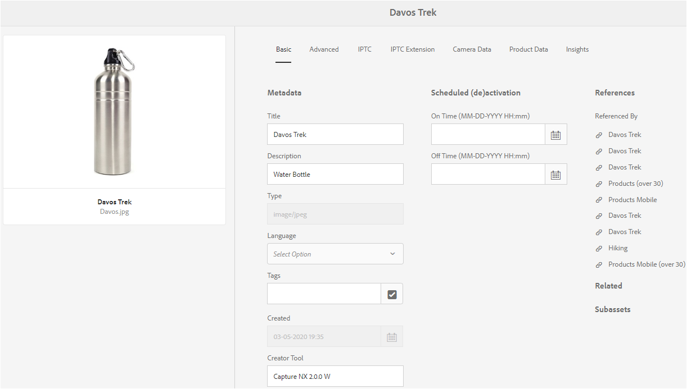
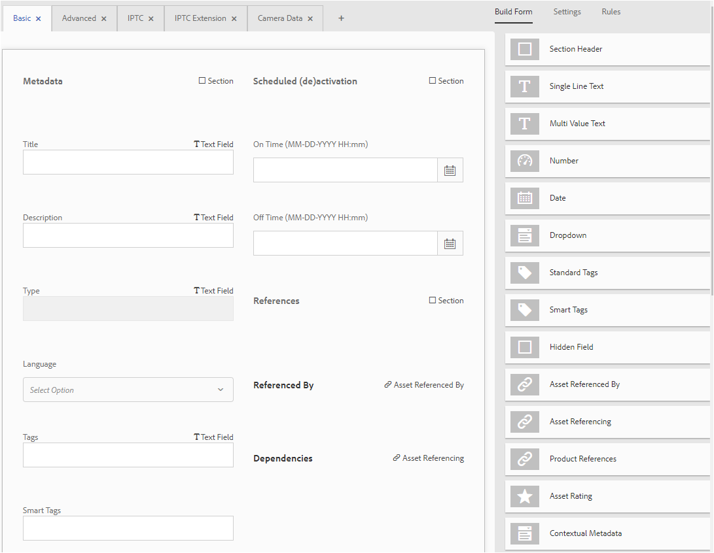
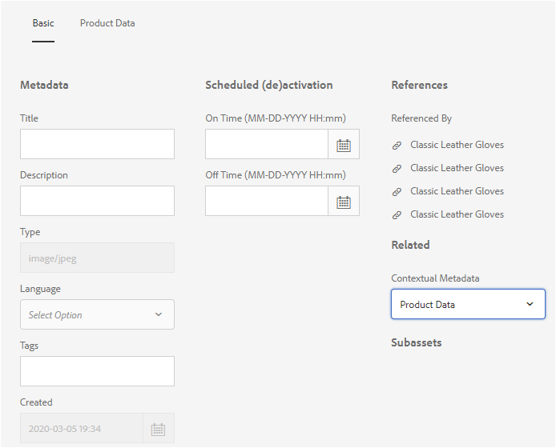
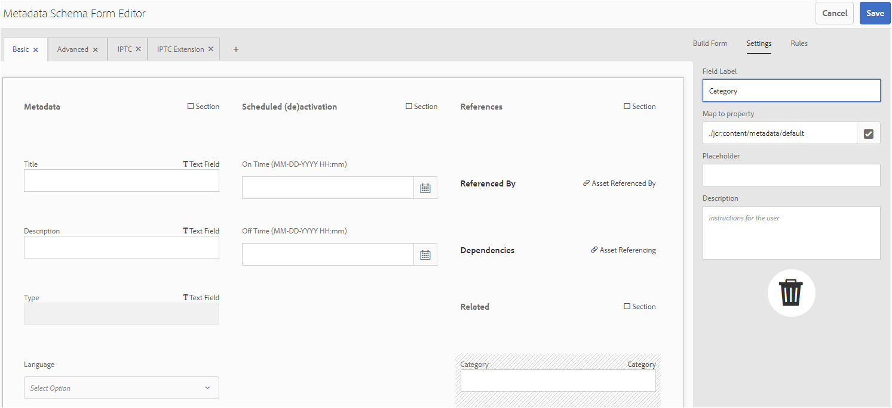
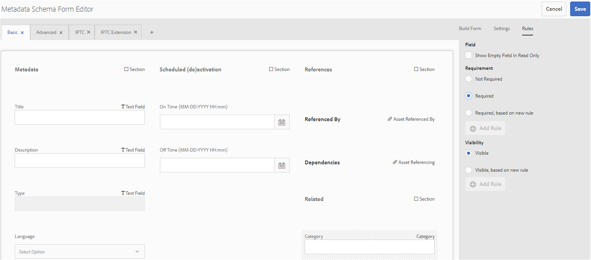

# Metadata schemas {#metadata-schemas}

Organizations come up with a metadata model that enhances the asset discovery, usage, interoperability, and so on. Correct metadata application is sacrosanct to maintaining metadata-driven workflows and processes. To adhere to organization-wide metadata strategy and standards, you can use metadata schemas that help DAM users to align. [!DNL Adobe Experience Manager] allows easy and flexible methods to create, maintain, and apply metadata schemas.

In [!DNL Adobe Experience Manager Assets], schemas contain specific fields for specific information to be filled in. It also contains layout information to display metadata fields in a user-friendly way. Metadata properties include title, description, MIME types, tags, and more. You can use the [!UICONTROL Metadata Schema Forms] editor to modify the existing schemas or add custom metadata schemas.

To view and edit the properties page for an asset, follow these steps:

1. Click the **[!UICONTROL View Properties]** option from the quick actions on the asset tile in card view.

   

   Alternatively, select an asset and then click **[!UICONTROL Properties]** from the toolbar.

1. You can edit the various editable metadata properties under the available tabs. However, you cannot modify the asset [!UICONTROL Type] in the [!UICONTROL Basic] tab of properties page.

   

 *Figure: Basic tab on asset [!UICONTROL Properties].*

   To modify the MIME type for an asset, use a custom metadata schema form or modify an existing form. See [Edit Metadata Schema Forms](/help/assets/metadata-schemas.md#edit-metadata-schema-forms) for more information. If you modify the metadata schema of a MIME type, the properties page layout for the assets and all subtypes are modified. For example, modifying a jpeg schema under `default/image` only modifies the metadata layout (asset properties) for assets with MIME type `image/jpeg`. However, if you edit the default schema, your changes modify the metadata layout for all types of assets.

## Metadata Schema Forms {#default-metadata-schema-forms}

To view a list of forms or templates, in [!DNL Experience Manager] interface navigate to **[!UICONTROL Tools]** > **[!UICONTROL Assets]** > **[!UICONTROL Metadata Schemas]**.

[!DNL Experience Manager] provides the following Metadata Schema Form templates.

| Templates | | Description |
|---|---|---|
| [!UICONTROL default] | | The base metadata schema form for assets. |
| | The following child forms inherit the properties of the [!UICONTROL default] form: | |
| | <ul><li>[!UICONTROL dm_video]</li></ul> | Schema form for Dynamic Media videos. |
| |<ul><li>[!UICONTROL image]</li></ul> | Schema form for images with the MIME type such as `image/jpeg` and `image/png`.   The [!UICONTROL image] form has the following child form templates: <ul><li> [!UICONTROL jpeg]: Schema form for assets with sub type [!UICONTROL jpeg].</li> <li>[!UICONTROL tiff]: Schema form for the assets with sub type TIFF.</li></ul> |
| | <ul><li>[!UICONTROL application]</li></ul> | Schema form for assets with MIME type such as `application/pdf` and `application/zip`.  [!UICONTROL pdf]: Schema form for assets with sub type PDF. |
| |<ul><li>[!UICONTROL video]</li></ul>| Schema form for video assets with MIME type such as `video/avi` and `video/mp4`. |
| [!UICONTROL collection] | | Schema form for collections. |
| [!UICONTROL contentfragment] | | [Schema form for content fragments](/help/sites-developing/customizing-content-fragments.md). |
| [!UICONTROL forms] | | This schema form relates to [Adobe Experience Manager Forms](/help/forms/home.md). |
 | [!UICONTROL ugc_contentfragment] | | Schema form for user generated content pieces and assets integrated into Experience Manager from social media. |

>[!NOTE]
>
>To view the child forms of a schema form, click the schema form name.

## Add a metadata schema form {#add-a-metadata-schema-form}

To add a metadata schema form, follow these steps:

1. To add a custom template to the list, click **[!UICONTROL Create]** from the toolbar.

   >[!NOTE]
   >
   >A lock symbol is displayed with the unedited templates. If you customize a template, it is not locked .

1. In the dialog, provide the title of the schema form and click **[!UICONTROL Create]** to complete the form creation process.

## Edit metadata schema forms {#edit-metadata-schema-forms}

You can edit a newly added or existing metadata schema form. The metadata schema form includes tabs and form items within tabs. You can map/configure these form items to a field within a metadata node in the CRX repository. You can add tabs or form items to the metadata schema form. The tabs and form items derived from the parent are in the locked state. You cannot alter them at the child level.

1. On the [!UICONTROL Metadata Schema Forms] page, select a form and click **[!UICONTROL Edit]** in the toolbar.

1. On the **[!UICONTROL Metadata Schema Form Editor]** page, customize the metadata form. Drag the needed components from the **[!UICONTROL Build Form]** tab to one of the tabs.

   

   *Figure: A [!UICONTROL Metadata Schema Form Editor] page with available tabs.*

1. To configure a component, select it and modify its properties in the **[!UICONTROL Settings]** tab.

### Components within the [!UICONTROL Build Form] tab {#components-within-the-build-form-tab}

The **[!UICONTROL Build Form]** tab lists form items that you use in your schema form. The **[!UICONTROL Settings]** tab provides the attributes of each item that you select in the **[!UICONTROL Build Form]** tab. The following table lists the form items available in the **[!UICONTROL Build Form]** tab:

|          Component Name          |                                     Description                                     |
| -------------------------------- | ----------------------------------------------------------------------------------- |
| [!UICONTROL Section Header]      | Add a section heading for a list of common components.                              |
| [!UICONTROL Single Line Text]    | Add a single line text property. It is stored as a string.                          |
| [!UICONTROL Multi Value Text]    | Add a multi value text property. It is stored as a string array.                    |
| [!UICONTROL Number]              | Add a number component.                                                             |
| [!UICONTROL Date]                | Add a date component.                                                               |
| [!UICONTROL Dropdown]            | Add a drop-down list.                                                                |
| [!UICONTROL Standard Tags]       | Add a tag.                                                                          |
| [!UICONTROL Smart Tags]          | Add to augment search capabilities by automatically adding metadata tags.           |
| [!UICONTROL Hidden Field]        | Add a hidden field. It is sent as a POST parameter when the asset is saved.         |
| [!UICONTROL Asset Referenced By] | Add this component to view list of assets referenced by the asset.                  |
| [!UICONTROL Asset Referencing]   | Add to display a list of assets that reference the asset.                           |
| [!UICONTROL Products References] | Add to show the list of products linked with the asset.                             |
| [!UICONTROL Asset Rating]        | Add to display options for rating the asset.                                        |
| [!UICONTROL Contextual Metadata] | Add to control the display of other metadata tabs in the properties page of assets. |

#### Edit the metadata component {#edit-the-metadata-component}

To edit the properties of a metadata component on the form, click the component to edit all or a subset of the following properties in the **[!UICONTROL Settings]** tab.

**Field Label**: The name of the metadata property that is displayed on the properties page for the asset.

**Map to Property**: This property specifies the relative path to or name of the asset node where it is saved in the CRX repository. It starts with `./` to indicate that the path is under the asset's node.

The following are the valid values for this property:

* `./jcr:content/metadata/dc:title`: Stores the value at the asset's metadata node as the property `dc:title`.

* `./jcr:created`: Stores the creation date and time of an asset. It is a protected property. If you configure these properties, Adobe recommends that you mark them as Disable Edit.

To ensure that the component is displayed properly in the metadata schema form, the property path should not include any spaces.

* **Placeholder**: Use this property to specify relevant placeholder text regarding the metadata property.
* **Required**: Use this property to mark a metadata property as mandatory on the properties page.
* **Disable Edit**: Use this property to disallow any edits to a property on the properties page.
* **Show Empty Field In Read Only**: Mark this property to display a metadata property on the properties page even if it has no value. By default, when a metadata property has no value, it is not be listed on the properties page.
* **Show list ordered**: Use this property to display an ordered list of choices.
* **Choices**: Use this property to specify choices in a list.
* **Description** : Use this property to add a short description for the metadata component.
* **Class**: Object class the property is associated with.
* **Delete**: Click [!UICONTROL Delete] to delete a component from the schema form.

>[!NOTE]
>
>The [!UICONTROL Hidden Field] component does not include these attributes. Instead, it includes properties, such as attributes Name, Value, Field Label, and Description. The values for the Hidden Field component are sent as a POST parameter whenever the asset is saved. It is not be saved as metadata for the asset.

If you select the **[!UICONTROL Required]** option, you can search for assets missing mandatory metadata. From the **[!UICONTROL Filters]** panel, expand the **[!UICONTROL Metadata Validation]** predicate and select the **[!UICONTROL Invalid]** option. The search results display assets missing mandatory metadata that you configured through the schema form.

If you add the Contextual Metadata component to any tab of any schema form, the component appears as a list in the properties page of assets to which the particular  schema  is applied. The list includes all other tabs except the tab to which you applied the Contextual Metadata component. Currently, this feature provides basic functionality to control the display of metadata based on the context.

To display any tab in the properties page in addition to the tab where the Contextual Metadata component is applied, select the tab from the list. The tab is added to the properties page.

*Figure: Contextual metadata in asset properties page.*

### Specify properties in JSON file {#specify-properties-in-json-file}

Instead of specifying properties for the options in the **[!UICONTROL Settings]** tab, you can define the options in a JSON file by specifying corresponding key-value pairs. Specify the path of the JSON file in the **[!UICONTROL JSON Path]** field.

#### Add or delete a tab in the schema form {#adding-deleting-a-tab-in-the-schema-form}

The schema editor lets you add or delete a tab. The default schema form includes the **[!UICONTROL Basic]**, **[!UICONTROL Advanced]** , **[!UICONTROL IPTC]**, and **[!UICONTROL IPTC Extension]** tabs.

Click `+` to add a tab on a schema form. By default, the new tab has the name `Unnamed-1`. You can modify the name from the **[!UICONTROL Settings]** tab.

Click `X` to delete a tab.

## Delete metadata schema forms {#delete-metadata-schema-forms}

[!DNL Experience Manager] lets you delete custom schema forms only. It does not let you delete the default schema forms/templates. However, you can delete any custom changes in these forms.

To delete a form, select a form and click delete.

>[!NOTE]
>
>* After you delete custom changes to a default form, the lock  reappears before the form. It indicates that the form is reverted to its default state.
>* You cannot delete the default metadata schema forms in [!DNL Assets].

## Schema forms for MIME types {#schema-forms-for-mime-types}

[!DNL Experience Manager] provides default forms for various MIME types out of the box. However, you can add custom forms for assets of various MIME types.

### Add new forms for MIME types {#add-new-forms-for-mime-types}

Create a form under the appropriate form type. For example, to add a template for the `image/png` subtype, create the form under the "image" forms. The title for the schema form is the subtype name. In this case, the title is `png`.

#### Use an existing schema template for various MIME types {#use-an-existing-schema-template-for-various-mime-types}

You can use an existing template for a different MIME type. For example, use the `image/jpeg` form for assets of MIME type `image/png`.

In this case, create a node at `/etc/dam/metadataeditor/mimetypemappings` in the CRX repository. Specify a name for the node and define the following properties:

| Name | Description | Type | Value |
|------|-------------|------|-------|
| `exposedmimetype` | Name of the existing form to be mapped | `String` | `image/jpeg` |
| `mimetypes` | List of MIME types that use the form defined in the `exposedmimetype` attribute | `String` | `image/png` |

[!DNL Assets] maps the following MIME types and schema forms:

|         Schema Form         |                     MIME types                      |
| --------------------------- | --------------------------------------------------- |
| image/jpeg                  | image/pjpeg                                         |
| image/tiff                  | image/x-tiff                                        |
| application/pdf             | application/postscript                              |
| application/x-ImageSet      | Multipart/Related; type=application/x-ImageSet      |
| application/x-SpinSet       | Multipart/Related; type=application/x-SpinSet       |
| application/x-MixedMediaSet | Multipart/Related; type=application/x-MixedMediaSet |
| video/quicktime             | video/x-quicktime                                   |
| video/mpeg4                 | video/mp4                                           |
| video/avi                   | video/avi, video/msvideo, video/x-msvideo           |
| video/wmv                   | video/x-ms-wmv                                      |
| video/flv                   | video/x-flv                                         |

## Grant access to metadata schemas {#grant-access-to-metadata-schemas}

The Metadata Schema feature is available to administrators only. However, administrators can provide access to non-administrators by modifying some permissions. Provide the non-administrator users create, modify, and delete permissions on the `/conf` folder.

## Apply folder-specific metadata {#apply-folder-specific-metadata}

[!DNL Assets] lets you define a variant of a metadata schema and apply it to a specific folder.

For example, you can define a variant of the default metadata schema and apply it to a folder. When you apply the modified schema, it overrides the original default metadata schema that is applied to assets within the folder.

Only assets uploaded to the folder to which this schema is applied conform to the modified metadata defined in the variant metadata schema. [!DNL Assets] in other folders where the original schema is applied continue to conform to metadata defined in the original schema.

Metadata inheritance by assets is based on the schema that is applied to the first-level folder in the hierarchy. In other words, if a folder does not contain subfolders, the assets within the folder inherit the metadata from the schema applied to the folder.

You can apply a different schema at the subfolder. The assets within a subfolder inherit the metadata schema of the immediate subfolder. If no schema or the same schema is applied at the subfolder level, its assets inherit schema from the parent folder.

1. In [!DNL Experience Manager] interface, navigate to **[!UICONTROL Tools]** > **[!UICONTROL Assets]** > **[!UICONTROL Metadata Schemas]**. The **[!UICONTROL Metadata Schema Forms]** page is displayed.
1. Select the check box before a form, for example the default metadata form, and click the **[!UICONTROL Copy]** and save it as a custom form. Specify a custom name for the form, for example `my_default`. Alternatively, you can create a custom form.

1. In the **[!UICONTROL Metadata Schema Forms]** page, select the `my_default` form, and then click **[!UICONTROL Edit]**.

1. In the **[!UICONTROL Metadata Schema Editor]** page, add a text field to the schema form. For example, add a field with the label **[!UICONTROL Category]**.

   

   *Figure: Text field added to metadata schema form editor.*

1. Click **[!UICONTROL Save]**. The modified form is listed in the **[!UICONTROL Metadata Schema Forms]** page.
1. Click **[!UICONTROL Apply to Folder(s)]** from the toolbar to apply the custom metadata to a folder.

1. Select the folder on which to apply the modified schema and then click **[!UICONTROL Apply]**.

   

1. If the folder has the other metadata schema applied, a message appears warning that you are about to overwrite the existing metadata schema. Click **Overwrite**.
1. Click **OK** to close the success message.
1. Navigate to the folder to which you applied the modified metadata schema.

## Define mandatory metadata {#define-mandatory-metadata}

You can define mandatory fields at a folder level, which is enforced on assets that are uploaded to the folder. If you upload assets with missing metadata for the mandatory fields defined earlier, a visual indication for missing metadata appears on the assets in the card view.

>[!NOTE]
>
>A metadata field can be defined as mandatory based on the value of another field. In the card view, [!DNL Experience Manager] does not display the warning message about missing metadata for such mandatory metadata fields.

1. In [!DNL Experience Manager] interface, navigate to **[!UICONTROL Tools]** > **[!UICONTROL Assets]** > **[!UICONTROL Metadata Schemas]**. The **[!UICONTROL Metadata Schema Forms]** page is displayed.
1. Save the default metadata form as a custom form. For example, save it as `my_default`.

1. Edit the custom form. Add a mandatory field. For example, add a **[!UICONTROL Category]** field and make the field mandatory.

   

   *Figure: Mandatory field in metadata schema form editor.*

1. Click **[!UICONTROL Save]**. The modified form is listed in the **[!UICONTROL Metadata Schema Forms]** page. Select the form and then click **[!UICONTROL Apply to Folder(s)]** from the toolbar to apply the custom metadata to a folder.

1. Navigate to the folder and upload some assets with missing metadata for the mandatory field you added to the custom form. A message for the missing metadata for the mandatory field is displayed on the card view of the asset.

   

1. (Optional) Access `https://[aem_server]:[port]/system/console/components/`. Configure and enable `com.day.cq.dam.core.impl.MissingMetadataNotificationJob` component that is disabled by default. Set a frequency at which [!DNL Experience Manager] checks for the validity of metadata on the assets. This configuration adds a property `hasValidMetadata` to `jcr:content` of assets. [!DNL Experience Manager] uses this property to filter the invalid assets in a search result. If you add an asset after a check, the asset is not flagged with `hasValidMetadata` until the next scheduled check. Hence the assets do not appear in search filters for invalid metadata untill after the next scheduled check.

   >[!CAUTION]
   >
   >The metadata validation checks are resource-intensive and may impact the performance of your system. Schedule the checks accordingly. If the server cannot cope up with the load, try disabling this job.

<!-- TBD: Add this method to find invalid metadata in the metadata.md article later when it is published as a top-level metadata article.
-->
