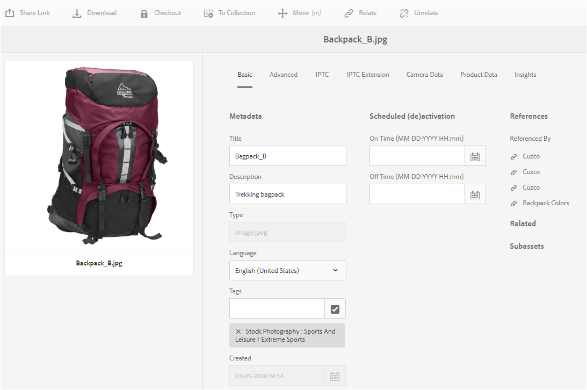
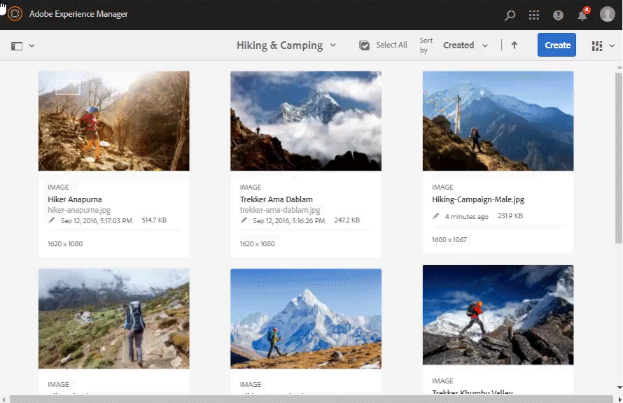
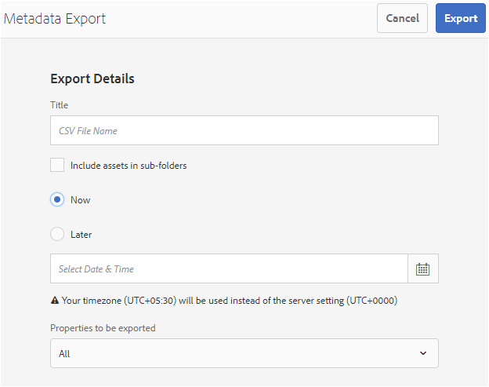

# Manage metadata of your digital assets {#managing-metadata-for-digital-assets}

| Version | Article link |
| -------- | ---------------------------- |
| AEM as a Cloud Service  |    [Click here](https://experienceleague.adobe.com/docs/experience-manager-cloud-service/content/assets/manage/manage-metadata.html?lang=en)                  |
| AEM 6.5     | This article         |

<!-- Scope of metadata articles:
* metadata.md: The scope of this article is basic metadata updates, changes, etc. operations that end-users can do.
* metadata-concepts.md: All conceptual information. Minor instructions are OK but it is an FYI article about support and standards.
* metadata-config.md: New article. Contains all configuration and administration how-to info related to metadata of assets.
-->

[!DNL Adobe Experience Manager Assets] keeps metadata for every asset. It allows easier categorization and organization of assets and it helps people who are looking for a specific asset. With the ability to extract metadata from files uploaded to [!DNL Experience Manager Assets], metadata management integrates with the creative workflow. With the ability to keep and manage metadata with your assets, you can automatically organize and process assets based on their metadata.

## Metadata and its origin {#how-to-edit-or-add-metadata}

Metadata is additional information about the asset that can be searched. It is added to assets and in [!DNL Experience Manager] it is processed when you upload an asset. You can edit the existing metadata, add new metadata properties to existing fields. Organizations need controlled and reliable metadata vocabularies. Hence [!DNL Experience Manager Assets] does not allow for on-demand adding of new metadata properties. Only administrators and developers can add new properties or fields that hold metadata. Users can populate the existing fields with metadata.

The following methods can be used to add metadata to digital assets:

* To begin with, the native applications that create assets add some metadata to it. For example, [Acrobat adds some metadata](https://helpx.adobe.com/acrobat/using/pdf-properties-metadata.html) to PDF files or a camera adds some basic metadata to the photographs. When generating assets, you can add the metadata in native applications itself. For example, you can [add IPTC metadata in Adobe Lightroom](https://helpx.adobe.com/lightroom-classic/help/metadata-basics-actions.html).

* Before uploading an asset to [!DNL Experience Manager], you can edit and modify metadata using either the native application used to create an asset or using some other metadata editing application. When you upload an asset to Experience Manager, the metadata is processed. For example, see how to [work with metadata in [!DNL Adobe Bridge]](https://helpx.adobe.com/bridge/user-guide.html/bridge/using/metadata-adobe-bridge.ug.html) and see the [tags panel for [!DNL Adobe Bridge]](https://exchange.adobe.com/creativecloud.details.20009.aem-tags-panel-for-bridge-cc.html) in [!DNL Adobe Exchange].

* In [!DNL Experience Manager Assets], you can manually add or edit metadata of assets in the [!UICONTROL Properties] page.

* You can leverage [metadata profiles](/help/assets/metadata-config.md#metadata-profiles) functionality of [!DNL Experience Manager Assets] to automatically add metadata when assets are uploaded to DAM.

## Add or edit metadata in [!DNL Experience Manager Assets] {#add-edit-metadata}

To edit the metadata of an asset in [!DNL Assets] user interface, follow these steps:

1. Do one of the following:

    * From the [!DNL Assets] interface, select the asset and click **[!UICONTROL View Properties]** from the toolbar.
    * From the asset thumbnail, select the **[!UICONTROL View Properties]** quick action.
    * From the asset page, click **[!UICONTROL View Properties]**  from the toolbar.

   The asset page displays all the asset's metadata. The metadata is extracted when the asset is uploaded (ingested) into [!DNL Experience Manager].

   

   *Figure: Edit or add metadata on asset [!UICONTROL Properties] page.*

1. Make edits to the metadata under the various tabs, as required, and when completed, click **[!UICONTROL Save]** from the toolbar to save your changes. Click **[!UICONTROL Close]** to return to the [!DNL Assets] web interface.

   >[!NOTE]
   >
   >If a text field is empty, there is no existing metadata set. You can enter a value into the field and save it to add that metadata property.

Any changes to the metadata of an asset are written back to the original binary as part of its XMP data. The metadata write-back workflow adds the metadata to the original binary. Changes made to the existing properties (such as `dc:title`) are overwritten and new properties (including custom properties like `cq:tags`) are added with the schema.

XMP write-back is supported and enabled for the platforms and file formats described in [technical requirements.](/help/sites-deploying/technical-requirements.md)

## Edit metadata properties of multiple assets {#editing-metadata-properties-of-multiple-assets}

[!DNL Adobe Enterprise Manager Assets] lets you edit the metadata of multiple assets simultaneously so you can quickly propagate common metadata changes to assets in bulk. You can also edit the metadata for multiple collections in bulk. Use the properties page to perform metadata changes on multiple assets or collections:

* Change metadata properties to a common value
* Add or modify tags

To customize the metadata properties page, including adding, modifying, deleting metadata properties, use the [schema editor](metadata-config.md#folder-metadata-schema).

>[!NOTE]
>
>The bulk editing methods work for assets available in a folder or a collection. For the assets that are available across folders or match a common criteria, it is possible to [bulk update the metadata after searching](search-assets.md#metadataupdates).

1. In the [!DNL Assets] user interface, navigate to the location of the assets you want to edit.
1. Select the assets for which you want to edit common properties.
1. From the toolbar, click **[!UICONTROL Properties]** to open the properties page for the selected assets.
1. Modify the metadata properties for selected assets under the various tabs.
1. To view the metadata of a specific asset, cancel the selection of the remaining assets in the list. If you cancel the selection of a few assets on the [!UICONTROL Properties] page, the metadata of such assets is not updated.
1. To select a different metadata schema for the assets, click **[!UICONTROL Settings]** from the toolbar, and select a schema. Click **[!UICONTROL Save & Close]**.
1. To append the new metadata with the existing metadata in fields that contain multiple values, select **[!UICONTROL Append mode]**. If you do not select this option, the new metadata replaces the existing metadata in the fields. Click **[!UICONTROL Submit]**.

   >[!CAUTION]
   >
   >For single-value fields, the new metadata is not appended to the existing value in the field even if you select **[!UICONTROL Append mode]**.

## Import metadata {#import-metadata}

[!DNL Assets] lets you import asset metadata in bulk using a CSV file. You can do bulk updates for the recently uploaded assets or the existing assets by importing a CSV file. You can also ingest asset metadata in bulk from third-party system in CSV format.

The metadata import is asynchronous and does not impede system performance. Simultaneous update of the metadata for multiple assets can be resource-intensive because of XMP writeback activity if workflow flag is checked. Plan such an import during lean server usage so that performance for other users is not impacted.

>[!NOTE]
>
>To import metadata on custom namespaces, first register the namespaces.

1. Navigate to the [!DNL Assets] user interface, and click **[!UICONTROL Create]** from the toolbar.
1. From the menu, select **[!UICONTROL Metadata]**.
1. In the **[!UICONTROL Metadata Import]** page, click **[!UICONTROL Select File]**. Select the CSV file with the metadata.
1. Specify the following parameters. See a sample CSV file at [metadata-import-sample-file.csv](/help/assets/assets/metadata-import-sample-file.csv).

    | Metadata import parameters | Description |
    |:---|:---|
    | [!UICONTROL Batch Size] | Number of assets in a batch for which metadata is to be imported. Default value is 50. Maximum value is 100. |
    | [!UICONTROL Field Separator] | Default value is `,` (a comma). You can specify any other character. |
    | [!UICONTROL Multi Value Delimiter] | Separator for metadata values. Default value is `|`. |
    | [!UICONTROL Launch Workflows] | False by default. When set to `true` and default settings are in effect for the [!UICONTROL DAM Metadata WriteBack] workflow (that writes metadata to the binary XMP data). Enabling the workflows slows the system down. |
    | [!UICONTROL Asset Path Column Name] | Defines the column name for the CSV file with assets. |

1. Click **[!UICONTROL Import]** from the toolbar. After the metadata is imported, a notification is displayed in [!UICONTROL Notification] inbox.

1. To verify correct import, navigate to an asset's [!UICONTROL Properties] page and verify the values in the fields.

To add date and timestamp when importing metadata, use `YYYY-MM-DDThh:mm:ss.fff-00:00` format for date and time. Date and time are separated by `T`, `hh` is hours in 24-hour format, `fff` is nanoseconds, and `-00:00` is timezone offset. For example, `2020-03-26T11:26:00.000-07:00` is March 26, 2020 at 11:26:00.000 AM PST time.

>[!CAUTION]
>
>If the date format does not match `YYYY-MM-DDThh:mm:ss.fff-00:00`, the date values are not set. The date formats of exported metadata CSV file is in the format `YYYY-MM-DDThh:mm:ss-00:00`. If you want to import it, convert it to the acceptable format by adding the nanoseconds value denoted by `fff`.

## Export metadata {#export-metadata}

You can export metadata for multiple assets in a CSV format. The metadata is exported asynchronously and does not impact the performance of the system. To export metadata, [!DNL Experience Manager] traverses through the properties of the asset node `jcr:content/metadata` and its child nodes and exports the metadata properties in a CSV file.

A few use cases for exporting metadata in bulk are:

* Import the metadata in a third-party system when migrating assets.
* Share asset metadata with a wider project team.
* Test or audit the metadata for compliance.
* Externalize the metadata to localize it separately.

1. Select the asset folder that contains assets for which you want to export metadata. From the toolbar, select **[!UICONTROL Export metadata]**.

1. In the [!UICONTROL Metadata Export] dialog, specify a name for the CSV file. To export metadata for assets in subfolders, select **[!UICONTROL Include assets in subfolders]**.

   

1. Select the desired options. Provide a filename and if necessary a date.

1. In the **[!UICONTROL Properties to be exported]** field, specify whether you want to export all or specific properties. If you choose Selective properties to be exported, add the desired properties.  

1. From the toolbar, click **[!UICONTROL Export]**. A message confirms that the metadata is exported. Close the message.

1. Open the inbox notification for the export job. Select the job and click **[!UICONTROL Open]** from the toolbar. To download the CSV file with the metadata, click **[!UICONTROL CSV Download]** from the toolbar. Click **[!UICONTROL Close]**.

   

   *Figure: Dialog to download the CSV file containing metadata exported in bulk.*

## Edit metadata of collections {#collections-metadata}

For details, see [view and edit collection metadata](/help/assets/manage-collections.md#view-edit-collection-metadata) and [edit metadata of multiple collections in bulk](/help/assets/manage-collections.md#editing-collection-metadata-in-bulk).

## Apply a metadata profile to folders {#applying-a-metadata-profile-to-folders}

<!-- TBD: Review this overview.
-->

When you assign a metadata profile to a folder, any subfolders automatically inherit the profile from its parent folder. This means that you can assign only one metadata profile to a folder. As such, consider carefully the folder structure of where you upload, store, use, and archive assets.

If you assigned a different metadata profile to a folder, the new profile overrides the previous profile. The previously existing folder assets remain unchanged. The new profile is applied on the assets that are added to the folder later.

Folders that have a profile assigned to it are indicated in the user interface by the name of the profile appearing in the card name.

You can apply metadata profiles to specific folders or globally to all assets.

You can reprocess assets in a folder that already has an existing metadata profile that you later changed. See [Reprocessing assets in a folder after you have edited its processing profile](processing-profiles.md#reprocessing-assets).

You can apply a metadata profile to a folder from within the **[!UICONTROL Tools]** menu or if you are in the folder, from **[!UICONTROL Properties]**. This section describes how to apply metadata profiles to folders both ways.

Folders that have a profile already assigned to it are indicated by the display of the profile's name directly below the folder name.

You can reprocess assets in a folder that already has an existing video profile that you later changed. See [Reprocessing assets in a folder after you have edited its processing profile](processing-profiles.md#reprocessing-assets).

### Apply metadata profiles to folders from [!UICONTROL Profiles] user interface {#applying-metadata-profiles-to-folders-from-profiles-user-interface}

Follow the steps to apply metadata profile:

1. Click the [!DNL Experience Manager] logo and navigate to **[!UICONTROL Tools]** > **[!UICONTROL Assets]** > **[!UICONTROL Metadata Profiles]**.
1. Select the metadata profile that you want to apply to a folder or multiple folders.
1. Click **[!UICONTROL Apply Metadata Profile to Folder(s)]** and select the folder or multiple folders you want use to receive the newly uploaded assets and click **[!UICONTROL Done]**. Folders that have a profile already assigned to it are indicated by the display of the profile's name directly below the folder name.

### Apply metadata profiles to folders from [!UICONTROL Properties] {#applying-metadata-profiles-to-folders-from-properties}

1. In the left rail, click **[!UICONTROL Assets]** then navigate to the folder that you want to apply a metadata profile to.
1. On the folder, click the check mark to select it and then click **[!UICONTROL Properties]**.  

1. Select the **[!UICONTROL Metadata Profiles]** tab and select the profile from the popup menu and click **[!UICONTROL Save]**.

Folders that have a profile already assigned to it are indicated by the display of the profile's name directly below the folder name.

<!-- TBD: Commenting as the topic in metadata-config.md is incomplete.

### Apply metadata profile globally {#metadata-profile-global}

For details, see [configuration to apply metadata profile globally](/help/assets/metadata-config.md#apply-a-metadata-profile-globally). -->

### Remove a metadata profile from folders {#removing-a-metadata-profile-from-folders}

When you remove a metadata profile from a folder, any subfolders automatically inherit the removal of the profile from its parent folder. However, any processing of files that has occurred within the folders remains intact.

You can remove a metadata profile from a folder from within the **[!UICONTROL Tools]** menu or from the **[!UICONTROL Properties]** from within the folder.

#### Remove metadata profiles from folders via Profiles user interface {#removing-metadata-profiles-from-folders-via-profiles-user-interface}

1. Click the [!DNL Experience Manager] logo and navigate to **[!UICONTROL Tools]** > **[!UICONTROL Assets]** > **[!UICONTROL Metadata Profiles]**.
1. Select the metadata profile that you want to remove from a folder or multiple folders.
1. Click **[!UICONTROL Remove Metadata Profile from Folder(s)]** and select the folder or multiple folders you want use to remove a profile from and click **[!UICONTROL Done]**.

   You can confirm that the metadata profile is no longer applied to a folder because the name no longer appears below the folder name.

#### Remove metadata profiles from folders via Properties {#removing-metadata-profiles-from-folders-via-properties}

1. Click the [!DNL Experience Manager] logo and navigate **[!UICONTROL Assets]** and then to the folder that you want to remove an metadata profile from.
1. On the folder, click the check mark to select it and then click **[!UICONTROL Properties]**.
1. Select the **[!UICONTROL Metadata Profiles]** tab and select **[!UICONTROL None]** from the drop-down menu and click **[!UICONTROL Save]**. Folders that have a profile already assigned to it are indicated by the display of the profile's name directly below the folder name.

## Tips and limitations {#best-practices-limitations}

* The metadata updates via user interface changes the metadata properties in the `dc` namespace. Any updates made via the HTTP API changes the metadata properties in the `jcr` namespace. See [how to update metadata using HTTP API](/help/assets/mac-api-assets.md#update-asset-metadata).

* The CSV file for importing assets metadata is in a very specific format. To save effort and time and to avoid unintended errors, you can start creating the CSV using the format of an exported CSV file.

* When importing metadata using a CSV file, the required date date format is `YYYY-MM-DDThh:mm:ss.fff-00:00`. If any other format is used, then the date values are not set. The date formats of exported metadata CSV file is in the format `YYYY-MM-DDThh:mm:ss-00:00`. If you want to import it, convert it to the acceptable format by adding the nanoseconds value denoted by `fff`.

>[!MORELIKETHIS]
>
>* [Metadata concepts and understanding](metadata-concepts.md).
>* [Edit metadata properties of multiple collections](manage-collections.md#editing-collection-metadata-in-bulk)
>* [Metadata import and export in Experience Manager Assets](https://experienceleague.adobe.com/docs/experience-manager-learn/assets/metadata/metadata-import-feature-video-use.html)

<!-- TBD: Try filling the available information in these topics to the extent possible. As and when complete, publish the sections live.

## Where to find metadata of an asset or folder {#find-metadata}

What all methods to access asset Properties. More Details option in column view. Select asset and click Properties. Keyboard shortcut `p`. What else?

## Understand metadata handling in Experience Manager {#metadata-possibilities-with-aem}

Describe the journey of an assets' metadata. What all happens to metadata when an asset is added to Experience Manager.

## Add metadata to your digital assets {#add-metadata}

* To begin with, assets come with some metadata. The applications that create digital assets add some metadata to the assets created. Before uploading an asset to Experience Manager, you can edit and modify metadata using either the native application used to create an asset or using some other metadata editing application. When you upload an asset to Experience Manager, the metadata is processed.

* Link to PS, ID, AI, PDF, etc. metadata-related help articles.

* Link to XMP writeback.

* Manually add (or edit) metadata in AEM in Properties page.

* Metadata profiles

* Any workflows related to metadata?

* Advanced topic: Add, edit, modify, process and writeback metadata of subassets.

## Metadata of assets, folders, and collections {#metadata-of-assets-folders-collections}

Similarities and differences between metadata of asset and folder. 

Link to metadata handling of collections.

## Modify metadata of an asset, folder, or collection {#modify-metadata}

* While creating assets: Native application.

* Before ingesting assets: Metadata editors

* After ingesting assets: Properties of an asset, folder, collection, etc.

* Any supported programmatic method to bulk edit metadata directly in JCR?

## Modify metadata in bulk {#modify-metadata-in-bulk}

[!DNL Adobe Enterprise Manager Assets] lets you edit the metadata of multiple assets simultaneously so you can quickly propagate common metadata changes to assets in bulk. You can also edit the metadata for multiple collections in bulk.

Use the properties page to perform metadata changes on multiple assets or collections:

* Change metadata properties to a common value

* Add or modify tags

To customize the metadata properties page, including adding, modifying, deleting metadata properties, use the schema editor.

>[!NOTE]
>
>The bulk editing methods work for assets available in a folder or a collection. For the assets that are available across folders or match a common criteria, it is possible to [bulk update the metadata after searching](search-assets.md#metadataupdates).

1. In the [!DNL Assets] user interface, navigate to the location of the assets you want to edit.
1. Select the assets for which you want to edit common properties.
1. From the toolbar, click **[!UICONTROL Properties]** to open the properties page for the selected assets.

   >[!NOTE]
   >
   >When you select multiple assets, the lowest common parent form is selected for the assets. In other words, the properties page only displays metadata fields that are common across the properties pages of all the individual assets.

1. Modify the metadata properties for selected assets under the various tabs.
1. To view the metadata editor for a specific asset, deselect the remaining assets in the list. The metadata editor fields are populated with the metadata for the particular asset.

   >[!NOTE]
   >
   >* In the Properties page, you can remove assets from the asset list by deselecting them. The asset list has all the assets selected by default. The metadata for assets that you remove from the list is not updated.
   >
   >* At the top of assets list, select the check box near **[!UICONTROL Title]** to toggle between selecting the assets and clearing the list.

1. To select a different metadata schema for the assets, click **[!UICONTROL Settings]** from the toolbar, and select the desired schema.
1. Save the changes.
1. To append the new metadata with the existing metadata in fields that contain multiple values, select **[!UICONTROL Append mode]**. If you do not select this option, the new metadata replaces the existing metadata in the fields. click **[!UICONTROL Submit]**.

   >[!CAUTION]
   >
   >For single-value fields, the new metadata is not appended to the existing value in the field even if you select **[!UICONTROL Append mode]**.

-->
