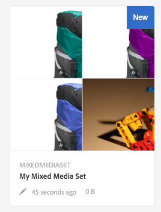
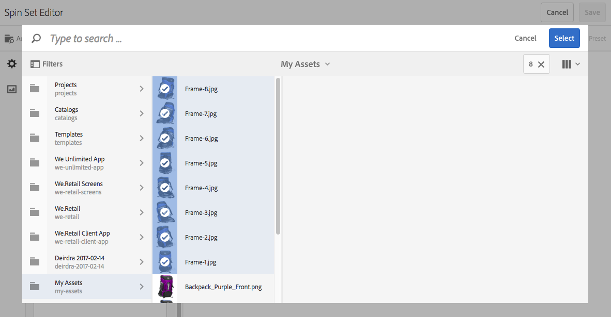
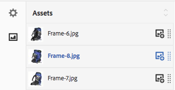

# Mixed Media Sets{#mixed-media-sets}

Mixed Media Sets let you provide a mix of images, Image Sets, Spin Sets, and videos in one presentation.

Mixed Media Sets are designated by a banner with the word **[!UICONTROL MixedMediaSet]**. In addition, if the Mixed Media Set is published, then the publish date, indicated by the **[!UICONTROL World]** icon is on the banner along with the last modification date, indicated by the **[!UICONTROL Pencil]** icon displays.

>[!NOTE]
>
>For information on the Assets user interface, see [Manage assets](/help/assets/manage-assets.md).

## Quick Start: Mixed Media Sets {#quick-start-mixed-media-sets}

To get you up and running quickly with Mixed Media Sets, follow these steps:

1. [Upload your assets](#uploading-assets).

   Start by uploading the images and videos for your Mixed Media Sets. If necessary, create your [Image Sets](/help/assets/image-sets.md) and [Spin Sets](/help/assets/spin-sets.md). Because users can zoom on images in the Mixed Media Set Viewer, choose images carefully. Make sure that the images are least 2000 pixels in the largest dimension.

   See [Dynamic Media - Supported raster image formats](/help/assets/assets-formats.md#supported-raster-image-formats-dynamic-media) for a list of formats supported by Mixed Media Sets.

1. [Create Mixed Media Sets](#creating-mixed-media-sets).

   To create a Mixed Media Set, from the Assets page, select **[!UICONTROL Create]** > **[!UICONTROL Mixed Media Set]** and then name the set, choose the assets, and choose the order the images appear.

   See [Work with Selectors](/help/assets/working-with-selectors.md).

1. Set up [Mixed Media Viewer presets](/help/assets/managing-viewer-presets.md), as needed.

   Administrators can create or modify Mixed Media Set Viewer Presets. To see your mixed media with a viewer preset, select the mixed media set, and in the left-rail drop-down menu, select **[!UICONTROL Viewers]**.

   To create or edit viewer presets, see **[!UICONTROL Tools]** > **[!UICONTROL Assets]** > **[!UICONTROL Viewer Presets]**.

   See [Add and edit Viewer Presets](/help/assets/managing-viewer-presets.md).

1. [Preview Mixed Media Sets](#previewing-mixed-media-sets).

   Select the Mixed Media Set and you can preview it. Select the thumbnail icons so you can examine your Mixed Media Set in the selected Viewer. You can choose different Viewers from the **[!UICONTROL Viewers]** menu, available from the left rail drop-down menu.

1. [Publish Mixed Media Sets](#publishing-mixed-media-sets).

   Publishing a Mixed Media Set activates the URL and Embed string. In addition, you must [publish the viewer preset](/help/assets/managing-viewer-presets.md#publishing-viewer-presets).

1. [Link URLs to your Web Application](/help/assets/linking-urls-to-yourwebapplication.md) or [Embed the Video or Image Viewer](/help/assets/embed-code.md).

   Adobe Experience Manager Assets creates URL calls for Mixed Media Sets and activates them after you publish the mixed media sets. You can copy these URLs when you preview assets. Alternatively you can embed them on your web site.

   Select the Mixed Media Set, then in the left rail drop-down menu, select **[!UICONTROL Viewers]**.

   See [Link a Mixed Media Set to a web page](/help/assets/linking-urls-to-yourwebapplication.md) and [Embed the Video or Image Viewer](/help/assets/embed-code.md).

If necessary, you can edit [Mixed Media Sets](#editing-mixed-media-sets). In addition, you can view and modify [Mixed Media Set properties](/help/assets/manage-assets.md#editing-properties).

>[!NOTE]
>
>If you have issues creating sets, see [Troubleshoot Dynamic Media - Scene7 mode](/help/assets/troubleshoot-dms7.md).

## Upload Assets {#uploading-assets}

Start by uploading the images and videos for your Mixed Media Sets. Because users can zoom on images in the Mixed Media Set Viewer, choose images carefully. Make sure that the images are least 2000 pixels in the largest dimension.

In addition, if you want to add spin sets or image sets to the mixed media set, create those sets too.

See [Dynamic Media - Supported raster image formats](/help/assets/assets-formats.md#supported-raster-image-formats-dynamic-media) for a list of formats supported by Mixed Media Sets.

## Create a Mixed Media Set {#creating-mixed-media-sets}

You can add images, Image Sets, Spin Sets, and videos to your Mixed Media set. Make sure your files, image sets, and spin sets are ready to publish before you add them to the Mixed Media Set.

When you add assets to your set, they are automatically added in alphanumeric order. You can manually reorder or sort assets after they have been added.

**To create a Mixed Media Set:**

1. In Assets, navigate to where you want to create a mixed media set, and select **[!UICONTROL Create]**, and select **[!UICONTROL Mixed Media Set]**. You can also create the set from inside a folder that contains your assets. The Mixed Media Set Editor displays.

   

1. In the Mixed Media Set Editor, in **[!UICONTROL Title]**, enter a name for the Mixed Media Set. The name appears in the banner across the Mixed Media Set. Optionally, enter a description.

   

   >[!NOTE]
   >
   >When creating the mixed media set, you can change the mixed media set thumbnail or allow Experience Manager to select the thumbnail automatically based on the assets in the mixed media set. To select a thumbnail, select **[!UICONTROL Change thumbnail]** and select any image (you can navigate to other folders to find images as well). If you have selected a thumbnail, and then decide that you want Experience Manager to generate one from the mixed media set, select **[!UICONTROL Switch to Automatic thumbnail]**.

1. Select the Asset Selector so you can select assets that you want to include in your Mixed Media Set. Select them and then select **[!UICONTROL Select]**.

   With the Asset Selector, you can search for assets by typing in a keyword and tapping **[!UICONTROL Return]**. You can also apply filters to refine your search results. You can filter by path, collection, file type, and tag. Select the filter and then select the **[!UICONTROL Filter]** icon from the toolbar. Change the view by selecting the **[!UICONTROL View]** icon and selecting **[!UICONTROL List View]**, **[!UICONTROL Column View]**, or **[!UICONTROL Card View]**.

   See [Work with Selectors](/help/assets/working-with-selectors.md).

   

1. Reorder the assets by dragging them up or down the list (must select the **[!UICONTROL Reorder]** icon), as necessary.

   

   If you want to add thumbnails, select the **+** **[!UICONTROL thumbnail]** icon next to the image and navigate to the thumbnail you want. When done selecting all the thumbnail images select **[!UICONTROL Save]**.

   >[!NOTE]
   >
   >If you want to add assets, select **[!UICONTROL Add Asset]**.

1. To delete an asset, select the corresponding check box and select **[!UICONTROL Delete Asset]**.
1. To apply a preset, select **[!UICONTROL Preset]** in the upper right corner and select a preset to apply to the assets.
1. Select **[!UICONTROL Save]**. Your newly created Mixed Media Set appears in the folder you created it in.

## Edit a Mixed Media Set {#editing-mixed-media-sets}

You can perform various editing tasks to assets in Mixed Media Sets directly in the user interface [as you would any asset in Assets](/help/assets/manage-assets.md). You can also perform the following actions in Mixed Media Sets:

* Add assets to the Mixed Media Set.
* Reorder assets in the Mixed Media Set.
* Delete assets in the Mixed Media Set.
* Apply viewer presets.
* Change the default thumbnail.

**To edit a Mixed Media Set:**

1. Do any one of the following:

    * Hover over a Mixed Media Set asset, then select **[!UICONTROL Edit]** (pencil icon).
    * Hover over a Mixed Media Set asset, select **[!UICONTROL Select]** (checkmark icon), then select **[!UICONTROL Edit]** on the toolbar.

    * Select a Mixed Media Set asset, then select **[!UICONTROL Edit]** (pencil icon) on the toolbar.

1. In the Mixed Media Set Editor, do any of the following:

    * To reorder assets - In the left panel, select **[!UICONTROL Assets]** (picture icon), drag an asset to a new location.
    * To add assets - On the toolbar, select **[!UICONTROL Add Asset]**. Navigate to the assets. For each asset that you want to add, hover over the asset's image (not the asset's name), then select the checkmark icon. In the upper-right corner, select **[!UICONTROL Select]**.

    * To delete an asset - In the left panel, select **[!UICONTROL Assets]** (picture icon), then select the asset. On the toolbar bar, select **[!UICONTROL Delete Asset]**.

    * To sort assets by their name in ascending or descending order, in the left panel, select **[!UICONTROL Assets]** (picture icon). To the right of the **[!UICONTROL Assets]** heading, select the up or down caret icons.

        >[!NOTE]
        >
        >* To delete an entire Mixed Media Set, from any viewing mode (such as **[!UICONTROL Card View]** or **[!UICONTROL Column View]**) navigate to the Mixed Media Set. Hover over the asset and select the checkmark icon so you select it. Press **[!UICONTROL Backspace]** on the keyboard, or select **[!UICONTROL More]** (three dots) on the toolbar, then select **[!UICONTROL Delete]**.
        >
        >* You can edit assets in a Mixed Media Set by navigating to the set, and clicking **[!UICONTROL Set Members]** in the left rail. Select the **[!UICONTROL Pencil]** icon on an individual asset so you open it in the editing window.

1. Select **[!UICONTROL Save]** when you are done editing.

    >[!NOTE]
    >
    >* To edit the assets in a Mixed Media Set - Navigate to the Mixed Media Set. Select (do not select) the set so it opens in the Experience Manager Set Preview page. In the left rail, select the down caret to open the drop-down list, then select **[!UICONTROL Set Members]**. In the Set Members page, hover on an asset, then select **[!UICONTROL Edit]** (pencil icon) to open the editing page.
    >
    >* To delete an entire Mixed Media Set - From any viewing mode (such as Card view or Column view), navigate to the Mixed Media Set. Hover on the set, then select **Select** (checkmark icon). Press **[!UICONTROL Backspace]** on your keyboard, or select **[!UICONTROL More]** (row of three dots), then select **[!UICONTROL Delete]**.

## Preview a Mixed Media Set {#previewing-mixed-media-sets}

See [Preview Assets](/help/assets/previewing-assets.md) for details on how to preview Mixed Media Sets.

## Publish a Mixed Media Set {#publishing-mixed-media-sets}

See [Publish Assets](/help/assets/publishing-dynamicmedia-assets.md) for details on how to publish Mixed Media Sets.

>[!NOTE]
>
>If the mixed media set does not fully end up in the delivery service the first time you publish it, publish the mixed media set a second time.
