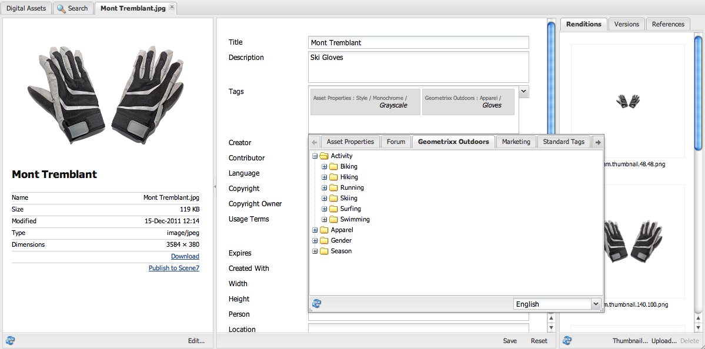

# Organize Digital Assets {#organize-digital-assets}

All digital assets, metadata and content of Microsoft Office and PDF documents are extracted and made searchable. Search allows sophisticated filtering on assets and fully respects the proper permissions. Metadata is covered in detail in Metadata in Digital Asset Management.

AEM Assets supports multiple ways of organizing content. You can organize them in a hierarchical manner using folders or you can organize them in an unordered, adhoc manner, using for example tags. Users can edit tags in the DAM Asset Editor where sub-assets, renditions, and metadata are displayed.

## Create folders {#create-folders}

When organizing a collection of assets, for example, all *Nature* images, you can create folders to keep them together. You can use folders to categorize and organize your assets. AEM Assets does not require you to organize assets in folders to work better.

>[!NOTE]
>
>Sharing an Assets folder (Marketing Cloud) of the type `sling:OrderedFolder`, is not supported. If you want to share a folder, do not select Ordered when creating a folder.

1. Navigate to the place in your digital assets folder where you want to create a new folder.
1. In the menu, click **[!UICONTROL Create]**. Select **[!UICONTROL New Folder]**.
1. In the **[!UICONTROL Title]** field, provide a folder name. By default, DAM uses the title that you provided as the folder name. Once the folder is created, you can override the default and specify another folder name.
1. Click **[!UICONTROL Create]**. Your folder is displayed in the digital assets folder.

## Add CUG properties to folders {#add-cug-properties-to-folders}

You can limit who can access certain folders in Assets by making the folder part of a closed user group (CUG). To make a folder part of a CUG:

1. In Assets, right-click the folder you want to add closed user group properties for and select **[!UICONTROL Properties]**.  

1. Click the **[!UICONTROL CUG]** tab.

   

1. Select the **[!UICONTROL Enabled]** check box to make the folder and its assets available only to a closed user group.  

1. Browse to the login page, if there is one, to add that information. Add admitted groups by clicking **[!UICONTROL Add item]**. If necessary, add the realm. Click **[!UICONTROL OK]** to save your changes.

## Use tags to organize assets {#use-tags-to-organize-assets}

You can use folders or tags or both to organize assets. Adding tags to assets makes them more easy to retrieve during a search. See [Tagging](/help/sites-authoring/tags.md) for more information on tagging.

To add tags to an asset:

1. In the Digital Asset Manager, double-click the asset to open it.
1. In the **[!UICONTROL Tags]** area, click the drop-down button to reveal the available tags. Select tags as appropriate to add a tag. To delete a tag, hover the mouse over the tag and click the **x** to delete it.
1. Click **[!UICONTROL Save]** to save any tags you added.

