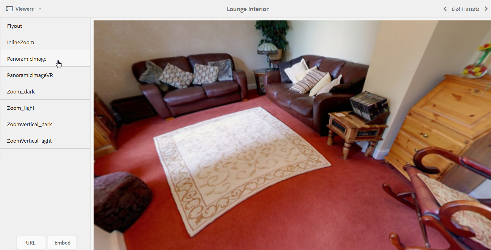

# Panoramic images{#panoramic-images}

This section describes working with the Panoramic Image viewer to render spherical panoramic images for an immersive 360-degree viewing experience of a room, property, location, or landscape.

See also [Manage Viewer Presets](/help/assets/managing-viewer-presets.md).

## Upload assets for use with the Panoramic Image viewer {#uploading-assets-for-use-with-the-panoramic-image-viewer}

For an uploaded asset to qualify as a spherical panorama image that you intend to use with the Panoramic Image viewer, the asset must have either one or both of the following:

* An aspect ratio of 2.
  You can override the default aspect ratio setting of 2 in CRXDE Lite at the following:
  `/conf/global/settings/cloudconfigs/dmscene7/jcr:content`

* Tagged with the keywords `equirectangular`, or `spherical`and `panorama`, or `spherical` and `panoramic`. See [Using Tags](/help/sites-authoring/tags.md).

Both the aspect ratio and keyword criteria apply to panoramic assets for the asset details page and the `Panoramic Media` WCM component.

To upload assets for use with the Panoramic Image viewer, see [Upload Assets](/help/assets/manage-assets.md#uploading-assets).

## Configure Dynamic Media Classic {#configuring-dynamic-media-classic-scene}

For the Panoramic Image viewer to work properly within Adobe Experience Manager, synchronize the Panoramic Image viewer presets with Dynamic Media Classic and Dynamic Media Classic-specific metadata so the viewer presets get updated in the JCR. To accomplish this synch, configure Dynamic Media Classic as follows:

1. Open the [Dynamic Media Classic desktop application](https://experienceleague.adobe.com/docs/dynamic-media-classic/using/getting-started/signing-out.html#getting-started), then sign in to your account.

1. Near the upper-right corner of the page, select **[!UICONTROL Setup]** > **[!UICONTROL Application Setup]** > **[!UICONTROL Publish Setup]** > **[!UICONTROL Image Server]**.
1. On the Image Server Publish page, from the **[!UICONTROL Publish Context]** drop-down menu near the top, select **[!UICONTROL Image Serving]**.

1. On the same Image Server Publish page, locate the heading **[!UICONTROL Request Attributes]**.
1. Under the Request Attributes heading, locate **[!UICONTROL Reply Image Size Limit]**. Then, in the associated Width and Height fields, increase the maximum allowable image size for panoramic images.

   Dynamic Media Classic has a limit of 25,000,000 pixels. The maximum allowable size for images with a 2:1 aspect ratio is 7000 x 3500. However, for typical desktop screens, 4096 x 2048 pixels is sufficient.

   >[!NOTE]
   >
   >Only images that fall within the maximum allowable image size are supported. Requests for images that are above the size limit results in a 403 response.

1. Under the Request Attributes heading, do the following:

    * Set Request Obfuscation Mode to **[!UICONTROL Disabled]**.
    * Set Request Locking Mode to **[!UICONTROL Disabled]**.

   These settings are necessary for using the `Panoramic Media` WCM component in Experience Manager.

1. At the bottom of the Image Server Publish page, on the left side, select **[!UICONTROL Save]**.

1. In the lower-right corner, select **[!UICONTROL Close]**.

### Troubleshoot the Panoramic Media WCM component {#troubleshooting-the-panoramic-media-wcm-component}

If you dropped an image into the Panoramic Media component in your WCM and the component placeholder collapsed, troubleshoot the following:

* If you experience a 403 Forbidden error, it could be caused by the requested image size being too large. Review the **[!UICONTROL Reply Image Size Limit]** settings in [Configure Dynamic Media Classic](/help/assets/panoramic-images.md#configuring-dynamic-media-classic-scene).

* For an "Invalid lock" on the asset or "Parsing error" displayed on the page, check Request Obfuscation Mode and Request Locking Mode to ensure they are disabled.
* For a tainted canvas error, set up a Rule Set Definition File Path and Invalidate CTN for the previous requests for the image asset.
* If image quality becomes low after an image request with sizing above the supported limit, check that the **[!UICONTROL JPEG Encoding Attributes > Quality]** setting is not empty. A typical setting for the **[!UICONTROL Quality]** field is `95`. You can find the setting on the Image Server Publish page. To access the page, see [Configure Dynamic Media Classic](/help/assets/panoramic-images.md#configuring-dynamic-media-classic-scene).

## Preview Panoramic Images {#previewing-panoramic-images}

See [Preview Assets](/help/assets/previewing-assets.md).

## Publish Panoramic Images {#publishing-panoramic-images}

See [Publish Assets](/help/assets/publishing-dynamicmedia-assets.md).
