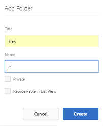
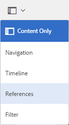

# Prepare assets for translation {#preparing-assets-for-translation}

Multilingual assets means assets with binaries, metadata, and tags in multiple languages. Generally, binaries, metadata, and tags for assets exist in one language, which are then translated to other languages for use in multilingual projects.

In [!DNL Adobe Experience Manager Assets], multilingual assets are included in folders, where each folder contains the assets in a different language.

Each language folder is called a language copy. The root folder of a language copy, known as the language root, identifies the language of the content in the language copy. For example, */content/dam/it* is the Italian language root for the Italian language copy. Language copies must use a [correctly configured language root](preparing-assets-for-translation.md#creating-a-language-root) so that the correct language is targeted when translations of source assets are performed.

The language copy for which you originally add assets is the primary language. The primary language is the source that is translated into other languages. A sample folder hierarchy includes several language roots:

```shell
/content
    /- dam
        |- en
        |- fr
        |- de
        |- es
        |- it
        |- ja
        |- zh
```

Perform the following steps to prepare your assets for translation:

1. Create the language root of your primary language. For example, the language root of the English language copy in the sample folder hierarchy is `/content/dam/en`. Ensure that the language root is correctly configured according to the information in [Create a Language Root](preparing-assets-for-translation.md#creating-a-language-root).

1. Add assets to your primary language.
1. Create the language root of each target language for which you require a language copy.

## Create a language root {#creating-a-language-root}

To create the language root, you create a folder and use an ISO language code as the value for the Name property. After you create the language root, you can create a language copy at any level within the language root.

For example, the root page of the Italian language copy of the sample hierarchy has `it` as the Name property. The Name property is used as the name of the asset node in the repository, and therefore determines the path of the assets. (`https://[aem_server]:[port]/assets.html/content/dam/it/`).

1. From the [!DNL Assets] console, click **[!UICONTROL Create]** and choose **[!UICONTROL Folder]** from the menu.

   

1. In the **[!UICONTROL Name]** field type the country code in the format of `<language-code>`.

   

1. Click **[!UICONTROL Create]**. The language root is created in the [!DNL Assets] console.

## View language roots {#viewing-language-roots}

[!DNL Experience Manager] interface provides a **[!UICONTROL References]** panel that displays a list of language roots that have been created within [!DNL Assets].

1. In the [!DNL Assets] console, select the primary language for which you want to create language copies.
1. From the left rail, select **[!UICONTROL References]** option to open the [!UICONTROL Reference] pane.

   

1. In the References pane, click **[!UICONTROL Language Copies]**. The [!UICONTROL Language Copies] panel shows the language copies of the assets.

   
