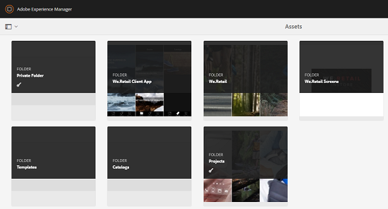
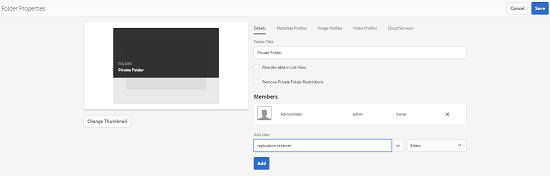
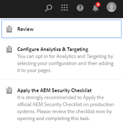
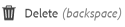

# Private folder in [!DNL Adobe Experience Manager Assets] {#private-folder}

| Version | Article link |
| -------- | ---------------------------- |
| AEM as a Cloud Service  |    [Click here](https://experienceleague.adobe.com/docs/experience-manager-cloud-service/content/assets/manage/private-folder.html?lang=en)                  |
| AEM 6.5     | This article         |

You can create a private folder in the [!DNL Adobe Experience Manager Assets] user interface that is available exclusively to you. You can share this private folder to other users and assign various privileges to them. Based on the privilege level you assign, users can perform various tasks on the folder, for example view assets within the folder or edit the assets.

>[!NOTE]
>
>Private folder has at least one member with Owner role.

## Private folder creation and sharing {#create-share-private-folder}

To create and share private folder:

1. In the [!DNL Assets] console, click **[!UICONTROL Create]** from the toolbar and then choose **[!UICONTROL Folder]** from the menu.

   

1. In the **[!UICONTROL Create Folder]** dialog, enter a title and name (optional) for the folder, and select **[!UICONTROL Private]** option.

1. Click **[!UICONTROL Create]**. A private folder is created.

   

1. To share the folder with other users and the assign privileges to them, select the folder, and click **[!UICONTROL Properties]** from the toolbar.

   

   >[!NOTE]
   >
   >The folder is not visible to any other user until you share it.

1. In the **[!UICONTROL Folder Properties]** page, select a user from the **[!UICONTROL Add User]** list, assign a role to the user on your private folder, and click **[!UICONTROL Add]**.

   

   >[!NOTE]
   >
   >You can assign various roles, such as `Editor`, `Owner`, or `Viewer` to the user with whom you share the folder. If you assign an `Owner` role to the user, the user has `Editor` privileges on the folder. In addition, the user can share the folder with others. If you assign an `Editor` role, the user can edit the assets in your private folder. If you assign a viewer role, the user can only view the assets in your private folder.

   >[!NOTE]
   >
   >Private folder has at least one member with `Owner` role. Therefore, administrator cannot remove all the owner members from a private folder. However, to remove the existing owners (and administrator itself) from the private folder the administrator must add another user as owner.

1. Click **[!UICONTROL Save]**. Depending on the role you assign, the user is assigned a set of privileges on your private folder when the user logs in to [!DNL Assets].
1. Click **[!UICONTROL Ok]** to close the confirmation message.
1. The user with whom you share the folder receives a sharing notification. Log in to [!DNL Assets] with the credentials of the user to view the notification.

   

1. Click [!UICONTROL Notifications] to open a list of notifications.

   

1. Click the entry for the private folder shared by the administrator to open the folder.

>[!NOTE]
>
>To create a private folder, you require Read and Modify [access control permissions](/help/sites-administering/security.md#permissions-in-aem) on the parent folder under which you want to create a private folder. If you are not an administrator, these permissions are not enabled for you by default on `/content/dam`. In this case, first obtain these permissions for your user ID/group before attempting to create private folders.

## Private folder deletion {#delete-private-folder}

You can delete a folder by selecting the folder and selecting [!UICONTROL Delete] option from the top menu, or by using Backspace key on your keyboard.

>[!CAUTION]
>
>If you delete a private folder from CRXDE Lite, then redundant user groups are left in the repository.

>[!NOTE]
>
>If you delete a folder using the above method from the user interface, then the associated user groups are also deleted.
>
>However, the existing redundant, unused, and auto-generated user groups can be removed from the repository using `clean` method in JMX in the author instance (`http://[server]:[port]/system/console/jmx/com.day.cq.dam.core.impl.team%3Atype%3DClean+redundant+groups+for+Assets`).
