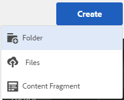
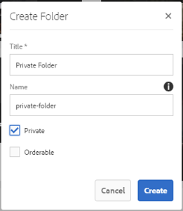
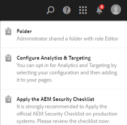

# Private folder sharing {#private-folder-sharing}

You can create a private folder in the Adobe Experience Manager (AEM) Assets user interface that is available exclusively to you. You can share this private folder to other users and the assign various privileges to them. Based on the privilege level you assign, users can perform various tasks on the folder, for example view assets within the folder or edit the assets.

1. In the Assets console, tap/click **[!UICONTROL Create]** from the toolbar and then choose **[!UICONTROL Folder]** from the menu.

   

1. In the **[!UICONTROL Add Folder]** dialog, enter a title and name (optional) for the folder, and select **[!UICONTROL Private]**.

   

1. Tap/click **[!UICONTROL Create]**. A private folder is created in the UI.

   

1. To share the folder with other users and the assign privileges to them, select the folder, and click/tap the **[!UICONTROL Properties]** icon from the toolbar.

   

   >[!NOTE]
   >
   >The folder is not visible to any other user until you share it.

1. In the Folder Prperties page, select a user from the **[!UICONTROL Add User]** list, assign a role to the user on your private folder, and click **[!UICONTROL Add]**.

   

   >[!NOTE]
   >
   >You can assign various roles, such as Editor, Owner, or Viewer to the user with whom you share the folder. If you assign an Owner role to the user, the user has Editors privileges on the folder. In addition, the user can share the folder with others. If you assign an Editor role, the user can edit the assets in your private folder. If you assign a Viewer role, the user can only view the assets in your private folder.

1. Click **[!UICONTROL Save]**. Depending on the role you assign, the user is assigned a set of privileges on your private folder when the user logs in to AEM Assets.
1. Click **[!UICONTROL Ok]** to close the confirmation message.
1. The user with whom you share the folder receives a sharing notification. Log in to AEM Assets with the credentials of the user to view the notification.

   

1. Tap/click the Notification icon to open the list of notifications.

   

1. Click/tap the entry for the private folder shared by the administrator to open the folder.

>[!NOTE]
>
>To be able to create a private folder, you require Read and Edit ACL permissions on the parent folder under which you want to create a private folder. If you are not an administrator, these permissions are not enabled for you by default on */content/dam*. In this case, first obtain these permissions for your user ID/group before attempting to create private folders or view folder settings.

