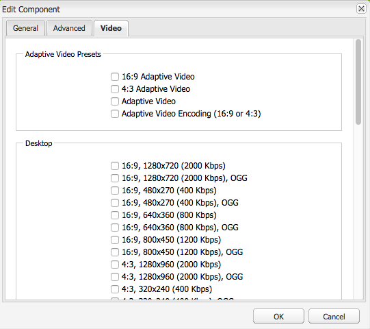
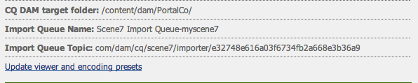
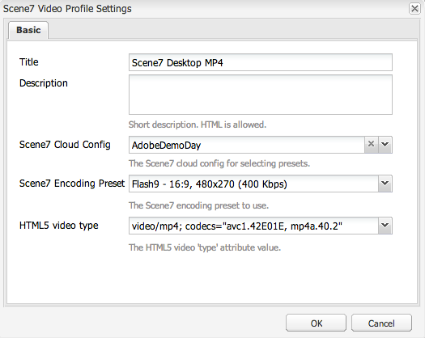

# Video {#video}

Adobe Experience Manager Assets provides for centralized video asset management where you can upload videos directly to Assets for auto-encoding to Dynamic Media Classic and access Dynamic Media Classic videos directly from Assets for page authoring.

Dynamic Media Classic video integration extends the reach of optimized video to all screens (auto device and bandwidth detection).

* The **[!UICONTROL Scene7 Video]** component automatically performs device and bandwidth detection to play the right format and right quality video across desktop, tablets and mobile.
* Assets - You can include adaptive video sets rather than only single video assets. An adaptive video set contains all the video renditions that are required to play back video seamlessly across multiple screens. An Adaptive Video Set groups versions of the same video that are encoded at different bit rates and formats such as 400 kbps, 800 kbps, and 1000 kbps. You use an Adaptive Video Set, along with S7 video component, for adaptive video streaming across multiple screens including desktop, iOS, Android&trade;, BlackBerry&reg;, and Windows mobile devices.
<!-- See [Scene7 documentation about adaptive video sets for more information](https://help.adobe.com/en_US/scene7/using/WS53492AE1-6029-45d8-BF80-F4B5CF33EB08.html). -->

## About FFMPEG and Dynamic Media Classic {#about-ffmpeg-and-scene}

The default video encoding process is based on using the FFMPEG-based integration with video profiles. Therefore, the out-of-the-box DAM ingestion workflow contains the following two ffmpeg-based workflow steps:

* FFMPEG thumbnails
* FFMPEG encoding

Enabling and configuring the Dynamic Media Classic integration does not automatically remove or deactivate these two workflow steps from the out-of-the-box DAM ingestion workflow. If you already use the FFMPEG-based video encoding in Adobe Experience Manager, it is likely that you have FFMPEG installed on your authoring environments. In this case, a new video ingested using DAM would be encoded twice: once from the FFMPEG encoder and once from Dynamic Media Classic integration.

If you have the FFMPEG-based video encoding in Experience Manager configured and FFMPEG installed, Adobe recommends that you remove the two FFMPEG workflows from your DAM ingestion workflows.

## Supported Formats {#supported-formats}

The following formats are supported for the Scene7 Video component:

* F4V H.264
* MP4 H.264

## Decide where to upload your video {#deciding-where-to-upload-your-video}

Deciding where to upload your video assets depends on the following:

* Do you need a workflow for the video asset?
* Do you need version control for the video asset?

If the answer is "yes" to either or both of these questions, then upload your video directly to Adobe DAM. If the answer is "no" to both questions, then upload your video directly to Dynamic Media Classic. The workflow for each scenario is described in the following section.

### If you are uploading your video directly to Adobe DAM {#if-you-are-uploading-your-video-directly-to-adobe-dam}

If you need a workflow or versioning for your assets, upload to Adobe DAM first. The following is the recommended workflow:

1. Upload the video asset to Adobe DAM and automatically encode and publish to Dynamic Media Classic.
1. In Experience Manager, access video assets in WCM in the **[!UICONTROL Movies]** tab of the Content Finder.
1. Author with **[!UICONTROL Scene7 Video]** or **[!UICONTROL Foundation Video]** component.

### If you are uploading your video to Dynamic Media Classic {#if-you-are-uploading-your-video-to-scene}

If you do not need a workflow or versioning for your assets, upload your assets to Scene7. The following is the recommended workflow:

1. In Dynamic Media Classic, [set up a scheduled FTP uploading and encoding to Scene7 (system automated)](https://experienceleague.adobe.com/docs/dynamic-media-classic/using/upload-publish/uploading-files.html#upload-files-using-via-ftp).
1. In Experience Manager, access video assets in WCM in the **[!UICONTROL Scene7]** tab of the Content Finder.
1. Author with the **[!UICONTROL Scene7 Video]** component.

## Configure integration with Scene7 Video {#configuring-integration-with-scene-video}

1. In **[!UICONTROL Cloud Services]**, navigate to your **[!UICONTROL Scene7]** configuration and select **[!UICONTROL Edit]**.
1. Select the **[!UICONTROL Video]** tab.

   

   >[!NOTE]
   >
   >The **[!UICONTROL Video]** tab does not appear if the page does not have a cloud configuration.

1. Select the adaptive video encoding profile, an out-of-the-box single video encoding profile, or a custom video encoding profile.

   >[!NOTE]
   >
   >For more information about what the video presets mean, see the [Dynamic Media Classic documentation](https://experienceleague.adobe.com/docs/dynamic-media-classic/using/setup/application-setup.html#video-presets-for-encoding-video-files).
   >
   >Adobe recommends that you select either both adaptive video sets when configuring the universal presets or select the **[!UICONTROL Adaptive Video Encoding]** option.

1. The selected encoding profiles are automatically applied to all videos uploaded to the CQ DAM target folder you set up for this Scene7 cloud configuration. You can set up multiple Scene7 cloud configurations with different target folders to apply different encoding profiles as needed.

## Update viewer and encoding presets {#updating-viewer-and-encoding-presets}

To update the viewer and encoding presets for video because the presets were updated in Scene7, navigate to the Scene7 configuration in the Cloud Configuration and select **[!UICONTROL Update the viewer and encoding presets]**.

## Upload your primary source video to Scene7 from Adobe DAM {#uploading-your-master-video}

1. Navigate to the CQ DAM target folder where you have set up your cloud configuration with Scene7 encoding profiles.
1. Select **[!UICONTROL Upload]** to upload primary source video. Video uploading and encoding is complete after the [!UICONTROL DAM Update Asset] workflow is complete and **[!UICONTROL Publish to Scene7]** has a checkmark.

   >[!NOTE]
   >
   >It takes time for the video thumbnails to be generated.

   Dragging the DAM primary source video onto the video component accesses *all* Scene7 encoded proxy renditions for delivery.

## Foundation Video Component versus Scene7 Video Component {#foundation-video-component-versus-scene-video-component}

When using Experience Manager, you have access to both the Video component available in Sites and the Scene7 video component. These components are not interchangeable.

The Scene7 video component only works for Scene7 videos. The foundation component works with videos stored from Experience Manager (using ffmpeg) and Scene7 videos.

The following matrix explains when to use which component:

>[!NOTE]
>
>Out of the box, the S7 video component uses the universal video profile. You can, however, obtain the HTML5-based video player for use by Experience Manager. In Scene7, copy the embed code of the out-of-box HTML5 video player and put it in your Experience Manager page.

## Experience Manager Video Component {#aem-video-component}

Even if using the Scene7 video component is recommended for viewing Scene7 videos, this section describes using Scene7 videos with the Foundation Video Component in Experience Manager, for the sake of completeness.

### Experience Manager Video and Scene7 Video comparison {#aem-video-and-scene-video-comparison}

The following table provides a high-level comparison of supported capabilities between the Experience Manager Foundation Video component and the Scene7 Video component:

|   |Experience Manager Foundation Video |Scene7 Video |
|---|---|---|
| Approach |HTML5 first approach. Flash is only used for non-HTML5 fallback. |Flash on most desktops. HTML5 is used for mobile and tablets. |
| Delivery |Progressive |Adaptive Streaming |
| Tracking |Yes |Yes |
| Extensibility |Yes |No |
| Mobile Video |Yes |Yes |

### Set up {#setting-up}

#### Create Video Profiles {#creating-video-profiles}

The various video encodings are created according to the S7 encoding presets selected in the S7 cloud config. For the foundation video component to use them, a video profile must be created for each S7 encoding preset selected. This method allows the video component to select the DAM renditions accordingly.

>[!NOTE]
>
>New video profiles and changes to them must be activated to publish.

1. In Experience Manager, select **[!UICONTROL Tools]** > **[!UICONTROL Configuration Console]**.
1. In the **[!UICONTROL Configuration Console]**, navigate to **[!UICONTROL Tools]** > **[!UICONTROL DAM]** > **[!UICONTROL Video Profiles]** in the navigation tree.
1. Create a S7 Video Profile. In the **[!UICONTROL New]**. menu, select **[!UICONTROL Create Page]** and then select the Scene7 Video Profile template. Give the new video profile page a name and select **[!UICONTROL Create]**.

   

1. Edit the new video profile. Select the cloud config first. Then select the same encoding preset as selected in the cloud config.

   

   | Property |Description |
   |---|---|
   | Scene7 Cloud Config |The cloud config to use for the encoding presets. |
   | Scene7 Encoding Preset |The encoding preset to map this video profile with. |
   | HTML5 video type |This property lets you set the value of the type property of the HTML5 video source element. This information is not provided by the S7 encoding presets, but required for properly rendering the videos using HTML5 video element. A list for common formats is provided, but can be overwritten for other formats.  |

   Repeat this step for all encoding presets selected in the cloud config that you want to use in the video component.

#### Configure design {#configuring-design}

The **[!UICONTROL Foundation Video]** component must know about what video profiles to use to build the video sources list. Open the video components design dialog box and configure the components design for using the new video profiles.

>[!NOTE]
>
>If you use the **[!UICONTROL Foundation Video]** component on a mobile page, repeat these steps on the design of the mobile page.

>[!NOTE]
>
>Changes made to the design require activation of the design to take effect on publish.

1. Open the **[!UICONTROL Foundation Video]** component's design dialog box and change to the **[!UICONTROL Profiles]** tab. Then delete the out-of-the-box profiles and add the new S7 video profiles. The order of the profile list in the design dialog box defines the order of the video sources element when rendering.
1. For browsers not supporting HTML5, the video component lets you configure a Flash fallback. Open the video components design dialog box and change to the **[!UICONTROL Flash]** tab. Configure the Flash player settings and assign a fallback profile for the flash player.

#### Checklist {#checklist}

1. Create a S7 cloud config. Make sure that the video encoding presets are set and the importer is running.
1. Create a S7 video profile for each video encoding preset selected in the cloud config.
1. The video profiles must be activated.
1. Configure the design of the **[!UICONTROL Foundation Video]** component on your page.
1. Activate the design after you are done with your design changes.
