# Add Dynamic Media Classic features to pages {#adding-scene-features-to-your-page}

[Adobe Dynamic Media Classic](https://experienceleague.adobe.com/docs/dynamic-media-classic/using/home.html) is a hosted solution for managing, enhancing, publishing, and delivering rich media assets to Web, mobile, email, and Internet-connected displays and print.

You can view Experience Manager assets published in Dynamic Media Classic in various viewers:

* Zoom
* Flyout
* Video
* Image Template
* Image

You can publish digital assets directly from Experience Manager to Dynamic Media Classic and you can publish digital assets from Dynamic Media Classic to Experience Manager.

This document describes how to publish digital assets from Experience Manager to Dynamic Media Classic and conversely. Viewers are also described in detail. For information on configuring Experience Manager for Dynamic Media Classic, see [Integrate Dynamic Media Classic with Experience Manager](/help/sites-administering/scene7.md).

See also [Add Image Maps](image-maps.md).

For more information on using video components with Experience Manager, see [Video](video.md).

>[!NOTE]
>
>If Dynamic Media Classic assets do not display properly, make sure that Dynamic Media is [disabled](config-dynamic.md#disabling-dynamic-media) and then refresh the page.

## Manually publishing to Dynamic Media Classic from assets {#manually-publishing-to-scene-from-assets}

You can publish digital assets to Dynamic Media Classic as follows:

* [In the classic user interface from the Assets console](/help/sites-classic-ui-authoring/manage-assets-classic-s7.md#publishing-from-the-assets-console)
* [In the classic user interface from an asset](/help/sites-classic-ui-authoring/manage-assets-classic-s7.md#publishing-from-an-asset)
* [In the classic user interface from outsidetheCQ Target folder](/help/sites-classic-ui-authoring/manage-assets-classic-s7.md#publishing-assets-from-outside-the-cq-target-folder)

>[!NOTE]
>
>Experience Manager publishes to Dynamic Media Classic asynchronously. After you select **[!UICONTROL Publish]**, it takes several seconds for your asset to publish to Dynamic Media Classic.
>

## Dynamic Media Classic components {#scene-components}

The following Dynamic Media Classic components are available in Experience Manager:

* Zoom
* Flyout (Zoom)
* Image Template
* Image
* Video

>[!NOTE]
>
>These components are not available by default and must be selected in **[!UICONTROL Design]** mode before using.

After they are made available in **[!UICONTROL Design]** mode, you can add the components to your page like any other Experience Manager component. Assets that have not yet been published to Dynamic Media Classic are published to Dynamic Media Classic if in a synchronized folder or on a page or with a Dynamic Media Classic cloud configuration.

>[!NOTE]
>
>If you are creating and developing custom viewers and using the Content Finder, you must explicitly add the `allowfullscreen` parameter.

### Flash Viewers End-of-Life Notice {#flash-viewers-end-of-life-notice}

Effective January 31, 2017, Adobe Dynamic Media Classic ended support for the Flash viewer platform.

### Add a Dynamic Media Classic (Scene7) component to a page {#adding-a-scene-component-to-a-page}

Adding a Dynamic Media Classic (Scene7) component to a page is the same as adding a component to any page. Dynamic Media Classic components are described in detail in the following sections.

**To add a Dynamic Media Classic (Scene7) component to a page:**

1. In Experience Manager, open the page where you want to add the **[!UICONTROL Dynamic Media Classic (Scene7)]** component.

1. If no Dynamic Media Classic components are available, select **[!UICONTROL Design]** mode, select any component with a blue border, select the **[!UICONTROL Parent]** icon, and then the **[!UICONTROL Configuration]** icon. In **[!UICONTROL Parsys (Design)]**, select all the Dynamic Media Classic components to make them available and select **[!UICONTROL OK]**.

   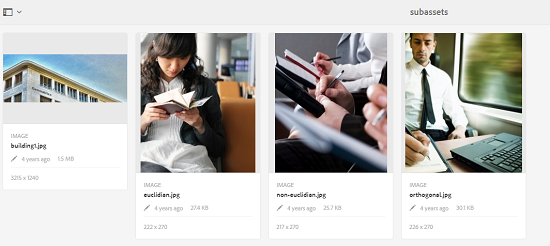

1. Select **[!UICONTROL Edit]** so you can return to **[!UICONTROL Edit]** mode.

1. Drag a component from the Dynamic Media Classic group in the sidekick onto the page in the desired location.

1. Select the **[!UICONTROL Configuration]** icon so you can open the component.

1. Edit the component as necessary and select **[!UICONTROL OK]** to save changes.
1. Drag your image or video from the content browser onto the Dynamic Media Classic component you added to the page.

   >[!NOTE]
   >
   >In touch UI only, you must drag and drop the image or video onto the Dynamic Media Classic component you placed on the page. Selecting and editing the Dynamic Media Classic component and then choosing the asset is not supported.

### Add an interactive viewing experience to a responsive site {#adding-interactive-viewing-experiences-to-a-responsive-website}

Responsive design for your assets means that your asset adapts depending on where it is displayed. With responsive design, the same assets can be effectively displayed on multiple devices.

See also [Responsive design for web pages](/help/sites-developing/responsive.md).

**To add an interactive viewing experience to a responsive site:**

1. Log in to Experience Manager, and ensure that you have [configured Adobe Dynamic Media Classic Cloud Services](/help/sites-administering/scene7.md#configuring-scene-integration) and that Dynamic Media Classic components are available.

   >[!NOTE]
   >
   >If Dynamic Media Classic components are not available, be sure [to enable them by way of Design mode](/help/sites-authoring/default-components-designmode.md).

1. In a website with the **[!UICONTROL Dynamic Media Classic]** components enabled, drag an **[!UICONTROL Image]** component to the page.
1. Select the component and select the configuration icon.
1. In the **[!UICONTROL Dynamic Media Classic Settings]** tab, adjust the breakpoints.

   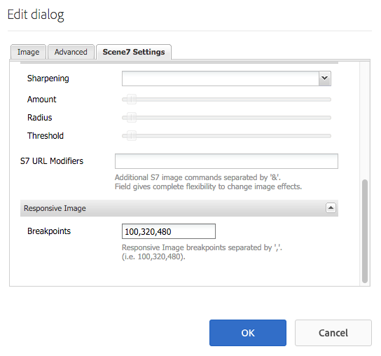

1. Confirm that the viewers are responsively resizing and that all interactions are optimized for desktop, tablet, and mobile.

### Settings common to all Dynamic Media Classic components {#settings-common-to-all-scene-components}

Although configuration options vary, the following are common to all [!UICONTROL Dynamic Media Classic] components:

* **[!UICONTROL File Reference]** - Browse to a file that you want to reference. File reference shows the asset URL and not necessarily the full Dynamic Media Classic URL including the URL commands and parameters. You cannot add Dynamic Media Classic URL commands and parameters in this field. Instead, you add them through the corresponding functionality in the component.
* **[!UICONTROL Width]** - Lets you set the width.
* **[!UICONTROL Height]** - Lets you set the height.

You set these configuration options by opening (double-clicking) a Dynamic Media Classic component, for example, when you open a **[!UICONTROL Zoom]** component:

### Zoom {#zoom}

The HTML5 Zoom component displays a larger image when you press the **[!UICONTROL +]** button.

The asset has zoom tools at the bottom. Select **[!UICONTROL +]** if you want to enlarge; select **[!UICONTROL -]** if you want to reduce. Tapping the **[!UICONTROL x]** or the reset zoom arrow brings the image back to the original size it was imported as. Select the diagonal arrows so you make it full screen. Select **[!UICONTROL Edit]** so you can configure the component. With this component, you can configure [settings common to all [!UICONTROL Dynamic Media Classic] components](#settings-common-to-all-scene-components).

### Flyout {#flyout}

In the HTML5 **[!UICONTROL Flyout]** component, the asset is shown as split screen; left the asset in the specified size; right the zoom portion is displayed. Select **[!UICONTROL Edit]** so you can configure the component. With this component, you can configure [settings common to all Dynamic Media Classic components](#settings-common-to-all-scene-components).

>[!NOTE]
>
>If your **[!UICONTROL Flyout]** component uses a custom size, then that custom size is used and responsive setup of the component is disabled.
>
>If your **[!UICONTROL Flyout]** component uses the default size, as set in **[!UICONTROL Design View]**, then the default size is used and the component stretches to accommodate the page layout size with responsive setup of the component enabled. There is a limitation on responsive setup of the component. When you use the **[!UICONTROL Flyout]** component with responsive setup, do not use it with full page stretch. Otherwise, the **[!UICONTROL Flyout]** extends beyond the page's right border.

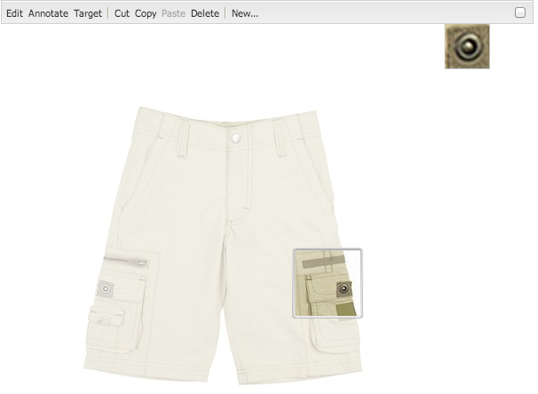

### Image {#image}

The Dynamic Media Classic **[!UICONTROL Image]** component lets you add Dynamic Media Classic functionality to your images, such as Dynamic Media Classic modifiers, image or viewer presets, and sharpening. The Dynamic Media Classic **[!UICONTROL Image]** component is similar to other image components in Experience Manager with special Dynamic Media Classic functionality. In this example, the image has the Dynamic Media Classic URL modifier, `&op_invert=1` applied.

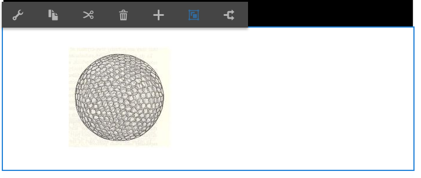

**[!UICONTROL Title, Alt Text]** - In the **[!UICONTROL Advanced]** tab, add a title to the image and alt text for those users who have graphics turned off.

**[!UICONTROL URL, Open in]** - You can set an asset from to open a link. Set the **[!UICONTROL URL]** and in **[!UICONTROL Open in]** indicate whether you want it to open in the same window or a new window.

**[!UICONTROL Viewer preset]** - Select an existing viewer preset from the drop-down menu. If the viewer preset you are looking for is not visible, you must make it visible. See [Manage Viewer Presets](/help/assets/managing-viewer-presets.md). You cannot select a viewer preset if you are using an image preset and conversely.

**[!UICONTROL Dynamic Media Classic Configuration]** - Select the Dynamic Media Classic configuration you want to use to fetch active image presets from SPS.

**[!UICONTROL Image preset]** - Select an existing image preset from the drop-down menu. If the image preset you are looking for is not visible, you must make it visible. See [Manage Image Presets](/help/assets/managing-image-presets.md). You cannot select a viewer preset if you are using an image preset and conversely.

**[!UICONTROL Output Format]** - Select the output format of the image, for example, jpeg. Depending on the output format you select, there are additional configuration options. See [Image Preset best practices](/help/assets/managing-image-presets.md#image-preset-options).

**[!UICONTROL Sharpening]** - Select how you want to sharpen the image. Sharpening is explained in detail in [Image Preset best practices](/help/assets/managing-image-presets.md#image-preset-options) and [Sharpening best practices](/help/assets/assets/sharpening_images.pdf).

**[!UICONTROL URL Modifiers]** - You can change image effects by supplying additional Dynamic Media Classic image commands. These commands are described in [Image Presets](/help/assets/managing-image-presets.md) and the [Command reference](https://experienceleague.adobe.com/docs/dynamic-media-developer-resources/image-serving-api/image-serving-api/http-protocol-reference/command-reference/c-command-reference.html).

**[!UICONTROL Breakpoints]** - If your website is responsive, you want to adjust the breakpoints. Breakpoints must be separated by commas ( , ).

### Image Template {#image-template}

[Dynamic Media Classic Image Templates](https://experienceleague.adobe.com/docs/dynamic-media-classic/using/template-basics/quick-start-template-basics.html) are layered Photoshop content that was imported to Dynamic Media Classic, where content and properties were parameterized for variability. The **[!UICONTROL Image template]** component lets you import images and change the text dynamically in Experience Manager. In addition, you can configure the **[!UICONTROL Image template]** component to use values from client context, so that each user experiences the image in a personalized way.

Select **[!UICONTROL Edit]** if you want to configure the component. You can configure [settings common to all Dynamic Media Classic components](#settings-common-to-all-scene-components) and other settings described in this section.

**[!UICONTROL File Reference, Width, Height]** - See settings common to all ScDynamic Media Classicene7 components.

>[!NOTE]
>
>Dynamic Media Classic URL commands and parameters cannot be added to the File Reference URL directly. They can only be defined in the component UI in the **[!UICONTROL Parameter]** panel.

**[!UICONTROL Title, Alt Text]** - In the Dynamic Media Classic Image Template tab, add a title to the image and alt text for those users who have graphics turned off.

**[!UICONTROL URL, Open in]** - You can set an asset from to open a link. Set the URL and in Open in indicate whether you want it to open in the same window or a new window.

**[!UICONTROL Parameter Panel]** - When importing an image, the parameters are pre-populated with information from the image. If there is no content that can be dynamically changed, this window is empty.

#### Change text dynamically {#changing-text-dynamically}

To change the text dynamically, enter new text in the fields and select **[!UICONTROL OK]**. In this example, the **[!UICONTROL Price]** is now $50 and shipping is 99 cents.

The text in the image changes. You can reset the text back to the original value by tapping **[!UICONTROL Reset]** next to the field.

#### Change text to reflect the value of a client context value {#changing-text-to-reflect-the-value-of-a-client-context-value}

To link a field to a client context value, select **[!UICONTROL Select]** to open the client-context menu, select the client context, and select **[!UICONTROL OK]**. In this example, the name changes based on linking the Name with the formatted name in the profile.

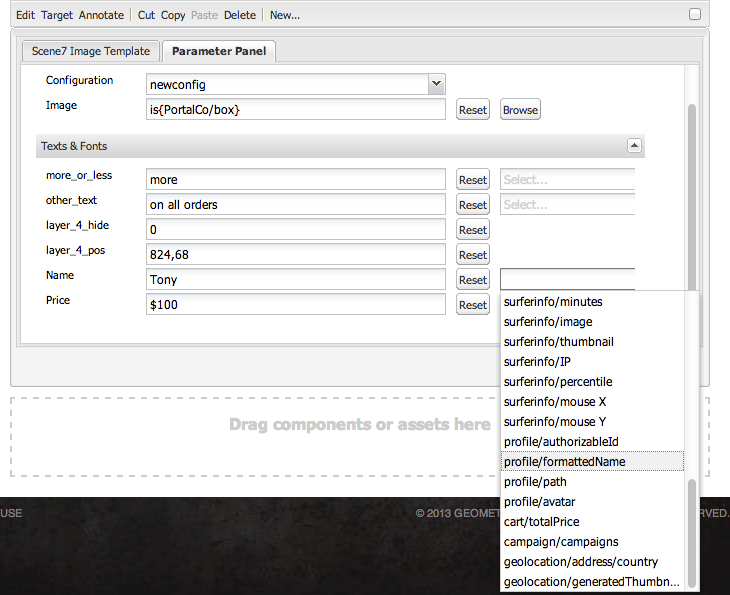

The text reflects the name of the currently logged in user. You can reset the text back to the original value by clicking **[!UICONTROL Reset]** next to the field.

#### Make the Dynamic Media Classic Image Template a link {#making-the-scene-image-template-a-link}

1. On the page with the Dynamic Media Classic **[!UICONTROL Image Template]** component, select **[!UICONTROL Edit]**.
1. In the **[!UICONTROL URL]** field, enter the URL that users go to when the image is tapped. In the **[!UICONTROL Open in]** field, select whether you want the target to open (a new window or same window).

   

1. Select **[!UICONTROL OK]**.

### Video component {#video-component}

The Dynamic Media Classic **[!UICONTROL Video]** component (available from the Dynamic Media Classic section of the sidekick) uses device and bandwidth detection to serve the right video to each screen. This component is an HTML5 video player; it is a single viewer that can be used cross channel.

It can be used for adaptive video sets, a single MP4 video, or a single F4V video.

See [Video](s7-video.md) for more information on how videos work with Dynamic Media Classic integration. In addition, see [the Dynamic Media Classic Video component versus the Foundation Video component](s7-video.md).

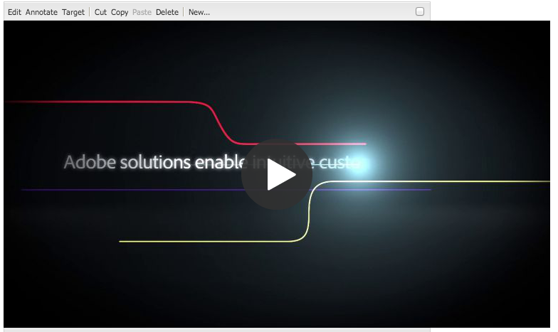

### Known limitations of the video component {#known-limitations-for-the-video-component}

Adobe DAM and WCM shows if a primary source video is uploaded. They do not show these proxy assets:

* Dynamic Media Classic encoded renditions
* Dynamic Media Classic adaptive video sets

When using an adaptive video set with the Dynamic Media Classic video component, you must resize the component to fit the dimensions of the video.

## Dynamic Media Classic content browser {#scene-content-browser}

The Dynamic Media Classic content browser lets you view content from Dynamic Media Classic directly in Experience Manager. To access the content browser, in the **[!UICONTROL Content Finder]**, select **[!UICONTROL Dynamic Media Classic]** in the touch-optimized user interface or the **[!UICONTROL S7]** icon in the classic user interface. Functionality is identical between both user interfaces.

If you have multiple configurations, Experience Manager by default displays the [default configuration](/help/sites-administering/scene7.md#configuring-a-default-configuration). You can select different configurations directly in the Dynamic Media Classic content browser in the drop-down menu.

>[!NOTE]
>
>* Assets in the on-demand folder do not appear in the Dynamic Media Classic content browser.
>* When [Secure Preview is enabled](/help/sites-administering/scene7.md#configuring-the-state-published-unpublished-of-assets-pushed-to-scene), both published and unpublished assets on Dynamic Media Classic do appear in the Dynamic Media Classic content browser.
>* If you do not see **[!UICONTROL Dynamic Media Classic]** or the **[!UICONTROL S7]** icon as an option in the content browser, you must [configure Dynamic Media Classic to work with Experience Manager](/help/sites-administering/scene7.md).
>* For video, the Dynamic Media Classic content browser supports:
>
>   * Adaptive Video Sets: container of all video renditions needed for seamless playback across multiple screens
>   * Single MP4 video
>   * Single F4V video

### Browse content in the touch-optimized UI {#browsing-content-in-the-touch-optimized-ui}

You can access the content browser either in the touch-optimized or classic UI. Currently the touch-optimized has the following limitation:

* FXG and Flash assets from Dynamic Media Classic are not supported.

Browse Dynamic Media Classic assets by selecting **[!UICONTROL Dynamic Media Classic]** from the third drop-down menu. Dynamic Media Classic does not appear in the list if you have not configured Dynamic Media Classic/Experience Manager integration.

>[!NOTE]
>
>* The Dynamic Media Classic content browser loads about 100 assets and sorts them by name.
>* If you have a secure preview server set, the browser uses that preview server to render thumbnails and assets.
>

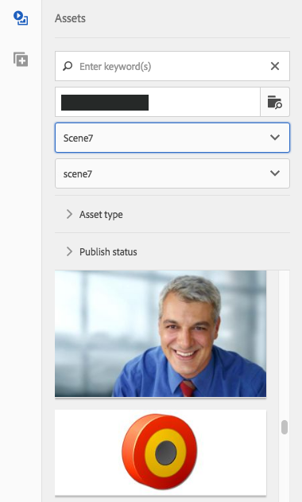

In addition, you can browse resolution information, size, days since modification, and file name by hovering over the asset in the browser.

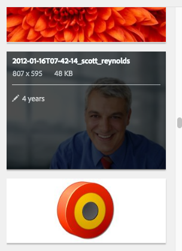

* For Adaptive Video Sets and Templates, no size information is generated for thumbnails.
* For Adaptive Video Sets, no resolution is generated for thumbnails.

### Search for Dynamic Media Classic assets with the content browser {#searching-for-scene-assets-with-the-content-browser}

Searching for assets in Dynamic Media Classic is similar to searching for assets in Experience Manager Assets. However, when you search you are actually seeing a remote view of the assets in the Dynamic Media Classic system, rather than importing them directly into Experience Manager.

You can use either the classic UI or the touch-optimized UI to both view and search for assets. Depending on the interface, how you search is slightly different.

When searching in either UI, you can filter by the following criteria (shown here in the touch-optimized UI):

**[!UICONTROL Enter keywords]** - You can search assets by name. When searching, the keywords you enter is what the file name starts with. For example, typing the word "swimming" would look for any asset file names that start with those letters in that order. Be sure to press enter after you type the term to find the asset.

**[!UICONTROL Folder/path]** - The name of the folder that is seen is based on the configuration you have selected. You can drill down to lower levels by tapping the folder icon and selecting a subfolder, then tapping the checkmark to select it.

If you enter a keyword and select a folder, Experience Manager searches that folder and any subfolders. However, if you do not enter any keywords when searching, selecting the folder only shows the assets in that folder and does not include any subfolders.

By default, Experience Manager searches the folder selected and all subfolders.

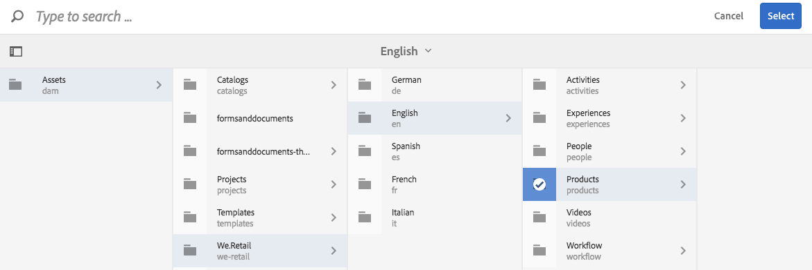

**[!UICONTROL Type of Asset]** - Select **[!UICONTROL Dynamic Media Classic]** to browse Dynamic Media Classic content. This option is only available if Dynamic Media Classic has been configured.

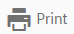

**[!UICONTROL Configuration]** - If you have more than one Dynamic Media Classic configuration defined in [!UICONTROL Cloud Services], you can select it here. As a result, the folder changes based on the configuration you have chosen.

**[!UICONTROL Asset type]** - Within the Dynamic Media Classic browser, you can filter results to include any of the following: images, templates, videos, and adaptive video sets. If you do not select any asset type, Experience Manager, by default, searches all asset types.

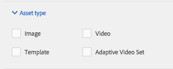

>[!NOTE]
>
>* In the classic UI, you can also search for **Flash** and **FXG**. Filtering for these types in the touch-optimized UI is not supported.
>
>* When searching video, you are searching a single rendition. Results return the original rendition (only &ast;.mp4) and the encoded rendition.
>* When searching an adaptive video set, you are searchingthefolder and all subfolders but only if you have added a keyword to the search. If you have not added a keyword, Experience Manager does not search the subfolders.
>

**[!UICONTROL Publish Status]** - You can filter for assets based on publication status: **[!UICONTROL Unpublished]** or **[!UICONTROL Published]**. If you do not select any **[!UICONTROL Publish Status]**, Experience Manager by default searches all publish statuses.

