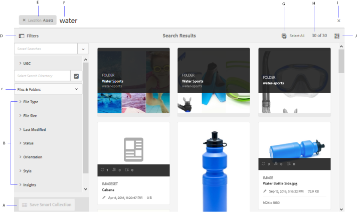
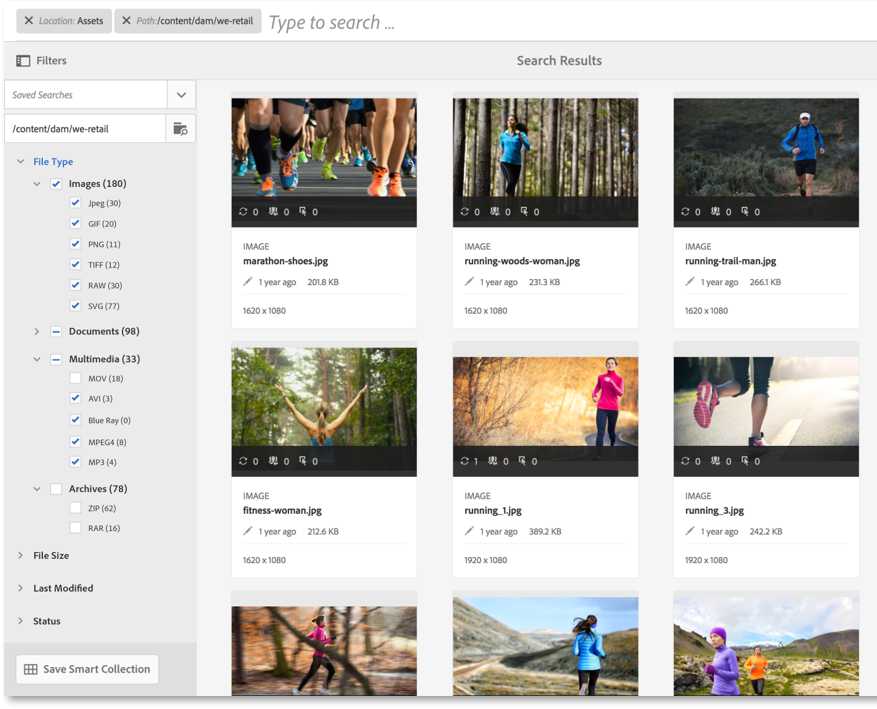
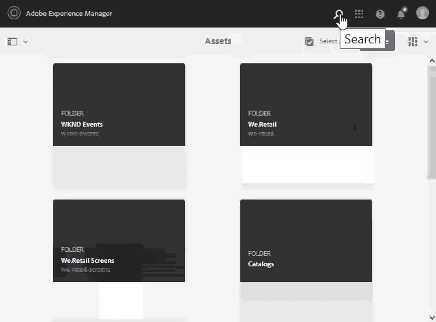
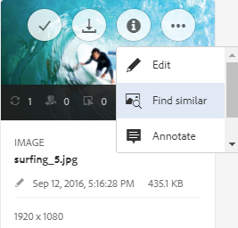
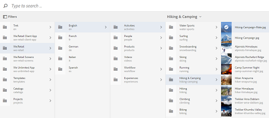
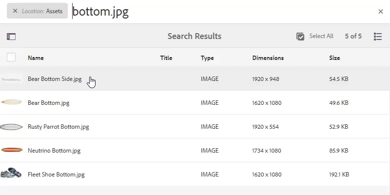
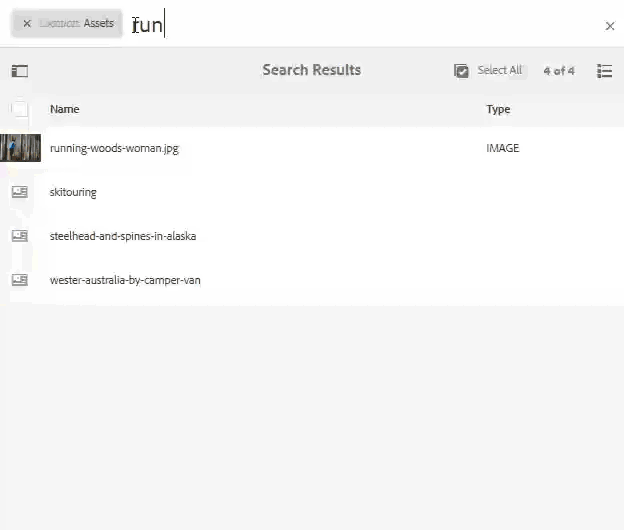
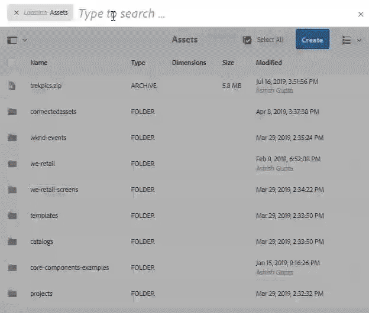

# Search digital assets in [!DNL Adobe Experience Manager] {#search-assets-in-aem}

| Version | Article link |
| -------- | ---------------------------- |
| AEM as a Cloud Service  |    [Click here](https://experienceleague.adobe.com/docs/experience-manager-cloud-service/content/assets/manage/search-assets.html?lang=en)                  |
| AEM 6.5     | This article         |

[!DNL Adobe Experience Manager Assets] provides robust asset discovery methods that help you achieve higher content velocity. Your teams can reduce time to market with seamless, intelligent search experience using out-of-the-box functionality and custom methods. Searching assets is central to the usage of a digital asset management system -- be it for further use by creatives, for robust management of assets by the business users and marketers, or for administration by DAM administrators. Simple, advanced, and custom searches that you can perform via [!DNL Assets] user interface or other apps and surfaces help fulfill these use cases.

[!DNL Experience Manager Assets] supports the following use cases and this article describes the usage, concepts, configurations, limitations, and troubleshooting for these use cases.

| Search for assets | Configure and administer search functionality | Work with search results |
|---|---|---|
| [Basic searches](#searchbasics) | [Search index](#searchindex) | [Sort results](#sort) |
| [Understand search UI](#searchui) | [Visual or similarity search](#configvisualsearch) | [Check properties and metadata of an asset](#checkinfo) |
| [Search suggestions](#searchsuggestions) | [Mandatory metadata](#mandatorymetadata) | [Download](#download) |
| [Understand search results and behavior](#searchbehavior) | [Modify search facets](#searchfacets) | [Bulk metadata updates](#metadataupdates) |
| [Search rank and boosting](#searchrank) | [Text extraction](#extracttextupload) | [Smart collections](#collections) |
| [Advanced search: filtering and scope of search](#scope) | [Custom predicates](#custompredicates) | [Understand and troubleshoot unexpected results](#unexpected-results) |
| [Search from other solutions and apps](#search-assets-other-surfaces):<ul><li>[Adobe Asset Link](#aal)</li><li>[Brand Portal](#brand-portal)</li><li>[Experience Manager desktop app](#desktop-app)</li><li>[Adobe Stock images](#adobe-stock)</li><li>[Dynamic Media assets](#dynamic-media)</li></ul> | | |
| [Asset selector](#asset-picker) | | |
| [Limitations](#limitations) and [Tips](#tips) | | |
| [Illustrated examples](#samples)| | |

Search digital assets using the Omnisearch field at the top of the [!DNL Experience Manager] web interface. Go to **[!UICONTROL Assets]** > **[!UICONTROL Files]** in [!DNL Experience Manager], click  in top bar, enter search keyword, and select `Return`. Alternatively, use the keyword shortcut `/` (forward slash) to open the Omnisearch field. `Location:Assets` is pre-selected to limit the searches to DAM assets. [!DNL Experience Manager] provides suggestions as your start typing a search keyword.

Use the **[!UICONTROL Filters]** panel to search for assets, folders, tags, and metadata. You can filter search results based on the various options (predicates), such as, file type, file size, last modified date, status of asset, insights data, and Adobe Stock licensing. You can customize the Filters panel and add or remove search predicates using [search facets](/help/assets/search-facets.md). The [!UICONTROL File Type] filter in the [!UICONTROL Filters] panel has mixed-state checkboxes. Therefore, unless you select all the nested predicates (or formats) the first-level checkboxes are partially checked.

[!DNL Experience Manager] search capability supports searching for collections and searching for assets within a collection. See [search collections](/help/assets/manage-collections.md).

## Understand search interface {#searchui}

Familiarize yourself with the search interface and the available actions.

*Figure: Understand [!DNL Experience Manager Assets] search results interface.*

**A.** Save search as a smart collection. **B.** Filters or predicates to narrow the search results. **C.** Display files, folders, or both. **D.** Click Filters to open or close the left rail. **E.** Search location is DAM. **F.** Omnisearch field with user-provided search keyword. **G.** Select the loaded search results. **H.** Number of displayed search results out of the total search results. **I.** Close search. **J.** Switch between card view and list view.

### Dynamic search facets {#dynamicfacets}

You can discover the desired assets faster from the search results page using the dynamically updated number of expected search results in the search facets. The expected number of assets are updated even before applying the search filter. Seeing the expected count against the filter helps you navigate through the search results quickly and efficiently.

*Figure: See the approximate number of assets without filtering search results in search facets.*

## Understand search results and behavior {#searchbehavior}

### Basic search terms and results {#searchbasics}

You can run keyword searches from the OmniSearch field. The keyword search is not case-sensitive and is a full-text search (across the popular metadata fields). If more than one keyword is used, `AND` is the default operator between the keywords.

The results are sorted by relevance, starting with closest matches. For multiple keywords, more relevant results are the assets that contain both terms in their metadata. Within metadata, keywords appearing as smart tags are higher ranked than keywords appearing in other metadata fields. [!DNL Experience Manager] allows giving a particular search term higher weight. Also, it is possible to [boost the rank](#searchrank) of a few targeted assets for specific search terms.

To quickly find the relevant assets, the rich interface provides filtering, sorting, and selection mechanisms. You can filter results based on multiple criteria and see number of searched assets for various filters. Alternatively, you can rerun search by changing the query in the Omnisearch field. When you change your search terms or filters, the other filters remain applied to preserve your search's context.

When the results are many assets, [!DNL Experience Manager] displays the first 100 in the card view and 200 in the list view. As users scroll, more assets are loaded. This is to improve the performance. Watch a video demonstration of the [number of assets displayed](https://www.youtube.com/watch?v=LcrGPDLDf4o).

At times, you may see some unexpected assets in the search results. For more info, see [unexpected results](#unexpected-results).

[!DNL Experience Manager] can search many file formats and the search filters can be customized to suit your business requirements. Contact your administrator to understand what search options are made available for your DAM repository and what restrictions your account has.

### Results with and without enhanced Smart Tags {#withsmarttags}

By default, [!DNL Experience Manager] search combines the search terms with an AND clause. For example, consider searching for keywords woman running. Only the assets with both woman and running keywords in the metadata appear in the search results by default. The same behavior is retained when special characters (periods, underscores, or dashes) are used with the keywords. The following search queries return the same results:

* `woman running`
* `woman.running`
* `woman-running`

However, the query `woman -running` returns assets without `running` in their metadata.
Using Smart Tags adds an extra `OR` clause to find any of the search terms as the applied smart tags. An asset tagged with either `woman` or `running` using Smart Tags also appear in such a search query. So the search results are a combination of,

* Assets with `woman` and `running` keywords in the metadata (default behavior).

* Assets smart tagged with either of the keywords (Smart Tags behavior).

### Search suggestions as you type {#searchsuggestions}

When you start typing keywords, [!DNL Experience Manager] suggests the possible search keywords or phrases. The suggestions are based on the metadata of the existing assets. [!DNL Experience Manager] indexes all the metadata fields to help with search. To provide search suggestions, the system uses the values of the following few metadata fields. To provide search suggestions, consider populating the following fields with appropriate keywords:

* Asset tags. (maps to `jcr:content/metadata/cq:tags`)
* Asset title. (maps to `jcr:content/metadata/dc:title`)
* Asset description. (maps to `jcr:content/metadata/dc:description`)
* Title in the JCR repository. The value may get mapped to Asset title. (maps to `jcr:content/jcr:title`)
* Description in the JCR repository. The value may get mapped to Asset description. (maps to `jcr:content/jcr:description`)

To receive suggestions for more than one search keywords, continue to type all keywords without selecting any suggestion for a single keyword.

*Figure: Type multiple keywords to view suggestions that fit them all.*

### Search ranking and boosting {#searchrank}

The search results that match all search terms in metadata fields are displayed first, followed by the search results that match any of the search terms in the smart tags. In the above example, the approximate order of display of search results is:

1. Matches of `woman running` in the various metadata fields.
1. Matches of `woman running` in smart tags.
1. Matches of `woman` or of `running` in smart tags.

You can improve the relevance of keywords for particular assets to help boost searches based on the keywords. In other words, the images for which you promote specific keywords appear at the top of the search results when you search based on these keywords.

1. From the [!DNL Assets] user interface, open the properties page for the asset. Click **[!UICONTROL Advanced]** and click **[!UICONTROL Add]** under **[!UICONTROL Elevate for search keywords]**.
1. In the **[!UICONTROL Search Promote]** box, specify a keyword for which you want to boost the search for the image and then click **[!UICONTROL Add]**. You can specify multiple keywords in the same way.
1. Click **[!UICONTROL Save & Close]**. The asset which you promoted for this keyword appears among the top search results.

You can use this to your advantage by boosting the rank of some assets in the search results for the targeted keyword. See the example video below. For detailed info, see [search in [!DNL Experience Manager]](https://experienceleague.adobe.com/docs/experience-manager-learn/assets/search-and-discovery/search-boost.html).

>[!VIDEO](https://video.tv.adobe.com/v/16766/?quality=6)

*Video: Understand how search results are ranked and how the rank can be influenced.*

## Advanced search {#scope}

[!DNL Experience Manager] provides various methods like filters that apply to the searched assets, to help you locate the desired assets faster. A few commonly used methods are described below. Some [illustrated examples](#samples) are shared below.

**Search for files or folders**: In the search results, see either files, folders, or both. From **[!UICONTROL Filters]** panel, you can select the appropriate option. See [search interface](#searchui).

**Search for assets within a folder**: You can limit the search to a specific folder. In the **[!UICONTROL Filters]** panel, add path of a folder. You can select only one folder at a time.

*Figure: Limit search results to a folder by adding a folder path in Filters panel.*

### Find similar images {#visualsearch}

To find images that are visually similar to a user-selected image, click **[!UICONTROL Find Similar]** option from the card view of an image or from the toolbar. [!DNL Experience Manager] displays the smart tagged images from the DAM repository that are similar to a user-selected image. See [how to configure similarity search](#configvisualsearch).

*Figure: Find similar images using the option in the card view.*

### Adobe Stock images {#adobe-stock}

From within the [!DNL Experience Manager] user interface, users can search [Adobe Stock assets](/help/assets/aem-assets-adobe-stock.md) and license the required assets. Add `Location: Adobe Stock` in the Omnisearch bar. You can also use Filters panel to find all the licensed or unlicensed assets or search a specific asset using Adobe Stock file number.

### Dynamic Media assets {#dmassets}

You can filter for Dynamic Media images by selecting **[!UICONTROL Dynamic Media]** > **[!UICONTROL Sets]** from the **[!UICONTROL Filters]** panel. It filters and displays assets such as image sets, carousels, mixed media sets, and spin sets.

### GQL search using specific values in metadata fields {#gql-search}

You can search digital assets based on exact values of metadata fields, such as, title, description, and creator. The GQL full-text search feature fetches only those assets whose metadata value exactly matches your search query. The names of the properties (Creator, Title, and so on) and the values are case-sensitive.

| Metadata field | Facet value and usage |
|---|---|
| Title | title:John |
| Creator | creator:John |
| Location | location:NA |
| Description | description:"Sample Image" |
| Creator tool | creatortool:"Adobe Photoshop" |
| Copyright Owner | copyrightowner:"Adobe Systems" |
| Contributor | contributor:John |
| Usage Terms | usageterms:"CopyRights Reserved" |
| Created | created:YYYY-MM-DDTHH |
| Expires Date | expires:YYYY-MM-DDTHH |
| On time | ontime:YYYY-MM-DDTHH |
| Off time | offtime:YYYY-MM-DDTHH |
| Range of time(expires dateontime,offtime) | facet field : lowerbound..upperbound |
| Path | /content/dam/&lt;folder name&gt; |
| PDF Title | pdftitle:"Adobe Document" |
| Subject | subject:"Training" |
| Tags | tags:"Location And Travel" |
| Type | type:"image\png" |
| Width of image | width:lowerbound..upperbound |
| Height of image | height:lowerbound..upperbound |
| Person | person:John |

The properties `path`, `limit`, `size`, and `orderby` cannot be combined using `OR` operator with any other property.

<!-- TBD: Where are the limit, size, orderby properties defined?
-->

The keyword for a user-generated property is its field label in the property editor in lowercase, with spaces removed.

Here are some examples of search formats for complex queries:

* To display all assets with multiple facets fields (for example: title=John Doe and creator tool = Adobe Photoshop): `title:"John Doe" creatortool:Adobe*`
* To display all assets when the facets value is not a single word but a sentence (for example: title=Scott Reynolds): `title:"Scott Reynolds"`
* To display assets with multiple values of a single property (for example: title=Scott Reynolds or John Doe): `title:"Scott Reynolds" OR "John Doe"`
* To display assets with property values starting with a specific string (for example: title is Scott Reynolds): `title:Scott*`
* To display assets with property values ending with a specific string (for example: title is Scott Reynolds): `title:*Reynolds`
* To display assets with a property value that contains a specific string (for example: title = Basel Meeting Room): `title:*Meeting*`
* To display assets that contain a particular string and have a specific property value (for example: search for string Adobe in assets having title=John Doe): `*Adobe* title:"John Doe"`

## Search digital assets from other [!DNL Experience Manager] offerings or interfaces {#search-assets-other-surfaces}

[!DNL Adobe Experience Manager] connects DAM repository to various other [!DNL Experience Manager] solutions to provide faster access to digital assets and streamline the creative workflows. Any asset discovery starts with browse or search. The search behavior largely remains the same across the various surfaces and solutions. Some search methods change as the target audience, the use cases, and the user interface vary across the [!DNL Experience Manager] solutions. The specific methods are documented for the individual solutions at the links below. The universally applicable tips and behaviors are documented in this article.

### Search digital assets from Adobe Asset Link panel {#aal}

Using Adobe Asset Link, the creative professionals can now access content stored in [!DNL Experience Manager Assets], without leaving the supported Adobe Creative Cloud apps. Creatives can seamlessly browse, search, check out, and check in assets using the in-app panel in the [!DNL Adobe Creative Cloud] apps: [!DNL Adobe Photoshop], [!DNL Adobe Illustrator], and [!DNL Adobe InDesign]. Asset Link also allows users to search visually similar results. The visual search display results are powered by Adobe Sensei's machine learning algorithms and help users find aesthetically similar images. See [search and browse assets](https://helpx.adobe.com/enterprise/using/manage-assets-using-adobe-asset-link.html#UseAdobeAssetLink) using Adobe Asset Link.

### Search digital assets in [!DNL Experience Manager] desktop app {#desktop-app}

Creative professionals use the desktop app to make the [!DNL Experience Manager Assets] easily searchable and available on their local desktop (Win or Mac). Creatives can easily reveal the desired assets in Mac Finder or Windows Explorer, opened in desktop applications, and changed locally - the changes are saved back to [!DNL Experience Manager] with a new version created in the repository. The application supports basic searches using one or more keywords, `*` and `?` wildcards, and `AND` operator. See [browse, search, and preview assets](https://experienceleague.adobe.com/docs/experience-manager-desktop-app/using/using.html#browse-search-preview-assets) in desktop app.

### Search digital assets in [!DNL Brand Portal] {#brand-portal}

Line-of-business users and marketers use Brand Portal to efficiently and securely share the approved digital assets with their extended internal teams, partners, and resellers. See [search assets on Brand Portal](https://experienceleague.adobe.com/docs/experience-manager-brand-portal/using/search-capabilities/brand-portal-searching.html).

### Search [!DNL Adobe Stock] images {#adobe-stock1}

From within the [!DNL Experience Manager] user interface, users can search Adobe Stock assets and license the required assets. Add `Location: Adobe Stock` in the Omnisearch field. You can also use **[!UICONTROL Filters]** panel to find all the licensed or unlicensed assets or search a specific asset using Adobe Stock file number. See [manage [!DNL Adobe Stock] images in [!DNL Experience Manager]](/help/assets/aem-assets-adobe-stock.md#usemanage).

### Search [!DNL Dynamic Media] assets {#dynamic-media}

You can filter for Dynamic Media images by selecting **[!UICONTROL Dynamic Media]** > **[!UICONTROL Sets]** from the **[!UICONTROL Filters]** panel. It filters and displays assets such as image sets, carousels, mixed media sets, and spin sets. While authoring web pages, the authors can search for sets from within the Content Finder. A filter for sets is available in a pop-up menu.

### Search digital assets in Content Finder when authoring web pages {#content-finder}

Authors can use Content Finder to search the DAM repository for the relevant assets and use the assets in the web pages they create. Authors can also use the Connected Assets functionality to search for assets that are available on a remote [!DNL Experience Manager] deployment. Authors can then use these assets in web pages on a local [!DNL Experience Manager] deployment. See [use remote assets](/help/assets/use-assets-across-connected-assets-instances.md#use-remote-assets).

### Search collections {#collections}

[!DNL Experience Manager] search capability supports searching for collections and searching for assets within a collection. See [search collections](/help/assets/manage-collections.md).

## Asset selector {#asset-picker}

>[!NOTE]
>
>Asset selector was called [asset picker](https://helpx.adobe.com/experience-manager/6-2/assets/using/asset-picker.html) in prior versions of [!DNL Adobe Experience Manager].

Asset selector lets you search, filter, and browse the DAM assets in a special way. Asset selector is available at `https://[aem_server]:[port]/aem/assetpicker.html`. You can fetch the metadata of assets that you select using the asset selector. You can launch it with supported request parameters, such as asset type (image, video, text) and selection mode (single or multiple selections). These parameters set the context of the asset selector for a particular search instance and remain intact throughout the selection.

The asset selector uses the HTML5 `Window.postMessage` message to send data for the selected asset to the recipient. It works only in the browse mode and only with the Omnisearch result page.

Pass the following request parameters in a URL to launch the asset selector in a particular context:

| Name | Values | Example | Purpose |
|---|---|---|---|
| resource suffix (B) | Folder path as the resource suffix in the URL: [https://localhost:4502/aem/assetpicker.html/&lt;folder_path&gt;](https://localhost:4502/aem/assetpicker.html) | To launch the asset selector with a particular folder selected, for example with the folder `/content/dam/we-retail/en/activities` selected, the URL should be of the form: `https://localhost:4502/aem/assetpicker.html/content/dam/we-retail/en/activities?assettype=images` | If you require a particular folder to be selected when the asset selector is launched, passed it as a resource suffix. |
| `mode` | single, multiple | <ul><li>`https://localhost:4502/aem/assetpicker.html?mode=single`</li><li>`https://localhost:4502/aem/assetpicker.html?mode=multiple`</li></ul> | In multiple mode, you can select several assets simultaneously using the asset selector. |
| `dialog` | true, false | [https://localhost:4502/aem/assetpicker.html?dialog=true](https://localhost:4502/aem/assetpicker.html?dialog=true) | Use these parameters to open the asset selector as Granite Dialog. This option is only applicable when you launch the asset selector through Granite Path Field, and configure it as pickerSrc URL. |
| `root` | &lt;folder_path&gt; | `https://localhost:4502/aem/assetpicker.html?assettype=images&root=/content/dam/we-retail/en/activities` | Use this option to specify the root folder for the asset selector. In this case, the asset selector lets you select only child assets (direct/indirect) under the root folder. |
| `viewmode` | search | | To launch the asset selector in search mode, with `assettype` and `mimetype` parameters. |
| `assettype` | Images, documents, multimedia, archives. | <ul><li>`https://localhost:4502/aem/assetpicker.html?viewmode=search&assettype=images`</li><li> `https://localhost:4502/aem/assetpicker.html?viewmode=search&assettype=documents` </li><li> `https://localhost:4502/aem/assetpicker.html?viewmode=search&assettype=multimedia` </li><li> `https://localhost:4502/aem/assetpicker.html?viewmode=search&assettype=archives` </li></ul> | Use the option to filter asset types based on the value provided. |
| `mimetype` | MIME type (`/jcr:content/metadata/dc:format`) of an asset (wildcard also supported). | <ul><li>`https://localhost:4502/aem/assetpicker.html?mimetype=image/png`</li><li>`https://localhost:4502/aem/assetpicker.html?mimetype=*png`</li><li>`https://localhost:4502/aem/assetpicker.html?mimetype=*presentation`</li><li>`https://localhost:4502/aem/assetpicker.html?mimetype=*presentation&mimetype=*png`</li></ul> | Use it to filter assets based on MIME type. |

To access the asset selector interface, go to `https://[aem_server]:[port]/aem/assetpicker`. Navigate to the desired folder, and select one or more assets. Alternatively, search for the desired asset from the Omnisearch box, apply filter as required, and then select it.

*Figure: Browse and select asset in the asset selector.*

## Limitations {#limitations}

The search capability in [!DNL Experience Manager Assets] has the following limitations:

* Do not enter a leading space in the search query otherwise the search does not work.
* [!DNL Experience Manager] may continue to show the search term after you select properties of an asset from searched results and then cancel the search. <!-- (CQ-4273540) -->
* When searching for folders or files and folders, the search results cannot be sorted on any parameter.
* If you select `Return` without typing in Omnisearch bar, [!DNL Experience Manager] returns a list of only files and not folders. If you search specifically for folders without using a keyword, [!DNL Experience Manager] does not return any results.
* You can perform full-text search on folders. Specify a search term for the search to work.

Visual search or similarity search has the following limitations:

* Visual search works best with a large repository. While there is no minimum number of images required for good results, the quality of matches with a few images is not as good as the matches from a large repository.
* You cannot change the model or train [!DNL Experience Manager] to find similar images. For example, adding or removing smart tags to a few assets does not change the model. The assets do get excluded from the visually similar search results.

The search functionality can have performance limitations in the following scenarios:

* Card view has a faster load time as compared to list view to display the search results.

## Search tips {#tips}

* When monitoring the review status of assets, use the appropriate option to find which assets are approved or assets that are pending approval.
* Use the Insights predicate to search for supported assets based on their usage statistics obtained from various Creative apps. Usage data is grouped under Usage score, Impressions, Clicks, and Media channels where the assets appear categories.
* Use the **[!UICONTROL Select All]** check box to select the searched assets. [!DNL Experience Manager] initially displays 100 assets in card view and 200 assets in list view. More assets are loaded as you scroll the search results. You can select more assets than the loaded assets. The count of the selected assets is displayed in the upper-right corner of the search results page. You can operate on the selection, for example, download the selected assets, update metadata properties in bulk for the selected assets, or add the selected assets to a Collection. When more assets are selected than displayed, an action is either applied on all selected assets or a dialog displays the number of assets it is applied on. To apply an action to the assets that did not load, ensure that all assets are explicitly selected.
* To search for assets that do not contain the mandatory metadata, see [mandatory metadata](#mandatorymetadata).
* Search uses all metadata fields. A generic search, such as searching for 12, usually returns many results. For better results, use double (not single) quotes or ensure that the number is contiguous to a word without a special character (for example `shoe12`).
* Full-text search supports operators such as `-` and `^`. To search these letters as string literals, enclose the search expression in double quotes. For example, use `"Notebook - Beauty"` instead of `Notebook - Beauty`.
* If the search results are too many, limit the [scope of search](#scope) to zero-in on the desired assets. It works best when you have some idea of how to better look for the desired assets, for example, specific file type, specific location, specific metadata, and so on.

* **Tagging**: Tags help you categorize assets that can be browsed and searched more efficiently. Tagging helps in propagating the appropriate taxonomy to other users and workflows. [!DNL Experience Manager] offers methods to automatically tag assets using Adobe Sensei's artificially intelligent services that keep getting better at tagging your assets with usage and training. When you search for assets, the smart tags are factored in if the feature is enabled on your account. It works alongside the in-built search functionality. See [search behavior](#searchbehavior). To optimize the order in which the search results are displayed, you can [boost the search ranking](#searchrank) of a few select assets.

* **Indexing**: Only indexed metadata and assets are returned in the search results. For better coverage and performance, ensure proper indexing and follow the best practices. See [indexing](#searchindex).

* To exclude specific assets from search results, use `excludedPath` property in the Lucene index.

## Some examples illustrating search {#samples}

Use double quotations around keywords to find assets that contain the exact phrase in the exact order as specified by the user.

*Figure: Search behavior with and without quotation marks.*

**Search with asterisk wildcard**: To broaden the search, use an asterisk before or after the search word to match any number of characters. For example, searching for run without an asterisk does not return assets containing any variation of the word (including in the metadata). An asterisk substitutes for any number of characters. For example,

* `run` returns assets with exactly run keyword
* `run*` returns assets with `running`, `run`, `runaway`, and so on.
* `*run` returns assets with `outrun`, `rerun`, and so on.
* `*run*` returns all possible combinations.

*Figure: Illustrating use of asterisk wildcard in Asset search using an example.*

**Search with question mark wildcard**: To broaden the search, use one or more '?' characters to match exact number of characters. For example, in the following illustration,

* `run???` query does not match any asset.

* `run????` query matches the word `running` with four characters after `run`.

* `??run` query matches the word `rerun` with two characters before `run`.

*Figure: Illustrating use of question mark wildcard in Asset search using an example.*

**Exclude a keyword**: Use dash to search for assets that do not contain a keyword. For example, `running -shoe` query returns assets that contain `running`, but not `shoe`. Similarly, `camp -night` query returns assets that contain `camp` but not `night`. The query `camp-night` returns assets that contain both `camp` and `night`.

*Figure: Use of dash to search for assets not containing an excluded keyword.*

## Configuration and administration tasks related to search functionality {#configadmin}

### Search index configurations {#searchindex}

Asset discovery relies on indexing of DAM contents, including the metadata. Faster and accurate asset discovery relies on optimized indexing and appropriate configurations. See [search index](/help/assets/performance-tuning-guidelines.md#search-indexes), [oak queries and indexing](/help/sites-deploying/queries-and-indexing.md), and [best practices](/help/sites-deploying/best-practices-for-queries-and-indexing.md).

To exclude specific assets from search results, use `excludedPath` property in the Lucene index.

### Visual or similarity search {#configvisualsearch}

Visual search uses Smart Tags. After configuring smart tagging functionality, follow these steps.

1. In [!DNL Experience Manager] CRXDE, in `/oak:index/lucene` node, add the following properties and values and save the changes.

    * `costPerEntry` property of type `Double` with the value `10`.
    * `costPerExecution` property of type `Double` with the value `2`.
    * `refresh` property of type `Boolean` with the value `true`.

   This configuration allows searches from the appropriate index.

1. To create Lucene index, in CRXDE, at `/oak:index/damAssetLucene/indexRules/dam:Asset/properties`, create node named `imageFeatures` of type `nt-unstructured`. In `imageFeatures` node,

    * Add `name` property of type `String` with the value `jcr:content/metadata/imageFeatures/haystack0`.
    * Add `nodeScopeIndex` property of type `Boolean` with the value of `true`.
    * Add `propertyIndex` property of type `Boolean` with the value of `true`.
    * Add `useInSimilarity` property of type `Boolean` with the value `true`.

   Save the changes.

1. Access `/oak:index/damAssetLucene/indexRules/dam:Asset/properties/predictedTags` and add `similarityTags` property of type `Boolean` with the value of `true`.
1. Apply Smart Tags to the assets in your [!DNL Experience Manager] repository. See [how to configure smart tags](https://experienceleague.adobe.com/docs/experience-manager-learn/assets/configuring/tagging.html#configuring).
1. In CRXDE, in `/oak-index/damAssetLucene` node, set the `reindex` property to `true`. Save the changes.
1. (Optional) If you have customized search form then copy the `/libs/settings/dam/search/facets/assets/jcr%3Acontent/items/similaritysearch` node to `/conf/global/settings/dam/search/facets/assets/jcr:content/items`. Save the changes.

For related information, see [understand smart tags in Experience Manager](https://experienceleague.adobe.com/docs/experience-manager-learn/assets/metadata/image-smart-tags.html) and [how to manage smart tags](/help/assets/enhanced-smart-tags.md).

>[!CAUTION]
>
>If the Lucene indexing is done out of [!DNL Adobe Experience Manager], then the search based on smart tags does not work as expected.

### Mandatory metadata {#mandatorymetadata}

Business users, administrators, or DAM librarians can define some metadata as mandatory metadata that is a must for the business processes to work. For various reasons, some assets may be missing this metadata, such as legacy assets or assets migrated in bulk. Assets with missing or invalid metadata are detected and reported based on the indexed metadata property. To configure it, see [mandatory metadata](/help/assets/metadata-schemas.md#define-mandatory-metadata).

### Modify search facets {#searchfacets}

To improve the speed of discovery, [!DNL Experience Manager Assets] offers search facets using which you can filter the search results. The Filters panel includes a few standard facets by default. Administrators can customize the Filters panel to modify the default facets using the in-built predicates. [!DNL Experience Manager] provides a good collection of in-built predicates and an editor to customize the facets. See [search facets](/help/assets/search-facets.md).

### Extract text when uploading assets {#extracttextupload}

You can configure [!DNL Experience Manager] to extract the text from the assets when users upload assets, such as PSD or PDF files. [!DNL Experience Manager] indexes the extracted text and helps users search these assets based on the extracted text. See [upload assets](/help/assets/manage-assets.md#uploading-assets).

If text extraction becomes too resource-intensive for your deployment, consider [disabling text extraction](https://helpx.adobe.com/experience-manager/kb/Disable-binary-text-extraction-to-optimize-Lucene-indexing-AEM.html).

### Custom predicates to filter search results {#custompredicates}

Predicates are used to create facets. Administrators can customize the search facets in the Filters panel using pre-configured predicates. These predicates can be customized using overlays. See [create custom predicates](/help/assets/searchx.md).

You can search for digital assets based on one or more of the following properties. Filters that apply on some of these properties are available by default and some other filters can be custom-created to apply on the other properties.

| Search field    | Search property values                                                                                                                 |
|-----------------|----------------------------------------------------------------------------------------------------------------------------------------|
| MIME Types      | Images, Documents, Multimedia, Archives, or Other.                                                                                     |
| Last Modified   | Hour, Day, Week, Month, or Year.                                                                                                       |
| File Size       | Small, Medium, or Large.                                                                                                               |
| Publish Status  | Published or Unpublished.                                                                                                              |
| Approved Status | Approved or Rejected.                                                                                                                  |
| Orientation     | Horizontal, Vertical, or Square.                                                                                                       |
| Style           | Color, or Black & White.                                                                                                               |
| Video Height    | Specified as a minimum and maximum value. Value is stored in the metadata of video renditions only.                                    |
| Video Width     | Specified as a minimum and maximum value. Value is stored in the metadata of video renditions only.                                    |
| Video Format    | DVI, Flash, MPEG4, MPEG, OGG Theora, QuickTime, Windows Media. Value is stored in the metadata of the source video and any renditions. |
| Video Codec     | x264. Value is stored in the metadata of video renditions only.                                                                        |
| Video Bitrate   | Specified as a minimum and maximum value. Value is stored in the metadata of video renditions only.                                    |
| Audio Codec     | Libvorbis, Lame MP3, AAC Encoding. Value is stored in the metadata of video renditions only.                                           |
| Audio Bitrate   | Specified as a minimum and maximum value. Value is stored in the metadata of video renditions only.                                    |

## Work with asset search results {#aftersearch}

You can do the following with the assets you've searched in [!DNL Experience Manager]:

* View metadata properties and other information.
* Download one or more assets.
* Use Desktop Actions to open these assets in the desktop app.
* Create smart collections.
* Create a version
* Start a workflow
* Relate or unrelate assets
* Apply filters, using the Filters panel that displays automatically after performing the search, to narrow the search results.

### Sort search results {#sort}

Sort search results to discover the required assets faster. You can sort the search results in list view and only when you select **[[!UICONTROL Files]](#searchui)** from the **[!UICONTROL Filters]** panel. [!DNL Assets] uses server-side sorting to quickly sort all the assets (howsoever numerous) within a folder or results of a search query. Server-side sorting provides faster and more accurate results than client-side sorting.

In list view, you can sort the search results just as you can sort assets in any folder. Sorting works on these columns -- Name, Title, Status, Dimensions, Size, Rating, Usage, (Date) Created, (Date) Modified, (Date) Published, Workflow, and Checked out.

For limitations of sort functionality, see [limitations](#limitations).

### Check detailed information of an asset {#checkinfo}

You can check detailed information of a searched assets from the search result page.

To see all metadata of an asset, select the asset and click **[!UICONTROL properties]** from the toolbar.

To check the comments on an asset or version history of an asset, click the asset to open large-sized preview. Open timeline in the left rail and select **[!UICONTROL Comments]** or **[!UICONTROL Versions]**. You can also sort the timeline activity like comments or versions in a chronological order.

*Figure: Sort timeline entries for a search asset.*

### Download searched assets {#download}

You can download the searched assets and their renditions just as you download regular assets from folders. Select one or more assets from the search results and click **[!UICONTROL Download]** from the toolbar.

### Bulk update metadata properties {#metadataupdates}

It is possible to make bulk updates to the common metadata fields of multiple assets. From the search results, select one or more assets. Click **[!UICONTROL Properties]** from the toolbar and update the metadata as required. Click **[!UICONTROL Save and Close]** when done. The previously existing metadata in the updated fields is overwritten.

For the assets that are available in a single folder or a collection, it is easier to [update the metadata in bulk](/help/assets/metadata.md) without using the search functionality. For the assets that are available across folders or match a common criteria, it is faster to bulk update the metadata via searching.

### Smart collections {#smart-collections}

A collection is an ordered set of assets that can include assets from different locations because collections contain only references to these assets. Collections are of the following two types:

* A static reference list of assets, folders, and other collections.
* A dynamic list (smart collection) that populates assets in the collection based on a search criteria.

You can create smart collections based on the search criteria. From the **[!UICONTROL Filters]** panel, select **[!UICONTROL Files]** and click **[!UICONTROL Save Smart Collection]**. See [manage collections](/help/assets/manage-collections.md).

### Create a version {#create-version}

Create a version for the assets that display in the search results. Select the asset and click **[!UICONTROL Create]** > **[!UICONTROL Version]**. Add an optional label or a comment and click **[!UICONTROL Create]**. You can also select multiple assets and create versions for them simultaneosuly.

### Create a workflow {#create-workflow}

Similar to the create version capability, you can also create a workflow for the assets that display in the search results. Select the asset(s) and click **[!UICONTROL Create]** > **[!UICONTROL Workflow]**. Select the workflow model, specify a title for the workflow, and click **[!UICONTROL Start]**.

### Relate and Unrelate assets {#relate-unrelate-assets}

Relate and unrelate assets that display in the search results. Select the asset(s) and click **[!UICONTROL Relate]** or **[!UICONTROL Unrelate]**.

## Unexpected search results and issues {#unexpected-results}

| Error, issues, symptoms | Possible reason | Possible fix or understanding of the issue |
|---|---|---|
| Incorrect results when searching for assets with missing metadata. | When searching for assets that are missing the mandatory metadata, [!DNL Experience Manager] may display some assets that have valid metadata. The results are based on indexed metadata property. | After the metadata is updated, re-indexing is required to reflect correct state of assets metadata. See [mandatory metadata](metadata-schemas.md#define-mandatory-metadata).|
| Too many search results. | Broad search parameter. | Consider limiting the [scope of search](#scope). Use of smart tags may give you more search results than you expected. See [search behavior with smart tags](#withsmarttags). |
| Unrelated or partly related search results. | Search behavior changes with smart tagging. | Understand [how search changes after smart tagging](#withsmarttags). |
| No auto-complete suggestions for assets. | Newly uploaded assets are not indexed yet. The metadata is not immediately available as suggestions when you start typing a search keyword in Omnisearch bar.| [!DNL Experience Manager] waits until the expiry of a timeout period (one hour by default) before running a background job to index the metadata for all newly uploaded or updated assets and then adds the metadata to the list of suggestions. |
| No search results. | <ul><li>Assets matching your query don't exist. </li><li> Whitespace added before the search query. </li><li> Unsupported metadata field contains the keyword that you searched for.</li><li> Search made during an asset's off-time. </li></ul> | <ul><li>Search using a different keyword. Alternatively, use smart tagging or similarity search to improve search results. </li><li>[Known limitation](#limitations).</li><li>All metadata fields are not considered for searches. See [scope](#scope).</li><li>Search later or modify on-time and off-time for the required assets.</li></ul> |
| Search filter or a predicate is not available. | <ul><li>The search filter is either not configured.</li><li>It is not available for your login.</li><li>(Less likely) The search options are not customized on the deployment you are using.</li></ul> | <ul><li>Contact administrator to check if the search customizations are available or not.</li><li>Contact administrator to check if your account has the privilege/permissions to use the customization.</li><li>Contact administrator and check the available customizations for the [!DNL Assets] deployment you are using.</li></ul> |
| When searching for visually similar images, an expected image is missing. | <ul><li>Image is not available in [!DNL Experience Manager].</li><li>Image is not indexed. Typically, when it is recently uploaded.</li><li>Image is not smart tagged.</li></ul> | <ul><li>Add the image to [!DNL Assets].</li><li>Contact your administrator to re-index the repository. Also, ensure that you are using the appropriate index.</li><li>Contact your administrator to smart tag the relevant assets.</li></ul> |
| When searching for visually similar images, an irrelevant image is displayed. | Visual search behavior.| [!DNL Experience Manager] displays as many potentially relevant assets as possible. Less relevant images, if any, are added to the results but with a lower search ranking. The quality of the matches and relevance of searched assets decrease as you scroll down the search results. |
| When selecting and operating on search results, all searched assets are not operated upon. | The [!UICONTROL Select All] option only selects first 100 search results in card view and first 200 search results in list view. | |

>[!MORELIKETHIS]
>
>* [[!DNL Experience Manager] search implementation guide](https://experienceleague.adobe.com/docs/experience-manager-learn/sites/developing/search-tutorial-develop.html)
>* [Advanced configuration to boost search results](https://experienceleague.adobe.com/docs/experience-manager-learn/assets/search-and-discovery/search-boost.html)
>* [Configure smart translation search](https://experienceleague.adobe.com/docs/experience-manager-learn/assets/translation/smart-translation-search-technical-video-setup.html)
