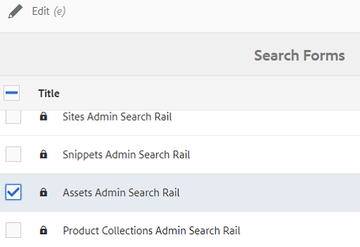
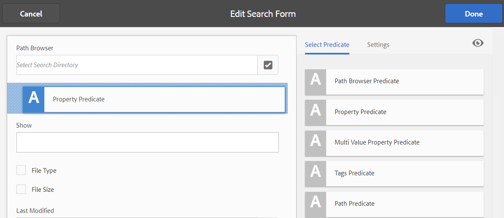
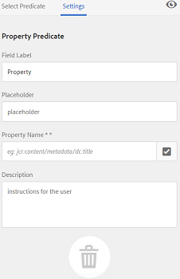
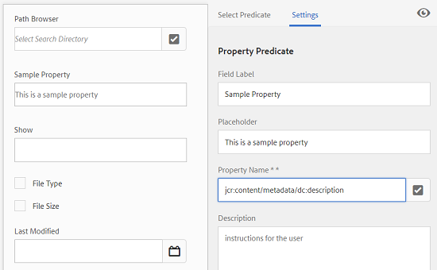
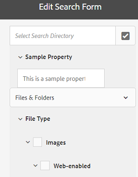
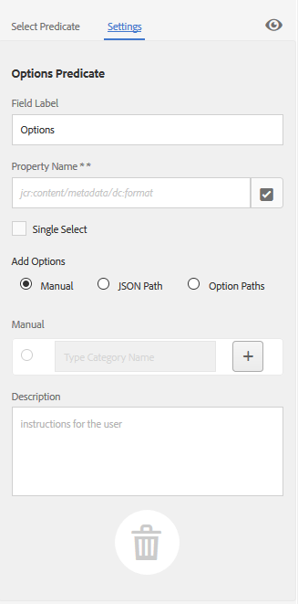
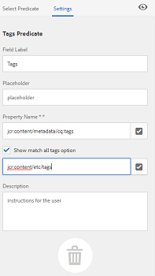
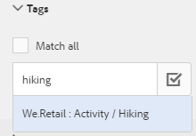
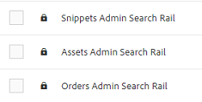

# Search Facets {#search-facets}

Learn how to create, modify, and use search facets in AEM.

An enterprise-wide deployment of Adobe Experience Manager (AEM) Assets has the capacity to store many assets. Sometimes, finding the right asset can be arduous and time-consuming if you only use the generic search capabilities of AEM.

Use search facets in the Filters panel to add more granularity to your search experience and make the search functionality more efficient and versatile. Search facets add multiple dimensions (predicates) that enable you to perform more intricate searches. The Filters panel includes a few standard facets. You can also add custom search facets.

In summary, search facets let you search for assets in multiple ways rather than in a single, pre-determined, taxonomic order. You can easily drill down to the desired level of detail for a more focused search.

For example, if you are looking for an image, you can choose whether you want a bitmap or a vector image. You can reduce the scope of search further by specifying the MIME type for the image. Similarly, when searching for documents, you can specify the format, for example PDF or MS Word.

## Adding a Predicate {#adding-a-predicate}

The search facets that appear in the Filters panel are defined in the underlying search form using predicates. To display more or different facets, you add predicates to the default form or use a custom form that includes facets of your choice.

For full-text searches, add the Fulltext predicate to the form. Use the Property predicate to search for assets that match a single property you specify. Use the Options predicate to search assets that match one or more values for a particular property. Add the Date Range predicate to search assets created within a specified date range.

1. Tap/click the AEM logo, and then go to **[!UICONTROL Tools]** > **[!UICONTROL General]** > **[!UICONTROL Search Forms]**.
1. From the Search Forms page, select **[!UICONTROL Assets Admin Search Rail]**, then tap  **Edit** .

   

   Locate and select the Assets Admin Search Rail

   >[!NOTE]
   >
   >To use the folder search functionality from the pre-configured **Assets Admin Search Rail** from an earlier AEM version, perform these steps:
   > 
   >1. Navigate to */conf/global/settings/dam/search/facets/assets/jcr:content/items* in CRX-DE.
   >1. Delete the **type** node.
   >1. From the path */libs/settings/dam/search/facets/assets/jcr:content/items*, copy the nodes **asset, directory, typeor, excludepaths**, and **searchtype** to the path mentioned on step 1.
   >1. Save the changes.

1. In the Edit Search Forms page, drag a predicate from the **[!UICONTROL Select Predicate]** tab to the main pane. For example, drag **[!UICONTROL Property Predicate]**.

   

   Drag-and-drop a predicate to customize the search filters

1. In the Settings tab, enter a field label, placeholder text, and description for the predicate. Specify a valid name for the metadata property you want to associate with the predicate.

   The header label in the Settings tab identifies the type of the selected predicate.

   

   Use the Settings tab to provide the required options of a predicate

1. In the **[!UICONTROL Property Name]** field, specify a valid name for the metadata property you want to associate with the predicate. It is the name based on which the search is performed. For example, enter `jcr:content/metadata/dc:description` or `./jcr:content/metadata/dc:description`.

   You can also select an existing node from the selection dialog.

   

   Associate a metadata property with a predicate in the Property Name field

1. Tap/click the **[!UICONTROL Preview]**  to generate a preview of the Filters panel as it appears after you add the predicate.
1. Review the layout of the predicate in the Preview mode.

   

   Preview the search form before submitting the changes

1. To close the preview, tap/click the **[!UICONTROL Close]**  on the upper-right corner of the preview.
1. Tap **[!UICONTROL Done]** to save the settings.
1. Navigate to the Search panel in the Assets user interface. The Property predicate is added to the panel.
1. Enter a description for the asset to be searched in the text box. For example, enter "Adobe." When you perform a search, assets with description matching "Adobe" are listed in the search results.

## Adding an Options predicate {#adding-an-options-predicate}

The Options predicate lets you add multiple search options in the Filters panel. You can select one or more of these options in the Filters panel to search for assets. For example, to search for assets based on file type, configure options, such as Images, Multimedia, Documents, and Archives in the search form. After you configure these options, the search is performed on assets of type GIF, JPEG, PNG, and so on, when you select the Images option in the Filters panel.

To map the options to the respective property, create a node structure for the options and provide the path of the parent node in the Property Name property of Options predicate. The parent node should be of type `sling`: `OrderedFolder`. The options should be of type `nt:unstructured`. The option nodes should have the properties `jcr:title` and `value` configured.

The `jcr:title` property is a user-friendly name for the option that is displayed on the Filters panel. The `value` field is used in the query to match the specified property.

When you select an option, the search is performed based on the `value` property of the option node and its child nodes, if any. The entire tree under the option node is traversed and the `value` property of each child node is combined using an OR operation to form the search query.

For example, if you select "Images" for file types, the search query for the assets is built by combining the `value` property using an OR operation. For example, the search query for images is built by combining the results matched for *image/jpeg*, *image/gif*, *image/png*, *image/pjpeg*, and *image/tiff* for the property `jcr:content/metadata/dc:format` using an OR operation.


Value property of a file type, as seen in CRXDE, is used for search queries to work

Instead of manually creating a node structure for the options in the CRX repository, you can define the options in a JSON file by specifying corresponding key-value pairs. Specify the path of the JSON file in the **[!UICONTROL Property Name]** field. For example, you can define the key-value pairs, `image/bmp`, `image/gif`, `image/jpeg`, and `image/png` and specify their values as shown in the following sample JSON file. In the **[!UICONTROL Property Name]** field, you can specify the CRX path for this file.

```
{
    "options" :
 [
          {"value" : "image/bmp","text" : "BMP"},
          {"value" : "image/gif","text" : "GIF"},
          {"value" : "image/jpeg","text" : "JPEG"},
          {"value" : "image/png","text" : "PNG"}
 ]

}  

```

If you want to use an existing node, specify it using the selection dialog.

>[!NOTE]
>
>The Options predicate is a custom wrapper that includes property predicates to demonstrate the described behavior. Currently, there is no REST endpoint available to support the functionality natively.

1. Tap the AEM logo, and then go to **[!UICONTROL Tools > General > Search Forms]**.
1. From the **[!UICONTROL Search Forms]** page, select **[!UICONTROL Assets Admin Search Rail]**, then tap the Edit icon.
1. In the **[!UICONTROL Edit Search Form]** page, drag **[!UICONTROL Options Predicate]** from the **[!UICONTROL Select Predicate]** tab to the main pane.
1. In the **[!UICONTROL Settings]** tab, enter a label and a name for the property. For example, to search assets based on their format, specify a user-friendly name for the label, for example **[!UICONTROL File Type]**. Specify the property based on which the search is to be performed in the property field, for example `jcr:content/metadata/dc:format.`
1. Do one of the following:

    * In the **[!UICONTROL Property Name]** field, mention the path of the JSON file where you define the nodes for the options and specify corresponding key-value pairs.
    * Tap  next to the Options field to specify the display text and value for the options you want to supply in the Filters panel. To add another option, tap/click  and repeat the step.

1. Ensure that **[!UICONTROL Single Select]** is cleared to let the user select multiple options for file types at a time (for example, Images, Documents, Multimedia, and Archives). If you select **[!UICONTROL Single Select]**, the user can select only one option for file types at a time.

   

   The available fields in the Options predicate

1. In the **Description** field, enter an optional description and then click **[!UICONTROL Done]**.
1. Navigate to the Search panel. The Options predicate is added to the **Search** panel. The options for **[!UICONTROL File Type]** are displayed as checkboxes.

## Adding a Multi Value Property predicate {#adding-a-multi-value-property-predicate}

The Multi Value Property predicate lets you search assets for multiple values. Consider a scenario where you have images of multiple products in AEM Assets and the metadata for each image includes an SKU number associated with the product. You can use this predicate to search for product images based on multiple SKU numbers.

1. Click the AEM logo, and then go to **[!UICONTROL Tools]** > **[!UICONTROL General]** > **[!UICONTROL Search Forms]**.
1. On the Search Forms page, select **[!UICONTROL Assets Admin Search Rail]**, the tap **Edit** .
1. In the Edit Search Form page, drag a **[!UICONTROL Multi Value Property Predicate]** from the **[!UICONTROL Select Predicate]** tab to the main pane.
1. In the **[!UICONTROL Settings]** tab, enter a label and placeholder text for the predicate. Specify the property name based on which the search is to be performed in the property field, for example `jcr:content/metadata/dc:value`. You can also use the selection dialog to select a node.
1. Ensure that **[!UICONTROL Delimiter Support]** is selected. In the **[!UICONTROL Input Delimiters]** field, specify delimiters to separate individual values. By default, comma is specified as the delimiter. You can specify a different delimiter.
1. In the **Description** field, enter an optional description and then tap **[!UICONTROL Done]**.
1. Navigate to the Filters panel in the Assets user interface. The **[!UICONTROL Multi Value Property]** predicate is added to the panel.
1. Specify multiple value in the Multi Value field separated by the delimiters and perform the search. The predicate fetches an exact text match for the values you specify.

## Adding a Tags predicate {#adding-a-tags-predicate}

The Tag predicate allows you to perform tag-based searches for assets. By default, AEM Assets searches assets for one or more tags matches based on the tags you specify. In other words, the search query performs an OR operation using the specified tags. However, you can use the match all tags option to search for assets that include all tags that you specify.

1. Click the AEM logo, and then go to **[!UICONTROL Tools]** > **[!UICONTROL General]** > **[!UICONTROL Search Forms]**.
1. From the Search Forms page, select **[!UICONTROL Assets Admin Search Rail]** and then tap **Edit** .
1. In the Edit Search Form page, drag **[!UICONTROL Tags Predicate]** from the Select Predicate tab to the main pane.
1. In the Settings tab, enter a placeholder text for the predicate. Specify the property name based on which the search is to be performed in the property field, for example *jcr:content/metadata/cq:tags*. Alternatively, you can select a node in CRXDE from the selection dialog.
1. Configure the Root tags path property of this predicate to populate various tags in the Tags list.
1. Select **[!UICONTROL Show match all tags option]** to search for assets that include all tags that you specify.

   

   Typical settings of Tags predicate

1. In the **[!UICONTROL Description]** field, enter an optional description and then click/tap **[!UICONTROL Done]**.
1. Navigate to the Search panel. The **[!UICONTROL Tags]** predicate is added to the Search panel.
1. Specify tags based on which you want to search assets or select from the list of suggestions.

   

   AEM-provided suggestion when typing name of tag

1. Select **[!UICONTROL Match all]** to search for matches that include all tags that you specify.

## Adding other predicates {#adding-other-predicates}

Similar to the way you add a Property predicate or an Options predicate, you can add the following additional predicates to the Search panel:

<table> 
 <tbody> 
  <tr> 
   <td><p><strong>Predicate Name</strong></p> </td> 
   <td><p><strong>Description</strong></p> </td> 
   <td><p><strong>Properties</strong></p> </td> 
  </tr> 
  <tr> 
   <td><p>Fulltext</p> </td> 
   <td>Search predicate to perform full text search on an entire asset node. It is mapped with the <code>jcr</code>:<code>contains</code> operator. You can specify a relative path if you want to perform a full text search on a specific part of the asset node.</td> 
   <td> 
    <ul> 
     <li>Label</li> 
     <li>Placeholder</li> 
     <li>Property name</li> 
     <li>Description</li> 
    </ul> </td> 
  </tr> 
  <tr> 
   <td>Path Browser</td> 
   <td>Search predicate to search for assets in folders and subfolders at a preconfigured root path</td> 
   <td> 
    <ul> 
     <li>Placeholder</li> 
     <li>Root path</li> 
     <li>Description</li> 
    </ul> </td> 
  </tr> 
  <tr> 
   <td><p>Path</p> </td> 
   <td><p>Use it to filter results on location. You can specify different paths as options.</p> </td> 
   <td> 
    <ul> 
     <li>Label</li> 
     <li>Path</li> 
     <li>Description</li> 
    </ul> </td> 
  </tr> 
  <tr> 
   <td><p>Publish Status</p> </td> 
   <td><p>Search predicate to search assets based on their publish status</p> </td> 
   <td> 
    <ul> 
     <li>Label</li> 
     <li>Property name</li> 
     <li>Description</li> 
    </ul> </td> 
  </tr> 
  <tr> 
   <td><p>Relative Date</p> </td> 
   <td><p>Search predicate to search assets based on the relative date of their creation. For example, you can configure options, such as 2 months ago, 3 weeks ago, and so on. </p> </td> 
   <td> 
    <ul> 
     <li>Label</li> 
     <li>Property name</li> 
     <li>Relative date</li> 
    </ul> </td> 
  </tr> 
  <tr> 
   <td><p>Range</p> </td> 
   <td><p>Search predicate to search assets that lie within a specified range. In the Search panel, you can specify minimum and maximum values for the range.</p> </td> 
   <td> 
    <ul> 
     <li>Label</li> 
     <li>Property name</li> 
     <li>Description</li> 
    </ul> </td> 
  </tr> 
  <tr> 
   <td><p>Date Range</p> </td> 
   <td><p>Search predicate to search assets created within a specified range for a date property. In the Search panel, you can specify Start and End dates using date pickers.</p> </td> 
   <td> 
    <ul> 
     <li>Label</li> 
     <li>Placeholder</li> 
     <li>Property name</li> 
     <li>Range text (From)</li> 
     <li>Range text (To)</li> 
     <li>Description</li> 
    </ul> </td> 
  </tr> 
  <tr> 
   <td><p>Date</p> </td> 
   <td><p>Search predicate for a slider-based search of assets based on a date property.</p> </td> 
   <td> 
    <ul> 
     <li>Label</li> 
     <li>Property name</li> 
     <li>Description</li> 
    </ul> </td> 
  </tr> 
  <tr> 
   <td><p>File Size</p> </td> 
   <td><p>Search predicate to search assets based on their size. It is a silder-based predicate where you select the slider options from a configurable node. The default options are defined at /libs/dam/options/predicates/filesize in the CRX repository. File size is provided in bytes.</p> </td> 
   <td> 
    <ul> 
     <li>Label</li> 
     <li>Property name</li> 
     <li>Path</li> 
     <li>Description</li> 
    </ul> </td> 
  </tr> 
  <tr> 
   <td>Asset Last Modified</td> 
   <td>Search predicate to search recently modified assets </td> 
   <td> 
    <ul> 
     <li>Property name</li> 
     <li>Property value</li> 
     <li>Description</li> 
    </ul> </td> 
  </tr> 
  <tr> 
   <td>Publish Status</td> 
   <td>Search predicate to search for assets based on their publish status </td> 
   <td> 
    <ul> 
     <li>Label</li> 
     <li>Property name</li> 
     <li>Description</li> 
    </ul> </td> 
  </tr> 
  <tr> 
   <td>Rating</td> 
   <td>Search predicate to search assets based on their average rating </td> 
   <td> 
    <ul> 
     <li>Label</li> 
     <li>Property name</li> 
     <li>Option path</li> 
     <li>Description</li> 
    </ul> </td> 
  </tr> 
  <tr> 
   <td>Expiry Status</td> 
   <td>Search predicate to search for assets based on their expiration status </td> 
   <td> 
    <ul> 
     <li>Label</li> 
     <li>Property name</li> 
     <li>Description</li> 
    </ul> </td> 
  </tr> 
  <tr> 
   <td>Hidden</td> 
   <td>Search predicate that defines a hidden field property to search for assets</td> 
   <td> 
    <ul> 
     <li>Property name</li> 
     <li>Property value</li> 
     <li>Description</li> 
    </ul> </td> 
  </tr> 
 </tbody> 
</table>

## Restoring default search facets {#restoring-default-search-facets}

By default, a Lock icon appears before **[!UICONTROL Assets Admin Search Rail]** in the **[!UICONTROL Search Forms]** page. The Lock icon disappears if you add search facets to the form indicating that the default form has been modified.



Lock icon against an option on the Search Forms page indicate that the default settings are intact and are not customized.

To restore the default search facet, perform these steps:

1. Select **[!UICONTROL Assets Admin Search Rail]** in the **[!UICONTROL Search Forms]** page.
1. Tap **[!UICONTROL Delete]**  in the toolbar. 
1. In the confirmation dialog, tap **[!UICONTROL Delete]** to remove the custom changes.

   After you delete the custom changes to search facets, the Lock icon reappears before **[!UICONTROL Assets Admin Search Rail]** in the **[!UICONTROL Search Forms]** page.

## User permissions {#user-permissions}

If you are not assigned an administrator role, here is a list of permissions you require to perform edit, delete, and preview actions involving search facets.

<table> 
 <tbody> 
  <tr> 
   <td><strong>Action</strong></td> 
   <td><strong>Permissions</strong></td> 
  </tr> 
  <tr> 
   <td>Edit </td> 
   <td>Read and Write permissions on the <code>/apps</code> node in CRX<br /> </td> 
  </tr> 
  <tr> 
   <td>Delete</td> 
   <td>Read, Write, and Delete permissions on the <code>/apps</code> node in CRX</td> 
  </tr> 
  <tr> 
   <td>Preview</td> 
   <td>Read, Write, and Delete permissions on the <code>/var/dam/content</code> node in CRX. Also, Read and Write permissions on <code>/apps</code> node.</td> 
  </tr> 
 </tbody> 
</table>

>[!MORELIKETHIS]
>
>* [Extending Assets' search](searchx.md)
>* [Searching Assets](search-assets.md)
>* [Searching video assets](search-video-assets.md)
