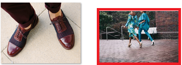
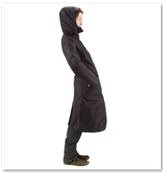

# Smart Content Service Training Guidelines {#smart-content-service-training-guidelines}

To be able to effectively tag your brand images, the Smart Content Service requires that the training images conform to certain guidelines.

## Guidelines for training {#guidelines-for-training}

For best results, images in your training set should conform to the following guidelines:

**Quantity and size:** Minimum **30 images per tag**. Minimum of 500 pixels on the longer side.

**Coherence**: Images for a tag should be visually similar.

For example, it is not a good idea to tag all of these images as *my-party* (for training) because they are not visually similar.

**Coverage**: There should be sufficient variety in the images in the training. The idea is to supply a few but reasonably diverse examples so that AEM learns to focus on the right things. If you're applying the same tag on visually dissimilar images, include at least five examples of each kind.

For example, for the tag *model-down-pose*, include more training images similar to the highlighted image below for the service to identify similar images more accurately during tagging.

**Distraction/obstruction**: The service trains better on images that have less distraction (prominent backgrounds, unrelated accompaniments, such as objects/persons with the main subject).

For example, for the tag *casual-shoe*, the second image is not a good training candidate.

**Completeness:** If an image qualifies for more than one tag, add all applicable tags before including the image for training. For example, for tags, such as *raincoat* and *model-side-view*, add both the tags on the eligible asset before including it for training.

## Limitations {#limitations}

Enhanced smart tags are based on learning models of brand images and their tags. These models are not always perfect at identifying tags. The current version of the Smart Content Service has the following limitations:

* Inability to recognize subtle differences in images. For example, slim versus regular fitted shirts. 
* Inability to identify tags based on tiny patterns/parts of an image. For example, logos on T-shirts.
* Tagging is supported in the locales that AEM is supported in. For a list of languages, see [Smart Content Services release notes](/help/release-notes/smart-content-service-release-notes.md).

To search for assets with smart tags (regular or enhanced), use the Assets Omni-search (full-text search). There is no separate search predicate for smart tags. 

>[!NOTE]
>
>The ability of the Smart Content Service to train on your tags and apply them on other images depends on the quality of images you use for training. 
>
>For best results, Adobe recommends that you use visually similar images to train the service for each tag.

