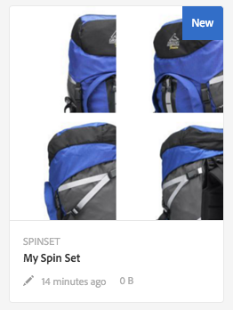
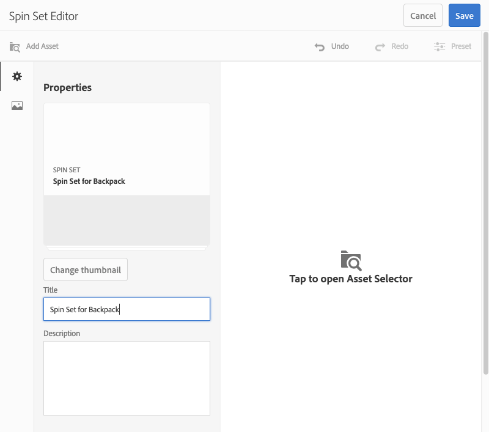
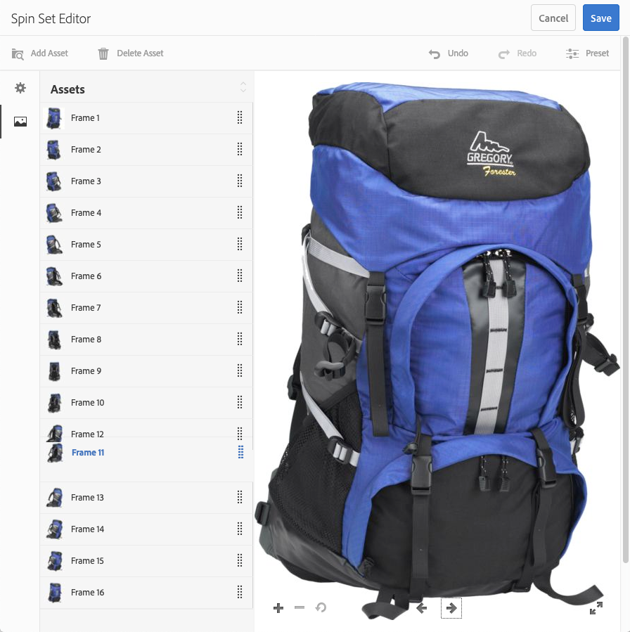
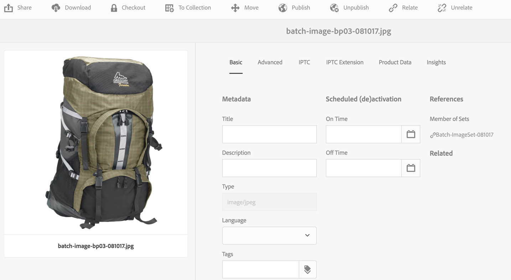
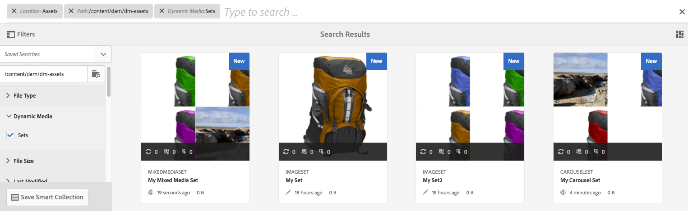

# Spin Sets{#spin-sets}

A Spin Set simulates the real-world act of turning an object to examine it. Spin Sets make it possible to view items from any angle, gaining the key visual details from any angle.

A Spin Set simulates a 360-degree viewing experience. Dynamic Media offers single-axis Spin Sets in which viewers can rotate an item. Moreover, users can "free-form" zoom and pan any of the views with a few simple mouse-clicks. In this way, users can examine an item more closely from a particular viewpoint.

Spin Sets are designated by a banner with the word **[!UICONTROL SPINSET]**. In addition, if the Spin Set is published, then the publish date, indicated by the **[!UICONTROL World]** icon is on the banner along with the last modification date, indicated by the **[!UICONTROL Pencil]** icon displays.

>[!NOTE]
>
>For information on the Assets user interface, see [Manage assets](/help/assets/manage-assets.md).

When you create a Spin Set, Adobe recommends the following best practice and enforces the following limits:

| Limit type | Best practice | Limit imposed |
| --- | --- | --- |
| Maximum number of rows/columns per 2D set | 12-18 images per set | 1000 |

See also [Dynamic Media limitations](/help/assets/limitations.md).

## Quick Start: Spin Sets {#quick-start-spin-sets}

To get you up and running quickly with Spin Sets, follow these steps:

1. [Upload your images for multiple views](#uploading-assets-for-spin-sets).

   At minimum, you need 8-12 shots of an item for a one-dimensional Spin Set and 16-24 for a two-dimensional Spin Set. The shots must be taken at regular intervals to give the impression that the item is rotating and being flipped. For example, if a one-dimensional Spin Set includes 12 shots, rotate the item 30° (360/12) for each shot.

      See [Dynamic Media - Supported raster image formats](/help/assets/assets-formats.md#supported-raster-image-formats-dynamic-media) for a list of formats supported by Spin Sets.

1. [Create a Spin Set](#creating-spin-sets).

   To create a Spin Set, select **[!UICONTROL Create > Spin Set]** and then name the set, choose the assets, and choose the order the images appear.

   See [Work with Selectors](/help/assets/working-with-selectors.md).

   >[!NOTE]
   >
   >You can also create spin sets automatically through [batch set presets](/help/assets/config-dms7.md#creating-batch-set-presets-to-auto-generate-image-sets-and-spin-sets). **Important:** Batch sets are created by the IPS (Image Production System) as part of asset ingestion and are available only in Dynamic Media - Scene7 mode.

1. Set up [Spin Set Viewer presets](/help/assets/managing-viewer-presets.md), as needed.

   Administrators can create or modify Spin Set Viewer Presets. To see your spin set with a viewer preset, select the spin set, and in the left-rail drop-down menu, select **Viewers**.

   See **[!UICONTROL Tools]** > **[!UICONTROL Assets]** > **[!UICONTROL Viewer Presets]** if you want to create or edit viewer presets.

   See [Add and edit viewer presets](/help/assets/managing-viewer-presets.md).

1. [View a Spin Set](#viewing-spin-sets).

   You can view and access sets created by way of batch set presets in three different ways. (Sets created using batch set presets, do *not* appear in the user interface.)

1. [Preview a Spin Set](/help/assets/previewing-assets.md).

   Select the Spin Set and you can preview it. Rotate the Spin Set. You can choose different viewers from the **[!UICONTROL Viewers]** menu, available from the left rail drop-down menu.

1. [Publish a Spin Set](/help/assets/publishing-dynamicmedia-assets.md).

   Publishing a Spin Set activates the URL and Embed string. In addition, you must [publish the viewer preset](/help/assets/managing-viewer-presets.md).

1. [Link URLs to your web application](/help/assets/linking-urls-to-yourwebapplication.md) or [Embed the Video or Image Viewer](/help/assets/embed-code.md).

   Adobe Experience Manager Assets create URL calls for Spin Sets and activates them after you publish the spin sets. You can copy these URLs when you preview assets. Alternatively you can embed them on your web site.

   Select the Spin Set, then in the left rail drop-down menu, select **[!UICONTROL Viewers]**.

   See [Link a Spin Set to a web page](/help/assets/linking-urls-to-yourwebapplication.md) and [Embed the Video or Image Viewer](/help/assets/embed-code.md).

If necessary, you can [edit a Spin Set](#editing-spin-sets). In addition, you can view and modify [Spin Set properties](/help/assets/manage-assets.md#editing-properties).

## Upload assets for a Spin Set {#uploading-assets-for-spin-sets}

At minimum, you need 8-12 shots of an item for a one-dimensional Spin Set and 16-24 for a two-dimensional Spin Set. The shots must be taken at regular intervals to give the impression that the item is rotating and being flipped. For example, if a one-dimensional Spin Set includes 12 shots, rotate the item 30° (360/12) for each shot.

You can upload images for the Spin Sets as you would [upload any other asset in Experience Manager Assets](/help/assets/manage-assets.md).

See [Dynamic Media - Supported raster image formats](/help/assets/assets-formats.md#supported-raster-image-formats-dynamic-media) for a list of formats supported by Spin Sets.

### Guidelines for capturing images for your Spin Set {#guidelines-for-shooting-spin-set-images}

The following are some best practices around spin set images. In general, the more images you have in a Spin Set, the better the image spinning effect is. However, including many images in the set also increases the amount of time it takes for the images to load. Experience Manager recommends these guidelines for shooting images for use in Spin Sets:

* At minimum, use 8-12 images in a one-dimensional spin set and 16-24 images in a two-dimensional Spin Set. A minimum of 8 images is necessary to be able to turn 360-degrees. One-dimensional Spin Sets are more common as creating two-dimensional Spin Sets is labor-intensive.
* Use a lossless format; TIFF and PNG are recommended.
* Mask all images so the item appears on a pure white or other high-contrast background. Optionally, add shadows.
* Make sure that product details are well lighted and in focus.
* Take spin images for fashion clothing with a mannequin or model. Often the mannequin is either masked (using a glass mannequin) or a stylized mannequin/dressform is shown in the image. You can create an on-model spin set by defining the number of angles. Mark each angle with tape on the floor so you can guide the model to step and look in the direction of each shot.

## Create a Spin Set {#creating-spin-sets}

This section describes how to create a Spin Set in Experience Manager.

>[!NOTE]
>
>You can also create spin sets automatically through [batch set presets](/help/assets/config-dms7.md#creating-batch-set-presets-to-auto-generate-image-sets-and-spin-sets). **Important:** Batch sets are created by the IPS (Image Production System) as part of asset ingestion and are available only in Dynamic Media - Scene7 mode.
>
>See "Creating batch set presets to auto-generate Image Sets and Spin Sets" in [Configure Dynamic Media - Scene7 mode](/help/assets/config-dms7.md#creating-batch-set-presets-to-auto-generate-image-sets-and-spin-sets).
>

>[!NOTE]
>
>The order in which images appear in a spin set matter. Be sure to order them so that the spin is a smooth 360-degree view.

When you create a Spin Set, Adobe recommends the following best practice and enforces the following limits:

| Limit type | Best practice | Limited imposed |
| --- | --- | --- |
| Maximum number of rows/columns per 2D set | 12-18 images per set | 1000 |

See also [Dynamic Media limitations](/help/assets/limitations.md).

**To create a Spin Set:**

1. In Assets, navigate to where you want to create a spin set, select **[!UICONTROL Create]**, and select **[!UICONTROL Spin Set]**. You can also create the set from inside a folder that contains your assets. The Spin Set Editor displays.

   

1. In the Spin Set Editor, in the **[!UICONTROL Title]** field, enter a name for the Spin Set. The name appears in the banner across the Spin Set. Optionally, enter a description.

   

   >[!NOTE]
   >
   >When creating the spin set, you can change the spin set thumbnail or allow Experience Manager to select the thumbnail automatically based on the assets in the spin set. To select a thumbnail, select **[!UICONTROL Change thumbnail]** and select any image (you can navigate to other folders to find images as well). If you have selected a thumbnail, and then decide that you want Experience Manager to generate one from the spin set, select **[!UICONTROL Switch to Automatic thumbnail]**.

1. Do either one of the following:

    * Near the upper-left corner of the Spin Set Editor page, select **[!UICONTROL Add Asset]**.

    * Near the middle of the Spin Set Editor page, select **[!UICONTROL Select to open Asset Selector]**.

   Select to select assets that you want to include in your Spin Set. Selected assets have a checkmark icon over them. When you are finished, near the upper-right corner of the page, select **[!UICONTROL Select]**.

   With the Asset Selector, you can search for assets by typing in a keyword and tapping **[!UICONTROL Return]**. You can also apply filters to refine your search results. You can filter by path, collection, file type, and tag. Select the filter and then select the **[!UICONTROL Filter]** icon on the toolbar. Change the view by tapping the View icon and selecting **[!UICONTROL Column View]**, **[!UICONTROL Card View]**, or **[!UICONTROL List View]**.

   See [Work with Selectors](/help/assets/working-with-selectors.md).

   

1. When you add assets to your set, they are automatically added in alphanumeric order. You can manually reorder or sort assets after you add them.

   If necessary, drag an asset's Reorder icon to the right of the asset's file name to reorder images up the set list, or down.

   .

   Reordering Frame 11 in the spin set by dragging it to a new location.

1. (Optional) Do any of the following:

    * To delete an image, select the image and select **[!UICONTROL Delete Asset]**.

    * To apply a preset, near the upper-right corner of the page, select **[!UICONTROL Preset]**, then select a preset to apply to all the assets at once.

1. Select **[!UICONTROL Save]**. Your newly created Spin Set appears in the folder you created it in.

## View a Spin Set {#viewing-spin-sets}

You can create spin sets either in the user interface or automatically using [batch set presets](/help/assets/config-dms7.md#creating-batch-set-presets-to-auto-generate-image-sets-and-spin-sets). However, sets created using batch set presets, do *not* appear in the user interface. You can access sets created via batch set presets in three different ways. (These methods are available even if you created the spin sets in the user interface).

>[!NOTE]
>
>You can also view sets by way of the user interface as described in [Edit Spin Sets](#editing-spin-sets).

**To view a Spin Set:**

1. When opening the properties of an individual asset. Properties indicate what sets the selected asset is a member of (under **[!UICONTROL Member of Sets]**). Select the name of the set so you can see the entire set.

   

1. From a member image of any set. Select the **[!UICONTROL Sets]** menu to display the sets that the asset is a member of.

   

1. From search, you can Select **[!UICONTROL Filters]**, then expand **[!UICONTROL Dynamic Media]** and select **[!UICONTROL Sets]**.

   The search returns matching sets that were manually created in the UI or automatically created through batch set presets. For automated sets, the search query is conducted using `Starts with` search criteria which is different from Experience Manager search which is based on using `Contains` search criteria. Setting the filter to **[!UICONTROL Sets]** is the only way to search automated sets.

   

## Edit a Spin Set {#editing-spin-sets}

You can perform various editing tasks on Spin Sets such as the following:

* Add images to the Spin Set.
* Reorder images in the Spin Set.
* Delete assets in the Spin Set.
* Apply viewer presets.
* Delete the Spin Set.

**To edit a Spin Set:**

1. Do any one of the following:

    * Hover over a Spin Set asset, then select **[!UICONTROL Edit]** (pencil icon).
    * Hover over a Spin Set asset, select **[!UICONTROL Select]** (checkmark icon), then select **[!UICONTROL Edit]** on the toolbar.

    * Select on a Spin Set asset, then select **[!UICONTROL Edit]** (pencil icon) on the toolbar.

1. To edit the Spin Set, do any of the following:

    * To reorder images, drag an image to a new location (select the reorder icon to move items).
    * To sort items in ascending or descending order, select the column heading.
    * To add an asset or update an existing asset, select **[!UICONTROL Add Asset]**. Navigate to an asset, select it, then select **[!UICONTROL Select]** near the upper-right corner.
    If you delete the image that Experience Manager uses for the thumbnail by replacing it with another image, the original asset still displays.
    * To delete an asset, select it and select **[!UICONTROL Delete Asset]**.
    * To apply a preset, select the Preset icon and select a preset.
    * To delete an entire Spin Set, navigate to the Spin Set, select it, and select **[!UICONTROL Delete]**
    >[!NOTE]
    >
    >You can edit the images in a Spin Set by navigating to the set, select **[!UICONTROL Set Members]** in the left rail, and then select the Pencil icon on an individual asset to open the editing window.

1. Select **[!UICONTROL Save]** when done editing.

## Preview a Spin Set {#previewing-spin-sets}

See [Preview assets](/help/assets/previewing-assets.md).

## Publish a Spin Set {#publishing-spin-sets}

See [Publish assets](/help/assets/publishing-dynamicmedia-assets.md).
